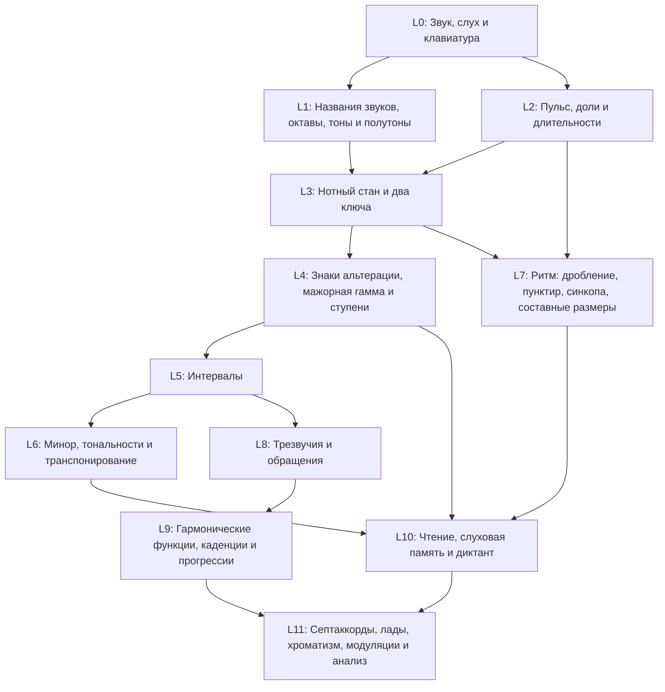

# Программа обучения сольфеджио для мобильного приложения

**Полная сборка: методика, карты курса, все уроки, вопросы преподавателю и модели данных.**

Уровней: 12 · уроков теории: 114 · микро-компетенций: 162 · тренажёров практики: 16 (90 стадий) · UI-шаблонов: 13 (в MVP 12) · уроков в MVP: 56 · аудиоэлементов: 15

_Собрано 2026-08-11 скриптом `validation/build-single-doc.py`. Частей: 27. Первая версия программы (242 урока) не входит: она заменена и разобрана в части 1._

## Содержание

1. Часть 1. Сравнительный аудит двух программ
2. Часть 2. Проверка методических утверждений
3. Часть 3. Что это за документ
4. Часть 4. Архитектура приложения: Теория и Практика
5. Часть 5. Правила работы со звуком
6. Часть 6. Модель прогресса, повторения и проверки знаний
7. Часть 7. Карта раздела «Теория»
8. Часть 8. Карта раздела «Практика»
9. Часть 9. Карта зависимостей
10. Часть 10. Состав MVP
11. Часть 11. Полные карточки уроков
12. Часть 12. Каталог микро-компетенций
13. Часть 13. Аудиоманифест
14. Часть 14. Источники
15. Часть 15. Передача в разработку
16. Часть 16. Вопросы преподавателю (полный список)
17. Часть 17. JSON Schema: урок
18. Часть 18. JSON Schema: микро-компетенция
19. Часть 19. JSON Schema: тренажёр практики
20. Часть 20. JSON Schema: аудиоэлемент
21. Часть 21. Данные: уровни и конфигурация
22. Часть 22. Данные: карта источников
23. Часть 23. Данные: аудиоманифест
24. Часть 24. Данные: тренажёры практики и UI-шаблоны
25. Часть 25. Данные: микро-компетенции
26. Часть 26. Данные: уроки
27. Часть 27. Отчёт валидации контента


---

# Часть 1. Сравнительный аудит двух программ

Дата аудита: 11 августа 2026.

## Что сравнивалось

| Обозначение | Документ | Объём | Формат |
|---|---|---|---|
| **A (Cursor)** | `docs/solfeggio-app-program/` (главы 00–15, `build/solfeggio-program-full.md`, `examples/*.json`) | 13 уровней (0–12), 242 урока, 58 механик, MVP 66 уроков / 37 механик, ~600–700 «микро-компетенций» | 16 Markdown-файлов, 2 JSON-урока, JSON Schema, сборка в HTML |
| **B (ChatGPT)** | `docs/solfeggio-app-program/input/chatgpt-solfege-program.pdf` (исходно `.docx`, версия 1.0 от 11.08.2026) | 12 уровней (0–11), 104 микроурока, 17 механик, MVP 42 урока + 4 контрольных блока | 99 страниц, двухколоночные таблицы уроков, 1 JSON-пример, 17 источников |
| **C (финал)** | `docs/solfeggio-app-program/final/` | 12 уровней (0–11), 114 теоретических уроков, 16 практических тренажёров (90 стадий), 13 UI-шаблона (12 в MVP), MVP 56 уроков | Markdown + HTML + валидируемый JSON |

Текст B извлечён полностью (99 страниц, 104 спецификации уроков, все таблицы разделов 6–12) — не только заголовки. Скрипт извлечения и промежуточный текст: `pypdf` → `input/chatgpt-solfege-program.pdf`.

Документы `Life Algorithm Training Algorithm Specification` и `PRD Life Algorithm Draft` в аудит не включались: к приложению сольфеджио не относятся.

---

## 0. Сводка: что взято откуда

| Что | Источник решения | Комментарий |
|---|---|---|
| Разделение «Теория / Практика» на уровне интерфейса и данных | **B** (прямая рекомендация в разделе 1), доработано в C | В A это отсутствовало: слуховые тренировки были вшиты в линейные уроки |
| Микро-компетенция как единица прогресса | **A**, но с укрупнением | В A ~600–700 записей, часть — искусственное дробление (по 1 ноте на компетенцию). В C — 162 |
| Ступеневый диктант в одной тональности как отдельная программа | **B** (уроки 40, 41 + строка каталога), развёрнуто в C до 12 стадий | В A это было 3 урока подряд без сценария и без защиты от абсолютной высоты |
| Четыре вида трезвучий отдельными уроками | **B** (уроки 60–63) | В A уменьшённое и увеличенное были свёрнуты в 2 урока из 20, без сравнительной практики |
| Параметризуемые шаблоны вместо каталога механик | **C** (новое) | A: 58 механик = 58 UI-задач. B: 17 механик без явного маппинга на UI |
| Уровни ритма как отдельный поток | **A** и **B** (совпадают) | В C сохранено: ритм — независимый трек с точками слияния |
| Типология ошибок и «ошибки как данные» | **B** (принцип 7) | В A была очередь ошибок, но без таксономии типов |
| Правила звука (повторы, скрытие нот, диапазоны, тембры) | **A** (детальнее) + **B** (компактная матрица) | В C объединено в таблицу с полями обоих |
| Модель мастерства с отложенной и переносной проверкой | **B** (немедленное / стабильность / перенос / скорость / уверенность) + **A** (FSRS) | В C: статусы + конфигурируемые интервалы, FSRS как реализация |
| Отказ от эмоциональных ярлыков «мажор весёлый / минор грустный» | **B** (прямое возражение) | В A уровень 0 строился на «светло / темно» — исправлено |
| Проверка гипотез на пилоте (functional-first vs interval-first) | **B** | В C вынесено в вопросы преподавателю как эксперимент |

---

## 1. Категория за категорией

Формат: где тема в A, где в B, предпосылки, глубина, задания, MVP, противоречия, решение в C, основание. Теги решений: `Общепринятый стандарт`, `Методический вариант`, `Продуктовая рекомендация`, `Требует проверки преподавателем`. Ссылки на источники — в `research-decisions.md`.

### 1.1. Звук до нотной записи

- **A:** уровень 0, уроки 0.1–0.10 (10 уроков): свойства звука, выше/ниже, контур, пульс, сильная доля, длительность, тоника, мажор/минор, тембр, контроль. Предпосылки: нет. Задания: `EX-01`–`EX-09`. MVP: да.
- **B:** уровень 0, уроки 1–8: тон vs шум, высокий/низкий, длинный/короткий, громкость и тембр, контур, группы чёрных клавиш, До, пульс. Предпосылки: нет. MVP: да, все 8.
- **Расхождение:** A даёт на уровне 0 ладовую окраску (мажор/минор) и тонику; B выносит их на уровни 4–5, зато включает в уровень 0 клавиатуру. A использует эмоциональные ярлыки «светлое/тёмное»; B прямо называет это методически неточным.
- **Решение в C:** уровень 0 = 8 уроков: музыкальный тон и шум, выше/ниже, долго/коротко, громко/тихо и тембр, контур мелодии, пульс, сильная доля (2 или 3), группы клавиш и До. Мажор/минор и тоника **переносятся** в практику как ранний слуховой тренажёр (`PR-06` стадия 1) и в теорию уровня 4 (тоника) и 6 (мажор/минор как лад). Формулировки «весёлый/грустный» запрещены; вводится «устойчиво / требует продолжения» и «третья ступень выше или ниже».
- **Основание:** `Общепринятый стандарт` — RCM Preparatory A требует различать качество трезвучия на слух в самом начале, значит слуховой контраст мажор/минор возможен рано; но это слуховая тренировка, а не тема теории. Эмоциональная маркировка — `Методический вариант`, отвергнутый по аргументу B.

### 1.2. Клавиатура

- **A:** уровень 1, уроки 1.1–1.2 (устройство, До) + вся навигация в 1.3–1.9. MVP: да.
- **B:** уровень 0, уроки 6–7 (группы 2+3, До). MVP: да.
- **Расхождение:** только размещение. A тратит 14 уроков уровня 1 на клавиатуру и имена; B — 2 урока в уровне 0 плюс имена в уровне 1.
- **Решение в C:** клавиатура — в уровне 0 (2 урока: группы, До), имена звуков — уровень 1. Клавиатура становится основным устройством ввода для 6 шаблонов упражнений.
- **Основание:** `Продуктовая рекомендация`. Клавиатура нужна как инструмент ответа раньше, чем как тема; это подтверждается устройством Duolingo Music (экранная клавиатура с первого юнита).

### 1.3. Названия нот

- **A:** уроки 1.2–1.5 (до-ре-ми, фа-соль-ля-си, звукоряд), 1.8 (буквенные C-D-E). Двойная подпись «до / C» с переключателем.
- **B:** урок 9 (цикл семи названий), буквенные имена как «абсолютные ярлыки записи».
- **Расхождение:** A предлагает показывать оба обозначения сразу; B — использовать слоговые как абсолютные, а номера ступеней и movable-do — для функционального слуха. Вопрос B/H в A помечен как неопределённый, в B — как вопрос преподавателю.
- **Решение в C:** 3 урока (до-ре-ми, фа-соль-ля-си + звукоряд, буквенные имена как второй слой). Абсолютные имена = слоговые + буквенные (настройка), относительные = **номера ступеней 1–7** как основной интерфейс. B/H — конфигурация с дефолтом «си = B, си-бемоль = B♭» и явным пояснением про H.
- **Основание:** `Требует проверки преподавателем` (B/H и язык интерфейса), `Продуктовая рекомендация` (номера как основной слой — снимает зависимость продукта от спора movable-do / fixed-do).

### 1.4. Нотный стан

- **A:** уроки 3.1 (стан), 3.13 (правила записи). Предпосылки: имена нот.
- **B:** урок 11 (пять линий, четыре промежутка). Предпосылка: направление высоты.
- **Расхождение:** несущественное. A подробнее (отдельный урок про штили).
- **Решение в C:** 2 урока (стан и вертикальная метафора; правила записи — штиль, положение головки). Предпосылка — направление высоты (B) *и* имена нот (A).
- **Основание:** `Общепринятый стандарт` (ABRSM Grade 1, п. 3: «The stave»).

### 1.5. Скрипичный и басовый ключи

- **A:** уровень 3 (18 уроков, скрипичный, по 2 ноты за урок) + уровень 4 (12 уроков, басовый, grand staff). Итого 30 уроков на чтение.
- **B:** уроки 12–16 (5 уроков: опорная Соль, C4–G4, A4–C5, опорная Фа, grand staff). Итого 5 уроков.
- **Расхождение:** десятикратная разница в объёме. A даёт по 2 ноты за урок и добавляет отдельные уроки на автоматизацию; B укладывает оба ключа в 5 уроков и переносит нагрузку на практику.
- **Решение в C:** **10 уроков теории** (стан, ключ Соль, опоры, C4–G4, A4–G5 с добавочными, правила записи, ключ Фа, C3–C4, grand staff и среднее До, чтение в ритме) + **тренажёр `PR-08` «Чтение нот» с 6 стадиями** и скоростными раундами. Автоматизация уходит в практику, а не в теорию.
- **Основание:** `Продуктовая рекомендация`. Дробление A по 2 ноты создаёт 30 почти одинаковых уроков — это не педагогика, а повторение, которому место в тренажёре; 5 уроков B недостаточны для введения двух ключей с добавочными линиями и правилами записи.

### 1.6. Октавы и регистры

- **A:** уроки 1.6 (октава), 1.7 (номера октав, C4).
- **B:** урок 10 (октавы и регистр).
- **Решение в C:** 1 урок «Октавы, регистры и C4» + вторичное закрепление в чтении добавочных линий. Нумерация: научная (C4) в данных, «первая октава» в русском интерфейсе как подпись.
- **Основание:** `Требует проверки преподавателем` (какая система нумерации в UI).

### 1.7. Пульс, метр и ритм

- **A:** уроки 0.4–0.6, 2.1–2.5, 2.14–2.16.
- **B:** урок 8 (пульс), 17 (доля и такт), 23 (сильная и слабая доля).
- **Расхождение:** A разводит «доля/темп» и «такт/размер» на 5 уроков, B — на 2. B явно вводит «метрический акцент» отдельным понятием и требует расстановки тактовых черт по услышанным акцентам — сильнее как задание.
- **Решение в C:** 3 урока (доля, темп и метроном; такт и размеры 2/4 и 3/4; метрический акцент и размер 4/4) + тренажёр `PR-09`.
- **Основание:** `Общепринятый стандарт` (ABRSM Aural 1A: хлопать пульс и определять 2/3-дольность).

### 1.8. Длительности и паузы

- **A:** уроки 2.6–2.12 (7 уроков: четверть, половинная, целая, восьмые, группировка, паузы, точка, лига).
- **B:** уроки 18, 19, 21, 22 (4 урока).
- **Решение в C:** 4 урока (четверть, половинная и целая; восьмые и вязка; паузы; точка и лига). Затакт — отдельный урок (в A есть 2.13, в B отсутствует как урок, хотя ABRSM вводит upbeat на Grade 3).
- **Основание:** `Общепринятый стандарт` (ABRSM Grades 1–3: значения нот, паузы, точка, лига, upbeat opening).

### 1.9. Размеры

- **A:** 2.4, 2.5 (2/4, 3/4, 4/4), 8.11–8.14, 8.17 (6/8, 9/8, 12/8, 3/8, 2/2, 6/4, 5/4, 7/8).
- **B:** 20 (2/4, 3/4, 4/4), 25 (6/8), 103 (9/8, 12/8, 5/8, 7/8, переменный).
- **Расхождение:** A вводит 6/8 на уровне 8, B — на уровне 2 (в MVP-зоне, но с рекомендацией переноса в v1.1). B помещает несимметричные размеры в последний уровень вместе с «сложным ритмом» — компактнее.
- **Решение в C:** простые размеры — уровень 2 (2 урока); составные и несимметричные — уровень 7 «Ритм 2» (6/8; 6/8 против 3/4; 9/8 и 12/8; 3/8, 2/2, 6/4; 5/4 и 7/8). 6/8 **не входит** в MVP.
- **Основание:** `Общепринятый стандарт` (ABRSM: 6/8 с Grade 3; Trinity — то же), `Продуктовая рекомендация` (вне MVP).

### 1.10. Знаки альтерации

- **A:** 1.12 (диез/бемоль как клавиши), 5.2–5.4 (в записи, действие в такте, дубль-знаки).
- **B:** 29 (диез, бемоль, бекар), 30 (энгармонизм).
- **Расхождение:** A разделяет «физический» знак (клавиатура) и «письменный» (стан) — методически ценно и в B отсутствует.
- **Решение в C:** 2 урока на уровне 1 (чёрные клавиши как диез/бемоль; энгармонизм на клавиатуре) + 3 урока на уровне 4 (знаки в записи и действие до конца такта; энгармонизм и дубль-знаки; тон/полутон на стане).
- **Основание:** `Общепринятый стандарт` (ABRSM Grade 1: «Sharp, flat and natural signs, and their cancellation»; Grade 4: double sharps/flats, enharmonic equivalents).

### 1.11. Тоны и полутоны

- **A:** 1.10, 1.11 (клавиатура), 5.1 (стан).
- **B:** 27, 28 (полутон, тон и естественные полутоны Ми–Фа, Си–До).
- **Решение в C:** 2 урока в уровне 1 (полутон; тон и естественные полутоны) + 1 урок в уровне 4 (тон/полутон на стане, диатонический и хроматический полутон).
- **Основание:** `Общепринятый стандарт` (ABRSM Grade 1 «semitones and tones»; RCM Level 1 «half steps… whole steps»).

### 1.12. Мажорная гамма

- **A:** 5.5–5.9 (формула, До мажор, Соль, Фа, Ре мажор).
- **B:** 36 (формула), 42 (Соль и Фа мажор).
- **Расхождение:** A даёт по уроку на тональность (4 урока), B — один урок на две тональности.
- **Решение в C:** 3 урока (формула Т-Т-П-Т-Т-Т-П; До мажор и тетрахорды; Соль и Фа мажор + первые ключевые знаки) + тренажёр построения гамм (`PR-05`).
- **Основание:** `Общепринятый стандарт` (ABRSM Grade 1: construction of the major scale, keys C, G, D, F).

### 1.13. Минор и три вида минора

- **A:** 7.1–7.3, 7.6–7.8 (натуральный, гармонический, мелодический + слух).
- **B:** 43–50 (весь уровень 5: мажор/минор как лад, натуральный, параллельные, одноимённые, гармонический, мелодический, ступени в ля миноре, контроль).
- **Расхождение:** B явно оговаривает «мелодический минор: вверх повышенные VI и VII, вниз натуральный вид в классической традиции» и отдельно упоминает джазовый вариант как вопрос преподавателю — точнее, чем A.
- **Решение в C:** 5 уроков (мажор и минор: разница III ступени; натуральный минор; ля минор и его ступени; гармонический минор; мелодический минор с оговоркой о нисходящей форме).
- **Основание:** `Общепринятый стандарт` (ABRSM Grade 2 — harmonic minor, Grade 3 — melodic minor; Trinity Grade 2 — harmonic и natural/Aeolian, Grade 3 — melodic). `Требует проверки преподавателем`: джазовый мелодический минор.

### 1.14. Ступени и тональный центр

- **A:** 5.13–5.15 (номера, названия, устойчивость, тяготение).
- **B:** 35 (тоника), 37 (ступени и номера), 38 (устойчивые 1–3–5), 39 (неустойчивые и тяготения).
- **Расхождение:** B отводит тонике отдельный урок и раньше связывает ступени со слухом. A даёт полные русские названия ступеней (медианта, субмедианта…), которых у B нет.
- **Решение в C:** 4 урока (тоника как центр; формула гаммы; ступени I–VII: номера и названия; устойчивые/неустойчивые и тяготения). Полные названия ступеней вводятся, но помечены как второстепенные (в ABRSM technical names появляются только на Grade 4).
- **Основание:** `Общепринятый стандарт` (ABRSM Grade 1: degrees of scale by number; Grade 4: technical names).

### 1.15. Ступеневый слух и ступеневый диктант

- **A:** 5.16–5.19 (4 урока: I/III/V → +VII, II → все семь → попевки). Правила аудио прописаны (каденция, скрытые ноты, смена тоники). Но: нет сценария стадий, нет условий переноса в другие тональности, нет явной защиты от абсолютной высоты как требования данных.
- **B:** 40, 41 (2 урока: диктант 1–2–3–5 и все ступени в До мажоре) + строка в каталоге механик + **полный JSON-пример** урока диктанта ступеней с каденционным контекстом, `allowed_degrees`, `replays_free`, `show_notation_before_answer: false`, объяснениями каждого дистрактора и `required_degree_coverage`.
- **Расхождение:** A подробнее методически, B точнее как спецификация данных. Ни в A, ни в B нет полной лестницы сложности до последовательностей ступеней и переноса в другие тональности.
- **Решение в C:** отдельный тренажёр `PR-01` «Ступеневый диктант в одной тональности» с **12 стадиями** (тоника → I/V → I/III/V → +II → +IV → +VI → +VII → все семь → пары ступеней → 3–4 ступени → ступени с простым ритмом → перенос в G/F/D) + 2 теоретических урока (метод «скатись к тонике»; ступени в миноре). Каждая стадия описана 16 полями (контекст, повторы, видимость нот и клавиатуры, формат ответа, MIDI-диапазон, регистр, тембр, длительность, пауза, рост сложности, feedback, критерии, cold review, защита от абсолютной высоты).
- **Основание:** `Продуктовая рекомендация`, опирающаяся на Karpinski 2021 (tonic inference — первичный процесс восприятия) и на формат RCM/ABRSM (тональный контекст перед заданием). Полная спецификация — в `practice-course-map.md`.

### 1.16. Интервалы

- **A:** уровень 6, 24 урока, **после** мажорной гаммы, минора и квинтового круга (уровень 6 идёт после 5, но интервальный слух — только после ступеневого). Утверждение A: «качество интервалов появляется только на Grade 4–5 во всех системах».
- **B:** уровень 3, 8 уроков (полутон, тон, знаки, энгармонизм, число ступеней, чистые, большие/малые, обращение) — **до** мажорной гаммы; плюс уровень 6 (8 уроков) на слух и функцию.
- **Расхождение — принципиальное и с фактической ошибкой в A.** Проверка по первичным силлабусам:
  - ABRSM Grade 1: интервалы «2nd…8ve, above the tonic only», плюс «semitones and tones»; **Grade 3: major 2nd, minor/major 3rd, perfect 4th/5th, minor/major 6th/7th, perfect 8ve above the tonic** — то есть качество появляется на **Grade 3**, а не 4–5.
  - Trinity Grade 1: «Intervals (as a number only — unison, 2nd, 3rd, 4th, 5th and octave above C, F or G)»; **Grade 2: unison, major/minor 2nd, major/minor 3rd, perfect 4ths, 5ths and octaves above any tonic for the grade** — качество на **Grade 2**.
  - RCM Levels 1–2: «numerical size only»; **Level 3: per 1, maj 2, maj 3, min 3, per 4, per 5, maj 6, maj 7, per 8 above the tonic of required major keys** — качество на **Level 3**.
  - Во всех трёх системах качество определяется **над тоникой тональности**, то есть предполагает уже введённую мажорную гамму.
- **Решение в C:** интервал **число ступеней** — уровень 1–4 (после имён нот и тонов/полутонов, как измерение); интервал **качество** — уровень 5, сразу после мажорной гаммы (уровень 4), 10 уроков; **слуховая дискриминация пар интервалов** (м3/б3, ч4/ч5) — в практике с самого начала, не дожидаясь уровня 5.
- **Основание:** `Общепринятый стандарт` с исправленной атрибуцией: ABRSM Grade 3, Trinity Grade 2, RCM Level 3 — и всегда «above the tonic». Утверждение A о «Grade 4–5» **опровергнуто** и удалено. Размещение интервалов B **до** гаммы также отклонено: качество нельзя определить «над тоникой», если тоники ещё нет.

### 1.17. Ранний слух интервалов

- **A:** запрещал интервальный слух до уровня 6.
- **B:** рекомендует «сначала контур и простые интервальные расстояния».
- **Проверка:** **RCM Level 1 Ear Tests: определить на слух малую и большую терцию (вверх и вниз), одно проигрывание**; Level 2 добавляет чистую квинту; Level 3 — чистую кварту. Одновременно на Level 1 требуется определить качество трезвучия (мажор/минор).
- **Решение в C:** тренажёр `PR-03` «Интервалы на слух» открывается стадиями: (1) шире/уже, (2) м3 vs б3, (3) + ч5, (4) + ч4 — доступен уже в MVP параллельно уровню 2, задолго до теории интервалов. Названия «м3/б3» при этом даются как ярлыки звучания, а полное объяснение качества — на уровне 5.
- **Основание:** `Общепринятый стандарт` (RCM Piano Syllabus 2022, Level 1–3 Ear Tests). Позиция A была излишне жёсткой.

### 1.18. Тональности и ключевые знаки

- **A:** 5.10–5.12 (ключевые знаки, порядок, определение тональности), 7.10–7.14.
- **B:** 67, 68, 71 (ключевые знаки, порядок диезов/бемолей, определение тональности мелодии).
- **Решение в C:** 3 урока (ключевые знаки и почему они при ключе; порядок диезов и бемолей; определение тональности по знакам, финальной ноте и устойчивым оборотам) в уровне 6.
- **Основание:** `Общепринятый стандарт`.

### 1.19. Квинтовый круг

- **A:** 7.11–7.13 (3 урока).
- **B:** 69, 70 (2 урока: круг мажора, параллельный минор на круге).
- **Решение в C:** 1 урок «Квинтовый круг: мажор и параллельный минор» + тренажёр-сборка круга. Круг систематизирует уже известное, поэтому дробить его на 3 урока незачем.
- **Основание:** `Продуктовая рекомендация` (зависимость B: «Круг систематизирует известные тональности, не заменяет их построение» — согласен).

### 1.20. Трезвучия (обязательное требование задачи)

- **A:** 9.1–9.8: трезвучие, мажорное, минорное, слух мажор/минор, уменьшённое, увеличенное, слух 4 видов, построение. Уменьшённое и увеличенное — по одному уроку без сравнительной практики; нет урока «исправь неправильно построенный аккорд».
- **B:** 59–66: трезвучие как две терции, большое, малое, уменьшённое, увеличенное, обращения, трезвучия на ступенях, слуховой контроль. Терминология «большое/малое» с указанием формул M3+m3 / m3+M3 / m3+m3 / M3+M3.
- **Расхождение:** B точнее в терминологии (русские «большое/малое» + международные) и даёт отдельный слуховой контроль; A даёт больше построения.
- **Решение в C:** **11 уроков** уровня 8: (1) трезвучие как две терции и три тона аккорда; (2) большое (мажорное) `0–4–7`; (3) малое (минорное) `0–3–7`; (4) сравнение большого и малого (слух + исправление); (5) уменьшённое `0–3–6`; (6) увеличенное `0–4–8`; (7) сравнительная практика всех четырёх видов + «найди ошибку в построении»; (8) первое обращение (секстаккорд); (9) второе обращение (квартсекстаккорд); (10) трезвучия на ступенях мажора I ii iii IV V vi vii°; (11) трезвучия на ступенях минора и буквенные обозначения. Для каждого вида обязательны: строение, построение от звука, построение на стане, построение на клавиатуре, одновременное звучание, арпеджио вверх и вниз, сравнение двух видов, распознавание на слух, определение по записи, исправление ошибки, основной вид и два обращения, связь со ступенями, критерии освоения, параметры аудиогенерации.
- **Основание:** прямое требование задачи + `Общепринятый стандарт` (RCM Level 1 — качество трезвучия на слух; ABRSM Grade 1 — тоническое трезвучие, Grade 5 — обращения; Trinity Grade 2 — триады).

### 1.21. Обращения трезвучий

- **A:** 9.9–9.12 (4 урока).
- **B:** 64 (1 урок на оба обращения).
- **Решение в C:** 2 урока (секстаккорд; квартсекстаккорд) + слуховая стадия в `PR-06`. Один урок на два обращения (B) недостаточен: бас меняется дважды и путаница между ними — типовая ошибка; 4 урока (A) избыточны.
- **Основание:** `Методический вариант`; поддержано данными о том, что ступеневый метод даёт преимущество именно на обращениях.

### 1.22. Гармонические функции

- **A:** 10.1–10.4.
- **B:** 75, 76 (T–S–D; доминанта и вводный тон).
- **Решение в C:** 2 урока (T–S–D как три состояния; доминанта и вводный тон VII→I) + тренажёр `PR-12`.
- **Основание:** `Общепринятый стандарт` (ABRSM Grade 3–4: доминанта и субдоминанта; RCM Level 4: тоника и доминанта).

### 1.23. Каденции

- **A:** 10.9–10.14 (6 уроков).
- **B:** 77, 78 (2 урока: автентическая и половинная; плагальная и прерванная).
- **Решение в C:** 2 урока по схеме B + слуховая стадия. Разносить 4 каденции на 6 уроков не оправдано: они различаются одним параметром (последний аккорд).
- **Основание:** `Общепринятый стандарт` (ABRSM Grade 5 — cadences; RCM — authentic, half, plagal). Терминология authentic/perfect — `Требует проверки преподавателем`.

### 1.24. Септаккорды

- **A:** 11.1–11.8 (8 уроков).
- **B:** 93–96 (4 урока: септаккорд, V7, обращения V7, пять типов).
- **Решение в C:** 5 уроков (септаккорд как четыре звука; D7; обращения D7; пять типов maj7/m7/7/m7♭5/dim7; вводные септаккорды и их разрешение).
- **Основание:** `Общепринятый стандарт` (ABRSM Grade 5+; RCM Level 5 — dominant 7th, Level 8 — diminished 7th).

### 1.25. Транспонирование

- **A:** 5.6, 5.21, 7.19 (3 урока).
- **B:** 72, 73 (2 урока: по интервалу и по ступеням).
- **Решение в C:** 2 урока по схеме B (транспонирование по интервалу; транспонирование по ступеням) — различение этих двух способов методически ценнее, чем деление по числу знаков.
- **Основание:** `Общепринятый стандарт` (ABRSM Grade 3 — транспонирование на октаву; RCM Level 6 — «up by any interval»; Trinity Grade 5 — «up or down any major, minor or perfect interval»).

### 1.26. Чтение с листа

- **A:** 3.6, 3.15, 12.1–12.6 (8 уроков).
- **B:** 83–86 (предслышание, ритмическое чтение, чтение по ступеням, скачки по трезвучию).
- **Расхождение:** B вводит «предслышание перед исполнением» как отдельный навык — этого в A нет, а это ключевой элемент методики чтения.
- **Решение в C:** 1 урок в уровне 3 («ноты и ритм вместе») + 4 урока в уровне 10 (предслышание и алгоритм; чтение по ступеням; скачки по трезвучию; чтение в двух ключах) + тренажёр `PR-13` с 5 стадиями.
- **Основание:** `Общепринятый стандарт` (ABRSM Aural 4B/5B — пение с листа; RCM Sight Reading).

### 1.27. Сольфеджирование

- **A:** 12.7–12.14 (8 уроков, микрофон обязателен, порог ±50 центов).
- **B:** механика «пение без автооценки» — пользователь поёт, затем слышит эталон и честно оценивает себя; автооценка отложена до калибровки и пилота.
- **Решение в C:** 1 урок «Listen–sing–reveal: как петь без микрофона» + тренажёр `PR-14` (4 стадии, самооценка). Автоматическая оценка высоты — post-MVP, отдельный трек.
- **Основание:** `Продуктовая рекомендация` (совпадение обеих версий по рискам микрофона; в MVP микрофон не требуется по условию задачи).

### 1.28. Ритмический диктант

- **A:** 2.17, 8.15, 8.16, 12.16.
- **B:** 88 (запись длительностей по слуху).
- **Решение в C:** 1 урок метода (уровень 10) + тренажёр `PR-10` (5 стадий: 1 такт → 2 такта → с паузами и точкой → 4 такта → составной размер). Первая стадия входит в MVP.
- **Основание:** `Общепринятый стандарт` (ДМШ: диктант с 1–2 класса; RCM: clapback как слуховая основа).

### 1.29. Мелодический диктант

- **A:** 3.17, 7.16–7.18, 12.15.
- **B:** 89 (диктант ступеней 1–2–3–5), 90 (полный звукоряд).
- **Расхождение:** B последовательно строит диктант на ступенях (совместимо с `PR-01`); A строит на нотной записи.
- **Решение в C:** 2 урока метода + тренажёр `PR-11` (5 стадий: ступени 1–3–5 → 1–2–3–5 → все ступени → ступени + ритм → запись на стане). Запись на стане — только последняя стадия и вне MVP.
- **Основание:** `Продуктовая рекомендация`; согласуется с Karpinski (сначала tonic inference и ступени, «прото-нотация», потом нотная запись).

### 1.30. Гармонический слух

- **A:** 10.5, 10.19, 10.20 (бас, римские цифры).
- **B:** 82 (гармонический диктант римскими цифрами), 79–81 (прогрессии, гармонизация).
- **Замечание аудита:** Chenette 2021 прямо критикует римские цифры и обозначения обращений как перцептивно абстрактные — задание «запиши римские цифры» тренирует логику, а не слух.
- **Решение в C:** 3 урока прогрессий + 1 урок гармонизации + 1 урок метода гармонического диктанта; в тренажёре `PR-12` ответ даётся **сначала функциями (T/S/D) и басовой линией**, и только на верхних стадиях римскими цифрами.
- **Основание:** `Методический вариант` (Chenette 2021 против доминирования римских цифр в слуховых заданиях).

### 1.31. Лады

- **A:** 11.9–11.14 (6 уроков, включая пентатонику и блюз).
- **B:** 97, 98 (2 урока: семь ладов; характерные ступени).
- **Решение в C:** 3 урока (диатонические лады как «гамма с другим центром»; характерные ступени ладов; пентатоника и блюзовая гамма).
- **Основание:** `Общепринятый стандарт` (Trinity Grade 5 — pentatonic; RCM Level 6–8 — whole-tone, pentatonic, blues; ABRSM — chromatic на Grade 4).

### 1.32. Хроматизм

- **A:** 11.15, 11.16, 11.17.
- **B:** 99 (хроматические проходящие звуки).
- **Решение в C:** 2 урока (хроматическая гамма и правила записи; проходящие и вспомогательные хроматизмы) + характерные интервалы гармонического минора внутри уровня 5.
- **Основание:** `Общепринятый стандарт` (ABRSM Grade 4 — chromatic scale; Trinity Grade 4 — chromatic).

### 1.33. Модуляции

- **A:** 11.18–11.21.
- **B:** 100 (вторичные доминанты), 101 (отклонение и модуляция), 102 (пивот-аккорд).
- **Решение в C:** 3 урока по схеме B (вторичные доминанты; отклонение против модуляции; родственные тональности и общий аккорд).
- **Основание:** `Общепринятый стандарт` (Trinity Grade 6+ — pivot chords, modulation; ABRSM Grade 6+).

### 1.34. Сложный ритм

- **A:** уровень 8 целиком (18 уроков).
- **B:** уроки 24, 26, 103 (шестнадцатые, синкопа, несимметричные размеры).
- **Решение в C:** уровень 7 «Ритм 2», 8 уроков (шестнадцатые; комбинации восьмая+две шестнадцатые; пунктир; синкопа; триоль; 6/8; 6/8 против 3/4; 9/8, 12/8, 3/8, 2/2 и несимметричные 5/4, 7/8).
- **Основание:** `Общепринятый стандарт` (ABRSM Grades 2–5; Trinity Grades 2–5).

### 1.35. Музыкальный анализ

- **A:** 11.22, 11.23, 12.18.
- **B:** 104 (анализ фрагмента: форма, тональность, гармония, фактура, мотив).
- **Решение в C:** 2 урока (форма: мотив, фраза, предложение, период; анализ фрагмента по чек-листу).
- **Основание:** `Общепринятый стандарт` (Trinity — analysis с Grade 1; ABRSM Grade 5 — вопросы по фрагменту).

### 1.36. Система повторения

- **A:** FSRS (DSR-модель), профили `desired_retention` по типу навыка, «холодная» проверка ≥24 ч, дневной лимит 40%, «сестринские» навыки.
- **B:** фиксированный граф 1 → 3 → 7 → 14 → 30 дней как «стартовая эвристика», scheduler сокращает/увеличивает интервал; 70/20/10 состав ежедневного микса; ошибка возвращается в конце сессии, затем на следующий день, затем через 3 дня.
- **Расхождение:** A выбирает алгоритм, B — политику. Не противоречат, а дополняют.
- **Решение в C:** политика B (граф 1/3/7/14/30, состав микса 70/20/10, судьба ошибки) как **конфигурация**, алгоритм A (FSRS) как реализация планировщика; все интервалы и пороги — в `data/levels.json` → `review_policies`, не зашиты в уроки.
- **Основание:** `Продуктовая рекомендация` + `Общепринятый стандарт` по spacing/retrieval (Cepeda 2006/2008; Rawson & Dunlosky 2022 — successive relearning).

### 1.37. Диагностика и уровневые экзамены

- **A:** входная диагностика 12–20 заданий по 4 осям, тест-аут модуля/уровня с порогом 90%, контроль уровня 85%, экзамены этапов, периодический аудит.
- **B:** диагностика 5–7 минут; чтобы пропустить блок — 4–6 заданий в двух представлениях + контроль переноса, ≥90%; checkpoint каждые 3–4 урока (6 заданий); экзамен уровня 12–20 заданий; challenge для пропуска с новым контентом.
- **Расхождение:** B добавляет **checkpoint каждые 3–4 урока** (в A их нет) и требование «перенос в двух представлениях» для пропуска — сильнее.
- **Решение в C:** диагностика (14 заданий, 4 оси, не выдаёт `mastered`), checkpoint каждые 3–4 урока, экзамен уровня (12–20 заданий, три блока: слух / построение-запись / перенос), challenge для пропуска (≥90% + перенос), периодический аудит 30 дней. Все пороги — в конфиге.
- **Основание:** `Продуктовая рекомендация`; пороги 85/80/75 — гипотеза, `Требует проверки преподавателем`.

### 1.38. Модель данных

- **A:** 2 полностью заполненных JSON-урока + JSON Schema + фрагмент каталога навыков; генераторы заданий внутри урока; хранение звука как MIDI-параметров.
- **B:** 1 JSON-пример (диктант ступеней) с разделением `level` / `lesson` / `audio` / `questions` / `completion` / `telemetry`, объяснениями дистракторов и `required_degree_coverage`.
- **Расхождение:** A даёт схему и валидацию, B — более удачную структуру блока `audio` (`context` + `target` + `replays_free` + `show_notation_before_answer`) и телеметрию.
- **Решение в C:** 4 схемы (`lesson`, `competency`, `exercise`, `audio-item`) + 6 файлов данных, **все** уровни, компетенции, уроки и упражнения в JSON, автоматическая валидация (уникальность ID, существование ссылок, отсутствие циклов, корректность MIDI и формул).
- **Основание:** прямое требование задачи; структура `audio` взята из B, дисциплина схем и валидации — из A.

### 1.39. Состав MVP

- **A:** 66 уроков (уровни 0–3 + мини-модуль «До мажор»), 37 механик.
- **B:** 42 урока (уровни 0–4 целиком + 4 урока трезвучий) + 4 контрольных блока, 17 механик, из них MVP-класс A.
- **Расхождение:** B включает в MVP ступеневый диктант и четыре трезвучия, но исключает 6/8 и синкопу; A включает больше нотного чтения, но не доходит до трезвучий.
- **Решение в C:** **56 уроков**: уровень 0 (8) + уровень 1 (7) + уровень 2 (8) + уровень 3 (10) + уровень 4 (11) + подмножество уровня 5 (4: число ступеней, ч4/ч5, секунды, терции) + подмножество уровня 8 (7: трезвучие как две терции, большое, малое, сравнение, уменьшённое, увеличенное, сравнительная практика четырёх видов) + первый урок ритмического диктанта (`L10-05`). Плюс 12 тренажёров (в т. ч. `PR-01` полностью) и 12 UI-шаблонов.
- **Основание:** `Продуктовая рекомендация`. Логика: четыре трезвучия дают несоразмерно высокую воспринимаемую ценность («я слышу аккорды») при нулевой новой UI-стоимости (тот же chord builder + audio choice), но требуют предварительных терций — поэтому в MVP добавлены 4 интервальных урока. 6/8, синкопа, минор, квинтовый круг, обращения, функции из MVP исключены.

### 1.40. Что было только в одной версии и сохранено в C

| Тема | Только в | Решение |
|---|---|---|
| Тон vs шум (что такое музыкальный звук) | B (урок 1) | Сохранено: урок 0.1 |
| Метрический акцент как отдельное понятие + разметка тактов по слуху | B (урок 23) | Сохранено: урок 2.3 |
| Предслышание перед исполнением | B (урок 83) | Сохранено: урок 10.1 |
| Эхо-мелодия на клавиатуре (слуховая память) | B (урок 87) | Сохранено: `PR-11` стадия 1 + урок 10.4 |
| Вторичные доминанты | B (урок 100) | Сохранено: урок 11.10 |
| Типология ошибок как данные | B (принцип 7) | Сохранено: `error_tags` в схеме упражнения |
| Затакт | A (урок 2.13) | Сохранено: урок 2.9 |
| Правила записи (штиль, положение головки) | A (урок 3.13) | Сохранено: урок 3.8 |
| Диатонический и хроматический полутон | A (урок 5.1) | Сохранено: урок 4.1 |
| Дубль-диез и дубль-бемоль | A (урок 5.4) | Сохранено: урок 4.3 |
| Консонанс и диссонанс | A (6.15) и B (57) | Сохранено: урок 5.10 |
| Характерные интервалы гармонического минора | A (11.17) | Сохранено: урок 5.11 (тритон и характерные интервалы) |
| Скоростные раунды на автоматизацию чтения | A (`EX-56`) | Сохранено: `PR-08` как режим тренажёра |
| Профили удержания по типу навыка | A | Сохранено в `review_policies`, но помечено как гипотеза |
| Матрица «правильно/неправильно» для сравнительного аудио | A (8.3.10) и B (правила обратной связи) | Сохранено: обязательное `compare_audio` в feedback второй ошибки |
| Доступность (цвет не единственный код, визуальный метроном, режим без микрофона) | B (принцип 9) | Сохранено в `implementation-handoff.md` |
| Авторские права на аудиоматериал | B (риски) | Сохранено в вопросах и в `audio-manifest.json` (`license`) |

### 1.41. Что было в одной из версий и сознательно отклонено

| Что | Откуда | Почему отклонено |
|---|---|---|
| «Мажор весёлый / минор грустный», «светло/темно» как основной ярлык | A (урок 0.8) | Методически неточно (аргумент B); заменено на структурное объяснение (III ступень) и «устойчиво / требует продолжения» |
| Утверждение «качество интервалов — только Grade 4–5» | A (глава 01, вывод В2) | Опровергнуто первичными силлабусами: Trinity Grade 2, ABRSM Grade 3, RCM Level 3 |
| Запрет интервального слуха до уровня 6 | A | Опровергнуто RCM Level 1 Ear Tests (m3/M3 на слух с одного проигрывания) |
| la-based minor как основной | A (спорный вопрос Р2) | Karpinski 2021: do-based minor точнее моделирует tonic inference. Переведено в конфигурацию, основной интерфейс — номера ступеней |
| Интервалы (включая качество) до мажорной гаммы | B (уровень 3) | Качество во всех системах определяется «above the tonic», значит требует гаммы |
| 30 уроков на чтение двух ключей по 2 ноты | A (уровни 3–4) | Это тренировка, а не теория: перенесено в тренажёр `PR-08` |
| 58 механик как 58 UI-компонентов | A (глава 09) | Заменено 13 параметризуемыми шаблонами |
| ~600–700 микро-компетенций | A (глава 11) | Искусственное дробление (по одной ноте на компетенцию). В C — 162 компетенции с диагностической ценностью |
| Одинаковый шаблонный feedback во всех уроках | B (все 104 урока) | Прямо запрещено требованиями: feedback должен учитывать характер конкретной ошибки |
| Микрофон и автооценка пения в MVP | A (v1.3, но с уроками в уровне 12) | В MVP исключено полностью; `listen–sing–reveal` без оценки |
| Отдельный урок на каждую тональность (C, G, F, D) | A (5.6–5.9) | Свёрнуто в 2 урока + тренажёр построения гамм |
| 6 уроков на 4 каденции | A (10.9–10.14) | Свёрнуто в 2 урока: различие — один аккорд |

---

## 2. Итоговые количественные изменения

| Показатель | A (Cursor) | B (ChatGPT) | C (финал) | Причина |
|---|---|---|---|---|
| Уровней | 13 | 12 | 12 | Уровень 12 (интеграция) в A дублировал практику; в C интеграция — уровень 10 + тренажёры |
| Уроков теории | 242 | 104 | 114 | Дробление A убрано, но добавлены обязательные уроки (4 вида трезвучий, сравнительная практика, метрический акцент, предслышание, правила записи) |
| Практических тренажёров | — (58 механик внутри уроков) | — (17 механик в каталоге) | 16 тренажёров, 90 стадий | Практика выделена в отдельный раздел приложения |
| UI-шаблонов | 58 | 17 | 13 (12 в MVP) | Различия задаются данными |
| Микро-компетенций | ~600–700 | не перечислены (skill_ids упомянуты) | 162 | Диагностическая ценность вместо количества |
| Уроков в MVP | 66 | 42 | 56 | Пересчёт по ценности/стоимости |
| Микрофон в MVP | нет | нет | нет | Совпадение |
| Стадий ступеневого диктанта | 3 урока | 2 урока | 12 стадий + 2 урока | Обязательное требование задачи |
| Уроков на 4 вида трезвучий | 6 (из 20) | 5 (из 8) | 11 | Обязательное требование задачи |

---

## 3. Обнаруженные противоречия между версиями (полный список)

| № | Противоречие | Позиция A | Позиция B | Решение C |
|---|---|---|---|---|
| 1 | Момент введения качества интервалов | Уровень 6, «стандарт — Grade 4–5» | Уровень 3, до гаммы | Уровень 5, сразу после гаммы; атрибуция исправлена на Trinity G2 / ABRSM G3 / RCM L3 |
| 2 | Ранний интервальный слух | Запрещён до уровня 6 | Разрешён рано | Разрешён с MVP (RCM Level 1) |
| 3 | Мажор/минор на уровне 0 | Да, «светло/темно» | Нет, ярлыки неточны | Слуховой контраст — да (практика), эмоциональные ярлыки — нет |
| 4 | Минор: la-based или do-based | la-based | movable-do, do-based minor как опция | Номера ступеней в UI; do-based как дефолт слоговой опции |
| 5 | Клавиатура: уровень 0 или 1 | Уровень 1 (14 уроков) | Уровень 0 (2 урока) | Уровень 0 (2 урока) |
| 6 | Объём чтения нот | 30 уроков | 5 уроков | 11 уроков + тренажёр |
| 7 | 6/8 в MVP | Нет (уровень 8) | Да, но «можно перенести в v1.1» | Нет |
| 8 | Трезвучия в MVP | Нет | Да (4 урока) | Да (7 уроков) |
| 9 | Интервальное повторение | FSRS с профилями по типу навыка | Фиксированный граф 1/3/7/14/30 + scheduler | Граф как конфиг, FSRS как реализация |
| 10 | «Холодная» проверка | Жёстко ≥24 ч, вшито в уроки | «Отложенная проверка через 2–7 дней ≥80%» | Конфигурируемый интервал 20–48 ч для первой проверки, далее по графу; обоснование — Cepeda 2008 |
| 11 | Checkpoint между уроками | Отсутствует | Каждые 3–4 урока | Каждые 3–4 урока |
| 12 | Гармонический диктант | Римские цифры с начала | Римские цифры | Сначала функции и бас, римские цифры — на верхних стадиях (Chenette 2021) |
| 13 | Пение | Микрофон, ±50 центов, 8 уроков | Без автооценки | Без автооценки, 1 урок + тренажёр самооценки |
| 14 | Число уровней ритма | Два уровня (2 и 8), 36 уроков | Один уровень (2) + 1 урок в 11, 12 уроков | Два уровня (2 и 7), 17 уроков |
| 15 | Названия ступеней (медианта/субмедианта) | Вводятся на уровне 5 | Не вводятся | Вводятся как второстепенные (ABRSM: technical names — Grade 4) |
| 16 | Формат MVP-диктанта | Сборка на стане | Выбор ступени | Выбор ступени (стан — post-MVP) |
| 17 | Продолжительность курса | ~31 час чистой практики | 13–18 ч уроков, 35–55 ч с повторением | 15–20 ч теории, 40–60 ч с практикой и повторением |
| 18 | Терминология трезвучий | «мажорное/минорное» | «большое/малое» + M3+m3 | Оба: «большое (мажорное)», формулы в полутонах обязательны |


---

# Часть 2. Проверка методических утверждений

Все утверждения перепроверены по первичным документам 11 августа 2026. Каждое решение помечено одним из тегов:

| Тег | Значение |
|---|---|
| `Общепринятый стандарт` | Одинаково зафиксировано минимум в двух независимых официальных программах или является бесспорной нормой музыкальной грамоты |
| `Методический вариант` | Источники показывают минимум два рабочих подхода; выбран один, альтернатива описана |
| `Продуктовая рекомендация` | Решение проектной команды, не выводимое напрямую из источников |
| `Требует проверки преподавателем` | Не может быть закрыто ни источником, ни продуктовой логикой |

Идентификаторы источников (`S-xx`) используются в `data/source-map.json` и в поле `sources` каждого урока.

---

## Реестр источников

| ID | Документ | Версия / год | Что именно проверялось |
|---|---|---|---|
| `S-01` | ABRSM, Music Theory Qualification Specification, раздел «Exam content», таблица «Grades 1 to 5» | апрель 2023 (силлабус от 2020) | Строки `Intervals`, `Degrees of scale`, `Keys`, `Scales`, `Time signatures`, `Time values`, `Clef` по грейдам |
| `S-02` | ABRSM, Music Theory Syllabus from 2020, Grades 1–5 (outline) | 2020, переиздание 2023 | Пункты 1–5 Grade 1; кумулятивные добавления Grades 2–5 |
| `S-03` | Trinity College London, Theory of Music Syllabus, Grades 1–8 | текущая редакция (действует до отмены) | Нумерованные требования по грейдам, пункты `Intervals`, `Inversions`, `Recognition` |
| `S-04` | The Royal Conservatory, Theory Syllabus | 2016 Edition | Блоки `Intervals`, `Scales`, `Chords`, `Melody Writing` по уровням Preparatory–Level 8 |
| `S-05` | The Royal Conservatory, Piano Syllabus, раздел Ear Tests | 2022 Edition | Требования `Intervals`, `Chords`, `Clapback`, `Playback` по уровням Preparatory A – Level 10 |
| `S-06` | e-MusicMaestro, руководства по ABRSM Aural Tests Grades 1 и 5 | 2024–2026 | Формат заданий 1A–1D и 5A–5C: ключевой аккорд, отсчёт, эхо-пение, пение с листа |
| `S-07` | Karpinski G. S., «A Cognitive Basis for Choosing a Solmization System», Music Theory Online 27.2 | 2021 | Аргумент о tonic inference и о do-based vs la-based minor |
| `S-08` | Chenette T., «What Are the Truly Aural Skills?», Music Theory Online 27.2 | 2021 | Критика римских цифр как перцептивно абстрактных; «перцептивные фундаменты» |
| `S-09` | Gordon Institute for Music Learning, The MLT Approach; Gordon E., Quick and Easy Introductions to MLT (GIA) | 2020-е / текст Гордона | Skill learning sequence; movable-do с la-based minor; раздельные tonal и rhythm sequences |
| `S-10` | Cepeda N. et al., «Spacing Effects in Learning: A Temporal Ridgeline of Optimal Retention», Psychological Science 19(11), с. 1095–1102 | 2008 | Оптимальный интервал = 10–20% от целевого срока удержания; для теста через 7 дней оптимум — 1 день |
| `S-11` | Rawson K., Dunlosky J., «Successive Relearning», Current Directions in Psychological Science 31(4), с. 362–368 | 2022 | 1 верное воспроизведение в каждой из 3 разнесённых сессий эффективнее 3 воспроизведений в одной сессии (68% против 26%) |
| `S-12` | Carter C., Grahn J., «Optimizing Music Learning: Blocked and Interleaved Practice Schedules», Frontiers in Psychology 7:1251 | 2016 | Interleaving в музыкальной практике: N=10, эффект скромный и не по всем оценщикам |
| `S-13` | Kendüzler M. K. и др., «Intervals as musical fingerprints: perceptual and pedagogical insights — a scoping review», Frontiers in Psychology | 2026 | Баланс blocked/interleaved; планируемое снятие внешних опор (scaffold fading) |
| `S-14` | Telesco P., «Contextual Ear Training» (через обзор в магистерской работе Liberty University о PASS-методе) | 1991 / обзор 2023 | Аргумент за ступеневый слух; данные о преимуществе ступеневого метода на обращениях трезвучий |
| `S-15` | Ponsatí I. и др., «Students' performance when aurally identifying musical harmonic intervals» (AIMHI), International Journal of Music Education, doi:10.1177/0255761415619391 | 2016 | Трёхшаговая процедура определения интервала; систематичность путаницы внутри пар |
| `S-16` | Программы «Сольфеджио» ДМШ: ФГТ-программа (годовые требования по классам) и программа-конспект Н. Н. Шаховой | 2023–2024 | Пять форм работы на уроке; последовательность тем 1–7 класс; диктант с 1–2 класса |
| `S-17` | FSRS (Free Spaced Repetition Scheduler), репозиторий и вики open-spaced-repetition | FSRS-6, 2025–2026 | DSR-модель; 20–30% меньше повторов при том же удержании; реализации для Swift/Kotlin/TS/Dart |
| `S-18` | RCM Piano Syllabus 2022, раздел Sight Reading | 2022 | Формат заданий чтения с листа (ритм и игра отдельно) |
| `S-19` | Документ A (Cursor), `docs/solfeggio-app-program/` | 11.08.2026 | Исходная версия 1 |
| `S-20` | Документ B (ChatGPT), `input/chatgpt-solfege-program.pdf` | 1.0, 11.08.2026 | Исходная версия 2 |

---

## Р-01. Когда вводятся номера интервалов и когда — качество

**Проверяемое утверждение A:** «Интервал сначала вводится "по номеру" от тоники, качество появляется на 4–5 грейде во всех системах».

**Что показывают первичные документы:**

| Программа | Номер (ступеневая величина) | Качество (большая/малая/чистая) | Формулировка |
|---|---|---|---|
| ABRSM `S-01` | Grade 1: «2nd, 3rd, 4th, 5th, 6th, 7th and 8ve in all keys set for the grade • above the tonic only»; там же «semitones and tones» | **Grade 3**: «major 2nd, minor and major 3rd, perfect 4th, perfect 5th, minor and major 6th, minor and major 7th, perfect 8ve … above the tonic only» | Grade 4 добавляет «any diatonic interval: minor 2nd, augmented 2nd, augmented 4th, diminished 4th, augmented 5th, diminished 5th, diminished 7th» |
| Trinity `S-03` | Grade 1, п. 10: «Intervals (as a number only — unison, 2nd, 3rd, 4th, 5th and octave above C, F or G)» | **Grade 2**, п. 10: «Intervals (unison, major/minor 2nd, major/minor 3rd, perfect 4ths, 5ths and octaves above any tonic for the grade)» | Grade 3, п. 12: м/б сексты и септимы; Grade 4, п. 12: ув.4 и ум.5; Grade 5, п. 11: обращения |
| RCM `S-04` | Levels 1–2: «melodic and harmonic intervals up to and including an octave (numerical size only)» + «half steps… whole steps» | **Level 3**: «melodic and harmonic intervals: per 1, maj 2, maj 3, min 3, per 4, per 5, maj 6, maj 7, per 8, above the tonic of required major keys only» | Level 6: все интервалы над любым звуком, включая ув./ум.; Level 7: обращения; Level 8: составные |

**Вывод.** Утверждение A **неверно в атрибуции**: качество появляется на Trinity Grade 2, ABRSM Grade 3, RCM Level 3 — то есть значительно раньше, чем «4–5 грейд». Верным остаётся другое: во всех трёх системах качество вводится **«above the tonic» соответствующей тональности**, то есть после того, как введена мажорная гамма. Размещение полного интервального блока (включая качество и обращения) **до** мажорной гаммы, как в B (уровень 3), противоречит этой формулировке.

**Решение в финальной программе.**
- Интервал как **число ступеней** — уровень 1 (шаг/скачок на клавиатуре) и уровень 5, урок 1; тон и полутон — уровень 1.
- Интервал как **качество** — уровень 5, сразу после уровня 4 (мажорная гамма и ступени), с явной привязкой «от тоники» в первых заданиях.
- Обращения — уровень 5, урок 9; увеличенные и уменьшённые — уровень 5, урок 11 (тритон) и уровень 11 (характерные интервалы).

**Тег:** `Общепринятый стандарт` (с исправленной атрибуцией). Затрагивает уроки `L05-01`…`L05-10`, компетенции `theory.interval.*`, тренажёр `PR-04`.

---

## Р-02. Допустимо ли раннее слуховое сравнение интервалов

**Проверяемое утверждение A:** «Интервальный слух не открывается до уровня 6 (после ступеневого)».

**Что показывают первичные документы.** RCM Piano Syllabus 2022, Ear Tests `S-05`:

- **Level 1:** «Students will be asked to identify any of the following intervals. The examiner will play each interval in melodic form (ascending and descending) once» — набор: **minor 3rd, major 3rd**. Там же: «identify the quality (major or minor) of a triad after the examiner has played it in broken and then solid/blocked form once».
- **Level 2:** + perfect 5th. **Level 3:** + perfect 4th. **Level 5+:** мелодическая форма, затем гармоническая. **Level 8:** полный набор включая ув.4/ум.5.

При этом ABRSM Aural `S-06` вообще не содержит задания «назови интервал»: там эхо-пение, пульс, ритм, признаки исполнения. То есть системы расходятся в том, нужно ли называть интервалы на слух на начальных этапах, но RCM прямо требует различать м3 и б3 с одного проигрывания на первом уровне.

**Решение.** Слуховая дискриминация пар интервалов открывается в разделе «Практика» с самого начала (`PR-03`, стадии 1–4: шире/уже → м3 vs б3 → + ч5 → + ч4), параллельно уровню 2, задолго до теории интервалов. Ярлыки «м3 / б3» при этом подаются как имена звучания; объяснение, почему терция бывает большой и малой, даётся на уровне 5.

**Тег:** `Общепринятый стандарт` (RCM Level 1–3 Ear Tests). Позиция A отклонена. Затрагивает `PR-03`, `mvp-scope`.

---

## Р-03. Должен ли ступеневый подход предшествовать интервальному

**Аргументы за приоритет ступеней.**
- `S-07` (Karpinski 2021): первичный процесс восприятия тональной музыки — **вывод тоники** (tonic inference), причём тоника опознаётся до того, как прозвучал полный диатонический звукоряд. Слоговые/номерные системы, привязанные к тонике, моделируют этот процесс напрямую.
- `S-14` (Telesco; данные обзора): при сравнении «слушать ступени» и «слушать движение баса/корня» результаты на трезвучиях в основном виде сопоставимы, но ступеневый метод значимо лучше на обращениях.
- `S-13`: программы, согласованные с movable-do рамкой, лучше поддерживают перенос и транспонирование.

**Аргументы против жёсткой очерёдности.**
- `S-05`: RCM тренирует интервалы (м3/б3) и качество трезвучия на слух с Level 1 — одновременно, а не после ступеней.
- `S-08` (Chenette 2021): перцептивная иерархия аural skills вообще не выводится из порядка теоретических тем; фундаментальны рабочая память, внимание, audiation, а не «сначала ступени, потом интервалы».
- Прямого экспериментального сравнения «functional-first против interval-first» с измерением переноса на диктант в найденных источниках нет.

**Решение.** Ступеневый слух — **ядро** и главная линия практики (тренажёр `PR-01`, 12 стадий, в MVP). Интервальный слух идёт **параллельно** как вспомогательная линия с первых недель (`PR-03`), а не после. Формулировка «ступени обязательно раньше интервалов» из A снята.

**Тег:** `Методический вариант`. Требует пилота: сравнение functional-first и parallel-track на 30–50 новичках с измерением переноса на мелодический диктант (вопрос `Q-04` в `teacher-review-questions.md`).

---

## Р-04. Movable-do, fixed-do, do-based и la-based minor

**Что показывают источники.**
- `S-07` (Karpinski 2021): «do-based minor movable-do solmization most closely models this mental process», поскольку la-based minor не позволяет присвоить слоги до того, как прозвучал весь диатонический набор. Автор прямо оговаривает: «This is not to say that la-based minor is ineffective».
- `S-09` (Gordon MLT): рекомендует movable-do **с la-based minor**, потому что при этом каждая тональность получает уникальный резонирующий тон и требуется минимум хроматических слогов. Kodály-традиция — та же la-based.
- Существуют данные в пользу fixed-do по точности интонирования при чтении с листа (сравнительные исследования групп fixed-do и movable-do); единого эмпирического консенсуса нет — это же признаёт и B, ссылаясь на Karpinski.
- `S-16` (ДМШ): слоговые названия используются как **абсолютные** (до = C всегда), номера ступеней — отдельно.

**Решение.** Продукт не делает ставку на спорный выбор:
1. **Основной слой относительных обозначений — номера ступеней 1–7** (римские цифры для аккордов). Все данные упражнений хранят `degree` числом.
2. Слоговой слой — **опция** с дефолтом **movable-do, do-based minor** (по `S-07`, поскольку центральное упражнение продукта — именно вывод тоники); la-based доступен переключателем для пользователей из школьной традиции.
3. Абсолютные имена — слоговые (до-ре-ми) и буквенные (C-D-E) одновременно, с настройкой отображения.

**Тег:** `Методический вариант` + `Требует проверки преподавателем` (`Q-01`, `Q-02`). Затрагивает `data/competencies.json` (поле `label_system`), настройки профиля, все уроки уровней 4 и 6.

---

## Р-05. Порядок мажор → минор → гаммы → интервалы → аккорды

**Что показывают источники.**

| Система | Мажорная гамма | Минор | Интервалы (качество) | Трезвучия |
|---|---|---|---|---|
| ABRSM `S-01`, `S-02` | Grade 1 (construction + keys C, G, D, F) | Grade 2 (harmonic minor) | Grade 3 | Grade 1 (tonic triad), Grade 3 (S и D), Grade 5 (обращения, каденции) |
| Trinity `S-03` | Grade 1 (C, G, F) | Grade 2 (harmonic + natural) | Grade 2 | Grade 2 (triads) |
| RCM `S-04`, `S-05` | Level 1 (C major scale) | Level 1 (a minor natural) | Level 3 | Level 1 (качество на слух), Level 4 (T и D в основном виде), Level 5 (обращения, D7) |
| ДМШ `S-16` | 1 класс (C, G, F, D) | 1–2 класс (a-moll) | 2 класс (простые интервалы) | 1 класс (тоническое трезвучие), 3 класс (главные трезвучия) |

**Вывод.** Общий порядок «гамма → интервалы с качеством → трезвучия → функции → септаккорды» подтверждается всеми четырьмя системами. Расхождение только в том, насколько рано появляется минор: RCM и ДМШ дают натуральный минор почти сразу вместе с мажором, ABRSM и Trinity — на следующем грейде.

**Решение.** Уровень 4 — мажор и ступени; уровень 5 — интервалы; уровень 6 — минор и вся система тональностей; уровень 8 — трезвучия. Минор **не** ставится раньше интервалов, потому что параллельные тональности требуют малой терции, а гармонический минор — понятия повышенной ступени и увеличенной секунды. Минорный ступеневый слух при этом открывается в практике сразу после уровня 6, урок 3.

**Тег:** `Общепринятый стандарт` (общая рамка), `Продуктовая рекомендация` (точка вставки минора после интервалов).

---

## Р-06. «Холодная» проверка и интервалы повторения

**Проверяемое утверждение A:** «Статус mastered невозможно получить в день изучения; нужна проверка минимум через 24 часа».

**Что показывают источники.**
- `S-10` (Cepeda et al. 2008): оптимальный межсессионный интервал зависит от того, когда нужна проверка. «The optimal gap declined from about 20 to 40% of a 1-week test delay to about 5 to 10% of a 1-year test delay». Для теста через 7 дней оптимальный интервал — **1 день**; через 35 дней — 11 дней; через 70 дней — 21 день.
- `S-11` (Rawson & Dunlosky 2022): удержание было 68% при одном верном воспроизведении в каждой из трёх разнесённых сессий против 26% при трёх воспроизведениях в одной сессии; при этом «перевыученность» в первой сессии перекрывается последующим разнесённым повторением.
- `S-20` (B) формулирует то же как продуктовое правило: «отложенная проверка через 2–7 дней ≥80%».

**Вывод.** Требование отложенной проверки эмпирически обосновано, но **конкретное число 24 часа из источников не следует**: оно следует из выбора «первый горизонт удержания ≈ неделя» (тогда оптимальный интервал ≈ 1 день по `S-10`).

**Решение.**
1. `mastered` присваивается только после успешной отложенной проверки — да.
2. Первая отложенная проверка планируется в окне **20–48 часов** (параметр `cold_review.first_delay_hours`, дефолт 24), далее по графу `1 / 3 / 7 / 14 / 30` дней с адаптацией.
3. Все интервалы и пороги хранятся в `data/levels.json` → `review_policies` и **не зашиты** в уроки. Урок ссылается на политику по ID.
4. Критерий «один верный ответ в каждой из трёх разнесённых сессий» (`S-11`) используется как условие перехода `mastered` → `stable`, вместо накопления повторов в один день.

**Тег:** `Продуктовая рекомендация`, обоснованная `S-10` и `S-11`. Затрагивает `competency.schema.json`, `review_policies`, поле `review_rule` каждого урока.

---

## Р-07. Interleaving и блочная практика

**Что показывают источники.**
- `S-12` (Carter & Grahn 2016): единственное найденное исследование контекстуальной интерференции непосредственно в музыкальной практике. N = 10 кларнетистов; «whenever there was a ratings difference between the conditions, pieces practiced in the interleaved schedule were rated better», но эффект скромный и не согласован между оценщиками. Участники предпочитали блочную практику, хотя отмечали пользу interleaving.
- `S-13`: обзор рекомендует **баланс** blocked и interleaved, а не замену одного другим.
- `S-11`, `S-10`: разнесение и извлечение из памяти — надёжный эффект.

**Решение.** Внутри урока первые 3–5 заданий — блочно (одна категория), затем смешивание с 2–4 соседними категориями. В ежедневном миксе состав 70% due-навыки и ошибки, 20% недавно освоенное, 10% лёгкое знакомое (политика B). Полное перемешивание с первого задания не применяется.

**Тег:** `Методический вариант` (в музыке доказательная база ограничена одним небольшим исследованием).

---

## Р-08. «Сначала звук, потом символ»

**Что показывают источники.** `S-09` (Gordon MLT): последовательность aural/oral → verbal association → symbolic association; нотация вводится после того, как звучание освоено на нейтральных слогах. Kodály — та же логика. **Важно:** письменные силлабусы `S-01`–`S-04` этого не требуют, поскольку проверяют работу с бумагой; RCM и ABRSM закрывают слух отдельным разделом (Ear Tests / Aural).

**Решение.** Принцип сохраняется как продуктовый: в каждом уроке новое обозначение появляется после короткого слухового или двигательного опыта; в слуховых заданиях нотация скрыта до ответа. Но это не выдаётся за требование экзаменационных программ.

**Тег:** `Методический вариант` (стандарт слуховых методик, не письменных силлабусов).

---

## Р-09. Ритм как отдельный поток

**Что показывают источники.** `S-09`: tonal и rhythm learning sequences у Гордона раздельны, смешивать их в одном упражнении не рекомендуется. `S-01`: в ABRSM Grade 1 длительности (п. 1) стоят раньше стана (п. 3). `S-16`: «воспитание чувства метроритма» — отдельный раздел на каждом уроке. `S-05`: clapback (ритм) и playback (высота) — отдельные задания.

**Решение.** Ритм — независимый трек (`skill_track: "rhythm"`), тренируется на одном звуке или перкуссии; соединение с высотой в трёх явных точках: `L03-11` (ноты и ритм вместе), `PR-11` стадия 4 (ступени с ритмом), `PR-13` (чтение с листа).

**Тег:** `Общепринятый стандарт`.

---

## Р-10. Тональный и метрический контекст перед слуховым заданием

**Что показывают источники.** `S-06`: в ABRSM Aural перед эхо-пением звучит ключевой аккорд и двухтактовый отсчёт; в 5B даётся ключевой аккорд и начальная нота. `S-05`: экзаменатор называет тональность, играет тоническое трезвучие, отсчитывает такт перед clapback. `S-09`: постоянное установление тональности и метра — обязательная часть работы с паттернами.

**Решение.** Обязательное поле `audio.context` у каждого слухового упражнения: для высоты — каденция I–IV–V–I или тоника; для ритма — объявление размера и один такт отсчёта. Упражнение без контекста не проходит валидацию (`validate-content.py`, проверка `aural_requires_context`).

**Тег:** `Общепринятый стандарт`.

---

## Р-11. Римские цифры в слуховых заданиях

**Что показывают источники.** `S-08` (Chenette 2021): римские цифры и обозначения обращений «prioritize the abstract over the concrete and logical distinctions over perceptually meaningful ones»; гармонический диктант римскими цифрами предлагается как пример задания, которое проверяет логику больше, чем восприятие.

**Решение.** В тренажёре гармонического слуха (`PR-12`) ответ на стадиях 1–3 даётся **функциями (T/S/D) и басовой линией**, на стадиях 4–6 — римскими цифрами. Теория римских цифр вводится на уровне 8 (трезвучия на ступенях), но слух не начинается с них.

**Тег:** `Методический вариант` (позиция Chenette 2021 против традиции, зафиксированной в `S-04`).

---

## Р-12. Эмоциональные ярлыки «мажор = весёлый»

**Что показывают источники.** Прямого запрета в силлабусах нет; `S-05` формулирует задание нейтрально — «identify the quality (major or minor) of a triad». Аргумент B о методической неточности эмоциональных ярлыков согласуется с тем, что лад и эмоция не связаны однозначно (минорные танцы, мажорные реквиемы).

**Решение.** В интерфейсе используются: «большое / малое трезвучие», «третья ступень выше / ниже», «устойчиво / требует продолжения». Эмоциональные ассоциации могут показываться как необязательный комментарий, не как критерий ответа.

**Тег:** `Продуктовая рекомендация`.

---

## Р-13. Пороги освоения 85 / 80 / 75

**Что показывают источники.** Ни один силлабус не задаёт процентных порогов для приложения; ABRSM использует проходной балл экзамена, RCM — 60% на практическом экзамене. `S-11` даёт критерий в терминах числа верных воспроизведений, а не процента.

**Решение.** Пороги вынесены в конфигурацию (`review_policies` и `mastery_rules`): немедленный ≥85% на последних 12 релевантных ответах, отложенный ≥80%, перенос ≥75%. Это гипотеза продукта, подлежащая калибровке на пилоте.

**Тег:** `Продуктовая рекомендация` + `Требует проверки преподавателем` (`Q-14`).

---

## Р-14. Четыре вида трезвучий: терминология и формулы

**Что показывают источники.** `S-04` (RCM Level 6–7): «diminished, augmented triads». `S-01` (ABRSM Grade 4–5): триады на ступенях, обращения, каденции. `S-16`: русская терминология «большое (мажорное) / малое (минорное) / уменьшённое / увеличенное трезвучие». Формулы в полутонах — арифметика равномерной темперации, не предмет спора.

**Решение.** В программе используются оба названия: «большое (мажорное)» и «малое (минорное)», плюс формулы `0–4–7`, `0–3–7`, `0–3–6`, `0–4–8` и интервальный состав (б3+м3, м3+б3, м3+м3, б3+б3). Валидатор проверяет, что для каждого вида трезвучия в `data/exercises.json` указаны корректные `semitone_sets`.

**Тег:** `Общепринятый стандарт`; выбор порядка слов в русском названии — `Требует проверки преподавателем` (`Q-06`).

---

## Р-15. Микроурок 5–10 минут

**Что показывают источники.** Оба документа A и B независимо приходят к 5–10 минутам; B ссылается на обзор по микрообучению в мобильных приложениях. Прямых экспериментов «5–10 минут против 20 минут» для сольфеджио в найденных источниках нет.

**Решение.** Формат урока: 30–60 с актуализации (retrieval), 60–120 с объяснения и демонстрации, 4–8 минут практики, 1 финальное задание без основной подсказки. Ограничение «теория ≤ 120 секунд» проверяется валидатором (`theory.max_duration_sec`).

**Тег:** `Продуктовая рекомендация`.

---

## Р-16. Что осталось непроверяемым источниками

| Вопрос | Почему источники не дают ответа | Куда вынесено |
|---|---|---|
| Окна допуска ритмического тэппинга (мс) | Зависят от устройства и калибровки | `Q-11`, пилот |
| Диапазоны для пения подростков и взрослых | Индивидуальны; в силлабусах не нормируются для приложений | `Q-08` |
| Допустимая интонационная погрешность | Зависит от цели упражнения | `Q-08` |
| Русская терминология ступеней (медианта/субмедианта) в интерфейсе | Вопрос школьной традиции | `Q-05` |
| B или H для си | Национальная традиция | `Q-01` |
| Глубина голосоведения (SATB, запреты) | Курс сознательно ограничен прикладным уровнем | `Q-09` |
| Готовит ли продукт к конкретному экзамену | Продуктовое позиционирование | `Q-16` |


---

# Часть 3. Что это за документ

Это единая финальная программа сольфеджио для мобильного приложения, собранная из двух независимых версий
(документ A — Cursor, документ B — ChatGPT) после сравнительного аудита и проверки методических утверждений
по первичным силлабусам. Она заменяет обе исходные версии и предназначена для передачи разработке,
дизайну, контент-менеджеру и преподавателю без необходимости восстанавливать логику из переписки.

Сопутствующие документы:

- `comparison-report.md` — построчный аудит двух версий по 41 категории, все расхождения и принятые решения.
- `research-decisions.md` — проверка методических утверждений по первичным источникам с тегами
  «Общепринятый стандарт», «Методический вариант», «Продуктовая рекомендация», «Требует проверки преподавателем».
- `theory-course-map.md`, `practice-course-map.md`, `dependency-map.md`, `mvp-scope.md` — генерируются
  из данных, поэтому не могут разойтись с JSON.
- `implementation-handoff.md` — что именно делать разработке.
- `teacher-review-questions.md` — вопросы преподавателю с приоритетами.
- `data/` и `schemas/` — машиночитаемая версия всей программы; `validation/validation-report.md` — отчёт проверок.
- `final-program-complete.html` и `final-program-complete.md` — всё перечисленное выше в одном файле
  (27 частей: аудит, методика, карты, полные карточки уроков, каталог компетенций, вопросы преподавателю,
  4 JSON Schema и 6 файлов данных целиком, отчёт валидации). Собирается скриптом
  `validation/build-single-doc.py`, который проверяет полноту сборки и целостность навигации.

## Ключевые решения, отличающие финальную версию от обеих исходных

1. **Раздел «Теория» и раздел «Практика» разведены** на уровне документов, данных и навигации. Теория
   открывает компетенцию, практика её тренирует; общие `competency_ids` связывают их, дублирования контента нет.
2. **Качество интервалов вводится сразу после мажорной гаммы**, а не до неё и не через пять уровней после.
   Утверждение версии A о «Grade 4–5» опровергнуто: Trinity даёт качество на Grade 2, ABRSM на Grade 3,
   RCM на Level 3 — и всегда «above the tonic», то есть после гаммы.
3. **Слуховая дискриминация интервалов доступна с MVP**, параллельно уровню 2: RCM требует различать
   малую и большую терцию на слух уже на Level 1.
4. **Ступеневый диктант — отдельная программа из 12 стадий** с полной спецификацией контекста, повторов,
   видимости нот, диапазонов, тембров, обратной связи и защиты от угадывания по абсолютной высоте.
5. **Четыре вида трезвучий раскрыты в 11 уроках** уровня 8: построение от звука, на стане и на клавиатуре,
   блок и арпеджио вверх и вниз, сравнение видов, распознавание на слух, определение по записи,
   исправление ошибки, оба обращения, связь со ступенями лада.
6. **58 механик версии A свёрнуты в 13 параметризуемых UI-шаблонов** (12 в MVP): разница между нотами,
   интервалами, ступенями и аккордами задаётся данными, а не отдельным компонентом на каждую тему.
7. **Компетенции укрупнены** с ~600–700 записей версии A до 162: каждая должна быть либо отдельно
   проверяемой, либо различать типовую ошибку.
8. **Интервалы повторения и пороги вынесены в конфигурацию** (`levels.json` → `config.review_policies`),
   а не зашиты в уроки. «Холодная» проверка обязательна, но её задержка настраивается в окне 20–48 часов
   и обоснована данными о spacing effect, а не выбрана произвольно.
9. **MVP пересчитан заново**: 56 уроков, 12 тренажёров, 12 шаблонов, без микрофона.


---

# Часть 4. Архитектура приложения: Теория и Практика

## Два раздела и их роли

| | Теория | Практика |
|---|---|---|
| Что это | Линейный путь коротких уроков | Повторяемые тренажёры навыков |
| Единица | Урок (`Lxx-yy`), 5–10 минут | Тренажёр (`PR-xx`) со стадиями |
| Задача | Открыть компетенцию: объяснить, показать, дать первый управляемый опыт | Довести компетенцию до автоматизма и удержать её |
| Прогресс | Открывает следующий урок при выполнении prerequisites | Двигает статус компетенции до `mastered` и `stable` |
| Контент | Уникальное объяснение, визуал, аудиопример, финальное задание | Генерируемые задания по параметрам стадии |
| Повторяемость | Проходится один раз, затем доступен как справка | Проходится бесконечно, состав заданий меняется |

Дублирования нет: урок не содержит собственного банка тренировочных заданий за пределами обучающего блока,
а тренажёр не содержит объяснений. Связь — через общие `competency_ids`.

## Структура урока теории

1. **Актуализация (30–60 с).** 2–3 задания на извлечение из памяти по предыдущим темам (берутся из очереди
   повторения, а не пишутся вручную).
2. **Объяснение и демонстрация (≤120 с).** Одно новое понятие, визуальный пример, управляемый аудиопример.
3. **Практика (4–8 минут).** 6–12 обучающих заданий с подсказками, затем 2–4 контрольных без подсказок.
4. **Финальное задание.** Перенос: меняется тональность, регистр, представление или формат ответа.
5. **Итог.** Что открылось: какой тренажёр практики стал доступен и какая компетенция получила статус.

## Пять точек входа в практику

| Точка входа | Как выглядит | Что решает |
|---|---|---|
| `lesson_followup` | Кнопка «Тренировать» в конце урока | Немедленное закрепление |
| `standalone_trainer` | Раздел «Практика» → список тренажёров и стадий | Осознанная работа над конкретным навыком |
| `daily_mix` | Ежедневная адаптивная сессия (`PR-15`), 5 минут или 12 заданий | Регулярность и чередование |
| `cold_review` | Отложенная проверка по расписанию (`PR-16`, стадия 2) | Перевод компетенции в `mastered` |
| `level_exam` | Экзамен уровня, 12–20 заданий, три блока | Допуск к следующему уровню |
| `error_queue` | «Работа над ошибками» (`PR-16`, стадия 1), группировка по типу ошибки | Устранение системных путаниц |

## Треки навыков

Треки развиваются параллельно и соединяются в явных точках (см. `dependency-map.md`):
`perception`, `keyboard`, `rhythm`, `notation`, `scale_degree`, `interval`, `chord`, `harmony`,
`reading`, `dictation`, `voice`, `analysis`.

Ритм — независимый трек: он тренируется на одном звуке или перкуссии, чтобы высота не перегружала внимание,
и соединяется с высотой в трёх точках: `L03-10` (чтение в ритме), `PR-01` стадия 11 (ступени с ритмом),
`PR-11` стадия 4 (диктант с ритмом).

## Поля, обязательные для каждого урока и упражнения

Каждая запись содержит: `app_section`, `skill_track`, `competency_ids` (primary + supporting),
`prerequisite_ids`, `practice_set_ids`, `review_rule`, `mvp_status`, `teacher_review_status`.
Валидатор не пропускает запись без секции приложения, без трека и с несуществующей ссылкой.

## Статусы компетенции

`locked` → `introduced` (встретилась в уроке) → `practicing` (тренируется) →
`provisionally_passed` (немедленный порог достигнут) → `mastered` (пройдена отложенная проверка) →
`stable` достигается через три разнесённые сессии; при ухудшении статус меняется на `needs_review`.

Статус `mastered` **невозможно** получить внутри обучающей сессии: требуется успешная отложенная проверка.
При этом её задержка и пороги берутся из конфигурации, а не из урока.


---

# Часть 5. Правила работы со звуком

## Технический базис

| Параметр | Решение |
|---|---|
| Способ описания | Параметрически: MIDI-номера, инструмент, темп, длительность. Файлы — только для реальных фрагментов, перкуссии и тембровых контрастов (см. `data/audio-manifest.json`) |
| Обучающий тембр | Сэмплированное фортепиано A2–C6, 2 velocity-слоя |
| Строй | A4 = 440 Гц, равномерная темперация |
| Громкость | Все сэмплы нормализованы; в сравнительных заданиях меняется только проверяемый параметр |
| Задержка | Обязательная калибровка ввода-вывода перед ритмическими заданиями; офсет хранится в профиле |
| Наушники | Мягкая рекомендация в слуховых уроках, настойчивая — для гармонических интервалов и аккордов |
| Кэш | Минимальный набор сэмплов предзагружается; каденции и аккорды генерируются на клиенте |

## Контекст обязателен

Ни одно тональное слуховое задание не начинается без установления контекста, ни одно ритмическое — без метра.
Валидатор проверяет наличие поля `context` у тональных стадий.

| Тип задания | Контекст перед стимулом |
|---|---|
| Ступень, попевка, диктант, лад | Каденция I–IV–V–I (3–5 voicing) или тоника; пауза 300–500 мс |
| Мажор или минор | Пять звуков гаммы вверх и тоническое трезвучие блоком (формат RCM Level 1) |
| Интервал в тональности | Тоника плюс указание ступени, от которой строится интервал |
| Интервал вне тональности | Контекста нет: нижний звук случайный в C3–C5 |
| Аккорд, последовательность, каденция | Тональность объявляется, звучит каденция I–V–I |
| Ритм: эхо, чтение, диктант | Объявление размера и один такт отсчёта |
| Модуляция | Тоника исходной тональности |

## Матрица типов аудиозаданий

| Тип | Что слышит | Повторов | Видны ли ноты | Диапазон | Рост сложности | Тембры |
|---|---|---|---|---|---|---|
| Отдельная нота | Один звук 0,7–1,5 с | Обучение 3, контроль 1 | В обучении да, в проверке нет | C4–C5 → A2–C6 | От расстояния ≥ октавы к секунде, затем без эталона | Фортепиано; другие после устойчивых 80% |
| Ступень в тональности | Каденция → пауза → одна ступень 1–1,2 с | 2, третий как подсказка | Нет, только «лестница ступеней» | Октава от тоники → две октавы | I/V → +III → +II → +IV → +VI → +VII → все семь → пары → цепочки → с ритмом → другие тональности | Фортепиано, затем электропиано и струнные |
| Интервал последовательно | Два звука с паузой 300–600 мс | До 3, в контроле 1 | Нет; показать после ответа | Нижний звук C3–C5 | Шире/уже → пары м3/б3 → +ч5/ч4 → все простые | Фортепиано → смешанные |
| Интервал одновременно | Два звука вместе 1–1,5 с | До 3 | Нет | Средний регистр, тесное расположение | Консонанс/диссонанс → пары → все интервалы | Фортепиано и струнные |
| Гамма и лад | Вверх, вниз или обе стороны, 88–100 BPM | 2–3 | При построении да, при распознавании нет | Одна октава → две | Мажор/минор → три вида минора → лады → пентатоника и блюз | Фортепиано; характерные тембры для ладов |
| Аккорд | Блок, по кнопке арпеджио вверх и вниз | Обучение 3, контроль 2 | Нет; схема после ответа | Основной тон C3–C5, тесное расположение | Большое/малое → +уменьшённое → +увеличенное → обращения → септаккорды → широкое расположение | Фортепиано → струнные, орган, электропиано на контроле |
| Ритмический рисунок | Объявление размера, отсчёт, рисунок дважды | Эхо 2, диктант 3–4 | В чтении да, в эхо и диктанте нет | Высота фиксирована (один звук) | 1 такт → 2 такта → паузы и точка → шестнадцатые и пунктир → синкопа и триоль → составные размеры | Перкуссия; фортепиано при слиянии с высотой |
| Мелодия | Контекст, отсчёт, мелодия целиком; доступен отдельный такт | Эхо 2, диктант 4–5 | Диктант нет; чтение да, эталон только после попытки | C4–C5 → октава и два ключа | Ритм задан → ритм записывается → скачки → хроматизмы | Фортепиано; аккомпанемент как опция в чтении |
| Гармоническая последовательность | Каденция, затем 4 аккорда по 2 доли, 60–72 BPM; дорожка «только бас» | 4, «только бас» 2 | Нет | Бас G2–C4, верхний голос C4–G5 | 3 аккорда в основном виде → 4 → обращения → V7 → 6–8 аккордов → модуляции | Фортепиано и «хор»; орган для каденций |
| Сравнение верного и неверного | Три звучания с метками: правильно → твой вариант → правильно | Только в обратной связи | Да, на этом шаге показ обязателен | Тот же регистр и тембр | Применяется при систематических путаницах | Тот же тембр в обеих версиях |

## Обязательное сравнительное аудио при повторной ошибке

Пары, для которых сравнение обязательно: IV/VI и II/VII (ступени), м3/б3, ч4/ч5, м6/б6, м7/б7 (интервалы),
большое/увеличенное и малое/уменьшённое (трезвучия), maj7/m7 и dom7/m7♭5 (септаккорды),
пунктир/триоль, 6/8 против 3/4 (ритм), автентическая/плагальная каденция.
Порядок: правильный вариант → выбранный пользователем → правильный ещё раз.

## Когда меняется тембр

| Стадия темы | Тембр |
|---|---|
| Введение | Фортепиано, средний регистр, одна velocity |
| Отработка | Фортепиано, разные регистры |
| Закрепление | Плюс электропиано, струнные; перкуссия для ритма |
| Контроль уровня | Смешанные тембры — обязательная проверка переноса |

## Защита от угадывания по абсолютной высоте

Требование к каждому слуховому тренажёру на высоту (проверяется валидатором):

1. Тональность и октава меняются между заданиями; каденция звучит в 3–5 voicing.
2. Целевой звук берётся минимум из двух октав.
3. При двух верных ответах подряд в одном регистре следующий пример обязательно в другом.
4. Мелодии и последовательности генерируются, а не берутся из фиксированного набора файлов.
5. Ответ формулируется в ступенях или интервалах, а не в абсолютных названиях нот.

## Чего не делать

1. Не показывать ноты одновременно с первым проигрыванием в слуховом задании.
2. Не давать один и тот же эталонный звук во всех заданиях подряд.
3. Не использовать громкость или тембр как побочный признак верного ответа.
4. Не ставить темп выше 100 BPM в первых ритмических заданиях.
5. Не делать красный экран или звуковой сигнал единственной реакцией на ошибку: сначала показать,
   какой параметр не совпал.


---

# Часть 6. Модель прогресса, повторения и проверки знаний

Все числовые значения этого раздела хранятся в `data/levels.json` → `config` и меняются без правки контента.

## Единица прогресса — микро-компетенция

162 компетенции против 600–700 в исходной версии A. Правило укрупнения: компетенция остаётся отдельной,
если она либо проверяется отдельным заданием, либо различает типовую ошибку. Поэтому семь ступеней мажора —
семь компетенций (пользователь реально путает IV с VI), а чтение нот — шесть групп, а не двадцать нот.

Для каждой компетенции заданы: тип навыка, prerequisites, урок первого знакомства, связанные тренажёры,
критерий первичного прохождения, критерий cold review, mastery-порог (немедленный, отложенный, перенос),
политика повторения, условие потери статуса и экзамен уровня.

## Статусы и переходы

| Статус | Условие входа |
|---|---|
| `locked` | Не выполнены prerequisites |
| `introduced` | Компетенция встретилась в уроке |
| `practicing` | Идёт тренировка, порог ещё не достигнут |
| `provisionally_passed` | ≥85% на последних 12 релевантных ответах, не более одной критической ошибки |
| `mastered` | Пройдена отложенная проверка: ≥80% через 20–48 часов |
| `stable` | Один верный ответ в каждой из трёх разнесённых сессий, минимум одна в новой тональности |
| `needs_review` | Точность по последним 6 ответам ниже 0,6 или провал плановой проверки |

## Четыре измерения владения

| Измерение | Порог | Комментарий |
|---|---|---|
| Немедленное | ≥85% | На последних 12 релевантных ответах |
| Отложенное | ≥80% | Через 20–48 часов, затем по графу повторений |
| Перенос | ≥75% | Меняется минимум один параметр: тональность, регистр, направление, тембр, формат ответа, представление |
| Скорость | Включается только после точности | Для чтения нот и ступеней — медиана времени ответа |
| Уверенность | Самооценка до раскрытия ответа | Высокая уверенность при ошибке повышает приоритет разбора |

## Интервальное повторение

Базовый граф: конец урока → 1 → 3 → 7 → 14 → 30 дней. Это стартовая эвристика; планировщик (FSRS)
сокращает интервал после ошибки и увеличивает после уверенного переноса. Для слуховых и моторных навыков
целевое удержание выше (0,92), для знаний ниже (0,88), поэтому графы различаются: `RP-aural`, `RP-motor`,
`RP-knowledge`, `RP-integration`.

Обоснование первой задержки: при целевом сроке удержания около недели оптимальный межсессионный интервал
составляет 10–20% от него, то есть примерно один день (Cepeda et al. 2008). Правило перехода в `stable`
взято из работ по successive relearning: один верный ответ в каждой из трёх разнесённых сессий эффективнее
трёх ответов в одной сессии.

## Состав ежедневной практики

- 5 минут или 12 заданий; обязательно минимум одно слуховое задание и одно активное действие.
- 70% — просроченные навыки и ошибки, 20% — недавно освоенное, 10% — лёгкое знакомое для беглости.
- Первые 3–5 заданий блочно (одна категория), далее чередование с 2–4 соседними категориями.
- Адаптивность меняет один параметр за раз: набор вариантов ответа, регистр, направление, темп,
  число прослушиваний или тембр.

## Работа над ошибками

Ошибка сохраняется не как «неверный ответ», а как тип: понятие, слуховая пара, направление, регистр,
ритмическое смещение, октавная ошибка, порядок в последовательности. Очередь ошибок группируется по типу,
а не по конкретному заданию. Ошибка возвращается в конце той же сессии другим примером, затем на следующий
день, затем через три дня после успешного ответа.

Если в треке три и более компетенций в статусе `needs_review`, новый урок этого трека не открывается:
вместо него предлагается ремонтная сессия. Независимые треки при этом остаются доступными.

## Контрольные форматы

| Формат | Когда | Объём | Порог |
|---|---|---|---|
| Checkpoint | Каждые 3–4 урока | 6 смешанных заданий, 3–5 минут, одна подсказка | 80% |
| Экзамен уровня | В конце уровня | 12–20 заданий, три блока: слух, построение или запись, перенос | 85% общий, 75% в каждом блоке |
| Отложенная проверка уровня | Через 2–7 дней после экзамена | 6–8 заданий | 80% |
| Skip challenge | По запросу пользователя | 4–6 заданий в двух представлениях плюс перенос | 90% |
| Периодический аудит | Каждые 30 дней | 12 заданий из случайных `mastered` компетенций | 80% |

Экзамен уровня не является одним длинным таймером: блоки проходятся отдельно и могут быть прерваны.

## Входная диагностика

5–7 минут, максимум 14 заданий, адаптивно по четырём осям: чтение, ритм, слух высоты, теория.
Диагностика сдвигает точку входа и помечает вероятно известные темы, но **не выдаёт** статус `mastered`:
14 заданий физически не могут покрыть 162 компетенции. Формулировок вида «у вас нет слуха» в продукте нет:
результат показывается как уровень уверенности по каждой оси.

## Отображение прогресса

Шесть шкал вместо одного процента: слух высоты, ритм, нотная грамотность, построение, чтение и исполнение,
анализ. Карта курса показывает заблокированную тему и конкретную недостающую предпосылку. Серия поощряет
возвращение, но не обнуляет образовательный прогресс; допускается две защиты серии в месяц.


---

# Часть 7. Карта раздела «Теория»

Раздел «Теория» — линейный путь коротких уроков. Один урок = одна основная микро-компетенция (максимум две поддерживающие), 5–10 минут, теория не дольше 120 секунд. Практика к уроку не дублируется: она живёт в разделе «Практика» и связана через общие ID компетенций.

Всего уровней: 12. Всего уроков: 114.

| Уровень | Название | Уроков | Цель | Экзамен | MVP |
|---|---|---|---|---|---|
| 0 | Звук, слух и клавиатура | 8 | Научиться осознанно сравнивать звуки по высоте, длительности, громкости и тембру, слышать направление мелодии и пульс, ориентироваться на экранной клавиатуре. | EX-L00 | mvp |
| 1 | Названия звуков, октавы, тоны и полутоны | 7 | Связать звук с клавишей и названием, освоить звукоряд, октавы и минимальные расстояния — полутон и тон. | EX-L01 | mvp |
| 2 | Пульс, доли и длительности | 8 | Перейти от пульса к записи ритма: доля, такт, размер, основные длительности, паузы, точка, лига, затакт. | EX-L02 | mvp |
| 3 | Нотный стан и два ключа | 10 | Читать скрипичный ключ в диапазоне A3–G5 и басовый в C3–C4, связывать запись с клавиатурой и играть простую мелодию в ритме. | EX-L03 | mvp |
| 4 | Знаки альтерации, мажорная гамма и ступени | 11 | Освоить знаки альтерации в записи, построить мажорную гамму по формуле и начать слышать ступени в тональности. | EX-L04 | mvp |
| 5 | Интервалы | 11 | Считать и строить простые интервалы, различать число и качество, обращать интервал, слышать мелодические и гармонические интервалы. | EX-L05 | v1.1 |
| 6 | Минор, тональности и транспонирование | 11 | Услышать и построить три вида минора, разобраться в ключевых знаках и квинтовом круге, транспонировать мелодию. | EX-L06 | v1.1 |
| 7 | Ритм: дробление, пунктир, синкопа, составные размеры | 8 | Читать и воспроизводить шестнадцатые, пунктир, синкопу, триоль и работать в составных размерах. | EX-L07 | v1.2 |
| 8 | Трезвучия и обращения | 11 | Построить и услышать четыре вида трезвучий, освоить обращения и трезвучия на ступенях лада. | EX-L08 | v1.1 |
| 9 | Гармонические функции, каденции и прогрессии | 8 | Перейти от отдельных аккордов к направленному гармоническому движению: функции, каденции, типовые последовательности, гармонизация. | EX-L09 | v1.2 |
| 10 | Чтение, слуховая память и диктант | 8 | Соединить чтение, внутренний слух и запись: предслышание, чтение по ступеням, эхо-мелодия, ритмический и мелодический диктант. | EX-L10 | v1.2 |
| 11 | Септаккорды, лады, хроматизм, модуляции и анализ | 13 | Расширить систему до септаккордов, ладов, хроматизма и близких модуляций и научиться анализировать короткий фрагмент. | EX-L11 | v2 |

## Уровень 0. Звук, слух и клавиатура

**Цель.** Научиться осознанно сравнивать звуки по высоте, длительности, громкости и тембру, слышать направление мелодии и пульс, ориентироваться на экранной клавиатуре.

**Предпосылки:** нет. **Критерий завершения:** Экзамен уровня ≥85% и ≥75% в каждом блоке; отложенная проверка через 2–7 дней ≥80%

**Слуховые результаты:** контраст высоты, длительности, громкости, тембра; направление и повтор; пульс и 2/3-дольная группировка.

**Что строит и записывает:** повторить контур из 2–3 звуков на клавиатуре; отметить пульс касаниями; найти группы чёрных клавиш и все До.

| ID | Урок | Основная компетенция | Шаблон | Практика | Сложность | MVP | Проверка препод. |
|---|---|---|---|---|---|---|---|
| L00-01 | Музыкальный тон и шум | snd.tone_vs_noise | T04 | — | S | mvp | ok |
| L00-02 | Выше и ниже | snd.pitch_direction | T02 | PR-15 | S | mvp | ok |
| L00-03 | Долгий и короткий звук | snd.duration_contrast | T01 | — | S | mvp | ok |
| L00-04 | Громкость и тембр | snd.timbre_dynamics | T11 | — | S | mvp | ok |
| L00-05 | Контур мелодии | snd.contour | T02 | PR-15 | S | mvp | ok |
| L00-06 | Пульс | rhy.pulse_tap | T09 | PR-09, PR-15 | M | mvp | needs_review |
| L00-07 | Сильная доля: на два или на три | ear.meter.simple_compound | T02 | PR-09, PR-15 | S | mvp | ok |
| L00-08 | Группы чёрных клавиш и нота До | kbd.layout_groups | T06 | PR-15 | M | mvp | ok |

Треки уровня: keyboard, perception, rhythm.

## Уровень 1. Названия звуков, октавы, тоны и полутоны

**Цель.** Связать звук с клавишей и названием, освоить звукоряд, октавы и минимальные расстояния — полутон и тон.

**Предпосылки:** L00. **Критерий завершения:** Экзамен уровня ≥85%; поиск клавиши по названию — медиана ≤2,5 с

**Слуховые результаты:** одинаковая нота в разных октавах; тон или полутон в сравнении с эталоном.

**Что строит и записывает:** найти любую белую клавишу; построить полутон и тон вверх и вниз; назвать чёрную клавишу двумя способами.

| ID | Урок | Основная компетенция | Шаблон | Практика | Сложность | MVP | Проверка препод. |
|---|---|---|---|---|---|---|---|
| L01-01 | До, Ре, Ми | kbd.names_cde | T06 | PR-15 | S | mvp | ok |
| L01-02 | Фа, Соль, Ля, Си и звукоряд | kbd.names_fgab | T04 | PR-15 | S | mvp | ok |
| L01-03 | Буквенные имена: C, D, E, F, G, A, B | kbd.letter_names | T11 | PR-15 | S | mvp | blocking |
| L01-04 | Октавы, регистры и C4 | kbd.octaves | T06 | PR-15 | M | mvp | needs_review |
| L01-05 | Полутон | kbd.semitone | T06 | PR-15 | S | mvp | ok |
| L01-06 | Тон и естественные полутоны | kbd.tone | T06 | PR-15 | S | mvp | ok |
| L01-07 | Диез, бемоль и энгармонизм на клавиатуре | kbd.accidentals | T11 | PR-15 | S | mvp | ok |

Треки уровня: keyboard.

## Уровень 2. Пульс, доли и длительности

**Цель.** Перейти от пульса к записи ритма: доля, такт, размер, основные длительности, паузы, точка, лига, затакт.

**Предпосылки:** L00. **Критерий завершения:** Экзамен уровня ≥85%; тэппинг в пределах допуска на двух темпах

**Слуховые результаты:** 2-, 3- и 4-дольный метр; число атак на долю; есть ли затакт.

**Что строит и записывает:** собрать такт нужной длительности; простучать записанный ритм; расставить тактовые черты по акцентам.

| ID | Урок | Основная компетенция | Шаблон | Практика | Сложность | MVP | Проверка препод. |
|---|---|---|---|---|---|---|---|
| L02-01 | Доля, темп и метроном | rhy.beat_tempo | T09 | PR-09 | M | mvp | needs_review |
| L02-02 | Такт и размеры 2/4 и 3/4 | rhy.bar_time_sig_simple | T02 | PR-09 | S | mvp | ok |
| L02-03 | Метрический акцент и размер 4/4 | rhy.metric_accent | T08 | PR-09 | M | mvp | ok |
| L02-04 | Четверть, половинная и целая | rhy.dur_basic | T08 | PR-09, PR-10 | M | mvp | ok |
| L02-05 | Восьмые и вязка | rhy.eighths | T09 | PR-09, PR-10 | M | mvp | ok |
| L02-06 | Паузы | rhy.rests | T09 | PR-09, PR-10 | M | mvp | ok |
| L02-07 | Точка и лига | rhy.dot | T11 | PR-10 | M | mvp | ok |
| L02-08 | Затакт | rhy.anacrusis | T02 | PR-09 | S | mvp | ok |

Треки уровня: rhythm.

## Уровень 3. Нотный стан и два ключа

**Цель.** Читать скрипичный ключ в диапазоне A3–G5 и басовый в C3–C4, связывать запись с клавиатурой и играть простую мелодию в ритме.

**Предпосылки:** L01, L02. **Критерий завершения:** Экзамен уровня ≥85%; чтение нот ≥85% при медиане ≤2 с

**Слуховые результаты:** движение по шагам или скачком; где запись расходится со звучанием.

**Что строит и записывает:** поставить ноту на стан; сыграть записанную мелодию с ритмом; перевести запись из ключа в ключ.

| ID | Урок | Основная компетенция | Шаблон | Практика | Сложность | MVP | Проверка препод. |
|---|---|---|---|---|---|---|---|
| L03-01 | Нотный стан | not.staff | T05 | PR-08 | M | mvp | ok |
| L03-02 | Скрипичный ключ и опорная Соль | not.clef_treble | T05 | PR-08 | M | mvp | ok |
| L03-03 | Три опоры: C4, G4, C5 | not.anchors_treble | T05 | PR-08 | M | mvp | ok |
| L03-04 | Ноты C4–G4 | not.read_treble_c4_g4 | T01 | PR-08, PR-13 | M | mvp | ok |
| L03-05 | Ноты A4–G5 и добавочные линии вниз | not.read_treble_a4_g5 | T01 | PR-08, PR-13 | M | mvp | ok |
| L03-06 | Правила записи: штиль и головка | not.stem_rules | T12 | PR-08 | M | mvp | ok |
| L03-07 | Басовый ключ и опорная Фа | not.clef_bass | T05 | PR-08 | M | mvp | ok |
| L03-08 | Ноты C3–C4 в басовом ключе | not.read_bass_c3_c4 | T01 | PR-08, PR-13 | M | mvp | ok |
| L03-09 | Большой стан и среднее До | not.grand_staff | T11 | PR-08, PR-13 | M | mvp | ok |
| L03-10 | Ноты и ритм вместе | not.read_with_rhythm | T06 | PR-13 | L | mvp | ok |

Треки уровня: notation.

## Уровень 4. Знаки альтерации, мажорная гамма и ступени

**Цель.** Освоить знаки альтерации в записи, построить мажорную гамму по формуле и начать слышать ступени в тональности.

**Предпосылки:** L03. **Критерий завершения:** Экзамен уровня ≥85%; ступеневый слух на I, III, V ≥80% в двух тональностях

**Слуховые результаты:** тоника и завершённость фразы; устойчивые ступени I, III, V; тяготение неустойчивых ступеней.

**Что строит и записывает:** построить мажорную гамму от C, G, F; расставить знаки альтерации; разрешить неустойчивую ступень.

| ID | Урок | Основная компетенция | Шаблон | Практика | Сложность | MVP | Проверка препод. |
|---|---|---|---|---|---|---|---|
| L04-01 | Тон и полутон на стане | not.semitone_notation | T01 | PR-08 | M | mvp | ok |
| L04-02 | Диез, бемоль и бекар в записи | not.accidentals_notation | T05 | PR-05, PR-08 | M | mvp | ok |
| L04-03 | Энгармонизм в записи и дубль-знаки | not.enharmonic_notation | T11 | PR-05 | M | mvp | ok |
| L04-04 | Тоника — тональный центр | sca.tonic | T02 | PR-01, PR-15 | S | mvp | ok |
| L04-05 | Формула мажорной гаммы | sca.major_formula | T04 | PR-05 | S | mvp | ok |
| L04-06 | До мажор и тетрахорды | sca.c_major | T07 | PR-05 | M | mvp | ok |
| L04-07 | Ступени: номера и названия | sca.degree_numbers | T01 | PR-01, PR-05 | S | mvp | needs_review |
| L04-08 | Устойчивые ступени I, III, V | sca.stable_135 | T02 | PR-01 | S | mvp | ok |
| L04-09 | Неустойчивые ступени и тяготения | sca.tendency | T06 | PR-01 | S | mvp | ok |
| L04-10 | Соль и Фа мажор: первые ключевые знаки | sca.major_g_f | T07 | PR-05 | M | mvp | ok |
| L04-11 | Как услышать ступень: метод | sca.degree_method | T02 | PR-01, PR-02 | M | mvp | needs_review |

Треки уровня: notation, scale_degree.

## Уровень 5. Интервалы

**Цель.** Считать и строить простые интервалы, различать число и качество, обращать интервал, слышать мелодические и гармонические интервалы.

**Предпосылки:** L04. **Критерий завершения:** Экзамен уровня ≥85%; слух простых интервалов ≥80% мелодически и ≥70% гармонически

**Слуховые результаты:** все простые интервалы мелодически; гармонические интервалы; консонанс и диссонанс; тритон.

**Что строит и записывает:** построить интервал вверх и вниз от любого звука; обратить интервал; записать интервал на стане.

| ID | Урок | Основная компетенция | Шаблон | Практика | Сложность | MVP | Проверка препод. |
|---|---|---|---|---|---|---|---|
| L05-01 | Интервал: число ступеней | int.number | T01 | PR-04 | M | mvp | ok |
| L05-02 | Чистая квинта и чистая кварта | int.perfect_5_4 | T07 | PR-03, PR-04 | M | mvp | ok |
| L05-03 | Секунды: большая и малая | int.seconds | T07 | PR-03, PR-04 | M | mvp | ok |
| L05-04 | Терции: большая и малая | int.thirds | T07 | PR-03, PR-04, PR-07 | M | mvp | ok |
| L05-05 | Сексты и септимы | int.sixths_sevenths | T07 | PR-03, PR-04 | M | v1.1 | ok |
| L05-06 | Прима, октава и таблица интервалов | int.unison_octave | T11 | PR-04 | S | v1.1 | ok |
| L05-07 | Построение интервала вверх | int.build_up | T05 | PR-04 | M | v1.1 | ok |
| L05-08 | Построение интервала вниз | int.build_down | T05 | PR-04 | M | v1.1 | ok |
| L05-09 | Обращение интервалов | int.inversion | T05 | PR-04 | M | v1.1 | ok |
| L05-10 | Мелодический и гармонический интервал, консонанс и диссонанс | int.mel_vs_harm | T02 | PR-03 | S | v1.1 | ok |
| L05-11 | Тритон и характерные интервалы | int.tritone | T07 | PR-03, PR-04 | M | v1.1 | ok |

Треки уровня: interval.

## Уровень 6. Минор, тональности и транспонирование

**Цель.** Услышать и построить три вида минора, разобраться в ключевых знаках и квинтовом круге, транспонировать мелодию.

**Предпосылки:** L05. **Критерий завершения:** Экзамен уровня ≥85%; определение мажора и минора на слух ≥85%

**Слуховые результаты:** мажор и минор в мелодии и аккорде; вид минора по VI и VII ступеням; тональность фрагмента.

**Что строит и записывает:** построить три вида минора; собрать квинтовый круг; транспонировать мелодию по интервалу и по ступеням.

| ID | Урок | Основная компетенция | Шаблон | Практика | Сложность | MVP | Проверка препод. |
|---|---|---|---|---|---|---|---|
| L06-01 | Мажор и минор: разница третьей ступени | sca.major_minor_third | T02 | PR-05, PR-06 | S | v1.1 | ok |
| L06-02 | Натуральный минор | sca.minor_natural | T07 | PR-05 | M | v1.1 | ok |
| L06-03 | Ступени минора | sca.minor_degrees | T02 | PR-02 | M | v1.1 | needs_review |
| L06-04 | Параллельные и одноимённые тональности | sca.relative_keys | T11 | PR-05 | S | v1.1 | blocking |
| L06-05 | Гармонический минор | sca.minor_harmonic | T07 | PR-05 | M | v1.1 | ok |
| L06-06 | Мелодический минор | sca.minor_melodic | T07 | PR-05 | M | v1.1 | blocking |
| L06-07 | Ключевые знаки и порядок диезов и бемолей | sca.key_signatures | T04 | PR-05 | S | v1.1 | ok |
| L06-08 | Квинтовый круг | sca.circle_of_fifths | T04 | PR-05 | M | v1.1 | ok |
| L06-09 | Как определить тональность | sca.key_identification | T01 | PR-05, PR-12 | M | v1.1 | ok |
| L06-10 | Транспонирование по интервалу | sca.transpose_by_interval | T05 | PR-05 | M | v1.1 | ok |
| L06-11 | Транспонирование по ступеням | sca.transpose_by_degrees | T10 | PR-05, PR-01 | M | v1.1 | ok |

Треки уровня: scale_degree.

## Уровень 7. Ритм: дробление, пунктир, синкопа, составные размеры

**Цель.** Читать и воспроизводить шестнадцатые, пунктир, синкопу, триоль и работать в составных размерах.

**Предпосылки:** L02, L03. **Критерий завершения:** Экзамен уровня ≥85%; тэппинг 4 такта в пределах допуска

**Слуховые результаты:** пунктир против ровных восьмых; триоль против пунктира; синкопа; 6/8 против 3/4.

**Что строит и записывает:** записать ритм 4 такта; правильно сгруппировать длительности; простучать составной размер.

| ID | Урок | Основная компетенция | Шаблон | Практика | Сложность | MVP | Проверка препод. |
|---|---|---|---|---|---|---|---|
| L07-01 | Шестнадцатые | rhy.sixteenths | T09 | PR-09, PR-10 | M | v1.2 | needs_review |
| L07-02 | Восьмая и две шестнадцатые | rhy.mixed_subdivision | T02 | PR-09, PR-10 | M | v1.2 | ok |
| L07-03 | Пунктирный ритм | rhy.dotted_rhythm | T09 | PR-09, PR-10 | M | v1.2 | needs_review |
| L07-04 | Синкопа | rhy.syncopation | T02 | PR-09, PR-10 | M | v1.2 | ok |
| L07-05 | Триоль | rhy.triplet | T02 | PR-09, PR-10 | M | v1.2 | ok |
| L07-06 | Размер 6/8 | rhy.compound_68 | T09 | PR-09, PR-10 | M | v1.2 | ok |
| L07-07 | 6/8 против 3/4 | rhy.compound_vs_simple | T02 | PR-09 | M | v1.2 | ok |
| L07-08 | Другие размеры: 9/8, 12/8, 3/8, 2/2, 5/4, 7/8 | rhy.other_meters | T02 | PR-09 | M | v1.2 | ok |

Треки уровня: rhythm.

## Уровень 8. Трезвучия и обращения

**Цель.** Построить и услышать четыре вида трезвучий, освоить обращения и трезвучия на ступенях лада.

**Предпосылки:** L05. **Критерий завершения:** Экзамен уровня ≥85%; слух четырёх видов трезвучий ≥85%, обращений ≥70%

**Слуховые результаты:** большое, малое, уменьшённое, увеличенное трезвучие; основной вид против обращения; звук в басу.

**Что строит и записывает:** построить любое трезвучие от звука на клавиатуре и на стане; построить обращения; исправить неверно построенный аккорд.

| ID | Урок | Основная компетенция | Шаблон | Практика | Сложность | MVP | Проверка препод. |
|---|---|---|---|---|---|---|---|
| L08-01 | Трезвучие как две терции | chd.triad_structure | T07 | PR-07 | M | mvp | ok |
| L08-02 | Большое (мажорное) трезвучие | chd.major_triad | T07 | PR-06, PR-07 | M | mvp | ok |
| L08-03 | Малое (минорное) трезвучие | chd.minor_triad | T07 | PR-06, PR-07 | M | mvp | ok |
| L08-04 | Большое против малого: слух и исправление | chd.compare_major_minor | T12 | PR-06, PR-07 | M | mvp | ok |
| L08-05 | Уменьшённое трезвучие | chd.dim_triad | T07 | PR-06, PR-07 | M | mvp | ok |
| L08-06 | Увеличенное трезвучие | chd.aug_triad | T07 | PR-06, PR-07 | M | mvp | ok |
| L08-07 | Четыре вида вместе: сравнение и поиск ошибки | chd.compare_four_types | T12 | PR-06, PR-07 | M | mvp | ok |
| L08-08 | Первое обращение: секстаккорд | chd.inversion_first | T07 | PR-06, PR-07 | M | v1.1 | needs_review |
| L08-09 | Второе обращение: квартсекстаккорд | chd.inversion_second | T07 | PR-06, PR-07 | M | v1.1 | needs_review |
| L08-10 | Трезвучия на ступенях мажора | chd.triads_on_degrees_major | T07 | PR-07 | M | v1.1 | ok |
| L08-11 | Трезвучия минора и буквенные обозначения | chd.triads_on_degrees_minor | T11 | PR-07 | M | v1.1 | needs_review |

Треки уровня: chord.

## Уровень 9. Гармонические функции, каденции и прогрессии

**Цель.** Перейти от отдельных аккордов к направленному гармоническому движению: функции, каденции, типовые последовательности, гармонизация.

**Предпосылки:** L08. **Критерий завершения:** Экзамен уровня ≥85%; каденции на слух ≥75%, последовательность из 4 аккордов ≥70%

**Слуховые результаты:** функция аккорда; тип каденции; последовательность из 4 аккордов; момент неразрешённости.

**Что строит и записывает:** построить каденцию; записать бас и функции последовательности; гармонизовать мелодию функциями.

| ID | Урок | Основная компетенция | Шаблон | Практика | Сложность | MVP | Проверка препод. |
|---|---|---|---|---|---|---|---|
| L09-01 | Тоника, субдоминанта, доминанта | fun.tsd | T02 | PR-12 | M | v1.2 | ok |
| L09-02 | Доминанта и вводный тон | fun.dominant_leading_tone | T05 | PR-12 | M | v1.2 | ok |
| L09-03 | Автентическая и половинная каденции | fun.cadence_authentic_half | T02 | PR-12 | M | v1.2 | blocking |
| L09-04 | Плагальная и прерванная каденции | fun.cadence_plagal_interrupted | T02 | PR-12 | M | v1.2 | needs_review |
| L09-05 | Прогрессии I–IV–V–I и I–V–vi–IV | fun.progressions_basic | T10 | PR-12 | M | v1.2 | ok |
| L09-06 | ii–V–I и минорные обороты | fun.progressions_predominant | T10 | PR-12 | M | v1.2 | ok |
| L09-07 | Гармонизация мелодии | fun.harmonize_melody | T10 | PR-12 | L | v2 | blocking |
| L09-08 | Гармонический диктант: метод | fun.harmonic_dictation_method | T10 | PR-12 | M | v1.2 | needs_review |

Треки уровня: harmony.

## Уровень 10. Чтение, слуховая память и диктант

**Цель.** Соединить чтение, внутренний слух и запись: предслышание, чтение по ступеням, эхо-мелодия, ритмический и мелодический диктант.

**Предпосылки:** L04, L06, L07. **Критерий завершения:** Экзамен уровня ≥85%; диктант 4 такта принят, чтение 8 тактов ≥80% нот

**Слуховые результаты:** мелодия 4–8 нот по памяти; ритм 4 такта; расхождение записи и звучания.

**Что строит и записывает:** прочитать 8 тактов с листа; записать ритмический и мелодический диктант; найти и исправить ошибку в записи.

| ID | Урок | Основная компетенция | Шаблон | Практика | Сложность | MVP | Проверка препод. |
|---|---|---|---|---|---|---|---|
| L10-01 | Предслышание и алгоритм чтения с листа | rea.prehearing | T01 | PR-13 | M | v1.2 | ok |
| L10-02 | Чтение мелодии по ступеням | rea.read_by_degrees | T06 | PR-13 | M | v1.2 | ok |
| L10-03 | Скачки по трезвучию | rea.triad_leaps | T06 | PR-13 | M | v1.2 | ok |
| L10-04 | Эхо-мелодия: слуховая память | ear.melody_memory | T06 | PR-11 | M | v1.2 | ok |
| L10-05 | Ритмический диктант: метод | wrt.rhythm_dictation | T08 | PR-10 | M | mvp | needs_review |
| L10-06 | Мелодический диктант: метод | wrt.melodic_dictation | T10 | PR-11 | L | v1.2 | needs_review |
| L10-07 | Поиск и исправление ошибки | rea.error_detection | T12 | PR-13, PR-11 | M | v1.1 | ok |
| L10-08 | Listen–sing–reveal: пение без микрофона | vox.sing_self_assessment | T13 | PR-14 | S | v1.2 | blocking |

Треки уровня: dictation, reading, voice.

## Уровень 11. Септаккорды, лады, хроматизм, модуляции и анализ

**Цель.** Расширить систему до септаккордов, ладов, хроматизма и близких модуляций и научиться анализировать короткий фрагмент.

**Предпосылки:** L09, L10. **Критерий завершения:** Экзамен уровня ≥85%; септаккорды на слух ≥70%, лады ≥70%, анализ по чек-листу ≥80% пунктов

**Слуховые результаты:** вид септаккорда; лад по характерной ступени; хроматический звук; факт модуляции.

**Что строит и записывает:** построить септаккорды и обращения V7; построить лад от звука; заполнить аналитический чек-лист.

| ID | Урок | Основная компетенция | Шаблон | Практика | Сложность | MVP | Проверка препод. |
|---|---|---|---|---|---|---|---|
| L11-01 | Септаккорд: четыре звука | chd.seventh_structure | T07 | PR-07 | M | v2 | ok |
| L11-02 | Доминантсептаккорд V7 | chd.dom7 | T07 | PR-06, PR-07 | M | v2 | ok |
| L11-03 | Обращения V7 | chd.dom7_inversions | T07 | PR-07 | M | v2 | needs_review |
| L11-04 | Пять типов септаккордов | chd.seventh_types | T07 | PR-06, PR-07 | M | v2 | ok |
| L11-05 | Вводные септаккорды | chd.leading_tone_sevenths | T07 | PR-07 | M | v2 | ok |
| L11-06 | Диатонические лады | sca.modes | T07 | PR-05 | M | v2 | ok |
| L11-07 | Характерные ступени ладов | sca.mode_characteristic | T02 | PR-05 | M | v2 | ok |
| L11-08 | Пентатоника и блюзовая гамма | sca.pentatonic_blues | T07 | PR-05 | M | v2 | ok |
| L11-09 | Хроматизм: гамма и проходящие звуки | sca.chromatic | T05 | PR-05 | M | v2 | needs_review |
| L11-10 | Вторичные доминанты | fun.secondary_dominants | T10 | PR-12 | M | v2 | ok |
| L11-11 | Отклонение и модуляция | fun.modulation | T10 | PR-12 | L | v2 | ok |
| L11-12 | Родственные тональности и пивот-аккорд | fun.pivot_chord | T10 | PR-12 | M | v2 | ok |
| L11-13 | Форма и анализ фрагмента | ana.form_analysis | T01 | PR-12 | L | v2 | needs_review |

Треки уровня: analysis, chord, harmony, scale_degree.


---

# Часть 8. Карта раздела «Практика»

Практика — повторяемые тренировки. Каждый тренажёр доступен как продолжение урока, как отдельный тренажёр навыка, как часть адаптивной ежедневной сессии, как cold review и как часть экзамена уровня. Тренажёр не содержит собственной теории: он ссылается на те же компетенции, что и уроки.

Тренажёров: 16. Стадий: 90. UI-шаблонов: 13 (в MVP: 12).

## Каталог UI-шаблонов

| ID | Шаблон | Ввод | Где используется | Сложность | MVP |
|---|---|---|---|---|---|
| T01 | Single choice | кнопки | теория; термины; определение по записи | S | mvp |
| T02 | Audio single choice | кнопки + плеер | ступени; интервалы; аккорды; метр; лады; каденции | S | mvp |
| T03 | Multiple select | чекбоксы | найди все До; какие ступени устойчивы | S | mvp |
| T04 | Ordering / sorting | drag | звукоряд; порядок диезов; квинтовый круг; тон vs шум | S | mvp |
| T05 | Staff drag-and-drop | стан | запись нот; знаки альтерации; интервалы; гаммы; аккорды | M | mvp |
| T06 | Virtual keyboard | клавиатура | найди клавишу; услышал → нажми; тон/полутон; построение аккорда; эхо-мелодия | M | mvp |
| T07 | Scale / chord builder | палитра + слоты | гаммы; интервалы; четыре вида трезвучий; обращения; септаккорды | M | mvp |
| T08 | Rhythm grid | палитра + сетка | сборка такта; ритмический диктант; группировка | M | mvp |
| T09 | Tap rhythm | тап | пульс; эхо-ритм; чтение ритма | M | mvp |
| T10 | Sequence input | палитра + строка ответа | ступеневый диктант из 2–4 ступеней; гармонический диктант; мелодический диктант ступенями | M | mvp |
| T11 | Matching | тап-тап или drag | слоговые и буквенные имена; тональность и знаки; аккорд и обозначение | S | mvp |
| T12 | Find the error | тап по объекту | корректура записи; исправление аккорда; диктант | M | mvp |
| T13 | Listen–sing–reveal | самооценка | сольфеджирование без микрофона | S | v1.2 |

## Тренажёры

| ID | Тренажёр | Трек | Шаблон | Стадий | Точки входа | MVP | Микрофон |
|---|---|---|---|---|---|---|---|
| PR-01 | Ступеневый диктант в одной тональности (мажор) | scale_degree | T02 | 12 | lesson_followup, standalone_trainer, daily_mix, cold_review, level_exam, error_queue | mvp | нет |
| PR-02 | Ступеневый диктант в миноре | scale_degree | T02 | 6 | lesson_followup, standalone_trainer, daily_mix, cold_review, level_exam | v1.1 | нет |
| PR-03 | Интервалы на слух | interval | T02 | 8 | lesson_followup, standalone_trainer, daily_mix, cold_review, level_exam, error_queue | mvp | нет |
| PR-04 | Интервалы: построение | interval | T07 | 5 | lesson_followup, standalone_trainer, daily_mix, cold_review, level_exam | mvp | нет |
| PR-05 | Гаммы, лады, знаки и тональности: построение | scale_degree | T07 | 6 | lesson_followup, standalone_trainer, daily_mix, cold_review, level_exam | mvp | нет |
| PR-06 | Аккорды на слух | chord | T02 | 7 | lesson_followup, standalone_trainer, daily_mix, cold_review, level_exam, error_queue | mvp | нет |
| PR-07 | Аккорды: построение | chord | T07 | 6 | lesson_followup, standalone_trainer, daily_mix, cold_review, level_exam | mvp | нет |
| PR-08 | Чтение нот | notation | T01 | 6 | lesson_followup, standalone_trainer, daily_mix, cold_review, level_exam, diagnostic | mvp | нет |
| PR-09 | Ритм: пульс, эхо и чтение | rhythm | T09 | 6 | lesson_followup, standalone_trainer, daily_mix, cold_review, level_exam, diagnostic | mvp | нет |
| PR-10 | Ритмический диктант | dictation | T08 | 5 | lesson_followup, standalone_trainer, daily_mix, cold_review, level_exam | mvp | нет |
| PR-11 | Мелодический диктант | dictation | T10 | 5 | lesson_followup, standalone_trainer, cold_review, level_exam | v1.2 | нет |
| PR-12 | Гармонический слух: функции, каденции, прогрессии | harmony | T10 | 6 | lesson_followup, standalone_trainer, daily_mix, cold_review, level_exam | v1.2 | нет |
| PR-13 | Чтение с листа | reading | T06 | 5 | lesson_followup, standalone_trainer, cold_review, level_exam | mvp | нет |
| PR-14 | Listen–sing–reveal (пение без автооценки) | voice | T13 | 4 | lesson_followup, standalone_trainer, daily_mix | v1.2 | нет |
| PR-15 | Ежедневный микс | mixed | T02 | 1 | daily_mix, standalone_trainer | mvp | нет |
| PR-16 | Работа над ошибками и cold review | mixed | T02 | 2 | error_queue, cold_review | mvp | нет |

### PR-01. Ступеневый диктант в одной тональности (мажор)

Трек: scale_degree. Шаблон: T02 (альтернативный T10). Политика повторения: RP-aural. Статус: mvp.

Открывается уроками: L04-04, L04-11.

**Защита от угадывания по абсолютной высоте.** Тональность и октава меняются от задания к заданию (ротация по keys стадии; для стадий 1–8 в MVP это До мажор в трёх регистрах, начиная со стадии 12 — G, F, D). Каденция играется в 3–5 разных voicing, чтобы не запоминался один файл. Целевая ступень берётся из двух октав. При двух верных ответах подряд в одном регистре следующий пример обязательно в другом.

_Центральный слуховой тренажёр продукта. Ноты всегда скрыты до ответа: иначе упражнение проверяет чтение, а не слух._

| № | Стадия | Контекст | Повторы | Ноты | Клавиатура | Формат ответа | Порог / заданий | MVP |
|---|---|---|---|---|---|---|---|---|
| 1 | Установление тоники: закончено или нет | cadence_I_IV_V_I в До мажоре, 84 BPM, затем пауза 500 мс | 3 | нет | нет | single_choice_2 | 0.8 / 10 | mvp |
| 2 | I и V | cadence_I_IV_V_I, затем пауза 500 мс, затем одна ступень | 2 | нет | нет | single_choice_2 | 0.85 / 10 | mvp |
| 3 | I, III, V — устойчивые ступени | cadence_I_IV_V_I, пауза 500 мс | 2 | нет | нет | single_choice_3 | 0.85 / 12 | mvp |
| 4 | I, II, III, V | cadence_I_IV_V_I, пауза 500 мс | 2 | нет | нет | single_choice_4 | 0.8 / 12 | mvp |
| 5 | Добавляем IV | cadence_I_IV_V_I, пауза 500 мс | 2 | нет | нет | single_choice_5 | 0.8 / 14 | mvp |
| 6 | Добавляем VI | cadence_I_IV_V_I, пауза 500 мс | 2 | нет | нет | single_choice_6 | 0.8 / 14 | mvp |
| 7 | Добавляем VII | cadence_I_IV_V_I, пауза 500 мс | 2 | нет | нет | single_choice_7 | 0.8 / 14 | mvp |
| 8 | Все семь ступеней | cadence_I_IV_V_I один раз в начале сессии, далее только по кнопке | 2 | нет | нет | single_choice_7 | 0.8 / 16 | mvp |
| 9 | Пары ступеней | cadence_I_IV_V_I, пауза 500 мс, затем две ступени подряд | 2 | нет | нет | sequence_input_2 | 0.75 / 12 | mvp |
| 10 | Цепочки из 3–4 ступеней | cadence_I_IV_V_I, пауза 500 мс | 3 | нет | нет | sequence_input_4 | 0.7 / 10 | mvp |
| 11 | Ступени с простым ритмом | cadence_I_IV_V_I + отсчёт одного такта метронома | 3 | нет | нет | sequence_input_with_rhythm | 0.7 / 8 | mvp |
| 12 | Перенос в другие тональности | cadence_I_IV_V_I в объявляемой тональности; тональность меняется каждые 2 задания | 2 | нет | нет | single_choice_7 | 0.75 / 16 | mvp |

**Стадия 1 — обратная связь.** Верно: Верно: фраза закончилась на тонике, ощущение завершённости. Первая ошибка: Послушай ещё раз и обрати внимание на последний звук: он просит продолжения или уже стоит на месте? Повторная ошибка: Прозвучала VII ступень — она тянет вверх, в тонику. Сейчас проиграю два варианта подряд: с окончанием на VII и с окончанием на I.

**Стадия 2 — обратная связь.** Верно: Верно, это V ступень. Слышишь, как она образует с тоникой широкую опору? Первая ошибка: Сравни с тоникой: нажми «дать тонику» и послушай целевой звук ещё раз. Повторная ошибка: Это была I ступень — тот же звук, что тоника каденции. Проигрываю: тоника, твой вариант, правильный ответ.

**Стадия 3 — обратная связь.** Верно: Верно, III ступень. Это средний звук тонического трезвучия. Первая ошибка: Послушай снова: спой про себя от тоники вверх — до, ре, ми — и останови на нужном звуке. Повторная ошибка: Ты выбрал V, прозвучала III. Разница — терция. Проигрываю тонику, затем III, затем V, чтобы ты услышал разницу в ширине.

- Типовая путаница 3 / 5: III ближе к тонике, V шире и звучит как «пустая» опора

- Типовая путаница 1 / 3: I ощущается как точка покоя, III светлее и чуть «выше по напряжению»

**Стадия 4 — обратная связь.** Верно: Верно, II ступень: она стоит рядом с тоникой и тянет к ней вниз. Первая ошибка: Проверь: этот звук хочет опуститься в тонику на один шаг или стоит на месте? Повторная ошибка: Прозвучала II, ты выбрал I. Слушай разрешение: II → I. Теперь то же задание ещё раз.

- Типовая путаница 2 / 1: II требует продолжения, I — уже дома

- Типовая путаница 2 / 3: II на шаг выше тоники, III — на два шага

**Стадия 5 — обратная связь.** Верно: Верно, IV ступень: тянет вниз, в III. Первая ошибка: Послушай ещё раз: этот звук разрешается вниз на шаг или вверх? Повторная ошибка: Прозвучала IV, ты выбрал III. IV на шаг выше и требует движения вниз. Проигрываю IV → III, затем задание снова.

- Типовая путаница 4 / 3: IV неустойчива и тянет в III; III устойчива

- Типовая путаница 4 / 5: V — широкая опора, IV на шаг ниже и напряжённее

**Стадия 6 — обратная связь.** Верно: Верно, VI ступень: разрешается вниз, в V. Первая ошибка: Сравни с тоникой: этот звук ближе к V сверху или к III сверху? Повторная ошибка: Ты выбрал IV, прозвучала VI. Обе неустойчивы, но IV тянет в III, а VI — в V. Проигрываю оба разрешения подряд.

- Типовая путаница 6 / 4: Разные разрешения: VI → V, IV → III

- Типовая путаница 6 / 1: VI на терцию ниже верхней тоники, легко принять за I в другой октаве

**Стадия 7 — обратная связь.** Верно: Верно, VII ступень: самое сильное тяготение вверх, в тонику. Первая ошибка: Послушай снова: звук просит движения вверх в тонику или вниз? Повторная ошибка: Прозвучала VII, ты выбрал II. VII разрешается вверх, II — вниз, и обе на шаг от тоники. Проигрываю VII → I и II → I.

- Типовая путаница 7 / 2: Обе рядом с тоникой; направление разрешения противоположное

- Типовая путаница 7 / 5: VII звучит напряжённо и неустойчиво, V — устойчиво

**Стадия 8 — обратная связь.** Верно: Верно. Диапазон расширен — ты определяешь ступень независимо от октавы. Первая ошибка: Ступень та же в любой октаве. Мысленно перенеси звук в октаву тоники и сравни. Повторная ошибка: Ошибка в октаве, а не в ступени: ты назвал I, прозвучала I октавой выше — это верная ступень. Считаю ответ верным и объясняю правило.

**Стадия 9 — обратная связь.** Верно: Верно: 5 → 3. Ты услышал и порядок, и обе ступени. Первая ошибка: Обе ступени названы, но порядок другой. Послушай ещё раз, какой звук был первым. Повторная ошибка: Первая ступень верна, вторая нет: прозвучало 5 → 6, а не 5 → 4. Проигрываю по одной ступени с паузой.

**Стадия 10 — обратная связь.** Верно: Верно: 1 → 2 → 3 → 1. Каркас услышан целиком. Первая ошибка: Часть цепочки верна. Запиши сначала первый и последний звук, потом середину. Повторная ошибка: Третий звук: прозвучала IV, а не III. Проигрываю цепочку по одному звуку с остановками.

**Стадия 11 — обратная связь.** Верно: Верно: ступени и ритм совпали. Первая ошибка: Ступени верны, ритм — нет. Послушай ещё раз и сначала простучи ритм, потом расставь ступени. Повторная ошибка: Вторая доля была разделена на две восьмые: 3–3, а не одна четверть. Проигрываю только ритм на одном звуке.

**Стадия 12 — обратная связь.** Верно: Верно. Ступень определена в новой тональности — навык перенесён. Первая ошибка: Тоника изменилась. Нажми «дать тонику» и сравни целевой звук именно с ней, а не с До. Повторная ошибка: Похоже, ты считал ступени от До, а тональность — Соль мажор. Проигрываю тонику Соль, затем гамму, затем задание.

### PR-02. Ступеневый диктант в миноре

Трек: scale_degree. Шаблон: T02 (альтернативный T10). Политика повторения: RP-aural. Статус: v1.1.

Открывается уроками: L06-03.

**Защита от угадывания по абсолютной высоте.** Ротация тональностей a, e, d, g; целевая ступень из двух октав; 3 voicing каденции i–iv–V–i

_Отдельный тренажёр, потому что VI и VII в миноре меняются в зависимости от вида_

| № | Стадия | Контекст | Повторы | Ноты | Клавиатура | Формат ответа | Порог / заданий | MVP |
|---|---|---|---|---|---|---|---|---|
| 1 | Тоника минора и завершённость | cadence_i_iv_V_i в ля миноре | 3 | нет | нет | single_choice_2 | 0.8 / 10 | v1.1 |
| 2 | I, III, V минора | cadence_i_iv_V_i | 2 | нет | нет | single_choice_3 | 0.85 / 12 | v1.1 |
| 3 | Добавляем II и IV | cadence_i_iv_V_i | 2 | нет | нет | single_choice_5 | 0.8 / 14 | v1.1 |
| 4 | VI и VII в натуральном миноре | cadence_i_iv_v_i (натуральный минор) | 2 | нет | нет | single_choice_7 | 0.75 / 14 | v1.1 |
| 5 | Повышенная VII гармонического минора | cadence_i_iv_V_i (гармонический минор) | 2 | нет | нет | single_choice_8 | 0.7 / 14 | v1.1 |
| 6 | Цепочки ступеней в миноре | cadence_i_iv_V_i | 3 | нет | нет | sequence_input_4 | 0.7 / 10 | v1.1 |

**Стадия 1 — обратная связь.** Верно: Верно, фраза пришла в минорную тонику. Первая ошибка: Послушай ещё раз последний звук: он просит продолжения? Повторная ошибка: Это была VII ступень гармонического минора — она тянет в тонику вверх. Проигрываю оба окончания.

**Стадия 2 — обратная связь.** Верно: Верно, III ступень минора — она ниже, чем в мажоре. Первая ошибка: Сравни с тоникой: расстояние до III в миноре меньше, чем в мажоре. Повторная ошибка: Ты назвал III как в мажоре. Проигрываю подряд минорную и мажорную III от одной тоники.

**Стадия 3 — обратная связь.** Верно: Верно, IV ступень минора. Первая ошибка: Проверь направление разрешения этого звука. Повторная ошибка: IV разрешается в III, а II — в I. Проигрываю оба разрешения.

**Стадия 4 — обратная связь.** Верно: Верно. В натуральном миноре VII не тянет в тонику так сильно, как в мажоре. Первая ошибка: Послушай ещё раз: VII натурального минора звучит мягче, без острого тяготения. Повторная ошибка: Ты выбрал VII гармонического минора — она на полтона выше. Проигрываю оба варианта VII.

**Стадия 5 — обратная связь.** Верно: Верно, повышенная VII: острое тяготение в тонику. Первая ошибка: Сравни: тянет ли звук в тонику остро или мягко? Повторная ошибка: Это натуральная VII, а не повышенная. Проигрываю обе подряд, затем разрешение каждой.

**Стадия 6 — обратная связь.** Верно: Верно, цепочка записана целиком. Первая ошибка: Начни с первого и последнего звука, потом заполни середину. Повторная ошибка: Третий звук: прозвучала VI, не V. Проигрываю по одному звуку.

### PR-03. Интервалы на слух

Трек: interval. Шаблон: T02. Политика повторения: RP-aural. Статус: mvp.

Открывается уроками: L05-02, L05-03, L05-04, L05-10.

**Защита от угадывания по абсолютной высоте.** Нижний звук выбирается случайно в диапазоне C3–C5; направление и тембр варьируются; один и тот же интервал не повторяется от той же ноты в пределах сессии

_Стадии 1–3 открываются в MVP параллельно уровню 2: RCM требует различения м3/б3 уже на Level 1_

| № | Стадия | Контекст | Повторы | Ноты | Клавиатура | Формат ответа | Порог / заданий | MVP |
|---|---|---|---|---|---|---|---|---|
| 1 | Шире или уже | none | 3 | нет | нет | single_choice_2 | 0.8 / 10 | mvp |
| 2 | Малая и большая терция | none | 2 | нет | нет | single_choice_2 | 0.8 / 12 | mvp |
| 3 | Плюс чистая квинта | none | 2 | нет | нет | single_choice_3 | 0.8 / 12 | mvp |
| 4 | Плюс чистая кварта | none | 2 | нет | нет | single_choice_4 | 0.75 / 14 | v1.1 |
| 5 | Секунды и септимы | none | 2 | нет | нет | single_choice_6 | 0.75 / 14 | v1.1 |
| 6 | Сексты и тритон | none | 2 | нет | нет | single_choice_8 | 0.7 / 14 | v1.1 |
| 7 | Все простые интервалы | none | 1 | нет | нет | single_choice_11 | 0.8 / 16 | v1.1 |
| 8 | Гармонические интервалы | none | 3 | нет | нет | single_choice_11 | 0.7 / 16 | v1.1 |

**Стадия 1 — обратная связь.** Верно: Верно, второй интервал шире. Первая ошибка: Слушай расстояние между звуками, а не громкость. Повторная ошибка: Первый интервал был квинтой, второй — терцией. Проигрываю оба ещё раз с визуальной шкалой.

**Стадия 2 — обратная связь.** Верно: Верно, большая терция — на полутон шире малой. Первая ошибка: Спой про себя оба звука и заполни расстояние между ними. Повторная ошибка: Прозвучала м3. Проигрываю подряд м3 и б3 от одной ноты — разница ровно в один полутон.

**Стадия 3 — обратная связь.** Верно: Верно, чистая квинта: открытое, «пустое» звучание. Первая ошибка: Квинта заметно шире терции. Послушай ещё раз. Повторная ошибка: Ты выбрал б3, прозвучала ч5. Проигрываю б3, затем ч5 от одной ноты.

**Стадия 4 — обратная связь.** Верно: Верно, чистая кварта. Первая ошибка: Кварта уже квинты на один тон. Сравни с эталоном квинты. Повторная ошибка: Ты выбрал ч5, прозвучала ч4. Проигрываю ч4 и ч5 подряд от одной ноты.

**Стадия 5 — обратная связь.** Верно: Верно. Секунда и септима — обращения друг друга. Первая ошибка: Определи сначала: интервал узкий или широкий? Повторная ошибка: Прозвучала м7, ты выбрал б7. Проигрываю обе подряд.

**Стадия 6 — обратная связь.** Верно: Верно, тритон: напряжённое звучание, требует разрешения. Первая ошибка: Сравни с квинтой: этот интервал чуть уже. Повторная ошибка: Ты выбрал ч5, прозвучал тритон (ув4/ум5) — на полутон уже. Проигрываю подряд.

**Стадия 7 — обратная связь.** Верно: Верно. Первая ошибка: Определи сначала число (шире или уже квинты), потом качество. Повторная ошибка: Разбор: прозвучала м6. Твой ответ б6 отличается на полутон. Слушай пару подряд.

**Стадия 8 — обратная связь.** Верно: Верно. Гармонический интервал определён без разложения. Первая ошибка: Нажми «разложить», чтобы услышать звуки по очереди, — но это подсказка. Повторная ошибка: Прозвучала б3, ты выбрал м3. Проигрываю оба гармонически, затем мелодически.

### PR-04. Интервалы: построение

Трек: interval. Шаблон: T07 (альтернативный T05). Политика повторения: RP-knowledge. Статус: mvp.

Открывается уроками: L05-01, L05-07, L05-08, L05-09.

_В MVP только стадии 1–2 (число и терции/квинты на клавиатуре), остальное в v1.1_

| № | Стадия | Контекст | Повторы | Ноты | Клавиатура | Формат ответа | Порог / заданий | MVP |
|---|---|---|---|---|---|---|---|---|
| 1 | Посчитай число ступеней | none | — | да | нет | single_choice_8 | 0.85 / 12 | mvp |
| 2 | Построй терцию и квинту на клавиатуре | none | — | нет | да | keyboard_input | 0.85 / 12 | mvp |
| 3 | Построй любой интервал вверх на стане | none | — | да | нет | staff_drag | 0.85 / 12 | v1.1 |
| 4 | Построй интервал вниз | none | — | да | нет | staff_drag | 0.8 / 12 | v1.1 |
| 5 | Обращение интервала | none | — | да | нет | staff_drag | 0.8 / 10 | v1.1 |

**Стадия 1 — обратная связь.** Верно: Верно: считаем обе крайние ступени. Первая ошибка: Считай ступени, включая нижнюю и верхнюю ноту. Повторная ошибка: Ты посчитал шаги между нотами (3), а интервал считается по ступеням и равен 4 — это кварта.

**Стадия 2 — обратная связь.** Верно: Верно: 4 полутона — большая терция. Первая ошибка: Посчитай полутоны от нижнего звука. Повторная ошибка: Ты построил 3 полутона — это малая терция. Большая терция — 4 полутона.

**Стадия 3 — обратная связь.** Верно: Верно: и число, и качество. Первая ошибка: Проверь сначала число ступеней, потом качество. Повторная ошибка: Число верное (секста), качество нет: ты построил м6 вместо б6 — не хватает одного полутона.

**Стадия 4 — обратная связь.** Верно: Верно: считали от нижнего звука. Первая ошибка: При построении вниз качество считается от нижнего звука. Повторная ошибка: Ты отложил интервал вверх. Проигрываю правильный и твой вариант.

**Стадия 5 — обратная связь.** Верно: Верно: сумма чисел равна 9, качество сменилось на противоположное. Первая ошибка: Вспомни правило суммы 9. Повторная ошибка: Обращение б3 — это м6, а не б6: при обращении большая становится малой.

### PR-05. Гаммы, лады, знаки и тональности: построение

Трек: scale_degree. Шаблон: T07 (альтернативный T04). Политика повторения: RP-knowledge. Статус: mvp.

Открывается уроками: L04-05, L04-06, L04-10, L06-02, L06-07, L06-08.

**Защита от угадывания по абсолютной высоте.** Слуховая стадия «мажор или минор» ротирует 8 тональностей и два регистра; тоника каждый раз новая, поэтому ответ нельзя дать по запомненной высоте

| № | Стадия | Контекст | Повторы | Ноты | Клавиатура | Формат ответа | Порог / заданий | MVP |
|---|---|---|---|---|---|---|---|---|
| 1 | Собери мажорную гамму по формуле | none | — | нет | да | builder | 0.85 / 10 | mvp |
| 2 | Мажор или минор на слух | 5 звуков гаммы вверх + тоническое трезвучие блоком | 2 | нет | нет | single_choice_2 | 0.85 / 12 | mvp |
| 3 | Ключевые знаки и порядок | none | — | да | нет | ordering | 0.85 / 12 | v1.1 |
| 4 | Три вида минора | none | — | нет | да | builder | 0.85 / 12 | v1.1 |
| 5 | Квинтовый круг и параллельные тональности | none | — | нет | нет | matching | 0.85 / 12 | v1.1 |
| 6 | Лады, пентатоника и хроматическая гамма | тоника лада | 2 | нет | нет | single_choice_7 | 0.7 / 14 | v2 |

**Стадия 1 — обратная связь.** Верно: Верно: полутоны между 3–4 и 7–8 ступенями. Первая ошибка: Проверь, где в твоей гамме оказались полутоны. Повторная ошибка: Между III и IV ступенями у тебя тон, а должен быть полутон — послушай, как это звучит.

**Стадия 2 — обратная связь.** Верно: Верно. Разница — в третьей ступени. Первая ошибка: Слушай третий звук гаммы: он выше или ниже? Повторная ошибка: Проигрываю мажорное и минорное трезвучие от одной тоники подряд, затем задание снова.

**Стадия 3 — обратная связь.** Верно: Верно, порядок диезов: фа-до-соль-ре-ля-ми-си. Первая ошибка: Знаки при ключе ставятся в строгом порядке. Повторная ошибка: Ты поставил соль-диез перед до-диезом. Порядок диезов — по квинтам вверх от фа.

**Стадия 4 — обратная связь.** Верно: Верно: в гармоническом миноре повышена только VII. Первая ошибка: Проверь VI и VII ступени. Повторная ошибка: Ты повысил и VI, и VII — это мелодический минор. В гармоническом повышается только VII.

**Стадия 5 — обратная связь.** Верно: Верно: параллельный минор — малая терция вниз при тех же знаках. Первая ошибка: Параллельные тональности имеют одинаковые знаки. Повторная ошибка: Ты назвал одноимённую тональность (та же тоника, другой лад), а нужна параллельная — та же тональность знаков.

**Стадия 6 — обратная связь.** Верно: Верно: характерная ступень определила лад. Первая ошибка: Слушай ступень, которая отличается от мажора или минора. Повторная ошибка: Ты выбрал дорийский, прозвучал миксолидийский: в дорийском изменена III, в миксолидийском — VII.

### PR-06. Аккорды на слух

Трек: chord. Шаблон: T02. Политика повторения: RP-aural. Статус: mvp.

Открывается уроками: L08-02, L08-03, L08-04, L08-05, L08-06, L08-07, L08-09.

**Защита от угадывания по абсолютной высоте.** Основной тон случайный в C3–C5; ротация тембров; аккорд не повторяется от той же ноты в сессии

| № | Стадия | Контекст | Повторы | Ноты | Клавиатура | Формат ответа | Порог / заданий | MVP |
|---|---|---|---|---|---|---|---|---|
| 1 | Большое или малое | 5 звуков гаммы + тоническое трезвучие (формат RCM Level 1) либо только аккорд | 2 | нет | нет | single_choice_2 | 0.85 / 12 | mvp |
| 2 | Плюс уменьшённое | none | 2 | нет | нет | single_choice_3 | 0.8 / 12 | mvp |
| 3 | Плюс увеличенное — все четыре вида | none | 2 | нет | нет | single_choice_4 | 0.85 / 16 | mvp |
| 4 | Основной вид или обращение | none | 3 | нет | нет | single_choice_3 | 0.7 / 14 | v1.1 |
| 5 | Доминантсептаккорд среди трезвучий | cadence_I_IV_V_I | 2 | нет | нет | single_choice_4 | 0.75 / 12 | v2 |
| 6 | Пять видов септаккордов | none | 3 | нет | нет | single_choice_5 | 0.7 / 16 | v2 |
| 7 | Аккорды со сменой тембра и регистра | none | 1 | нет | нет | single_choice_4 | 0.75 / 12 | v1.1 |

**Стадия 1 — обратная связь.** Верно: Верно, малое трезвучие: нижняя терция малая. Первая ошибка: Слушай средний звук: он ближе к нижнему или к верхнему? Повторная ошибка: Проигрываю большое и малое трезвучие от одного основного тона подряд, затем задание снова.

**Стадия 2 — обратная связь.** Верно: Верно, уменьшённое: две малые терции, звучит напряжённо. Первая ошибка: Сравни с малым трезвучием: верхний звук уже или шире? Повторная ошибка: Ты выбрал малое, прозвучало уменьшённое — верхний звук на полутон ниже. Проигрываю подряд.

**Стадия 3 — обратная связь.** Верно: Верно, увеличенное: две большие терции. Первая ошибка: Сравни с большим трезвучием: верхний звук выше или тот же? Повторная ошибка: Ты выбрал большое, прозвучало увеличенное — верхний звук на полутон выше. Проигрываю подряд, затем арпеджио.

**Стадия 4 — обратная связь.** Верно: Верно: в басу терцовый тон — это секстаккорд. Первая ошибка: Слушай самый нижний звук аккорда. Повторная ошибка: Качество ты определил верно, но бас другой: прозвучал квартсекстаккорд. Проигрываю три положения подряд.

**Стадия 5 — обратная связь.** Верно: Верно, доминантсептаккорд: к трезвучию добавлена малая септима. Первая ошибка: Слушай, есть ли четвёртый звук, создающий напряжение. Повторная ошибка: Ты выбрал большое трезвучие, прозвучал D7. Проигрываю трезвучие, затем D7, затем разрешение в тонику.

**Стадия 6 — обратная связь.** Верно: Верно. Первая ошибка: Сначала определи качество трезвучия внизу, потом септиму. Повторная ошибка: Трезвучие ты услышал верно (малое), но септима большая, а не малая: это m7, а не minMaj7.

**Стадия 7 — обратная связь.** Верно: Верно. Навык перенесён на другой тембр и регистр. Первая ошибка: Тембр другой, структура та же. Слушай интервалы, а не окраску. Повторная ошибка: Разбор: это уменьшённое трезвучие в широком расположении. Проигрываю его же в тесном на фортепиано.

### PR-07. Аккорды: построение

Трек: chord. Шаблон: T07 (альтернативный T06). Политика повторения: RP-knowledge. Статус: mvp.

Открывается уроками: L08-01, L08-02, L08-03, L08-05, L08-06, L08-08, L08-09, L08-10.

| № | Стадия | Контекст | Повторы | Ноты | Клавиатура | Формат ответа | Порог / заданий | MVP |
|---|---|---|---|---|---|---|---|---|
| 1 | Построй трезвучие на клавиатуре | none | — | нет | да | keyboard_input | 0.85 / 12 | mvp |
| 2 | Четыре вида от одного звука | none | — | нет | да | keyboard_input | 0.85 / 12 | mvp |
| 3 | Трезвучие на стане | none | — | да | нет | staff_drag | 0.85 / 12 | v1.1 |
| 4 | Найди и исправь ошибку в аккорде | none | — | да | нет | find_error | 0.8 / 10 | mvp |
| 5 | Обращения | none | — | нет | да | builder | 0.85 / 12 | v1.1 |
| 6 | Трезвучия на ступенях и обозначения | none | — | да | нет | builder | 0.85 / 14 | v1.1 |

**Стадия 1 — обратная связь.** Верно: Верно: 0–4–7 полутонов. Первая ошибка: Посчитай полутоны от основного тона: 4 и ещё 3. Повторная ошибка: Ты построил 0–3–7 — это малое трезвучие. В большом нижняя терция шире на полутон.

**Стадия 2 — обратная связь.** Верно: Верно: уменьшённое — 0–3–6. Первая ошибка: Проверь верхний интервал: терция большая или малая? Повторная ошибка: У тебя 0–3–7 (малое). В уменьшённом верхняя терция тоже малая: 0–3–6.

**Стадия 3 — обратная связь.** Верно: Верно, включая знаки. Первая ошибка: Проверь, нужны ли знаки альтерации. Повторная ошибка: Ноты стоят через ступень верно, но не хватает бемоля у терцового тона — иначе получается большое трезвучие.

**Стадия 4 — обратная связь.** Верно: Верно: терцовый тон был на полутон выше нужного. Первая ошибка: Сравни заявленное название и то, что реально построено. Повторная ошибка: Ошибка не в квинтовом тоне: он верный. Слушай терцовый тон — именно он определяет большое или малое трезвучие.

**Стадия 5 — обратная связь.** Верно: Верно: в басу терцовый тон. Первая ошибка: Обращение определяется тем, какой тон снизу. Повторная ошибка: Ты поставил в бас квинтовый тон — это квартсекстаккорд. В секстаккорде снизу терцовый тон.

**Стадия 6 — обратная связь.** Верно: Верно: на II ступени мажора — малое трезвучие (ii). Первая ошибка: Построй трезвучие только из звуков этой тональности и посмотри, что получилось. Повторная ошибка: Ты сделал большое трезвучие, добавив знак. В диатонике на II ступени получается малое: ii.

### PR-08. Чтение нот

Трек: notation. Шаблон: T01 (альтернативный T06). Политика повторения: RP-knowledge. Статус: mvp.

Открывается уроками: L03-04, L03-05, L03-08, L03-09.

_Автоматизация чтения вынесена сюда из теории: раньше это были 30 почти одинаковых уроков_

| № | Стадия | Контекст | Повторы | Ноты | Клавиатура | Формат ответа | Порог / заданий | MVP |
|---|---|---|---|---|---|---|---|---|
| 1 | Опоры и соседи (C4–G4) | none | — | да | нет | single_choice_5 | 0.85 / 16 | mvp |
| 2 | Весь скрипичный ключ (A3–G5) | none | — | да | нет | single_choice_7 | 0.85 / 20 | mvp |
| 3 | Скоростной раунд | none | — | да | нет | single_choice_7 | 0.85 / 30 | mvp |
| 4 | Басовый ключ (C3–C4) | none | — | да | нет | single_choice_7 | 0.85 / 20 | mvp |
| 5 | Смешанные ключи и большой стан | none | — | да | нет | single_choice_7 | 0.85 / 20 | mvp |
| 6 | Знаки альтерации в чтении | none | — | да | да | keyboard_input | 0.85 / 16 | v1.1 |

**Стадия 1 — обратная связь.** Верно: Верно. Первая ошибка: Найди ближайшую опору и шагни от неё. Повторная ошибка: Это ре, а не ми: нота стоит под первой линией, а не на ней.

**Стадия 2 — обратная связь.** Верно: Верно. Первая ошибка: Проверь, на линии нота или в промежутке. Повторная ошибка: Ты назвал ноту октавой ниже: это ре второй октавы, четвёртая линия.

**Стадия 3 — обратная связь.** Верно: Верно, время ответа падает. Первая ошибка: Не считай линии — используй опоры. Повторная ошибка: Медленно отвечаешь на ноты выше до второй октавы. Даю 8 заданий только на них.

**Стадия 4 — обратная связь.** Верно: Верно. Первая ошибка: В басовом ключе четвёртая линия — фа. Повторная ошибка: Ты прочитал ноту как в скрипичном ключе. Смотри на ключ: две точки обнимают линию фа.

**Стадия 5 — обратная связь.** Верно: Верно, ключ учтён. Первая ошибка: Сначала посмотри на ключ, потом на позицию ноты. Повторная ошибка: Позиция та же, но ключ басовый: это ми малой октавы, а не до второй.

**Стадия 6 — обратная связь.** Верно: Верно, знак учтён до конца такта. Первая ошибка: Проверь, был ли знак раньше в этом такте. Повторная ошибка: Диез стоял у первой ноты такта и действует на все такие же ноты до конца такта — ты сыграл без него.

### PR-09. Ритм: пульс, эхо и чтение

Трек: rhythm. Шаблон: T09 (альтернативный T02). Политика повторения: RP-motor. Статус: mvp.

Открывается уроками: L00-06, L02-01, L02-05, L07-01.

_При неудачной калибровке задержки тренажёр переключается на T02 (выбор записи) и T08 (сборка), чтобы устройство не наказывало пользователя_

| № | Стадия | Контекст | Повторы | Ноты | Клавиатура | Формат ответа | Порог / заданий | MVP |
|---|---|---|---|---|---|---|---|---|
| 1 | Пульс | count_in_1_bar | 3 | нет | нет | tap | 0.8 / 8 | mvp |
| 2 | Метр: 2, 3 или 4 | фрагмент с ясной долей | 2 | нет | нет | single_choice_3 | 0.8 / 12 | mvp |
| 3 | Эхо-ритм | объявление размера + отсчёт 1 такта, ритм звучит дважды | 2 | нет | нет | tap | 0.75 / 8 | mvp |
| 4 | Чтение ритма | count_in_1_bar | — | да | нет | tap | 0.75 / 6 | mvp |
| 5 | Дробление, пунктир, синкопа, триоль | count_in_1_bar | — | да | нет | tap | 0.75 / 8 | v1.2 |
| 6 | Составные и несимметричные размеры | count_in_1_bar | — | да | нет | tap | 0.7 / 8 | v1.2 |

**Стадия 1 — обратная связь.** Верно: Среднее отклонение в допуске. Первая ошибка: Ты тапаешь вдвое чаще пульса — попробуй только на сильные удары. Повторная ошибка: Стабильное опоздание на 180 мс: слушай на долю вперёд. Включаю режим с гидом на первый такт.

**Стадия 2 — обратная связь.** Верно: Верно, счёт на три. Первая ошибка: Тапни только тяжёлые удары и посчитай, через сколько они повторяются. Повторная ошибка: Это 4/4: акцент повторяется через четыре доли. Включаю озвученный счёт поверх музыки.

**Стадия 3 — обратная связь.** Верно: Совпадение с эталоном в допуске. Первая ошибка: Ты пропустил одну атаку во втором такте. Слушай ещё раз. Повторная ошибка: Наложение показывает: вторая доля разделена на две восьмые, ты сыграл одну четверть. Включаю медленный темп.

**Стадия 4 — обратная связь.** Верно: Ритм прочитан в допуске. Первая ошибка: Такт 3 разошёлся: держи счёт вслух. Повторная ошибка: Половинная с точкой держится 3 доли, ты снял её на 2. Зацикливаю этот такт в медленном темпе.

**Стадия 5 — обратная связь.** Верно: Верно, рисунок точный. Первая ошибка: Разница между пунктиром и триолью — в равномерности. Послушай эталон. Повторная ошибка: Ты сыграл триоль вместо пунктира: три равные атаки вместо длинной и короткой. Проигрываю оба варианта.

**Стадия 6 — обратная связь.** Верно: Верно: две большие доли по три восьмых. Первая ошибка: Тапни только большие доли: их две или три? Повторная ошибка: Это 6/8, а не 3/4: акценты через три восьмые. Включаю счёт «раз-и-и, два-и-и».

### PR-10. Ритмический диктант

Трек: dictation. Шаблон: T08. Политика повторения: RP-integration. Статус: mvp.

Открывается уроками: L10-05.

_Стадия 1 входит в MVP: 1 такт, четверти и восьмые, выбор из 3 записей, затем сборка_

| № | Стадия | Контекст | Повторы | Ноты | Клавиатура | Формат ответа | Порог / заданий | MVP |
|---|---|---|---|---|---|---|---|---|
| 1 | 1 такт: выбор записи, затем сборка | объявление размера + отсчёт | 3 | нет | нет | single_choice_3 → rhythm_grid | 0.7 / 6 | mvp |
| 2 | 2 такта с паузами | объявление размера + отсчёт | 3 | нет | нет | rhythm_grid | 0.7 / 5 | mvp |
| 3 | 2 такта с точкой и лигой | объявление размера + отсчёт | 3 | нет | нет | rhythm_grid | 0.7 / 5 | v1.1 |
| 4 | 4 такта с шестнадцатыми и пунктиром | объявление размера + отсчёт | 4 | нет | нет | rhythm_grid | 0.6 / 5 | v1.2 |
| 5 | Составной размер | объявление размера + отсчёт | 4 | нет | нет | rhythm_grid | 0.6 / 5 | v1.2 |

**Стадия 1 — обратная связь.** Верно: Верно, сумма длительностей сошлась. Первая ошибка: Посчитай, сколько атак было на каждой доле. Повторная ошибка: На второй доле было две восьмые, у тебя одна четверть. Проигрываю только вторую долю.

**Стадия 2 — обратная связь.** Верно: Верно, включая паузы. Первая ошибка: В такте не хватает длительностей: проверь сумму. Повторная ошибка: На третьей доле была четвертная пауза, а не нота. Проигрываю такт с подсветкой долей.

**Стадия 3 — обратная связь.** Верно: Верно. Первая ошибка: Звук держался дольше одной доли — проверь точку или лигу. Повторная ошибка: Ты записал две отдельные ноты, но звук был один и переходил через тактовую черту — это лига.

**Стадия 4 — обратная связь.** Верно: Верно, 4 такта записаны. Первая ошибка: Такты 1 и 2 верны. Слушай третий отдельно. Повторная ошибка: В такте 3 пунктир, а не ровные восьмые: первая нота длиннее второй.

**Стадия 5 — обратная связь.** Верно: Верно, группировка 3+3 соблюдена. Первая ошибка: В 6/8 восьмые группируются по три. Повторная ошибка: Ты сгруппировал по две — это выглядит как 3/4. Показываю правильную группировку и проигрываю разницу.

### PR-11. Мелодический диктант

Трек: dictation. Шаблон: T10 (альтернативный T05). Политика повторения: RP-integration. Статус: v1.2.

Открывается уроками: L10-04, L10-06.

**Защита от угадывания по абсолютной высоте.** Тональность объявляется и меняется; мелодии генерируются, а не берутся из фиксированного набора файлов

| № | Стадия | Контекст | Повторы | Ноты | Клавиатура | Формат ответа | Порог / заданий | MVP |
|---|---|---|---|---|---|---|---|---|
| 1 | Эхо-мелодия на клавиатуре | cadence_I_IV_V_I | 2 | нет | да | keyboard_sequence | 0.75 / 8 | v1.2 |
| 2 | Запись ступенями 1–3–5 | cadence_I_IV_V_I | 3 | нет | нет | sequence_input_4 | 0.7 / 6 | v1.2 |
| 3 | Все ступени, 4 такта | cadence_I_IV_V_I | 4 | нет | нет | sequence_input_8 | 0.6 / 5 | v1.2 |
| 4 | Ступени плюс ритм | cadence_I_IV_V_I + отсчёт | 4 | нет | нет | sequence_input_with_rhythm | 0.6 / 5 | v1.2 |
| 5 | Запись на стане | cadence_I_IV_V_I + отсчёт | 5 | нет | нет | staff_drag | 0.6 / 4 | v2 |

**Стадия 1 — обратная связь.** Верно: Верно воспроизведено. Первая ошибка: Начни с первого звука: он совпадает с тоникой? Повторная ошибка: Первые два звука верны, третий выше на ступень. Проигрываю по одному звуку.

**Стадия 2 — обратная связь.** Верно: Верно. Первая ошибка: Запиши сначала первый и последний звук. Повторная ошибка: Третья ступень записана как 5, прозвучала 3. Проигрываю каркас мелодии.

**Стадия 3 — обратная связь.** Верно: Верно. Первая ошибка: Часть мелодии верна. Отметь, где ты не уверен, и послушай этот участок. Повторная ошибка: Пятый звук: ты записал 4, прозвучала 6. Обе неустойчивы, но разрешаются по-разному.

**Стадия 4 — обратная связь.** Верно: Верно: и высота, и ритм. Первая ошибка: Сначала запиши ритм, потом ступени. Повторная ошибка: Ступени верны, ритм нет: во втором такте была половинная, а не две четверти.

**Стадия 5 — обратная связь.** Верно: Верно записано на стане. Первая ошибка: Проверь ключевые знаки и позиции нот. Повторная ошибка: Ступени услышаны верно, но нота записана октавой выше — проверь опоры стана.

### PR-12. Гармонический слух: функции, каденции, прогрессии

Трек: harmony. Шаблон: T10 (альтернативный T02). Политика повторения: RP-aural. Статус: v1.2.

Открывается уроками: L09-01, L09-03, L09-05, L09-08.

**Защита от угадывания по абсолютной высоте.** Тональность объявляется и меняется каждые 2 задания; voicing варьируется

_Ответ функциями и басом на стадиях 1–3; римские цифры только со стадии 4 (Chenette 2021)_

| № | Стадия | Контекст | Повторы | Ноты | Клавиатура | Формат ответа | Порог / заданий | MVP |
|---|---|---|---|---|---|---|---|---|
| 1 | Функция: тоника или доминанта | cadence_I_V_I | 2 | нет | нет | single_choice_2 | 0.8 / 12 | v1.2 |
| 2 | Басовая линия | cadence_I_V_I | 3 | нет | нет | sequence_input_4 | 0.75 / 8 | v1.2 |
| 3 | Тип каденции | cadence в объявленной тональности | 2 | нет | нет | single_choice_4 | 0.75 / 14 | v1.2 |
| 4 | Последовательность из 4 аккордов римскими цифрами | cadence_I_V_I | 4 | нет | нет | sequence_input_4 | 0.7 / 8 | v1.2 |
| 5 | Гармонизация мелодии | мелодия 4 такта в объявленной тональности | 3 | да | нет | sequence_input_4 | 0.7 / 6 | v2 |
| 6 | Модуляция и анализ | тоника исходной тональности | 3 | нет | нет | timeline_marker | 0.65 / 8 | v2 |

**Стадия 1 — обратная связь.** Верно: Верно: доминанта требует продолжения. Первая ошибка: Слушай: аккорд стоит на месте или тянет дальше? Повторная ошибка: Это субдоминанта: она уходит от тоники, но не создаёт такого напряжения, как доминанта. Проигрываю T–S–T и T–D–T.

**Стадия 2 — обратная связь.** Верно: Верно, бас услышан. Первая ошибка: Слушай только самый низкий голос. Повторная ошибка: Третий аккорд: бас поднялся на кварту, а не опустился. Проигрываю только басовую линию.

**Стадия 3 — обратная связь.** Верно: Верно, плагальная каденция: IV–I. Первая ошибка: Слушай предпоследний аккорд. Повторная ошибка: Ты выбрал автентическую: там перед тоникой доминанта. Здесь перед тоникой субдоминанта. Проигрываю обе.

**Стадия 4 — обратная связь.** Верно: Верно: I–vi–IV–V. Первая ошибка: Начни с баса, потом определи качество каждого аккорда. Повторная ошибка: Третий аккорд: бас фа, но аккорд малый — это ii с басом на терцовом тоне, а не IV.

**Стадия 5 — обратная связь.** Верно: Вариант принят: аккорд содержит мелодическую ноту, каденция закрывает фразу. Первая ошибка: Проверь, входит ли мелодическая нота в выбранный аккорд. Повторная ошибка: На третьем такте мелодия идёт на VII ступени — тоника здесь звучит плохо, нужна доминанта. Проигрываю оба варианта.

**Стадия 6 — обратная связь.** Верно: Верно: модуляция в доминанту, такт 6. Первая ошибка: Проверь, закрепился ли новый центр каденцией. Повторная ошибка: В такте 4 было отклонение: новый центр не был закреплён. Модуляция произошла в такте 6.

### PR-13. Чтение с листа

Трек: reading. Шаблон: T06. Политика повторения: RP-integration. Статус: mvp.

Открывается уроками: L03-10, L10-01, L10-02, L10-03.

_Оценка: доля верных нот и доля попаданий в окно ритма; в MVP оценивается по нотам с мягким окном ритма_

| № | Стадия | Контекст | Повторы | Ноты | Клавиатура | Формат ответа | Порог / заданий | MVP |
|---|---|---|---|---|---|---|---|---|
| 1 | 4 такта, только высота | тоника перед началом | — | да | да | keyboard_sequence | 0.8 / 4 | mvp |
| 2 | 4 такта в ритме | count_in_1_bar | — | да | да | keyboard_sequence | 0.75 / 4 | mvp |
| 3 | Чтение по ступеням | тональность объявляется, тоника даётся | — | да | да | keyboard_sequence | 0.75 / 4 | v1.2 |
| 4 | Скачки по трезвучию и две строки | тоника | — | да | да | keyboard_sequence | 0.75 / 4 | v1.2 |
| 5 | Незнакомый материал с первого чтения | тоника + отсчёт | — | да | да | keyboard_sequence | 0.7 / 3 | v2 |

**Стадия 1 — обратная связь.** Верно: Все ноты верны. Первая ошибка: Такт 2: сначала найди опору, потом шагай. Повторная ошибка: Ты сыграл соль вместо ля: нота стоит в промежутке над второй линией.

**Стадия 2 — обратная связь.** Верно: Ноты и ритм в допуске. Первая ошибка: Ноты верные, ритм разошёлся в такте 3. Повторная ошибка: Ты не додержал половинную. Зацикливаю такт 3 в темпе 60.

**Стадия 3 — обратная связь.** Верно: Верно. Ты читал ступенями, а не отдельными нотами. Первая ошибка: Определи ступень первой ноты и веди отсчёт от тоники. Повторная ошибка: В такте 5 скачок с I на V, а ты сыграл на IV. Показываю ступени над нотами.

**Стадия 4 — обратная связь.** Верно: Верно, включая скачки. Первая ошибка: Скачок идёт по звукам трезвучия — проверь, какой это тон. Повторная ошибка: Ты сыграл секунду вместо терции: следующая нота через ступень, на линию выше.

**Стадия 5 — обратная связь.** Верно: Прочитано с первого раза. Первая ошибка: Отметь на записи место, где сбился. Повторная ошибка: Разбор: пунктирный ритм в такте 6 сыгран как ровные восьмые. Проигрываю эталон и твою запись.

### PR-14. Listen–sing–reveal (пение без автооценки)

Трек: voice. Шаблон: T13. Политика повторения: RP-integration. Статус: v1.2.

Открывается уроками: L10-08.

_Микрофон не используется. Диапазоны для подростков и взрослых и правила октавного переноса — вопрос Q-08, блокирующий для этого тренажёра_

| № | Стадия | Контекст | Повторы | Ноты | Клавиатура | Формат ответа | Порог / заданий | MVP |
|---|---|---|---|---|---|---|---|---|
| 1 | Спой тонику | cadence_I_IV_V_I | 3 | нет | нет | self_report_3 | 0.7 / 8 | v1.2 |
| 2 | Спой ступень по номеру | cadence_I_IV_V_I | 3 | нет | нет | self_report_3 | 0.7 / 8 | v1.2 |
| 3 | Спой интервал от звука | заданный звук | 3 | нет | нет | self_report_3 | 0.7 / 8 | v2 |
| 4 | Спой мотив с листа | тоника + первая нота | 2 | да | нет | self_report_3 | 0.7 / 6 | v2 |

**Стадия 1 — обратная связь.** Верно: Отмечено. Слушай эталон ещё раз и сравни. Первая ошибка: Если не совпало — спой ниже или выше и повтори. Повторная ошибка: Попробуй сначала промычать звук, потом открыть гласную.

**Стадия 2 — обратная связь.** Верно: Отмечено. Первая ошибка: Спой гамму до нужной ступени, потом только её. Повторная ошибка: Опора: проиграю тонику и целевую ступень подряд, затем спой.

**Стадия 3 — обратная связь.** Верно: Отмечено. Первая ошибка: Спой заполнение между звуками, потом только крайние. Повторная ошибка: Проиграю интервал по звукам, спой вместе со мной, затем сам.

**Стадия 4 — обратная связь.** Верно: Отмечено. Первая ошибка: Пропой мысленно перед тем, как петь вслух. Повторная ошибка: Проиграю мотив, спой за мной по фразам, затем целиком.

### PR-15. Ежедневный микс

Трек: mixed. Шаблон: T02 (альтернативный T06). Политика повторения: RP-aural. Статус: mvp.

Открывается уроками: L00-06.

**Защита от угадывания по абсолютной высоте.** Задания собираются из тренажёров, каждый из которых уже рандомизирует тональность и регистр

_Не содержит собственного контента: собирает задания из PR-01…PR-13 по составу 70/20/10_

| № | Стадия | Контекст | Повторы | Ноты | Клавиатура | Формат ответа | Порог / заданий | MVP |
|---|---|---|---|---|---|---|---|---|
| 1 | Адаптивная сессия дня | — | — | нет | нет | — | 0.7 / 12 | mvp |

### PR-16. Работа над ошибками и cold review

Трек: mixed. Шаблон: T02. Политика повторения: RP-aural. Статус: mvp.

_Системный тренажёр: не имеет своего контента, формирует задания по error_tag и по расписанию повторений_

| № | Стадия | Контекст | Повторы | Ноты | Клавиатура | Формат ответа | Порог / заданий | MVP |
|---|---|---|---|---|---|---|---|---|
| 1 | Разбор по типу ошибки | — | — | нет | нет | — | 0.75 / 8 | mvp |
| 2 | Отложенная проверка (cold review) | — | — | нет | нет | — | 0.8 / 10 | mvp |


---

# Часть 9. Карта зависимостей

Граф строится по двум слоям: уроки (порядок открытия контента) и компетенции (условия допуска к практике). Урок открывается, когда все его предпосылки в статусе mastered. Пропуск возможен только через skip challenge на уровне модуля или уровня, с обязательной проверкой переноса.

## Уровни

| Уровень | Название | Предпосылки | Этап |
|---|---|---|---|
| 0 | Звук, слух и клавиатура | — | Старт |
| 1 | Названия звуков, октавы, тоны и полутоны | L00 | Старт |
| 2 | Пульс, доли и длительности | L00 | Старт |
| 3 | Нотный стан и два ключа | L01, L02 | Грамота |
| 4 | Знаки альтерации, мажорная гамма и ступени | L03 | Лад |
| 5 | Интервалы | L04 | Лад |
| 6 | Минор, тональности и транспонирование | L05 | Лад |
| 7 | Ритм: дробление, пунктир, синкопа, составные размеры | L02, L03 | Ритм и гармония |
| 8 | Трезвучия и обращения | L05 | Ритм и гармония |
| 9 | Гармонические функции, каденции и прогрессии | L08 | Ритм и гармония |
| 10 | Чтение, слуховая память и диктант | L04, L06, L07 | Интеграция |
| 11 | Септаккорды, лады, хроматизм, модуляции и анализ | L09, L10 | Продвинутый |

## Схема потоков



## Предпосылки уроков

| Урок | Название | Обязательные предпосылки |
|---|---|---|
| L00-01 | Музыкальный тон и шум | — |
| L00-02 | Выше и ниже | L00-01 (Музыкальный тон и шум) |
| L00-03 | Долгий и короткий звук | L00-02 (Выше и ниже) |
| L00-04 | Громкость и тембр | L00-02 (Выше и ниже) |
| L00-05 | Контур мелодии | L00-02 (Выше и ниже) |
| L00-06 | Пульс | L00-03 (Долгий и короткий звук) |
| L00-07 | Сильная доля: на два или на три | L00-06 (Пульс) |
| L00-08 | Группы чёрных клавиш и нота До | L00-02 (Выше и ниже) |
| L01-01 | До, Ре, Ми | L00-08 (Группы чёрных клавиш и нота До) |
| L01-02 | Фа, Соль, Ля, Си и звукоряд | L01-01 (До, Ре, Ми) |
| L01-03 | Буквенные имена: C, D, E, F, G, A, B | L01-02 (Фа, Соль, Ля, Си и звукоряд) |
| L01-04 | Октавы, регистры и C4 | L01-02 (Фа, Соль, Ля, Си и звукоряд) |
| L01-05 | Полутон | L01-02 (Фа, Соль, Ля, Си и звукоряд) |
| L01-06 | Тон и естественные полутоны | L01-05 (Полутон) |
| L01-07 | Диез, бемоль и энгармонизм на клавиатуре | L01-05 (Полутон) |
| L02-01 | Доля, темп и метроном | L00-06 (Пульс) |
| L02-02 | Такт и размеры 2/4 и 3/4 | L02-01 (Доля, темп и метроном); L00-07 (Сильная доля: на два или на три) |
| L02-03 | Метрический акцент и размер 4/4 | L02-02 (Такт и размеры 2/4 и 3/4) |
| L02-04 | Четверть, половинная и целая | L02-02 (Такт и размеры 2/4 и 3/4) |
| L02-05 | Восьмые и вязка | L02-04 (Четверть, половинная и целая) |
| L02-06 | Паузы | L02-05 (Восьмые и вязка) |
| L02-07 | Точка и лига | L02-06 (Паузы) |
| L02-08 | Затакт | L02-03 (Метрический акцент и размер 4/4); L02-07 (Точка и лига) |
| L03-01 | Нотный стан | L01-02 (Фа, Соль, Ля, Си и звукоряд); L00-02 (Выше и ниже) |
| L03-02 | Скрипичный ключ и опорная Соль | L03-01 (Нотный стан) |
| L03-03 | Три опоры: C4, G4, C5 | L03-02 (Скрипичный ключ и опорная Соль) |
| L03-04 | Ноты C4–G4 | L03-03 (Три опоры: C4, G4, C5) |
| L03-05 | Ноты A4–G5 и добавочные линии вниз | L03-04 (Ноты C4–G4) |
| L03-06 | Правила записи: штиль и головка | L03-05 (Ноты A4–G5 и добавочные линии вниз) |
| L03-07 | Басовый ключ и опорная Фа | L03-05 (Ноты A4–G5 и добавочные линии вниз) |
| L03-08 | Ноты C3–C4 в басовом ключе | L03-07 (Басовый ключ и опорная Фа) |
| L03-09 | Большой стан и среднее До | L03-08 (Ноты C3–C4 в басовом ключе) |
| L03-10 | Ноты и ритм вместе | L03-05 (Ноты A4–G5 и добавочные линии вниз); L02-05 (Восьмые и вязка) |
| L04-01 | Тон и полутон на стане | L01-06 (Тон и естественные полутоны); L03-05 (Ноты A4–G5 и добавочные линии вниз) |
| L04-02 | Диез, бемоль и бекар в записи | L01-07 (Диез, бемоль и энгармонизм на клавиатуре); L04-01 (Тон и полутон на стане) |
| L04-03 | Энгармонизм в записи и дубль-знаки | L04-02 (Диез, бемоль и бекар в записи) |
| L04-04 | Тоника — тональный центр | L00-05 (Контур мелодии) |
| L04-05 | Формула мажорной гаммы | L01-06 (Тон и естественные полутоны); L04-01 (Тон и полутон на стане) |
| L04-06 | До мажор и тетрахорды | L04-05 (Формула мажорной гаммы) |
| L04-07 | Ступени: номера и названия | L04-06 (До мажор и тетрахорды) |
| L04-08 | Устойчивые ступени I, III, V | L04-07 (Ступени: номера и названия) |
| L04-09 | Неустойчивые ступени и тяготения | L04-08 (Устойчивые ступени I, III, V) |
| L04-10 | Соль и Фа мажор: первые ключевые знаки | L04-06 (До мажор и тетрахорды); L04-02 (Диез, бемоль и бекар в записи) |
| L04-11 | Как услышать ступень: метод | L04-08 (Устойчивые ступени I, III, V); L04-09 (Неустойчивые ступени и тяготения) |
| L05-01 | Интервал: число ступеней | L04-07 (Ступени: номера и названия); L03-05 (Ноты A4–G5 и добавочные линии вниз) |
| L05-02 | Чистая квинта и чистая кварта | L05-01 (Интервал: число ступеней); L01-05 (Полутон) |
| L05-03 | Секунды: большая и малая | L05-01 (Интервал: число ступеней); L01-06 (Тон и естественные полутоны) |
| L05-04 | Терции: большая и малая | L05-03 (Секунды: большая и малая) |
| L05-05 | Сексты и септимы | L05-04 (Терции: большая и малая); L05-02 (Чистая квинта и чистая кварта) |
| L05-06 | Прима, октава и таблица интервалов | L05-05 (Сексты и септимы) |
| L05-07 | Построение интервала вверх | L05-06 (Прима, октава и таблица интервалов) |
| L05-08 | Построение интервала вниз | L05-07 (Построение интервала вверх) |
| L05-09 | Обращение интервалов | L05-08 (Построение интервала вниз) |
| L05-10 | Мелодический и гармонический интервал, консонанс и диссонанс | L05-04 (Терции: большая и малая) |
| L05-11 | Тритон и характерные интервалы | L05-09 (Обращение интервалов); L04-09 (Неустойчивые ступени и тяготения) |
| L06-01 | Мажор и минор: разница третьей ступени | L05-04 (Терции: большая и малая); L04-07 (Ступени: номера и названия) |
| L06-02 | Натуральный минор | L06-01 (Мажор и минор: разница третьей ступени) |
| L06-03 | Ступени минора | L06-02 (Натуральный минор); L04-11 (Как услышать ступень: метод) |
| L06-04 | Параллельные и одноимённые тональности | L06-02 (Натуральный минор); L05-04 (Терции: большая и малая) |
| L06-05 | Гармонический минор | L06-02 (Натуральный минор); L04-09 (Неустойчивые ступени и тяготения) |
| L06-06 | Мелодический минор | L06-05 (Гармонический минор) |
| L06-07 | Ключевые знаки и порядок диезов и бемолей | L04-10 (Соль и Фа мажор: первые ключевые знаки) |
| L06-08 | Квинтовый круг | L06-07 (Ключевые знаки и порядок диезов и бемолей); L06-04 (Параллельные и одноимённые тональности) |
| L06-09 | Как определить тональность | L06-08 (Квинтовый круг); L06-01 (Мажор и минор: разница третьей ступени) |
| L06-10 | Транспонирование по интервалу | L05-07 (Построение интервала вверх); L06-07 (Ключевые знаки и порядок диезов и бемолей) |
| L06-11 | Транспонирование по ступеням | L06-10 (Транспонирование по интервалу); L04-11 (Как услышать ступень: метод) |
| L07-01 | Шестнадцатые | L02-05 (Восьмые и вязка) |
| L07-02 | Восьмая и две шестнадцатые | L07-01 (Шестнадцатые) |
| L07-03 | Пунктирный ритм | L02-07 (Точка и лига); L07-01 (Шестнадцатые) |
| L07-04 | Синкопа | L07-03 (Пунктирный ритм); L02-07 (Точка и лига) |
| L07-05 | Триоль | L07-01 (Шестнадцатые) |
| L07-06 | Размер 6/8 | L07-05 (Триоль); L02-07 (Точка и лига) |
| L07-07 | 6/8 против 3/4 | L07-06 (Размер 6/8) |
| L07-08 | Другие размеры: 9/8, 12/8, 3/8, 2/2, 5/4, 7/8 | L07-07 (6/8 против 3/4) |
| L08-01 | Трезвучие как две терции | L05-04 (Терции: большая и малая) |
| L08-02 | Большое (мажорное) трезвучие | L08-01 (Трезвучие как две терции) |
| L08-03 | Малое (минорное) трезвучие | L08-02 (Большое (мажорное) трезвучие) |
| L08-04 | Большое против малого: слух и исправление | L08-03 (Малое (минорное) трезвучие) |
| L08-05 | Уменьшённое трезвучие | L08-04 (Большое против малого: слух и исправление) |
| L08-06 | Увеличенное трезвучие | L08-05 (Уменьшённое трезвучие) |
| L08-07 | Четыре вида вместе: сравнение и поиск ошибки | L08-06 (Увеличенное трезвучие) |
| L08-08 | Первое обращение: секстаккорд | L08-07 (Четыре вида вместе: сравнение и поиск ошибки); L05-05 (Сексты и септимы) |
| L08-09 | Второе обращение: квартсекстаккорд | L08-08 (Первое обращение: секстаккорд) |
| L08-10 | Трезвучия на ступенях мажора | L08-07 (Четыре вида вместе: сравнение и поиск ошибки); L04-07 (Ступени: номера и названия) |
| L08-11 | Трезвучия минора и буквенные обозначения | L08-10 (Трезвучия на ступенях мажора); L06-05 (Гармонический минор) |
| L09-01 | Тоника, субдоминанта, доминанта | L08-10 (Трезвучия на ступенях мажора) |
| L09-02 | Доминанта и вводный тон | L09-01 (Тоника, субдоминанта, доминанта); L04-09 (Неустойчивые ступени и тяготения) |
| L09-03 | Автентическая и половинная каденции | L09-02 (Доминанта и вводный тон) |
| L09-04 | Плагальная и прерванная каденции | L09-03 (Автентическая и половинная каденции) |
| L09-05 | Прогрессии I–IV–V–I и I–V–vi–IV | L09-04 (Плагальная и прерванная каденции) |
| L09-06 | ii–V–I и минорные обороты | L09-05 (Прогрессии I–IV–V–I и I–V–vi–IV); L08-11 (Трезвучия минора и буквенные обозначения) |
| L09-07 | Гармонизация мелодии | L09-05 (Прогрессии I–IV–V–I и I–V–vi–IV) |
| L09-08 | Гармонический диктант: метод | L09-06 (ii–V–I и минорные обороты); L03-08 (Ноты C3–C4 в басовом ключе) |
| L10-01 | Предслышание и алгоритм чтения с листа | L03-10 (Ноты и ритм вместе); L06-09 (Как определить тональность) |
| L10-02 | Чтение мелодии по ступеням | L10-01 (Предслышание и алгоритм чтения с листа); L04-11 (Как услышать ступень: метод) |
| L10-03 | Скачки по трезвучию | L10-02 (Чтение мелодии по ступеням); L08-02 (Большое (мажорное) трезвучие) |
| L10-04 | Эхо-мелодия: слуховая память | L04-11 (Как услышать ступень: метод) |
| L10-05 | Ритмический диктант: метод | L02-07 (Точка и лига); L02-05 (Восьмые и вязка) |
| L10-06 | Мелодический диктант: метод | L10-04 (Эхо-мелодия: слуховая память); L10-05 (Ритмический диктант: метод) |
| L10-07 | Поиск и исправление ошибки | L03-10 (Ноты и ритм вместе); L10-04 (Эхо-мелодия: слуховая память) |
| L10-08 | Listen–sing–reveal: пение без микрофона | L04-11 (Как услышать ступень: метод) |
| L11-01 | Септаккорд: четыре звука | L08-07 (Четыре вида вместе: сравнение и поиск ошибки); L05-05 (Сексты и септимы) |
| L11-02 | Доминантсептаккорд V7 | L11-01 (Септаккорд: четыре звука); L09-02 (Доминанта и вводный тон) |
| L11-03 | Обращения V7 | L11-02 (Доминантсептаккорд V7); L08-09 (Второе обращение: квартсекстаккорд) |
| L11-04 | Пять типов септаккордов | L11-02 (Доминантсептаккорд V7) |
| L11-05 | Вводные септаккорды | L11-04 (Пять типов септаккордов) |
| L11-06 | Диатонические лады | L06-06 (Мелодический минор); L04-11 (Как услышать ступень: метод) |
| L11-07 | Характерные ступени ладов | L11-06 (Диатонические лады) |
| L11-08 | Пентатоника и блюзовая гамма | L11-06 (Диатонические лады) |
| L11-09 | Хроматизм: гамма и проходящие звуки | L04-03 (Энгармонизм в записи и дубль-знаки); L05-11 (Тритон и характерные интервалы) |
| L11-10 | Вторичные доминанты | L11-02 (Доминантсептаккорд V7); L09-06 (ii–V–I и минорные обороты) |
| L11-11 | Отклонение и модуляция | L11-10 (Вторичные доминанты); L09-04 (Плагальная и прерванная каденции) |
| L11-12 | Родственные тональности и пивот-аккорд | L11-11 (Отклонение и модуляция); L06-08 (Квинтовый круг) |
| L11-13 | Форма и анализ фрагмента | L11-11 (Отклонение и модуляция); L09-04 (Плагальная и прерванная каденции) |

## Предпосылки компетенций

| Компетенция | Название | Предпосылки | Урок знакомства | Тренажёры |
|---|---|---|---|---|
| chd.triad_structure | Понимает трезвучие как две терции: основной, терцовый и квинтовый тон | int.thirds | L08-01 | PR-07 |
| chd.major_triad | Строит большое (мажорное) трезвучие 0–4–7 | chd.triad_structure | L08-02 | PR-06, PR-07 |
| chd.minor_triad | Строит малое (минорное) трезвучие 0–3–7 | chd.major_triad | L08-03 | PR-06, PR-07 |
| ear.triad.major | Узнаёт большое трезвучие на слух | chd.major_triad | L08-02 | PR-06, PR-15 |
| ear.triad.minor | Узнаёт малое трезвучие на слух | chd.minor_triad | L08-03 | PR-06, PR-15 |
| chd.compare_major_minor | Сравнивает большое и малое трезвучие на слух и в записи, исправляет неверное | ear.triad.major, ear.triad.minor | L08-04 | PR-06, PR-07 |
| chd.dim_triad | Строит уменьшённое трезвучие 0–3–6 | chd.minor_triad | L08-05 | PR-06, PR-07 |
| ear.triad.dim | Узнаёт уменьшённое трезвучие на слух | chd.dim_triad | L08-05 | PR-06 |
| chd.aug_triad | Строит увеличенное трезвучие 0–4–8 | chd.dim_triad | L08-06 | PR-06, PR-07 |
| ear.triad.aug | Узнаёт увеличенное трезвучие на слух | chd.aug_triad | L08-06 | PR-06 |
| chd.compare_four_types | Различает все четыре вида трезвучий и находит ошибку в построении | ear.triad.dim, ear.triad.aug, chd.compare_major_minor | L08-07 | PR-06, PR-07 |
| chd.inversion_first | Строит и узнаёт секстаккорд (первое обращение) | chd.compare_four_types, int.sixths_sevenths | L08-08 | PR-06, PR-07 |
| chd.inversion_second | Строит и узнаёт квартсекстаккорд (второе обращение) | chd.inversion_first | L08-09 | PR-06, PR-07 |
| ear.triad.inversion | Отличает основной вид от обращения и слышит звук в басу | chd.inversion_second | L08-09 | PR-06 |
| chd.triads_on_degrees_major | Строит трезвучия на всех ступенях мажора и знает их качество | chd.compare_four_types, sca.degree_numbers | L08-10 | PR-07 |
| chd.roman_numerals | Читает и записывает римскую нумерацию аккордов | chd.triads_on_degrees_major | L08-10 | PR-12 |
| chd.triads_on_degrees_minor | Строит трезвучия на ступенях минора | chd.triads_on_degrees_major, sca.minor_harmonic | L08-11 | PR-07 |
| chd.chord_symbols | Читает буквенно-цифровые обозначения аккордов (C, Am, Bdim, F/A) | kbd.letter_names, chd.triads_on_degrees_major | L08-11 | PR-07 |
| fun.tsd | Понимает функции тоники, субдоминанты и доминанты | chd.triads_on_degrees_major | L09-01 | PR-12 |
| ear.function.tsd | Определяет функцию аккорда на слух | fun.tsd, ear.triad.major | L09-01 | PR-12 |
| fun.dominant_leading_tone | Понимает роль доминанты и вводного тона VII→I | fun.tsd, sca.tendency | L09-02 | PR-12 |
| fun.cadence_authentic_half | Различает автентическую и половинную каденции | fun.dominant_leading_tone | L09-03 | PR-12 |
| fun.cadence_plagal_interrupted | Различает плагальную и прерванную каденции | fun.cadence_authentic_half | L09-04 | PR-12 |
| ear.cadence.type | Определяет тип каденции на слух | fun.cadence_plagal_interrupted | только практика | PR-12 |
| fun.progressions_basic | Знает и слышит последовательности I–IV–V–I и I–V–vi–IV | ear.function.tsd | L09-05 | PR-12 |
| fun.progressions_predominant | Знает обороты ii–V–I и минорные последовательности | fun.progressions_basic, chd.triads_on_degrees_minor | L09-06 | PR-12 |
| ear.progression.4chords | Записывает последовательность из 4 аккордов по слуху | fun.progressions_predominant | только практика | PR-12 |
| fun.harmonize_melody | Подбирает функции к мелодии | fun.progressions_basic | L09-07 | PR-12 |
| fun.harmonic_dictation_method | Применяет метод гармонического диктанта: бас, качество, функция | ear.progression.4chords, not.read_bass_c3_c4 | L09-08 | PR-12 |
| chd.seventh_structure | Понимает септаккорд как четыре звука по терциям | chd.compare_four_types, int.sixths_sevenths | L11-01 | PR-07 |
| chd.dom7 | Строит доминантсептаккорд и разрешает его | chd.seventh_structure, fun.dominant_leading_tone | L11-02 | PR-06, PR-07 |
| ear.seventh.dom7 | Узнаёт доминантсептаккорд на слух | chd.dom7 | L11-02 | PR-06 |
| chd.dom7_inversions | Строит обращения V7 и знает их обозначения | chd.dom7, chd.inversion_second | L11-03 | PR-07 |
| chd.seventh_types | Различает maj7, m7, dominant 7, m7♭5 и dim7 | chd.dom7 | L11-04 | PR-06, PR-07 |
| ear.seventh.types | Узнаёт пять видов септаккордов на слух | chd.seventh_types, ear.seventh.dom7 | L11-04 | PR-06 |
| chd.leading_tone_sevenths | Строит вводные септаккорды и разрешает их | chd.seventh_types | L11-05 | PR-07 |
| fun.secondary_dominants | Понимает вторичные доминанты V/x | chd.dom7, fun.progressions_predominant | L11-10 | PR-12 |
| fun.modulation | Отличает отклонение от модуляции | fun.secondary_dominants, ear.cadence.type | L11-11 | PR-12 |
| ear.modulation.detect | Находит момент модуляции на слух | fun.modulation | только практика | PR-12 |
| fun.pivot_chord | Находит общий (пивот) аккорд между родственными тональностями | fun.modulation, sca.related_keys | L11-12 | PR-12 |
| rea.prehearing | Предслышит запись до исполнения: тональность, размер, каркас | not.read_with_rhythm, sca.key_identification | L10-01 | PR-13 |
| rea.read_by_degrees | Читает мелодию по ступеням, а не по отдельным нотам | rea.prehearing, sca.degree_method | L10-02 | PR-13 |
| rea.triad_leaps | Читает скачки по тонам трезвучия | rea.read_by_degrees, chd.major_triad | L10-03 | PR-13 |
| rea.sight_reading | Читает с листа незнакомую мелодию 8 тактов | rea.triad_leaps, rhy.compound_68 | только практика | PR-13 |
| ear.melody_memory | Повторяет услышанную мелодию 4–8 нот по памяти | ear.degree.sequence | L10-04 | PR-11, PR-15 |
| wrt.rhythm_dictation | Записывает услышанный ритм | ear.rhythm.pattern, rhy.beaming | L10-05 | PR-10 |
| wrt.melodic_dictation | Записывает услышанную мелодию ступенями, затем нотами | ear.degree.sequence, wrt.rhythm_dictation | L10-06 | PR-11 |
| rea.error_detection | Находит расхождение между звучанием и записью | not.read_with_rhythm, ear.melody_memory | L10-07 | PR-13, PR-11 |
| vox.sing_self_assessment | Поёт ступень или мотив и честно оценивает совпадение с эталоном | sca.degree_method | L10-08 | PR-14 |
| ana.form_analysis | Анализирует фрагмент по чек-листу: форма, тональность, гармония, фактура | ear.cadence.type, fun.modulation | L11-13 | PR-12 |
| snd.tone_vs_noise | Отличает музыкальный тон от шума | — | L00-01 | — |
| snd.pitch_direction | Определяет, второй звук выше, ниже или тот же | — | L00-02 | PR-15 |
| snd.duration_contrast | Сравнивает длительность двух звуков | — | L00-03 | — |
| snd.timbre_dynamics | Отличает громкость от тембра при одной высоте | snd.pitch_direction | L00-04 | — |
| snd.contour | Слышит контур мелодии: вверх, вниз, на месте | snd.pitch_direction | L00-05 | PR-15 |
| rhy.pulse_tap | Удерживает ровный пульс касаниями | — | L00-06 | PR-09, PR-15 |
| ear.meter.simple_compound | Определяет на слух 2-, 3- и 4-дольный метр, позже простое против составного | rhy.pulse_tap | L00-07 | PR-09, PR-15 |
| kbd.layout_groups | Ориентируется в группах чёрных клавиш 2+3 | — | L00-08 | PR-15 |
| kbd.find_c | Находит любую До на клавиатуре | kbd.layout_groups | L00-08 | PR-15 |
| kbd.names_cde | Находит и называет До, Ре, Ми | kbd.find_c | L01-01 | PR-15 |
| kbd.names_fgab | Находит и называет Фа, Соль, Ля, Си и весь звукоряд | kbd.names_cde | L01-02 | PR-15 |
| kbd.letter_names | Переводит слоговые названия в буквенные C–B и обратно | kbd.names_fgab | L01-03 | — |
| kbd.octaves | Определяет октаву звука и находит C4 | kbd.names_fgab | L01-04 | PR-15 |
| kbd.register | Различает низкий, средний и высокий регистр на слух | kbd.octaves | L01-04 | — |
| kbd.semitone | Строит полутон вверх и вниз от любой клавиши | kbd.names_fgab | L01-05 | PR-15 |
| kbd.tone | Строит тон вверх и вниз, помнит естественные полутоны Ми–Фа и Си–До | kbd.semitone | L01-06 | PR-15 |
| kbd.accidentals | Называет чёрные клавиши через диез и бемоль | kbd.semitone | L01-07 | PR-15 |
| kbd.enharmonic | Понимает, что одна клавиша имеет два названия | kbd.accidentals | L01-07 | — |
| rhy.beat_tempo | Различает долю и темп, тапает под метроном на разных BPM | rhy.pulse_tap | L02-01 | PR-09 |
| rhy.bar_time_sig_simple | Понимает такт и размеры 2/4 и 3/4 | rhy.beat_tempo, ear.meter.simple_compound | L02-02 | PR-09 |
| rhy.metric_accent | Слышит метрический акцент и расставляет тактовые черты, работает в 4/4 | rhy.bar_time_sig_simple | L02-03 | PR-09 |
| rhy.dur_basic | Читает и воспроизводит четверть, половинную и целую | rhy.bar_time_sig_simple | L02-04 | PR-09, PR-10 |
| rhy.eighths | Делит долю на две восьмые и понимает вязку | rhy.dur_basic | L02-05 | PR-09, PR-10 |
| rhy.beaming | Группирует восьмые и шестнадцатые по долям | rhy.eighths | L02-05 | PR-10 |
| rhy.rests | Считает паузы как полноценные длительности | rhy.eighths | L02-06 | PR-09, PR-10 |
| rhy.dot | Понимает, что точка добавляет половину длительности | rhy.rests | L02-07 | PR-10 |
| rhy.tie | Читает лигу как продление звука, в том числе через тактовую черту | rhy.dot | L02-07 | PR-10 |
| rhy.anacrusis | Определяет затакт и находит первую сильную долю | rhy.metric_accent | L02-08 | PR-09 |
| ear.rhythm.pattern | Узнаёт и повторяет ритмический рисунок по слуху | rhy.eighths, rhy.rests | только практика | PR-09, PR-10, PR-15 |
| not.staff | Понимает стан: пять линий, четыре промежутка, высота по вертикали | snd.pitch_direction, kbd.names_fgab | L03-01 | PR-08 |
| not.clef_treble | Знает скрипичный ключ и опорную Соль (G4) | not.staff | L03-02 | PR-08 |
| not.anchors_treble | Использует опоры C4, G4, C5 вместо счёта линий | not.clef_treble | L03-03 | PR-08 |
| not.read_treble_c4_g4 | Читает ноты C4–G4 в скрипичном ключе | not.anchors_treble | L03-04 | PR-08, PR-13 |
| not.read_treble_a4_g5 | Читает ноты A4–G5, включая ноту над станом | not.read_treble_c4_g4 | L03-05 | PR-08, PR-13 |
| not.ledger_lines | Читает добавочные линии вниз (A3, B3) | not.read_treble_c4_g4 | L03-05 | PR-08 |
| not.stem_rules | Пишет ноты по правилам: направление штиля, положение головки | not.read_treble_a4_g5 | L03-06 | PR-08 |
| not.clef_bass | Знает басовый ключ и опорную Фа (F3) | not.read_treble_a4_g5 | L03-07 | PR-08 |
| not.read_bass_c3_c4 | Читает ноты C3–C4 в басовом ключе | not.clef_bass | L03-08 | PR-08, PR-13 |
| not.grand_staff | Читает большой стан и понимает среднее До в двух ключах | not.read_bass_c3_c4 | L03-09 | PR-08, PR-13 |
| not.read_with_rhythm | Играет записанную мелодию, соблюдая высоту и ритм | not.read_treble_a4_g5, rhy.eighths | L03-10 | PR-13 |
| not.semitone_notation | Различает диатонический и хроматический полутон в записи | kbd.tone, not.read_treble_a4_g5 | L04-01 | — |
| not.accidentals_notation | Читает и ставит диез, бемоль, бекар в записи | kbd.accidentals, not.semitone_notation | L04-02 | PR-05, PR-08 |
| not.accidental_scope | Знает, что случайный знак действует до конца такта | not.accidentals_notation | L04-02 | PR-08 |
| not.enharmonic_notation | Записывает энгармонически равные звуки и понимает дубль-знаки | kbd.enharmonic, not.accidentals_notation | L04-03 | — |
| not.double_accidentals | Узнаёт дубль-диез и дубль-бемоль | not.enharmonic_notation | L04-03 | — |
| rhy.sixteenths | Делит долю на четыре шестнадцатые | rhy.eighths | L07-01 | PR-09, PR-10 |
| rhy.mixed_subdivision | Играет комбинации восьмая + две шестнадцатые и наоборот | rhy.sixteenths | L07-02 | PR-09, PR-10 |
| rhy.dotted_rhythm | Читает и воспроизводит пунктирный ритм | rhy.dot, rhy.sixteenths | L07-03 | PR-09, PR-10 |
| rhy.syncopation | Слышит и воспроизводит синкопу | rhy.tie, rhy.dotted_rhythm | L07-04 | PR-09, PR-10 |
| rhy.triplet | Делит долю на три (триоль) | rhy.sixteenths | L07-05 | PR-09, PR-10 |
| rhy.compound_68 | Работает в составном размере 6/8 | rhy.triplet, rhy.dot | L07-06 | PR-09, PR-10 |
| rhy.compound_vs_simple | Отличает 6/8 от 3/4 на слух и по группировке | rhy.compound_68 | L07-07 | PR-09 |
| rhy.other_meters | Узнаёт 9/8, 12/8, 3/8, 2/2 и несимметричные 5/4, 7/8 | rhy.compound_vs_simple | L07-08 | PR-09 |
| sca.tonic | Слышит тонику как центр и завершённость фразы | snd.contour | L04-04 | PR-01, PR-15 |
| sca.major_formula | Знает формулу мажорной гаммы Т-Т-П-Т-Т-Т-П | kbd.tone, not.semitone_notation | L04-05 | PR-05 |
| sca.c_major | Строит гамму До мажор и знает её тетрахорды | sca.major_formula | L04-06 | PR-05 |
| sca.degree_numbers | Называет ступени I–VII по номерам | sca.c_major | L04-07 | PR-01, PR-05 |
| sca.degree_names | Знает названия ступеней: тоника, доминанта, субдоминанта и остальные | sca.degree_numbers | L04-07 | — |
| sca.stable_135 | Понимает устойчивость I, III, V и тоническое трезвучие | sca.degree_numbers | L04-08 | PR-01 |
| sca.tendency | Знает тяготения неустойчивых ступеней: 2→1/3, 4→3, 6→5, 7→1 | sca.stable_135 | L04-09 | PR-01 |
| sca.major_g_f | Строит Соль и Фа мажор и понимает первые ключевые знаки | sca.c_major, not.accidentals_notation | L04-10 | PR-05 |
| sca.degree_method | Применяет метод определения ступени: сравнить с тоникой и посчитать шаги | sca.stable_135, sca.tendency | L04-11 | PR-01, PR-02 |
| ear.degree.major.1 | Слышит I ступень в мажоре | sca.degree_method | L04-11 | PR-01, PR-11, PR-15 |
| ear.degree.major.5 | Слышит V ступень в мажоре | sca.degree_method | L04-11 | PR-01, PR-11, PR-15 |
| ear.degree.major.3 | Слышит III ступень в мажоре | ear.degree.major.1, ear.degree.major.5 | L04-11 | PR-01, PR-11, PR-15 |
| ear.degree.major.2 | Слышит II ступень в мажоре | ear.degree.major.3 | L04-11 | PR-01, PR-11, PR-15 |
| ear.degree.major.4 | Слышит IV ступень в мажоре | ear.degree.major.2 | L04-11 | PR-01, PR-11, PR-15 |
| ear.degree.major.6 | Слышит VI ступень в мажоре | ear.degree.major.4 | L04-11 | PR-01, PR-11, PR-15 |
| ear.degree.major.7 | Слышит VII ступень в мажоре | ear.degree.major.6 | L04-11 | PR-01, PR-11, PR-15 |
| ear.degree.sequence | Записывает последовательность из 2–4 ступеней по слуху | ear.degree.major.7 | только практика | PR-01, PR-11 |
| ear.degree.transfer_keys | Определяет ступени в тональностях, кроме До мажора | ear.degree.sequence | только практика | PR-01 |
| int.number | Считает ступеневую величину интервала (число) | sca.degree_numbers, not.read_treble_a4_g5 | L05-01 | PR-04 |
| int.perfect_5_4 | Строит и узнаёт чистую квинту и чистую кварту | int.number, kbd.semitone | L05-02 | PR-03, PR-04 |
| int.seconds | Различает большую и малую секунду | int.number, kbd.tone | L05-03 | PR-03, PR-04 |
| int.thirds | Различает большую и малую терцию | int.seconds | L05-04 | PR-03, PR-04, PR-07 |
| int.sixths_sevenths | Строит и различает сексты и септимы | int.thirds, int.perfect_5_4 | L05-05 | PR-03, PR-04 |
| int.unison_octave | Знает приму и октаву и таблицу интервалов в полутонах | int.sixths_sevenths | L05-06 | PR-04 |
| int.build_up | Строит любой простой интервал вверх от заданного звука | int.unison_octave | L05-07 | PR-04 |
| int.build_down | Строит интервал вниз, считая от нижнего звука | int.build_up | L05-08 | PR-04 |
| int.inversion | Обращает интервал и знает правило суммы 9 | int.build_down | L05-09 | PR-04 |
| int.mel_vs_harm | Различает мелодический и гармонический интервал | int.thirds | L05-10 | PR-03 |
| int.consonance | Различает консонанс и диссонанс | int.mel_vs_harm | L05-10 | PR-03 |
| int.tritone | Строит и узнаёт тритон, знает его положение в мажоре | int.inversion, sca.tendency | L05-11 | PR-03, PR-04 |
| ear.interval.m3_M3 | Различает малую и большую терцию на слух | snd.pitch_direction | только практика | PR-03, PR-15 |
| ear.interval.p4_p5 | Различает чистую кварту и чистую квинту на слух | ear.interval.m3_M3 | только практика | PR-03, PR-15 |
| ear.interval.m2_M2 | Различает малую и большую секунду на слух | ear.interval.m3_M3 | только практика | PR-03 |
| ear.interval.m6_M6 | Различает малую и большую сексту на слух | ear.interval.p4_p5 | только практика | PR-03 |
| ear.interval.m7_M7 | Различает малую и большую септиму на слух | ear.interval.m6_M6 | только практика | PR-03 |
| ear.interval.tritone | Узнаёт тритон на слух | ear.interval.p4_p5 | L05-11 | PR-03 |
| ear.interval.all_melodic | Определяет любой простой интервал мелодически | ear.interval.m7_M7, ear.interval.tritone | только практика | PR-03 |
| ear.interval.harmonic | Определяет интервал при одновременном звучании | ear.interval.all_melodic | L05-10 | PR-03 |
| sca.major_minor_third | Понимает, что мажор и минор различаются III ступенью | int.thirds, sca.degree_numbers | L06-01 | PR-05 |
| ear.scale.major_minor | Определяет мажор и минор на слух в мелодии и аккорде | sca.major_minor_third | L06-01 | PR-05, PR-06, PR-15 |
| sca.minor_natural | Строит натуральный минор по формуле | sca.major_minor_third | L06-02 | PR-05 |
| sca.minor_degrees | Называет и слышит ступени в миноре | sca.minor_natural, sca.degree_method | L06-03 | PR-02 |
| ear.degree.minor.core | Слышит ступени I, III, V в миноре | sca.minor_degrees | L06-03 | PR-02 |
| ear.degree.minor.tendency | Слышит ступени II, IV, VI, VII в миноре | ear.degree.minor.core | только практика | PR-02 |
| sca.relative_keys | Находит параллельную тональность по общим знакам | sca.minor_natural, int.thirds | L06-04 | PR-05 |
| sca.parallel_keys | Понимает одноимённые тональности (одна тоника, разный лад) | sca.relative_keys | L06-04 | — |
| sca.minor_harmonic | Строит гармонический минор с повышенной VII | sca.minor_natural, sca.tendency | L06-05 | PR-05 |
| sca.minor_melodic | Строит мелодический минор (вверх VI и VII повышены) | sca.minor_harmonic | L06-06 | PR-05 |
| sca.key_signatures | Читает ключевые знаки и знает порядок диезов и бемолей | sca.major_g_f | L06-07 | PR-05 |
| sca.circle_of_fifths | Пользуется квинтовым кругом для мажора и параллельного минора | sca.key_signatures, sca.relative_keys | L06-08 | PR-05 |
| sca.key_identification | Определяет тональность по знакам, окончанию и устойчивым оборотам | sca.circle_of_fifths, ear.scale.major_minor | L06-09 | PR-05, PR-12 |
| sca.transpose_by_interval | Транспонирует мелодию на заданный интервал | int.build_up, sca.key_signatures | L06-10 | PR-05 |
| sca.transpose_by_degrees | Транспонирует мелодию, сохраняя ступени | sca.transpose_by_interval, sca.degree_method | L06-11 | PR-05, PR-01 |
| sca.modes | Строит и узнаёт диатонические лады | sca.minor_melodic, sca.degree_method | L11-06 | PR-05 |
| sca.mode_characteristic | Определяет лад по характерной ступени | sca.modes | L11-07 | PR-05 |
| ear.mode.recognition | Узнаёт лад на слух | sca.mode_characteristic | только практика | PR-05 |
| sca.pentatonic_blues | Строит мажорную и минорную пентатонику и блюзовую гамму | sca.modes | L11-08 | PR-05 |
| sca.chromatic | Записывает хроматическую гамму и понимает проходящие хроматизмы | not.enharmonic_notation, int.tritone | L11-09 | PR-05 |
| sca.related_keys | Определяет родственные тональности первой степени | sca.circle_of_fifths | L11-12 | PR-05 |

## Точки слияния потоков

| Точка | Что соединяет | Где |
|---|---|---|
| Чтение в ритме | нотация + ритм | L03-10, PR-13 |
| Ступени плюс ритм | ступеневый слух + ритм | PR-01 стадия 11, PR-11 стадия 4 |
| Мелодический диктант | ступеневый слух + ритм + нотация | L10-06, PR-11 |
| Гармонический диктант | аккордовый слух + функции + басовый ключ | L09-08, PR-12 |
| Чтение с листа | нотация + ритм + ступени | L10-02, PR-13 |

## Правила блокировки

1. Урок открыт, если все его предпосылки в статусе `mastered`.
2. Стадия тренажёра открыта, если предыдущая стадия пройдена по своему порогу.
3. При трёх и более компетенциях трека в статусе `needs_review` новый урок этого трека не открывается: вместо него предлагается ремонтная сессия (PR-16).
4. Провал предпосылки блокирует только зависимую ветку; независимые треки остаются доступными.
5. Skip challenge требует 4–6 заданий в двух представлениях и проверки переноса, порог 90%; экзамен уровня всё равно остаётся обязательным.


---

# Часть 10. Состав MVP

MVP пересчитан заново, а не унаследован ни от одной из исходных версий. Критерий отбора: максимальная образовательная ценность при минимальной стоимости разработки и без отложенной функциональности (микрофон, полноценный нотный редактор, полифоническое распознавание).

| Показатель | Значение |
|---|---|
| Уроков теории в MVP | 56 из 114 |
| Тренажёров в MVP | 12 из 16 |
| Стадий практики в MVP | 41 из 90 |
| UI-шаблонов в MVP | 12 из 13 |
| Микро-компетенций в MVP | 82 из 162 |
| Аудиоэлементов в MVP | 11 из 15 |
| Чистое время уроков | около 6 ч 32 мин |
| С повторением и практикой | около 14 ч |
| Микрофон | не требуется |

## Уроки MVP по уровням

### Уровень 0. Звук, слух и клавиатура — 8 из 8 уроков

| ID | Урок | Ценность | Зависимость | Шаблон | Аудио | Сложность | Ручной контент | Готовность | Причина включения |
|---|---|---|---|---|---|---|---|---|---|
| L00-01 | Музыкальный тон и шум | высокая | нет | T04 | mixed | S | да | Не менее 85% с учётом второй попытки; финальное задание без подсказки | снимает барьер входа, нулевая стоимость разработки |
| L00-02 | Выше и ниже | высокая | L00-01 | T02 | midi | S | нет | Не менее 85%; минимум 2 из 4 верных на узких парах (секунда, унисон) | снимает барьер входа, нулевая стоимость разработки |
| L00-03 | Долгий и короткий звук | высокая | L00-02 | T01 | midi | S | нет | Не менее 85% в сравнении; удержание в пределах ±250 мс в 3 из 4 попыток | снимает барьер входа, нулевая стоимость разработки |
| L00-04 | Громкость и тембр | высокая | L00-02 | T11 | mixed | S | да | Не менее 85%; обязательно верно решено задание «одинаковая ли высота при разном тембре» | снимает барьер входа, нулевая стоимость разработки |
| L00-05 | Контур мелодии | высокая | L00-02 | T02 | midi | S | нет | Не менее 85% | снимает барьер входа, нулевая стоимость разработки |
| L00-06 | Пульс | высокая | L00-03 | T09 | midi_rhythm | M | нет | Среднее отклонение не больше 120 мс в 4 попытках из 6 | снимает барьер входа, нулевая стоимость разработки |
| L00-07 | Сильная доля: на два или на три | высокая | L00-06 | T02 | midi_rhythm | S | да | Не менее 6 из 8 верных ответов | снимает барьер входа, нулевая стоимость разработки |
| L00-08 | Группы чёрных клавиш и нота До | высокая | L00-02 | T06 | midi | M | нет | Не менее 85%; медиана времени поиска До не больше 3 секунд | снимает барьер входа, нулевая стоимость разработки |

### Уровень 1. Названия звуков, октавы, тоны и полутоны — 7 из 7 уроков

| ID | Урок | Ценность | Зависимость | Шаблон | Аудио | Сложность | Ручной контент | Готовность | Причина включения |
|---|---|---|---|---|---|---|---|---|---|
| L01-01 | До, Ре, Ми | высокая | L00-08 | T06 | midi | S | нет | Не менее 85% в обоих направлениях (найти и назвать) | клавиатура — устройство ответа для шести шаблонов |
| L01-02 | Фа, Соль, Ля, Си и звукоряд | высокая | L01-01 | T04 | midi | S | нет | Не менее 85%; минимум 3 из 4 верных в заданиях «назад» | клавиатура — устройство ответа для шести шаблонов |
| L01-03 | Буквенные имена: C, D, E, F, G, A, B | высокая | L01-02 | T11 | midi | S | нет | Не менее 85% в обоих направлениях перевода | клавиатура — устройство ответа для шести шаблонов |
| L01-04 | Октавы, регистры и C4 | высокая | L01-02 | T06 | midi | M | нет | Не менее 75% в диапазоне C3–C6 | клавиатура — устройство ответа для шести шаблонов |
| L01-05 | Полутон | высокая | L01-02 | T06 | midi | S | нет | Не менее 85% | клавиатура — устройство ответа для шести шаблонов |
| L01-06 | Тон и естественные полутоны | высокая | L01-05 | T06 | midi | S | нет | Не менее 85%; обязательно верно решены задания «тон от Ми» и «тон от Си» | клавиатура — устройство ответа для шести шаблонов |
| L01-07 | Диез, бемоль и энгармонизм на клавиатуре | высокая | L01-05 | T11 | midi | S | нет | Не менее 85% | клавиатура — устройство ответа для шести шаблонов |

### Уровень 2. Пульс, доли и длительности — 8 из 8 уроков

| ID | Урок | Ценность | Зависимость | Шаблон | Аудио | Сложность | Ручной контент | Готовность | Причина включения |
|---|---|---|---|---|---|---|---|---|---|
| L02-01 | Доля, темп и метроном | высокая | L00-06 | T09 | midi_rhythm | M | нет | Отклонение не больше 110 мс в 4 из 6 упражнений | ритм даёт быстрый видимый прогресс и не зависит от нотации |
| L02-02 | Такт и размеры 2/4 и 3/4 | высокая | L02-01, L00-07 | T02 | midi_rhythm | S | нет | Не менее 75% верных определений размера | ритм даёт быстрый видимый прогресс и не зависит от нотации |
| L02-03 | Метрический акцент и размер 4/4 | высокая | L02-02 | T08 | midi_rhythm | M | нет | Не менее 75%; различение 2/4 и 4/4 — минимум 3 из 5 | ритм даёт быстрый видимый прогресс и не зависит от нотации |
| L02-04 | Четверть, половинная и целая | высокая | L02-02 | T08 | midi_rhythm | M | нет | Не менее 85% сборок с верной суммой; тэппинг в допуске в 3 из 4 попыток | ритм даёт быстрый видимый прогресс и не зависит от нотации |
| L02-05 | Восьмые и вязка | высокая | L02-04 | T09 | midi_rhythm | M | нет | Не менее 85% в узнавании; тэппинг в допуске 110 мс в 3 из 4 попыток | ритм даёт быстрый видимый прогресс и не зависит от нотации |
| L02-06 | Паузы | высокая | L02-05 | T09 | midi_rhythm | M | нет | Не менее 85%; не более одного лишнего тапа на паузах | ритм даёт быстрый видимый прогресс и не зависит от нотации |
| L02-07 | Точка и лига | высокая | L02-06 | T11 | midi_rhythm | M | нет | Не менее 85%; задание с лигой через тактовую черту решено верно | ритм даёт быстрый видимый прогресс и не зависит от нотации |
| L02-08 | Затакт | высокая | L02-03, L02-07 | T02 | midi_rhythm | S | да | Не менее 75% | ритм даёт быстрый видимый прогресс и не зависит от нотации |

### Уровень 3. Нотный стан и два ключа — 10 из 10 уроков

| ID | Урок | Ценность | Зависимость | Шаблон | Аудио | Сложность | Ручной контент | Готовность | Причина включения |
|---|---|---|---|---|---|---|---|---|---|
| L03-01 | Нотный стан | высокая | L01-02, L00-02 | T05 | midi | M | нет | Не менее 85% | чтение нот — главное ожидание пользователя |
| L03-02 | Скрипичный ключ и опорная Соль | высокая | L03-01 | T05 | midi | M | нет | Не менее 85% | чтение нот — главное ожидание пользователя |
| L03-03 | Три опоры: C4, G4, C5 | высокая | L03-02 | T05 | midi | M | нет | Не менее 85%; медиана ответа не больше 2,5 секунды | чтение нот — главное ожидание пользователя |
| L03-04 | Ноты C4–G4 | высокая | L03-03 | T01 | midi | M | нет | Не менее 85% | чтение нот — главное ожидание пользователя |
| L03-05 | Ноты A4–G5 и добавочные линии вниз | высокая | L03-04 | T01 | midi | M | нет | Не менее 85% на всём диапазоне | чтение нот — главное ожидание пользователя |
| L03-06 | Правила записи: штиль и головка | высокая | L03-05 | T12 | none | M | нет | Не менее 85% | чтение нот — главное ожидание пользователя |
| L03-07 | Басовый ключ и опорная Фа | высокая | L03-05 | T05 | midi | M | нет | Не менее 85% | чтение нот — главное ожидание пользователя |
| L03-08 | Ноты C3–C4 в басовом ключе | высокая | L03-07 | T01 | midi | M | нет | Не менее 85% | чтение нот — главное ожидание пользователя |
| L03-09 | Большой стан и среднее До | высокая | L03-08 | T11 | midi | M | нет | Не менее 85% на смешанных ключах | чтение нот — главное ожидание пользователя |
| L03-10 | Ноты и ритм вместе | высокая | L03-05, L02-05 | T06 | midi | L | да | Не менее 80% верных нот и 70% попаданий в окно ритма в 3 пьесах из 4 | чтение нот — главное ожидание пользователя |

### Уровень 4. Знаки альтерации, мажорная гамма и ступени — 11 из 11 уроков

| ID | Урок | Ценность | Зависимость | Шаблон | Аудио | Сложность | Ручной контент | Готовность | Причина включения |
|---|---|---|---|---|---|---|---|---|---|
| L04-01 | Тон и полутон на стане | высокая | L01-06, L03-05 | T01 | midi | M | нет | Не менее 85%; пары Ми–Фа и Си–До решены верно | ступеневый слух: максимальная образовательная ценность при низкой стоимости |
| L04-02 | Диез, бемоль и бекар в записи | высокая | L01-07, L04-01 | T05 | midi | M | нет | Не менее 85%; задание на действие знака в такте решено верно | ступеневый слух: максимальная образовательная ценность при низкой стоимости |
| L04-03 | Энгармонизм в записи и дубль-знаки | высокая | L04-02 | T11 | midi | M | нет | Не менее 85% | ступеневый слух: максимальная образовательная ценность при низкой стоимости |
| L04-04 | Тоника — тональный центр | высокая | L00-05 | T02 | midi | S | нет | Не менее 80% | ступеневый слух: максимальная образовательная ценность при низкой стоимости |
| L04-05 | Формула мажорной гаммы | высокая | L01-06, L04-01 | T04 | midi | S | нет | Не менее 85% | ступеневый слух: максимальная образовательная ценность при низкой стоимости |
| L04-06 | До мажор и тетрахорды | высокая | L04-05 | T07 | midi | M | нет | Не менее 85% в двух представлениях (клавиатура и стан) | ступеневый слух: максимальная образовательная ценность при низкой стоимости |
| L04-07 | Ступени: номера и названия | высокая | L04-06 | T01 | midi | S | нет | Не менее 85% | ступеневый слух: максимальная образовательная ценность при низкой стоимости |
| L04-08 | Устойчивые ступени I, III, V | высокая | L04-07 | T02 | midi | S | нет | Не менее 80% | ступеневый слух: максимальная образовательная ценность при низкой стоимости |
| L04-09 | Неустойчивые ступени и тяготения | высокая | L04-08 | T06 | midi | S | нет | Не менее 85% | ступеневый слух: максимальная образовательная ценность при низкой стоимости |
| L04-10 | Соль и Фа мажор: первые ключевые знаки | высокая | L04-06, L04-02 | T07 | midi | M | нет | Не менее 85% с верно расставленными знаками | ступеневый слух: максимальная образовательная ценность при низкой стоимости |
| L04-11 | Как услышать ступень: метод | высокая | L04-08, L04-09 | T02 | midi | M | нет | Не менее 80% на наборе I, III, V | ступеневый слух: максимальная образовательная ценность при низкой стоимости |

### Уровень 5. Интервалы — 4 из 11 уроков

| ID | Урок | Ценность | Зависимость | Шаблон | Аудио | Сложность | Ручной контент | Готовность | Причина включения |
|---|---|---|---|---|---|---|---|---|---|
| L05-01 | Интервал: число ступеней | средняя | L04-07, L03-05 | T01 | midi | M | нет | Не менее 85% | терции и квинты — обязательная предпосылка трезвучий |
| L05-02 | Чистая квинта и чистая кварта | средняя | L05-01, L01-05 | T07 | midi | M | нет | Не менее 85% построений и 75% слуховых заданий | терции и квинты — обязательная предпосылка трезвучий |
| L05-03 | Секунды: большая и малая | средняя | L05-01, L01-06 | T07 | midi | M | нет | Не менее 85% | терции и квинты — обязательная предпосылка трезвучий |
| L05-04 | Терции: большая и малая | средняя | L05-03 | T07 | midi | M | нет | Не менее 85% построений и 80% слуховых заданий | терции и квинты — обязательная предпосылка трезвучий |

### Уровень 8. Трезвучия и обращения — 7 из 11 уроков

| ID | Урок | Ценность | Зависимость | Шаблон | Аудио | Сложность | Ручной контент | Готовность | Причина включения |
|---|---|---|---|---|---|---|---|---|---|
| L08-01 | Трезвучие как две терции | средняя | L05-04 | T07 | midi | M | нет | Не менее 85% | четыре вида трезвучий дают ощущение «я слышу аккорды» без новой UI-стоимости |
| L08-02 | Большое (мажорное) трезвучие | средняя | L08-01 | T07 | midi | M | нет | Не менее 85% построений в двух представлениях и 80% на слух | четыре вида трезвучий дают ощущение «я слышу аккорды» без новой UI-стоимости |
| L08-03 | Малое (минорное) трезвучие | средняя | L08-02 | T07 | midi | M | нет | Не менее 85% построений и 80% на слух | четыре вида трезвучий дают ощущение «я слышу аккорды» без новой UI-стоимости |
| L08-04 | Большое против малого: слух и исправление | средняя | L08-03 | T12 | midi | M | нет | Не менее 85% на слух и 80% в исправлении | четыре вида трезвучий дают ощущение «я слышу аккорды» без новой UI-стоимости |
| L08-05 | Уменьшённое трезвучие | средняя | L08-04 | T07 | midi | M | нет | Не менее 85% построений и 75% на слух | четыре вида трезвучий дают ощущение «я слышу аккорды» без новой UI-стоимости |
| L08-06 | Увеличенное трезвучие | средняя | L08-05 | T07 | midi | M | нет | Не менее 85% построений и 75% на слух | четыре вида трезвучий дают ощущение «я слышу аккорды» без новой UI-стоимости |
| L08-07 | Четыре вида вместе: сравнение и поиск ошибки | средняя | L08-06 | T12 | midi | M | нет | Не менее 85% на слух по всем четырём видам; каждый вид встречается минимум дважды | четыре вида трезвучий дают ощущение «я слышу аккорды» без новой UI-стоимости |

### Уровень 10. Чтение, слуховая память и диктант — 1 из 8 уроков

| ID | Урок | Ценность | Зависимость | Шаблон | Аудио | Сложность | Ручной контент | Готовность | Причина включения |
|---|---|---|---|---|---|---|---|---|---|
| L10-05 | Ритмический диктант: метод | средняя | L02-07, L02-05 | T08 | midi_rhythm | M | нет | Не менее 70% полностью верных диктантов; сумма в такте всегда сходится | первая стадия ритмического диктанта: эффект «я записал музыку» |

## Тренажёры MVP

| ID | Тренажёр | Стадий в MVP | Шаблон | Сложность |
|---|---|---|---|---|
| PR-01 | Ступеневый диктант в одной тональности (мажор) | 12 | T02 | M |
| PR-03 | Интервалы на слух | 3 | T02 | S |
| PR-04 | Интервалы: построение | 2 | T07 | M |
| PR-05 | Гаммы, лады, знаки и тональности: построение | 2 | T07 | M |
| PR-06 | Аккорды на слух | 3 | T02 | S |
| PR-07 | Аккорды: построение | 3 | T07 | M |
| PR-08 | Чтение нот | 5 | T01 | M |
| PR-09 | Ритм: пульс, эхо и чтение | 4 | T09 | M |
| PR-10 | Ритмический диктант | 2 | T08 | M |
| PR-13 | Чтение с листа | 2 | T06 | L |
| PR-15 | Ежедневный микс | 1 | T02 | S |
| PR-16 | Работа над ошибками и cold review | 2 | T02 | S |

## Что отложено

| Версия | Уроков | Тренажёров | Содержание |
|---|---|---|---|
| v1.1 | 23 | 1 | интервалы полностью, минор и тональности, обращения трезвучий, ключевые знаки и круг, поиск ошибки в записи, дополнительные тембры |
| v1.2 | 21 | 3 | сложный ритм и составные размеры, функции и каденции, прогрессии, чтение с листа, мелодический диктант, listen–sing–reveal |
| v2 | 14 | 0 | септаккорды, лады, хроматизм, модуляции, анализ, гармонизация с эвристической оценкой, нотный ввод диктанта, автоматическая оценка пения |

## Аудионабор MVP

| ID | Тип | Назначение | Элементов | Лицензия |
|---|---|---|---|---|
| AU-01 | sample_set | Основной обучающий тембр: все задания на высоту, интервалы, аккорды, гаммы, ступени | 80 | public_domain (например, Salamander Grand) или commercial_sample_pack — требует проверки лицензии |
| AU-02 | midi_context | Каденционный контекст для ступеневого диктанта и всех тональных заданий | 30 | own_generation |
| AU-03 | midi_context | Короткий контекст «тоника» и «I–V–I» для заданий, где полная каденция избыточна | 18 | own_generation |
| AU-04 | percussion | Метроном и ритмические задания: разные тембры сильной и слабой доли | 4 | own_recording |
| AU-05 | recording | Контрастные звуки для уровня 0: тон против шума и различение тембров | 8 | own_recording |
| AU-06 | recording | Фрагменты с ясным пульсом и метром для уровня 0 и определения размера | 14 | own_recording |
| AU-07 | midi_pattern | Гаммы: мажор, три вида минора, лады, пентатоника, блюзовая, хроматическая | 40 | own_generation |
| AU-08 | midi_pattern | Четыре вида трезвучий и их обращения | 32 | own_generation |
| AU-09 | midi_pattern | Интервалы: мелодические вверх и вниз, гармонические | 24 | own_generation |
| AU-10 | midi_pattern | Ритмические рисунки для эхо, чтения и диктанта | 60 | own_generation |
| AU-12 | midi_pattern | Мелодии для чтения с листа, эхо-мелодии и мелодического диктанта | 60 | own_generation |


---

# Часть 11. Полные карточки уроков

## Уровень 0. Звук, слух и клавиатура

### L00-01. Музыкальный тон и шум

| Поле | Значение |
|---|---|
| ID | L00-01 |
| Раздел приложения | theory |
| Трек | perception |
| Уровень и номер | 0.1 |
| Название | Музыкальный тон и шум |
| Цель | Отличать звук с ясной высотой от звука без определённой высоты |
| Основная компетенция | snd.tone_vs_noise — Отличает музыкальный тон от шума |
| Поддерживающие компетенции | — |
| Предпосылки | нет |
| Объяснение простыми словами | У музыкального тона есть различимая высота: его можно спеть или найти на клавиатуре. У шума ясной высоты нет — хлопок или шейкер спеть невозможно. Оба вида звука используются в музыке, но по-разному. |
| Новые термины | музыкальный тон, шум |
| Визуальный пример | Две анимированные волны рядом: ровная периодическая и нерегулярная; при выборе категории карточка звука уезжает в соответствующую колонку |
| Аудиопример | 8 звуков попарно: фортепианная нота, хлопок, шейкер, голос на «а», удар по столу, флейта |
| Параметры аудио и MIDI | тип mixed; контекст: none; бесплатных повторов: 3; ноты до ответа: нет |
| Действие пользователя | Разложить услышанные звуки на две категории: «можно спеть» и «нельзя спеть» |
| Interaction template | T04 |
| Параметры упражнения | {"categories": 2, "items_per_task": 4, "sound_pool": ["piano", "clap", "shaker", "voice", "flute", "table_knock"]} |
| Обратная связь при верном ответе | Верно: у этого звука слышна одна ясная высота, его можно спеть. |
| Обратная связь при первой ошибке | Попробуй мысленно спеть этот звук. Получается? Послушай ещё раз и реши снова. |
| Обратная связь при повторной ошибке | Это шейкер: в нём слышен шорох множества частот, одной высоты нет. Сравни: сначала шейкер, потом фортепианная нота. |
| Обучающих заданий | 6 |
| Контрольных заданий | 4 |
| Критерий прохождения | Не менее 85% с учётом второй попытки; финальное задание без подсказки |
| Cold review | политика RP-aural, заданий 4 |
| Связанные тренировки | — |
| Темы повторения | — |
| Финальное задание | Из 6 звуков выбрать 3 с ясной высотой (набор звуков новый) |
| Сложность реализации | S |
| Ручной контент | да |
| Статус релиза | mvp |
| Проверка преподавателем | ok |
| Правило повторения | RP-aural |
| Источники | S-20 |

### L00-02. Выше и ниже

| Поле | Значение |
|---|---|
| ID | L00-02 |
| Раздел приложения | theory |
| Трек | perception |
| Уровень и номер | 0.2 |
| Название | Выше и ниже |
| Цель | Определять, второй звук выше, ниже или такой же по высоте |
| Основная компетенция | snd.pitch_direction — Определяет, второй звук выше, ниже или тот же |
| Поддерживающие компетенции | — |
| Предпосылки | L00-01 |
| Объяснение простыми словами | Высота — это не громкость. Тонкий звук называют высоким, гулкий — низким. Сравнивая два звука, отвечай на один вопрос: второй выше первого, ниже или такой же. |
| Новые термины | высота звука, унисон |
| Визуальный пример | Вертикальная шкала: первый звук — точка в центре, второй появляется выше, ниже или на том же уровне |
| Аудиопример | Пары фортепианных нот: сначала расстояние не меньше квинты, затем терция, затем секунда, в конце унисон |
| Параметры аудио и MIDI | тип midi; контекст: none; бесплатных повторов: 3; MIDI от: 48; до: 84; длительность, мс: 900; ноты до ответа: нет |
| Действие пользователя | Выбрать «выше», «ниже» или «так же» |
| Interaction template | T02 |
| Параметры упражнения | {"options": 3, "interval_ladder": ["octave", "fifth", "third", "second", "unison"], "loudness_normalized": true} |
| Обратная связь при верном ответе | Верно, второй звук ниже. |
| Обратная связь при первой ошибке | Слушай только высоту: громкость у обоих звуков одинаковая. Попробуй ещё раз. |
| Обратная связь при повторной ошибке | Второй звук был ниже. Проигрываю их с большой паузой и показываю движение точки по шкале. |
| Обучающих заданий | 8 |
| Контрольных заданий | 4 |
| Критерий прохождения | Не менее 85%; минимум 2 из 4 верных на узких парах (секунда, унисон) |
| Cold review | политика RP-aural, заданий 4 |
| Связанные тренировки | PR-15 |
| Темы повторения | L00-01 |
| Финальное задание | 5 пар без визуальной шкалы, включая одну пару в унисон |
| Сложность реализации | S |
| Ручной контент | нет |
| Статус релиза | mvp |
| Проверка преподавателем | ok |
| Правило повторения | RP-aural |
| Источники | S-19, S-20 |

### L00-03. Долгий и короткий звук

| Поле | Значение |
|---|---|
| ID | L00-03 |
| Раздел приложения | theory |
| Трек | perception |
| Уровень и номер | 0.3 |
| Название | Долгий и короткий звук |
| Цель | Сравнивать длительность двух звуков и удерживать звук нужное время |
| Основная компетенция | snd.duration_contrast — Сравнивает длительность двух звуков |
| Поддерживающие компетенции | — |
| Предпосылки | L00-02 |
| Объяснение простыми словами | Звук может длиться разное время. Длительность — это основа будущей ритмической записи: позже мы будем измерять её не в секундах, а в долях. |
| Новые термины | длительность |
| Визуальный пример | Полосы разной длины, растущие во времени; кнопка удержания рисует свою полосу для сравнения |
| Аудиопример | Один тембр, звуки от 0,4 до 2 секунд |
| Параметры аудио и MIDI | тип midi; контекст: none; бесплатных повторов: 3; длительность, мс: 2000; ноты до ответа: нет |
| Действие пользователя | Сравнить два звука по длительности, затем удерживать кнопку столько же, сколько звучал образец |
| Interaction template | T01 |
| Параметры упражнения | {"options": 2, "hold_tolerance_ms": 250, "durations_ms": [400, 800, 1200, 2000]} |
| Обратная связь при верном ответе | Верно: второй звук длился дольше. |
| Обратная связь при первой ошибке | Слушай, когда звук закончился, а не насколько он громкий. Попробуй ещё раз. |
| Обратная связь при повторной ошибке | Ты держал кнопку 0,6 секунды, а звук длился 1,2 — вдвое дольше. Проигрываю образец с полосой на экране. |
| Обучающих заданий | 6 |
| Контрольных заданий | 4 |
| Критерий прохождения | Не менее 85% в сравнении; удержание в пределах ±250 мс в 3 из 4 попыток |
| Cold review | политика RP-aural, заданий 4 |
| Связанные тренировки | — |
| Темы повторения | L00-02 |
| Финальное задание | Повторить удержанием последовательность короткий-короткий-долгий |
| Сложность реализации | S |
| Ручной контент | нет |
| Статус релиза | mvp |
| Проверка преподавателем | ok |
| Правило повторения | RP-motor |
| Источники | S-20 |

### L00-04. Громкость и тембр

| Поле | Значение |
|---|---|
| ID | L00-04 |
| Раздел приложения | theory |
| Трек | perception |
| Уровень и номер | 0.4 |
| Название | Громкость и тембр |
| Цель | Отличать громкость и тембр от высоты |
| Основная компетенция | snd.timbre_dynamics — Отличает громкость от тембра при одной высоте |
| Поддерживающие компетенции | — |
| Предпосылки | L00-02 |
| Объяснение простыми словами | Громкость показывает силу звучания, тембр — чем звук сыгран. Одна и та же нота на пианино и на гитаре имеет одну высоту и разный тембр. Новички часто принимают громкий звук за высокий — это разные свойства. |
| Новые термины | громкость, тембр |
| Визуальный пример | Одна и та же нота как четыре карточки инструментов; отдельный индикатор громкости |
| Аудиопример | Одна высота на фортепиано, гитаре, флейте и электропиано; пары с разной громкостью при одной высоте |
| Параметры аудио и MIDI | тип mixed; контекст: none; бесплатных повторов: 3; MIDI от: 55; до: 72; ноты до ответа: нет |
| Действие пользователя | Сначала сравнить громкость двух звуков, затем найти два звука с одинаковым тембром |
| Interaction template | T11 |
| Параметры упражнения | {"timbres": ["acoustic_grand", "guitar", "flute", "electric_piano"], "pairs": 4} |
| Обратная связь при верном ответе | Верно: высота та же, изменился только тембр. |
| Обратная связь при первой ошибке | Проверь: изменилась высота или только окраска звука? Послушай ещё раз. |
| Обратная связь при повторной ошибке | Это одна и та же нота, сыгранная гитарой и флейтой. Проигрываю их подряд и показываю одну и ту же клавишу. |
| Обучающих заданий | 6 |
| Контрольных заданий | 4 |
| Критерий прохождения | Не менее 85%; обязательно верно решено задание «одинаковая ли высота при разном тембре» |
| Cold review | политика RP-aural, заданий 4 |
| Связанные тренировки | — |
| Темы повторения | L00-02 |
| Финальное задание | Найти повторившийся инструмент среди 4 вариантов, где высоты разные |
| Сложность реализации | S |
| Ручной контент | да |
| Статус релиза | mvp |
| Проверка преподавателем | ok |
| Правило повторения | RP-aural |
| Источники | S-20 |

### L00-05. Контур мелодии

| Поле | Значение |
|---|---|
| ID | L00-05 |
| Раздел приложения | theory |
| Трек | perception |
| Уровень и номер | 0.5 |
| Название | Контур мелодии |
| Цель | Слышать направление движения мелодии: вверх, вниз, на месте |
| Основная компетенция | snd.contour — Слышит контур мелодии: вверх, вниз, на месте |
| Поддерживающие компетенции | — |
| Предпосылки | L00-02 |
| Объяснение простыми словами | Мелодия — цепочка звуков. До названий нот важно услышать её общий рисунок: поднимается, опускается, стоит на месте или меняет направление. Этот рисунок называют контуром. |
| Новые термины | мелодия, мелодический контур |
| Визуальный пример | Четыре карточки-контура со стрелками: вверх, вниз, ровно, вверх-вниз; после ответа контур прорисовывается синхронно со звуком |
| Аудиопример | Мелодии из 2–4 нот с крупными шагами в До мажоре, 80 BPM |
| Параметры аудио и MIDI | тип midi; контекст: none; бесплатных повторов: 3; MIDI от: 60; до: 79; ноты до ответа: нет |
| Действие пользователя | Выбрать карточку с услышанным контуром, затем провести пальцем по направлению движения |
| Interaction template | T02 |
| Параметры упражнения | {"options": 4, "notes_per_item": [2, 3, 4], "gesture_check_tolerance": "по направлениям сегментов"} |
| Обратная связь при верном ответе | Верно: мелодия шла вверх, а в конце развернулась вниз. |
| Обратная связь при первой ошибке | Послушай ещё раз и следи, куда идёт последний звук. |
| Обратная связь при повторной ошибке | Первые два звука шли вверх, третий вернулся вниз — это контур «вверх-вниз». Проигрываю с движущейся точкой. |
| Обучающих заданий | 8 |
| Контрольных заданий | 4 |
| Критерий прохождения | Не менее 85% |
| Cold review | политика RP-aural, заданий 4 |
| Связанные тренировки | PR-15 |
| Темы повторения | L00-02, L00-04 |
| Финальное задание | Нарисовать контур трёх коротких мотивов по 4 звука без карточек-подсказок |
| Сложность реализации | S |
| Ручной контент | нет |
| Статус релиза | mvp |
| Проверка преподавателем | ok |
| Правило повторения | RP-aural |
| Источники | S-08, S-20 |

### L00-06. Пульс

| Поле | Значение |
|---|---|
| ID | L00-06 |
| Раздел приложения | both |
| Трек | rhythm |
| Уровень и номер | 0.6 |
| Название | Пульс |
| Цель | Чувствовать ровную долю и удерживать её касаниями |
| Основная компетенция | rhy.pulse_tap — Удерживает ровный пульс касаниями |
| Поддерживающие компетенции | — |
| Предпосылки | L00-03 |
| Объяснение простыми словами | В музыке есть ровное биение, как шаги при ходьбе. Это пульс. Он не ускоряется внутри пьесы, а темп показывает, насколько быстро идут эти шаги. |
| Новые термины | пульс, темп |
| Визуальный пример | Пульсирующий круг и дорожка касаний: попадания отмечаются на сетке, отклонение показывается в миллисекундах |
| Аудиопример | Короткие фрагменты с ясной долей 70–100 BPM и отдельно метроном |
| Параметры аудио и MIDI | тип midi_rhythm; контекст: count_in_1_bar; бесплатных повторов: 3; темп: 84; ноты до ответа: нет |
| Действие пользователя | Тапать по экрану вместе с пульсом; в финале удерживать пульс после того, как метроном затихнет |
| Interaction template | T09 |
| Параметры упражнения | {"tempo_bpm": [70, 84, 100], "tolerance_ms": 120, "requires_latency_calibration": true} |
| Обратная связь при верном ответе | Ты в пульсе: среднее отклонение 45 мс. |
| Обратная связь при первой ошибке | Ты тапаешь вдвое чаще пульса. Попробуй попадать только на основные шаги. |
| Обратная связь при повторной ошибке | Ты стабильно опаздываешь на 180 мс. Включаю режим с гидом: первые четыре доли тапаю я, дальше ты. |
| Обучающих заданий | 6 |
| Контрольных заданий | 4 |
| Критерий прохождения | Среднее отклонение не больше 120 мс в 4 попытках из 6 |
| Cold review | политика RP-motor, заданий 4 |
| Связанные тренировки | PR-09, PR-15 |
| Темы повторения | L00-03 |
| Финальное задание | Удержать пульс 12 долей после затихания метронома |
| Сложность реализации | M |
| Ручной контент | нет |
| Статус релиза | mvp |
| Проверка преподавателем | needs_review |
| Правило повторения | RP-motor |
| Источники | S-06, S-20 |
| Примечание | Требует калибровки задержки устройства; при неудаче — упрощённый выбор записи вместо тэппинга |

### L00-07. Сильная доля: на два или на три

| Поле | Значение |
|---|---|
| ID | L00-07 |
| Раздел приложения | theory |
| Трек | rhythm |
| Уровень и номер | 0.7 |
| Название | Сильная доля: на два или на три |
| Цель | Слышать группировку долей по 2 и по 3 и находить сильную долю |
| Основная компетенция | ear.meter.simple_compound — Определяет на слух 2-, 3- и 4-дольный метр, позже простое против составного |
| Поддерживающие компетенции | — |
| Предпосылки | L00-06 |
| Объяснение простыми словами | Доли не равны по весу: одна ощущается тяжелее. Если тяжёлая каждая вторая — счёт на два, если каждая третья — на три. Это первый шаг к размеру. |
| Новые термины | сильная доля, слабая доля |
| Визуальный пример | Сетка долей, где сильная доля крупнее; счётчик показывает «1-2» или «1-2-3» |
| Аудиопример | 8 фрагментов: 4 двухдольных и 4 трёхдольных, разные тембры |
| Параметры аудио и MIDI | тип midi_rhythm; контекст: count_in_1_bar; бесплатных повторов: 2; темп: 96; ноты до ответа: нет |
| Действие пользователя | Тапнуть сильные доли, затем выбрать «на два» или «на три» |
| Interaction template | T02 |
| Параметры упражнения | {"options": 2, "timbres": ["piano", "guitar", "percussion"], "tap_check": "только сильные доли"} |
| Обратная связь при верном ответе | Верно, на три: тяжёлая доля повторяется каждый третий шаг. |
| Обратная связь при первой ошибке | Тапни только тяжёлые удары и посчитай, через сколько они возвращаются. |
| Обратная связь при повторной ошибке | Это счёт на три. Включаю озвученный счёт поверх музыки: «раз» звучит на каждой сильной доле. |
| Обучающих заданий | 6 |
| Контрольных заданий | 4 |
| Критерий прохождения | Не менее 6 из 8 верных ответов |
| Cold review | политика RP-aural, заданий 4 |
| Связанные тренировки | PR-09, PR-15 |
| Темы повторения | L00-06 |
| Финальное задание | Фрагмент в 3-дольном метре без ударных: определить группировку и тапнуть 4 сильные доли |
| Сложность реализации | S |
| Ручной контент | да |
| Статус релиза | mvp |
| Проверка преподавателем | ok |
| Правило повторения | RP-aural |
| Источники | S-06, S-05 |

### L00-08. Группы чёрных клавиш и нота До

| Поле | Значение |
|---|---|
| ID | L00-08 |
| Раздел приложения | theory |
| Трек | keyboard |
| Уровень и номер | 0.8 |
| Название | Группы чёрных клавиш и нота До |
| Цель | Ориентироваться на клавиатуре по группам чёрных клавиш и находить любую До |
| Основная компетенция | kbd.layout_groups — Ориентируется в группах чёрных клавиш 2+3 |
| Поддерживающие компетенции | kbd.find_c |
| Предпосылки | L00-02 |
| Объяснение простыми словами | Чёрные клавиши стоят группами: то две рядом, то три рядом. Этот рисунок — единственный ориентир, который нужен, чтобы не заблудиться. До находится слева от каждой группы из двух чёрных клавиш. |
| Новые термины | клавиатура, До / C |
| Визуальный пример | Экранная клавиатура на две октавы; группы 2 и 3 подсвечиваются разными цветами и штриховкой, подсказки постепенно исчезают |
| Аудиопример | При касании звучит выбранная клавиша; отдельно все До подряд от низкой к высокой |
| Параметры аудио и MIDI | тип midi; контекст: none; бесплатных повторов: 3; MIDI от: 48; до: 84; ноты до ответа: нет |
| Действие пользователя | Найти все группы из двух и из трёх чёрных клавиш, затем нажать все До |
| Interaction template | T06 |
| Параметры упражнения | {"octaves_visible": 2, "labels": "исчезают после 3 верных ответов", "scroll_position": "случайная"} |
| Обратная связь при верном ответе | Верно: это До — белая клавиша слева от двух чёрных. |
| Обратная связь при первой ошибке | Найди сначала группу из двух чёрных клавиш, потом посмотри слева от неё. |
| Обратная связь при повторной ошибке | Ты нажал Ре — оно между двумя чёрными клавишами. До стоит слева от них, подсвечиваю на секунду. |
| Обучающих заданий | 8 |
| Контрольных заданий | 4 |
| Критерий прохождения | Не менее 85%; медиана времени поиска До не больше 3 секунд |
| Cold review | политика RP-knowledge, заданий 4 |
| Связанные тренировки | PR-15 |
| Темы повторения | L00-02 |
| Финальное задание | На клавиатуре без подписей, прокрученной в случайную позицию, за 20 секунд отметить все группы из трёх чёрных и три разных До |
| Сложность реализации | M |
| Ручной контент | нет |
| Статус релиза | mvp |
| Проверка преподавателем | ok |
| Правило повторения | RP-knowledge |
| Источники | S-20 |

## Уровень 1. Названия звуков, октавы, тоны и полутоны

### L01-01. До, Ре, Ми

| Поле | Значение |
|---|---|
| ID | L01-01 |
| Раздел приложения | theory |
| Трек | keyboard |
| Уровень и номер | 1.1 |
| Название | До, Ре, Ми |
| Цель | Находить и называть три белые клавиши вокруг группы из двух чёрных |
| Основная компетенция | kbd.names_cde — Находит и называет До, Ре, Ми |
| Поддерживающие компетенции | — |
| Предпосылки | L00-08 |
| Объяснение простыми словами | Группу из двух чёрных клавиш обнимают три белые: До слева, Ре между чёрными, Ми справа. Запоминай картинку, а не место на экране: клавиатуру можно прокрутить. |
| Новые термины | Ре / D, Ми / E |
| Визуальный пример | Мини-схема «две чёрные плюс три белые» с подписями До-Ре-Ми, отдельно от большой клавиатуры |
| Аудиопример | C4-D4-E4 вверх и вниз, каждая клавиша отдельно при касании |
| Параметры аудио и MIDI | тип midi; контекст: none; бесплатных повторов: 3; MIDI от: 60; до: 64; ноты до ответа: нет |
| Действие пользователя | Найти клавишу по названию и назвать подсвеченную клавишу |
| Interaction template | T06 |
| Параметры упражнения | {"target_notes": ["C", "D", "E"], "octaves_visible": 2, "both_directions": true} |
| Обратная связь при верном ответе | Верно: Ре всегда между двумя чёрными клавишами. |
| Обратная связь при первой ошибке | Посмотри на группу из двух чёрных: какая белая клавиша между ними? |
| Обратная связь при повторной ошибке | Ты нажал Ми — оно справа от двух чёрных. Ре находится точно между ними, подсвечиваю. |
| Обучающих заданий | 8 |
| Контрольных заданий | 4 |
| Критерий прохождения | Не менее 85% в обоих направлениях (найти и назвать) |
| Cold review | политика RP-knowledge, заданий 4 |
| Связанные тренировки | PR-15 |
| Темы повторения | L00-08 |
| Финальное задание | Прозвучали три ноты (До-Ми-Ре): нажать их в том же порядке |
| Сложность реализации | S |
| Ручной контент | нет |
| Статус релиза | mvp |
| Проверка преподавателем | ok |
| Правило повторения | RP-knowledge |
| Источники | S-20 |

### L01-02. Фа, Соль, Ля, Си и звукоряд

| Поле | Значение |
|---|---|
| ID | L01-02 |
| Раздел приложения | theory |
| Трек | keyboard |
| Уровень и номер | 1.2 |
| Название | Фа, Соль, Ля, Си и звукоряд |
| Цель | Называть все семь звуков и знать их порядок вверх и вниз |
| Основная компетенция | kbd.names_fgab — Находит и называет Фа, Соль, Ля, Си и весь звукоряд |
| Поддерживающие компетенции | — |
| Предпосылки | L01-01 |
| Объяснение простыми словами | Группу из трёх чёрных клавиш окружают четыре белые: Фа слева, затем Соль, Ля, Си. После Си снова идёт До — семь названий повторяются бесконечно. Уметь называть их назад так же важно, как вперёд. |
| Новые термины | Фа / F, Соль / G, Ля / A, Си / B, звукоряд |
| Визуальный пример | Кольцо из семи названий и линейная развёртка на клавиатуре; рядом схема из предыдущего урока для сравнения |
| Аудиопример | F4-G4-A4-B4 вверх и вниз, затем полный ряд C4–C5 в обе стороны |
| Параметры аудио и MIDI | тип midi; контекст: none; бесплатных повторов: 3; MIDI от: 60; до: 72; ноты до ответа: нет |
| Действие пользователя | Собрать звукоряд перетаскиванием, продолжить последовательность, назвать предыдущий и следующий звук |
| Interaction template | T04 |
| Параметры упражнения | {"target_notes": ["F", "G", "A", "B"], "backward_tasks_share": 0.4} |
| Обратная связь при верном ответе | Верно: после Си снова идёт До. |
| Обратная связь при первой ошибке | Проверь по кольцу: какой звук стоит перед этим? |
| Обратная связь при повторной ошибке | После Соль идёт Ля, ты пропустил один шаг. Подсвечиваю переход на кольце и проигрываю оба звука. |
| Обучающих заданий | 8 |
| Контрольных заданий | 4 |
| Критерий прохождения | Не менее 85%; минимум 3 из 4 верных в заданиях «назад» |
| Cold review | политика RP-knowledge, заданий 4 |
| Связанные тренировки | PR-15 |
| Темы повторения | L01-01 |
| Финальное задание | Собрать звукоряд от Ля вверх до следующей Ля |
| Сложность реализации | S |
| Ручной контент | нет |
| Статус релиза | mvp |
| Проверка преподавателем | ok |
| Правило повторения | RP-knowledge |
| Источники | S-20 |

### L01-03. Буквенные имена: C, D, E, F, G, A, B

| Поле | Значение |
|---|---|
| ID | L01-03 |
| Раздел приложения | theory |
| Трек | keyboard |
| Уровень и номер | 1.3 |
| Название | Буквенные имена: C, D, E, F, G, A, B |
| Цель | Переводить слоговые названия в буквенные и обратно |
| Основная компетенция | kbd.letter_names — Переводит слоговые названия в буквенные C–B и обратно |
| Поддерживающие компетенции | — |
| Предпосылки | L01-02 |
| Объяснение простыми словами | В аккордах и самоучителях ноты подписывают буквами: До — C, Ре — D, Ми — E, Фа — F, Соль — G, Ля — A, Си — B. Буквы начинаются от Ля по историческим причинам. Приложение показывает оба обозначения, и это можно настроить. |
| Новые термины | C D E F G A B |
| Визуальный пример | Клавиатура с двойными подписями «До / C»; таблица соответствия; переключатель «слоги / буквы / оба» |
| Аудиопример | Озвучка названий при выборе; звук клавиши при касании |
| Параметры аудио и MIDI | тип midi; контекст: none; бесплатных повторов: 3; MIDI от: 60; до: 72; ноты до ответа: нет |
| Действие пользователя | Соединить слог и букву, найти клавишу по буквенному имени |
| Interaction template | T11 |
| Параметры упражнения | {"pairs": 7, "keyboard_lookup_tasks": 6} |
| Обратная связь при верном ответе | Верно: Ля — это A. |
| Обратная связь при первой ошибке | Начни от Ля: она обозначается первой буквой алфавита. |
| Обратная связь при повторной ошибке | Ля — это A, а B — это Си. Подсвечиваю обе строки таблицы и проигрываю оба звука. |
| Обучающих заданий | 8 |
| Контрольных заданий | 4 |
| Критерий прохождения | Не менее 85% в обоих направлениях перевода |
| Cold review | политика RP-knowledge, заданий 4 |
| Связанные тренировки | PR-15 |
| Темы повторения | L01-02 |
| Финальное задание | Над текстом песни стоит обозначение Am: показать на клавиатуре его основной звук |
| Сложность реализации | S |
| Ручной контент | нет |
| Статус релиза | mvp |
| Проверка преподавателем | blocking |
| Правило повторения | RP-knowledge |
| Источники | S-16, S-20 |
| Примечание | Блокирующий вопрос Q-01: обозначение си как B или H и основной язык интерфейса |

### L01-04. Октавы, регистры и C4

| Поле | Значение |
|---|---|
| ID | L01-04 |
| Раздел приложения | theory |
| Трек | keyboard |
| Уровень и номер | 1.4 |
| Название | Октавы, регистры и C4 |
| Цель | Определять октаву звука и находить точку отсчёта C4 |
| Основная компетенция | kbd.octaves — Определяет октаву звука и находит C4 |
| Поддерживающие компетенции | kbd.register |
| Предпосылки | L01-02 |
| Объяснение простыми словами | Одинаковые названия повторяются: расстояние от одной До до следующей называется октавой. Чтобы отличать одну До от другой, октавы нумеруют. Главный ориентир — До в середине клавиатуры, в записи C4. |
| Новые термины | октава, регистр, C4 |
| Визуальный пример | Две октавы клавиатуры, одноимённые клавиши окрашены одинаково; отдельно полная клавиатура с разметкой октав и меткой C4 |
| Аудиопример | До из разных октав подряд; пары в октаву и пары в септиму для контраста; фразы в низком, среднем и высоком регистре |
| Параметры аудио и MIDI | тип midi; контекст: none; бесплатных повторов: 3; MIDI от: 36; до: 84; ноты до ответа: нет |
| Действие пользователя | Найти одинаковые названия в разных регистрах, нажать клавишу октавой выше или ниже, определить октаву звучащей ноты |
| Interaction template | T06 |
| Параметры упражнения | {"range": "C3–C6", "octave_id_tasks": 6, "aural_tasks": 4} |
| Обратная связь при верном ответе | Верно: это то же название, но октавой выше. |
| Обратная связь при первой ошибке | Октава — следующая клавиша с тем же названием. Посчитай белые клавиши: их восемь, если считать обе крайние. |
| Обратная связь при повторной ошибке | Ты нажал Си — на один шаг ближе. Октава от До — это следующее До. Проигрываю оба варианта. |
| Обучающих заданий | 8 |
| Контрольных заданий | 4 |
| Критерий прохождения | Не менее 75% в диапазоне C3–C6 |
| Cold review | политика RP-knowledge, заданий 4 |
| Связанные тренировки | PR-15 |
| Темы повторения | L01-02, L01-03 |
| Финальное задание | Определить название и октаву прозвучавшей ноты (например, соль первой октавы / G4) |
| Сложность реализации | M |
| Ручной контент | нет |
| Статус релиза | mvp |
| Проверка преподавателем | needs_review |
| Правило повторения | RP-knowledge |
| Источники | S-19, S-20 |
| Примечание | Q-03: какая система нумерации октав используется в интерфейсе |

### L01-05. Полутон

| Поле | Значение |
|---|---|
| ID | L01-05 |
| Раздел приложения | theory |
| Трек | keyboard |
| Уровень и номер | 1.5 |
| Название | Полутон |
| Цель | Строить полутон вверх и вниз от любой клавиши |
| Основная компетенция | kbd.semitone — Строит полутон вверх и вниз от любой клавиши |
| Поддерживающие компетенции | — |
| Предпосылки | L01-02 |
| Объяснение простыми словами | Самое маленькое расстояние на клавиатуре — между двумя соседними клавишами, независимо от цвета. Это полутон. В октаве ровно 12 полутонов. |
| Новые термины | полутон |
| Визуальный пример | Клавиатура, где клавиши внутри октавы пронумерованы от 1 до 13; соседние пары подсвечиваются дугой |
| Аудиопример | Хроматический ход C4–C5 по полутонам; отдельные пары соседних клавиш |
| Параметры аудио и MIDI | тип midi; контекст: none; бесплатных повторов: 3; MIDI от: 60; до: 72; ноты до ответа: нет |
| Действие пользователя | Нажать клавишу полутоном выше или ниже заданной |
| Interaction template | T06 |
| Параметры упражнения | {"directions": ["up", "down"], "start_keys": "белые и чёрные"} |
| Обратная связь при верном ответе | Верно: соседняя клавиша, полутон. |
| Обратная связь при первой ошибке | Полутон — соседняя клавиша, в том числе чёрная. Попробуй ещё раз. |
| Обратная связь при повторной ошибке | Ты перешагнул через чёрную клавишу: между До и Ре она есть, поэтому полутон вверх от До — это чёрная клавиша. |
| Обучающих заданий | 8 |
| Контрольных заданий | 4 |
| Критерий прохождения | Не менее 85% |
| Cold review | политика RP-knowledge, заданий 4 |
| Связанные тренировки | PR-15 |
| Темы повторения | L01-02, L01-04 |
| Финальное задание | Пройти от До до следующей До только полутонами, нажимая по одной клавише (12 шагов) |
| Сложность реализации | S |
| Ручной контент | нет |
| Статус релиза | mvp |
| Проверка преподавателем | ok |
| Правило повторения | RP-knowledge |
| Источники | S-01, S-04 |

### L01-06. Тон и естественные полутоны

| Поле | Значение |
|---|---|
| ID | L01-06 |
| Раздел приложения | theory |
| Трек | keyboard |
| Уровень и номер | 1.6 |
| Название | Тон и естественные полутоны |
| Цель | Строить тон и помнить, где полутон приходится между белыми клавишами |
| Основная компетенция | kbd.tone — Строит тон вверх и вниз, помнит естественные полутоны Ми–Фа и Си–До |
| Поддерживающие компетенции | — |
| Предпосылки | L01-05 |
| Объяснение простыми словами | Тон — это два полутона, то есть через клавишу. Важное исключение: между Ми и Фа, а также между Си и До чёрной клавиши нет, поэтому там полутон между белыми. Из тонов и полутонов позже соберутся все гаммы. |
| Новые термины | тон |
| Визуальный пример | Две дуги над клавиатурой: короткая для полутона и длинная для тона; пары Ми–Фа и Си–До выделены |
| Аудиопример | Пары C4-D4 (тон) и E4-F4 (полутон) подряд; последовательность тон-тон-полутон |
| Параметры аудио и MIDI | тип midi; контекст: none; бесплатных повторов: 3; MIDI от: 60; до: 72; ноты до ответа: нет |
| Действие пользователя | Нажать клавишу тоном выше или ниже; найти все места, где полутон между белыми клавишами |
| Interaction template | T06 |
| Параметры упражнения | {"must_include_start_keys": ["E", "B"], "directions": ["up", "down"]} |
| Обратная связь при верном ответе | Верно: тон — через клавишу. |
| Обратная связь при первой ошибке | Посчитай полутоны: тон — это два полутона. |
| Обратная связь при повторной ошибке | Тон вверх от Ми — это Фа-диез, а не Фа: между Ми и Фа только полутон. Подсвечиваю обе клавиши. |
| Обучающих заданий | 8 |
| Контрольных заданий | 4 |
| Критерий прохождения | Не менее 85%; обязательно верно решены задания «тон от Ми» и «тон от Си» |
| Cold review | политика RP-knowledge, заданий 4 |
| Связанные тренировки | PR-15 |
| Темы повторения | L01-05 |
| Финальное задание | Построить от До последовательность тон-тон-полутон и назвать полученные клавиши |
| Сложность реализации | S |
| Ручной контент | нет |
| Статус релиза | mvp |
| Проверка преподавателем | ok |
| Правило повторения | RP-knowledge |
| Источники | S-01, S-04 |

### L01-07. Диез, бемоль и энгармонизм на клавиатуре

| Поле | Значение |
|---|---|
| ID | L01-07 |
| Раздел приложения | theory |
| Трек | keyboard |
| Уровень и номер | 1.7 |
| Название | Диез, бемоль и энгармонизм на клавиатуре |
| Цель | Называть чёрные клавиши двумя способами и понимать, что один звук имеет два имени |
| Основная компетенция | kbd.accidentals — Называет чёрные клавиши через диез и бемоль |
| Поддерживающие компетенции | kbd.enharmonic |
| Предпосылки | L01-05 |
| Объяснение простыми словами | У чёрных клавиш нет собственных имён: они называются через соседние белые. Диез значит «на полутон выше», бемоль — «на полутон ниже». Поэтому клавиша между До и Ре — это и До-диез, и Ре-бемоль. |
| Новые термины | диез, бемоль, энгармонизм |
| Визуальный пример | Чёрная клавиша с двумя подписями и стрелками к соседним белым; пары карточек имён, ведущие к одной клавише |
| Аудиопример | C4 → C♯4 (полутон вверх) и D4 → D♭4 (полутон вниз) — одна и та же клавиша с двух сторон |
| Параметры аудио и MIDI | тип midi; контекст: none; бесплатных повторов: 3; MIDI от: 60; до: 72; ноты до ответа: нет |
| Действие пользователя | Найти чёрную клавишу по имени, назвать подсвеченную двумя способами, собрать пары энгармонически равных имён |
| Interaction template | T11 |
| Параметры упражнения | {"pairs": 5, "keyboard_lookup_tasks": 6, "include_e_sharp_b_sharp": false} |
| Обратная связь при верном ответе | Верно: эту клавишу можно назвать и Фа-диез, и Соль-бемоль. |
| Обратная связь при первой ошибке | Диез — полутон выше, бемоль — полутон ниже. От какой белой клавиши считаем? |
| Обратная связь при повторной ошибке | Ты нажал Соль-диез. Фа-диез стоит сразу справа от Фа — подсвечиваю и проигрываю оба звука подряд. |
| Обучающих заданий | 8 |
| Контрольных заданий | 4 |
| Критерий прохождения | Не менее 85% |
| Cold review | политика RP-knowledge, заданий 4 |
| Связанные тренировки | PR-15 |
| Темы повторения | L01-05, L01-06 |
| Финальное задание | Найти 5 чёрных клавиш по бемольным именам (Ре-бемоль, Ми-бемоль, Соль-бемоль, Ля-бемоль, Си-бемоль) |
| Сложность реализации | S |
| Ручной контент | нет |
| Статус релиза | mvp |
| Проверка преподавателем | ok |
| Правило повторения | RP-knowledge |
| Источники | S-01, S-02 |

## Уровень 2. Пульс, доли и длительности

### L02-01. Доля, темп и метроном

| Поле | Значение |
|---|---|
| ID | L02-01 |
| Раздел приложения | theory |
| Трек | rhythm |
| Уровень и номер | 2.1 |
| Название | Доля, темп и метроном |
| Цель | Различать долю и темп и тапать под метроном на разных BPM |
| Основная компетенция | rhy.beat_tempo — Различает долю и темп, тапает под метроном на разных BPM |
| Поддерживающие компетенции | — |
| Предпосылки | L00-06 |
| Объяснение простыми словами | Пульс состоит из долей: доля — единица времени в музыке. Темп показывает, сколько долей проходит за минуту: 60 BPM — одна доля в секунду. |
| Новые термины | доля, темп, BPM, метроном |
| Визуальный пример | Метроном с маятником и сетка из 8 клеток, по которой бежит курсор; отклонения показываются в миллисекундах |
| Аудиопример | Метроном 60, 80, 100, 120 BPM; фрагмент с метрономом и без него |
| Параметры аудио и MIDI | тип midi_rhythm; контекст: count_in_1_bar; бесплатных повторов: 3; темп: 80; ноты до ответа: нет |
| Действие пользователя | Тапать доли с метрономом, затем определить, какой из двух фрагментов быстрее |
| Interaction template | T09 |
| Параметры упражнения | {"tempo_bpm": [60, 80, 100, 120], "tolerance_ms": 110, "compare_tasks": 4} |
| Обратная связь при верном ответе | Отклонение 38 мс — это точно. |
| Обратная связь при первой ошибке | Ты тапаешь между щелчками. Слушай на долю вперёд и попадай вместе со щелчком. |
| Обратная связь при повторной ошибке | Ты держишь свой темп быстрее метронома и уходишь вперёд на 200 мс к концу. Включаю гид на первые 4 доли. |
| Обучающих заданий | 6 |
| Контрольных заданий | 4 |
| Критерий прохождения | Отклонение не больше 110 мс в 4 из 6 упражнений |
| Cold review | политика RP-motor, заданий 4 |
| Связанные тренировки | PR-09 |
| Темы повторения | L00-06, L00-07 |
| Финальное задание | Тапать 16 долей под фрагмент, где метроном выключается после четвёртой доли |
| Сложность реализации | M |
| Ручной контент | нет |
| Статус релиза | mvp |
| Проверка преподавателем | needs_review |
| Правило повторения | RP-motor |
| Источники | S-06, S-20 |

### L02-02. Такт и размеры 2/4 и 3/4

| Поле | Значение |
|---|---|
| ID | L02-02 |
| Раздел приложения | theory |
| Трек | rhythm |
| Уровень и номер | 2.2 |
| Название | Такт и размеры 2/4 и 3/4 |
| Цель | Понимать такт и читать размеры 2/4 и 3/4 |
| Основная компетенция | rhy.bar_time_sig_simple — Понимает такт и размеры 2/4 и 3/4 |
| Поддерживающие компетенции | — |
| Предпосылки | L02-01, L00-07 |
| Объяснение простыми словами | Доли группируются в такты, границу обозначает тактовая черта. Верхнее число размера говорит, сколько долей в такте, нижнее — какая длительность принята за долю. |
| Новые термины | такт, тактовая черта, размер |
| Визуальный пример | Ритмическая линейка с тактовыми чертами, сильные доли крупнее; обозначения 2/4 и 3/4 в начале строки |
| Аудиопример | Метроном с акцентом на первой доле в двух- и трёхдольной группировке; марш и вальс |
| Параметры аудио и MIDI | тип midi_rhythm; контекст: count_in_1_bar; бесплатных повторов: 2; темп: 92; ноты до ответа: нет |
| Действие пользователя | Определить размер на слух и выбрать правильное обозначение |
| Interaction template | T02 |
| Параметры упражнения | {"options": 2, "timbres": ["piano", "percussion", "guitar"]} |
| Обратная связь при верном ответе | Верно, 3/4: три доли в такте, тяжёлая — первая. |
| Обратная связь при первой ошибке | Попробуй шагать под музыку: получается ровно левой-правой или третий шаг лишний? |
| Обратная связь при повторной ошибке | Это 3/4. Включаю счёт голосом: «раз» приходится на каждую сильную долю, между ними два шага. |
| Обучающих заданий | 8 |
| Контрольных заданий | 4 |
| Критерий прохождения | Не менее 75% верных определений размера |
| Cold review | политика RP-knowledge, заданий 4 |
| Связанные тренировки | PR-09 |
| Темы повторения | L02-01 |
| Финальное задание | Четыре фрагмента без ударных: определить размер каждого |
| Сложность реализации | S |
| Ручной контент | нет |
| Статус релиза | mvp |
| Проверка преподавателем | ok |
| Правило повторения | RP-knowledge |
| Источники | S-01, S-06 |

### L02-03. Метрический акцент и размер 4/4

| Поле | Значение |
|---|---|
| ID | L02-03 |
| Раздел приложения | theory |
| Трек | rhythm |
| Уровень и номер | 2.3 |
| Название | Метрический акцент и размер 4/4 |
| Цель | Слышать метрический акцент, расставлять тактовые черты и работать в 4/4 |
| Основная компетенция | rhy.metric_accent — Слышит метрический акцент и расставляет тактовые черты, работает в 4/4 |
| Поддерживающие компетенции | — |
| Предпосылки | L02-02 |
| Объяснение простыми словами | Доли неравноправны: сильная организует такт, слабые создают движение. В 4/4 первая доля сильная, третья чуть сильнее остальных — поэтому 4/4 легко спутать с 2/4. |
| Новые термины | метрический акцент, 4/4 |
| Визуальный пример | Сетка четырёх долей с градацией веса; такты без черт, которые нужно разметить по услышанным акцентам |
| Аудиопример | Фрагменты без мелодии с разными акцентами; контрастные пары 2/4 и 4/4 |
| Параметры аудио и MIDI | тип midi_rhythm; контекст: count_in_1_bar; бесплатных повторов: 2; темп: 88; ноты до ответа: нет |
| Действие пользователя | Поставить тактовые черты по услышанным акцентам, затем определить размер из трёх вариантов |
| Interaction template | T08 |
| Параметры упражнения | {"options": 3, "beats_to_split": 12, "meters": ["2/4", "3/4", "4/4"]} |
| Обратная связь при верном ответе | Верно: акцент повторяется через четыре доли. |
| Обратная связь при первой ошибке | Ты поставил черту после двух долей. Послушай, повторяется акцент через две доли или через четыре. |
| Обратная связь при повторной ошибке | Здесь 4/4: третья доля чуть тяжелее второй и четвёртой, но настоящий акцент — каждая четвёртая. Проигрываю с озвученным счётом. |
| Обучающих заданий | 8 |
| Контрольных заданий | 4 |
| Критерий прохождения | Не менее 75%; различение 2/4 и 4/4 — минимум 3 из 5 |
| Cold review | политика RP-aural, заданий 4 |
| Связанные тренировки | PR-09 |
| Темы повторения | L02-02 |
| Финальное задание | Разделить 12 долей на правильные такты по услышанным акцентам |
| Сложность реализации | M |
| Ручной контент | нет |
| Статус релиза | mvp |
| Проверка преподавателем | ok |
| Правило повторения | RP-aural |
| Источники | S-06, S-20 |

### L02-04. Четверть, половинная и целая

| Поле | Значение |
|---|---|
| ID | L02-04 |
| Раздел приложения | theory |
| Трек | rhythm |
| Уровень и номер | 2.4 |
| Название | Четверть, половинная и целая |
| Цель | Читать и воспроизводить длительности в одну, две и четыре доли |
| Основная компетенция | rhy.dur_basic — Читает и воспроизводит четверть, половинную и целую |
| Поддерживающие компетенции | — |
| Предпосылки | L02-02 |
| Объяснение простыми словами | Четверть — закрашенная головка со штилем, длится одну долю. Половинная — пустая головка со штилем, две доли. Целая — пустая головка без штиля, четыре доли в 4/4. |
| Новые термины | четверть, половинная, целая, штиль |
| Визуальный пример | Дерево длительностей: одна целая равна двум половинным и четырём четвертям; карточки на сетке долей |
| Аудиопример | Ритмы из четвертей, половинных и целой при 80 BPM на одном звуке |
| Параметры аудио и MIDI | тип midi_rhythm; контекст: count_in_1_bar; бесплатных повторов: 3; темп: 80; ноты до ответа: нет |
| Действие пользователя | Собрать двухтактовый ритм из карточек и простучать его |
| Interaction template | T08 |
| Параметры упражнения | {"durations": ["q", "h", "w"], "meters": ["4/4", "3/4"], "bars": 2} |
| Обратная связь при верном ответе | Верно: сумма длительностей в такте сошлась. |
| Обратная связь при первой ошибке | В такте не хватает одной доли. Проверь сумму. |
| Обратная связь при повторной ошибке | Ты поставил целую в такт 3/4 — она занимает четыре доли, а нужно три. Подойдёт половинная с точкой, но её мы разберём позже: возьми половинную и четверть. |
| Обучающих заданий | 8 |
| Контрольных заданий | 4 |
| Критерий прохождения | Не менее 85% сборок с верной суммой; тэппинг в допуске в 3 из 4 попыток |
| Cold review | политика RP-knowledge, заданий 4 |
| Связанные тренировки | PR-09, PR-10 |
| Темы повторения | L02-03 |
| Финальное задание | Заполнить четыре доли тремя разными способами |
| Сложность реализации | M |
| Ручной контент | нет |
| Статус релиза | mvp |
| Проверка преподавателем | ok |
| Правило повторения | RP-knowledge |
| Источники | S-01, S-03 |

### L02-05. Восьмые и вязка

| Поле | Значение |
|---|---|
| ID | L02-05 |
| Раздел приложения | theory |
| Трек | rhythm |
| Уровень и номер | 2.5 |
| Название | Восьмые и вязка |
| Цель | Делить долю на две восьмые и правильно группировать их |
| Основная компетенция | rhy.eighths — Делит долю на две восьмые и понимает вязку |
| Поддерживающие компетенции | rhy.beaming |
| Предпосылки | L02-04 |
| Объяснение простыми словами | Восьмая — половина четверти: на одну долю приходится две восьмые, счёт «раз-и, два-и». Идущие подряд восьмые соединяют вязкой по долям, чтобы запись читалась. |
| Новые термины | восьмая, вязка |
| Визуальный пример | Одна доля как две равные ячейки; сравнение записи с флажками и с вязкой, неверная группировка помечена |
| Аудиопример | Рисунки из четвертей и восьмых при 70–90 BPM |
| Параметры аудио и MIDI | тип midi_rhythm; контекст: count_in_1_bar; бесплатных повторов: 3; темп: 80; ноты до ответа: нет |
| Действие пользователя | Повторить рисунок касаниями и выбрать его запись из трёх вариантов |
| Interaction template | T09 |
| Параметры упражнения | {"durations": ["q", "e", "h"], "meters": ["4/4"], "tolerance_ms": 110, "beaming_tasks": 4} |
| Обратная связь при верном ответе | Верно: две восьмые равны одной доле. |
| Обратная связь при первой ошибке | Между «раз» и «два» есть ещё один удар. Послушай ещё раз. |
| Обратная связь при повторной ошибке | Ты сыграл четверти вместо восьмых: атак было вдвое больше. Включаю медленный темп и подсветку долей. |
| Обучающих заданий | 8 |
| Контрольных заданий | 4 |
| Критерий прохождения | Не менее 85% в узнавании; тэппинг в допуске 110 мс в 3 из 4 попыток |
| Cold review | политика RP-motor, заданий 4 |
| Связанные тренировки | PR-09, PR-10 |
| Темы повторения | L02-04 |
| Финальное задание | Простучать по записи два такта: четверть, две восьмые, четверть, четверть |
| Сложность реализации | M |
| Ручной контент | нет |
| Статус релиза | mvp |
| Проверка преподавателем | ok |
| Правило повторения | RP-motor |
| Источники | S-01, S-03 |

### L02-06. Паузы

| Поле | Значение |
|---|---|
| ID | L02-06 |
| Раздел приложения | theory |
| Трек | rhythm |
| Уровень и номер | 2.6 |
| Название | Паузы |
| Цель | Считать паузы как полноценные длительности и молчать в нужный момент |
| Основная компетенция | rhy.rests — Считает паузы как полноценные длительности |
| Поддерживающие компетенции | — |
| Предпосылки | L02-05 |
| Объяснение простыми словами | Пауза имеет длительность так же, как нота: во время молчания счёт продолжается. У каждой длительности есть своя пауза. |
| Новые термины | пауза |
| Визуальный пример | Таблица «нота — пауза» и общая временная шкала, где паузы показаны серым |
| Аудиопример | Такты со звучащими и молчащими долями при 80 BPM |
| Параметры аудио и MIDI | тип midi_rhythm; контекст: count_in_1_bar; бесплатных повторов: 3; темп: 80; ноты до ответа: нет |
| Действие пользователя | Тапать только там, где ноты, сохраняя внутренний счёт на паузах |
| Interaction template | T09 |
| Параметры упражнения | {"durations": ["q", "e", "h", "qr", "hr", "er"], "tolerance_ms": 110, "penalty_for_tap_on_rest": true} |
| Обратная связь при верном ответе | Верно: на третьей доле пауза, и ты правильно промолчал. |
| Обратная связь при первой ошибке | Ты тапнул на паузе. Пауза — это активная тишина: продолжай считать про себя. |
| Обратная связь при повторной ошибке | После паузы ты вступил раньше на полдоли: счёт сбился в тишине. Включаю визуальный метроном на время паузы. |
| Обучающих заданий | 8 |
| Контрольных заданий | 4 |
| Критерий прохождения | Не менее 85%; не более одного лишнего тапа на паузах |
| Cold review | политика RP-motor, заданий 4 |
| Связанные тренировки | PR-09, PR-10 |
| Темы повторения | L02-05 |
| Финальное задание | Выполнить 8 долей с двумя паузами |
| Сложность реализации | M |
| Ручной контент | нет |
| Статус релиза | mvp |
| Проверка преподавателем | ok |
| Правило повторения | RP-motor |
| Источники | S-01, S-03 |

### L02-07. Точка и лига

| Поле | Значение |
|---|---|
| ID | L02-07 |
| Раздел приложения | theory |
| Трек | rhythm |
| Уровень и номер | 2.7 |
| Название | Точка и лига |
| Цель | Понимать продление длительности точкой и лигой |
| Основная компетенция | rhy.dot — Понимает, что точка добавляет половину длительности |
| Поддерживающие компетенции | rhy.tie |
| Предпосылки | L02-06 |
| Объяснение простыми словами | Точка добавляет к ноте половину её длительности: половинная с точкой равна трём долям. Лига соединяет две ноты одной высоты в один длинный звук, в том числе через тактовую черту. |
| Новые термины | точка, лига |
| Визуальный пример | Временная шкала 2+1 для половинной с точкой и связанные лигой ноты через тактовую черту |
| Аудиопример | Половинная с точкой в 3/4; звук через границу такта; один ритм с лигой и без неё |
| Параметры аудио и MIDI | тип midi_rhythm; контекст: count_in_1_bar; бесплатных повторов: 3; темп: 76; ноты до ответа: нет |
| Действие пользователя | Удержать звук нужную длину и выбрать эквивалентную запись |
| Interaction template | T11 |
| Параметры упражнения | {"durations": ["q", "h", "q.", "h.", "tie"], "equivalence_pairs": 5} |
| Обратная связь при верном ответе | Верно: три доли — половинная с точкой. |
| Обратная связь при первой ошибке | Точка добавляет половину длительности, а не целую. Посчитай снова. |
| Обратная связь при повторной ошибке | Ты записал четыре доли: половинная с точкой — это 2 + 1 = 3 доли. Показываю шкалу и проигрываю оба варианта. |
| Обучающих заданий | 8 |
| Контрольных заданий | 4 |
| Критерий прохождения | Не менее 85%; задание с лигой через тактовую черту решено верно |
| Cold review | политика RP-knowledge, заданий 4 |
| Связанные тренировки | PR-10 |
| Темы повторения | L02-06 |
| Финальное задание | Собрать длительность в 3 доли двумя разными способами (точка и лига) |
| Сложность реализации | M |
| Ручной контент | нет |
| Статус релиза | mvp |
| Проверка преподавателем | ok |
| Правило повторения | RP-knowledge |
| Источники | S-01, S-04 |

### L02-08. Затакт

| Поле | Значение |
|---|---|
| ID | L02-08 |
| Раздел приложения | theory |
| Трек | rhythm |
| Уровень и номер | 2.8 |
| Название | Затакт |
| Цель | Слышать и записывать затакт, находить первую сильную долю |
| Основная компетенция | rhy.anacrusis — Определяет затакт и находит первую сильную долю |
| Поддерживающие компетенции | — |
| Предпосылки | L02-03, L02-07 |
| Объяснение простыми словами | Иногда мелодия начинается не с сильной доли, а раньше — с одной или двух слабых. Такое начало называется затакт, а первый тяжёлый звук приходит уже во втором такте. |
| Новые термины | затакт |
| Визуальный пример | Ритмическая линейка с неполным первым тактом; сильная доля подсвечена во втором такте |
| Аудиопример | Знакомые попевки с затактом и без него; одна и та же фраза в двух вариантах |
| Параметры аудио и MIDI | тип midi_rhythm; контекст: count_in_1_bar; бесплатных повторов: 2; темп: 88; ноты до ответа: нет |
| Действие пользователя | Определить, есть ли затакт, тапнуть первую сильную долю и собрать такт затакта нужной длины |
| Interaction template | T02 |
| Параметры упражнения | {"options": 2, "melodies": 8, "with_anacrusis_share": 0.5} |
| Обратная связь при верном ответе | Верно: мелодия началась с затакта в одну восьмую. |
| Обратная связь при первой ошибке | Слушай, куда падает первый тяжёлый звук: сразу или после одной-двух нот? |
| Обратная связь при повторной ошибке | Здесь затакт: первая нота звучит до сильной доли. Проигрываю фразу с акцентом на сильных долях. |
| Обучающих заданий | 6 |
| Контрольных заданий | 4 |
| Критерий прохождения | Не менее 75% |
| Cold review | политика RP-aural, заданий 4 |
| Связанные тренировки | PR-09 |
| Темы повторения | L02-03, L02-07 |
| Финальное задание | Из четырёх мелодий выбрать те, что начинаются с затакта |
| Сложность реализации | S |
| Ручной контент | да |
| Статус релиза | mvp |
| Проверка преподавателем | ok |
| Правило повторения | RP-aural |
| Источники | S-01 |

## Уровень 3. Нотный стан и два ключа

### L03-01. Нотный стан

| Поле | Значение |
|---|---|
| ID | L03-01 |
| Раздел приложения | theory |
| Трек | notation |
| Уровень и номер | 3.1 |
| Название | Нотный стан |
| Цель | Понимать устройство стана и связь позиции с высотой |
| Основная компетенция | not.staff — Понимает стан: пять линий, четыре промежутка, высота по вертикали |
| Поддерживающие компетенции | — |
| Предпосылки | L01-02, L00-02 |
| Объяснение простыми словами | Ноты записывают на пяти линиях. Чем выше нота на стане, тем выше звук. Нота стоит либо на линии, либо в промежутке; линии и промежутки считают снизу вверх. |
| Новые термины | нотный стан, линия, промежуток |
| Визуальный пример | Стан с нумерацией линий и промежутков; нота, которую можно перетаскивать, звучит выше или ниже при перемещении |
| Аудиопример | Звук следует за перемещаемой нотой (сонификация позиции) |
| Параметры аудио и MIDI | тип midi; контекст: none; бесплатных повторов: 3; MIDI от: 60; до: 79; ноты до ответа: да |
| Действие пользователя | Поставить ноту на указанную линию или промежуток и сказать, какая из двух нот выше |
| Interaction template | T05 |
| Параметры упражнения | {"positions": 9, "tasks": ["line_or_space", "which_higher", "place_note"]} |
| Обратная связь при верном ответе | Верно: это третья линия, она проходит через середину ноты. |
| Обратная связь при первой ошибке | Посмотри, линия проходит через ноту или нота стоит между линиями? |
| Обратная связь при повторной ошибке | Ты поставил ноту в третий промежуток. Третья линия — вот эта, подсвечиваю её. |
| Обучающих заданий | 8 |
| Контрольных заданий | 4 |
| Критерий прохождения | Не менее 85% |
| Cold review | политика RP-knowledge, заданий 4 |
| Связанные тренировки | PR-08 |
| Темы повторения | L00-02 |
| Финальное задание | Расставить четыре ноты по возрастанию высоты, ориентируясь только на позиции |
| Сложность реализации | M |
| Ручной контент | нет |
| Статус релиза | mvp |
| Проверка преподавателем | ok |
| Правило повторения | RP-knowledge |
| Источники | S-01, S-20 |

### L03-02. Скрипичный ключ и опорная Соль

| Поле | Значение |
|---|---|
| ID | L03-02 |
| Раздел приложения | theory |
| Трек | notation |
| Уровень и номер | 3.2 |
| Название | Скрипичный ключ и опорная Соль |
| Цель | Знать, что ключ задаёт значение линий, и находить G4 |
| Основная компетенция | not.clef_treble — Знает скрипичный ключ и опорную Соль (G4) |
| Поддерживающие компетенции | — |
| Предпосылки | L03-01 |
| Объяснение простыми словами | Сами линии ничего не значат — значение им задаёт ключ. Завиток скрипичного ключа обводит вторую линию и говорит: здесь Соль первой октавы. |
| Новые термины | ключ, скрипичный ключ |
| Визуальный пример | Анимация: завиток ключа обводит вторую линию, на неё встаёт нота с подписью «Соль / G4» |
| Аудиопример | G4 и соседние ноты E4–C5 |
| Параметры аудио и MIDI | тип midi; контекст: none; бесплатных повторов: 3; MIDI от: 64; до: 72; ноты до ответа: да |
| Действие пользователя | Найти Соль среди четырёх нот и нажать соответствующую клавишу |
| Interaction template | T05 |
| Параметры упражнения | {"target": "G4", "distractors": 3, "keyboard_link": true} |
| Обратная связь при верном ответе | Верно: Соль на второй линии, там, где завивается ключ. |
| Обратная связь при первой ошибке | Посмотри на завиток ключа: он обводит одну линию — какую по счёту? |
| Обратная связь при повторной ошибке | Это не Соль: ты выбрал ноту на первой линии. Завиток обводит именно вторую, подсвечиваю её. |
| Обучающих заданий | 6 |
| Контрольных заданий | 4 |
| Критерий прохождения | Не менее 85% |
| Cold review | политика RP-knowledge, заданий 4 |
| Связанные тренировки | PR-08 |
| Темы повторения | L03-01 |
| Финальное задание | На двухоктавной клавиатуре нажать Соль в правильной октаве по записи |
| Сложность реализации | M |
| Ручной контент | нет |
| Статус релиза | mvp |
| Проверка преподавателем | ok |
| Правило повторения | RP-knowledge |
| Источники | S-01, S-20 |

### L03-03. Три опоры: C4, G4, C5

| Поле | Значение |
|---|---|
| ID | L03-03 |
| Раздел приложения | theory |
| Трек | notation |
| Уровень и номер | 3.3 |
| Название | Три опоры: C4, G4, C5 |
| Цель | Использовать опорные ноты вместо счёта линий |
| Основная компетенция | not.anchors_treble — Использует опоры C4, G4, C5 вместо счёта линий |
| Поддерживающие компетенции | — |
| Предпосылки | L03-02 |
| Объяснение простыми словами | Чтобы не считать линии каждый раз, запомни три маяка: До первой октавы под станом на добавочной линии, Соль на второй линии, До второй октавы в третьем промежутке. Остальные ноты ищем шагами от них. |
| Новые термины | добавочная линия, опорная нота |
| Визуальный пример | Три ноты-маяка выделены цветом и формой; расстояния между ними подписаны |
| Аудиопример | C4, G4, C5 по отдельности и вместе аккордом |
| Параметры аудио и MIDI | тип midi; контекст: none; бесплатных повторов: 3; MIDI от: 60; до: 72; ноты до ответа: да |
| Действие пользователя | Назвать каждую опору, поставить её на стан и нажать на клавиатуре |
| Interaction template | T05 |
| Параметры упражнения | {"targets": ["C4", "G4", "C5"], "both_directions": true, "speed_limit_sec": 4} |
| Обратная связь при верном ответе | Верно: До второй октавы — третий промежуток. |
| Обратная связь при первой ошибке | Проверь по маякам: это выше или ниже Соль? |
| Обратная связь при повторной ошибке | Это До первой октавы, оно под станом на добавочной линии. Ты показал До второй октавы — оно внутри стана. |
| Обучающих заданий | 8 |
| Контрольных заданий | 4 |
| Критерий прохождения | Не менее 85%; медиана ответа не больше 2,5 секунды |
| Cold review | политика RP-knowledge, заданий 4 |
| Связанные тренировки | PR-08 |
| Темы повторения | L03-02, L01-04 |
| Финальное задание | Три опоры в случайном порядке: назвать и нажать каждую за 15 секунд |
| Сложность реализации | M |
| Ручной контент | нет |
| Статус релиза | mvp |
| Проверка преподавателем | ok |
| Правило повторения | RP-knowledge |
| Источники | S-20 |

### L03-04. Ноты C4–G4

| Поле | Значение |
|---|---|
| ID | L03-04 |
| Раздел приложения | theory |
| Трек | notation |
| Уровень и номер | 3.4 |
| Название | Ноты C4–G4 |
| Цель | Читать первые пять нот скрипичного ключа и играть их |
| Основная компетенция | not.read_treble_c4_g4 — Читает ноты C4–G4 в скрипичном ключе |
| Поддерживающие компетенции | — |
| Предпосылки | L03-03 |
| Объяснение простыми словами | От опоры До первой октавы шагаем вверх: Ре под первой линией, Ми на первой линии, Фа в первом промежутке, Соль на второй линии. Один шаг на стане — одна ступень звукоряда. |
| Новые термины | линейное чтение |
| Визуальный пример | Пять нот подряд на стане и те же клавиши на клавиатуре, соединённые линиями |
| Аудиопример | Случайные ноты C4–G4 и трёхнотные мотивы из них |
| Параметры аудио и MIDI | тип midi; контекст: none; бесплатных повторов: 3; MIDI от: 60; до: 67; ноты до ответа: да |
| Действие пользователя | Назвать показанную ноту и сыграть её на клавиатуре |
| Interaction template | T01 |
| Параметры упражнения | {"range": "C4–G4", "options": 5, "keyboard_tasks": 4} |
| Обратная связь при верном ответе | Верно: ты нашёл ноту от ближайшей опоры, а не пересчитывал линии. |
| Обратная связь при первой ошибке | Найди ближайшую опору и шагни от неё. |
| Обратная связь при повторной ошибке | Это Ре, а не Ми: нота стоит под первой линией, а Ми — на самой линии. |
| Обучающих заданий | 8 |
| Контрольных заданий | 4 |
| Критерий прохождения | Не менее 85% |
| Cold review | политика RP-knowledge, заданий 4 |
| Связанные тренировки | PR-08, PR-13 |
| Темы повторения | L03-03 |
| Финальное задание | Сыграть по записи мелодию из 8 нот в диапазоне C4–G4 |
| Сложность реализации | M |
| Ручной контент | нет |
| Статус релиза | mvp |
| Проверка преподавателем | ok |
| Правило повторения | RP-knowledge |
| Источники | S-01, S-20 |

### L03-05. Ноты A4–G5 и добавочные линии вниз

| Поле | Значение |
|---|---|
| ID | L03-05 |
| Раздел приложения | theory |
| Трек | notation |
| Уровень и номер | 3.5 |
| Название | Ноты A4–G5 и добавочные линии вниз |
| Цель | Читать верхнюю часть скрипичного ключа и ноты ниже стана |
| Основная компетенция | not.read_treble_a4_g5 — Читает ноты A4–G5, включая ноту над станом |
| Поддерживающие компетенции | not.ledger_lines |
| Предпосылки | L03-04 |
| Объяснение простыми словами | Выше Соль идут Ля, Си, До второй октавы, затем Ре, Ми, Фа и Соль над станом. Ниже стана ноты пишут на добавочных линиях: Си и Ля малой октавы. |
| Новые термины | нота над станом, малая октава |
| Визуальный пример | Полный диапазон A3–G5 на стане; добавочные линии выделены |
| Аудиопример | Ход по ступеням A3–G5 и отдельные ноты диапазона |
| Параметры аудио и MIDI | тип midi; контекст: none; бесплатных повторов: 3; MIDI от: 57; до: 79; ноты до ответа: да |
| Действие пользователя | Назвать ноту, поставить её на стан и нажать на клавиатуре |
| Interaction template | T01 |
| Параметры упражнения | {"range": "A3–G5", "options": 7, "include_ledger": true} |
| Обратная связь при верном ответе | Верно, включая ноты выше стана и на добавочных линиях. |
| Обратная связь при первой ошибке | Проверь: нота на линии или в промежутке? И выше или ниже опоры До второй октавы? |
| Обратная связь при повторной ошибке | Ты назвал ноту октавой ниже: это Ре второй октавы на четвёртой линии, а не Ре первой октавы под первой линией. |
| Обучающих заданий | 10 |
| Контрольных заданий | 4 |
| Критерий прохождения | Не менее 85% на всём диапазоне |
| Cold review | политика RP-knowledge, заданий 6 |
| Связанные тренировки | PR-08, PR-13 |
| Темы повторения | L03-04 |
| Финальное задание | Скоростной раунд: 12 нот диапазона A3–G5 за 40 секунд |
| Сложность реализации | M |
| Ручной контент | нет |
| Статус релиза | mvp |
| Проверка преподавателем | ok |
| Правило повторения | RP-knowledge |
| Источники | S-01, S-04 |

### L03-06. Правила записи: штиль и головка

| Поле | Значение |
|---|---|
| ID | L03-06 |
| Раздел приложения | theory |
| Трек | notation |
| Уровень и номер | 3.6 |
| Название | Правила записи: штиль и головка |
| Цель | Записывать ноты по правилам и находить ошибки записи |
| Основная компетенция | not.stem_rules — Пишет ноты по правилам: направление штиля, положение головки |
| Поддерживающие компетенции | — |
| Предпосылки | L03-05 |
| Объяснение простыми словами | Ниже третьей линии штиль идёт вверх справа от головки, выше — вниз слева. Головка ноты стоит точно на линии или точно в промежутке, промежуточных положений не бывает. |
| Новые термины | штиль, головка ноты |
| Визуальный пример | Примеры правильной и неправильной записи; ошибки помечены и объяснены подписью |
| Аудиопример | Звук не требуется; используется только для проверки соответствия записи |
| Параметры аудио и MIDI | тип none; контекст: none; ноты до ответа: нет |
| Действие пользователя | Найти ошибку в записи и записать ноту с правильным штилем |
| Interaction template | T12 |
| Параметры упражнения | {"error_types": ["wrong_stem", "note_between_positions", "extra_note_in_bar"], "items": 10} |
| Обратная связь при верном ответе | Верно: До первой октавы ниже третьей линии, поэтому штиль вверх. |
| Обратная связь при первой ошибке | Посмотри, где находится нота относительно третьей линии. |
| Обратная связь при повторной ошибке | У этой ноты штиль должен идти вниз: она выше третьей линии. Показываю правильный вариант рядом. |
| Обучающих заданий | 6 |
| Контрольных заданий | 4 |
| Критерий прохождения | Не менее 85% |
| Cold review | политика RP-knowledge, заданий 4 |
| Связанные тренировки | PR-08 |
| Темы повторения | L03-05 |
| Финальное задание | В такте с тремя ошибками найти все три |
| Сложность реализации | M |
| Ручной контент | нет |
| Статус релиза | mvp |
| Проверка преподавателем | ok |
| Правило повторения | RP-knowledge |
| Источники | S-01 |

### L03-07. Басовый ключ и опорная Фа

| Поле | Значение |
|---|---|
| ID | L03-07 |
| Раздел приложения | theory |
| Трек | notation |
| Уровень и номер | 3.7 |
| Название | Басовый ключ и опорная Фа |
| Цель | Знать басовый ключ и находить F3 |
| Основная компетенция | not.clef_bass — Знает басовый ключ и опорную Фа (F3) |
| Поддерживающие компетенции | — |
| Предпосылки | L03-05 |
| Объяснение простыми словами | Две точки басового ключа окружают четвёртую линию — это Фа малой октавы. Тот же стан, но другой ключ: позиции нот меняются полностью. |
| Новые термины | басовый ключ |
| Визуальный пример | Ключ, четвёртая линия и клавиша F3; рядом сравнение с той же позицией в скрипичном ключе |
| Аудиопример | F3 и соседние ноты C3–C4 |
| Параметры аудио и MIDI | тип midi; контекст: none; бесплатных повторов: 3; MIDI от: 48; до: 60; ноты до ответа: да |
| Действие пользователя | Найти F3 и определить соседние ноты |
| Interaction template | T05 |
| Параметры упражнения | {"target": "F3", "compare_with_treble": true} |
| Обратная связь при верном ответе | Верно: точки ключа обнимают линию Фа. |
| Обратная связь при первой ошибке | Посмотри, между какими линиями стоят две точки ключа. |
| Обратная связь при повторной ошибке | Ты прочитал ноту как в скрипичном ключе. В басовом эта же позиция — другая нота: проигрываю оба варианта. |
| Обучающих заданий | 6 |
| Контрольных заданий | 4 |
| Критерий прохождения | Не менее 85% |
| Cold review | политика RP-knowledge, заданий 4 |
| Связанные тренировки | PR-08 |
| Темы повторения | L03-05 |
| Финальное задание | Найти Фа малой октавы на трёх разных станах, где ключ меняется |
| Сложность реализации | M |
| Ручной контент | нет |
| Статус релиза | mvp |
| Проверка преподавателем | ok |
| Правило повторения | RP-knowledge |
| Источники | S-01, S-03 |

### L03-08. Ноты C3–C4 в басовом ключе

| Поле | Значение |
|---|---|
| ID | L03-08 |
| Раздел приложения | theory |
| Трек | notation |
| Уровень и номер | 3.8 |
| Название | Ноты C3–C4 в басовом ключе |
| Цель | Читать основной диапазон басового ключа |
| Основная компетенция | not.read_bass_c3_c4 — Читает ноты C3–C4 в басовом ключе |
| Поддерживающие компетенции | — |
| Предпосылки | L03-07 |
| Объяснение простыми словами | От опоры Фа шагаем в обе стороны: вниз Ми, Ре, До малой октавы, вверх Соль, Ля, Си и До первой октавы над станом. |
| Новые термины | — |
| Визуальный пример | Диапазон C3–C4 на басовом стане и соответствующие клавиши |
| Аудиопример | Ноты диапазона C3–C4 и трёхнотные мотивы |
| Параметры аудио и MIDI | тип midi; контекст: none; бесплатных повторов: 3; MIDI от: 48; до: 60; ноты до ответа: да |
| Действие пользователя | Назвать ноту и сыграть её на клавиатуре |
| Interaction template | T01 |
| Параметры упражнения | {"range": "C3–C4", "options": 7} |
| Обратная связь при верном ответе | Верно: отсчёт от опоры Фа сработал. |
| Обратная связь при первой ошибке | Опора — Фа на четвёртой линии. Сколько шагов до этой ноты? |
| Обратная связь при повторной ошибке | Ты назвал Соль первой октавы: это басовый ключ, значит нота на второй линии — Си малой октавы. |
| Обучающих заданий | 10 |
| Контрольных заданий | 4 |
| Критерий прохождения | Не менее 85% |
| Cold review | политика RP-knowledge, заданий 6 |
| Связанные тренировки | PR-08, PR-13 |
| Темы повторения | L03-07 |
| Финальное задание | Прочитать 8 нот диапазона C3–C4 подряд без подсказок |
| Сложность реализации | M |
| Ручной контент | нет |
| Статус релиза | mvp |
| Проверка преподавателем | ok |
| Правило повторения | RP-knowledge |
| Источники | S-01, S-04 |

### L03-09. Большой стан и среднее До

| Поле | Значение |
|---|---|
| ID | L03-09 |
| Раздел приложения | theory |
| Трек | notation |
| Уровень и номер | 3.9 |
| Название | Большой стан и среднее До |
| Цель | Читать два ключа вместе и понимать двойную запись C4 |
| Основная компетенция | not.grand_staff — Читает большой стан и понимает среднее До в двух ключах |
| Поддерживающие компетенции | — |
| Предпосылки | L03-08 |
| Объяснение простыми словами | Скрипичный и басовый станы соединяются в большой стан. Среднее До — стык двух ключей: в скрипичном оно на добавочной линии снизу, в басовом — на добавочной сверху, но это одна и та же клавиша. |
| Новые термины | большой нотный стан, среднее До |
| Визуальный пример | Большой стан с акколадой; C4 показано дважды и соединено линией с одной клавишей |
| Аудиопример | Мотивы, переходящие через C4; одна и та же нота из двух записей звучит идентично |
| Параметры аудио и MIDI | тип midi; контекст: none; бесплатных повторов: 3; MIDI от: 48; до: 72; ноты до ответа: да |
| Действие пользователя | Перенести записанные ноты на клавиатуру, определяя ключ каждой строки |
| Interaction template | T11 |
| Параметры упражнения | {"mixed_clefs": true, "items": 12} |
| Обратная связь при верном ответе | Верно: обе записи — одна и та же клавиша. |
| Обратная связь при первой ошибке | Сначала посмотри на ключ строки, потом на позицию ноты. |
| Обратная связь при повторной ошибке | Нота та же, но октавой ниже: в басовом ключе нота на добавочной линии сверху — это среднее До, а не До второй октавы. |
| Обучающих заданий | 10 |
| Контрольных заданий | 4 |
| Критерий прохождения | Не менее 85% на смешанных ключах |
| Cold review | политика RP-knowledge, заданий 6 |
| Связанные тренировки | PR-08, PR-13 |
| Темы повторения | L03-08, L03-05 |
| Финальное задание | Прочитать 10 смешанных нот в двух ключах |
| Сложность реализации | M |
| Ручной контент | нет |
| Статус релиза | mvp |
| Проверка преподавателем | ok |
| Правило повторения | RP-knowledge |
| Источники | S-01, S-02 |

### L03-10. Ноты и ритм вместе

| Поле | Значение |
|---|---|
| ID | L03-10 |
| Раздел приложения | both |
| Трек | notation |
| Уровень и номер | 3.10 |
| Название | Ноты и ритм вместе |
| Цель | Играть записанную мелодию, соблюдая высоту и ритм |
| Основная компетенция | not.read_with_rhythm — Играет записанную мелодию, соблюдая высоту и ритм |
| Поддерживающие компетенции | — |
| Предпосылки | L03-05, L02-05 |
| Объяснение простыми словами | До сих пор высота и ритм тренировались отдельно. Теперь вместе: сначала простучи ритм, потом добавь ноты. Так делают все — не пытайся читать оба параметра одновременно с первого раза. |
| Новые термины | чтение с листа |
| Визуальный пример | Восемь тактов в 4/4, диапазон C4–C5; курсор бежит по нотам в темпе |
| Аудиопример | Метроном во время игры; эталонное исполнение доступно только после попытки |
| Параметры аудио и MIDI | тип midi; контекст: count_in_1_bar; бесплатных повторов: 1; MIDI от: 60; до: 72; темп: 66; ноты до ответа: да |
| Действие пользователя | Сыграть мелодию на экранной клавиатуре под метроном |
| Interaction template | T06 |
| Параметры упражнения | {"bars": 8, "tempo_bpm": [60, 66], "durations": ["q", "h", "e"], "tolerance_ms": 150, "two_pass_strategy": true} |
| Обратная связь при верном ответе | Верных нот 92%, ритм 84% — пьеса принята. |
| Обратная связь при первой ошибке | Ноты верные, но ты опоздал в такте 5. Простучи этот такт отдельно и попробуй снова. |
| Обратная связь при повторной ошибке | В такте 5 половинная нота: держи её две доли, ты снял на одной. Зацикливаю такт в темпе 60. |
| Обучающих заданий | 4 |
| Контрольных заданий | 2 |
| Критерий прохождения | Не менее 80% верных нот и 70% попаданий в окно ритма в 3 пьесах из 4 |
| Cold review | политика RP-integration, заданий 2 |
| Связанные тренировки | PR-13 |
| Темы повторения | L02-05, L03-05 |
| Финальное задание | 8 тактов в 3/4 с затактом, диапазон A3–E5, с первого чтения |
| Сложность реализации | L |
| Ручной контент | да |
| Статус релиза | mvp |
| Проверка преподавателем | ok |
| Правило повторения | RP-integration |
| Источники | S-18, S-20 |

## Уровень 4. Знаки альтерации, мажорная гамма и ступени

### L04-01. Тон и полутон на стане

| Поле | Значение |
|---|---|
| ID | L04-01 |
| Раздел приложения | theory |
| Трек | notation |
| Уровень и номер | 4.1 |
| Название | Тон и полутон на стане |
| Цель | Видеть тон и полутон в записи и различать диатонический и хроматический полутон |
| Основная компетенция | not.semitone_notation — Различает диатонический и хроматический полутон в записи |
| Поддерживающие компетенции | — |
| Предпосылки | L01-06, L03-05 |
| Объяснение простыми словами | Стан не показывает разницу между тоном и полутоном: Ми–Фа выглядит как обычный шаг, хотя это полутон. Полутон между разными названиями (Ми–Фа) называют диатоническим, между одинаковыми (Фа–Фа-диез) — хроматическим. |
| Новые термины | диатонический полутон, хроматический полутон |
| Визуальный пример | Пары нот на стане и те же клавиши ниже: у одинаковых по виду шагов подписано «тон» или «полутон» |
| Аудиопример | Пары E4–F4 (полутон) и C4–D4 (тон) подряд |
| Параметры аудио и MIDI | тип midi; контекст: none; бесплатных повторов: 3; MIDI от: 60; до: 72; ноты до ответа: да |
| Действие пользователя | Определить для каждой пары нот на стане, тон это или полутон |
| Interaction template | T01 |
| Параметры упражнения | {"pairs": 12, "must_include": ["E-F", "B-C", "F-F#"]} |
| Обратная связь при верном ответе | Верно: на стане шаг выглядит одинаково, но между Ми и Фа только полутон. |
| Обратная связь при первой ошибке | Проверь по клавиатуре: есть ли между этими нотами чёрная клавиша? |
| Обратная связь при повторной ошибке | Между Ми и Фа чёрной клавиши нет, значит это полутон, хотя на стане шаг такой же, как между До и Ре. |
| Обучающих заданий | 8 |
| Контрольных заданий | 4 |
| Критерий прохождения | Не менее 85%; пары Ми–Фа и Си–До решены верно |
| Cold review | политика RP-knowledge, заданий 4 |
| Связанные тренировки | PR-08 |
| Темы повторения | L01-06 |
| Финальное задание | Найти на записанной гамме все места, где встречается полутон |
| Сложность реализации | M |
| Ручной контент | нет |
| Статус релиза | mvp |
| Проверка преподавателем | ok |
| Правило повторения | RP-knowledge |
| Источники | S-01, S-04 |

### L04-02. Диез, бемоль и бекар в записи

| Поле | Значение |
|---|---|
| ID | L04-02 |
| Раздел приложения | theory |
| Трек | notation |
| Уровень и номер | 4.2 |
| Название | Диез, бемоль и бекар в записи |
| Цель | Читать и ставить знаки альтерации и знать, что знак действует до конца такта |
| Основная компетенция | not.accidentals_notation — Читает и ставит диез, бемоль, бекар в записи |
| Поддерживающие компетенции | not.accidental_scope |
| Предпосылки | L01-07, L04-01 |
| Объяснение простыми словами | Знак ставится слева от ноты и действует на неё, а также на все такие же ноты до конца такта. Бекар отменяет действие знака. |
| Новые термины | бекар, случайный знак |
| Визуальный пример | Такт, где диез стоит у первой ноты, а следующие такие же ноты подсвечены как «тоже с диезом» |
| Аудиопример | Такт со знаком и без него; вариант с бекаром |
| Параметры аудио и MIDI | тип midi; контекст: none; бесплатных повторов: 3; MIDI от: 60; до: 72; ноты до ответа: да |
| Действие пользователя | Сыграть записанный такт с учётом знака и поставить нужный знак в запись |
| Interaction template | T05 |
| Параметры упражнения | {"signs": ["sharp", "flat", "natural"], "scope_tasks": 5} |
| Обратная связь при верном ответе | Верно: знак действует до конца такта. |
| Обратная связь при первой ошибке | Проверь, не было ли раньше в этом такте знака у такой же ноты. |
| Обратная связь при повторной ошибке | Диез стоял у первой ноты такта, значит третья нота тоже играется с диезом. Ты сыграл её без знака. |
| Обучающих заданий | 8 |
| Контрольных заданий | 4 |
| Критерий прохождения | Не менее 85%; задание на действие знака в такте решено верно |
| Cold review | политика RP-knowledge, заданий 4 |
| Связанные тренировки | PR-05, PR-08 |
| Темы повторения | L01-07, L04-01 |
| Финальное задание | Прочитать такт с двумя знаками и одним бекаром |
| Сложность реализации | M |
| Ручной контент | нет |
| Статус релиза | mvp |
| Проверка преподавателем | ok |
| Правило повторения | RP-knowledge |
| Источники | S-01, S-02 |

### L04-03. Энгармонизм в записи и дубль-знаки

| Поле | Значение |
|---|---|
| ID | L04-03 |
| Раздел приложения | theory |
| Трек | notation |
| Уровень и номер | 4.3 |
| Название | Энгармонизм в записи и дубль-знаки |
| Цель | Записывать энгармонически равные звуки и узнавать дубль-знаки |
| Основная компетенция | not.enharmonic_notation — Записывает энгармонически равные звуки и понимает дубль-знаки |
| Поддерживающие компетенции | not.double_accidentals |
| Предпосылки | L04-02 |
| Объяснение простыми словами | Один и тот же звук можно записать по-разному: Фа-диез и Соль-бемоль — одна клавиша, но разные позиции на стане. Дубль-диез и дубль-бемоль повышают и понижают на два полутона. |
| Новые термины | энгармонически равные звуки, дубль-диез, дубль-бемоль |
| Визуальный пример | Две записи одной высоты рядом, соединённые с одной клавишей; отдельная карточка дубль-знаков |
| Аудиопример | Одна клавиша звучит дважды при разных подписях на экране |
| Параметры аудио и MIDI | тип midi; контекст: none; бесплатных повторов: 3; MIDI от: 60; до: 72; ноты до ответа: да |
| Действие пользователя | Соединить пары энгармонически равных записей и записать вторую версию заданного звука |
| Interaction template | T11 |
| Параметры упражнения | {"pairs": 6, "include_double": true} |
| Обратная связь при верном ответе | Верно: одна клавиша, две записи. |
| Обратная связь при первой ошибке | Посчитай полутоны: обе записи должны давать одну и ту же клавишу. |
| Обратная связь при повторной ошибке | Ля-диез равен Си-бемолю, а не Си: Си — следующая белая клавиша. Показываю обе записи над одной клавишей. |
| Обучающих заданий | 6 |
| Контрольных заданий | 4 |
| Критерий прохождения | Не менее 85% |
| Cold review | политика RP-knowledge, заданий 4 |
| Связанные тренировки | PR-05 |
| Темы повторения | L04-02, L01-07 |
| Финальное задание | Из шести записей собрать три пары «одна клавиша» |
| Сложность реализации | M |
| Ручной контент | нет |
| Статус релиза | mvp |
| Проверка преподавателем | ok |
| Правило повторения | RP-knowledge |
| Источники | S-01, S-04 |

### L04-04. Тоника — тональный центр

| Поле | Значение |
|---|---|
| ID | L04-04 |
| Раздел приложения | both |
| Трек | scale_degree |
| Уровень и номер | 4.4 |
| Название | Тоника — тональный центр |
| Цель | Слышать тонику и определять, закончена ли фраза |
| Основная компетенция | sca.tonic — Слышит тонику как центр и завершённость фразы |
| Поддерживающие компетенции | — |
| Предпосылки | L00-05 |
| Объяснение простыми словами | В тональной музыке есть звук, на котором мелодия ощущается законченной, — тоника. Слух определяет её очень быстро, ещё до того как прозвучали все ступени, поэтому тоника — точка отсчёта для всего остального. |
| Новые термины | тоника, тональный центр |
| Визуальный пример | Домик-иконка на шкале ступеней; при возврате в тонику иконка светится |
| Аудиопример | Каденция I–IV–V–I, затем фраза из 4–5 нот; половина фраз заканчивается на тонике |
| Параметры аудио и MIDI | тип midi; контекст: cadence_I_IV_V_I; бесплатных повторов: 3; MIDI от: 60; до: 72; длительность, мс: 1200; ноты до ответа: нет |
| Действие пользователя | Ответить, вернулась ли мелодия домой, и выбрать правильное окончание из двух |
| Interaction template | T02 |
| Параметры упражнения | {"options": 2, "keys": ["C", "G", "F"], "endings": ["tonic", "II", "IV", "VII"]} |
| Обратная связь при верном ответе | Верно: мелодия вернулась в тонику, ощущение завершённости. |
| Обратная связь при первой ошибке | Послушай последний звук: он стоит на месте или просит продолжения? |
| Обратная связь при повторной ошибке | Фраза закончилась на VII ступени и висит в воздухе. Вот как звучало бы завершение — проигрываю дописанную тонику. |
| Обучающих заданий | 8 |
| Контрольных заданий | 4 |
| Критерий прохождения | Не менее 80% |
| Cold review | политика RP-aural, заданий 4 |
| Связанные тренировки | PR-01, PR-15 |
| Темы повторения | L00-05 |
| Финальное задание | Фраза заканчивается на VII: сказать «не закончено» и выбрать верное завершение из двух вариантов |
| Сложность реализации | S |
| Ручной контент | нет |
| Статус релиза | mvp |
| Проверка преподавателем | ok |
| Правило повторения | RP-aural |
| Источники | S-07, S-06 |

### L04-05. Формула мажорной гаммы

| Поле | Значение |
|---|---|
| ID | L04-05 |
| Раздел приложения | theory |
| Трек | scale_degree |
| Уровень и номер | 4.5 |
| Название | Формула мажорной гаммы |
| Цель | Знать порядок тонов и полутонов в мажоре |
| Основная компетенция | sca.major_formula — Знает формулу мажорной гаммы Т-Т-П-Т-Т-Т-П |
| Поддерживающие компетенции | — |
| Предпосылки | L01-06, L04-01 |
| Объяснение простыми словами | Мажорная гамма — это не просто белые клавиши подряд, а строгий порядок расстояний: тон-тон-полутон-тон-тон-тон-полутон. Полутоны стоят между 3 и 4, а также между 7 и 8 ступенями. |
| Новые термины | гамма, мажор, формула гаммы |
| Визуальный пример | Лестница из восьми ступеней с подписанными расстояниями; неверные варианты формулы помечаются при проверке |
| Аудиопример | Гамма До мажор вверх и вниз, 100 BPM; для контраста — «гамма» с ошибкой в одном шаге |
| Параметры аудио и MIDI | тип midi; контекст: none; бесплатных повторов: 3; MIDI от: 60; до: 72; ноты до ответа: да |
| Действие пользователя | Собрать формулу из карточек «тон» и «полутон» и проверить её звучанием |
| Interaction template | T04 |
| Параметры упражнения | {"cards": 7, "wrong_variants": 3} |
| Обратная связь при верном ответе | Верно: полутоны между 3–4 и 7–8 ступенями. |
| Обратная связь при первой ошибке | Послушай свою версию: где звучит фальшиво? |
| Обратная связь при повторной ошибке | У тебя полутон стоит между 4 и 5 ступенями — гамма звучит не по-мажорному. Проигрываю твою версию и правильную подряд. |
| Обучающих заданий | 6 |
| Контрольных заданий | 4 |
| Критерий прохождения | Не менее 85% |
| Cold review | политика RP-knowledge, заданий 4 |
| Связанные тренировки | PR-05 |
| Темы повторения | L01-06, L04-01 |
| Финальное задание | Определить на слух, в какой из трёх гамм нарушена формула |
| Сложность реализации | S |
| Ручной контент | нет |
| Статус релиза | mvp |
| Проверка преподавателем | ok |
| Правило повторения | RP-knowledge |
| Источники | S-01, S-02, S-16 |

### L04-06. До мажор и тетрахорды

| Поле | Значение |
|---|---|
| ID | L04-06 |
| Раздел приложения | theory |
| Трек | scale_degree |
| Уровень и номер | 4.6 |
| Название | До мажор и тетрахорды |
| Цель | Строить гамму До мажор и видеть её симметрию |
| Основная компетенция | sca.c_major — Строит гамму До мажор и знает её тетрахорды |
| Поддерживающие компетенции | — |
| Предпосылки | L04-05 |
| Объяснение простыми словами | В До мажоре формула ложится ровно на белые клавиши. Гамма делится на два одинаковых четырёхзвучия — тетрахорда, между ними тон. |
| Новые термины | До мажор, тетрахорд |
| Визуальный пример | Клавиатура с гаммой До мажор, два тетрахорда выделены разными цветами |
| Аудиопример | Гамма До мажор вверх и вниз; отдельно каждый тетрахорд |
| Параметры аудио и MIDI | тип midi; контекст: none; бесплатных повторов: 3; MIDI от: 60; до: 72; ноты до ответа: да |
| Действие пользователя | Собрать гамму на клавиатуре и на стане, затем сыграть её |
| Interaction template | T07 |
| Параметры упражнения | {"keys": ["C"], "both_representations": true} |
| Обратная связь при верном ответе | Верно: два тетрахорда с тоном между ними. |
| Обратная связь при первой ошибке | Проверь расстояния между третьей и четвёртой ступенями. |
| Обратная связь при повторной ошибке | Ты пропустил ноту Фа: между Ми и Соль в мажоре есть ступень. Показываю правильную гамму и проигрываю обе. |
| Обучающих заданий | 6 |
| Контрольных заданий | 4 |
| Критерий прохождения | Не менее 85% в двух представлениях (клавиатура и стан) |
| Cold review | политика RP-knowledge, заданий 4 |
| Связанные тренировки | PR-05 |
| Темы повторения | L04-05 |
| Финальное задание | Собрать гамму До мажор на стане и сыграть её вверх и вниз |
| Сложность реализации | M |
| Ручной контент | нет |
| Статус релиза | mvp |
| Проверка преподавателем | ok |
| Правило повторения | RP-knowledge |
| Источники | S-01, S-04 |

### L04-07. Ступени: номера и названия

| Поле | Значение |
|---|---|
| ID | L04-07 |
| Раздел приложения | theory |
| Трек | scale_degree |
| Уровень и номер | 4.7 |
| Название | Ступени: номера и названия |
| Цель | Называть ступени по номерам и знать имена главных из них |
| Основная компетенция | sca.degree_numbers — Называет ступени I–VII по номерам |
| Поддерживающие компетенции | sca.degree_names |
| Предпосылки | L04-06 |
| Объяснение простыми словами | Ступень — номер звука в гамме, считая от тоники. Номера обозначают римскими цифрами I–VII. Три ступени имеют имена, которые нужны дальше: I — тоника, IV — субдоминанта, V — доминанта. |
| Новые термины | ступень, тоника, субдоминанта, доминанта |
| Визуальный пример | Лестница ступеней с номерами; над ней та же гамма на стане, под ней — на клавиатуре |
| Аудиопример | Гамма с озвученными номерами ступеней; отдельные ступени по запросу |
| Параметры аудио и MIDI | тип midi; контекст: cadence_I_IV_V_I; бесплатных повторов: 3; MIDI от: 60; до: 72; ноты до ответа: да |
| Действие пользователя | Назвать ступень по номеру, найти её на клавиатуре и на стане |
| Interaction template | T01 |
| Параметры упражнения | {"keys": ["C", "G"], "options": 7, "name_tasks": 3} |
| Обратная связь при верном ответе | Верно: V ступень — доминанта. |
| Обратная связь при первой ошибке | Считай от тоники: тоника — первая ступень. |
| Обратная связь при повторной ошибке | Ты посчитал от нижней ноты стана, а считать нужно от тоники тональности. В До мажоре тоника — До. |
| Обучающих заданий | 8 |
| Контрольных заданий | 4 |
| Критерий прохождения | Не менее 85% |
| Cold review | политика RP-knowledge, заданий 4 |
| Связанные тренировки | PR-01, PR-05 |
| Темы повторения | L04-06 |
| Финальное задание | В тональности Соль мажор найти I, IV и V ступени на клавиатуре |
| Сложность реализации | S |
| Ручной контент | нет |
| Статус релиза | mvp |
| Проверка преподавателем | needs_review |
| Правило повторения | RP-knowledge |
| Источники | S-01, S-16 |
| Примечание | Q-05: полный набор названий ступеней (медианта, субмедианта) вводить в MVP или позже |

### L04-08. Устойчивые ступени I, III, V

| Поле | Значение |
|---|---|
| ID | L04-08 |
| Раздел приложения | theory |
| Трек | scale_degree |
| Уровень и номер | 4.8 |
| Название | Устойчивые ступени I, III, V |
| Цель | Понимать устойчивость и связь I, III, V с тоническим трезвучием |
| Основная компетенция | sca.stable_135 — Понимает устойчивость I, III, V и тоническое трезвучие |
| Поддерживающие компетенции | — |
| Предпосылки | L04-07 |
| Объяснение простыми словами | На I, III и V ступенях мелодия может остановиться — они устойчивы. Вместе они образуют тоническое трезвучие, каркас тональности. |
| Новые термины | устойчивая ступень, тоническое трезвучие |
| Визуальный пример | Лестница ступеней: I, III, V стоят на фундаменте, остальные — на пружинах |
| Аудиопример | Тоническое трезвучие блоком и арпеджио; фразы, останавливающиеся на устойчивых и неустойчивых ступенях |
| Параметры аудио и MIDI | тип midi; контекст: cadence_I_IV_V_I; бесплатных повторов: 3; MIDI от: 60; до: 72; ноты до ответа: нет |
| Действие пользователя | Определить, можно ли остановиться на прозвучавшей ступени, и собрать тоническое трезвучие |
| Interaction template | T02 |
| Параметры упражнения | {"options": 2, "keys": ["C", "G", "F"], "builder_tasks": 3} |
| Обратная связь при верном ответе | Верно: на III ступени мелодия может остановиться. |
| Обратная связь при первой ошибке | Послушай ещё раз: звук стоит спокойно или просит движения? |
| Обратная связь при повторной ошибке | Это IV ступень — она неустойчива и тянет в III. Проигрываю IV, затем её разрешение. |
| Обучающих заданий | 8 |
| Контрольных заданий | 4 |
| Критерий прохождения | Не менее 80% |
| Cold review | политика RP-aural, заданий 4 |
| Связанные тренировки | PR-01 |
| Темы повторения | L04-07, L04-04 |
| Финальное задание | Собрать тоническое трезвучие в трёх тональностях |
| Сложность реализации | S |
| Ручной контент | нет |
| Статус релиза | mvp |
| Проверка преподавателем | ok |
| Правило повторения | RP-aural |
| Источники | S-16, S-01 |

### L04-09. Неустойчивые ступени и тяготения

| Поле | Значение |
|---|---|
| ID | L04-09 |
| Раздел приложения | theory |
| Трек | scale_degree |
| Уровень и номер | 4.9 |
| Название | Неустойчивые ступени и тяготения |
| Цель | Знать, куда разрешается каждая неустойчивая ступень |
| Основная компетенция | sca.tendency — Знает тяготения неустойчивых ступеней: 2→1/3, 4→3, 6→5, 7→1 |
| Поддерживающие компетенции | — |
| Предпосылки | L04-08 |
| Объяснение простыми словами | Неустойчивые ступени тянутся к ближайшим устойчивым: II идёт в I, IV — в III, VI — в V, VII — в I. Это тяготение и есть главный признак, по которому ступень узнаётся на слух. |
| Новые термины | неустойчивая ступень, тяготение, разрешение |
| Визуальный пример | Стрелки от каждой неустойчивой ступени к её разрешению |
| Аудиопример | Каждая неустойчивая ступень и её разрешение; вариант без разрешения для контраста |
| Параметры аудио и MIDI | тип midi; контекст: cadence_I_IV_V_I; бесплатных повторов: 3; MIDI от: 60; до: 72; ноты до ответа: нет |
| Действие пользователя | Выбрать звук разрешения для прозвучавшей ступени |
| Interaction template | T06 |
| Параметры упражнения | {"keys": ["C", "G"], "degrees": [2, 4, 6, 7], "options": 3} |
| Обратная связь при верном ответе | Верно: VII разрешается вверх в тонику. |
| Обратная связь при первой ошибке | Куда этот звук хочет двинуться — вверх или вниз? |
| Обратная связь при повторной ошибке | IV тянет вниз, в III, а не вверх. Проигрываю IV–III и IV–V, чтобы ты услышал разницу. |
| Обучающих заданий | 8 |
| Контрольных заданий | 4 |
| Критерий прохождения | Не менее 85% |
| Cold review | политика RP-knowledge, заданий 4 |
| Связанные тренировки | PR-01 |
| Темы повторения | L04-08 |
| Финальное задание | Для четырёх ступеней подряд выбрать разрешение без подсказок |
| Сложность реализации | S |
| Ручной контент | нет |
| Статус релиза | mvp |
| Проверка преподавателем | ok |
| Правило повторения | RP-knowledge |
| Источники | S-16, S-14 |

### L04-10. Соль и Фа мажор: первые ключевые знаки

| Поле | Значение |
|---|---|
| ID | L04-10 |
| Раздел приложения | theory |
| Трек | scale_degree |
| Уровень и номер | 4.10 |
| Название | Соль и Фа мажор: первые ключевые знаки |
| Цель | Применять формулу гаммы в новых тональностях и понимать, зачем нужны знаки |
| Основная компетенция | sca.major_g_f — Строит Соль и Фа мажор и понимает первые ключевые знаки |
| Поддерживающие компетенции | — |
| Предпосылки | L04-06, L04-02 |
| Объяснение простыми словами | Формула та же, но от Соль и Фа она не ложится на белые клавиши: в Соль мажоре нужен Фа-диез, в Фа мажоре — Си-бемоль. Эти знаки выносят к ключу, чтобы не писать их у каждой ноты. |
| Новые термины | ключевой знак, Соль мажор, Фа мажор |
| Визуальный пример | Три гаммы рядом: До, Соль, Фа; изменённые ступени выделены |
| Аудиопример | Гаммы Соль и Фа мажор; для контраста — те же гаммы без знака (звучит неверно) |
| Параметры аудио и MIDI | тип midi; контекст: none; бесплатных повторов: 3; MIDI от: 53; до: 77; ноты до ответа: да |
| Действие пользователя | Собрать гамму от Соль и от Фа, добавив нужный знак |
| Interaction template | T07 |
| Параметры упражнения | {"keys": ["G", "F"], "check_key_signature": true} |
| Обратная связь при верном ответе | Верно: в Соль мажоре нужен Фа-диез, чтобы получился полутон между VII и VIII ступенями. |
| Обратная связь при первой ошибке | Проверь седьмую ступень: до тоники должен остаться полутон. |
| Обратная связь при повторной ошибке | Без Фа-диеза между VII и VIII ступенями получается тон, и гамма звучит не по-мажорному. Проигрываю оба варианта. |
| Обучающих заданий | 8 |
| Контрольных заданий | 4 |
| Критерий прохождения | Не менее 85% с верно расставленными знаками |
| Cold review | политика RP-knowledge, заданий 4 |
| Связанные тренировки | PR-05 |
| Темы повторения | L04-06, L04-02 |
| Финальное задание | Собрать гамму Фа мажор на стане с ключевым знаком |
| Сложность реализации | M |
| Ручной контент | нет |
| Статус релиза | mvp |
| Проверка преподавателем | ok |
| Правило повторения | RP-knowledge |
| Источники | S-01, S-03, S-16 |

### L04-11. Как услышать ступень: метод

| Поле | Значение |
|---|---|
| ID | L04-11 |
| Раздел приложения | both |
| Трек | scale_degree |
| Уровень и номер | 4.11 |
| Название | Как услышать ступень: метод |
| Цель | Освоить приём определения ступени и войти в ступеневый диктант |
| Основная компетенция | sca.degree_method — Применяет метод определения ступени: сравнить с тоникой и посчитать шаги |
| Поддерживающие компетенции | — |
| Предпосылки | L04-08, L04-09 |
| Объяснение простыми словами | Приём один: услышал звук — мысленно скатись по ступеням к тонике и посчитай шаги. Если до тоники один шаг вниз, это II; если звук тянет вверх в тонику, это VII. Ноты при этом не показываются: иначе проверяется чтение, а не слух. |
| Новые термины | ступеневый слух |
| Визуальный пример | Лестница ступеней с анимацией «скатывания» к тонике после ответа |
| Аудиопример | Каденция I–IV–V–I, пауза, одна ступень из набора I, III, V |
| Параметры аудио и MIDI | тип midi; контекст: cadence_I_IV_V_I; бесплатных повторов: 2; MIDI от: 60; до: 72; длительность, мс: 1200; ноты до ответа: нет |
| Действие пользователя | Определить ступень из трёх вариантов, применяя приём скатывания к тонике |
| Interaction template | T02 |
| Параметры упражнения | {"degrees": [1, 3, 5], "options": 3, "keys": ["C"], "opens_practice": "PR-01"} |
| Обратная связь при верном ответе | Верно, III ступень: два шага от тоники. |
| Обратная связь при первой ошибке | Нажми «дать тонику» и попробуй мысленно спеть от неё вверх до нужного звука. |
| Обратная связь при повторной ошибке | Прозвучала V, ты выбрал III. Проигрываю тонику, затем III, затем V: V шире и звучит как открытая опора. |
| Обучающих заданий | 10 |
| Контрольных заданий | 4 |
| Критерий прохождения | Не менее 80% на наборе I, III, V |
| Cold review | политика RP-aural, заданий 6 |
| Связанные тренировки | PR-01, PR-02 |
| Темы повторения | L04-08, L04-09 |
| Финальное задание | Определить 5 ступеней подряд при одном проигрывании каденции в начале |
| Сложность реализации | M |
| Ручной контент | нет |
| Статус релиза | mvp |
| Проверка преподавателем | needs_review |
| Правило повторения | RP-aural |
| Источники | S-07, S-14, S-20 |
| Примечание | Урок открывает тренажёр PR-01, где эта компетенция развивается до 12 стадий |

## Уровень 5. Интервалы

### L05-01. Интервал: число ступеней

| Поле | Значение |
|---|---|
| ID | L05-01 |
| Раздел приложения | theory |
| Трек | interval |
| Уровень и номер | 5.1 |
| Название | Интервал: число ступеней |
| Цель | Считать ступеневую величину интервала |
| Основная компетенция | int.number — Считает ступеневую величину интервала (число) |
| Поддерживающие компетенции | — |
| Предпосылки | L04-07, L03-05 |
| Объяснение простыми словами | Интервал — расстояние между двумя звуками. Сначала считаем его число: сколько ступеней он охватывает, включая обе крайние. От До до Ми — три ступени, значит терция. |
| Новые термины | интервал, прима, секунда, терция |
| Визуальный пример | Две ноты на стане с подсвеченными ступенями между ними и счётчиком 1-2-3 |
| Аудиопример | Интервалы от До: секунда, терция, кварта, квинта — последовательно |
| Параметры аудио и MIDI | тип midi; контекст: none; бесплатных повторов: 3; MIDI от: 60; до: 72; ноты до ответа: да |
| Действие пользователя | Посчитать число ступеней между двумя нотами на стане |
| Interaction template | T01 |
| Параметры упражнения | {"options": 8, "range": "C4–C5", "white_keys_only_first": true} |
| Обратная связь при верном ответе | Верно: считаем обе крайние ступени, получается кварта. |
| Обратная связь при первой ошибке | Считай ступени, а не шаги: нижняя нота — это уже первая ступень. |
| Обратная связь при повторной ошибке | Ты посчитал 3 шага между нотами. Интервал считается по ступеням: до-ре-ми-фа, это четыре ступени, кварта. |
| Обучающих заданий | 8 |
| Контрольных заданий | 4 |
| Критерий прохождения | Не менее 85% |
| Cold review | политика RP-knowledge, заданий 4 |
| Связанные тренировки | PR-04 |
| Темы повторения | L04-07 |
| Финальное задание | Определить число для шести интервалов, включая интервалы со знаками |
| Сложность реализации | M |
| Ручной контент | нет |
| Статус релиза | mvp |
| Проверка преподавателем | ok |
| Правило повторения | RP-knowledge |
| Источники | S-01, S-03, S-04 |

### L05-02. Чистая квинта и чистая кварта

| Поле | Значение |
|---|---|
| ID | L05-02 |
| Раздел приложения | theory |
| Трек | interval |
| Уровень и номер | 5.2 |
| Название | Чистая квинта и чистая кварта |
| Цель | Строить и различать ч5 и ч4 |
| Основная компетенция | int.perfect_5_4 — Строит и узнаёт чистую квинту и чистую кварту |
| Поддерживающие компетенции | — |
| Предпосылки | L05-01, L01-05 |
| Объяснение простыми словами | Квинта — пять ступеней и семь полутонов, кварта — четыре ступени и пять полутонов. Такие интервалы называют чистыми: у них нет большой и малой разновидности внутри тональности. |
| Новые термины | чистая квинта, чистая кварта, чистый интервал |
| Визуальный пример | Клавиатура с отсчётом полутонов и стан с двумя нотами; счётчик показывает 7 или 5 |
| Аудиопример | ч5 и ч4 вверх и вниз от разных звуков; пара ч4–ч5 подряд для сравнения |
| Параметры аудио и MIDI | тип midi; контекст: none; бесплатных повторов: 3; MIDI от: 48; до: 72; ноты до ответа: да |
| Действие пользователя | Построить квинту и кварту на клавиатуре и определить их на слух |
| Interaction template | T07 |
| Параметры упражнения | {"intervals": ["P5", "P4"], "semitones": {"P5": 7, "P4": 5}, "aural_tasks": 4} |
| Обратная связь при верном ответе | Верно: 7 полутонов — чистая квинта. |
| Обратная связь при первой ошибке | Посчитай полутоны от нижнего звука. |
| Обратная связь при повторной ошибке | Ты построил 5 полутонов — это кварта. В квинте их семь: разница в один тон. |
| Обучающих заданий | 8 |
| Контрольных заданий | 4 |
| Критерий прохождения | Не менее 85% построений и 75% слуховых заданий |
| Cold review | политика RP-knowledge, заданий 4 |
| Связанные тренировки | PR-03, PR-04 |
| Темы повторения | L05-01 |
| Финальное задание | Построить ч5 вверх и ч4 вниз от четырёх заданных звуков |
| Сложность реализации | M |
| Ручной контент | нет |
| Статус релиза | mvp |
| Проверка преподавателем | ok |
| Правило повторения | RP-knowledge |
| Источники | S-01, S-03, S-04 |

### L05-03. Секунды: большая и малая

| Поле | Значение |
|---|---|
| ID | L05-03 |
| Раздел приложения | theory |
| Трек | interval |
| Уровень и номер | 5.3 |
| Название | Секунды: большая и малая |
| Цель | Различать б2 и м2 в записи и на клавиатуре |
| Основная компетенция | int.seconds — Различает большую и малую секунду |
| Поддерживающие компетенции | — |
| Предпосылки | L05-01, L01-06 |
| Объяснение простыми словами | Секунда охватывает две ступени, но бывает двух видов: большая секунда — это тон, малая — полутон. Именно поэтому Ми–Фа и До–Ре выглядят одинаково, а звучат по-разному. |
| Новые термины | большая секунда, малая секунда, качество интервала |
| Визуальный пример | Пары нот на стане с подписью «тон» или «полутон» и с числом полутонов |
| Аудиопример | б2 и м2 от разных звуков, вверх и вниз |
| Параметры аудио и MIDI | тип midi; контекст: none; бесплатных повторов: 3; MIDI от: 55; до: 76; ноты до ответа: да |
| Действие пользователя | Определить вид секунды по записи и построить нужную секунду |
| Interaction template | T07 |
| Параметры упражнения | {"intervals": ["M2", "m2"], "semitones": {"M2": 2, "m2": 1}, "must_include": ["E-F", "B-C"]} |
| Обратная связь при верном ответе | Верно: 1 полутон — малая секунда. |
| Обратная связь при первой ошибке | Проверь, есть ли между нотами чёрная клавиша. |
| Обратная связь при повторной ошибке | Между Ми и Фа полутон, значит это малая секунда, а не большая, хотя на стане шаг выглядит так же. |
| Обучающих заданий | 8 |
| Контрольных заданий | 4 |
| Критерий прохождения | Не менее 85% |
| Cold review | политика RP-knowledge, заданий 4 |
| Связанные тренировки | PR-03, PR-04 |
| Темы повторения | L05-01, L04-01 |
| Финальное задание | Из шести секунд выбрать все малые |
| Сложность реализации | M |
| Ручной контент | нет |
| Статус релиза | mvp |
| Проверка преподавателем | ok |
| Правило повторения | RP-knowledge |
| Источники | S-01, S-03 |

### L05-04. Терции: большая и малая

| Поле | Значение |
|---|---|
| ID | L05-04 |
| Раздел приложения | theory |
| Трек | interval |
| Уровень и номер | 5.4 |
| Название | Терции: большая и малая |
| Цель | Различать б3 и м3 — основу всех трезвучий |
| Основная компетенция | int.thirds — Различает большую и малую терцию |
| Поддерживающие компетенции | — |
| Предпосылки | L05-03 |
| Объяснение простыми словами | Терция охватывает три ступени: большая содержит 4 полутона, малая — 3. Различать их важнее всего: именно терция определяет, будет аккорд большим или малым. |
| Новые термины | большая терция, малая терция |
| Визуальный пример | Две терции от одного звука рядом; разница в один полутон выделена |
| Аудиопример | б3 и м3 от одного звука подряд; затем в случайном порядке от разных звуков |
| Параметры аудио и MIDI | тип midi; контекст: none; бесплатных повторов: 3; MIDI от: 55; до: 76; ноты до ответа: да |
| Действие пользователя | Построить терцию заданного вида и определить вид на слух |
| Interaction template | T07 |
| Параметры упражнения | {"intervals": ["M3", "m3"], "semitones": {"M3": 4, "m3": 3}, "aural_tasks": 6} |
| Обратная связь при верном ответе | Верно: 4 полутона — большая терция. |
| Обратная связь при первой ошибке | Посчитай полутоны: их 3 или 4? |
| Обратная связь при повторной ошибке | Ты построил 3 полутона — это малая терция. Проигрываю обе подряд от одного звука: большая звучит светлее. |
| Обучающих заданий | 10 |
| Контрольных заданий | 4 |
| Критерий прохождения | Не менее 85% построений и 80% слуховых заданий |
| Cold review | политика RP-knowledge, заданий 6 |
| Связанные тренировки | PR-03, PR-04, PR-07 |
| Темы повторения | L05-03 |
| Финальное задание | Построить б3 и м3 вверх от четырёх звуков, включая чёрные клавиши |
| Сложность реализации | M |
| Ручной контент | нет |
| Статус релиза | mvp |
| Проверка преподавателем | ok |
| Правило повторения | RP-knowledge |
| Источники | S-01, S-03, S-05 |

### L05-05. Сексты и септимы

| Поле | Значение |
|---|---|
| ID | L05-05 |
| Раздел приложения | theory |
| Трек | interval |
| Уровень и номер | 5.5 |
| Название | Сексты и септимы |
| Цель | Строить и различать б6, м6, б7, м7 |
| Основная компетенция | int.sixths_sevenths — Строит и различает сексты и септимы |
| Поддерживающие компетенции | — |
| Предпосылки | L05-04, L05-02 |
| Объяснение простыми словами | Секста охватывает шесть ступеней (8 или 9 полутонов), септима — семь (10 или 11). Их удобно проверять через обращение: секста — перевёрнутая терция, септима — перевёрнутая секунда. |
| Новые термины | секста, септима |
| Визуальный пример | Таблица: терция и её обращение секста, секунда и её обращение септима |
| Аудиопример | б6, м6, б7, м7 от разных звуков; пары с обращениями |
| Параметры аудио и MIDI | тип midi; контекст: none; бесплатных повторов: 3; MIDI от: 48; до: 79; ноты до ответа: да |
| Действие пользователя | Построить заданный интервал и проверить его через обращение |
| Interaction template | T07 |
| Параметры упражнения | {"intervals": ["M6", "m6", "M7", "m7"], "semitones": {"M6": 9, "m6": 8, "M7": 11, "m7": 10}} |
| Обратная связь при верном ответе | Верно: 8 полутонов — малая секста. |
| Обратная связь при первой ошибке | Проверь через обращение: какая терция получится, если перевернуть? |
| Обратная связь при повторной ошибке | Ты построил 9 полутонов — это большая секста. Малая на полутон уже: проигрываю обе. |
| Обучающих заданий | 8 |
| Контрольных заданий | 4 |
| Критерий прохождения | Не менее 85% |
| Cold review | политика RP-knowledge, заданий 4 |
| Связанные тренировки | PR-03, PR-04 |
| Темы повторения | L05-04 |
| Финальное задание | Построить м6 и б7 от трёх звуков |
| Сложность реализации | M |
| Ручной контент | нет |
| Статус релиза | v1.1 |
| Проверка преподавателем | ok |
| Правило повторения | RP-knowledge |
| Источники | S-01, S-03 |

### L05-06. Прима, октава и таблица интервалов

| Поле | Значение |
|---|---|
| ID | L05-06 |
| Раздел приложения | theory |
| Трек | interval |
| Уровень и номер | 5.6 |
| Название | Прима, октава и таблица интервалов |
| Цель | Знать все простые интервалы в полутонах |
| Основная компетенция | int.unison_octave — Знает приму и октаву и таблицу интервалов в полутонах |
| Поддерживающие компетенции | — |
| Предпосылки | L05-05 |
| Объяснение простыми словами | Прима — 0 полутонов, октава — 12. Вместе с изученными интервалами получается полная таблица: от примы до октавы каждому числу и качеству соответствует своё количество полутонов. |
| Новые термины | чистая прима, чистая октава |
| Визуальный пример | Полная таблица интервалов: число, качество, полутоны; пустые ячейки заполняются пользователем |
| Аудиопример | Все простые интервалы подряд от одного звука |
| Параметры аудио и MIDI | тип midi; контекст: none; бесплатных повторов: 3; MIDI от: 60; до: 72; ноты до ответа: да |
| Действие пользователя | Заполнить таблицу интервалов и проверить каждую строку звучанием |
| Interaction template | T11 |
| Параметры упражнения | {"table_rows": 13, "check_semitones": true} |
| Обратная связь при верном ответе | Верно: чистая октава — 12 полутонов. |
| Обратная связь при первой ошибке | Проверь по клавиатуре: посчитай полутоны. |
| Обратная связь при повторной ошибке | У тебя большая септима равна 12 полутонам — это октава. В большой септиме их 11. |
| Обучающих заданий | 8 |
| Контрольных заданий | 4 |
| Критерий прохождения | Не менее 85% строк таблицы |
| Cold review | политика RP-knowledge, заданий 4 |
| Связанные тренировки | PR-04 |
| Темы повторения | L05-05, L05-02 |
| Финальное задание | Заполнить таблицу интервалов по памяти |
| Сложность реализации | S |
| Ручной контент | нет |
| Статус релиза | v1.1 |
| Проверка преподавателем | ok |
| Правило повторения | RP-knowledge |
| Источники | S-01, S-04 |

### L05-07. Построение интервала вверх

| Поле | Значение |
|---|---|
| ID | L05-07 |
| Раздел приложения | theory |
| Трек | interval |
| Уровень и номер | 5.7 |
| Название | Построение интервала вверх |
| Цель | Строить любой простой интервал вверх от любого звука |
| Основная компетенция | int.build_up — Строит любой простой интервал вверх от заданного звука |
| Поддерживающие компетенции | — |
| Предпосылки | L05-06 |
| Объяснение простыми словами | Порядок действий: отложить нужное число ступеней, затем проверить количество полутонов и при необходимости добавить знак. Сначала число, потом качество — иначе легко получить не тот интервал. |
| Новые термины | — |
| Визуальный пример | Стан с двумя слотами: первый шаг — поставить ноту по числу, второй — уточнить знаком |
| Аудиопример | Построенный интервал проигрывается после ответа |
| Параметры аудио и MIDI | тип midi; контекст: none; бесплатных повторов: 2; MIDI от: 48; до: 79; ноты до ответа: да |
| Действие пользователя | Построить заданный интервал вверх на стане |
| Interaction template | T05 |
| Параметры упражнения | {"intervals": "все простые", "start_notes": "белые и чёрные", "two_step_answer": true} |
| Обратная связь при верном ответе | Верно: и число, и качество. |
| Обратная связь при первой ошибке | Число ступеней верное, проверь количество полутонов. |
| Обратная связь при повторной ошибке | Ты построил малую сексту вместо большой: не хватает одного полутона, нужен диез у верхнего звука. |
| Обучающих заданий | 10 |
| Контрольных заданий | 4 |
| Критерий прохождения | Не менее 85% |
| Cold review | политика RP-knowledge, заданий 4 |
| Связанные тренировки | PR-04 |
| Темы повторения | L05-06 |
| Финальное задание | Построить пять интервалов вверх от чёрных клавиш |
| Сложность реализации | M |
| Ручной контент | нет |
| Статус релиза | v1.1 |
| Проверка преподавателем | ok |
| Правило повторения | RP-knowledge |
| Источники | S-01, S-04 |

### L05-08. Построение интервала вниз

| Поле | Значение |
|---|---|
| ID | L05-08 |
| Раздел приложения | theory |
| Трек | interval |
| Уровень и номер | 5.8 |
| Название | Построение интервала вниз |
| Цель | Строить интервал вниз, считая качество от нижнего звука |
| Основная компетенция | int.build_down — Строит интервал вниз, считая от нижнего звука |
| Поддерживающие компетенции | — |
| Предпосылки | L05-07 |
| Объяснение простыми словами | При построении вниз число ступеней откладывается вниз, но качество всё равно считается от нижнего звука к верхнему. Это главная ловушка: легко отложить интервал в другую сторону. |
| Новые термины | — |
| Визуальный пример | Стан со стрелкой вниз и подписью «качество считаем от нижнего звука» |
| Аудиопример | Интервал вниз проигрывается после ответа, затем он же вверх для сравнения |
| Параметры аудио и MIDI | тип midi; контекст: none; бесплатных повторов: 2; MIDI от: 48; до: 79; ноты до ответа: да |
| Действие пользователя | Построить заданный интервал вниз на стане |
| Interaction template | T05 |
| Параметры упражнения | {"intervals": "все простые", "direction": "down"} |
| Обратная связь при верном ответе | Верно: интервал отложен вниз, качество считалось от нижнего звука. |
| Обратная связь при первой ошибке | Проверь направление: интервал должен идти вниз от заданной ноты. |
| Обратная связь при повторной ошибке | Ты отложил интервал вверх. Показываю оба варианта на стане и проигрываю их подряд. |
| Обучающих заданий | 8 |
| Контрольных заданий | 4 |
| Критерий прохождения | Не менее 80% |
| Cold review | политика RP-knowledge, заданий 4 |
| Связанные тренировки | PR-04 |
| Темы повторения | L05-07 |
| Финальное задание | Построить четыре интервала вниз от заданных звуков |
| Сложность реализации | M |
| Ручной контент | нет |
| Статус релиза | v1.1 |
| Проверка преподавателем | ok |
| Правило повторения | RP-knowledge |
| Источники | S-04 |

### L05-09. Обращение интервалов

| Поле | Значение |
|---|---|
| ID | L05-09 |
| Раздел приложения | theory |
| Трек | interval |
| Уровень и номер | 5.9 |
| Название | Обращение интервалов |
| Цель | Обращать интервал и пользоваться правилом суммы 9 |
| Основная компетенция | int.inversion — Обращает интервал и знает правило суммы 9 |
| Поддерживающие компетенции | — |
| Предпосылки | L05-08 |
| Объяснение простыми словами | Если перенести нижний звук на октаву вверх, получится обращение. Сумма чисел интервала и его обращения всегда равна 9, а качество меняется на противоположное: большая становится малой, чистая остаётся чистой. |
| Новые термины | обращение интервала |
| Визуальный пример | Анимация переноса нижнего звука на октаву; таблица пар обращений |
| Аудиопример | Интервал и его обращение подряд |
| Параметры аудио и MIDI | тип midi; контекст: none; бесплатных повторов: 2; MIDI от: 48; до: 79; ноты до ответа: да |
| Действие пользователя | Построить обращение заданного интервала и назвать его |
| Interaction template | T05 |
| Параметры упражнения | {"pairs": ["M3-m6", "m3-M6", "P4-P5", "M2-m7", "m2-M7"]} |
| Обратная связь при верном ответе | Верно: обращение большой терции — малая секста, сумма 3 + 6 = 9. |
| Обратная связь при первой ошибке | Проверь правило суммы 9 и смену качества. |
| Обратная связь при повторной ошибке | Ты назвал большую сексту: при обращении большая терция даёт малую сексту, качество меняется. |
| Обучающих заданий | 8 |
| Контрольных заданий | 4 |
| Критерий прохождения | Не менее 80% |
| Cold review | политика RP-knowledge, заданий 4 |
| Связанные тренировки | PR-04 |
| Темы повторения | L05-08, L05-05 |
| Финальное задание | Обратить пять интервалов и назвать результат |
| Сложность реализации | M |
| Ручной контент | нет |
| Статус релиза | v1.1 |
| Проверка преподавателем | ok |
| Правило повторения | RP-knowledge |
| Источники | S-03, S-04 |

### L05-10. Мелодический и гармонический интервал, консонанс и диссонанс

| Поле | Значение |
|---|---|
| ID | L05-10 |
| Раздел приложения | theory |
| Трек | interval |
| Уровень и номер | 5.10 |
| Название | Мелодический и гармонический интервал, консонанс и диссонанс |
| Цель | Различать последовательное и одновременное звучание и степень слитности |
| Основная компетенция | int.mel_vs_harm — Различает мелодический и гармонический интервал |
| Поддерживающие компетенции | int.consonance |
| Предпосылки | L05-04 |
| Объяснение простыми словами | Если звуки идут друг за другом, интервал мелодический; если звучат вместе — гармонический. Слитные интервалы называют консонансами, напряжённые — диссонансами. |
| Новые термины | мелодический интервал, гармонический интервал, консонанс, диссонанс |
| Визуальный пример | Две схемы: ноты друг за другом и ноты одна над другой; шкала «слитно — напряжённо» |
| Аудиопример | Один и тот же интервал последовательно и одновременно; консонансы и диссонансы подряд |
| Параметры аудио и MIDI | тип midi; контекст: none; бесплатных повторов: 3; MIDI от: 48; до: 72; длительность, мс: 1500; ноты до ответа: нет |
| Действие пользователя | Определить вид звучания и отнести интервал к консонансам или диссонансам |
| Interaction template | T02 |
| Параметры упражнения | {"options": 2, "harmonic_share": 0.5, "headphones_hint": true} |
| Обратная связь при верном ответе | Верно: звуки прозвучали вместе — гармонический интервал, и он звучит слитно. |
| Обратная связь при первой ошибке | Слушай, звуки шли по очереди или одновременно? |
| Обратная связь при повторной ошибке | Это диссонанс: секунда звучит напряжённо и просит разрешения. Проигрываю секунду и терцию подряд. |
| Обучающих заданий | 8 |
| Контрольных заданий | 4 |
| Критерий прохождения | Не менее 75% |
| Cold review | политика RP-aural, заданий 4 |
| Связанные тренировки | PR-03 |
| Темы повторения | L05-04 |
| Финальное задание | Восемь интервалов: определить вид звучания и отнести к консонансам или диссонансам |
| Сложность реализации | S |
| Ручной контент | нет |
| Статус релиза | v1.1 |
| Проверка преподавателем | ok |
| Правило повторения | RP-aural |
| Источники | S-03, S-20 |

### L05-11. Тритон и характерные интервалы

| Поле | Значение |
|---|---|
| ID | L05-11 |
| Раздел приложения | theory |
| Трек | interval |
| Уровень и номер | 5.11 |
| Название | Тритон и характерные интервалы |
| Цель | Строить и узнавать тритон и знать его место в тональности |
| Основная компетенция | int.tritone — Строит и узнаёт тритон, знает его положение в мажоре |
| Поддерживающие компетенции | — |
| Предпосылки | L05-09, L04-09 |
| Объяснение простыми словами | Тритон — интервал из трёх тонов: увеличенная кварта или уменьшённая квинта. В мажоре он образуется между IV и VII ступенями и всегда требует разрешения. |
| Новые термины | тритон, увеличенная кварта, уменьшённая квинта |
| Визуальный пример | Гамма с выделенными IV и VII ступенями и стрелками разрешения |
| Аудиопример | Тритон и его разрешение; для контраста — ч4 и ч5 |
| Параметры аудио и MIDI | тип midi; контекст: cadence_I_IV_V_I; бесплатных повторов: 3; MIDI от: 55; до: 76; ноты до ответа: да |
| Действие пользователя | Построить тритон в заданной тональности и разрешить его |
| Interaction template | T07 |
| Параметры упражнения | {"keys": ["C", "G", "F"], "resolution_required": true} |
| Обратная связь при верном ответе | Верно: тритон между IV и VII ступенями, разрешается в терцию. |
| Обратная связь при первой ошибке | Найди IV и VII ступени этой тональности. |
| Обратная связь при повторной ошибке | Ты построил чистую квинту: тритон на полутон уже. Проигрываю оба интервала подряд. |
| Обучающих заданий | 8 |
| Контрольных заданий | 4 |
| Критерий прохождения | Не менее 80% |
| Cold review | политика RP-knowledge, заданий 4 |
| Связанные тренировки | PR-03, PR-04 |
| Темы повторения | L05-09, L04-09 |
| Финальное задание | Построить тритон в трёх тональностях и разрешить каждый |
| Сложность реализации | M |
| Ручной контент | нет |
| Статус релиза | v1.1 |
| Проверка преподавателем | ok |
| Правило повторения | RP-knowledge |
| Источники | S-01, S-03 |

## Уровень 6. Минор, тональности и транспонирование

### L06-01. Мажор и минор: разница третьей ступени

| Поле | Значение |
|---|---|
| ID | L06-01 |
| Раздел приложения | theory |
| Трек | scale_degree |
| Уровень и номер | 6.1 |
| Название | Мажор и минор: разница третьей ступени |
| Цель | Понимать и слышать, что лад определяется III ступенью |
| Основная компетенция | sca.major_minor_third — Понимает, что мажор и минор различаются III ступенью |
| Поддерживающие компетенции | ear.scale.major_minor |
| Предпосылки | L05-04, L04-07 |
| Объяснение простыми словами | Мажор и минор различаются прежде всего третьей ступенью: в мажоре от тоники до неё большая терция, в миноре — малая. Эмоциональные ярлыки вроде «весёлый» и «грустный» ненадёжны, структура надёжна. |
| Новые термины | лад, минор |
| Визуальный пример | Две гаммы от одной тоники, III ступень выделена и подписана «б3» или «м3» |
| Аудиопример | Пять звуков гаммы вверх и тоническое трезвучие блоком в мажоре и миноре от одной тоники |
| Параметры аудио и MIDI | тип midi; контекст: cadence_I_IV_V_I; бесплатных повторов: 2; MIDI от: 55; до: 79; ноты до ответа: нет |
| Действие пользователя | Определить лад на слух и показать, какая ступень изменилась |
| Interaction template | T02 |
| Параметры упражнения | {"options": 2, "keys": ["C", "G", "F", "D", "A"], "format": "RCM Level 1: 5 звуков гаммы + трезвучие"} |
| Обратная связь при верном ответе | Верно, минор: третья ступень ниже. |
| Обратная связь при первой ошибке | Слушай третий звук гаммы: он выше или ниже? |
| Обратная связь при повторной ошибке | Проигрываю мажорное и минорное трезвучие от одной тоники подряд: во втором средний звук на полутон ниже. |
| Обучающих заданий | 8 |
| Контрольных заданий | 4 |
| Критерий прохождения | Не менее 85% на слух |
| Cold review | политика RP-aural, заданий 6 |
| Связанные тренировки | PR-05, PR-06 |
| Темы повторения | L05-04 |
| Финальное задание | Определить лад в четырёх мелодиях (не аккордах) из разных тональностей |
| Сложность реализации | S |
| Ручной контент | нет |
| Статус релиза | v1.1 |
| Проверка преподавателем | ok |
| Правило повторения | RP-aural |
| Источники | S-05, S-20 |

### L06-02. Натуральный минор

| Поле | Значение |
|---|---|
| ID | L06-02 |
| Раздел приложения | theory |
| Трек | scale_degree |
| Уровень и номер | 6.2 |
| Название | Натуральный минор |
| Цель | Строить натуральный минор по формуле |
| Основная компетенция | sca.minor_natural — Строит натуральный минор по формуле |
| Поддерживающие компетенции | — |
| Предпосылки | L06-01 |
| Объяснение простыми словами | Формула натурального минора: тон-полутон-тон-тон-полутон-тон-тон. Полутоны стоят между 2–3 и 5–6 ступенями. От Ля минор ложится на белые клавиши. |
| Новые термины | натуральный минор, ля минор |
| Визуальный пример | Лестница ступеней минора с подписанными расстояниями рядом с мажорной для сравнения |
| Аудиопример | Гамма ля минор вверх и вниз; сравнение с До мажор |
| Параметры аудио и MIDI | тип midi; контекст: none; бесплатных повторов: 3; MIDI от: 57; до: 69; ноты до ответа: да |
| Действие пользователя | Собрать минорную гамму на клавиатуре и на стане |
| Interaction template | T07 |
| Параметры упражнения | {"keys": ["Am", "Em", "Dm"], "compare_with_major": true} |
| Обратная связь при верном ответе | Верно: полутоны между 2–3 и 5–6 ступенями. |
| Обратная связь при первой ошибке | Проверь вторую и третью ступени. |
| Обратная связь при повторной ошибке | У тебя полутон между 3 и 4 ступенями — это мажорная схема. В миноре полутон раньше: между 2 и 3. |
| Обучающих заданий | 8 |
| Контрольных заданий | 4 |
| Критерий прохождения | Не менее 85% |
| Cold review | политика RP-knowledge, заданий 4 |
| Связанные тренировки | PR-05 |
| Темы повторения | L06-01, L04-05 |
| Финальное задание | Построить натуральный минор от Ля, Ми и Ре |
| Сложность реализации | M |
| Ручной контент | нет |
| Статус релиза | v1.1 |
| Проверка преподавателем | ok |
| Правило повторения | RP-knowledge |
| Источники | S-01, S-03, S-16 |

### L06-03. Ступени минора

| Поле | Значение |
|---|---|
| ID | L06-03 |
| Раздел приложения | both |
| Трек | scale_degree |
| Уровень и номер | 6.3 |
| Название | Ступени минора |
| Цель | Называть и слышать ступени в минорной тональности |
| Основная компетенция | sca.minor_degrees — Называет и слышит ступени в миноре |
| Поддерживающие компетенции | ear.degree.minor.core |
| Предпосылки | L06-02, L04-11 |
| Объяснение простыми словами | Ступени считаются так же, от тоники, но звучат иначе: III ниже, чем в мажоре, а VI и VII зависят от вида минора. Метод определения тот же — сравнить с тоникой и посчитать шаги. |
| Новые термины | — |
| Визуальный пример | Лестница минорных ступеней с отметками, какие ступени отличаются от мажора |
| Аудиопример | Каденция i–iv–V–i, затем одна ступень из набора I, III, V |
| Параметры аудио и MIDI | тип midi; контекст: cadence_I_IV_V_I; бесплатных повторов: 2; MIDI от: 57; до: 69; длительность, мс: 1200; ноты до ответа: нет |
| Действие пользователя | Определить минорную ступень из трёх вариантов |
| Interaction template | T02 |
| Параметры упражнения | {"degrees": [1, 3, 5], "options": 3, "keys": ["Am"], "opens_practice": "PR-02"} |
| Обратная связь при верном ответе | Верно, III ступень минора. |
| Обратная связь при первой ошибке | Нажми «дать тонику» и сравни: расстояние до III в миноре меньше, чем в мажоре. |
| Обратная связь при повторной ошибке | Ты назвал III как в мажоре. Проигрываю минорную и мажорную III от одной тоники подряд. |
| Обучающих заданий | 10 |
| Контрольных заданий | 4 |
| Критерий прохождения | Не менее 80% на наборе I, III, V в миноре |
| Cold review | политика RP-aural, заданий 6 |
| Связанные тренировки | PR-02 |
| Темы повторения | L04-11, L06-02 |
| Финальное задание | Определить пять минорных ступеней подряд в ля миноре |
| Сложность реализации | M |
| Ручной контент | нет |
| Статус релиза | v1.1 |
| Проверка преподавателем | needs_review |
| Правило повторения | RP-aural |
| Источники | S-07, S-16 |

### L06-04. Параллельные и одноимённые тональности

| Поле | Значение |
|---|---|
| ID | L06-04 |
| Раздел приложения | theory |
| Трек | scale_degree |
| Уровень и номер | 6.4 |
| Название | Параллельные и одноимённые тональности |
| Цель | Различать тональности с общими знаками и тональности с общей тоникой |
| Основная компетенция | sca.relative_keys — Находит параллельную тональность по общим знакам |
| Поддерживающие компетенции | sca.parallel_keys |
| Предпосылки | L06-02, L05-04 |
| Объяснение простыми словами | Параллельные тональности имеют одинаковые ключевые знаки и разные тоники: минорная тоника на малую терцию ниже мажорной. Одноимённые тональности имеют общую тонику и разный лад. |
| Новые термины | параллельные тональности, одноимённые тональности |
| Визуальный пример | Две пары: До мажор и ля минор (общие знаки), До мажор и до минор (общая тоника) |
| Аудиопример | Гаммы До мажор и ля минор подряд; затем До мажор и до минор |
| Параметры аудио и MIDI | тип midi; контекст: none; бесплатных повторов: 3; MIDI от: 55; до: 76; ноты до ответа: да |
| Действие пользователя | Найти параллельную тональность к заданной и отличить её от одноимённой |
| Interaction template | T11 |
| Параметры упражнения | {"pairs": 8, "keys_up_to_signs": 2} |
| Обратная связь при верном ответе | Верно: у До мажора и ля минора одинаковые знаки. |
| Обратная связь при первой ошибке | Параллельная тональность имеет те же знаки. Проверь, совпадают ли они. |
| Обратная связь при повторной ошибке | Ты назвал одноимённую тональность: у неё та же тоника, но другие знаки. Параллельная — на малую терцию ниже. |
| Обучающих заданий | 8 |
| Контрольных заданий | 4 |
| Критерий прохождения | Не менее 85%; различение параллельных и одноимённых без ошибок |
| Cold review | политика RP-knowledge, заданий 4 |
| Связанные тренировки | PR-05 |
| Темы повторения | L06-02 |
| Финальное задание | Для четырёх мажорных тональностей назвать параллельную и одноимённую |
| Сложность реализации | S |
| Ручной контент | нет |
| Статус релиза | v1.1 |
| Проверка преподавателем | blocking |
| Правило повторения | RP-knowledge |
| Источники | S-03, S-16 |
| Примечание | Q-04: русский термин «параллельные» против английского relative — согласовать формулировки |

### L06-05. Гармонический минор

| Поле | Значение |
|---|---|
| ID | L06-05 |
| Раздел приложения | theory |
| Трек | scale_degree |
| Уровень и номер | 6.5 |
| Название | Гармонический минор |
| Цель | Строить гармонический минор и понимать, зачем повышают VII |
| Основная компетенция | sca.minor_harmonic — Строит гармонический минор с повышенной VII |
| Поддерживающие компетенции | — |
| Предпосылки | L06-02, L04-09 |
| Объяснение простыми словами | В натуральном миноре VII ступень слабо тянет в тонику. Её повышают на полутон — получается гармонический минор с острым тяготением VII в I и характерным звучанием между VI и VII. |
| Новые термины | гармонический минор, повышенная VII |
| Визуальный пример | Минорная гамма с поднятой VII ступенью и стрелкой тяготения в тонику |
| Аудиопример | Натуральный и гармонический минор подряд; отдельно VII–I в обоих видах |
| Параметры аудио и MIDI | тип midi; контекст: none; бесплатных повторов: 3; MIDI от: 57; до: 69; ноты до ответа: да |
| Действие пользователя | Повысить нужную ступень и собрать гармонический минор |
| Interaction template | T07 |
| Параметры упражнения | {"keys": ["Am", "Em", "Dm", "Gm"], "check_accidental": true} |
| Обратная связь при верном ответе | Верно: повышена только VII ступень. |
| Обратная связь при первой ошибке | Проверь VI и VII ступени: какая должна измениться? |
| Обратная связь при повторной ошибке | Ты повысил и VI, и VII — это мелодический минор. В гармоническом повышается только VII. |
| Обучающих заданий | 8 |
| Контрольных заданий | 4 |
| Критерий прохождения | Не менее 85% |
| Cold review | политика RP-knowledge, заданий 4 |
| Связанные тренировки | PR-05 |
| Темы повторения | L06-02, L04-09 |
| Финальное задание | Построить гармонический минор от трёх тоник со знаками |
| Сложность реализации | M |
| Ручной контент | нет |
| Статус релиза | v1.1 |
| Проверка преподавателем | ok |
| Правило повторения | RP-knowledge |
| Источники | S-01, S-03 |

### L06-06. Мелодический минор

| Поле | Значение |
|---|---|
| ID | L06-06 |
| Раздел приложения | theory |
| Трек | scale_degree |
| Уровень и номер | 6.6 |
| Название | Мелодический минор |
| Цель | Строить мелодический минор и знать разницу движения вверх и вниз |
| Основная компетенция | sca.minor_melodic — Строит мелодический минор (вверх VI и VII повышены) |
| Поддерживающие компетенции | — |
| Предпосылки | L06-05 |
| Объяснение простыми словами | В мелодическом миноре вверх повышаются и VI, и VII ступени, чтобы движение к тонике было плавным. В классической традиции вниз гамма возвращается к натуральному виду. |
| Новые термины | мелодический минор |
| Визуальный пример | Гамма вверх с двумя повышенными ступенями и вниз в натуральном виде |
| Аудиопример | Мелодический минор вверх и вниз обязательно целиком |
| Параметры аудио и MIDI | тип midi; контекст: none; бесплатных повторов: 3; MIDI от: 57; до: 69; ноты до ответа: да |
| Действие пользователя | Собрать мелодический минор вверх и вниз |
| Interaction template | T07 |
| Параметры упражнения | {"keys": ["Am", "Em", "Dm"], "both_directions": true} |
| Обратная связь при верном ответе | Верно: вверх повышены VI и VII, вниз натуральный вид. |
| Обратная связь при первой ошибке | Проверь, что происходит при движении вниз. |
| Обратная связь при повторной ошибке | Ты оставил повышенные ступени и при движении вниз. В классической традиции вниз возвращается натуральный вид — проигрываю оба варианта. |
| Обучающих заданий | 8 |
| Контрольных заданий | 4 |
| Критерий прохождения | Не менее 85% в обоих направлениях |
| Cold review | политика RP-knowledge, заданий 4 |
| Связанные тренировки | PR-05 |
| Темы повторения | L06-05 |
| Финальное задание | Построить мелодический минор вверх и вниз от двух тоник |
| Сложность реализации | M |
| Ручной контент | нет |
| Статус релиза | v1.1 |
| Проверка преподавателем | blocking |
| Правило повторения | RP-knowledge |
| Источники | S-01, S-03, S-20 |
| Примечание | Q-07: допускать ли джазовый мелодический минор (повышенные ступени и вниз) |

### L06-07. Ключевые знаки и порядок диезов и бемолей

| Поле | Значение |
|---|---|
| ID | L06-07 |
| Раздел приложения | theory |
| Трек | scale_degree |
| Уровень и номер | 6.7 |
| Название | Ключевые знаки и порядок диезов и бемолей |
| Цель | Читать ключевые знаки и знать их строгий порядок |
| Основная компетенция | sca.key_signatures — Читает ключевые знаки и знает порядок диезов и бемолей |
| Поддерживающие компетенции | — |
| Предпосылки | L04-10 |
| Объяснение простыми словами | Знаки при ключе ставятся в строгом порядке: диезы фа-до-соль-ре-ля-ми-си, бемоли в обратном порядке. Поэтому по числу знаков всегда можно понять, какие именно ступени изменены. |
| Новые термины | порядок диезов, порядок бемолей |
| Визуальный пример | Стан с семью диезами и семью бемолями в правильном порядке; неверные варианты помечаются |
| Аудиопример | Гаммы с 1–4 знаками; при ошибке звучит вариант без знака |
| Параметры аудио и MIDI | тип midi; контекст: none; бесплатных повторов: 2; MIDI от: 53; до: 79; ноты до ответа: да |
| Действие пользователя | Расставить ключевые знаки в правильном порядке и назвать изменённые ступени |
| Interaction template | T04 |
| Параметры упражнения | {"signs_up_to": 4, "both_types": true} |
| Обратная связь при верном ответе | Верно: порядок диезов фа-до-соль-ре. |
| Обратная связь при первой ошибке | Знаки идут в строгом порядке. Какой знак первый? |
| Обратная связь при повторной ошибке | Ты поставил соль-диез перед до-диезом. Порядок диезов — по квинтам вверх от фа: фа, до, соль, ре. |
| Обучающих заданий | 8 |
| Контрольных заданий | 4 |
| Критерий прохождения | Не менее 85% |
| Cold review | политика RP-knowledge, заданий 4 |
| Связанные тренировки | PR-05 |
| Темы повторения | L04-10 |
| Финальное задание | Расставить четыре диеза и три бемоля в правильном порядке |
| Сложность реализации | S |
| Ручной контент | нет |
| Статус релиза | v1.1 |
| Проверка преподавателем | ok |
| Правило повторения | RP-knowledge |
| Источники | S-01, S-03 |

### L06-08. Квинтовый круг

| Поле | Значение |
|---|---|
| ID | L06-08 |
| Раздел приложения | theory |
| Трек | scale_degree |
| Уровень и номер | 6.8 |
| Название | Квинтовый круг |
| Цель | Пользоваться квинтовым кругом для мажора и параллельного минора |
| Основная компетенция | sca.circle_of_fifths — Пользуется квинтовым кругом для мажора и параллельного минора |
| Поддерживающие компетенции | — |
| Предпосылки | L06-07, L06-04 |
| Объяснение простыми словами | Тональности соседствуют по квинтам: каждый шаг вправо добавляет диез, влево — бемоль. Круг не заменяет построение гаммы, он систематизирует то, что уже построено. |
| Новые термины | квинтовый круг |
| Визуальный пример | Интерактивный круг: внешний ряд мажорных тональностей, внутренний — параллельных минорных |
| Аудиопример | Тоники соседних тональностей по кругу; переход C–G–D |
| Параметры аудио и MIDI | тип midi; контекст: none; бесплатных повторов: 2; MIDI от: 48; до: 72; ноты до ответа: да |
| Действие пользователя | Собрать круг, расставив тональности и их параллельные минорные |
| Interaction template | T04 |
| Параметры упражнения | {"keys_up_to_signs": 4, "both_halves": true} |
| Обратная связь при верном ответе | Верно: после Соль мажора идёт Ре мажор, два диеза. |
| Обратная связь при первой ошибке | Каждый шаг по кругу вправо — квинта вверх и один новый диез. |
| Обратная связь при повторной ошибке | Ты поставил Ля мажор сразу после Соль: между ними Ре мажор. Показываю правильный порядок. |
| Обучающих заданий | 8 |
| Контрольных заданий | 4 |
| Критерий прохождения | Не менее 85% до 4 знаков |
| Cold review | политика RP-knowledge, заданий 4 |
| Связанные тренировки | PR-05 |
| Темы повторения | L06-07, L06-04 |
| Финальное задание | Собрать диезную и бемольную половины круга с параллельными минорными |
| Сложность реализации | M |
| Ручной контент | нет |
| Статус релиза | v1.1 |
| Проверка преподавателем | ok |
| Правило повторения | RP-knowledge |
| Источники | S-03, S-20 |

### L06-09. Как определить тональность

| Поле | Значение |
|---|---|
| ID | L06-09 |
| Раздел приложения | theory |
| Трек | scale_degree |
| Уровень и номер | 6.9 |
| Название | Как определить тональность |
| Цель | Определять тональность по знакам, окончанию и устойчивым оборотам |
| Основная компетенция | sca.key_identification — Определяет тональность по знакам, окончанию и устойчивым оборотам |
| Поддерживающие компетенции | — |
| Предпосылки | L06-08, L06-01 |
| Объяснение простыми словами | Знаки при ключе дают двух кандидатов: мажор и его параллельный минор. Выбрать между ними помогает последняя нота, устойчивые обороты и звучание — то есть слух, а не только бумага. |
| Новые термины | — |
| Визуальный пример | Мелодия на стане, рядом два кандидата-тональности; после ответа подсвечиваются признаки выбора |
| Аудиопример | Мелодии в мажоре и параллельном миноре с одинаковыми знаками |
| Параметры аудио и MIDI | тип midi; контекст: none; бесплатных повторов: 2; MIDI от: 55; до: 79; ноты до ответа: да |
| Действие пользователя | Определить тональность мелодии и указать признак, по которому сделан выбор |
| Interaction template | T01 |
| Параметры упражнения | {"options": 2, "keys_up_to_signs": 3, "aural_and_visual": true} |
| Обратная связь при верном ответе | Верно: знаки давали двух кандидатов, но мелодия заканчивается на тонике минора. |
| Обратная связь при первой ошибке | Посмотри последнюю ноту и послушай, куда стремится мелодия. |
| Обратная связь при повторной ошибке | Ты выбрал мажор по знакам, но мелодия и начинается, и заканчивается на минорной тонике. Проигрываю окончание в двух вариантах. |
| Обучающих заданий | 8 |
| Контрольных заданий | 4 |
| Критерий прохождения | Не менее 80% |
| Cold review | политика RP-integration, заданий 4 |
| Связанные тренировки | PR-05, PR-12 |
| Темы повторения | L06-08, L06-04 |
| Финальное задание | Определить тональность в шести мелодиях с разными знаками |
| Сложность реализации | M |
| Ручной контент | да |
| Статус релиза | v1.1 |
| Проверка преподавателем | ok |
| Правило повторения | RP-integration |
| Источники | S-03, S-20 |

### L06-10. Транспонирование по интервалу

| Поле | Значение |
|---|---|
| ID | L06-10 |
| Раздел приложения | theory |
| Трек | scale_degree |
| Уровень и номер | 6.10 |
| Название | Транспонирование по интервалу |
| Цель | Переносить мелодию на заданный интервал, сохраняя рисунок |
| Основная компетенция | sca.transpose_by_interval — Транспонирует мелодию на заданный интервал |
| Поддерживающие компетенции | — |
| Предпосылки | L05-07, L06-07 |
| Объяснение простыми словами | При транспонировании каждый звук сдвигается на один и тот же интервал. Проверка простая: интервалы между соседними нотами должны остаться теми же. |
| Новые термины | транспонирование |
| Визуальный пример | Мелодия и её транспонированная версия друг под другом; интервалы между нотами подписаны |
| Аудиопример | Мелодия в исходной и новой тональности подряд |
| Параметры аудио и MIDI | тип midi; контекст: none; бесплатных повторов: 2; MIDI от: 53; до: 79; ноты до ответа: да |
| Действие пользователя | Записать мелодию на заданный интервал выше или ниже |
| Interaction template | T05 |
| Параметры упражнения | {"intervals": ["M2", "m3", "P4", "P5"], "bars": 2, "keys_up_to_signs": 2} |
| Обратная связь при верном ответе | Верно: все интервалы сохранены. |
| Обратная связь при первой ошибке | Проверь интервалы между соседними нотами: они должны совпадать с исходными. |
| Обратная связь при повторной ошибке | Третья нота сдвинута на терцию, а остальные на секунду. Показываю обе версии с подписанными интервалами. |
| Обучающих заданий | 6 |
| Контрольных заданий | 4 |
| Критерий прохождения | Не менее 80% |
| Cold review | политика RP-knowledge, заданий 4 |
| Связанные тренировки | PR-05 |
| Темы повторения | L05-07, L06-07 |
| Финальное задание | Транспонировать 4-тактовую мелодию на большую секунду вверх с правильными знаками |
| Сложность реализации | M |
| Ручной контент | нет |
| Статус релиза | v1.1 |
| Проверка преподавателем | ok |
| Правило повторения | RP-knowledge |
| Источники | S-01, S-03, S-04 |

### L06-11. Транспонирование по ступеням

| Поле | Значение |
|---|---|
| ID | L06-11 |
| Раздел приложения | theory |
| Трек | scale_degree |
| Уровень и номер | 6.11 |
| Название | Транспонирование по ступеням |
| Цель | Переносить мелодию в другую тональность, сохраняя функции ступеней |
| Основная компетенция | sca.transpose_by_degrees — Транспонирует мелодию, сохраняя ступени |
| Поддерживающие компетенции | — |
| Предпосылки | L06-10, L04-11 |
| Объяснение простыми словами | Второй способ транспонирования: записать мелодию номерами ступеней и воспроизвести те же номера в новой тональности. Так переносится не расстояние, а музыкальный смысл. |
| Новые термины | — |
| Визуальный пример | Мелодия с подписанными ступенями и пустая версия в новой тональности |
| Аудиопример | Одна и та же попевка от разных тоник |
| Параметры аудио и MIDI | тип midi; контекст: cadence_I_IV_V_I; бесплатных повторов: 2; MIDI от: 53; до: 79; ноты до ответа: да |
| Действие пользователя | Записать ступени мелодии и воспроизвести её в новой тональности |
| Interaction template | T10 |
| Параметры упражнения | {"keys_from": ["C"], "keys_to": ["G", "F", "D"], "sequence_length": 6} |
| Обратная связь при верном ответе | Верно: ступени те же, звуки другие. |
| Обратная связь при первой ошибке | Сначала определи ступени в исходной тональности. |
| Обратная связь при повторной ошибке | Ты сохранил те же ноты, а не те же ступени. В новой тональности первая ступень — другая нота: проигрываю оба варианта. |
| Обучающих заданий | 6 |
| Контрольных заданий | 4 |
| Критерий прохождения | Не менее 80% |
| Cold review | политика RP-knowledge, заданий 4 |
| Связанные тренировки | PR-05, PR-01 |
| Темы повторения | L06-10, L04-11 |
| Финальное задание | Перенести попевку из До мажора в Соль мажор по ступеням и сыграть её |
| Сложность реализации | M |
| Ручной контент | нет |
| Статус релиза | v1.1 |
| Проверка преподавателем | ok |
| Правило повторения | RP-knowledge |
| Источники | S-07, S-20 |

## Уровень 7. Ритм: дробление, пунктир, синкопа, составные размеры

### L07-01. Шестнадцатые

| Поле | Значение |
|---|---|
| ID | L07-01 |
| Раздел приложения | theory |
| Трек | rhythm |
| Уровень и номер | 7.1 |
| Название | Шестнадцатые |
| Цель | Делить долю на четыре равные части |
| Основная компетенция | rhy.sixteenths — Делит долю на четыре шестнадцатые |
| Поддерживающие компетенции | — |
| Предпосылки | L02-05 |
| Объяснение простыми словами | Четыре шестнадцатые помещаются в одну четвертную долю. Считают «раз-е-и-а». Главное здесь — равномерность, а не скорость. |
| Новые термины | шестнадцатая |
| Визуальный пример | Доля, разбитая на четыре сектора; счёт под нотами |
| Аудиопример | Рисунки из 1, 2 и 4 атак на долю при 60–70 BPM |
| Параметры аудио и MIDI | тип midi_rhythm; контекст: count_in_1_bar; бесплатных повторов: 3; темп: 66; ноты до ответа: да |
| Действие пользователя | Повторить ритм касаниями в замедленном темпе |
| Interaction template | T09 |
| Параметры упражнения | {"durations": ["q", "e", "s"], "tempo_bpm": [60, 66, 70], "tolerance_ms": 90} |
| Обратная связь при верном ответе | Верно, четыре равные атаки на долю. |
| Обратная связь при первой ошибке | Атаки неравномерны: вторая и третья слишком близко. Включаю подсветку сетки. |
| Обратная связь при повторной ошибке | Ты сыграл три атаки вместо четырёх — это похоже на триоль. Проигрываю оба варианта подряд. |
| Обучающих заданий | 8 |
| Контрольных заданий | 4 |
| Критерий прохождения | Тэппинг в допуске 90 мс в 3 из 4 попыток |
| Cold review | политика RP-motor, заданий 4 |
| Связанные тренировки | PR-09, PR-10 |
| Темы повторения | L02-05 |
| Финальное задание | Выполнить три рисунка с шестнадцатыми при 70 BPM |
| Сложность реализации | M |
| Ручной контент | нет |
| Статус релиза | v1.2 |
| Проверка преподавателем | needs_review |
| Правило повторения | RP-motor |
| Источники | S-01, S-03 |

### L07-02. Восьмая и две шестнадцатые

| Поле | Значение |
|---|---|
| ID | L07-02 |
| Раздел приложения | theory |
| Трек | rhythm |
| Уровень и номер | 7.2 |
| Название | Восьмая и две шестнадцатые |
| Цель | Играть смешанные комбинации внутри доли |
| Основная компетенция | rhy.mixed_subdivision — Играет комбинации восьмая + две шестнадцатые и наоборот |
| Поддерживающие компетенции | — |
| Предпосылки | L07-01 |
| Объяснение простыми словами | Внутри доли восьмая и две шестнадцатые могут стоять в двух порядках: длинная-короткая-короткая или короткая-короткая-длинная. Порядок нужно слышать и видеть. |
| Новые термины | — |
| Визуальный пример | Две комбинации в сетке доли, различия выделены |
| Аудиопример | Обе комбинации подряд, затем в случайном порядке |
| Параметры аудио и MIDI | тип midi_rhythm; контекст: count_in_1_bar; бесплатных повторов: 3; темп: 70; ноты до ответа: нет |
| Действие пользователя | Выбрать прозвучавшую комбинацию и повторить её касаниями |
| Interaction template | T02 |
| Параметры упражнения | {"options": 2, "tolerance_ms": 90} |
| Обратная связь при верном ответе | Верно: длинная в начале доли. |
| Обратная связь при первой ошибке | Слушай, где стоит длинная нота: в начале или в конце доли. |
| Обратная связь при повторной ошибке | Ты выбрал обратный порядок. Проигрываю обе комбинации подряд с подсветкой сетки. |
| Обучающих заданий | 8 |
| Контрольных заданий | 4 |
| Критерий прохождения | Не менее 85% узнавания и тэппинг в допуске |
| Cold review | политика RP-motor, заданий 4 |
| Связанные тренировки | PR-09, PR-10 |
| Темы повторения | L07-01 |
| Финальное задание | Простучать 2 такта, где обе комбинации чередуются |
| Сложность реализации | M |
| Ручной контент | нет |
| Статус релиза | v1.2 |
| Проверка преподавателем | ok |
| Правило повторения | RP-motor |
| Источники | S-01 |

### L07-03. Пунктирный ритм

| Поле | Значение |
|---|---|
| ID | L07-03 |
| Раздел приложения | theory |
| Трек | rhythm |
| Уровень и номер | 7.3 |
| Название | Пунктирный ритм |
| Цель | Читать и воспроизводить пунктир |
| Основная компетенция | rhy.dotted_rhythm — Читает и воспроизводит пунктирный ритм |
| Поддерживающие компетенции | — |
| Предпосылки | L02-07, L07-01 |
| Объяснение простыми словами | Пунктир — это длинная нота с точкой и короткая после неё: четверть с точкой плюс восьмая или восьмая с точкой плюс шестнадцатая. Соотношение 3 к 1. |
| Новые термины | пунктирный ритм |
| Визуальный пример | Сетка, где длинная нота занимает три четверти доли, короткая — одну |
| Аудиопример | Пунктир в двух вариантах; для контраста — ровные восьмые |
| Параметры аудио и MIDI | тип midi_rhythm; контекст: count_in_1_bar; бесплатных повторов: 3; темп: 70; ноты до ответа: да |
| Действие пользователя | Простучать пунктирный ритм по записи |
| Interaction template | T09 |
| Параметры упражнения | {"durations": ["q.", "e", "e.", "s"], "tolerance_ms": 90} |
| Обратная связь при верном ответе | Верно: соотношение три к одному. |
| Обратная связь при первой ошибке | Ты сыграл ровно. Первая нота должна быть заметно длиннее. |
| Обратная связь при повторной ошибке | Ты сгладил пунктир до ровных восьмых. Проигрываю пунктир и ровный вариант подряд. |
| Обучающих заданий | 8 |
| Контрольных заданий | 4 |
| Критерий прохождения | Тэппинг в допуске 90 мс в 3 из 4 попыток |
| Cold review | политика RP-motor, заданий 4 |
| Связанные тренировки | PR-09, PR-10 |
| Темы повторения | L02-07, L07-01 |
| Финальное задание | Простучать 4 такта с пунктиром при 72 BPM |
| Сложность реализации | M |
| Ручной контент | нет |
| Статус релиза | v1.2 |
| Проверка преподавателем | needs_review |
| Правило повторения | RP-motor |
| Источники | S-01, S-03 |

### L07-04. Синкопа

| Поле | Значение |
|---|---|
| ID | L07-04 |
| Раздел приложения | theory |
| Трек | rhythm |
| Уровень и номер | 7.4 |
| Название | Синкопа |
| Цель | Слышать и воспроизводить акцент на слабой позиции |
| Основная компетенция | rhy.syncopation — Слышит и воспроизводит синкопу |
| Поддерживающие компетенции | — |
| Предпосылки | L07-03, L02-07 |
| Объяснение простыми словами | Синкопа возникает, когда звук на слабой позиции подчёркнут или продолжается через сильную долю. Ощущение — будто ритм «спотыкается». |
| Новые термины | синкопа |
| Визуальный пример | Сетка с выделенной слабой восьмой и лигой через сильную долю |
| Аудиопример | Ровный и синкопированный варианты одной фразы |
| Параметры аудио и MIDI | тип midi_rhythm; контекст: count_in_1_bar; бесплатных повторов: 3; темп: 76; ноты до ответа: нет |
| Действие пользователя | Найти вариант с синкопой и повторить его |
| Interaction template | T02 |
| Параметры упражнения | {"options": 2, "tolerance_ms": 90} |
| Обратная связь при верном ответе | Верно: звук начался на слабой позиции и перешёл через сильную долю. |
| Обратная связь при первой ошибке | Слушай, попадает ли акцент на счёт «раз». |
| Обратная связь при повторной ошибке | Ты выбрал ровный вариант. Проигрываю оба с отметкой сильных долей. |
| Обучающих заданий | 8 |
| Контрольных заданий | 4 |
| Критерий прохождения | Не менее 80% узнавания |
| Cold review | политика RP-motor, заданий 4 |
| Связанные тренировки | PR-09, PR-10 |
| Темы повторения | L07-03 |
| Финальное задание | Исправить ритм так, чтобы появилась синкопа |
| Сложность реализации | M |
| Ручной контент | нет |
| Статус релиза | v1.2 |
| Проверка преподавателем | ok |
| Правило повторения | RP-motor |
| Источники | S-01, S-20 |

### L07-05. Триоль

| Поле | Значение |
|---|---|
| ID | L07-05 |
| Раздел приложения | theory |
| Трек | rhythm |
| Уровень и номер | 7.5 |
| Название | Триоль |
| Цель | Делить долю на три и отличать триоль от пунктира |
| Основная компетенция | rhy.triplet — Делит долю на три (триоль) |
| Поддерживающие компетенции | — |
| Предпосылки | L07-01 |
| Объяснение простыми словами | Триоль — три равные ноты на одну долю вместо двух. На слух её часто путают с пунктиром: разница в том, что в триоли все три атаки равны. |
| Новые термины | триоль |
| Визуальный пример | Доля, разделённая на три равные части, рядом пунктир для сравнения |
| Аудиопример | Триоль и пунктир подряд от одного темпа |
| Параметры аудио и MIDI | тип midi_rhythm; контекст: count_in_1_bar; бесплатных повторов: 3; темп: 70; ноты до ответа: нет |
| Действие пользователя | Определить, триоль или пунктир, и повторить рисунок |
| Interaction template | T02 |
| Параметры упражнения | {"options": 2, "tolerance_ms": 90, "pair_with": "rhy.dotted_rhythm"} |
| Обратная связь при верном ответе | Верно, триоль: три равные атаки. |
| Обратная связь при первой ошибке | Слушай, атаки равны по длине или первая длиннее? |
| Обратная связь при повторной ошибке | Это триоль, а не пунктир: в пунктире первая нота втрое длиннее. Проигрываю оба варианта. |
| Обучающих заданий | 8 |
| Контрольных заданий | 4 |
| Критерий прохождения | Не менее 80% различения триоли и пунктира |
| Cold review | политика RP-motor, заданий 4 |
| Связанные тренировки | PR-09, PR-10 |
| Темы повторения | L07-03 |
| Финальное задание | Простучать 2 такта, где триоль чередуется с ровными восьмыми |
| Сложность реализации | M |
| Ручной контент | нет |
| Статус релиза | v1.2 |
| Проверка преподавателем | ok |
| Правило повторения | RP-motor |
| Источники | S-01, S-03 |

### L07-06. Размер 6/8

| Поле | Значение |
|---|---|
| ID | L07-06 |
| Раздел приложения | theory |
| Трек | rhythm |
| Уровень и номер | 7.6 |
| Название | Размер 6/8 |
| Цель | Работать в составном двухдольном размере |
| Основная компетенция | rhy.compound_68 — Работает в составном размере 6/8 |
| Поддерживающие компетенции | — |
| Предпосылки | L07-05, L02-07 |
| Объяснение простыми словами | В 6/8 шесть восьмых обычно ощущаются как две большие доли по три восьмых. Поэтому счёт идёт «раз-и-и, два-и-и», а группировка нот всегда 3+3. |
| Новые термины | составной метр, 6/8 |
| Визуальный пример | Группировка 3+3 и два крупных пульса над ней |
| Аудиопример | Фрагменты в 6/8 с ясными большими долями |
| Параметры аудио и MIDI | тип midi_rhythm; контекст: count_in_1_bar; бесплатных повторов: 3; темп: 66; ноты до ответа: да |
| Действие пользователя | Простучать большие доли, затем полный ритм |
| Interaction template | T09 |
| Параметры упражнения | {"meter": ["6/8"], "durations": ["e", "q", "q."], "tolerance_ms": 100} |
| Обратная связь при верном ответе | Верно: две большие доли, в каждой три восьмые. |
| Обратная связь при первой ошибке | Тапни только тяжёлые удары: их две на такт. |
| Обратная связь при повторной ошибке | Ты тапал три больших доли — это счёт как в 3/4. В 6/8 их две. Включаю счёт «раз-и-и, два-и-и». |
| Обучающих заданий | 8 |
| Контрольных заданий | 4 |
| Критерий прохождения | Тэппинг больших долей в допуске и не менее 75% полного ритма |
| Cold review | политика RP-motor, заданий 4 |
| Связанные тренировки | PR-09, PR-10 |
| Темы повторения | L07-05, L02-07 |
| Финальное задание | Простучать 4 такта в 6/8 с четвертью с точкой |
| Сложность реализации | M |
| Ручной контент | нет |
| Статус релиза | v1.2 |
| Проверка преподавателем | ok |
| Правило повторения | RP-motor |
| Источники | S-01, S-03 |

### L07-07. 6/8 против 3/4

| Поле | Значение |
|---|---|
| ID | L07-07 |
| Раздел приложения | theory |
| Трек | rhythm |
| Уровень и номер | 7.7 |
| Название | 6/8 против 3/4 |
| Цель | Различать составное и простое деление при одинаковом числе восьмых |
| Основная компетенция | rhy.compound_vs_simple — Отличает 6/8 от 3/4 на слух и по группировке |
| Поддерживающие компетенции | — |
| Предпосылки | L07-06 |
| Объяснение простыми словами | В 3/4 и 6/8 по шесть восьмых в такте, но группируются они по-разному: три группы по две или две группы по три. Считай не восьмые, а большие доли. |
| Новые термины | — |
| Визуальный пример | Две сетки по шесть восьмых с разной группировкой и акцентами |
| Аудиопример | Пары фрагментов в 3/4 и 6/8 при одинаковом темпе восьмых |
| Параметры аудио и MIDI | тип midi_rhythm; контекст: count_in_1_bar; бесплатных повторов: 2; темп: 66; ноты до ответа: нет |
| Действие пользователя | Определить размер на слух и выбрать правильную группировку записи |
| Interaction template | T02 |
| Параметры упражнения | {"options": 2, "aural_items": 8, "notation_items": 6} |
| Обратная связь при верном ответе | Верно, 6/8: больших долей две. |
| Обратная связь при первой ошибке | Тапни только тяжёлые удары и посчитай их. |
| Обратная связь при повторной ошибке | Это 6/8, а не 3/4: акценты приходятся через три восьмые. Проигрываю оба фрагмента подряд с отметками. |
| Обучающих заданий | 8 |
| Контрольных заданий | 4 |
| Критерий прохождения | Не менее 75%, из них слуховая часть не ниже 70% |
| Cold review | политика RP-aural, заданий 4 |
| Связанные тренировки | PR-09 |
| Темы повторения | L07-06 |
| Финальное задание | Определить размер в пяти фрагментах, где 3/4 и 6/8 перемешаны |
| Сложность реализации | M |
| Ручной контент | да |
| Статус релиза | v1.2 |
| Проверка преподавателем | ok |
| Правило повторения | RP-aural |
| Источники | S-01, S-20 |

### L07-08. Другие размеры: 9/8, 12/8, 3/8, 2/2, 5/4, 7/8

| Поле | Значение |
|---|---|
| ID | L07-08 |
| Раздел приложения | theory |
| Трек | rhythm |
| Уровень и номер | 7.8 |
| Название | Другие размеры: 9/8, 12/8, 3/8, 2/2, 5/4, 7/8 |
| Цель | Узнавать другие составные и несимметричные размеры |
| Основная компетенция | rhy.other_meters — Узнаёт 9/8, 12/8, 3/8, 2/2 и несимметричные 5/4, 7/8 |
| Поддерживающие компетенции | — |
| Предпосылки | L07-07 |
| Объяснение простыми словами | 9/8 и 12/8 — те же большие доли по три восьмых, только их три или четыре. 3/8 — одна большая доля, 2/2 считается половинными. В 5/4 и 7/8 доли группируются неравномерно. |
| Новые термины | несимметричный размер, alla breve |
| Визуальный пример | Карточки размеров с группировкой долей; для 5/4 и 7/8 показаны варианты 2+3 и 3+2 |
| Аудиопример | Фрагменты в каждом размере с ясной группировкой |
| Параметры аудио и MIDI | тип midi_rhythm; контекст: count_in_1_bar; бесплатных повторов: 2; темп: 72; ноты до ответа: нет |
| Действие пользователя | Определить размер и группировку, простучать большие доли |
| Interaction template | T02 |
| Параметры упражнения | {"meters": ["9/8", "12/8", "3/8", "2/2", "5/4", "7/8"], "options": 4} |
| Обратная связь при верном ответе | Верно, 9/8: три больших доли по три восьмых. |
| Обратная связь при первой ошибке | Посчитай большие доли: сколько их в такте? |
| Обратная связь при повторной ошибке | Ты выбрал 6/8, но больших долей три, а не две — это 9/8. Проигрываю оба размера подряд. |
| Обучающих заданий | 6 |
| Контрольных заданий | 4 |
| Критерий прохождения | Не менее 70% узнавания |
| Cold review | политика RP-aural, заданий 4 |
| Связанные тренировки | PR-09 |
| Темы повторения | L07-07 |
| Финальное задание | Определить размер в четырёх фрагментах, включая один несимметричный |
| Сложность реализации | M |
| Ручной контент | да |
| Статус релиза | v1.2 |
| Проверка преподавателем | ok |
| Правило повторения | RP-aural |
| Источники | S-01, S-03, S-20 |

## Уровень 8. Трезвучия и обращения

### L08-01. Трезвучие как две терции

| Поле | Значение |
|---|---|
| ID | L08-01 |
| Раздел приложения | theory |
| Трек | chord |
| Уровень и номер | 8.1 |
| Название | Трезвучие как две терции |
| Цель | Понимать устройство трезвучия и называть его тоны |
| Основная компетенция | chd.triad_structure — Понимает трезвучие как две терции: основной, терцовый и квинтовый тон |
| Поддерживающие компетенции | — |
| Предпосылки | L05-04 |
| Объяснение простыми словами | Трезвучие — три звука, наложенные по терциям. Нижний звук называют основным тоном, средний — терцовым, верхний — квинтовым. Вид трезвучия зависит только от того, какие это терции. |
| Новые термины | трезвучие, основной тон, терцовый тон, квинтовый тон |
| Визуальный пример | Три ноты через ступень на стане; дуги терций подписаны, тоны аккорда помечены |
| Аудиопример | Трезвучие блоком и арпеджио вверх и вниз; отдельно каждая терция |
| Параметры аудио и MIDI | тип midi; контекст: none; бесплатных повторов: 3; MIDI от: 48; до: 72; ноты до ответа: да |
| Действие пользователя | Собрать трезвучие из двух терций и назвать его тоны |
| Interaction template | T07 |
| Параметры упражнения | {"semitone_sets": {"major": [0, 4, 7], "minor": [0, 3, 7]}, "name_tones_tasks": 4} |
| Обратная связь при верном ответе | Верно: две терции, наложенные друг на друга. |
| Обратная связь при первой ошибке | Ноты должны стоять через ступень: основной, терцовый, квинтовый тон. |
| Обратная связь при повторной ошибке | Ты поставил средний звук на соседнюю ступень — получилась секунда, а нужна терция. Показываю правильное расположение. |
| Обучающих заданий | 8 |
| Контрольных заданий | 4 |
| Критерий прохождения | Не менее 85% |
| Cold review | политика RP-knowledge, заданий 4 |
| Связанные тренировки | PR-07 |
| Темы повторения | L05-04 |
| Финальное задание | Собрать трезвучие от трёх заданных звуков и назвать тоны каждого |
| Сложность реализации | M |
| Ручной контент | нет |
| Статус релиза | mvp |
| Проверка преподавателем | ok |
| Правило повторения | RP-knowledge |
| Источники | S-01, S-04, S-16 |

### L08-02. Большое (мажорное) трезвучие

| Поле | Значение |
|---|---|
| ID | L08-02 |
| Раздел приложения | theory |
| Трек | chord |
| Уровень и номер | 8.2 |
| Название | Большое (мажорное) трезвучие |
| Цель | Строить и узнавать большое трезвучие 0–4–7 |
| Основная компетенция | chd.major_triad — Строит большое (мажорное) трезвучие 0–4–7 |
| Поддерживающие компетенции | ear.triad.major |
| Предпосылки | L08-01 |
| Объяснение простыми словами | Большое трезвучие: снизу большая терция, сверху малая. В полутонах от основного тона это 0–4–7. Его называют также мажорным, потому что оно совпадает с I ступенью мажора. |
| Новые термины | большое трезвучие, мажорное трезвучие |
| Визуальный пример | Клавиатура с отсчётом 0–4–7 и стан с той же структурой; подписи «б3 снизу, м3 сверху» |
| Аудиопример | Аккорд блоком, затем арпеджио вверх и вниз; в разных основных тонах |
| Параметры аудио и MIDI | тип midi; контекст: none; бесплатных повторов: 3; MIDI от: 48; до: 72; длительность, мс: 1500; ноты до ответа: нет |
| Действие пользователя | Построить большое трезвучие на клавиатуре и на стане, затем узнать его на слух |
| Interaction template | T07 |
| Параметры упражнения | {"semitone_set": [0, 4, 7], "roots": ["C", "G", "F", "D", "A", "Eb"], "aural_tasks": 4, "playback": ["block", "arpeggio_up", "arpeggio_down"]} |
| Обратная связь при верном ответе | Верно: 0–4–7, большая терция снизу. |
| Обратная связь при первой ошибке | Посчитай полутоны от основного тона: 4, затем ещё 3. |
| Обратная связь при повторной ошибке | Ты построил 0–3–7 — это малое трезвучие. В большом нижняя терция шире на полутон: проигрываю оба. |
| Обучающих заданий | 10 |
| Контрольных заданий | 4 |
| Критерий прохождения | Не менее 85% построений в двух представлениях и 80% на слух |
| Cold review | политика RP-knowledge, заданий 6 |
| Связанные тренировки | PR-06, PR-07 |
| Темы повторения | L08-01, L05-04 |
| Финальное задание | Построить большое трезвучие от чёрной клавиши и сыграть его арпеджио вверх и вниз |
| Сложность реализации | M |
| Ручной контент | нет |
| Статус релиза | mvp |
| Проверка преподавателем | ok |
| Правило повторения | RP-knowledge |
| Источники | S-01, S-05, S-16 |

### L08-03. Малое (минорное) трезвучие

| Поле | Значение |
|---|---|
| ID | L08-03 |
| Раздел приложения | theory |
| Трек | chord |
| Уровень и номер | 8.3 |
| Название | Малое (минорное) трезвучие |
| Цель | Строить и узнавать малое трезвучие 0–3–7 |
| Основная компетенция | chd.minor_triad — Строит малое (минорное) трезвучие 0–3–7 |
| Поддерживающие компетенции | ear.triad.minor |
| Предпосылки | L08-02 |
| Объяснение простыми словами | Малое трезвучие: снизу малая терция, сверху большая, в полутонах 0–3–7. Отличие от большого — только терцовый тон, он на полутон ниже. |
| Новые термины | малое трезвучие, минорное трезвучие |
| Визуальный пример | Два трезвучия от одного основного тона рядом; различающийся терцовый тон подсвечен |
| Аудиопример | Малое трезвучие блоком и арпеджио; пара «большое — малое» от одного тона |
| Параметры аудио и MIDI | тип midi; контекст: none; бесплатных повторов: 3; MIDI от: 48; до: 72; длительность, мс: 1500; ноты до ответа: нет |
| Действие пользователя | Построить малое трезвучие и узнать его на слух |
| Interaction template | T07 |
| Параметры упражнения | {"semitone_set": [0, 3, 7], "roots": ["A", "E", "D", "C", "F#", "Bb"], "aural_tasks": 4, "playback": ["block", "arpeggio_up", "arpeggio_down"]} |
| Обратная связь при верном ответе | Верно: 0–3–7, малая терция снизу. |
| Обратная связь при первой ошибке | Опусти терцовый тон на полутон относительно большого трезвучия. |
| Обратная связь при повторной ошибке | Ты оставил терцовый тон как в большом трезвучии. Проигрываю оба аккорда от одного основного тона подряд. |
| Обучающих заданий | 10 |
| Контрольных заданий | 4 |
| Критерий прохождения | Не менее 85% построений и 80% на слух |
| Cold review | политика RP-knowledge, заданий 6 |
| Связанные тренировки | PR-06, PR-07 |
| Темы повторения | L08-02 |
| Финальное задание | Построить малое трезвучие от четырёх звуков, включая чёрные клавиши |
| Сложность реализации | M |
| Ручной контент | нет |
| Статус релиза | mvp |
| Проверка преподавателем | ok |
| Правило повторения | RP-knowledge |
| Источники | S-01, S-05, S-16 |

### L08-04. Большое против малого: слух и исправление

| Поле | Значение |
|---|---|
| ID | L08-04 |
| Раздел приложения | both |
| Трек | chord |
| Уровень и номер | 8.4 |
| Название | Большое против малого: слух и исправление |
| Цель | Уверенно различать два вида трезвучий и исправлять неверно построенный аккорд |
| Основная компетенция | chd.compare_major_minor — Сравнивает большое и малое трезвучие на слух и в записи, исправляет неверное |
| Поддерживающие компетенции | — |
| Предпосылки | L08-03 |
| Объяснение простыми словами | Различие держится на одном звуке — терцовом тоне. Поэтому задача звучит так: услышать, где средний звук ближе к нижнему, а где к верхнему, и уметь исправить ошибку в записи. |
| Новые термины | — |
| Визуальный пример | Аккорд на стане с подписью названия; если название и структура не совпадают, ошибка отмечается пользователем |
| Аудиопример | Пары аккордов от одного тона; заявленный и фактический аккорд при исправлении |
| Параметры аудио и MIDI | тип midi; контекст: none; бесплатных повторов: 2; MIDI от: 48; до: 72; ноты до ответа: нет |
| Действие пользователя | Определить вид аккорда на слух, затем найти и исправить ошибку в записанном аккорде |
| Interaction template | T12 |
| Параметры упражнения | {"aural_items": 8, "fix_items": 6, "error_types": ["third_wrong", "fifth_wrong", "missing_accidental"]} |
| Обратная связь при верном ответе | Верно: терцовый тон был на полутон выше, чем нужно для малого трезвучия. |
| Обратная связь при первой ошибке | Сравни заявленное название и то, что реально построено. |
| Обратная связь при повторной ошибке | Ошибка не в квинтовом тоне — он верный. Именно терцовый тон определяет большое или малое трезвучие. |
| Обучающих заданий | 10 |
| Контрольных заданий | 4 |
| Критерий прохождения | Не менее 85% на слух и 80% в исправлении |
| Cold review | политика RP-aural, заданий 6 |
| Связанные тренировки | PR-06, PR-07 |
| Темы повторения | L08-02, L08-03 |
| Финальное задание | Восемь аккордов подряд по одному проигрыванию: определить вид каждого |
| Сложность реализации | M |
| Ручной контент | нет |
| Статус релиза | mvp |
| Проверка преподавателем | ok |
| Правило повторения | RP-aural |
| Источники | S-05, S-14 |

### L08-05. Уменьшённое трезвучие

| Поле | Значение |
|---|---|
| ID | L08-05 |
| Раздел приложения | theory |
| Трек | chord |
| Уровень и номер | 8.5 |
| Название | Уменьшённое трезвучие |
| Цель | Строить и узнавать уменьшённое трезвучие 0–3–6 |
| Основная компетенция | chd.dim_triad — Строит уменьшённое трезвучие 0–3–6 |
| Поддерживающие компетенции | ear.triad.dim |
| Предпосылки | L08-04 |
| Объяснение простыми словами | Уменьшённое трезвучие состоит из двух малых терций: 0–3–6. Крайние звуки образуют уменьшённую квинту, поэтому аккорд звучит напряжённо. В мажоре он строится на VII ступени. |
| Новые термины | уменьшённое трезвучие, уменьшённая квинта |
| Визуальный пример | Схема двух малых терций; рядом малое трезвучие для сравнения, различие в квинтовом тоне |
| Аудиопример | Уменьшённое трезвучие блоком и арпеджио; пара «малое — уменьшённое» |
| Параметры аудио и MIDI | тип midi; контекст: none; бесплатных повторов: 3; MIDI от: 48; до: 72; ноты до ответа: нет |
| Действие пользователя | Построить уменьшённое трезвучие и узнать его на слух |
| Interaction template | T07 |
| Параметры упражнения | {"semitone_set": [0, 3, 6], "roots": ["B", "D", "E", "G#"], "aural_tasks": 4, "playback": ["block", "arpeggio_up", "arpeggio_down"]} |
| Обратная связь при верном ответе | Верно: 0–3–6, две малые терции. |
| Обратная связь при первой ошибке | Верхняя терция тоже должна быть малой. Проверь квинтовый тон. |
| Обратная связь при повторной ошибке | У тебя 0–3–7 — это малое трезвучие. В уменьшённом квинтовый тон на полутон ниже: проигрываю оба. |
| Обучающих заданий | 8 |
| Контрольных заданий | 4 |
| Критерий прохождения | Не менее 85% построений и 75% на слух |
| Cold review | политика RP-knowledge, заданий 4 |
| Связанные тренировки | PR-06, PR-07 |
| Темы повторения | L08-04, L05-11 |
| Финальное задание | Построить уменьшённое трезвучие на VII ступени в трёх тональностях |
| Сложность реализации | M |
| Ручной контент | нет |
| Статус релиза | mvp |
| Проверка преподавателем | ok |
| Правило повторения | RP-knowledge |
| Источники | S-04, S-16 |

### L08-06. Увеличенное трезвучие

| Поле | Значение |
|---|---|
| ID | L08-06 |
| Раздел приложения | theory |
| Трек | chord |
| Уровень и номер | 8.6 |
| Название | Увеличенное трезвучие |
| Цель | Строить и узнавать увеличенное трезвучие 0–4–8 |
| Основная компетенция | chd.aug_triad — Строит увеличенное трезвучие 0–4–8 |
| Поддерживающие компетенции | ear.triad.aug |
| Предпосылки | L08-05 |
| Объяснение простыми словами | Увеличенное трезвучие состоит из двух больших терций: 0–4–8. Крайние звуки образуют увеличенную квинту, звучание кажется растянутым. В гармоническом миноре он строится на III ступени. |
| Новые термины | увеличенное трезвучие, увеличенная квинта |
| Визуальный пример | Схема двух больших терций; рядом большое трезвучие, различие в квинтовом тоне |
| Аудиопример | Увеличенное трезвучие блоком и арпеджио; пара «большое — увеличенное» |
| Параметры аудио и MIDI | тип midi; контекст: none; бесплатных повторов: 3; MIDI от: 48; до: 72; ноты до ответа: нет |
| Действие пользователя | Построить увеличенное трезвучие и узнать его на слух |
| Interaction template | T07 |
| Параметры упражнения | {"semitone_set": [0, 4, 8], "roots": ["C", "F", "Ab", "E"], "aural_tasks": 4, "playback": ["block", "arpeggio_up", "arpeggio_down"]} |
| Обратная связь при верном ответе | Верно: 0–4–8, две большие терции. |
| Обратная связь при первой ошибке | Верхняя терция должна быть большой. Проверь квинтовый тон. |
| Обратная связь при повторной ошибке | У тебя 0–4–7 — это большое трезвучие. В увеличенном квинтовый тон на полутон выше: проигрываю оба. |
| Обучающих заданий | 8 |
| Контрольных заданий | 4 |
| Критерий прохождения | Не менее 85% построений и 75% на слух |
| Cold review | политика RP-knowledge, заданий 4 |
| Связанные тренировки | PR-06, PR-07 |
| Темы повторения | L08-05, L08-02 |
| Финальное задание | Построить увеличенное трезвучие от четырёх звуков и сравнить каждое с большим |
| Сложность реализации | M |
| Ручной контент | нет |
| Статус релиза | mvp |
| Проверка преподавателем | ok |
| Правило повторения | RP-knowledge |
| Источники | S-04, S-16 |

### L08-07. Четыре вида вместе: сравнение и поиск ошибки

| Поле | Значение |
|---|---|
| ID | L08-07 |
| Раздел приложения | both |
| Трек | chord |
| Уровень и номер | 8.7 |
| Название | Четыре вида вместе: сравнение и поиск ошибки |
| Цель | Различать все четыре вида трезвучий и находить ошибку в построении |
| Основная компетенция | chd.compare_four_types — Различает все четыре вида трезвучий и находит ошибку в построении |
| Поддерживающие компетенции | — |
| Предпосылки | L08-06 |
| Объяснение простыми словами | Четыре вида различаются двумя параметрами: какая терция снизу и какая сверху. Сводная таблица: 0–4–7 большое, 0–3–7 малое, 0–3–6 уменьшённое, 0–4–8 увеличенное. |
| Новые термины | — |
| Визуальный пример | Сводная таблица четырёх видов с формулами в полутонах и связью со ступенями лада |
| Аудиопример | Четыре вида от одного основного тона подряд, затем в случайном порядке; смена тембра в блоке закрепления |
| Параметры аудио и MIDI | тип midi; контекст: none; бесплатных повторов: 2; MIDI от: 48; до: 72; ноты до ответа: нет |
| Действие пользователя | Определить вид аккорда на слух и по записи, исправить неверно построенный аккорд |
| Interaction template | T12 |
| Параметры упражнения | {"chord_types": ["major", "minor", "dim", "aug"], "aural_items": 8, "fix_items": 6, "timbres": ["acoustic_grand", "strings"]} |
| Обратная связь при верном ответе | Верно: уменьшённое, две малые терции. |
| Обратная связь при первой ошибке | Определи сначала нижнюю терцию, потом верхнюю. |
| Обратная связь при повторной ошибке | Нижнюю терцию ты услышал верно (малая), но верхняя тоже малая, значит это уменьшённое, а не малое трезвучие. |
| Обучающих заданий | 12 |
| Контрольных заданий | 4 |
| Критерий прохождения | Не менее 85% на слух по всем четырём видам; каждый вид встречается минимум дважды |
| Cold review | политика RP-aural, заданий 8 |
| Связанные тренировки | PR-06, PR-07 |
| Темы повторения | L08-02, L08-03, L08-05, L08-06 |
| Финальное задание | Двенадцать аккордов подряд со сменой тембра: определить вид каждого |
| Сложность реализации | M |
| Ручной контент | нет |
| Статус релиза | mvp |
| Проверка преподавателем | ok |
| Правило повторения | RP-aural |
| Источники | S-04, S-05, S-16 |

### L08-08. Первое обращение: секстаккорд

| Поле | Значение |
|---|---|
| ID | L08-08 |
| Раздел приложения | theory |
| Трек | chord |
| Уровень и номер | 8.8 |
| Название | Первое обращение: секстаккорд |
| Цель | Строить и узнавать секстаккорд |
| Основная компетенция | chd.inversion_first — Строит и узнаёт секстаккорд (первое обращение) |
| Поддерживающие компетенции | — |
| Предпосылки | L08-07, L05-05 |
| Объяснение простыми словами | Если перенести основной тон на октаву вверх, в басу окажется терцовый тон — это первое обращение, секстаккорд. Название от интервала между крайними звуками: секста. |
| Новые термины | обращение аккорда, секстаккорд |
| Визуальный пример | Анимация переноса основного тона наверх; интервальный состав подписан |
| Аудиопример | Основной вид и секстаккорд подряд от одного аккорда |
| Параметры аудио и MIDI | тип midi; контекст: none; бесплатных повторов: 3; MIDI от: 48; до: 76; ноты до ответа: да |
| Действие пользователя | Построить секстаккорд и определить его по записи |
| Interaction template | T07 |
| Параметры упражнения | {"inversion": "first", "chord_types": ["major", "minor"], "aural_tasks": 3} |
| Обратная связь при верном ответе | Верно: в басу терцовый тон. |
| Обратная связь при первой ошибке | Посмотри, какой тон аккорда оказался внизу. |
| Обратная связь при повторной ошибке | Ты поставил в бас квинтовый тон — это второе обращение. В секстаккорде снизу терцовый тон. |
| Обучающих заданий | 8 |
| Контрольных заданий | 4 |
| Критерий прохождения | Не менее 85% |
| Cold review | политика RP-knowledge, заданий 4 |
| Связанные тренировки | PR-06, PR-07 |
| Темы повторения | L08-07 |
| Финальное задание | Построить секстаккорды от трёх больших и трёх малых трезвучий |
| Сложность реализации | M |
| Ручной контент | нет |
| Статус релиза | v1.1 |
| Проверка преподавателем | needs_review |
| Правило повторения | RP-knowledge |
| Источники | S-01, S-04 |
| Примечание | Q-10: обозначения обращений (цифровка) и допустимое голосоведение |

### L08-09. Второе обращение: квартсекстаккорд

| Поле | Значение |
|---|---|
| ID | L08-09 |
| Раздел приложения | theory |
| Трек | chord |
| Уровень и номер | 8.9 |
| Название | Второе обращение: квартсекстаккорд |
| Цель | Строить и узнавать квартсекстаккорд, отличать его от первого обращения |
| Основная компетенция | chd.inversion_second — Строит и узнаёт квартсекстаккорд (второе обращение) |
| Поддерживающие компетенции | ear.triad.inversion |
| Предпосылки | L08-08 |
| Объяснение простыми словами | Если наверх перенести и терцовый тон, в басу останется квинтовый — это второе обращение, квартсекстаккорд. Между крайними звуками секста, между нижними — кварта. |
| Новые термины | квартсекстаккорд |
| Визуальный пример | Три положения одного аккорда рядом с подписанными басовыми тонами |
| Аудиопример | Три положения подряд; затем в случайном порядке для узнавания |
| Параметры аудио и MIDI | тип midi; контекст: none; бесплатных повторов: 3; MIDI от: 48; до: 76; ноты до ответа: нет |
| Действие пользователя | Построить квартсекстаккорд и определить положение аккорда на слух |
| Interaction template | T07 |
| Параметры упражнения | {"inversions": ["root", "first", "second"], "aural_tasks": 6} |
| Обратная связь при верном ответе | Верно: в басу квинтовый тон. |
| Обратная связь при первой ошибке | Слушай самый нижний звук аккорда. |
| Обратная связь при повторной ошибке | Качество ты определил верно, но басовый тон другой: это секстаккорд, а не квартсекстаккорд. Проигрываю три положения подряд. |
| Обучающих заданий | 8 |
| Контрольных заданий | 4 |
| Критерий прохождения | Не менее 85% построений и 70% узнавания на слух |
| Cold review | политика RP-knowledge, заданий 4 |
| Связанные тренировки | PR-06, PR-07 |
| Темы повторения | L08-08 |
| Финальное задание | Определить положение шести аккордов на слух |
| Сложность реализации | M |
| Ручной контент | нет |
| Статус релиза | v1.1 |
| Проверка преподавателем | needs_review |
| Правило повторения | RP-knowledge |
| Источники | S-01, S-04, S-14 |

### L08-10. Трезвучия на ступенях мажора

| Поле | Значение |
|---|---|
| ID | L08-10 |
| Раздел приложения | theory |
| Трек | chord |
| Уровень и номер | 8.10 |
| Название | Трезвучия на ступенях мажора |
| Цель | Строить трезвучия на всех ступенях мажора и знать их качество |
| Основная компетенция | chd.triads_on_degrees_major — Строит трезвучия на всех ступенях мажора и знает их качество |
| Поддерживающие компетенции | chd.roman_numerals |
| Предпосылки | L08-07, L04-07 |
| Объяснение простыми словами | Если строить трезвучия только из звуков мажорной гаммы, качество получается само: I, IV, V большие, ii, iii, vi малые, vii уменьшённое. Записывают их римскими цифрами: заглавные для больших, строчные для малых. |
| Новые термины | римская нумерация, главные трезвучия |
| Визуальный пример | Гамма со семью трезвучиями, каждое подписано римской цифрой и качеством |
| Аудиопример | Все семь трезвучий подряд в тональности; отдельно I, IV, V |
| Параметры аудио и MIDI | тип midi; контекст: cadence_I_IV_V_I; бесплатных повторов: 2; MIDI от: 48; до: 76; ноты до ответа: да |
| Действие пользователя | Построить трезвучие на заданной ступени и подписать его римской цифрой |
| Interaction template | T07 |
| Параметры упражнения | {"keys": ["C", "G", "F"], "degrees": [1, 2, 3, 4, 5, 6, 7]} |
| Обратная связь при верном ответе | Верно: на II ступени мажора получается малое трезвучие, обозначается ii. |
| Обратная связь при первой ошибке | Используй только звуки этой тональности и посмотри, что получилось. |
| Обратная связь при повторной ошибке | Ты добавил знак и получил большое трезвучие. В диатонике на II ступени выходит малое: проигрываю оба варианта. |
| Обучающих заданий | 10 |
| Контрольных заданий | 4 |
| Критерий прохождения | Не менее 85% |
| Cold review | политика RP-knowledge, заданий 4 |
| Связанные тренировки | PR-07 |
| Темы повторения | L08-07, L04-07 |
| Финальное задание | Построить и подписать все семь трезвучий Соль мажора |
| Сложность реализации | M |
| Ручной контент | нет |
| Статус релиза | v1.1 |
| Проверка преподавателем | ok |
| Правило повторения | RP-knowledge |
| Источники | S-01, S-04 |

### L08-11. Трезвучия минора и буквенные обозначения

| Поле | Значение |
|---|---|
| ID | L08-11 |
| Раздел приложения | theory |
| Трек | chord |
| Уровень и номер | 8.11 |
| Название | Трезвучия минора и буквенные обозначения |
| Цель | Строить трезвучия на ступенях минора и читать обозначения вида C, Am, F/A |
| Основная компетенция | chd.triads_on_degrees_minor — Строит трезвучия на ступенях минора |
| Поддерживающие компетенции | chd.chord_symbols |
| Предпосылки | L08-10, L06-05 |
| Объяснение простыми словами | В натуральном миноре качество ступеней другое: i, iv, v малые, III, VI, VII большие. В гармоническом миноре V становится большим. Кроме римских цифр аккорды подписывают буквами: C, Am, Bdim, а косая черта показывает бас: F/A. |
| Новые термины | буквенное обозначение аккорда, обозначение баса |
| Визуальный пример | Две таблицы качества ступеней (натуральный и гармонический минор) и таблица буквенных обозначений |
| Аудиопример | Трезвучия ступеней минора; сравнение v и V в гармоническом миноре |
| Параметры аудио и MIDI | тип midi; контекст: cadence_I_IV_V_I; бесплатных повторов: 2; MIDI от: 48; до: 76; ноты до ответа: да |
| Действие пользователя | Построить трезвучия минора и перевести обозначения из римских в буквенные |
| Interaction template | T11 |
| Параметры упражнения | {"keys": ["Am", "Em", "Dm"], "symbol_tasks": 6} |
| Обратная связь при верном ответе | Верно: в гармоническом миноре V становится большим из-за повышенной VII. |
| Обратная связь при первой ошибке | Проверь, какой вид минора используется. |
| Обратная связь при повторной ошибке | В натуральном миноре на V ступени малое трезвучие, а ты построил большое — оно появляется только в гармоническом миноре. |
| Обучающих заданий | 10 |
| Контрольных заданий | 4 |
| Критерий прохождения | Не менее 85% |
| Cold review | политика RP-knowledge, заданий 4 |
| Связанные тренировки | PR-07 |
| Темы повторения | L08-10, L06-05 |
| Финальное задание | Подписать буквенными обозначениями шесть аккордов из ля минора |
| Сложность реализации | M |
| Ручной контент | нет |
| Статус релиза | v1.1 |
| Проверка преподавателем | needs_review |
| Правило повторения | RP-knowledge |
| Источники | S-04, S-16 |
| Примечание | Q-12: система обозначений аккордов (римские, буквенные, джазовые) в интерфейсе |

## Уровень 9. Гармонические функции, каденции и прогрессии

### L09-01. Тоника, субдоминанта, доминанта

| Поле | Значение |
|---|---|
| ID | L09-01 |
| Раздел приложения | theory |
| Трек | harmony |
| Уровень и номер | 9.1 |
| Название | Тоника, субдоминанта, доминанта |
| Цель | Понимать три функции и слышать их различие |
| Основная компетенция | fun.tsd — Понимает функции тоники, субдоминанты и доминанты |
| Поддерживающие компетенции | ear.function.tsd |
| Предпосылки | L08-10 |
| Объяснение простыми словами | Аккорды выполняют роли: тоника — покой, субдоминанта — уход от покоя, доминанта — напряжение, требующее возврата. Одно и то же качество аккорда может иметь разную функцию в разных тональностях. |
| Новые термины | функция аккорда, T, S, D |
| Визуальный пример | Три зоны на схеме: покой, уход, напряжение; аккорд попадает в свою зону после ответа |
| Аудиопример | Обороты T–S–T и T–D–T в четырёхголосном изложении |
| Параметры аудио и MIDI | тип midi; контекст: cadence_I_IV_V_I; бесплатных повторов: 2; MIDI от: 43; до: 79; ноты до ответа: нет |
| Действие пользователя | Определить функцию прозвучавшего аккорда |
| Interaction template | T02 |
| Параметры упражнения | {"options": 3, "keys": ["C", "G", "F"], "voicing": "четырёхголосное"} |
| Обратная связь при верном ответе | Верно: доминанта, аккорд требует продолжения. |
| Обратная связь при первой ошибке | Послушай: аккорд стоит спокойно, уходит от тоники или тянет вернуться? |
| Обратная связь при повторной ошибке | Это субдоминанта: она уходит от тоники, но не создаёт такого напряжения, как доминанта. Проигрываю T–S–T и T–D–T. |
| Обучающих заданий | 10 |
| Контрольных заданий | 4 |
| Критерий прохождения | Не менее 80% |
| Cold review | политика RP-aural, заданий 6 |
| Связанные тренировки | PR-12 |
| Темы повторения | L08-10 |
| Финальное задание | Определить функции четырёх аккордов в незнакомой тональности |
| Сложность реализации | M |
| Ручной контент | нет |
| Статус релиза | v1.2 |
| Проверка преподавателем | ok |
| Правило повторения | RP-aural |
| Источники | S-01, S-08, S-16 |

### L09-02. Доминанта и вводный тон

| Поле | Значение |
|---|---|
| ID | L09-02 |
| Раздел приложения | theory |
| Трек | harmony |
| Уровень и номер | 9.2 |
| Название | Доминанта и вводный тон |
| Цель | Понимать, почему доминанта тянет в тонику |
| Основная компетенция | fun.dominant_leading_tone — Понимает роль доминанты и вводного тона VII→I |
| Поддерживающие компетенции | — |
| Предпосылки | L09-01, L04-09 |
| Объяснение простыми словами | В доминанте есть VII ступень — вводный тон, который тянет в тонику вверх на полутон. Именно это тяготение делает доминанту главным источником движения в тональной музыке. |
| Новые термины | вводный тон |
| Визуальный пример | Схема разрешения: VII→I выделена стрелкой внутри аккорда |
| Аудиопример | V–I с подчёркнутым голосом VII→I; вариант без разрешения |
| Параметры аудио и MIDI | тип midi; контекст: cadence_I_IV_V_I; бесплатных повторов: 2; MIDI от: 43; до: 79; ноты до ответа: да |
| Действие пользователя | Найти вводный тон в аккорде и показать, куда он разрешается |
| Interaction template | T05 |
| Параметры упражнения | {"keys": ["C", "G", "F", "D"], "resolution_required": true} |
| Обратная связь при верном ответе | Верно: вводный тон разрешается вверх в тонику. |
| Обратная связь при первой ошибке | Найди в доминанте VII ступень тональности. |
| Обратная связь при повторной ошибке | Ты разрешил вводный тон вниз. Он тянет вверх на полутон: проигрываю оба варианта разрешения. |
| Обучающих заданий | 8 |
| Контрольных заданий | 4 |
| Критерий прохождения | Не менее 85% |
| Cold review | политика RP-knowledge, заданий 4 |
| Связанные тренировки | PR-12 |
| Темы повторения | L09-01, L04-09 |
| Финальное задание | В трёх тональностях найти вводный тон и разрешить его |
| Сложность реализации | M |
| Ручной контент | нет |
| Статус релиза | v1.2 |
| Проверка преподавателем | ok |
| Правило повторения | RP-knowledge |
| Источники | S-01, S-16 |

### L09-03. Автентическая и половинная каденции

| Поле | Значение |
|---|---|
| ID | L09-03 |
| Раздел приложения | theory |
| Трек | harmony |
| Уровень и номер | 9.3 |
| Название | Автентическая и половинная каденции |
| Цель | Различать завершение на тонике и остановку на доминанте |
| Основная компетенция | fun.cadence_authentic_half — Различает автентическую и половинную каденции |
| Поддерживающие компетенции | — |
| Предпосылки | L09-02 |
| Объяснение простыми словами | Каденция — знак пунктуации в музыке. Автентическая каденция V–I закрывает фразу как точка. Половинная останавливается на доминанте и звучит как запятая. |
| Новые термины | каденция, автентическая каденция, половинная каденция |
| Визуальный пример | Две фразы с подписанными окончаниями: точка и запятая |
| Аудиопример | Пары фраз с обоими окончаниями в одной тональности |
| Параметры аудио и MIDI | тип midi; контекст: cadence_I_IV_V_I; бесплатных повторов: 2; MIDI от: 43; до: 79; ноты до ответа: нет |
| Действие пользователя | Определить тип каденции на слух |
| Interaction template | T02 |
| Параметры упражнения | {"options": 2, "keys": ["C", "G", "F", "Am"]} |
| Обратная связь при верном ответе | Верно: фраза закончилась на тонике, это автентическая каденция. |
| Обратная связь при первой ошибке | Послушай последний аккорд: он звучит как завершение или как остановка в середине? |
| Обратная связь при повторной ошибке | Фраза остановилась на доминанте — это половинная каденция. Проигрываю оба окончания подряд. |
| Обучающих заданий | 8 |
| Контрольных заданий | 4 |
| Критерий прохождения | Не менее 75% |
| Cold review | политика RP-aural, заданий 4 |
| Связанные тренировки | PR-12 |
| Темы повторения | L09-02 |
| Финальное задание | Определить тип каденции в шести фразах |
| Сложность реализации | M |
| Ручной контент | нет |
| Статус релиза | v1.2 |
| Проверка преподавателем | blocking |
| Правило повторения | RP-aural |
| Источники | S-01, S-04 |
| Примечание | Q-13: терминология authentic/perfect и русские названия каденций |

### L09-04. Плагальная и прерванная каденции

| Поле | Значение |
|---|---|
| ID | L09-04 |
| Раздел приложения | theory |
| Трек | harmony |
| Уровень и номер | 9.4 |
| Название | Плагальная и прерванная каденции |
| Цель | Узнавать окончания IV–I и V–vi |
| Основная компетенция | fun.cadence_plagal_interrupted — Различает плагальную и прерванную каденции |
| Поддерживающие компетенции | ear.cadence.type |
| Предпосылки | L09-03 |
| Объяснение простыми словами | Плагальная каденция IV–I завершает мягче, без доминантового напряжения. Прерванная V–vi обманывает ожидание: вместо тоники приходит малое трезвучие VI ступени. |
| Новые термины | плагальная каденция, прерванная каденция |
| Визуальный пример | Четыре карточки каденций с подписанной парой аккордов |
| Аудиопример | Четыре вида каденций в случайном порядке; пары для сравнения |
| Параметры аудио и MIDI | тип midi; контекст: cadence_I_IV_V_I; бесплатных повторов: 2; MIDI от: 43; до: 79; ноты до ответа: нет |
| Действие пользователя | Определить тип каденции из четырёх вариантов |
| Interaction template | T02 |
| Параметры упражнения | {"options": 4, "keys": ["C", "G", "F", "Am", "Em"]} |
| Обратная связь при верном ответе | Верно: перед тоникой была субдоминанта, это плагальная каденция. |
| Обратная связь при первой ошибке | Слушай предпоследний аккорд, а не последний. |
| Обратная связь при повторной ошибке | Ты выбрал автентическую: там перед тоникой доминанта. Здесь субдоминанта — проигрываю оба окончания. |
| Обучающих заданий | 10 |
| Контрольных заданий | 4 |
| Критерий прохождения | Не менее 75% по четырём видам |
| Cold review | политика RP-aural, заданий 6 |
| Связанные тренировки | PR-12 |
| Темы повторения | L09-03 |
| Финальное задание | Определить каденции в восьми фразах, где все четыре вида перемешаны |
| Сложность реализации | M |
| Ручной контент | нет |
| Статус релиза | v1.2 |
| Проверка преподавателем | needs_review |
| Правило повторения | RP-aural |
| Источники | S-01, S-04 |

### L09-05. Прогрессии I–IV–V–I и I–V–vi–IV

| Поле | Значение |
|---|---|
| ID | L09-05 |
| Раздел приложения | theory |
| Трек | harmony |
| Уровень и номер | 9.5 |
| Название | Прогрессии I–IV–V–I и I–V–vi–IV |
| Цель | Слышать и записывать базовые последовательности |
| Основная компетенция | fun.progressions_basic — Знает и слышит последовательности I–IV–V–I и I–V–vi–IV |
| Поддерживающие компетенции | — |
| Предпосылки | L09-04 |
| Объяснение простыми словами | Большая часть популярной музыки построена на нескольких последовательностях. I–IV–V–I — классический круг функций, I–V–vi–IV — самая частая поп-последовательность. |
| Новые термины | гармоническая последовательность |
| Визуальный пример | Четыре слота под аккорды и цветовая полоса функций T–S–D |
| Аудиопример | Последовательности в четырёхголосном изложении, 60–72 BPM, по 2 доли на аккорд; доступна кнопка «только бас» |
| Параметры аудио и MIDI | тип midi; контекст: cadence_I_V_I; бесплатных повторов: 4; MIDI от: 43; до: 79; ноты до ответа: нет |
| Действие пользователя | Записать последовательность функциями, затем римскими цифрами |
| Interaction template | T10 |
| Параметры упражнения | {"progressions": ["I-IV-V-I", "I-V-vi-IV"], "keys": ["C", "G", "F"], "bass_only_option": true} |
| Обратная связь при верном ответе | Верно: I–V–vi–IV. |
| Обратная связь при первой ошибке | Начни с баса: куда он движется? |
| Обратная связь при повторной ошибке | Третий аккорд малый, а не большой: это vi, а не IV. Проигрываю только третий аккорд, затем всю последовательность. |
| Обучающих заданий | 8 |
| Контрольных заданий | 4 |
| Критерий прохождения | Не менее 70% полностью верных последовательностей |
| Cold review | политика RP-aural, заданий 4 |
| Связанные тренировки | PR-12 |
| Темы повторения | L09-04, L09-01 |
| Финальное задание | Записать последовательность из четырёх аккордов в незнакомой тональности |
| Сложность реализации | M |
| Ручной контент | нет |
| Статус релиза | v1.2 |
| Проверка преподавателем | ok |
| Правило повторения | RP-aural |
| Источники | S-04, S-08, S-20 |

### L09-06. ii–V–I и минорные обороты

| Поле | Значение |
|---|---|
| ID | L09-06 |
| Раздел приложения | theory |
| Трек | harmony |
| Уровень и номер | 9.6 |
| Название | ii–V–I и минорные обороты |
| Цель | Слышать преддоминанту и типовые минорные последовательности |
| Основная компетенция | fun.progressions_predominant — Знает обороты ii–V–I и минорные последовательности |
| Поддерживающие компетенции | — |
| Предпосылки | L09-05, L08-11 |
| Объяснение простыми словами | Перед доминантой часто ставят ii — это преддоминанта, оборот ii–V–I лежит в основе джаза. В миноре аналогичные обороты: i–iv–V–i и i–VI–III–VII. |
| Новые термины | преддоминанта, оборот ii–V–I |
| Визуальный пример | Схема ii–V–I с указанием функций и минорные обороты рядом |
| Аудиопример | Обороты в мажоре и миноре; сравнение IV–V–I и ii–V–I |
| Параметры аудио и MIDI | тип midi; контекст: cadence_I_V_I; бесплатных повторов: 4; MIDI от: 43; до: 79; ноты до ответа: нет |
| Действие пользователя | Записать оборот римскими цифрами и определить, мажорный он или минорный |
| Interaction template | T10 |
| Параметры упражнения | {"progressions": ["ii-V-I", "i-iv-V-i", "i-VI-III-VII"], "keys": ["C", "G", "Am", "Em"]} |
| Обратная связь при верном ответе | Верно: ii–V–I, преддоминанта перед доминантой. |
| Обратная связь при первой ошибке | Определи качество второго аккорда: он большой или малый? |
| Обратная связь при повторной ошибке | Ты записал IV вместо ii: бас похож, но аккорд малый и стоит на II ступени. Проигрываю IV–V–I и ii–V–I подряд. |
| Обучающих заданий | 8 |
| Контрольных заданий | 4 |
| Критерий прохождения | Не менее 70% |
| Cold review | политика RP-aural, заданий 4 |
| Связанные тренировки | PR-12 |
| Темы повторения | L09-05, L08-11 |
| Финальное задание | Записать два оборота: один мажорный, один минорный |
| Сложность реализации | M |
| Ручной контент | нет |
| Статус релиза | v1.2 |
| Проверка преподавателем | ok |
| Правило повторения | RP-aural |
| Источники | S-04, S-20 |

### L09-07. Гармонизация мелодии

| Поле | Значение |
|---|---|
| ID | L09-07 |
| Раздел приложения | theory |
| Трек | harmony |
| Уровень и номер | 9.7 |
| Название | Гармонизация мелодии |
| Цель | Подбирать функции к мелодии и проверять результат слухом |
| Основная компетенция | fun.harmonize_melody — Подбирает функции к мелодии |
| Поддерживающие компетенции | — |
| Предпосылки | L09-05 |
| Объяснение простыми словами | Аккорд подбирается так, чтобы мелодическая нота входила в его состав, а функции двигались осмысленно: от тоники через субдоминанту к доминанте и обратно. Правильных вариантов обычно несколько. |
| Новые термины | гармонизация |
| Визуальный пример | Мелодия на стане и слоты под аккорды; после выбора звучит результат |
| Аудиопример | Мелодия с выбранной гармонизацией; сравнение с эталонным вариантом |
| Параметры аудио и MIDI | тип midi; контекст: cadence_I_V_I; бесплатных повторов: 3; MIDI от: 43; до: 79; ноты до ответа: да |
| Действие пользователя | Подобрать аккорды к четырёхтактовой мелодии и прослушать результат |
| Interaction template | T10 |
| Параметры упражнения | {"chords_available": ["I", "ii", "IV", "V", "vi"], "keys": ["C", "G"], "multiple_valid": true} |
| Обратная связь при верном ответе | Вариант принят: мелодическая нота входит в аккорд, а каденция закрывает фразу. |
| Обратная связь при первой ошибке | Проверь, входит ли мелодическая нота в выбранный аккорд. |
| Обратная связь при повторной ошибке | На третьем такте мелодия на VII ступени: тоника здесь звучит плохо, нужна доминанта. Проигрываю оба варианта. |
| Обучающих заданий | 6 |
| Контрольных заданий | 4 |
| Критерий прохождения | Не менее 70% принятых вариантов |
| Cold review | политика RP-integration, заданий 3 |
| Связанные тренировки | PR-12 |
| Темы повторения | L09-05, L09-06 |
| Финальное задание | Гармонизовать незнакомую четырёхтактовую мелодию |
| Сложность реализации | L |
| Ручной контент | нет |
| Статус релиза | v2 |
| Проверка преподавателем | blocking |
| Правило повторения | RP-integration |
| Источники | S-04, S-20 |
| Примечание | Q-09: список допустимых вариантов гармонизации и глубина требований к голосоведению |

### L09-08. Гармонический диктант: метод

| Поле | Значение |
|---|---|
| ID | L09-08 |
| Раздел приложения | both |
| Трек | harmony |
| Уровень и номер | 9.8 |
| Название | Гармонический диктант: метод |
| Цель | Освоить порядок записи последовательности по слуху |
| Основная компетенция | fun.harmonic_dictation_method — Применяет метод гармонического диктанта: бас, качество, функция |
| Поддерживающие компетенции | — |
| Предпосылки | L09-06, L03-08 |
| Объяснение простыми словами | Слушай в три захода: сначала только бас, потом качество каждого аккорда, и лишь затем собирай римские цифры. Начинать с римских цифр — самая частая ошибка: они абстрактны и мешают слушать. |
| Новые термины | гармонический диктант |
| Визуальный пример | Три строки: басовая линия, качество аккордов, римские цифры — заполняются по очереди |
| Аудиопример | Последовательность из 4 аккордов, отдельно доступна дорожка «только бас» |
| Параметры аудио и MIDI | тип midi; контекст: cadence_I_V_I; бесплатных повторов: 4; MIDI от: 43; до: 79; ноты до ответа: нет |
| Действие пользователя | Записать бас, затем качество, затем римские цифры |
| Interaction template | T10 |
| Параметры упражнения | {"steps": ["bass", "quality", "roman"], "keys": ["C", "G", "F"], "bass_only_replays": 2} |
| Обратная связь при верном ответе | Верно: бас, качество и функции совпали. |
| Обратная связь при первой ошибке | Бас записан верно. Теперь определи качество каждого аккорда. |
| Обратная связь при повторной ошибке | Бас фа ты услышал правильно, но аккорд малый — значит это ii с басом на терцовом тоне, а не IV. |
| Обучающих заданий | 6 |
| Контрольных заданий | 4 |
| Критерий прохождения | Не менее 70% с верной басовой линией |
| Cold review | политика RP-integration, заданий 3 |
| Связанные тренировки | PR-12 |
| Темы повторения | L09-06, L03-08 |
| Финальное задание | Записать последовательность из шести аккордов, включая одно обращение |
| Сложность реализации | M |
| Ручной контент | нет |
| Статус релиза | v1.2 |
| Проверка преподавателем | needs_review |
| Правило повторения | RP-integration |
| Источники | S-08, S-04, S-20 |
| Примечание | Порядок «бас → качество → римские цифры» выбран по аргументу Chenette 2021 |

## Уровень 10. Чтение, слуховая память и диктант

### L10-01. Предслышание и алгоритм чтения с листа

| Поле | Значение |
|---|---|
| ID | L10-01 |
| Раздел приложения | theory |
| Трек | reading |
| Уровень и номер | 10.1 |
| Название | Предслышание и алгоритм чтения с листа |
| Цель | Разбирать запись до исполнения по фиксированному алгоритму |
| Основная компетенция | rea.prehearing — Предслышит запись до исполнения: тональность, размер, каркас |
| Поддерживающие компетенции | — |
| Предпосылки | L03-10, L06-09 |
| Объяснение простыми словами | Перед игрой пройди четыре шага: тональность, размер, каркас (устойчивые ступени и скачки), трудные места. Тогда чтение перестаёт быть угадыванием нота за нотой. |
| Новые термины | предслышание, каркас мелодии |
| Визуальный пример | Чек-лист из четырёх шагов поверх записи; выполненные шаги отмечаются |
| Аудиопример | Тоника перед разбором; эталон доступен только после исполнения |
| Параметры аудио и MIDI | тип midi; контекст: tonic_chord; бесплатных повторов: 1; MIDI от: 55; до: 79; ноты до ответа: да |
| Действие пользователя | Пройти чек-лист и ответить на вопросы о записи до того, как играть |
| Interaction template | T01 |
| Параметры упражнения | {"checklist_steps": 4, "pieces": 4, "keys_up_to_signs": 2} |
| Обратная связь при верном ответе | Верно: тональность Соль мажор, размер 3/4, каркас идёт по I–III–V. |
| Обратная связь при первой ошибке | Проверь ключевые знаки и последнюю ноту. |
| Обратная связь при повторной ошибке | Ты определил тональность как Ми минор, но мелодия и начинается, и заканчивается на Соль, а устойчивые ступени образуют мажорное трезвучие. |
| Обучающих заданий | 6 |
| Контрольных заданий | 4 |
| Критерий прохождения | Не менее 80% верных разборов до исполнения |
| Cold review | политика RP-integration, заданий 3 |
| Связанные тренировки | PR-13 |
| Темы повторения | L06-09, L03-10 |
| Финальное задание | Разобрать незнакомую мелодию по чек-листу и предсказать, где будет трудное место |
| Сложность реализации | M |
| Ручной контент | да |
| Статус релиза | v1.2 |
| Проверка преподавателем | ok |
| Правило повторения | RP-integration |
| Источники | S-18, S-20 |

### L10-02. Чтение мелодии по ступеням

| Поле | Значение |
|---|---|
| ID | L10-02 |
| Раздел приложения | theory |
| Трек | reading |
| Уровень и номер | 10.2 |
| Название | Чтение мелодии по ступеням |
| Цель | Читать мелодию ступенями, а не отдельными нотами |
| Основная компетенция | rea.read_by_degrees — Читает мелодию по ступеням, а не по отдельным нотам |
| Поддерживающие компетенции | — |
| Предпосылки | L10-01, L04-11 |
| Объяснение простыми словами | Если знать тональность, каждую ноту можно читать как ступень. Тогда мелодия превращается в знакомые движения — например, «пятая, четвёртая, третья», — и внутренний слух подсказывает звучание заранее. |
| Новые термины | — |
| Визуальный пример | Мелодия с подписанными ступенями, подписи постепенно исчезают |
| Аудиопример | Тоника, затем попевки по ступеням; эталон после попытки |
| Параметры аудио и MIDI | тип midi; контекст: cadence_I_IV_V_I; бесплатных повторов: 2; MIDI от: 55; до: 79; ноты до ответа: да |
| Действие пользователя | Подписать ступени мелодии и сыграть её на клавиатуре |
| Interaction template | T06 |
| Параметры упражнения | {"bars": 8, "keys": ["C", "G", "F"], "labels_fade": true} |
| Обратная связь при верном ответе | Верно: ты прочитал ступени, а не отдельные ноты. |
| Обратная связь при первой ошибке | Определи ступень первой ноты и считай от тоники. |
| Обратная связь при повторной ошибке | В такте 5 скачок с I на V, а ты сыграл IV. Показываю ступени над нотами и проигрываю оба варианта. |
| Обучающих заданий | 6 |
| Контрольных заданий | 4 |
| Критерий прохождения | Не менее 80% верных нот и верно определённых ступеней |
| Cold review | политика RP-integration, заданий 3 |
| Связанные тренировки | PR-13 |
| Темы повторения | L10-01, L04-11 |
| Финальное задание | Прочитать 8 тактов, подписав ступени только для скачков |
| Сложность реализации | M |
| Ручной контент | нет |
| Статус релиза | v1.2 |
| Проверка преподавателем | ok |
| Правило повторения | RP-integration |
| Источники | S-07, S-20 |

### L10-03. Скачки по трезвучию

| Поле | Значение |
|---|---|
| ID | L10-03 |
| Раздел приложения | theory |
| Трек | reading |
| Уровень и номер | 10.3 |
| Название | Скачки по трезвучию |
| Цель | Читать скачки как движение по тонам трезвучия |
| Основная компетенция | rea.triad_leaps — Читает скачки по тонам трезвучия |
| Поддерживающие компетенции | — |
| Предпосылки | L10-02, L08-02 |
| Объяснение простыми словами | Большинство скачков в тональной мелодии идёт по звукам трезвучия: I–III–V или их обращениям. Если увидеть в записи фигуру трезвучия, скачок перестаёт быть проблемой. |
| Новые термины | — |
| Визуальный пример | Мелодия, где фигуры трезвучия обведены рамкой |
| Аудиопример | Мелодии со скачками по трезвучию; отдельно арпеджио этого трезвучия |
| Параметры аудио и MIDI | тип midi; контекст: cadence_I_IV_V_I; бесплатных повторов: 2; MIDI от: 55; до: 79; ноты до ответа: да |
| Действие пользователя | Найти в записи фигуры трезвучия и сыграть мелодию |
| Interaction template | T06 |
| Параметры упражнения | {"bars": 8, "leaps": ["I-III", "I-V", "III-V", "V-I"], "keys": ["C", "G"]} |
| Обратная связь при верном ответе | Верно: скачок идёт по звукам тонического трезвучия. |
| Обратная связь при первой ошибке | Посмотри, входят ли обе ноты скачка в одно трезвучие. |
| Обратная связь при повторной ошибке | Ты сыграл секунду вместо терции: следующая нота стоит через ступень, на линию выше. |
| Обучающих заданий | 6 |
| Контрольных заданий | 4 |
| Критерий прохождения | Не менее 80% верных нот в скачках |
| Cold review | политика RP-integration, заданий 3 |
| Связанные тренировки | PR-13 |
| Темы повторения | L10-02, L08-02 |
| Финальное задание | Прочитать мелодию с четырьмя скачками по трезвучию |
| Сложность реализации | M |
| Ручной контент | нет |
| Статус релиза | v1.2 |
| Проверка преподавателем | ok |
| Правило повторения | RP-integration |
| Источники | S-18, S-20 |

### L10-04. Эхо-мелодия: слуховая память

| Поле | Значение |
|---|---|
| ID | L10-04 |
| Раздел приложения | both |
| Трек | dictation |
| Уровень и номер | 10.4 |
| Название | Эхо-мелодия: слуховая память |
| Цель | Повторять услышанную мелодию по памяти |
| Основная компетенция | ear.melody_memory — Повторяет услышанную мелодию 4–8 нот по памяти |
| Поддерживающие компетенции | — |
| Предпосылки | L04-11 |
| Объяснение простыми словами | Перед записью мелодию нужно удержать в памяти. Помогает не запоминать отдельные ноты, а сразу слышать движение по ступеням и мысленно повторять фразу целиком. |
| Новые термины | слуховая память |
| Визуальный пример | Клавиатура без подписей и индикатор числа звуков в мелодии |
| Аудиопример | Каденция, затем мелодия из 3–5 нот в пределах ступеней I–V, два проигрывания |
| Параметры аудио и MIDI | тип midi; контекст: cadence_I_IV_V_I; бесплатных повторов: 2; MIDI от: 60; до: 72; ноты до ответа: нет |
| Действие пользователя | Повторить услышанную мелодию на клавиатуре |
| Interaction template | T06 |
| Параметры упражнения | {"sequence_length": [3, 4, 5], "degrees": [1, 2, 3, 4, 5], "keys": ["C", "G"]} |
| Обратная связь при верном ответе | Верно воспроизведено, включая последний звук. |
| Обратная связь при первой ошибке | Начни с первого звука: он совпадает с тоникой? |
| Обратная связь при повторной ошибке | Первые два звука верны, третий выше на ступень. Проигрываю мелодию по одному звуку с остановками. |
| Обучающих заданий | 8 |
| Контрольных заданий | 4 |
| Критерий прохождения | Не менее 75% полностью верных повторов |
| Cold review | политика RP-aural, заданий 4 |
| Связанные тренировки | PR-11 |
| Темы повторения | L04-11 |
| Финальное задание | Повторить мелодию из 5 звуков после двух проигрываний |
| Сложность реализации | M |
| Ручной контент | нет |
| Статус релиза | v1.2 |
| Проверка преподавателем | ok |
| Правило повторения | RP-aural |
| Источники | S-05, S-06, S-20 |

### L10-05. Ритмический диктант: метод

| Поле | Значение |
|---|---|
| ID | L10-05 |
| Раздел приложения | both |
| Трек | dictation |
| Уровень и номер | 10.5 |
| Название | Ритмический диктант: метод |
| Цель | Записывать услышанный ритм по алгоритму |
| Основная компетенция | wrt.rhythm_dictation — Записывает услышанный ритм |
| Поддерживающие компетенции | — |
| Предпосылки | L02-07, L02-05 |
| Объяснение простыми словами | Алгоритм такой: определи размер, посчитай число атак на каждой доле, выложи длительности и проверь сумму в такте. Сумма — главная страховка от ошибок. |
| Новые термины | диктант |
| Визуальный пример | Пустая ритмическая сетка на 1–2 такта и палитра длительностей; индикатор суммы такта |
| Аудиопример | Объявление размера, отсчёт такта, ритм на одном звуке, три проигрывания |
| Параметры аудио и MIDI | тип midi_rhythm; контекст: count_in_1_bar; бесплатных повторов: 3; темп: 76; ноты до ответа: нет |
| Действие пользователя | Выложить услышанный ритм из палитры и проверить сумму |
| Interaction template | T08 |
| Параметры упражнения | {"meters": ["4/4", "3/4"], "bars": 1, "durations": ["q", "e", "h", "qr"], "sum_check": true} |
| Обратная связь при верном ответе | Верно: сумма длительностей в такте сошлась. |
| Обратная связь при первой ошибке | Посчитай, сколько атак было на каждой доле. |
| Обратная связь при повторной ошибке | На второй доле было две восьмые, а у тебя одна четверть. Проигрываю только вторую долю. |
| Обучающих заданий | 6 |
| Контрольных заданий | 4 |
| Критерий прохождения | Не менее 70% полностью верных диктантов; сумма в такте всегда сходится |
| Cold review | политика RP-integration, заданий 3 |
| Связанные тренировки | PR-10 |
| Темы повторения | L02-05, L02-07 |
| Финальное задание | Записать один такт с восьмыми и четвертной паузой за три проигрывания |
| Сложность реализации | M |
| Ручной контент | нет |
| Статус релиза | mvp |
| Проверка преподавателем | needs_review |
| Правило повторения | RP-integration |
| Источники | S-16, S-05 |
| Примечание | Q-14: достаточно ли трёх проигрываний и допустимо ли частичное принятие по тактам |

### L10-06. Мелодический диктант: метод

| Поле | Значение |
|---|---|
| ID | L10-06 |
| Раздел приложения | both |
| Трек | dictation |
| Уровень и номер | 10.6 |
| Название | Мелодический диктант: метод |
| Цель | Записывать мелодию сначала ступенями, затем нотами |
| Основная компетенция | wrt.melodic_dictation — Записывает услышанную мелодию ступенями, затем нотами |
| Поддерживающие компетенции | — |
| Предпосылки | L10-04, L10-05 |
| Объяснение простыми словами | Порядок такой: услышать тонику, записать каркас из устойчивых ступеней, затем ритм, затем заполнить остальные ступени и только в конце перевести всё в ноты. Так ошибка в одной ноте не рушит весь диктант. |
| Новые термины | — |
| Визуальный пример | Три строки: ступени, ритм, нотная запись — заполняются по очереди |
| Аудиопример | Каденция, отсчёт, мелодия 2 такта, четыре проигрывания; доступно проигрывание отдельного такта |
| Параметры аудио и MIDI | тип midi; контекст: cadence_I_IV_V_I; бесплатных повторов: 4; MIDI от: 60; до: 72; ноты до ответа: нет |
| Действие пользователя | Записать ступени, затем ритм, затем перевести в нотную запись |
| Interaction template | T10 |
| Параметры упражнения | {"bars": 2, "degrees": [1, 2, 3, 4, 5], "keys": ["C", "G"], "steps": ["degrees", "rhythm", "notation"]} |
| Обратная связь при верном ответе | Верно: каркас, ритм и заполнение совпали с эталоном. |
| Обратная связь при первой ошибке | Запиши сначала первый и последний звук, потом середину. |
| Обратная связь при повторной ошибке | Третья ступень записана как 5, прозвучала 3. Проигрываю каркас мелодии без заполнения. |
| Обучающих заданий | 6 |
| Контрольных заданий | 4 |
| Критерий прохождения | Не менее 60% полностью верных диктантов; каркас верен во всех попытках |
| Cold review | политика RP-integration, заданий 3 |
| Связанные тренировки | PR-11 |
| Темы повторения | L10-04, L10-05 |
| Финальное задание | Записать 2 такта в Соль мажоре ступенями и ритмом |
| Сложность реализации | L |
| Ручной контент | нет |
| Статус релиза | v1.2 |
| Проверка преподавателем | needs_review |
| Правило повторения | RP-integration |
| Источники | S-07, S-16, S-20 |

### L10-07. Поиск и исправление ошибки

| Поле | Значение |
|---|---|
| ID | L10-07 |
| Раздел приложения | theory |
| Трек | reading |
| Уровень и номер | 10.7 |
| Название | Поиск и исправление ошибки |
| Цель | Находить расхождение между звучанием и записью |
| Основная компетенция | rea.error_detection — Находит расхождение между звучанием и записью |
| Поддерживающие компетенции | — |
| Предпосылки | L03-10, L10-04 |
| Объяснение простыми словами | Прозвучит мелодия, а на экране будет её запись с одной ошибкой. Сначала сравни контур, потом ритм, потом отдельные ноты. Этот навык напрямую переносится на проверку собственного диктанта. |
| Новые термины | — |
| Визуальный пример | Четыре такта на стане, ноты кликабельны; выбранная нота выделяется |
| Аудиопример | Мелодия 4 такта, до трёх проигрываний; доступно проигрывание отдельного такта |
| Параметры аудио и MIDI | тип midi; контекст: cadence_I_IV_V_I; бесплатных повторов: 3; MIDI от: 55; до: 79; ноты до ответа: да |
| Действие пользователя | Указать неверную ноту или длительность и исправить её |
| Interaction template | T12 |
| Параметры упражнения | {"error_types": ["pitch", "duration", "extra_note"], "bars": 4, "items": 10} |
| Обратная связь при верном ответе | Верно: во втором такте прозвучало ми, а записано фа. |
| Обратная связь при первой ошибке | Ошибка не здесь. Прослушай такт 2 отдельно и сравни с записью. |
| Обратная связь при повторной ошибке | Ошибка не в высоте, а в длительности: в такте 3 звучали две восьмые, а записана четверть. |
| Обучающих заданий | 8 |
| Контрольных заданий | 4 |
| Критерий прохождения | Не менее 70% |
| Cold review | политика RP-integration, заданий 4 |
| Связанные тренировки | PR-13, PR-11 |
| Темы повторения | L10-04, L03-10 |
| Финальное задание | Найти ошибку в длительности, а не в высоте, в четырёхтактовой записи |
| Сложность реализации | M |
| Ручной контент | нет |
| Статус релиза | v1.1 |
| Проверка преподавателем | ok |
| Правило повторения | RP-integration |
| Источники | S-06, S-20 |

### L10-08. Listen–sing–reveal: пение без микрофона

| Поле | Значение |
|---|---|
| ID | L10-08 |
| Раздел приложения | both |
| Трек | voice |
| Уровень и номер | 10.8 |
| Название | Listen–sing–reveal: пение без микрофона |
| Цель | Петь ступени и мотивы с честной самооценкой |
| Основная компетенция | vox.sing_self_assessment — Поёт ступень или мотив и честно оценивает совпадение с эталоном |
| Поддерживающие компетенции | — |
| Предпосылки | L04-11 |
| Объяснение простыми словами | Пение — самый быстрый способ закрепить ступеневый слух, но микрофон в приложении не используется. Порядок такой: услышал контекст, спел сам, услышал эталон, честно отметил результат. |
| Новые термины | сольфеджирование |
| Визуальный пример | Три шага на экране: слушай — пой — проверь; кнопка самооценки из трёх вариантов |
| Аудиопример | Каденция, затем целевая ступень; эталон проигрывается только после того, как пользователь спел |
| Параметры аудио и MIDI | тип midi; контекст: cadence_I_IV_V_I; бесплатных повторов: 3; MIDI от: 55; до: 72; ноты до ответа: нет |
| Действие пользователя | Спеть заданную ступень, затем сравнить с эталоном и отметить результат |
| Interaction template | T13 |
| Параметры упражнения | {"degrees": [1, 5, 3], "self_report_options": 3, "microphone": false, "vocal_range_setup": true} |
| Обратная связь при верном ответе | Отмечено. Слушай эталон ещё раз и закрепи ощущение. |
| Обратная связь при первой ошибке | Если не совпало — спой ниже или выше и попробуй снова. |
| Обратная связь при повторной ошибке | Попробуй сначала промычать звук с закрытым ртом, затем открыть гласную: так проще попасть. |
| Обучающих заданий | 8 |
| Контрольных заданий | 4 |
| Критерий прохождения | Пройдены все шаги; самооценка «совпало» не менее чем в 70% попыток |
| Cold review | политика RP-integration, заданий 3 |
| Связанные тренировки | PR-14 |
| Темы повторения | L04-11 |
| Финальное задание | Спеть три ступени подряд по номерам и оценить каждую |
| Сложность реализации | S |
| Ручной контент | нет |
| Статус релиза | v1.2 |
| Проверка преподавателем | blocking |
| Правило повторения | RP-integration |
| Источники | S-06, S-20 |
| Примечание | Q-08: диапазоны для подростков и взрослых, правила октавного переноса, допустимая погрешность |

## Уровень 11. Септаккорды, лады, хроматизм, модуляции и анализ

### L11-01. Септаккорд: четыре звука

| Поле | Значение |
|---|---|
| ID | L11-01 |
| Раздел приложения | theory |
| Трек | chord |
| Уровень и номер | 11.1 |
| Название | Септаккорд: четыре звука |
| Цель | Понимать строение септаккорда |
| Основная компетенция | chd.seventh_structure — Понимает септаккорд как четыре звука по терциям |
| Поддерживающие компетенции | — |
| Предпосылки | L08-07, L05-05 |
| Объяснение простыми словами | Септаккорд — четыре звука, наложенные по терциям. Крайние образуют септиму, отсюда название. Вид септаккорда зависит от трезвучия внизу и от того, большая септима или малая. |
| Новые термины | септаккорд, септима аккорда |
| Визуальный пример | Четыре ноты через ступень, три терции подписаны, крайний интервал выделен |
| Аудиопример | Септаккорд блоком и арпеджио; отдельно трезвучие внутри него |
| Параметры аудио и MIDI | тип midi; контекст: none; бесплатных повторов: 3; MIDI от: 48; до: 79; ноты до ответа: да |
| Действие пользователя | Собрать септаккорд из трезвучия и добавленной септимы |
| Interaction template | T07 |
| Параметры упражнения | {"chord_types": ["dom7", "maj7", "min7"], "show_inner_triad": true} |
| Обратная связь при верном ответе | Верно: три терции, крайние звуки образуют септиму. |
| Обратная связь при первой ошибке | Добавь ещё одну терцию к трезвучию. |
| Обратная связь при повторной ошибке | Ты добавил сексту вместо септимы: верхний звук должен быть через ступень от квинтового тона. |
| Обучающих заданий | 8 |
| Контрольных заданий | 4 |
| Критерий прохождения | Не менее 85% |
| Cold review | политика RP-knowledge, заданий 4 |
| Связанные тренировки | PR-07 |
| Темы повторения | L08-07, L05-05 |
| Финальное задание | Собрать септаккорд от трёх заданных звуков |
| Сложность реализации | M |
| Ручной контент | нет |
| Статус релиза | v2 |
| Проверка преподавателем | ok |
| Правило повторения | RP-knowledge |
| Источники | S-01, S-04 |

### L11-02. Доминантсептаккорд V7

| Поле | Значение |
|---|---|
| ID | L11-02 |
| Раздел приложения | theory |
| Трек | chord |
| Уровень и номер | 11.2 |
| Название | Доминантсептаккорд V7 |
| Цель | Строить V7 и разрешать его в тонику |
| Основная компетенция | chd.dom7 — Строит доминантсептаккорд и разрешает его |
| Поддерживающие компетенции | ear.seventh.dom7 |
| Предпосылки | L11-01, L09-02 |
| Объяснение простыми словами | На V ступени строится большое трезвучие с малой септимой — доминантсептаккорд. В нём два тяготения: вводный тон вверх в тонику и септима вниз в терцию тоники. |
| Новые термины | доминантсептаккорд, V7 |
| Визуальный пример | V7 с двумя стрелками разрешения; результат — неполное тоническое трезвучие |
| Аудиопример | V7 и его разрешение; для контраста — большое трезвучие V |
| Параметры аудио и MIDI | тип midi; контекст: cadence_I_IV_V_I; бесплатных повторов: 3; MIDI от: 43; до: 79; ноты до ответа: да |
| Действие пользователя | Построить V7 в заданной тональности и разрешить его |
| Interaction template | T07 |
| Параметры упражнения | {"keys": ["C", "G", "F", "D"], "resolution_required": true, "aural_tasks": 4} |
| Обратная связь при верном ответе | Верно: вводный тон вверх, септима вниз. |
| Обратная связь при первой ошибке | Проверь, куда должна разрешиться септима. |
| Обратная связь при повторной ошибке | Ты повёл септиму вверх. Она разрешается вниз, в терцию тоники: проигрываю оба варианта. |
| Обучающих заданий | 8 |
| Контрольных заданий | 4 |
| Критерий прохождения | Не менее 85% построений и 70% на слух |
| Cold review | политика RP-knowledge, заданий 4 |
| Связанные тренировки | PR-06, PR-07 |
| Темы повторения | L11-01, L09-02 |
| Финальное задание | Построить и разрешить V7 в трёх тональностях |
| Сложность реализации | M |
| Ручной контент | нет |
| Статус релиза | v2 |
| Проверка преподавателем | ok |
| Правило повторения | RP-knowledge |
| Источники | S-01, S-04, S-16 |

### L11-03. Обращения V7

| Поле | Значение |
|---|---|
| ID | L11-03 |
| Раздел приложения | theory |
| Трек | chord |
| Уровень и номер | 11.3 |
| Название | Обращения V7 |
| Цель | Строить три обращения доминантсептаккорда |
| Основная компетенция | chd.dom7_inversions — Строит обращения V7 и знает их обозначения |
| Поддерживающие компетенции | — |
| Предпосылки | L11-02, L08-09 |
| Объяснение простыми словами | У септаккорда три обращения: в басу оказывается терцовый, квинтовый или септимовый тон. Каждое обращение имеет своё обозначение и своё разрешение. |
| Новые термины | обращения V7 |
| Визуальный пример | Четыре положения V7 подряд с подписанным басовым тоном и обозначением |
| Аудиопример | Четыре положения V7 и их разрешения |
| Параметры аудио и MIDI | тип midi; контекст: cadence_I_V_I; бесплатных повторов: 3; MIDI от: 43; до: 79; ноты до ответа: да |
| Действие пользователя | Построить заданное обращение V7 и разрешить его |
| Interaction template | T07 |
| Параметры упражнения | {"inversions": ["root", "first", "second", "third"], "keys": ["C", "G", "F"]} |
| Обратная связь при верном ответе | Верно: в басу септимовый тон, он разрешается вниз. |
| Обратная связь при первой ошибке | Посмотри, какой тон аккорда должен быть в басу. |
| Обратная связь при повторной ошибке | Ты поставил в бас квинтовый тон, а нужен септимовый. Показываю четыре положения подряд. |
| Обучающих заданий | 8 |
| Контрольных заданий | 4 |
| Критерий прохождения | Не менее 80% |
| Cold review | политика RP-knowledge, заданий 4 |
| Связанные тренировки | PR-07 |
| Темы повторения | L11-02, L08-09 |
| Финальное задание | Построить все три обращения V7 в одной тональности и разрешить каждое |
| Сложность реализации | M |
| Ручной контент | нет |
| Статус релиза | v2 |
| Проверка преподавателем | needs_review |
| Правило повторения | RP-knowledge |
| Источники | S-01, S-04 |

### L11-04. Пять типов септаккордов

| Поле | Значение |
|---|---|
| ID | L11-04 |
| Раздел приложения | theory |
| Трек | chord |
| Уровень и номер | 11.4 |
| Название | Пять типов септаккордов |
| Цель | Различать maj7, m7, dominant 7, m7♭5 и dim7 |
| Основная компетенция | chd.seventh_types — Различает maj7, m7, dominant 7, m7♭5 и dim7 |
| Поддерживающие компетенции | ear.seventh.types |
| Предпосылки | L11-02 |
| Объяснение простыми словами | Тип септаккорда определяется парой: какое трезвучие внизу и какая септима. Большое с большой септимой — maj7, малое с малой — m7, большое с малой — dominant 7, уменьшённое с малой — m7♭5, уменьшённое с уменьшённой — dim7. |
| Новые термины | maj7, m7, m7♭5, dim7 |
| Визуальный пример | Таблица пяти типов с формулами в полутонах: 0-4-7-11, 0-3-7-10, 0-4-7-10, 0-3-6-10, 0-3-6-9 |
| Аудиопример | Пять типов от одного основного тона подряд, затем в случайном порядке |
| Параметры аудио и MIDI | тип midi; контекст: none; бесплатных повторов: 3; MIDI от: 48; до: 79; ноты до ответа: нет |
| Действие пользователя | Построить заданный тип и определить тип на слух |
| Interaction template | T07 |
| Параметры упражнения | {"semitone_sets": {"maj7": [0, 4, 7, 11], "m7": [0, 3, 7, 10], "dom7": [0, 4, 7, 10], "m7b5": [0, 3, 6, 10], "dim7": [0, 3, 6, 9]}, "aural_tasks": 6} |
| Обратная связь при верном ответе | Верно: малое трезвучие с малой септимой — это m7. |
| Обратная связь при первой ошибке | Определи сначала трезвучие внизу, потом септиму. |
| Обратная связь при повторной ошибке | Трезвучие ты услышал верно (малое), но септима большая, а не малая. Проигрываю оба варианта подряд. |
| Обучающих заданий | 10 |
| Контрольных заданий | 4 |
| Критерий прохождения | Не менее 85% построений и 70% на слух |
| Cold review | политика RP-knowledge, заданий 6 |
| Связанные тренировки | PR-06, PR-07 |
| Темы повторения | L11-02 |
| Финальное задание | Определить пять типов септаккордов на слух в случайном порядке |
| Сложность реализации | M |
| Ручной контент | нет |
| Статус релиза | v2 |
| Проверка преподавателем | ok |
| Правило повторения | RP-knowledge |
| Источники | S-04, S-20 |

### L11-05. Вводные септаккорды

| Поле | Значение |
|---|---|
| ID | L11-05 |
| Раздел приложения | theory |
| Трек | chord |
| Уровень и номер | 11.5 |
| Название | Вводные септаккорды |
| Цель | Строить малый и уменьшённый вводные септаккорды и разрешать их |
| Основная компетенция | chd.leading_tone_sevenths — Строит вводные септаккорды и разрешает их |
| Поддерживающие компетенции | — |
| Предпосылки | L11-04 |
| Объяснение простыми словами | На VII ступени строится вводный септаккорд: в мажоре — малый (m7♭5), в гармоническом миноре — уменьшённый (dim7). Оба разрешаются в тонику. |
| Новые термины | вводный септаккорд |
| Визуальный пример | VII ступень мажора и гармонического минора с построенными аккордами и стрелками разрешения |
| Аудиопример | Оба вводных септаккорда и их разрешения в контексте тональности |
| Параметры аудио и MIDI | тип midi; контекст: cadence_I_V_I; бесплатных повторов: 3; MIDI от: 48; до: 79; ноты до ответа: да |
| Действие пользователя | Построить вводный септаккорд в заданной тональности и разрешить его |
| Interaction template | T07 |
| Параметры упражнения | {"keys": ["C", "G", "Am", "Em"], "types": ["m7b5", "dim7"]} |
| Обратная связь при верном ответе | Верно: в гармоническом миноре вводный септаккорд уменьшённый. |
| Обратная связь при первой ошибке | Проверь, какой лад задан: от этого зависит вид аккорда. |
| Обратная связь при повторной ошибке | Ты построил малый вводный, но в гармоническом миноре из-за повышенной VII получается уменьшённый: проигрываю оба. |
| Обучающих заданий | 8 |
| Контрольных заданий | 4 |
| Критерий прохождения | Не менее 80% |
| Cold review | политика RP-knowledge, заданий 4 |
| Связанные тренировки | PR-07 |
| Темы повторения | L11-04, L06-05 |
| Финальное задание | Построить вводные септаккорды в мажоре и в гармоническом миноре и разрешить каждый |
| Сложность реализации | M |
| Ручной контент | нет |
| Статус релиза | v2 |
| Проверка преподавателем | ok |
| Правило повторения | RP-knowledge |
| Источники | S-04, S-16 |

### L11-06. Диатонические лады

| Поле | Значение |
|---|---|
| ID | L11-06 |
| Раздел приложения | theory |
| Трек | scale_degree |
| Уровень и номер | 11.6 |
| Название | Диатонические лады |
| Цель | Строить семь ладов от одного звукоряда |
| Основная компетенция | sca.modes — Строит и узнаёт диатонические лады |
| Поддерживающие компетенции | — |
| Предпосылки | L06-06, L04-11 |
| Объяснение простыми словами | Если играть один звукоряд от разных ступеней, получаются разные лады: ионийский, дорийский, фригийский, лидийский, миксолидийский, эолийский, локрийский. Меняется не набор звуков, а тональный центр. |
| Новые термины | лад, ионийский, дорийский, фригийский, лидийский |
| Визуальный пример | Один звукоряд и семь стрелок-центров; для каждого лада подсвечивается тоника |
| Аудиопример | Один звукоряд от разных центров подряд; каждый лад с тоникой в басу |
| Параметры аудио и MIDI | тип midi; контекст: tonic_chord; бесплатных повторов: 3; MIDI от: 55; до: 79; ноты до ответа: да |
| Действие пользователя | Построить заданный лад от указанного звука |
| Interaction template | T07 |
| Параметры упражнения | {"modes": ["ionian", "dorian", "phrygian", "lydian", "mixolydian", "aeolian", "locrian"], "roots": ["D", "E", "F", "G", "A"]} |
| Обратная связь при верном ответе | Верно: дорийский — это звукоряд от II ступени. |
| Обратная связь при первой ошибке | Определи, от какой ступени строится этот лад. |
| Обратная связь при повторной ошибке | Ты построил фригийский: он начинается от III ступени, а дорийский — от II. Проигрываю оба. |
| Обучающих заданий | 8 |
| Контрольных заданий | 4 |
| Критерий прохождения | Не менее 80% |
| Cold review | политика RP-knowledge, заданий 4 |
| Связанные тренировки | PR-05 |
| Темы повторения | L06-06 |
| Финальное задание | Построить четыре лада от заданных звуков |
| Сложность реализации | M |
| Ручной контент | нет |
| Статус релиза | v2 |
| Проверка преподавателем | ok |
| Правило повторения | RP-knowledge |
| Источники | S-03, S-04 |

### L11-07. Характерные ступени ладов

| Поле | Значение |
|---|---|
| ID | L11-07 |
| Раздел приложения | theory |
| Трек | scale_degree |
| Уровень и номер | 11.7 |
| Название | Характерные ступени ладов |
| Цель | Определять лад по одной характерной ступени |
| Основная компетенция | sca.mode_characteristic — Определяет лад по характерной ступени |
| Поддерживающие компетенции | ear.mode.recognition |
| Предпосылки | L11-06 |
| Объяснение простыми словами | Каждый лад проще узнавать не целиком, а по одной ступени, которая отличает его от мажора или минора: дорийский — повышенная VI, фригийский — пониженная II, лидийский — повышенная IV, миксолидийский — пониженная VII. |
| Новые термины | характерная ступень |
| Визуальный пример | Четыре лада с подсвеченной характерной ступенью и подписью отличия |
| Аудиопример | Мелодические фрагменты в разных ладах с подчёркнутой характерной ступенью |
| Параметры аудио и MIDI | тип midi; контекст: tonic_chord; бесплатных повторов: 2; MIDI от: 55; до: 79; ноты до ответа: нет |
| Действие пользователя | Определить лад на слух и указать характерную ступень |
| Interaction template | T02 |
| Параметры упражнения | {"options": 5, "modes": ["dorian", "phrygian", "lydian", "mixolydian", "aeolian"]} |
| Обратная связь при верном ответе | Верно: пониженная VII — это миксолидийский. |
| Обратная связь при первой ошибке | Сравни с мажором: какая ступень звучит иначе? |
| Обратная связь при повторной ошибке | Ты выбрал дорийский: в нём изменена III и VI, а здесь мажорная III и пониженная VII — это миксолидийский. |
| Обучающих заданий | 8 |
| Контрольных заданий | 4 |
| Критерий прохождения | Не менее 70% на слух |
| Cold review | политика RP-aural, заданий 4 |
| Связанные тренировки | PR-05 |
| Темы повторения | L11-06 |
| Финальное задание | Определить лад в пяти фрагментах и назвать характерную ступень |
| Сложность реализации | M |
| Ручной контент | да |
| Статус релиза | v2 |
| Проверка преподавателем | ok |
| Правило повторения | RP-aural |
| Источники | S-03, S-20 |

### L11-08. Пентатоника и блюзовая гамма

| Поле | Значение |
|---|---|
| ID | L11-08 |
| Раздел приложения | theory |
| Трек | scale_degree |
| Уровень и номер | 11.8 |
| Название | Пентатоника и блюзовая гамма |
| Цель | Строить пентатонику и блюзовую гамму |
| Основная компетенция | sca.pentatonic_blues — Строит мажорную и минорную пентатонику и блюзовую гамму |
| Поддерживающие компетенции | — |
| Предпосылки | L11-06 |
| Объяснение простыми словами | Мажорная пентатоника — гамма без IV и VII ступеней, минорная — без II и VI. Блюзовая гамма добавляет к минорной пентатонике пониженную V ступень. |
| Новые термины | пентатоника, блюзовая гамма, блюзовая ступень |
| Визуальный пример | Гамма с вычеркнутыми ступенями; блюзовая ступень добавлена отдельным цветом |
| Аудиопример | Пентатоника и блюзовая гамма вверх и вниз; для контраста — полная мажорная гамма |
| Параметры аудио и MIDI | тип midi; контекст: none; бесплатных повторов: 3; MIDI от: 55; до: 79; ноты до ответа: да |
| Действие пользователя | Собрать пентатонику и блюзовую гамму от заданного звука |
| Interaction template | T07 |
| Параметры упражнения | {"scales": ["major_pentatonic", "minor_pentatonic", "blues"], "roots": ["C", "G", "A", "E"]} |
| Обратная связь при верном ответе | Верно: в мажорной пентатонике нет IV и VII ступеней. |
| Обратная связь при первой ошибке | Убери из гаммы полутоновые тяготения. |
| Обратная связь при повторной ошибке | Ты убрал II и VI — это минорная пентатоника. В мажорной убираются IV и VII. |
| Обучающих заданий | 8 |
| Контрольных заданий | 4 |
| Критерий прохождения | Не менее 80% |
| Cold review | политика RP-knowledge, заданий 4 |
| Связанные тренировки | PR-05 |
| Темы повторения | L11-06 |
| Финальное задание | Собрать блюзовую гамму от двух звуков и сыграть её |
| Сложность реализации | M |
| Ручной контент | нет |
| Статус релиза | v2 |
| Проверка преподавателем | ok |
| Правило повторения | RP-knowledge |
| Источники | S-03, S-04 |

### L11-09. Хроматизм: гамма и проходящие звуки

| Поле | Значение |
|---|---|
| ID | L11-09 |
| Раздел приложения | theory |
| Трек | scale_degree |
| Уровень и номер | 11.9 |
| Название | Хроматизм: гамма и проходящие звуки |
| Цель | Записывать хроматическую гамму и узнавать хроматические звуки в мелодии |
| Основная компетенция | sca.chromatic — Записывает хроматическую гамму и понимает проходящие хроматизмы |
| Поддерживающие компетенции | — |
| Предпосылки | L04-03, L05-11 |
| Объяснение простыми словами | Хроматическая гамма идёт по полутонам, но записывается по правилам: вверх обычно диезами, вниз бемолями. В мелодии хроматический звук чаще всего проходящий или вспомогательный — он не принадлежит тональности и сразу уходит. |
| Новые термины | хроматическая гамма, проходящий хроматизм, вспомогательный хроматизм |
| Визуальный пример | Хроматическая гамма вверх и вниз с правильными знаками; мелодия с выделенным хроматическим звуком |
| Аудиопример | Хроматическая гамма; мелодии с проходящими хроматизмами и без них |
| Параметры аудио и MIDI | тип midi; контекст: cadence_I_V_I; бесплатных повторов: 3; MIDI от: 55; до: 79; ноты до ответа: да |
| Действие пользователя | Записать хроматическую гамму и найти хроматический звук в мелодии |
| Interaction template | T05 |
| Параметры упражнения | {"directions": ["up", "down"], "melody_items": 6} |
| Обратная связь при верном ответе | Верно: этот звук не принадлежит тональности и разрешается на соседнюю ступень. |
| Обратная связь при первой ошибке | Проверь, входит ли этот звук в гамму тональности. |
| Обратная связь при повторной ошибке | Ты отметил ступень, которая есть в тональности. Хроматический звук — тот, который требует случайного знака. |
| Обучающих заданий | 8 |
| Контрольных заданий | 4 |
| Критерий прохождения | Не менее 75% |
| Cold review | политика RP-knowledge, заданий 4 |
| Связанные тренировки | PR-05 |
| Темы повторения | L04-03, L05-11 |
| Финальное задание | Записать хроматическую гамму вниз и найти два хроматизма в мелодии |
| Сложность реализации | M |
| Ручной контент | нет |
| Статус релиза | v2 |
| Проверка преподавателем | needs_review |
| Правило повторения | RP-knowledge |
| Источники | S-01, S-03 |

### L11-10. Вторичные доминанты

| Поле | Значение |
|---|---|
| ID | L11-10 |
| Раздел приложения | theory |
| Трек | harmony |
| Уровень и номер | 11.10 |
| Название | Вторичные доминанты |
| Цель | Понимать доминанту к неглавной ступени |
| Основная компетенция | fun.secondary_dominants — Понимает вторичные доминанты V/x |
| Поддерживающие компетенции | — |
| Предпосылки | L11-02, L09-06 |
| Объяснение простыми словами | Любую ступень можно временно усилить, поставив перед ней её собственную доминанту: V/ii, V/vi и так далее. Тональность при этом не меняется — это лишь подсветка ступени. |
| Новые термины | вторичная доминанта, V/x |
| Визуальный пример | Последовательность с подписанной вторичной доминантой и стрелкой к её цели |
| Аудиопример | Оборот I–V/ii–ii–V–I; для контраста тот же оборот без вторичной доминанты |
| Параметры аудио и MIDI | тип midi; контекст: cadence_I_V_I; бесплатных повторов: 3; MIDI от: 43; до: 79; ноты до ответа: нет |
| Действие пользователя | Найти вторичную доминанту в последовательности и указать её цель |
| Interaction template | T10 |
| Параметры упражнения | {"targets": ["ii", "iii", "IV", "V", "vi"], "keys": ["C", "G", "F"]} |
| Обратная связь при верном ответе | Верно: это доминанта ко второй ступени, V/ii. |
| Обратная связь при первой ошибке | Найди аккорд с чужим для тональности звуком и посмотри, куда он ведёт. |
| Обратная связь при повторной ошибке | Ты определил его как V: но следующий аккорд не тоника, а ii, значит это V/ii. Проигрываю оборот с остановкой. |
| Обучающих заданий | 8 |
| Контрольных заданий | 4 |
| Критерий прохождения | Не менее 70% |
| Cold review | политика RP-aural, заданий 4 |
| Связанные тренировки | PR-12 |
| Темы повторения | L11-02, L09-06 |
| Финальное задание | Найти вторичную доминанту в восьмитактовом фрагменте |
| Сложность реализации | M |
| Ручной контент | нет |
| Статус релиза | v2 |
| Проверка преподавателем | ok |
| Правило повторения | RP-aural |
| Источники | S-03, S-20 |

### L11-11. Отклонение и модуляция

| Поле | Значение |
|---|---|
| ID | L11-11 |
| Раздел приложения | theory |
| Трек | harmony |
| Уровень и номер | 11.11 |
| Название | Отклонение и модуляция |
| Цель | Отличать временное отклонение от настоящей смены центра |
| Основная компетенция | fun.modulation — Отличает отклонение от модуляции |
| Поддерживающие компетенции | ear.modulation.detect |
| Предпосылки | L11-10, L09-04 |
| Объяснение простыми словами | Отклонение — короткий выход в другую тональность без закрепления. Модуляция — смена центра, подтверждённая каденцией в новой тональности. Признак один: есть ли каденция. |
| Новые термины | отклонение, модуляция |
| Визуальный пример | Таймлайн 8 тактов: пользователь ставит маркер, после ответа зоны тональностей окрашиваются |
| Аудиопример | Восьмитактовые фразы: без модуляции, с модуляцией в доминанту, в параллельную тональность |
| Параметры аудио и MIDI | тип midi; контекст: tonic_chord; бесплатных повторов: 3; MIDI от: 43; до: 79; ноты до ответа: нет |
| Действие пользователя | Указать, была ли модуляция, и поставить маркер её момента |
| Interaction template | T10 |
| Параметры упражнения | {"bars": 8, "no_modulation_share": 0.4, "targets": ["dominant", "relative", "subdominant"]} |
| Обратная связь при верном ответе | Верно: модуляция в доминанту, такт 6 — там закрепляющая каденция. |
| Обратная связь при первой ошибке | Проверь, закрепился ли новый центр каденцией. |
| Обратная связь при повторной ошибке | В такте 4 было отклонение: новый центр не закрепился. Модуляция произошла в такте 6 — проигрываю такты 4–8. |
| Обучающих заданий | 8 |
| Контрольных заданий | 4 |
| Критерий прохождения | Не менее 65% по факту модуляции |
| Cold review | политика RP-aural, заданий 4 |
| Связанные тренировки | PR-12 |
| Темы повторения | L11-10, L09-04 |
| Финальное задание | Определить момент модуляции и назвать новую тональность |
| Сложность реализации | L |
| Ручной контент | да |
| Статус релиза | v2 |
| Проверка преподавателем | ok |
| Правило повторения | RP-aural |
| Источники | S-03, S-20 |

### L11-12. Родственные тональности и пивот-аккорд

| Поле | Значение |
|---|---|
| ID | L11-12 |
| Раздел приложения | theory |
| Трек | harmony |
| Уровень и номер | 11.12 |
| Название | Родственные тональности и пивот-аккорд |
| Цель | Находить общий аккорд между тональностями |
| Основная компетенция | fun.pivot_chord — Находит общий (пивот) аккорд между родственными тональностями |
| Поддерживающие компетенции | sca.related_keys |
| Предпосылки | L11-11, L06-08 |
| Объяснение простыми словами | Тональности первой степени родства отличаются на один знак или являются параллельными. Модуляция между ними обычно идёт через общий аккорд, который в обеих тональностях имеет смысл, но разную функцию. |
| Новые термины | родственные тональности, пивот-аккорд |
| Визуальный пример | Две таблицы функций с выделенным общим аккордом и двумя подписями |
| Аудиопример | Модуляция через пивот-аккорд с остановкой на нём |
| Параметры аудио и MIDI | тип midi; контекст: cadence_I_V_I; бесплатных повторов: 3; MIDI от: 43; до: 79; ноты до ответа: да |
| Действие пользователя | Найти пивот-аккорд и подписать его функцию в двух тональностях |
| Interaction template | T10 |
| Параметры упражнения | {"key_pairs": [["C", "G"], ["C", "Am"], ["G", "Em"]], "items": 8} |
| Обратная связь при верном ответе | Верно: этот аккорд одновременно IV в новой тональности и I в исходной. |
| Обратная связь при первой ошибке | Найди аккорд, который встречается в обеих тональностях. |
| Обратная связь при повторной ошибке | Выбранный аккорд есть только в исходной тональности. Проверь по таблице функций, какой аккорд общий. |
| Обучающих заданий | 6 |
| Контрольных заданий | 4 |
| Критерий прохождения | Не менее 70% |
| Cold review | политика RP-knowledge, заданий 4 |
| Связанные тренировки | PR-12 |
| Темы повторения | L11-11, L06-08 |
| Финальное задание | Найти пивот-аккорд для модуляции из До мажора в Соль мажор |
| Сложность реализации | M |
| Ручной контент | нет |
| Статус релиза | v2 |
| Проверка преподавателем | ok |
| Правило повторения | RP-knowledge |
| Источники | S-03 |

### L11-13. Форма и анализ фрагмента

| Поле | Значение |
|---|---|
| ID | L11-13 |
| Раздел приложения | theory |
| Трек | analysis |
| Уровень и номер | 11.13 |
| Название | Форма и анализ фрагмента |
| Цель | Анализировать короткий фрагмент по чек-листу |
| Основная компетенция | ana.form_analysis — Анализирует фрагмент по чек-листу: форма, тональность, гармония, фактура |
| Поддерживающие компетенции | — |
| Предпосылки | L11-11, L09-04 |
| Объяснение простыми словами | Анализ — это заполнение чек-листа: тональность, размер, лад, мотив и фраза, каденции, форма (период из двух предложений), гармония, фактура, характер. Порядок фиксирован, чтобы ничего не пропустить. |
| Новые термины | мотив, фраза, предложение, период |
| Визуальный пример | Партитура 8–16 тактов с зонами для аннотаций и чек-лист справа |
| Аудиопример | Фрагмент 8–16 тактов; доступно проигрывание по фразам |
| Параметры аудио и MIDI | тип midi; контекст: none; бесплатных повторов: 4; MIDI от: 43; до: 79; ноты до ответа: да |
| Действие пользователя | Заполнить чек-лист анализа и разметить границы фраз |
| Interaction template | T01 |
| Параметры упражнения | {"checklist_items": 8, "fragments": 6, "multiple_valid_wordings": true} |
| Обратная связь при верном ответе | Верно: период из двух предложений, первое заканчивается половинной каденцией. |
| Обратная связь при первой ошибке | Проверь, где заканчивается первое предложение: там должна быть каденция. |
| Обратная связь при повторной ошибке | Ты отметил границу в такте 3, но каденция приходится на такт 4 — именно там останавливается гармония. |
| Обучающих заданий | 6 |
| Контрольных заданий | 4 |
| Критерий прохождения | Не менее 80% пунктов чек-листа |
| Cold review | политика RP-integration, заданий 3 |
| Связанные тренировки | PR-12 |
| Темы повторения | L11-11, L09-04 |
| Финальное задание | Проанализировать новый 16-тактовый фрагмент по полному чек-листу |
| Сложность реализации | L |
| Ручной контент | да |
| Статус релиза | v2 |
| Проверка преподавателем | needs_review |
| Правило повторения | RP-integration |
| Источники | S-03, S-08, S-20 |


---

# Часть 12. Каталог микро-компетенций

| ID | Название | Трек | Тип | Раздел | Урок знакомства | Тренажёры | Первичный порог | Cold review | Mastery (немед./отлож./перенос) | Политика | Потеря статуса | Экзамен | MVP |
|---|---|---|---|---|---|---|---|---|---|---|---|---|---|
| chd.triad_structure | Понимает трезвучие как две терции: основной, терцовый и квинтовый тон | chord | knowledge | both | L08-01 | PR-07 | 0.85/8 | 0.8/4 | 0.85/0.8/0.75 | RP-knowledge | Точность по последним 8 ответам ниже 0.7 | EX-L08 | mvp |
| chd.major_triad | Строит большое (мажорное) трезвучие 0–4–7 | chord | production | both | L08-02 | PR-06, PR-07 | 0.85/8 | 0.8/4 | 0.85/0.8/0.75 | RP-knowledge | Точность по последним 6 построениям ниже 0.7 | EX-L08 | mvp |
| chd.minor_triad | Строит малое (минорное) трезвучие 0–3–7 | chord | production | both | L08-03 | PR-06, PR-07 | 0.85/8 | 0.8/4 | 0.85/0.8/0.75 | RP-knowledge | Точность по последним 6 построениям ниже 0.7 | EX-L08 | mvp |
| ear.triad.major | Узнаёт большое трезвучие на слух | chord | aural | both | L08-02 | PR-06, PR-15 | 0.8/8 | 0.8/6 | 0.85/0.8/0.75 | RP-aural | Точность по последним 6 ответам ниже 0.6 или провал плановой проверки | EX-L08 | mvp |
| ear.triad.minor | Узнаёт малое трезвучие на слух | chord | aural | both | L08-03 | PR-06, PR-15 | 0.8/8 | 0.8/6 | 0.85/0.8/0.75 | RP-aural | Точность по последним 6 ответам ниже 0.6 или провал плановой проверки | EX-L08 | mvp |
| chd.compare_major_minor | Сравнивает большое и малое трезвучие на слух и в записи, исправляет неверное | chord | integration | both | L08-04 | PR-06, PR-07 | 0.8/4 | 0.75/3 | 0.8/0.8/0.75 | RP-integration | Провал двух интеграционных заданий подряд на новом материале | EX-L08 | mvp |
| chd.dim_triad | Строит уменьшённое трезвучие 0–3–6 | chord | production | both | L08-05 | PR-06, PR-07 | 0.85/8 | 0.8/4 | 0.85/0.8/0.75 | RP-knowledge | Точность по последним 6 построениям ниже 0.7 | EX-L08 | mvp |
| ear.triad.dim | Узнаёт уменьшённое трезвучие на слух | chord | aural | both | L08-05 | PR-06 | 0.8/8 | 0.8/6 | 0.85/0.8/0.75 | RP-aural | Точность по последним 6 ответам ниже 0.6 или провал плановой проверки | EX-L08 | mvp |
| chd.aug_triad | Строит увеличенное трезвучие 0–4–8 | chord | production | both | L08-06 | PR-06, PR-07 | 0.85/8 | 0.8/4 | 0.85/0.8/0.75 | RP-knowledge | Точность по последним 6 построениям ниже 0.7 | EX-L08 | mvp |
| ear.triad.aug | Узнаёт увеличенное трезвучие на слух | chord | aural | both | L08-06 | PR-06 | 0.8/8 | 0.8/6 | 0.85/0.8/0.75 | RP-aural | Точность по последним 6 ответам ниже 0.6 или провал плановой проверки | EX-L08 | mvp |
| chd.compare_four_types | Различает все четыре вида трезвучий и находит ошибку в построении | chord | integration | both | L08-07 | PR-06, PR-07 | 0.8/4 | 0.75/3 | 0.8/0.8/0.75 | RP-integration | Провал двух интеграционных заданий подряд на новом материале | EX-L08 | mvp |
| chd.inversion_first | Строит и узнаёт секстаккорд (первое обращение) | chord | production | both | L08-08 | PR-06, PR-07 | 0.85/8 | 0.8/4 | 0.85/0.8/0.75 | RP-knowledge | Точность по последним 6 построениям ниже 0.7 | EX-L08 | v1.1 |
| chd.inversion_second | Строит и узнаёт квартсекстаккорд (второе обращение) | chord | production | both | L08-09 | PR-06, PR-07 | 0.85/8 | 0.8/4 | 0.85/0.8/0.75 | RP-knowledge | Точность по последним 6 построениям ниже 0.7 | EX-L08 | v1.1 |
| ear.triad.inversion | Отличает основной вид от обращения и слышит звук в басу | chord | aural | both | L08-09 | PR-06 | 0.8/8 | 0.8/6 | 0.85/0.8/0.75 | RP-aural | Точность по последним 6 ответам ниже 0.6 или провал плановой проверки | EX-L08 | v1.1 |
| chd.triads_on_degrees_major | Строит трезвучия на всех ступенях мажора и знает их качество | chord | production | both | L08-10 | PR-07 | 0.85/8 | 0.8/4 | 0.85/0.8/0.75 | RP-knowledge | Точность по последним 6 построениям ниже 0.7 | EX-L08 | v1.1 |
| chd.roman_numerals | Читает и записывает римскую нумерацию аккордов | chord | knowledge | both | L08-10 | PR-12 | 0.85/8 | 0.8/4 | 0.85/0.8/0.75 | RP-knowledge | Точность по последним 8 ответам ниже 0.7 | EX-L08 | v1.1 |
| chd.triads_on_degrees_minor | Строит трезвучия на ступенях минора | chord | production | both | L08-11 | PR-07 | 0.85/8 | 0.8/4 | 0.85/0.8/0.75 | RP-knowledge | Точность по последним 6 построениям ниже 0.7 | EX-L08 | v1.1 |
| chd.chord_symbols | Читает буквенно-цифровые обозначения аккордов (C, Am, Bdim, F/A) | chord | knowledge | both | L08-11 | PR-07 | 0.85/8 | 0.8/4 | 0.85/0.8/0.75 | RP-knowledge | Точность по последним 8 ответам ниже 0.7 | EX-L08 | v1.1 |
| fun.tsd | Понимает функции тоники, субдоминанты и доминанты | harmony | knowledge | both | L09-01 | PR-12 | 0.85/8 | 0.8/4 | 0.85/0.8/0.75 | RP-knowledge | Точность по последним 8 ответам ниже 0.7 | EX-L09 | v1.2 |
| ear.function.tsd | Определяет функцию аккорда на слух | harmony | aural | both | L09-01 | PR-12 | 0.8/8 | 0.8/6 | 0.85/0.8/0.75 | RP-aural | Точность по последним 6 ответам ниже 0.6 или провал плановой проверки | EX-L09 | v1.2 |
| fun.dominant_leading_tone | Понимает роль доминанты и вводного тона VII→I | harmony | knowledge | both | L09-02 | PR-12 | 0.85/8 | 0.8/4 | 0.85/0.8/0.75 | RP-knowledge | Точность по последним 8 ответам ниже 0.7 | EX-L09 | v1.2 |
| fun.cadence_authentic_half | Различает автентическую и половинную каденции | harmony | aural | both | L09-03 | PR-12 | 0.8/8 | 0.8/6 | 0.85/0.8/0.75 | RP-aural | Точность по последним 6 ответам ниже 0.6 или провал плановой проверки | EX-L09 | v1.2 |
| fun.cadence_plagal_interrupted | Различает плагальную и прерванную каденции | harmony | aural | both | L09-04 | PR-12 | 0.8/8 | 0.8/6 | 0.85/0.8/0.75 | RP-aural | Точность по последним 6 ответам ниже 0.6 или провал плановой проверки | EX-L09 | v1.2 |
| ear.cadence.type | Определяет тип каденции на слух | harmony | aural | both | практика | PR-12 | 0.8/8 | 0.8/6 | 0.85/0.8/0.75 | RP-aural | Точность по последним 6 ответам ниже 0.6 или провал плановой проверки | EX-L09 | v1.2 |
| fun.progressions_basic | Знает и слышит последовательности I–IV–V–I и I–V–vi–IV | harmony | aural | both | L09-05 | PR-12 | 0.8/8 | 0.8/6 | 0.85/0.8/0.75 | RP-aural | Точность по последним 6 ответам ниже 0.6 или провал плановой проверки | EX-L09 | v1.2 |
| fun.progressions_predominant | Знает обороты ii–V–I и минорные последовательности | harmony | aural | both | L09-06 | PR-12 | 0.8/8 | 0.8/6 | 0.85/0.8/0.75 | RP-aural | Точность по последним 6 ответам ниже 0.6 или провал плановой проверки | EX-L09 | v1.2 |
| ear.progression.4chords | Записывает последовательность из 4 аккордов по слуху | harmony | aural | both | практика | PR-12 | 0.8/8 | 0.8/6 | 0.85/0.8/0.75 | RP-aural | Точность по последним 6 ответам ниже 0.6 или провал плановой проверки | EX-L09 | v1.2 |
| fun.harmonize_melody | Подбирает функции к мелодии | harmony | production | both | L09-07 | PR-12 | 0.85/8 | 0.8/4 | 0.85/0.8/0.75 | RP-knowledge | Точность по последним 6 построениям ниже 0.7 | EX-L09 | v1.2 |
| fun.harmonic_dictation_method | Применяет метод гармонического диктанта: бас, качество, функция | harmony | integration | both | L09-08 | PR-12 | 0.8/4 | 0.75/3 | 0.8/0.8/0.75 | RP-integration | Провал двух интеграционных заданий подряд на новом материале | EX-L09 | v1.2 |
| chd.seventh_structure | Понимает септаккорд как четыре звука по терциям | chord | knowledge | both | L11-01 | PR-07 | 0.85/8 | 0.8/4 | 0.85/0.8/0.75 | RP-knowledge | Точность по последним 8 ответам ниже 0.7 | EX-L11 | v2 |
| chd.dom7 | Строит доминантсептаккорд и разрешает его | chord | production | both | L11-02 | PR-06, PR-07 | 0.85/8 | 0.8/4 | 0.85/0.8/0.75 | RP-knowledge | Точность по последним 6 построениям ниже 0.7 | EX-L11 | v2 |
| ear.seventh.dom7 | Узнаёт доминантсептаккорд на слух | chord | aural | both | L11-02 | PR-06 | 0.8/8 | 0.8/6 | 0.85/0.8/0.75 | RP-aural | Точность по последним 6 ответам ниже 0.6 или провал плановой проверки | EX-L11 | v2 |
| chd.dom7_inversions | Строит обращения V7 и знает их обозначения | chord | production | both | L11-03 | PR-07 | 0.85/8 | 0.8/4 | 0.85/0.8/0.75 | RP-knowledge | Точность по последним 6 построениям ниже 0.7 | EX-L11 | v2 |
| chd.seventh_types | Различает maj7, m7, dominant 7, m7♭5 и dim7 | chord | production | both | L11-04 | PR-06, PR-07 | 0.85/8 | 0.8/4 | 0.85/0.8/0.75 | RP-knowledge | Точность по последним 6 построениям ниже 0.7 | EX-L11 | v2 |
| ear.seventh.types | Узнаёт пять видов септаккордов на слух | chord | aural | both | L11-04 | PR-06 | 0.8/8 | 0.8/6 | 0.85/0.8/0.75 | RP-aural | Точность по последним 6 ответам ниже 0.6 или провал плановой проверки | EX-L11 | v2 |
| chd.leading_tone_sevenths | Строит вводные септаккорды и разрешает их | chord | production | both | L11-05 | PR-07 | 0.85/8 | 0.8/4 | 0.85/0.8/0.75 | RP-knowledge | Точность по последним 6 построениям ниже 0.7 | EX-L11 | v2 |
| fun.secondary_dominants | Понимает вторичные доминанты V/x | harmony | knowledge | both | L11-10 | PR-12 | 0.85/8 | 0.8/4 | 0.85/0.8/0.75 | RP-knowledge | Точность по последним 8 ответам ниже 0.7 | EX-L11 | v2 |
| fun.modulation | Отличает отклонение от модуляции | harmony | aural | both | L11-11 | PR-12 | 0.8/8 | 0.8/6 | 0.85/0.8/0.75 | RP-aural | Точность по последним 6 ответам ниже 0.6 или провал плановой проверки | EX-L11 | v2 |
| ear.modulation.detect | Находит момент модуляции на слух | harmony | aural | both | практика | PR-12 | 0.8/8 | 0.8/6 | 0.85/0.8/0.75 | RP-aural | Точность по последним 6 ответам ниже 0.6 или провал плановой проверки | EX-L11 | v2 |
| fun.pivot_chord | Находит общий (пивот) аккорд между родственными тональностями | harmony | knowledge | both | L11-12 | PR-12 | 0.85/8 | 0.8/4 | 0.85/0.8/0.75 | RP-knowledge | Точность по последним 8 ответам ниже 0.7 | EX-L11 | v2 |
| rea.prehearing | Предслышит запись до исполнения: тональность, размер, каркас | reading | integration | both | L10-01 | PR-13 | 0.8/4 | 0.75/3 | 0.8/0.8/0.75 | RP-integration | Провал двух интеграционных заданий подряд на новом материале | EX-L10 | v1.2 |
| rea.read_by_degrees | Читает мелодию по ступеням, а не по отдельным нотам | reading | integration | both | L10-02 | PR-13 | 0.8/4 | 0.75/3 | 0.8/0.8/0.75 | RP-integration | Провал двух интеграционных заданий подряд на новом материале | EX-L10 | v1.2 |
| rea.triad_leaps | Читает скачки по тонам трезвучия | reading | integration | both | L10-03 | PR-13 | 0.8/4 | 0.75/3 | 0.8/0.8/0.75 | RP-integration | Провал двух интеграционных заданий подряд на новом материале | EX-L10 | v1.2 |
| rea.sight_reading | Читает с листа незнакомую мелодию 8 тактов | reading | integration | both | практика | PR-13 | 0.8/4 | 0.75/3 | 0.8/0.8/0.75 | RP-integration | Провал двух интеграционных заданий подряд на новом материале | EX-L10 | v1.2 |
| ear.melody_memory | Повторяет услышанную мелодию 4–8 нот по памяти | dictation | aural | both | L10-04 | PR-11, PR-15 | 0.8/8 | 0.8/6 | 0.85/0.8/0.75 | RP-aural | Точность по последним 6 ответам ниже 0.6 или провал плановой проверки | EX-L10 | v1.2 |
| wrt.rhythm_dictation | Записывает услышанный ритм | dictation | integration | both | L10-05 | PR-10 | 0.8/4 | 0.75/3 | 0.8/0.8/0.75 | RP-integration | Провал двух интеграционных заданий подряд на новом материале | EX-L10 | mvp |
| wrt.melodic_dictation | Записывает услышанную мелодию ступенями, затем нотами | dictation | integration | both | L10-06 | PR-11 | 0.8/4 | 0.75/3 | 0.8/0.8/0.75 | RP-integration | Провал двух интеграционных заданий подряд на новом материале | EX-L10 | v1.2 |
| rea.error_detection | Находит расхождение между звучанием и записью | reading | integration | both | L10-07 | PR-13, PR-11 | 0.8/4 | 0.75/3 | 0.8/0.8/0.75 | RP-integration | Провал двух интеграционных заданий подряд на новом материале | EX-L10 | v1.1 |
| vox.sing_self_assessment | Поёт ступень или мотив и честно оценивает совпадение с эталоном | voice | integration | both | L10-08 | PR-14 | 0.8/4 | 0.75/3 | 0.8/0.8/0.75 | RP-integration | Провал двух интеграционных заданий подряд на новом материале | EX-L10 | v1.2 |
| ana.form_analysis | Анализирует фрагмент по чек-листу: форма, тональность, гармония, фактура | analysis | integration | both | L11-13 | PR-12 | 0.8/4 | 0.75/3 | 0.8/0.8/0.75 | RP-integration | Провал двух интеграционных заданий подряд на новом материале | EX-L11 | v2 |
| snd.tone_vs_noise | Отличает музыкальный тон от шума | perception | aural | both | L00-01 | — | 0.8/8 | 0.8/6 | 0.85/0.8/0.75 | RP-aural | Точность по последним 6 ответам ниже 0.6 или провал плановой проверки | EX-L00 | mvp |
| snd.pitch_direction | Определяет, второй звук выше, ниже или тот же | perception | aural | both | L00-02 | PR-15 | 0.8/8 | 0.8/6 | 0.85/0.8/0.75 | RP-aural | Точность по последним 6 ответам ниже 0.6 или провал плановой проверки | EX-L00 | mvp |
| snd.duration_contrast | Сравнивает длительность двух звуков | perception | aural | both | L00-03 | — | 0.8/8 | 0.8/6 | 0.85/0.8/0.75 | RP-aural | Точность по последним 6 ответам ниже 0.6 или провал плановой проверки | EX-L00 | mvp |
| snd.timbre_dynamics | Отличает громкость от тембра при одной высоте | perception | aural | both | L00-04 | — | 0.8/8 | 0.8/6 | 0.85/0.8/0.75 | RP-aural | Точность по последним 6 ответам ниже 0.6 или провал плановой проверки | EX-L00 | mvp |
| snd.contour | Слышит контур мелодии: вверх, вниз, на месте | perception | aural | both | L00-05 | PR-15 | 0.8/8 | 0.8/6 | 0.85/0.8/0.75 | RP-aural | Точность по последним 6 ответам ниже 0.6 или провал плановой проверки | EX-L00 | mvp |
| rhy.pulse_tap | Удерживает ровный пульс касаниями | rhythm | motor | both | L00-06 | PR-09, PR-15 | 0.8/6 | 0.8/4 | 0.85/0.8/0.75 | RP-motor | Выход за допуск более чем в 40% атак в двух сессиях подряд | EX-L00 | mvp |
| ear.meter.simple_compound | Определяет на слух 2-, 3- и 4-дольный метр, позже простое против составного | rhythm | aural | both | L00-07 | PR-09, PR-15 | 0.8/8 | 0.8/6 | 0.85/0.8/0.75 | RP-aural | Точность по последним 6 ответам ниже 0.6 или провал плановой проверки | EX-L00 | mvp |
| kbd.layout_groups | Ориентируется в группах чёрных клавиш 2+3 | keyboard | recognition | both | L00-08 | PR-15 | 0.85/10 | 0.8/6 | 0.85/0.8/0.75 | RP-knowledge | Точность по последним 8 ответам ниже 0.7 | EX-L00 | mvp |
| kbd.find_c | Находит любую До на клавиатуре | keyboard | production | both | L00-08 | PR-15 | 0.85/8 | 0.8/4 | 0.85/0.8/0.75 | RP-knowledge | Точность по последним 6 построениям ниже 0.7 | EX-L00 | mvp |
| kbd.names_cde | Находит и называет До, Ре, Ми | keyboard | production | both | L01-01 | PR-15 | 0.85/8 | 0.8/4 | 0.85/0.8/0.75 | RP-knowledge | Точность по последним 6 построениям ниже 0.7 | EX-L01 | mvp |
| kbd.names_fgab | Находит и называет Фа, Соль, Ля, Си и весь звукоряд | keyboard | production | both | L01-02 | PR-15 | 0.85/8 | 0.8/4 | 0.85/0.8/0.75 | RP-knowledge | Точность по последним 6 построениям ниже 0.7 | EX-L01 | mvp |
| kbd.letter_names | Переводит слоговые названия в буквенные C–B и обратно | keyboard | knowledge | both | L01-03 | — | 0.85/8 | 0.8/4 | 0.85/0.8/0.75 | RP-knowledge | Точность по последним 8 ответам ниже 0.7 | EX-L01 | mvp |
| kbd.octaves | Определяет октаву звука и находит C4 | keyboard | recognition | both | L01-04 | PR-15 | 0.85/10 | 0.8/6 | 0.85/0.8/0.75 | RP-knowledge | Точность по последним 8 ответам ниже 0.7 | EX-L01 | mvp |
| kbd.register | Различает низкий, средний и высокий регистр на слух | keyboard | aural | both | L01-04 | — | 0.8/8 | 0.8/6 | 0.85/0.8/0.75 | RP-aural | Точность по последним 6 ответам ниже 0.6 или провал плановой проверки | EX-L01 | mvp |
| kbd.semitone | Строит полутон вверх и вниз от любой клавиши | keyboard | production | both | L01-05 | PR-15 | 0.85/8 | 0.8/4 | 0.85/0.8/0.75 | RP-knowledge | Точность по последним 6 построениям ниже 0.7 | EX-L01 | mvp |
| kbd.tone | Строит тон вверх и вниз, помнит естественные полутоны Ми–Фа и Си–До | keyboard | production | both | L01-06 | PR-15 | 0.85/8 | 0.8/4 | 0.85/0.8/0.75 | RP-knowledge | Точность по последним 6 построениям ниже 0.7 | EX-L01 | mvp |
| kbd.accidentals | Называет чёрные клавиши через диез и бемоль | keyboard | production | both | L01-07 | PR-15 | 0.85/8 | 0.8/4 | 0.85/0.8/0.75 | RP-knowledge | Точность по последним 6 построениям ниже 0.7 | EX-L01 | mvp |
| kbd.enharmonic | Понимает, что одна клавиша имеет два названия | keyboard | knowledge | both | L01-07 | — | 0.85/8 | 0.8/4 | 0.85/0.8/0.75 | RP-knowledge | Точность по последним 8 ответам ниже 0.7 | EX-L01 | mvp |
| rhy.beat_tempo | Различает долю и темп, тапает под метроном на разных BPM | rhythm | motor | both | L02-01 | PR-09 | 0.8/6 | 0.8/4 | 0.85/0.8/0.75 | RP-motor | Выход за допуск более чем в 40% атак в двух сессиях подряд | EX-L02 | mvp |
| rhy.bar_time_sig_simple | Понимает такт и размеры 2/4 и 3/4 | rhythm | knowledge | both | L02-02 | PR-09 | 0.85/8 | 0.8/4 | 0.85/0.8/0.75 | RP-knowledge | Точность по последним 8 ответам ниже 0.7 | EX-L02 | mvp |
| rhy.metric_accent | Слышит метрический акцент и расставляет тактовые черты, работает в 4/4 | rhythm | aural | both | L02-03 | PR-09 | 0.8/8 | 0.8/6 | 0.85/0.8/0.75 | RP-aural | Точность по последним 6 ответам ниже 0.6 или провал плановой проверки | EX-L02 | mvp |
| rhy.dur_basic | Читает и воспроизводит четверть, половинную и целую | rhythm | recognition | both | L02-04 | PR-09, PR-10 | 0.85/10 | 0.8/6 | 0.85/0.8/0.75 | RP-knowledge | Точность по последним 8 ответам ниже 0.7 | EX-L02 | mvp |
| rhy.eighths | Делит долю на две восьмые и понимает вязку | rhythm | motor | both | L02-05 | PR-09, PR-10 | 0.8/6 | 0.8/4 | 0.85/0.8/0.75 | RP-motor | Выход за допуск более чем в 40% атак в двух сессиях подряд | EX-L02 | mvp |
| rhy.beaming | Группирует восьмые и шестнадцатые по долям | rhythm | knowledge | both | L02-05 | PR-10 | 0.85/8 | 0.8/4 | 0.85/0.8/0.75 | RP-knowledge | Точность по последним 8 ответам ниже 0.7 | EX-L02 | mvp |
| rhy.rests | Считает паузы как полноценные длительности | rhythm | motor | both | L02-06 | PR-09, PR-10 | 0.8/6 | 0.8/4 | 0.85/0.8/0.75 | RP-motor | Выход за допуск более чем в 40% атак в двух сессиях подряд | EX-L02 | mvp |
| rhy.dot | Понимает, что точка добавляет половину длительности | rhythm | knowledge | both | L02-07 | PR-10 | 0.85/8 | 0.8/4 | 0.85/0.8/0.75 | RP-knowledge | Точность по последним 8 ответам ниже 0.7 | EX-L02 | mvp |
| rhy.tie | Читает лигу как продление звука, в том числе через тактовую черту | rhythm | recognition | both | L02-07 | PR-10 | 0.85/10 | 0.8/6 | 0.85/0.8/0.75 | RP-knowledge | Точность по последним 8 ответам ниже 0.7 | EX-L02 | mvp |
| rhy.anacrusis | Определяет затакт и находит первую сильную долю | rhythm | aural | both | L02-08 | PR-09 | 0.8/8 | 0.8/6 | 0.85/0.8/0.75 | RP-aural | Точность по последним 6 ответам ниже 0.6 или провал плановой проверки | EX-L02 | mvp |
| ear.rhythm.pattern | Узнаёт и повторяет ритмический рисунок по слуху | rhythm | aural | both | практика | PR-09, PR-10, PR-15 | 0.8/8 | 0.8/6 | 0.85/0.8/0.75 | RP-aural | Точность по последним 6 ответам ниже 0.6 или провал плановой проверки | EX-L02 | mvp |
| not.staff | Понимает стан: пять линий, четыре промежутка, высота по вертикали | notation | knowledge | both | L03-01 | PR-08 | 0.85/8 | 0.8/4 | 0.85/0.8/0.75 | RP-knowledge | Точность по последним 8 ответам ниже 0.7 | EX-L03 | mvp |
| not.clef_treble | Знает скрипичный ключ и опорную Соль (G4) | notation | recognition | both | L03-02 | PR-08 | 0.85/10 | 0.8/6 | 0.85/0.8/0.75 | RP-knowledge | Точность по последним 8 ответам ниже 0.7 | EX-L03 | mvp |
| not.anchors_treble | Использует опоры C4, G4, C5 вместо счёта линий | notation | recognition | both | L03-03 | PR-08 | 0.85/10 | 0.8/6 | 0.85/0.8/0.75 | RP-knowledge | Точность по последним 8 ответам ниже 0.7 | EX-L03 | mvp |
| not.read_treble_c4_g4 | Читает ноты C4–G4 в скрипичном ключе | notation | recognition | both | L03-04 | PR-08, PR-13 | 0.85/10 | 0.8/6 | 0.85/0.8/0.75 | RP-knowledge | Точность по последним 8 ответам ниже 0.7 | EX-L03 | mvp |
| not.read_treble_a4_g5 | Читает ноты A4–G5, включая ноту над станом | notation | recognition | both | L03-05 | PR-08, PR-13 | 0.85/10 | 0.8/6 | 0.85/0.8/0.75 | RP-knowledge | Точность по последним 8 ответам ниже 0.7 | EX-L03 | mvp |
| not.ledger_lines | Читает добавочные линии вниз (A3, B3) | notation | recognition | both | L03-05 | PR-08 | 0.85/10 | 0.8/6 | 0.85/0.8/0.75 | RP-knowledge | Точность по последним 8 ответам ниже 0.7 | EX-L03 | mvp |
| not.stem_rules | Пишет ноты по правилам: направление штиля, положение головки | notation | production | both | L03-06 | PR-08 | 0.85/8 | 0.8/4 | 0.85/0.8/0.75 | RP-knowledge | Точность по последним 6 построениям ниже 0.7 | EX-L03 | mvp |
| not.clef_bass | Знает басовый ключ и опорную Фа (F3) | notation | recognition | both | L03-07 | PR-08 | 0.85/10 | 0.8/6 | 0.85/0.8/0.75 | RP-knowledge | Точность по последним 8 ответам ниже 0.7 | EX-L03 | mvp |
| not.read_bass_c3_c4 | Читает ноты C3–C4 в басовом ключе | notation | recognition | both | L03-08 | PR-08, PR-13 | 0.85/10 | 0.8/6 | 0.85/0.8/0.75 | RP-knowledge | Точность по последним 8 ответам ниже 0.7 | EX-L03 | mvp |
| not.grand_staff | Читает большой стан и понимает среднее До в двух ключах | notation | recognition | both | L03-09 | PR-08, PR-13 | 0.85/10 | 0.8/6 | 0.85/0.8/0.75 | RP-knowledge | Точность по последним 8 ответам ниже 0.7 | EX-L03 | mvp |
| not.read_with_rhythm | Играет записанную мелодию, соблюдая высоту и ритм | notation | integration | both | L03-10 | PR-13 | 0.8/4 | 0.75/3 | 0.8/0.8/0.75 | RP-integration | Провал двух интеграционных заданий подряд на новом материале | EX-L03 | mvp |
| not.semitone_notation | Различает диатонический и хроматический полутон в записи | notation | knowledge | both | L04-01 | — | 0.85/8 | 0.8/4 | 0.85/0.8/0.75 | RP-knowledge | Точность по последним 8 ответам ниже 0.7 | EX-L04 | mvp |
| not.accidentals_notation | Читает и ставит диез, бемоль, бекар в записи | notation | production | both | L04-02 | PR-05, PR-08 | 0.85/8 | 0.8/4 | 0.85/0.8/0.75 | RP-knowledge | Точность по последним 6 построениям ниже 0.7 | EX-L04 | mvp |
| not.accidental_scope | Знает, что случайный знак действует до конца такта | notation | knowledge | both | L04-02 | PR-08 | 0.85/8 | 0.8/4 | 0.85/0.8/0.75 | RP-knowledge | Точность по последним 8 ответам ниже 0.7 | EX-L04 | mvp |
| not.enharmonic_notation | Записывает энгармонически равные звуки и понимает дубль-знаки | notation | knowledge | both | L04-03 | — | 0.85/8 | 0.8/4 | 0.85/0.8/0.75 | RP-knowledge | Точность по последним 8 ответам ниже 0.7 | EX-L04 | mvp |
| not.double_accidentals | Узнаёт дубль-диез и дубль-бемоль | notation | recognition | both | L04-03 | — | 0.85/10 | 0.8/6 | 0.85/0.8/0.75 | RP-knowledge | Точность по последним 8 ответам ниже 0.7 | EX-L04 | mvp |
| rhy.sixteenths | Делит долю на четыре шестнадцатые | rhythm | motor | both | L07-01 | PR-09, PR-10 | 0.8/6 | 0.8/4 | 0.85/0.8/0.75 | RP-motor | Выход за допуск более чем в 40% атак в двух сессиях подряд | EX-L07 | v1.2 |
| rhy.mixed_subdivision | Играет комбинации восьмая + две шестнадцатые и наоборот | rhythm | motor | both | L07-02 | PR-09, PR-10 | 0.8/6 | 0.8/4 | 0.85/0.8/0.75 | RP-motor | Выход за допуск более чем в 40% атак в двух сессиях подряд | EX-L07 | v1.2 |
| rhy.dotted_rhythm | Читает и воспроизводит пунктирный ритм | rhythm | motor | both | L07-03 | PR-09, PR-10 | 0.8/6 | 0.8/4 | 0.85/0.8/0.75 | RP-motor | Выход за допуск более чем в 40% атак в двух сессиях подряд | EX-L07 | v1.2 |
| rhy.syncopation | Слышит и воспроизводит синкопу | rhythm | motor | both | L07-04 | PR-09, PR-10 | 0.8/6 | 0.8/4 | 0.85/0.8/0.75 | RP-motor | Выход за допуск более чем в 40% атак в двух сессиях подряд | EX-L07 | v1.2 |
| rhy.triplet | Делит долю на три (триоль) | rhythm | motor | both | L07-05 | PR-09, PR-10 | 0.8/6 | 0.8/4 | 0.85/0.8/0.75 | RP-motor | Выход за допуск более чем в 40% атак в двух сессиях подряд | EX-L07 | v1.2 |
| rhy.compound_68 | Работает в составном размере 6/8 | rhythm | knowledge | both | L07-06 | PR-09, PR-10 | 0.85/8 | 0.8/4 | 0.85/0.8/0.75 | RP-knowledge | Точность по последним 8 ответам ниже 0.7 | EX-L07 | v1.2 |
| rhy.compound_vs_simple | Отличает 6/8 от 3/4 на слух и по группировке | rhythm | aural | both | L07-07 | PR-09 | 0.8/8 | 0.8/6 | 0.85/0.8/0.75 | RP-aural | Точность по последним 6 ответам ниже 0.6 или провал плановой проверки | EX-L07 | v1.2 |
| rhy.other_meters | Узнаёт 9/8, 12/8, 3/8, 2/2 и несимметричные 5/4, 7/8 | rhythm | recognition | both | L07-08 | PR-09 | 0.85/10 | 0.8/6 | 0.85/0.8/0.75 | RP-knowledge | Точность по последним 8 ответам ниже 0.7 | EX-L07 | v1.2 |
| sca.tonic | Слышит тонику как центр и завершённость фразы | scale_degree | aural | both | L04-04 | PR-01, PR-15 | 0.8/8 | 0.8/6 | 0.85/0.8/0.75 | RP-aural | Точность по последним 6 ответам ниже 0.6 или провал плановой проверки | EX-L04 | mvp |
| sca.major_formula | Знает формулу мажорной гаммы Т-Т-П-Т-Т-Т-П | scale_degree | knowledge | both | L04-05 | PR-05 | 0.85/8 | 0.8/4 | 0.85/0.8/0.75 | RP-knowledge | Точность по последним 8 ответам ниже 0.7 | EX-L04 | mvp |
| sca.c_major | Строит гамму До мажор и знает её тетрахорды | scale_degree | production | both | L04-06 | PR-05 | 0.85/8 | 0.8/4 | 0.85/0.8/0.75 | RP-knowledge | Точность по последним 6 построениям ниже 0.7 | EX-L04 | mvp |
| sca.degree_numbers | Называет ступени I–VII по номерам | scale_degree | knowledge | both | L04-07 | PR-01, PR-05 | 0.85/8 | 0.8/4 | 0.85/0.8/0.75 | RP-knowledge | Точность по последним 8 ответам ниже 0.7 | EX-L04 | mvp |
| sca.degree_names | Знает названия ступеней: тоника, доминанта, субдоминанта и остальные | scale_degree | knowledge | both | L04-07 | — | 0.85/8 | 0.8/4 | 0.85/0.8/0.75 | RP-knowledge | Точность по последним 8 ответам ниже 0.7 | EX-L04 | mvp |
| sca.stable_135 | Понимает устойчивость I, III, V и тоническое трезвучие | scale_degree | knowledge | both | L04-08 | PR-01 | 0.85/8 | 0.8/4 | 0.85/0.8/0.75 | RP-knowledge | Точность по последним 8 ответам ниже 0.7 | EX-L04 | mvp |
| sca.tendency | Знает тяготения неустойчивых ступеней: 2→1/3, 4→3, 6→5, 7→1 | scale_degree | knowledge | both | L04-09 | PR-01 | 0.85/8 | 0.8/4 | 0.85/0.8/0.75 | RP-knowledge | Точность по последним 8 ответам ниже 0.7 | EX-L04 | mvp |
| sca.major_g_f | Строит Соль и Фа мажор и понимает первые ключевые знаки | scale_degree | production | both | L04-10 | PR-05 | 0.85/8 | 0.8/4 | 0.85/0.8/0.75 | RP-knowledge | Точность по последним 6 построениям ниже 0.7 | EX-L04 | mvp |
| sca.degree_method | Применяет метод определения ступени: сравнить с тоникой и посчитать шаги | scale_degree | integration | both | L04-11 | PR-01, PR-02 | 0.8/4 | 0.75/3 | 0.8/0.8/0.75 | RP-integration | Провал двух интеграционных заданий подряд на новом материале | EX-L04 | mvp |
| ear.degree.major.1 | Слышит I ступень в мажоре | scale_degree | aural | both | L04-11 | PR-01, PR-11, PR-15 | 0.8/8 | 0.8/6 | 0.85/0.8/0.75 | RP-aural | Точность по последним 6 ответам ниже 0.6 или провал плановой проверки | EX-L04 | mvp |
| ear.degree.major.5 | Слышит V ступень в мажоре | scale_degree | aural | both | L04-11 | PR-01, PR-11, PR-15 | 0.8/8 | 0.8/6 | 0.85/0.8/0.75 | RP-aural | Точность по последним 6 ответам ниже 0.6 или провал плановой проверки | EX-L04 | mvp |
| ear.degree.major.3 | Слышит III ступень в мажоре | scale_degree | aural | both | L04-11 | PR-01, PR-11, PR-15 | 0.8/8 | 0.8/6 | 0.85/0.8/0.75 | RP-aural | Точность по последним 6 ответам ниже 0.6 или провал плановой проверки | EX-L04 | mvp |
| ear.degree.major.2 | Слышит II ступень в мажоре | scale_degree | aural | both | L04-11 | PR-01, PR-11, PR-15 | 0.8/8 | 0.8/6 | 0.85/0.8/0.75 | RP-aural | Точность по последним 6 ответам ниже 0.6 или провал плановой проверки | EX-L04 | mvp |
| ear.degree.major.4 | Слышит IV ступень в мажоре | scale_degree | aural | both | L04-11 | PR-01, PR-11, PR-15 | 0.8/8 | 0.8/6 | 0.85/0.8/0.75 | RP-aural | Точность по последним 6 ответам ниже 0.6 или провал плановой проверки | EX-L04 | mvp |
| ear.degree.major.6 | Слышит VI ступень в мажоре | scale_degree | aural | both | L04-11 | PR-01, PR-11, PR-15 | 0.8/8 | 0.8/6 | 0.85/0.8/0.75 | RP-aural | Точность по последним 6 ответам ниже 0.6 или провал плановой проверки | EX-L04 | mvp |
| ear.degree.major.7 | Слышит VII ступень в мажоре | scale_degree | aural | both | L04-11 | PR-01, PR-11, PR-15 | 0.8/8 | 0.8/6 | 0.85/0.8/0.75 | RP-aural | Точность по последним 6 ответам ниже 0.6 или провал плановой проверки | EX-L04 | mvp |
| ear.degree.sequence | Записывает последовательность из 2–4 ступеней по слуху | scale_degree | aural | both | практика | PR-01, PR-11 | 0.8/8 | 0.8/6 | 0.85/0.8/0.75 | RP-aural | Точность по последним 6 ответам ниже 0.6 или провал плановой проверки | EX-L04 | mvp |
| ear.degree.transfer_keys | Определяет ступени в тональностях, кроме До мажора | scale_degree | aural | both | практика | PR-01 | 0.8/8 | 0.8/6 | 0.85/0.8/0.75 | RP-aural | Точность по последним 6 ответам ниже 0.6 или провал плановой проверки | EX-L04 | mvp |
| int.number | Считает ступеневую величину интервала (число) | interval | knowledge | both | L05-01 | PR-04 | 0.85/8 | 0.8/4 | 0.85/0.8/0.75 | RP-knowledge | Точность по последним 8 ответам ниже 0.7 | EX-L05 | mvp |
| int.perfect_5_4 | Строит и узнаёт чистую квинту и чистую кварту | interval | production | both | L05-02 | PR-03, PR-04 | 0.85/8 | 0.8/4 | 0.85/0.8/0.75 | RP-knowledge | Точность по последним 6 построениям ниже 0.7 | EX-L05 | mvp |
| int.seconds | Различает большую и малую секунду | interval | production | both | L05-03 | PR-03, PR-04 | 0.85/8 | 0.8/4 | 0.85/0.8/0.75 | RP-knowledge | Точность по последним 6 построениям ниже 0.7 | EX-L05 | mvp |
| int.thirds | Различает большую и малую терцию | interval | production | both | L05-04 | PR-03, PR-04, PR-07 | 0.85/8 | 0.8/4 | 0.85/0.8/0.75 | RP-knowledge | Точность по последним 6 построениям ниже 0.7 | EX-L05 | mvp |
| int.sixths_sevenths | Строит и различает сексты и септимы | interval | production | both | L05-05 | PR-03, PR-04 | 0.85/8 | 0.8/4 | 0.85/0.8/0.75 | RP-knowledge | Точность по последним 6 построениям ниже 0.7 | EX-L05 | v1.1 |
| int.unison_octave | Знает приму и октаву и таблицу интервалов в полутонах | interval | knowledge | both | L05-06 | PR-04 | 0.85/8 | 0.8/4 | 0.85/0.8/0.75 | RP-knowledge | Точность по последним 8 ответам ниже 0.7 | EX-L05 | v1.1 |
| int.build_up | Строит любой простой интервал вверх от заданного звука | interval | production | both | L05-07 | PR-04 | 0.85/8 | 0.8/4 | 0.85/0.8/0.75 | RP-knowledge | Точность по последним 6 построениям ниже 0.7 | EX-L05 | v1.1 |
| int.build_down | Строит интервал вниз, считая от нижнего звука | interval | production | both | L05-08 | PR-04 | 0.85/8 | 0.8/4 | 0.85/0.8/0.75 | RP-knowledge | Точность по последним 6 построениям ниже 0.7 | EX-L05 | v1.1 |
| int.inversion | Обращает интервал и знает правило суммы 9 | interval | knowledge | both | L05-09 | PR-04 | 0.85/8 | 0.8/4 | 0.85/0.8/0.75 | RP-knowledge | Точность по последним 8 ответам ниже 0.7 | EX-L05 | v1.1 |
| int.mel_vs_harm | Различает мелодический и гармонический интервал | interval | aural | both | L05-10 | PR-03 | 0.8/8 | 0.8/6 | 0.85/0.8/0.75 | RP-aural | Точность по последним 6 ответам ниже 0.6 или провал плановой проверки | EX-L05 | v1.1 |
| int.consonance | Различает консонанс и диссонанс | interval | aural | both | L05-10 | PR-03 | 0.8/8 | 0.8/6 | 0.85/0.8/0.75 | RP-aural | Точность по последним 6 ответам ниже 0.6 или провал плановой проверки | EX-L05 | v1.1 |
| int.tritone | Строит и узнаёт тритон, знает его положение в мажоре | interval | production | both | L05-11 | PR-03, PR-04 | 0.85/8 | 0.8/4 | 0.85/0.8/0.75 | RP-knowledge | Точность по последним 6 построениям ниже 0.7 | EX-L05 | v1.1 |
| ear.interval.m3_M3 | Различает малую и большую терцию на слух | interval | aural | both | практика | PR-03, PR-15 | 0.8/8 | 0.8/6 | 0.85/0.8/0.75 | RP-aural | Точность по последним 6 ответам ниже 0.6 или провал плановой проверки | EX-L05 | mvp |
| ear.interval.p4_p5 | Различает чистую кварту и чистую квинту на слух | interval | aural | both | практика | PR-03, PR-15 | 0.8/8 | 0.8/6 | 0.85/0.8/0.75 | RP-aural | Точность по последним 6 ответам ниже 0.6 или провал плановой проверки | EX-L05 | mvp |
| ear.interval.m2_M2 | Различает малую и большую секунду на слух | interval | aural | both | практика | PR-03 | 0.8/8 | 0.8/6 | 0.85/0.8/0.75 | RP-aural | Точность по последним 6 ответам ниже 0.6 или провал плановой проверки | EX-L05 | v1.1 |
| ear.interval.m6_M6 | Различает малую и большую сексту на слух | interval | aural | both | практика | PR-03 | 0.8/8 | 0.8/6 | 0.85/0.8/0.75 | RP-aural | Точность по последним 6 ответам ниже 0.6 или провал плановой проверки | EX-L05 | v1.1 |
| ear.interval.m7_M7 | Различает малую и большую септиму на слух | interval | aural | both | практика | PR-03 | 0.8/8 | 0.8/6 | 0.85/0.8/0.75 | RP-aural | Точность по последним 6 ответам ниже 0.6 или провал плановой проверки | EX-L05 | v1.1 |
| ear.interval.tritone | Узнаёт тритон на слух | interval | aural | both | L05-11 | PR-03 | 0.8/8 | 0.8/6 | 0.85/0.8/0.75 | RP-aural | Точность по последним 6 ответам ниже 0.6 или провал плановой проверки | EX-L05 | v1.1 |
| ear.interval.all_melodic | Определяет любой простой интервал мелодически | interval | aural | both | практика | PR-03 | 0.8/8 | 0.8/6 | 0.85/0.8/0.75 | RP-aural | Точность по последним 6 ответам ниже 0.6 или провал плановой проверки | EX-L05 | v1.1 |
| ear.interval.harmonic | Определяет интервал при одновременном звучании | interval | aural | both | L05-10 | PR-03 | 0.8/8 | 0.8/6 | 0.85/0.8/0.75 | RP-aural | Точность по последним 6 ответам ниже 0.6 или провал плановой проверки | EX-L05 | v1.1 |
| sca.major_minor_third | Понимает, что мажор и минор различаются III ступенью | scale_degree | knowledge | both | L06-01 | PR-05 | 0.85/8 | 0.8/4 | 0.85/0.8/0.75 | RP-knowledge | Точность по последним 8 ответам ниже 0.7 | EX-L06 | v1.1 |
| ear.scale.major_minor | Определяет мажор и минор на слух в мелодии и аккорде | scale_degree | aural | both | L06-01 | PR-05, PR-06, PR-15 | 0.8/8 | 0.8/6 | 0.85/0.8/0.75 | RP-aural | Точность по последним 6 ответам ниже 0.6 или провал плановой проверки | EX-L06 | mvp |
| sca.minor_natural | Строит натуральный минор по формуле | scale_degree | production | both | L06-02 | PR-05 | 0.85/8 | 0.8/4 | 0.85/0.8/0.75 | RP-knowledge | Точность по последним 6 построениям ниже 0.7 | EX-L06 | v1.1 |
| sca.minor_degrees | Называет и слышит ступени в миноре | scale_degree | aural | both | L06-03 | PR-02 | 0.8/8 | 0.8/6 | 0.85/0.8/0.75 | RP-aural | Точность по последним 6 ответам ниже 0.6 или провал плановой проверки | EX-L06 | v1.1 |
| ear.degree.minor.core | Слышит ступени I, III, V в миноре | scale_degree | aural | both | L06-03 | PR-02 | 0.8/8 | 0.8/6 | 0.85/0.8/0.75 | RP-aural | Точность по последним 6 ответам ниже 0.6 или провал плановой проверки | EX-L06 | v1.1 |
| ear.degree.minor.tendency | Слышит ступени II, IV, VI, VII в миноре | scale_degree | aural | both | практика | PR-02 | 0.8/8 | 0.8/6 | 0.85/0.8/0.75 | RP-aural | Точность по последним 6 ответам ниже 0.6 или провал плановой проверки | EX-L06 | v1.1 |
| sca.relative_keys | Находит параллельную тональность по общим знакам | scale_degree | knowledge | both | L06-04 | PR-05 | 0.85/8 | 0.8/4 | 0.85/0.8/0.75 | RP-knowledge | Точность по последним 8 ответам ниже 0.7 | EX-L06 | v1.1 |
| sca.parallel_keys | Понимает одноимённые тональности (одна тоника, разный лад) | scale_degree | knowledge | both | L06-04 | — | 0.85/8 | 0.8/4 | 0.85/0.8/0.75 | RP-knowledge | Точность по последним 8 ответам ниже 0.7 | EX-L06 | v1.1 |
| sca.minor_harmonic | Строит гармонический минор с повышенной VII | scale_degree | production | both | L06-05 | PR-05 | 0.85/8 | 0.8/4 | 0.85/0.8/0.75 | RP-knowledge | Точность по последним 6 построениям ниже 0.7 | EX-L06 | v1.1 |
| sca.minor_melodic | Строит мелодический минор (вверх VI и VII повышены) | scale_degree | production | both | L06-06 | PR-05 | 0.85/8 | 0.8/4 | 0.85/0.8/0.75 | RP-knowledge | Точность по последним 6 построениям ниже 0.7 | EX-L06 | v1.1 |
| sca.key_signatures | Читает ключевые знаки и знает порядок диезов и бемолей | scale_degree | knowledge | both | L06-07 | PR-05 | 0.85/8 | 0.8/4 | 0.85/0.8/0.75 | RP-knowledge | Точность по последним 8 ответам ниже 0.7 | EX-L06 | v1.1 |
| sca.circle_of_fifths | Пользуется квинтовым кругом для мажора и параллельного минора | scale_degree | knowledge | both | L06-08 | PR-05 | 0.85/8 | 0.8/4 | 0.85/0.8/0.75 | RP-knowledge | Точность по последним 8 ответам ниже 0.7 | EX-L06 | v1.1 |
| sca.key_identification | Определяет тональность по знакам, окончанию и устойчивым оборотам | scale_degree | integration | both | L06-09 | PR-05, PR-12 | 0.8/4 | 0.75/3 | 0.8/0.8/0.75 | RP-integration | Провал двух интеграционных заданий подряд на новом материале | EX-L06 | v1.1 |
| sca.transpose_by_interval | Транспонирует мелодию на заданный интервал | scale_degree | production | both | L06-10 | PR-05 | 0.85/8 | 0.8/4 | 0.85/0.8/0.75 | RP-knowledge | Точность по последним 6 построениям ниже 0.7 | EX-L06 | v1.1 |
| sca.transpose_by_degrees | Транспонирует мелодию, сохраняя ступени | scale_degree | production | both | L06-11 | PR-05, PR-01 | 0.85/8 | 0.8/4 | 0.85/0.8/0.75 | RP-knowledge | Точность по последним 6 построениям ниже 0.7 | EX-L06 | v1.1 |
| sca.modes | Строит и узнаёт диатонические лады | scale_degree | production | both | L11-06 | PR-05 | 0.85/8 | 0.8/4 | 0.85/0.8/0.75 | RP-knowledge | Точность по последним 6 построениям ниже 0.7 | EX-L11 | v2 |
| sca.mode_characteristic | Определяет лад по характерной ступени | scale_degree | aural | both | L11-07 | PR-05 | 0.8/8 | 0.8/6 | 0.85/0.8/0.75 | RP-aural | Точность по последним 6 ответам ниже 0.6 или провал плановой проверки | EX-L11 | v2 |
| ear.mode.recognition | Узнаёт лад на слух | scale_degree | aural | both | практика | PR-05 | 0.8/8 | 0.8/6 | 0.85/0.8/0.75 | RP-aural | Точность по последним 6 ответам ниже 0.6 или провал плановой проверки | EX-L11 | v2 |
| sca.pentatonic_blues | Строит мажорную и минорную пентатонику и блюзовую гамму | scale_degree | production | both | L11-08 | PR-05 | 0.85/8 | 0.8/4 | 0.85/0.8/0.75 | RP-knowledge | Точность по последним 6 построениям ниже 0.7 | EX-L11 | v2 |
| sca.chromatic | Записывает хроматическую гамму и понимает проходящие хроматизмы | scale_degree | production | both | L11-09 | PR-05 | 0.85/8 | 0.8/4 | 0.85/0.8/0.75 | RP-knowledge | Точность по последним 6 построениям ниже 0.7 | EX-L11 | v2 |
| sca.related_keys | Определяет родственные тональности первой степени | scale_degree | knowledge | both | L11-12 | PR-05 | 0.85/8 | 0.8/4 | 0.85/0.8/0.75 | RP-knowledge | Точность по последним 8 ответам ниже 0.7 | EX-L11 | v2 |


---

# Часть 13. Аудиоманифест

| ID | Тип | Назначение | Инструмент | Элементов | Используется | MVP | Лицензия |
|---|---|---|---|---|---|---|---|
| AU-01 | sample_set | Основной обучающий тембр: все задания на высоту, интервалы, аккорды, гаммы, ступени | acoustic_grand | 80 | PR-01, PR-03, PR-04, PR-05, PR-06, PR-07… | mvp | public_domain (например, Salamander Grand) или commercial_sample_pack — требует проверки лицензии |
| AU-02 | midi_context | Каденционный контекст для ступеневого диктанта и всех тональных заданий | — | 30 | PR-01, PR-02, PR-11, PR-12, L04-04, L04-11… | mvp | own_generation |
| AU-03 | midi_context | Короткий контекст «тоника» и «I–V–I» для заданий, где полная каденция избыточна | — | 18 | PR-06, PR-12, L09-01, L11-06 | mvp | own_generation |
| AU-04 | percussion | Метроном и ритмические задания: разные тембры сильной и слабой доли | click_and_claves | 4 | PR-09, PR-10, L00-06, L02-01, L07-01 | mvp | own_recording |
| AU-05 | recording | Контрастные звуки для уровня 0: тон против шума и различение тембров | — | 8 | L00-01, L00-04 | mvp | own_recording |
| AU-06 | recording | Фрагменты с ясным пульсом и метром для уровня 0 и определения размера | — | 14 | L00-06, L00-07, L02-02, L02-03, L07-07, L07-08 | mvp | own_recording |
| AU-07 | midi_pattern | Гаммы: мажор, три вида минора, лады, пентатоника, блюзовая, хроматическая | — | 40 | PR-05, L04-05, L04-06, L04-10, L06-02, L06-05… | mvp | own_generation |
| AU-08 | midi_pattern | Четыре вида трезвучий и их обращения | — | 32 | PR-06, PR-07, L08-02, L08-03, L08-05, L08-06… | mvp | own_generation |
| AU-09 | midi_pattern | Интервалы: мелодические вверх и вниз, гармонические | — | 24 | PR-03, PR-04, L05-02, L05-03, L05-04, L05-05… | mvp | own_generation |
| AU-10 | midi_pattern | Ритмические рисунки для эхо, чтения и диктанта | — | 60 | PR-09, PR-10, L02-04, L02-05, L02-06, L02-07… | mvp | own_generation |
| AU-11 | midi_pattern | Гармонические последовательности и каденции | — | 40 | PR-12, L09-01, L09-03, L09-04, L09-05, L09-06… | v1.2 | own_generation |
| AU-12 | midi_pattern | Мелодии для чтения с листа, эхо-мелодии и мелодического диктанта | — | 60 | PR-11, PR-13, L03-10, L10-02, L10-03, L10-04… | mvp | own_generation |
| AU-13 | sample_set | Дополнительные тембры для проверки переноса навыка на контрольных | strings, electric_piano, organ | 36 | PR-03, PR-06, PR-01 | v1.1 | commercial_sample_pack |
| AU-14 | recording | Речевые подсказки: счёт «раз-и-два-и», «раз-и-и, два-и-и», названия ступеней | — | 24 | PR-09, L00-07, L02-03, L07-06 | v1.1 | own_recording |
| AU-15 | recording | Фрагменты для анализа формы и модуляций | — | 12 | L11-11, L11-13, PR-12 | v2 | public_domain |


---

# Часть 14. Источники

| ID | Документ | Версия | Надёжность | Для чего использован |
|---|---|---|---|---|
| S-01 | ABRSM, Music Theory Qualification Specification, раздел Exam content, таблица Grades 1 to 5 | апрель 2023 (силлабус от 2020) | A | Момент введения интервалов по числу (Grade 1) и по качеству (Grade 3), ключевые знаки, размеры, длительности, ключи, триады |
| S-02 | ABRSM, Music Theory Syllabus from 2020, Grades 1–5 (outline) | 2020, переиздание 2023 | A | Пункты Grade 1: длительности, размеры, стан, два ключа, знаки, строение мажорной гаммы, тоническое трезвучие |
| S-03 | Trinity College London, Theory of Music Syllabus, Grades 1–8 | текущая редакция | A | Интервалы по числу (Grade 1), качество (Grade 2), сексты и септимы (Grade 3), тритон и составные (Grade 4), обращения (Grade 5), модуляции и pivot chords (Grade 6+) |
| S-04 | The Royal Conservatory, Theory Syllabus | 2016 Edition | A | Интервалы: numerical size only (Level 1–2), качество над тоникой (Level 3), все интервалы над любым звуком (Level 6), обращения (Level 7), составные (Level 8); трезвучия, септаккорды, лады |
| S-05 | The Royal Conservatory, Piano Syllabus, раздел Ear Tests | 2022 Edition | A | Level 1: определение м3/б3 на слух и качества трезвучия; Level 2–3: + ч5 и ч4; формат clapback и playback |
| S-06 | e-MusicMaestro, руководства по ABRSM Aural Tests (Grades 1 и 5) | 2024–2026 | B | Формат слуховых заданий: ключевой аккорд, отсчёт, эхо-пение, пение с листа, хлопанье пульса против ритма |
| S-07 | Karpinski G. S., A Cognitive Basis for Choosing a Solmization System, Music Theory Online 27.2 | 2021 | A | Первичность tonic inference; аргумент в пользу do-based minor movable-do; обоснование ступеневого подхода и «прото-нотации» в диктанте |
| S-08 | Chenette T., What Are the Truly Aural Skills?, Music Theory Online 27.2 | 2021 | A | Критика римских цифр как перцептивно абстрактных; приоритет перцептивных фундаментов над порядком теоретических тем |
| S-09 | GIML, The MLT Approach; Gordon E., Quick and Easy Introductions to Music Learning Theory | актуальная редакция | A | Sound before symbol; раздельные tonal и rhythm sequences; movable-do с la-based minor как альтернатива; обязательность контекста |
| S-10 | Cepeda N. et al., Spacing Effects in Learning: A Temporal Ridgeline of Optimal Retention, Psychological Science 19(11), 1095–1102 | 2008 | A | Оптимальный интервал повторения 10–20% от целевого срока удержания; 1 день для проверки через неделю |
| S-11 | Rawson K., Dunlosky J., Successive Relearning, Current Directions in Psychological Science 31(4), 362–368 | 2022 | A | Один верный ответ в каждой из трёх разнесённых сессий эффективнее трёх в одной (68% против 26%); правило перехода в stable |
| S-12 | Carter C., Grahn J., Optimizing Music Learning: Blocked and Interleaved Practice Schedules, Frontiers in Psychology 7:1251 | 2016 | A | Interleaving в музыке: N=10, эффект скромный; основание для комбинированной схемы blocked → interleaved |
| S-13 | Kendüzler M. K. и др., Intervals as musical fingerprints: a scoping review, Frontiers in Psychology | 2026 | A | Баланс blocked и interleaved; планируемое снятие внешних опор; преимущество movable-do рамки для переноса |
| S-14 | Обзор ступеневого и интервального подходов (Telesco, Contextual Ear Training; данные о преимуществе ступеневого метода на обращениях) | обзор 2023 | B | Аргумент за ступеневый слух; преимущество на обращениях трезвучий |
| S-15 | Ponsatí I. и др., Students' performance when aurally identifying musical harmonic intervals (AIMHI), International Journal of Music Education | 2016 | A | Трёхшаговая процедура определения интервала; систематическая путаница внутри пар интервалов |
| S-16 | Программы «Сольфеджио» ДМШ: ФГТ-программа (годовые требования по классам) и программа-конспект Н. Н. Шаховой | 2023–2024 | A | Пять форм работы на уроке; последовательность тем по классам; диктант с 1–2 класса; русская терминология |
| S-17 | FSRS (Free Spaced Repetition Scheduler), open-spaced-repetition | FSRS-6 | A | DSR-модель планировщика; сокращение числа повторов на 20–30%; реализации под мобильные платформы |
| S-18 | The Royal Conservatory, Piano Syllabus, раздел Sight Reading | 2022 Edition | A | Формат чтения с листа: раздельная оценка ритма и игры |
| S-19 | Документ A (Cursor): программа сольфеджио, версия 1 | 11.08.2026 | C | Микро-компетенции как единица прогресса; правила работы со звуком; система статусов; каталог механик |
| S-20 | Документ B (ChatGPT): полная программа обучения сольфеджио, версия 1.0 | 11.08.2026 | C | Разделение «Теория/Практика»; ступеневый диктант как отдельная механика; четыре вида трезвучий отдельными уроками; типология ошибок; политика повторения 1/3/7/14/30; состав ежедневного микса |


---

# Часть 15. Передача в разработку

## Что читать кому

Если нужен один файл со всем сразу — `final-program-complete.html` (и его Markdown-двойник
`final-program-complete.md`): 27 частей, включая аудит, методику, все карты, полные карточки 114 уроков,
каталог компетенций, вопросы преподавателю, 4 JSON Schema и все 6 файлов данных целиком, отчёт валидации.
Собирается командой `python3 docs/solfeggio-app-program/final/validation/build-single-doc.py` и при сборке
сама себя проверяет: все ID уроков, компетенций, тренажёров, шаблонов и вопросов должны присутствовать,
JSON — быть вставленным целиком, анкоры — уникальны, внутренние ссылки — целы.

| Роль | Документы |
|---|---|
| Продакт | `_sections/00-intro.md`, `mvp-scope.md`, `comparison-report.md` (раздел 2 и 3) |
| Методист и преподаватель | `research-decisions.md`, `theory-course-map.md`, `teacher-review-questions.md` |
| Дизайнер | `_sections/01-architecture.md`, `practice-course-map.md` (каталог шаблонов), `_sections/02-audio-rules.md` |
| Разработчик | `schemas/*.json`, `data/*.json`, этот файл, `_sections/03-progress-model.md` |
| Контент-менеджер | `final-program-full.md` (полные карточки уроков), `data/audio-manifest.json` |
| QA | `validation/validation-report.md`, `validation/validate-content.py` |

## Порядок сборки данных

```bash
python3 docs/solfeggio-app-program/final/validation/validate-content.py
```

Скрипт:

1. собирает `data/competencies.json` и `data/lessons.json` из `data/parts/*.json`
   (в part-файлах хранятся только осмысленные отличия, значения по умолчанию берутся из `competency-defaults.json`);
2. валидирует всё по схемам и выполняет 33 содержательные проверки;
3. перегенерирует `theory-course-map.md`, `practice-course-map.md`, `dependency-map.md`, `mvp-scope.md`,
   `final-program-full.md`, `final-program-full.html`;
4. пишет `validation/validation-report.md`.

**Правило:** править только `data/parts/*.json`, `data/exercises.json`, `data/levels.json`,
`data/audio-manifest.json`, `data/source-map.json` и `_sections/*.md`. Остальные файлы генерируются;
ручные правки в них будут потеряны.

## 13 UI-шаблонов вместо каталога механик

Разработке нужно реализовать 13 компонентов (12 для MVP), а не отдельный экран на каждую тему.
Различия между нотами, интервалами, ступенями и аккордами задаются данными.

| Шаблон | Что должен уметь компонент | MVP |
|---|---|---|
| `T01` single choice | 2–7 вариантов, поддержка текста и графики, перемешивание порядка | да |
| `T02` audio single choice | плеер с ограничением повторов, скрытие нотации до ответа, режим A/B | да |
| `T03` multiple select | выбор нескольких верных, частичный зачёт | да |
| `T04` ordering | перетаскивание в последовательность и раскладка по категориям | да |
| `T05` staff drag-and-drop | стан с квантованием по линиям и промежуткам, знаки альтерации, проверка написания | да |
| `T06` virtual keyboard | 1–2 октавы, прокрутка, увеличенные хит-зоны чёрных клавиш, режим без подписей, блокировка диапазона | да |
| `T07` scale/chord builder | палитра и целевые слоты, проигрывание результата блоком и арпеджио | да |
| `T08` rhythm grid | сетка долей, палитра длительностей и пауз, индикатор суммы такта | да |
| `T09` tap rhythm | окно допуска, калибровка задержки, наложение ответа на эталон | да |
| `T10` sequence input | ввод последовательности ступеней, функций, римских цифр; частичная проверка по элементам | да |
| `T11` matching | пары «имя — клавиша — запись — звук» | да |
| `T12` find the error | выбор объекта в записи, сравнение звука и записи, исправление | да |
| `T13` listen–sing–reveal | шаги «слушай — пой — проверь» и самооценка из трёх вариантов, без микрофона | нет (v1.2) |

Для `T09` обязателен фолбэк: при неудачной калибровке задержки тренажёр переключается на `T02`
(выбор записи) и `T08` (сборка), чтобы устройство не наказывало пользователя.

## Модель данных: что хранить

```
levels        (id, number, title, goal, prerequisites, lesson_count, exam_id, completion, mvp_status, stage)
config        (mastery_rules, review_policies, daily_mix, error_queue, checkpoints, level_exam, diagnostic, skip_challenge)
competencies  (id, title, skill_track, skill_type, app_section, prerequisites, first_lesson_id,
               practice_set_ids, initial_pass, cold_review, mastery_threshold, review_policy_id,
               demotion, level_exam_id, error_tags, sibling_ids, mvp_status)
lessons       (30 полей, см. schemas/lesson.schema.json)
practice_sets (id, title, skill_track, competency_ids, interaction_template, entry_points,
               anti_absolute_pitch, stages[], review_rule, mvp_status)
audio_items   (id, kind, purpose, instrument, midi range, pattern, used_by, license, mvp_status)
```

Пользовательские таблицы (не входят в контент, но нужны для работы модели):

```
user_profile        (tone_names_system, solmization, octave_naming, daily_goal_min,
                     audio_latency_offset_ms, vocal_range_low, vocal_range_high, mic_enabled)
user_competency     (user_id, competency_id, status, stability, difficulty, due_at, reps, lapses,
                     accuracy_window, last_transfer_at)
user_lesson         (user_id, lesson_id, status, best_accuracy, attempts, completed_at)
attempts            (user_id, lesson_or_practice_id, stage, exercise_template, item_signature,
                     competency_ids, is_correct, response_ms, hints_used, replays, error_tag,
                     confidence, device_audio_route, created_at)
review_queue        (user_id, competency_id, due_at, priority, source)
```

`item_signature` — хеш сгенерированного задания (тональность, ступень, октава, тембр, направление).
Нужен, чтобы не повторять один и тот же экземпляр и чтобы отличать выученный пример от навыка.

## Порядок реализации MVP

1. **Ядро звука.** Сэмплер фортепиано A2–C6, генерация MIDI-последовательностей, каденционные контексты
   в 5 voicing, нормализация громкости, кэш. Без этого не работает ни один слуховой тренажёр.
2. **Калибровка задержки.** Экран «тапни 8 раз вместе с метрономом», хранение офсета, фолбэк для `T09`.
3. **Клавиатура (`T06`) и выбор (`T01`, `T02`, `T04`, `T11`).** Закрывают уровни 0 и 1 полностью.
4. **Ритмические шаблоны (`T08`, `T09`).** Закрывают уровень 2 и `PR-09`, `PR-10` стадии 1–2.
5. **Нотация (`T05`) и чтение (`T01` + `T06`).** Закрывают уровень 3 и `PR-08`, `PR-13` стадии 1–2.
6. **Ступеневый диктант (`T02` + `T10`).** `PR-01` целиком, 12 стадий — главная образовательная ценность MVP.
7. **Builder (`T07`) и find-error (`T12`).** Закрывают уровень 5 (частично), уровень 8 (четыре трезвучия)
   и `PR-06`, `PR-07`.
8. **Модель прогресса.** Статусы, планировщик повторений, очередь ошибок, checkpoints, экзамены уровней,
   диагностика, skip challenge.

## Что не делать в MVP

- Микрофон и любую автоматическую оценку пения (включая калибровку голоса).
- Полноценный нотный редактор: для диктанта достаточно сетки позиций и палитры.
- Полифоническое распознавание внешнего инструмента.
- Экспорт MIDI и MusicXML, большую библиотеку тембров, социальные функции и лиги.
- Реальные записи под лицензией: в MVP только собственные записи и public domain.

## Метрики

**Активация.** Доля завершивших диагностику; доля завершивших первые три урока; время до первого
подтверждённого навыка; доля успешно прошедших калибровку задержки.

**Обучение (главная группа).** Доля компетенций в статусе `mastered`; доля навыков, «выживших» на первой
отложенной проверке (цель — не менее 75%); прохождение checkpoint и экзаменов с первой попытки;
transfer score (точность на новой тональности, регистре, формате ответа); повторяемость ошибок одного
типа через 1, 7 и 30 дней; медиана времени ответа в чтении нот (должна падать с 4 до 2 секунд).

**Вовлечение.** D1, D7, D30; доля дней с выполненной дневной целью; доля сессий ежедневного микса;
длина серии по квантилям.

**Проблемные точки.** Drop-off по каждому уроку и стадии; доля подсказок и повторных проигрываний;
задания с точностью ниже 50% (кандидаты на переработку контента, а не на «усложнение»);
audio fairness — различия точности по устройству, наушникам и бакету задержки.

## Гипотезы для первого пилота

1. Абсолютный новичок доходит до конца уровня 1 без внешней помощи (цель: ≥70% начавших).
2. Ступеневый диктант осваивается: ≥60% дошедших до `PR-01` достигают стадии 8 (все семь ступеней).
3. Перенос в другие тональности (`PR-01` стадия 12) не обрушивает точность более чем на 15 п. п.
4. Различение м3 и б3 на слух (`PR-03` стадия 2) достижимо до изучения теории интервалов.
5. Уровень 0 не воспринимается взрослыми как детский (качественные интервью, 5–8 сессий).
6. Калибровка задержки работает на 10+ моделях Android без систематического сдвига более 60 мс.
7. Требование отложенной проверки не воспринимается как «отобрали прогресс».
8. Четыре вида трезвучий в MVP дают ощутимый эффект «я слышу аккорды» (заявленная ценность в интервью).


---

# Часть 16. Вопросы преподавателю (полный список)

Исходные 36 вопросов версии A прошли дедупликацию (снято 11 дублей и 4 вопроса, закрытых первичными
источниками в `research-decisions.md`), добавлено 9 новых вопросов, выявленных при сравнении версий.
Итого 31 вопрос в трёх приоритетах.

| Приоритет | Значение |
|---|---|
| `Blocking before content production` | Без ответа нельзя писать контент: решение меняет тексты уроков и структуру данных |
| `Important before beta` | Можно начать разработку, но до беты нужно зафиксировать |
| `Can be configured later` | Настраивается в конфиге, не требует переписывания контента |

---

## Blocking before content production

### Q-01. Система названий нот: B или H, и что является основным языком интерфейса
**Суть.** Русская традиция: си = H, си-бемоль = B. Международная и аккордовая практика: си = B.
Одновременно нужно решить, что основное — слоговые названия (до-ре-ми) или буквенные (C-D-E).
**Наше предложение.** Слоговые как основные в интерфейсе, буквенные как второй слой с переключателем;
дефолт «си = B» с пояснением про H в справке.
**Что зависит.** Уроки `L01-03`, `L08-11`; компетенции `kbd.letter_names`, `chd.chord_symbols`;
поля данных: настройка профиля `tone_names_system`, все `answer_labels` с названиями нот.

### Q-02. Movable-do или fixed-do и do-based или la-based minor
**Суть.** Karpinski (2021) обосновывает do-based minor через первичность вывода тоники; традиция
Kodály и Gordon MLT использует la-based. Есть данные в пользу fixed-do по точности интонирования.
**Наше предложение.** Основной слой — номера ступеней 1–7 (продукт не зависит от спора);
слоговой слой опционален, дефолт movable-do с do-based minor.
**Что зависит.** Уроки `L04-07`, `L04-11`, `L06-03`; тренажёры `PR-01`, `PR-02`, `PR-14`;
поле `answer_labels` во всех стадиях ступеневого диктанта.

### Q-03. Терминология ступеней в интерфейсе
**Суть.** Использовать полный набор русских названий (тоника, супертоника/нисходящий вводный, медианта,
субдоминанта, доминанта, субмедианта, вводный тон) или ограничиться тремя главными плюс номерами.
В ABRSM technical names появляются только на Grade 4.
**Наше предложение.** В MVP только тоника, субдоминанта, доминанта плюс номера; полный набор — на уровне 6.
**Что зависит.** Урок `L04-07`; компетенция `sca.degree_names`; тексты подсказок в `PR-01`.

### Q-04. Русский термин для relative keys
**Суть.** «Параллельные тональности» в русской традиции означают relative keys (общие знаки), а
«одноимённые» — parallel keys в английском. Смешение терминов — источник систематической путаницы.
**Наше предложение.** Использовать русские термины с явной сноской об английских эквивалентах.
**Что зависит.** Урок `L06-04`; компетенции `sca.relative_keys`, `sca.parallel_keys`; текст `feedback_repeat_error`.

### Q-05. Нисходящая форма мелодического минора и джазовый вариант
**Суть.** В классической традиции вниз возвращается натуральный вид. В джазе обе ступени остаются повышенными.
**Наше предложение.** Классическая форма как основная, джазовая — в продвинутом треке с пометкой.
**Что зависит.** Урок `L06-06`; компетенция `sca.minor_melodic`; аудиопаттерн `AU-07` (обязательно оба направления).

### Q-06. Диапазоны для пения и правила октавного переноса
**Суть.** Взрослые мужские и женские голоса требуют разных диапазонов; без этого задание «спой ступень»
невыполнимо для половины пользователей. Микрофона в MVP нет, но эталон нужно транспонировать под голос.
**Наше предложение.** Настройка диапазона при первом входе в трек пения; два пресета плюс ручная настройка.
**Что зависит.** Урок `L10-08`; тренажёр `PR-14` целиком; поле профиля `vocal_range_low/high`.

### Q-07. Допустимые варианты гармонизации и глубина требований к голосоведению
**Суть.** В задании «гармонизуй мелодию» правильных ответов несколько. Нужен список допустимых вариантов
и решение, проверяем ли мы голосоведение (параллельные квинты и октавы) на этом уровне.
**Наше предложение.** Курс ограничен прикладным уровнем: проверяется наличие мелодической ноты в аккорде
и осмысленность функций; голосоведение не проверяется.
**Что зависит.** Урок `L09-07`; тренажёр `PR-12` стадия 5; компетенция `fun.harmonize_melody`.

### Q-08. Критерии приёмки диктантов
**Суть.** Сколько проигрываний давать (мы предлагаем 3 для ритмического такта, 4–5 для мелодического),
допустимо ли частичное принятие по тактам, считается ли верным диктант с одной ошибкой ритма.
**Наше предложение.** Частичная проверка по тактам с показом, какой такт неверен; полное принятие требует
верного каркаса и суммы длительностей.
**Что зависит.** Уроки `L10-05`, `L10-06`; тренажёры `PR-10`, `PR-11`; поля `pass.min_accuracy`, `replays`.

### Q-09. Ограничения генератора мелодий
**Суть.** Мелодии для диктанта и чтения генерируются. Нужны музыкальные ограничения, иначе примеры будут
бессмысленными: какие скачки допустимы и от каких ступеней, обязательно ли окончание на тонике,
можно ли скачок на тритон, сколько хроматизмов допустимо.
**Наше предложение.** Скачки только от устойчивых ступеней, окончание на тонике, запрет тритоновых скачков
до уровня 11, не более одного хроматизма на фразу.
**Что зависит.** Аудиопаттерн `AU-12`; тренажёры `PR-11`, `PR-13`; уроки `L10-02`, `L10-06`.

### Q-10. Содержание уровня 0 для взрослой аудитории
**Суть.** Уровень 0 («тон против шума», «выше или ниже») методически необходим, но может восприниматься
взрослым как детский. Нужно решить, оставить его обязательным или сделать пропускаемым через диагностику.
**Наше предложение.** Обязательный, но с возможностью skip challenge из 12 заданий и с объяснением,
зачем каждый навык нужен дальше.
**Что зависит.** Уровень `L00` целиком; конфиг `skip_challenge`.

---

## Important before beta

### Q-11. Слоги для ритма
**Суть.** Школьный счёт «раз-и-два-и», система Kodály (та, ти-ти) или функциональные слоги Гордона
(du, du-de, du-da-di). Функциональные переносятся на 6/8 без переучивания.
**Наше предложение.** Основной — счёт с числами и «и»; для составных размеров «раз-и-и, два-и-и».
**Что зависит.** Уроки `L02-05`, `L07-06`; речевые подсказки `AU-14`; тексты обратной связи в `PR-09`.

### Q-12. Допуски ритмического тэппинга по темпам
**Суть.** Мы предлагаем 90–120 мс в зависимости от стадии. Нужно подтвердить, что это музыкально
осмысленно, и отделить задержку устройства от ошибки ученика.
**Наше предложение.** Калибровка обязательна; допуск сужается от 120 до 90 мс по мере роста уровня.
**Что зависит.** Тренажёр `PR-09`; компетенции с `metric: onset_accuracy_ms`; конфиг `tolerance_ms`.

### Q-13. Терминология каденций
**Суть.** Authentic/perfect, полная и несовершенная автентическая, «прерванная» против «нарушенной».
**Наше предложение.** Русские названия: автентическая, плагальная, половинная, прерванная; английские в справке.
**Что зависит.** Уроки `L09-03`, `L09-04`; компетенции `fun.cadence_*`; варианты ответа в `PR-12` стадия 3.

### Q-14. Обозначения обращений аккордов
**Суть.** Русская цифровка (6, 6/4, D7, D65) против международной (I, I6, I64, V7, V65) против
джазовой (C/E, C/G). В приложении нужен один основной способ.
**Наше предложение.** Римские цифры с надстрочными обозначениями как основные, буквенные с косой чертой
как второй слой; русская цифровка — в справке.
**Что зависит.** Уроки `L08-08`, `L08-09`, `L11-03`; компетенции `chd.roman_numerals`, `chd.chord_symbols`.

### Q-15. Порог 85 / 80 / 75 и число заданий
**Суть.** Пороги владения — продуктовая гипотеза, не выведенная из источников. Для диктанта они могут быть
занижены, для слуха на уровне 0 — завышены.
**Наше предложение.** Оставить как стартовые значения и калибровать на пилоте.
**Что зависит.** `levels.json` → `config.mastery_rules`; все `pass_criterion`.

### Q-16. Момент введения обращений трезвучий относительно обращений интервалов
**Суть.** У нас обращение интервала на уровне 5, обращения трезвучий на уровне 8. Нужно подтвердить,
что такой разрыв не мешает.
**Что зависит.** Уроки `L05-09`, `L08-08`, `L08-09`.

### Q-17. Список 8 базовых ритмических рисунков
**Суть.** Мы утверждаем, что базового набора достаточно для простого репертуара. Нужен экспертный список.
**Что зависит.** Тренажёр `PR-09` стадия 3; аудиопаттерн `AU-10`.

### Q-18. Опоры для чтения нот
**Суть.** Мы выбрали три опоры в скрипичном ключе (C4, G4, C5) и одну в басовом (F3). Возможна другая
система (например, от G4 в обе стороны или мнемоники).
**Что зависит.** Уроки `L03-03`, `L03-07`; тренажёр `PR-08`; компетенция `not.anchors_treble`.

### Q-19. Формулировка «стан не показывает разницу тон/полутон»
**Суть.** Утверждение верное, но требует аккуратной формулировки, чтобы не создать ложное представление
о равенстве всех шагов.
**Что зависит.** Уроки `L04-01`, `L05-03`.

### Q-20. Процедура определения интервала на слух
**Суть.** Мы используем последовательность «шире или уже квинты → пропеть заполнение → посчитать ступени →
уточнить качество» (по AIMHI). Нужно подтвердить или заменить.
**Что зависит.** Тренажёр `PR-03`; тексты подсказок стадий 5–7.

### Q-21. Песни-подсказки для интервалов на русском материале
**Суть.** Интервальные мнемоники обычно строятся на англоязычном репертуаре. Нужен русскоязычный список
или решение отказаться от мнемоник.
**Что зависит.** Тренажёр `PR-03`; подсказки уроков `L05-02`…`L05-05`.

### Q-22. Достаточно ли четырёх видов каденций
**Суть.** Мы даём автентическую, половинную, плагальную и прерванную. Нужно ли добавлять фригийскую
и совершенную/несовершенную автентическую.
**Что зависит.** Уроки `L09-03`, `L09-04`.

### Q-23. Терминология септаккордов
**Суть.** «Малый мажорный септаккорд» против «доминантсептаккорд» против «dom7»; русская и джазовая системы.
**Что зависит.** Уроки `L11-02`, `L11-04`; компетенция `chd.seventh_types`.

### Q-24. Чек-лист музыкального анализа
**Суть.** Мы предлагаем восемь пунктов: тональность, размер, лад, мотив и фраза, каденции, форма, гармония,
характер. Нужно подтвердить состав и порядок.
**Что зависит.** Урок `L11-13`; тренажёр `PR-12` стадия 6.

### Q-25. Диапазоны для гармонических интервалов и аккордов на телефоне
**Суть.** На динамике смартфона низкий регистр теряется. Мы ограничили бас снизу G2.
**Что зависит.** Правила звука; параметры `midi_low` в `PR-03` стадия 8, `PR-06`, `PR-12`.

### Q-26. Формат первого диктанта для взрослого новичка
**Суть.** Достаточно ли одного такта в MVP или нужно сразу два; допустимо ли начинать с выбора из трёх
записей вместо сборки.
**Что зависит.** Урок `L10-05`; тренажёр `PR-10` стадия 1.

---

## Can be configured later

### Q-27. Система нумерации октав в интерфейсе
Научная (C4) или традиционная («до первой октавы»). Хранение в данных всегда научное.
**Что зависит.** Урок `L01-04`; настройка профиля.

### Q-28. Порядок слов в названии трезвучий
«Большое (мажорное)» или «мажорное (большое)». Формулы в полутонах от этого не зависят.
**Что зависит.** Уроки `L08-02`, `L08-03`; локализация.

### Q-29. Готовит ли продукт к конкретному экзамену
Позиционирование: общая музыкальная грамотность или подготовка к ABRSM, Trinity, RCM, ДМШ.
Влияет на маркетинг и на возможный экзаменационный модуль, но не на ядро программы.

### Q-30. Нужен ли альтовый ключ
В ABRSM он появляется на Grade 4, в потребительском приложении может быть не нужен.
**Что зависит.** Возможный дополнительный модуль уровня 3.

### Q-31. Культурная рамка и другие традиции
Программа описывает западную тональную систему. Нужно решить, помечать ли это явно и планировать ли
ветки других ладовых и ритмических традиций.

---

## Что уже закрыто источниками и не требует обсуждения

| Вопрос версии A | Чем закрыт |
|---|---|
| «Когда вводится качество интервалов» | Trinity Grade 2, ABRSM Grade 3, RCM Level 3 — см. `research-decisions.md`, Р-01 |
| «Допустимо ли раннее слуховое сравнение интервалов» | RCM Level 1 Ear Tests требует м3/б3 с одного проигрывания — Р-02 |
| «Нужно ли давать тонику перед слуховым заданием» | ABRSM Aural и RCM Ear Tests дают ключевой аккорд и тональность — Р-10 |
| «Обязательна ли отложенная проверка» | Spacing effect и successive relearning — Р-06 |
| «Мажор весёлый, минор грустный» | Отклонено: используется структурное объяснение через III ступень — Р-12 |


---

# Часть 17. JSON Schema: урок

_Файл `schemas/lesson.schema.json`, 6 КБ, 141 строк. Приведён полностью._

```json
{
  "$schema": "http://json-schema.org/draft-07/schema#",
  "$id": "https://solfeggio.app/schemas/lesson.schema.json",
  "title": "Theory lesson",
  "description": "Урок раздела «Теория». Один урок = одна основная микро-компетенция (максимум две поддерживающие). Практика к уроку задаётся ссылками practice_set_ids и не дублирует контент.",
  "type": "object",
  "required": [
    "id",
    "app_section",
    "skill_track",
    "level",
    "order",
    "title",
    "goal",
    "primary_competency",
    "supporting_competencies",
    "competency_ids",
    "prerequisite_ids",
    "plain_explanation",
    "new_terms",
    "visual",
    "audio",
    "user_action",
    "interaction_template",
    "exercise_params",
    "feedback_correct",
    "feedback_first_error",
    "feedback_repeat_error",
    "learning_items",
    "check_items",
    "pass_criterion",
    "cold_review",
    "practice_set_ids",
    "review_topics",
    "final_task",
    "dev_complexity",
    "mvp_status",
    "teacher_review_status",
    "review_rule",
    "sources"
  ],
  "additionalProperties": false,
  "properties": {
    "id": {
      "type": "string",
      "pattern": "^L[0-9]{2}-[0-9]{2}$",
      "description": "Стабильный ID: L<уровень 2 цифры>-<номер урока в уровне>"
    },
    "app_section": {
      "enum": ["theory", "practice", "both"],
      "description": "Раздел приложения. Уроки всегда theory или both (both — если урок сам является входом в тренажёр)"
    },
    "skill_track": {
      "enum": ["perception", "keyboard", "rhythm", "notation", "scale_degree", "interval", "chord", "harmony", "reading", "dictation", "voice", "analysis"]
    },
    "level": { "type": "integer", "minimum": 0, "maximum": 11 },
    "order": { "type": "integer", "minimum": 1, "maximum": 20 },
    "title": { "type": "string", "minLength": 3 },
    "goal": { "type": "string", "minLength": 10, "description": "Что пользователь сможет делать после урока" },
    "primary_competency": { "type": "string" },
    "supporting_competencies": { "type": "array", "maxItems": 2, "items": { "type": "string" } },
    "competency_ids": {
      "type": "array",
      "minItems": 1,
      "items": { "type": "string" },
      "description": "primary + supporting; дублируется для запросов"
    },
    "prerequisite_ids": {
      "type": "array",
      "items": { "type": "string", "pattern": "^(L[0-9]{2}-[0-9]{2}|C:[a-z0-9_.]+)$" },
      "description": "ID уроков или компетенций в форме C:<competency_id>"
    },
    "plain_explanation": { "type": "string", "minLength": 30, "maxLength": 600 },
    "new_terms": { "type": "array", "maxItems": 6, "items": { "type": "string" } },
    "visual": { "type": "string", "minLength": 10, "description": "Визуальный пример: что рисуется на экране" },
    "audio": {
      "type": "object",
      "required": ["kind"],
      "additionalProperties": false,
      "properties": {
        "kind": { "enum": ["midi", "midi_rhythm", "sample", "none", "mixed"] },
        "description": { "type": "string" },
        "instrument": { "type": "string" },
        "context": {
          "type": "string",
          "description": "Тональный или метрический контекст перед стимулом: cadence_I_IV_V_I, tonic_chord, count_in_1_bar, none"
        },
        "midi_low": { "type": "integer", "minimum": 21, "maximum": 108 },
        "midi_high": { "type": "integer", "minimum": 21, "maximum": 108 },
        "tempo_bpm": { "type": "number", "minimum": 40, "maximum": 200 },
        "note_duration_ms": { "type": "integer", "minimum": 200, "maximum": 4000 },
        "replays_free": { "type": "integer", "minimum": 0, "maximum": 6 },
        "show_notation_before_answer": { "type": "boolean" },
        "reveal_after_answer": { "type": "boolean" }
      }
    },
    "user_action": { "type": "string", "minLength": 10 },
    "interaction_template": { "type": "string", "pattern": "^T[0-9]{2}$" },
    "exercise_params": {
      "type": "object",
      "description": "Параметры генерации заданий урока: наборы, диапазоны, число вариантов ответа"
    },
    "feedback_correct": { "type": "string", "minLength": 10 },
    "feedback_first_error": {
      "type": "string",
      "minLength": 15,
      "description": "Первая ошибка: показать расхождение, дать повтор, не раскрывать ответ"
    },
    "feedback_repeat_error": {
      "type": "string",
      "minLength": 20,
      "description": "Повторная ошибка: конкретная опора под тип ошибки, сравнительное аудио или разбор"
    },
    "learning_items": { "type": "integer", "minimum": 4, "maximum": 16 },
    "check_items": { "type": "integer", "minimum": 2, "maximum": 8 },
    "pass_criterion": { "type": "string", "minLength": 10 },
    "cold_review": {
      "type": "object",
      "required": ["policy_id", "check_items"],
      "additionalProperties": false,
      "properties": {
        "policy_id": { "type": "string" },
        "check_items": { "type": "integer", "minimum": 2, "maximum": 12 },
        "note": { "type": "string" }
      }
    },
    "practice_set_ids": { "type": "array", "items": { "type": "string", "pattern": "^PR-[0-9]{2}$" } },
    "review_topics": { "type": "array", "items": { "type": "string" } },
    "final_task": { "type": "string", "minLength": 15 },
    "dev_complexity": { "enum": ["S", "M", "L"] },
    "mvp_status": { "enum": ["mvp", "v1.1", "v1.2", "v2"] },
    "teacher_review_status": { "enum": ["ok", "needs_review", "blocking"] },
    "review_rule": { "type": "string", "description": "ID политики повторения из levels.json → config.review_policies" },
    "manual_content_needed": {
      "type": "boolean",
      "description": "Нужен ли уникальный вручную созданный контент (мелодия, фрагмент, запись)"
    },
    "sources": { "type": "array", "minItems": 1, "items": { "type": "string", "pattern": "^S-[0-9]{2}$" } },
    "notes": { "type": "string" }
  }
}
```


---

# Часть 18. JSON Schema: микро-компетенция

_Файл `schemas/competency.schema.json`, 4 КБ, 110 строк. Приведён полностью._

```json
{
  "$schema": "http://json-schema.org/draft-07/schema#",
  "$id": "https://solfeggio.app/schemas/competency.schema.json",
  "title": "Micro-competency",
  "description": "Единица прогресса. Компетенция должна быть диагностически осмысленной: она либо проверяется отдельным заданием, либо различает типовую ошибку. Дробление ради количества записей запрещено.",
  "type": "object",
  "required": [
    "id",
    "title",
    "skill_track",
    "skill_type",
    "app_section",
    "prerequisites",
    "first_lesson_id",
    "practice_set_ids",
    "initial_pass",
    "cold_review",
    "mastery_threshold",
    "review_policy_id",
    "demotion",
    "level_exam_id"
  ],
  "additionalProperties": false,
  "properties": {
    "id": {
      "type": "string",
      "pattern": "^[a-z]{3}\\.[A-Za-z0-9_.]+$",
      "description": "Стабильный ID вида <track3>.<name>, например ear.degree.major.4"
    },
    "title": { "type": "string", "minLength": 5 },
    "skill_track": {
      "enum": ["perception", "keyboard", "rhythm", "notation", "scale_degree", "interval", "chord", "harmony", "reading", "dictation", "voice", "analysis"]
    },
    "skill_type": {
      "enum": ["aural", "recognition", "production", "motor", "knowledge", "integration"],
      "description": "aural — слух; recognition — узнавание символа; production — построение/игра; motor — тайминг; knowledge — правило; integration — комбинированный навык"
    },
    "app_section": { "enum": ["theory", "practice", "both"] },
    "prerequisites": { "type": "array", "items": { "type": "string" } },
    "first_lesson_id": {
      "type": ["string", "null"],
      "pattern": "^L[0-9]{2}-[0-9]{2}$",
      "description": "Урок первого знакомства. null допустим только для компетенций, которые вводятся исключительно в практике"
    },
    "practice_set_ids": { "type": "array", "items": { "type": "string", "pattern": "^PR-[0-9]{2}$" } },
    "initial_pass": {
      "type": "object",
      "required": ["min_accuracy", "min_items"],
      "additionalProperties": false,
      "properties": {
        "min_accuracy": { "type": "number", "minimum": 0.6, "maximum": 1 },
        "min_items": { "type": "integer", "minimum": 4, "maximum": 24 },
        "no_critical_error": { "type": "boolean" },
        "metric": {
          "enum": ["accuracy", "onset_accuracy_ms", "median_response_ms", "self_report"],
          "description": "Для моторных навыков точность измеряется в мс"
        },
        "threshold_ms": { "type": "integer", "minimum": 30, "maximum": 400 }
      }
    },
    "cold_review": {
      "type": "object",
      "required": ["min_accuracy", "min_items", "policy_id"],
      "additionalProperties": false,
      "properties": {
        "min_accuracy": { "type": "number", "minimum": 0.6, "maximum": 1 },
        "min_items": { "type": "integer", "minimum": 2, "maximum": 12 },
        "policy_id": { "type": "string" }
      }
    },
    "mastery_threshold": {
      "type": "object",
      "required": ["immediate", "delayed", "transfer"],
      "additionalProperties": false,
      "properties": {
        "immediate": { "type": "number", "minimum": 0.6, "maximum": 1 },
        "delayed": { "type": "number", "minimum": 0.6, "maximum": 1 },
        "transfer": { "type": "number", "minimum": 0.5, "maximum": 1 },
        "transfer_dimension": {
          "type": "string",
          "description": "Что меняется в переносном задании: key, register, direction, timbre, answer_format, representation"
        }
      }
    },
    "review_policy_id": { "type": "string" },
    "demotion": {
      "type": "object",
      "required": ["rule"],
      "additionalProperties": false,
      "properties": {
        "rule": { "type": "string", "minLength": 10, "description": "Условие потери статуса mastered" },
        "window": { "type": "integer", "minimum": 4, "maximum": 20 },
        "accuracy_below": { "type": "number", "minimum": 0.3, "maximum": 0.9 }
      }
    },
    "level_exam_id": { "type": "string", "pattern": "^EX-L[0-9]{2}$" },
    "error_tags": {
      "type": "array",
      "items": { "type": "string" },
      "description": "Типовые ошибки для группировки в «работе над ошибками»"
    },
    "sibling_ids": {
      "type": "array",
      "items": { "type": "string" },
      "description": "Навыки, которые системно путаются с этим и должны появляться в сравнительных заданиях"
    },
    "mvp_status": { "enum": ["mvp", "v1.1", "v1.2", "v2"] },
    "notes": { "type": "string" }
  }
}
```


---

# Часть 19. JSON Schema: тренажёр практики

_Файл `schemas/exercise.schema.json`, 6 КБ, 138 строк. Приведён полностью._

```json
{
  "$schema": "http://json-schema.org/draft-07/schema#",
  "$id": "https://solfeggio.app/schemas/exercise.schema.json",
  "title": "Practice set (trainer)",
  "description": "Тренажёр раздела «Практика». Состоит из стадий; стадии различаются только параметрами, а не UI-компонентом. Один тренажёр = один interaction_template (допускается второй как альтернативный формат ответа).",
  "type": "object",
  "required": [
    "id",
    "title",
    "app_section",
    "skill_track",
    "competency_ids",
    "interaction_template",
    "entry_points",
    "stages",
    "review_rule",
    "mvp_status",
    "dev_complexity",
    "teacher_review_status"
  ],
  "additionalProperties": false,
  "properties": {
    "id": { "type": "string", "pattern": "^PR-[0-9]{2}$" },
    "title": { "type": "string", "minLength": 5 },
    "app_section": { "enum": ["practice", "both"] },
    "skill_track": {
      "enum": ["perception", "keyboard", "rhythm", "notation", "scale_degree", "interval", "chord", "harmony", "reading", "dictation", "voice", "analysis", "mixed"]
    },
    "competency_ids": { "type": "array", "minItems": 1, "items": { "type": "string" } },
    "interaction_template": { "type": "string", "pattern": "^T[0-9]{2}$" },
    "alt_interaction_template": { "type": "string", "pattern": "^T[0-9]{2}$" },
    "opened_by_lesson_ids": { "type": "array", "items": { "type": "string", "pattern": "^L[0-9]{2}-[0-9]{2}$" } },
    "prerequisite_ids": { "type": "array", "items": { "type": "string" } },
    "entry_points": {
      "type": "array",
      "minItems": 1,
      "items": {
        "enum": ["lesson_followup", "standalone_trainer", "daily_mix", "cold_review", "level_exam", "error_queue", "diagnostic"]
      },
      "description": "Как пользователь попадает в тренажёр"
    },
    "anti_absolute_pitch": {
      "type": "string",
      "description": "Как исключается угадывание по абсолютной высоте (обязательно для слуховых тренажёров)"
    },
    "stages": {
      "type": "array",
      "minItems": 1,
      "items": {
        "type": "object",
        "required": ["stage", "title", "params", "pass", "mvp_status"],
        "additionalProperties": false,
        "properties": {
          "stage": { "type": "integer", "minimum": 1, "maximum": 20 },
          "title": { "type": "string", "minLength": 3 },
          "competency_ids": { "type": "array", "items": { "type": "string" } },
          "params": {
            "type": "object",
            "description": "Параметры стадии. Для слуховых стадий обязательны context, replays, show_notation, answer_format",
            "properties": {
              "context": { "type": "string" },
              "context_repeat_on_demand": { "type": "boolean" },
              "replays": { "type": "integer", "minimum": 1, "maximum": 6 },
              "replay_with_hint": { "type": "integer", "minimum": 0, "maximum": 3 },
              "show_notation": { "type": "boolean" },
              "show_keyboard": { "type": "boolean" },
              "answer_format": { "type": "string" },
              "answer_labels": { "type": "string" },
              "options": { "type": "integer", "minimum": 2, "maximum": 12 },
              "target_set": { "type": "array", "items": {} },
              "keys": { "type": "array", "items": { "type": "string" } },
              "midi_low": { "type": "integer", "minimum": 21, "maximum": 108 },
              "midi_high": { "type": "integer", "minimum": 21, "maximum": 108 },
              "register": { "type": "string" },
              "timbre": { "type": "array", "items": { "type": "string" } },
              "note_duration_ms": { "type": "integer", "minimum": 200, "maximum": 4000 },
              "pause_before_answer_ms": { "type": "integer", "minimum": 0, "maximum": 3000 },
              "tempo_bpm": { "type": "array", "items": { "type": "number" } },
              "meter": { "type": "array", "items": { "type": "string" } },
              "bars": { "type": "integer", "minimum": 1, "maximum": 8 },
              "durations": { "type": "array", "items": { "type": "string" } },
              "sequence_length": { "type": "integer", "minimum": 1, "maximum": 8 },
              "items_per_session": { "type": "integer", "minimum": 2, "maximum": 30 },
              "difficulty_step": { "type": "string" },
              "tolerance_ms": { "type": "integer", "minimum": 30, "maximum": 400 },
              "chord_types": { "type": "array", "items": { "type": "string" } },
              "inversions": { "type": "array", "items": { "type": "string" } },
              "voicing": { "type": "string" },
              "playback": { "type": "string" },
              "self_assessment": { "type": "boolean" },
              "notes": { "type": "string" }
            }
          },
          "feedback": {
            "type": "object",
            "properties": {
              "correct": { "type": "string" },
              "first_error": { "type": "string" },
              "repeat_error": { "type": "string" },
              "confusion_pairs": {
                "type": "array",
                "items": {
                  "type": "object",
                  "required": ["pair", "explanation"],
                  "properties": {
                    "pair": { "type": "array", "minItems": 2, "maxItems": 2, "items": { "type": "string" } },
                    "explanation": { "type": "string" }
                  }
                }
              }
            }
          },
          "pass": {
            "type": "object",
            "required": ["min_accuracy", "min_items"],
            "properties": {
              "min_accuracy": { "type": "number", "minimum": 0.5, "maximum": 1 },
              "min_items": { "type": "integer", "minimum": 2, "maximum": 40 },
              "coverage": { "type": "array", "items": {} },
              "metric": { "type": "string" },
              "threshold_ms": { "type": "integer" }
            }
          },
          "cold_review": { "type": "object" },
          "mvp_status": { "enum": ["mvp", "v1.1", "v1.2", "v2"] }
        }
      }
    },
    "review_rule": { "type": "string" },
    "mvp_status": { "enum": ["mvp", "v1.1", "v1.2", "v2"] },
    "dev_complexity": { "enum": ["S", "M", "L"] },
    "teacher_review_status": { "enum": ["ok", "needs_review", "blocking"] },
    "requires_microphone": { "type": "boolean" },
    "requires_latency_calibration": { "type": "boolean" },
    "sources": { "type": "array", "items": { "type": "string", "pattern": "^S-[0-9]{2}$" } },
    "notes": { "type": "string" }
  }
}
```


---

# Часть 20. JSON Schema: аудиоэлемент

_Файл `schemas/audio-item.schema.json`, 2 КБ, 49 строк. Приведён полностью._

```json
{
  "$schema": "http://json-schema.org/draft-07/schema#",
  "$id": "https://solfeggio.app/schemas/audio-item.schema.json",
  "title": "Audio item",
  "description": "Единица аудиоманифеста. Звук описывается параметрически (MIDI + инструмент) везде, где это возможно; файлы используются только там, где параметрическая генерация невозможна (реальные фрагменты, перкуссия, тембровые контрасты).",
  "type": "object",
  "required": ["id", "kind", "purpose", "used_by", "mvp_status", "license"],
  "additionalProperties": false,
  "properties": {
    "id": { "type": "string", "pattern": "^AU-[0-9]{2,3}$" },
    "kind": {
      "enum": ["sample_set", "midi_pattern", "midi_context", "percussion", "recording", "generated_tone"],
      "description": "sample_set — набор сэмплов инструмента; midi_* — генерируется на клиенте; recording — готовый файл"
    },
    "purpose": { "type": "string", "minLength": 10 },
    "instrument": { "type": "string" },
    "midi_low": { "type": "integer", "minimum": 21, "maximum": 108 },
    "midi_high": { "type": "integer", "minimum": 21, "maximum": 108 },
    "velocity_layers": { "type": "integer", "minimum": 1, "maximum": 4 },
    "items_count": { "type": "integer", "minimum": 1, "description": "Сколько файлов или паттернов требуется" },
    "pattern": {
      "type": "object",
      "description": "Для midi_* — описание паттерна",
      "properties": {
        "roman_numerals": { "type": "array", "items": { "type": "string" } },
        "keys": { "type": "array", "items": { "type": "string" } },
        "voicings": { "type": "integer", "minimum": 1, "maximum": 8 },
        "tempo_bpm": { "type": "array", "items": { "type": "number" } },
        "meter": { "type": "array", "items": { "type": "string" } },
        "semitone_sets": { "type": "array", "items": { "type": "array", "items": { "type": "integer" } } },
        "note_duration_ms": { "type": "integer" },
        "notes": { "type": "string" }
      }
    },
    "loudness_normalized": { "type": "boolean" },
    "used_by": {
      "type": "array",
      "minItems": 1,
      "items": { "type": "string" },
      "description": "ID уроков (Lxx-yy) и тренажёров (PR-xx)"
    },
    "mvp_status": { "enum": ["mvp", "v1.1", "v1.2", "v2"] },
    "license": {
      "type": "string",
      "description": "Требование к правам: own_recording, public_domain, cc_by, commercial_sample_pack, to_be_licensed"
    },
    "notes": { "type": "string" }
  }
}
```


---

# Часть 21. Данные: уровни и конфигурация

_Файл `data/levels.json`, 18 КБ, 319 строк. Приведён полностью._

```json
{
  "schema_version": "1.0",
  "content_version": 1,
  "generated_from": "final/data/parts/*.json",
  "config": {
    "lesson_format": {
      "duration_min_sec": 300,
      "duration_max_sec": 600,
      "retrieval_warmup_sec": [30, 60],
      "explanation_max_sec": 120,
      "practice_sec": [240, 480],
      "final_task_items": 1,
      "rule": "Одна основная микро-компетенция на урок, максимум две поддерживающие"
    },
    "mastery_rules": {
      "statuses": ["locked", "introduced", "practicing", "provisionally_passed", "mastered", "needs_review"],
      "immediate": {
        "min_accuracy": 0.85,
        "window_items": 12,
        "max_critical_errors": 1,
        "result_status": "provisionally_passed"
      },
      "delayed": {
        "min_accuracy": 0.8,
        "min_items": 4,
        "result_status": "mastered",
        "note": "Отложенная проверка обязательна; интервал берётся из review_policy, а не из урока"
      },
      "transfer": {
        "min_accuracy": 0.75,
        "dimensions": ["key", "register", "direction", "timbre", "answer_format", "representation"],
        "note": "Перенос проверяется отдельным заданием, в котором изменён минимум один параметр"
      },
      "speed": {
        "applies_after_accuracy": true,
        "note": "Скоростные критерии включаются только после достижения точности"
      },
      "confidence": {
        "self_report_before_reveal": true,
        "note": "Высокая уверенность при ошибке повышает приоритет разбора"
      },
      "demotion_default": {
        "rule": "Точность по последним 6 релевантным ответам ниже 0.6 либо провал плановой проверки",
        "window": 6,
        "accuracy_below": 0.6,
        "result_status": "needs_review"
      }
    },
    "review_policies": [
      {
        "id": "RP-knowledge",
        "title": "Знание и правила",
        "first_delay_hours": 24,
        "first_delay_range_hours": [20, 48],
        "interval_days": [1, 3, 7, 14, 30],
        "desired_retention": 0.88,
        "scheduler": "FSRS-6 (дефолтные параметры до накопления истории)",
        "stable_rule": "Один верный ответ в каждой из трёх разнесённых сессий (Rawson & Dunlosky 2022)",
        "sources": ["S-10", "S-11", "S-17"]
      },
      {
        "id": "RP-aural",
        "title": "Слуховые навыки",
        "first_delay_hours": 24,
        "first_delay_range_hours": [20, 48],
        "interval_days": [1, 2, 5, 10, 21],
        "desired_retention": 0.92,
        "scheduler": "FSRS-6",
        "stable_rule": "Три разнесённые сессии с точностью ≥0.8, из них минимум одна в новой тональности",
        "sources": ["S-10", "S-11", "S-13", "S-17"]
      },
      {
        "id": "RP-motor",
        "title": "Моторные и ритмические навыки",
        "first_delay_hours": 24,
        "first_delay_range_hours": [20, 48],
        "interval_days": [1, 2, 4, 9, 18],
        "desired_retention": 0.92,
        "scheduler": "FSRS-6",
        "stable_rule": "Три разнесённые сессии в пределах допуска, минимум одна в новом темпе",
        "sources": ["S-10", "S-11"]
      },
      {
        "id": "RP-integration",
        "title": "Интеграционные навыки (чтение, диктант, анализ)",
        "first_delay_hours": 48,
        "first_delay_range_hours": [24, 96],
        "interval_days": [2, 5, 12, 26],
        "desired_retention": 0.85,
        "scheduler": "FSRS-6",
        "stable_rule": "Два успешных выполнения на новом материале",
        "sources": ["S-10", "S-11"]
      }
    ],
    "daily_mix": {
      "duration_min": 5,
      "items": 12,
      "composition": { "due_and_errors": 0.7, "recent": 0.2, "easy_fluency": 0.1 },
      "must_include": ["один слуховой элемент", "одно активное действие (построение, тэппинг или клавиатура)"],
      "blocked_then_interleaved": "Первые 3–5 заданий одной категории, далее чередование с 2–4 соседними",
      "sources": ["S-12", "S-13"]
    },
    "error_queue": {
      "grouping": "по error_tag, а не по конкретной карточке",
      "same_session_return": true,
      "next_day_return": true,
      "after_success_days": 3,
      "block_new_lesson_if": "3 и более компетенций трека в статусе needs_review"
    },
    "checkpoints": {
      "every_n_lessons": [3, 4],
      "items": 6,
      "duration_min": [3, 5],
      "hints_allowed": 1,
      "mixed": true
    },
    "level_exam": {
      "items": [12, 20],
      "blocks": ["слух", "построение или запись", "перенос"],
      "pass_overall": 0.85,
      "pass_per_block": 0.75,
      "delayed_check": { "delay_days": [2, 7], "pass": 0.8 },
      "single_timer": false
    },
    "diagnostic": {
      "duration_min": [5, 7],
      "items_max": 14,
      "axes": ["чтение", "ритм", "слух высоты", "теория"],
      "adaptive": true,
      "grants_mastered": false,
      "note": "Диагностика сдвигает точку входа и помечает вероятно известное, но не выдаёт mastered"
    },
    "skip_challenge": {
      "items": [4, 6],
      "representations_required": 2,
      "transfer_required": true,
      "pass": 0.9,
      "note": "Пропуск возможен только модулем или уровнем; экзамен уровня остаётся обязательным"
    },
    "progress_display": {
      "scales": ["слух высоты", "ритм", "нотная грамотность", "построение", "чтение и исполнение", "анализ"],
      "single_percentage": false,
      "show_missing_prerequisite": true,
      "streak_protection_per_month": 2
    }
  },
  "levels": [
    {
      "id": "L00",
      "number": 0,
      "title": "Звук, слух и клавиатура",
      "goal": "Научиться осознанно сравнивать звуки по высоте, длительности, громкости и тембру, слышать направление мелодии и пульс, ориентироваться на экранной клавиатуре.",
      "prerequisites": [],
      "lesson_count": 8,
      "exam_id": "EX-L00",
      "completion": "Экзамен уровня ≥85% и ≥75% в каждом блоке; отложенная проверка через 2–7 дней ≥80%",
      "aural_outcomes": ["контраст высоты, длительности, громкости, тембра", "направление и повтор", "пульс и 2/3-дольная группировка"],
      "production_outcomes": ["повторить контур из 2–3 звуков на клавиатуре", "отметить пульс касаниями", "найти группы чёрных клавиш и все До"],
      "mvp_status": "mvp",
      "stage": "Старт"
    },
    {
      "id": "L01",
      "number": 1,
      "title": "Названия звуков, октавы, тоны и полутоны",
      "goal": "Связать звук с клавишей и названием, освоить звукоряд, октавы и минимальные расстояния — полутон и тон.",
      "prerequisites": ["L00"],
      "lesson_count": 7,
      "exam_id": "EX-L01",
      "completion": "Экзамен уровня ≥85%; поиск клавиши по названию — медиана ≤2,5 с",
      "aural_outcomes": ["одинаковая нота в разных октавах", "тон или полутон в сравнении с эталоном"],
      "production_outcomes": ["найти любую белую клавишу", "построить полутон и тон вверх и вниз", "назвать чёрную клавишу двумя способами"],
      "mvp_status": "mvp",
      "stage": "Старт"
    },
    {
      "id": "L02",
      "number": 2,
      "title": "Пульс, доли и длительности",
      "goal": "Перейти от пульса к записи ритма: доля, такт, размер, основные длительности, паузы, точка, лига, затакт.",
      "prerequisites": ["L00"],
      "lesson_count": 8,
      "exam_id": "EX-L02",
      "completion": "Экзамен уровня ≥85%; тэппинг в пределах допуска на двух темпах",
      "aural_outcomes": ["2-, 3- и 4-дольный метр", "число атак на долю", "есть ли затакт"],
      "production_outcomes": ["собрать такт нужной длительности", "простучать записанный ритм", "расставить тактовые черты по акцентам"],
      "mvp_status": "mvp",
      "stage": "Старт"
    },
    {
      "id": "L03",
      "number": 3,
      "title": "Нотный стан и два ключа",
      "goal": "Читать скрипичный ключ в диапазоне A3–G5 и басовый в C3–C4, связывать запись с клавиатурой и играть простую мелодию в ритме.",
      "prerequisites": ["L01", "L02"],
      "lesson_count": 10,
      "exam_id": "EX-L03",
      "completion": "Экзамен уровня ≥85%; чтение нот ≥85% при медиане ≤2 с",
      "aural_outcomes": ["движение по шагам или скачком", "где запись расходится со звучанием"],
      "production_outcomes": ["поставить ноту на стан", "сыграть записанную мелодию с ритмом", "перевести запись из ключа в ключ"],
      "mvp_status": "mvp",
      "stage": "Грамота"
    },
    {
      "id": "L04",
      "number": 4,
      "title": "Знаки альтерации, мажорная гамма и ступени",
      "goal": "Освоить знаки альтерации в записи, построить мажорную гамму по формуле и начать слышать ступени в тональности.",
      "prerequisites": ["L03"],
      "lesson_count": 11,
      "exam_id": "EX-L04",
      "completion": "Экзамен уровня ≥85%; ступеневый слух на I, III, V ≥80% в двух тональностях",
      "aural_outcomes": ["тоника и завершённость фразы", "устойчивые ступени I, III, V", "тяготение неустойчивых ступеней"],
      "production_outcomes": ["построить мажорную гамму от C, G, F", "расставить знаки альтерации", "разрешить неустойчивую ступень"],
      "mvp_status": "mvp",
      "stage": "Лад"
    },
    {
      "id": "L05",
      "number": 5,
      "title": "Интервалы",
      "goal": "Считать и строить простые интервалы, различать число и качество, обращать интервал, слышать мелодические и гармонические интервалы.",
      "prerequisites": ["L04"],
      "lesson_count": 11,
      "exam_id": "EX-L05",
      "completion": "Экзамен уровня ≥85%; слух простых интервалов ≥80% мелодически и ≥70% гармонически",
      "aural_outcomes": ["все простые интервалы мелодически", "гармонические интервалы", "консонанс и диссонанс", "тритон"],
      "production_outcomes": ["построить интервал вверх и вниз от любого звука", "обратить интервал", "записать интервал на стане"],
      "mvp_status": "v1.1",
      "mvp_partial": ["L05-01", "L05-02", "L05-03", "L05-04"],
      "stage": "Лад"
    },
    {
      "id": "L06",
      "number": 6,
      "title": "Минор, тональности и транспонирование",
      "goal": "Услышать и построить три вида минора, разобраться в ключевых знаках и квинтовом круге, транспонировать мелодию.",
      "prerequisites": ["L05"],
      "lesson_count": 11,
      "exam_id": "EX-L06",
      "completion": "Экзамен уровня ≥85%; определение мажора и минора на слух ≥85%",
      "aural_outcomes": ["мажор и минор в мелодии и аккорде", "вид минора по VI и VII ступеням", "тональность фрагмента"],
      "production_outcomes": ["построить три вида минора", "собрать квинтовый круг", "транспонировать мелодию по интервалу и по ступеням"],
      "mvp_status": "v1.1",
      "stage": "Лад"
    },
    {
      "id": "L07",
      "number": 7,
      "title": "Ритм: дробление, пунктир, синкопа, составные размеры",
      "goal": "Читать и воспроизводить шестнадцатые, пунктир, синкопу, триоль и работать в составных размерах.",
      "prerequisites": ["L02", "L03"],
      "lesson_count": 8,
      "exam_id": "EX-L07",
      "completion": "Экзамен уровня ≥85%; тэппинг 4 такта в пределах допуска",
      "aural_outcomes": ["пунктир против ровных восьмых", "триоль против пунктира", "синкопа", "6/8 против 3/4"],
      "production_outcomes": ["записать ритм 4 такта", "правильно сгруппировать длительности", "простучать составной размер"],
      "mvp_status": "v1.2",
      "stage": "Ритм и гармония"
    },
    {
      "id": "L08",
      "number": 8,
      "title": "Трезвучия и обращения",
      "goal": "Построить и услышать четыре вида трезвучий, освоить обращения и трезвучия на ступенях лада.",
      "prerequisites": ["L05"],
      "lesson_count": 11,
      "exam_id": "EX-L08",
      "completion": "Экзамен уровня ≥85%; слух четырёх видов трезвучий ≥85%, обращений ≥70%",
      "aural_outcomes": ["большое, малое, уменьшённое, увеличенное трезвучие", "основной вид против обращения", "звук в басу"],
      "production_outcomes": ["построить любое трезвучие от звука на клавиатуре и на стане", "построить обращения", "исправить неверно построенный аккорд"],
      "mvp_status": "v1.1",
      "mvp_partial": ["L08-01", "L08-02", "L08-03", "L08-04", "L08-05", "L08-06", "L08-07"],
      "stage": "Ритм и гармония"
    },
    {
      "id": "L09",
      "number": 9,
      "title": "Гармонические функции, каденции и прогрессии",
      "goal": "Перейти от отдельных аккордов к направленному гармоническому движению: функции, каденции, типовые последовательности, гармонизация.",
      "prerequisites": ["L08"],
      "lesson_count": 8,
      "exam_id": "EX-L09",
      "completion": "Экзамен уровня ≥85%; каденции на слух ≥75%, последовательность из 4 аккордов ≥70%",
      "aural_outcomes": ["функция аккорда", "тип каденции", "последовательность из 4 аккордов", "момент неразрешённости"],
      "production_outcomes": ["построить каденцию", "записать бас и функции последовательности", "гармонизовать мелодию функциями"],
      "mvp_status": "v1.2",
      "stage": "Ритм и гармония"
    },
    {
      "id": "L10",
      "number": 10,
      "title": "Чтение, слуховая память и диктант",
      "goal": "Соединить чтение, внутренний слух и запись: предслышание, чтение по ступеням, эхо-мелодия, ритмический и мелодический диктант.",
      "prerequisites": ["L04", "L06", "L07"],
      "lesson_count": 8,
      "exam_id": "EX-L10",
      "completion": "Экзамен уровня ≥85%; диктант 4 такта принят, чтение 8 тактов ≥80% нот",
      "aural_outcomes": ["мелодия 4–8 нот по памяти", "ритм 4 такта", "расхождение записи и звучания"],
      "production_outcomes": ["прочитать 8 тактов с листа", "записать ритмический и мелодический диктант", "найти и исправить ошибку в записи"],
      "mvp_status": "v1.2",
      "stage": "Интеграция"
    },
    {
      "id": "L11",
      "number": 11,
      "title": "Септаккорды, лады, хроматизм, модуляции и анализ",
      "goal": "Расширить систему до септаккордов, ладов, хроматизма и близких модуляций и научиться анализировать короткий фрагмент.",
      "prerequisites": ["L09", "L10"],
      "lesson_count": 13,
      "exam_id": "EX-L11",
      "completion": "Экзамен уровня ≥85%; септаккорды на слух ≥70%, лады ≥70%, анализ по чек-листу ≥80% пунктов",
      "aural_outcomes": ["вид септаккорда", "лад по характерной ступени", "хроматический звук", "факт модуляции"],
      "production_outcomes": ["построить септаккорды и обращения V7", "построить лад от звука", "заполнить аналитический чек-лист"],
      "mvp_status": "v2",
      "stage": "Продвинутый"
    }
  ]
}
```


---

# Часть 22. Данные: карта источников

_Файл `data/source-map.json`, 9 КБ, 26 строк. Приведён полностью._

```json
{
  "schema_version": "1.0",
  "checked_at": "2026-08-11",
  "sources": [
    { "id": "S-01", "title": "ABRSM, Music Theory Qualification Specification, раздел Exam content, таблица Grades 1 to 5", "version": "апрель 2023 (силлабус от 2020)", "url": "https://www.abrsm.org/sites/default/files/2023-09/Music%20Theory%20Qual%20Spec%20April%202023%20%5B2023%20rebrand%5D.pdf", "reliability": "A", "used_for": "Момент введения интервалов по числу (Grade 1) и по качеству (Grade 3), ключевые знаки, размеры, длительности, ключи, триады" },
    { "id": "S-02", "title": "ABRSM, Music Theory Syllabus from 2020, Grades 1–5 (outline)", "version": "2020, переиздание 2023", "url": "https://www.abrsm.org/sites/default/files/2023-09/music-theory-syllabus-outline-grades-1-5-from-2020.pdf", "reliability": "A", "used_for": "Пункты Grade 1: длительности, размеры, стан, два ключа, знаки, строение мажорной гаммы, тоническое трезвучие" },
    { "id": "S-03", "title": "Trinity College London, Theory of Music Syllabus, Grades 1–8", "version": "текущая редакция", "url": "https://www.trinitycollege.com/resource?id=2886", "reliability": "A", "used_for": "Интервалы по числу (Grade 1), качество (Grade 2), сексты и септимы (Grade 3), тритон и составные (Grade 4), обращения (Grade 5), модуляции и pivot chords (Grade 6+)" },
    { "id": "S-04", "title": "The Royal Conservatory, Theory Syllabus", "version": "2016 Edition", "url": "https://files.rcmusic.com/sites/default/files/files/S44_TheorySyl_2016_ONLINE_RCM_V2_F.PDF", "reliability": "A", "used_for": "Интервалы: numerical size only (Level 1–2), качество над тоникой (Level 3), все интервалы над любым звуком (Level 6), обращения (Level 7), составные (Level 8); трезвучия, септаккорды, лады" },
    { "id": "S-05", "title": "The Royal Conservatory, Piano Syllabus, раздел Ear Tests", "version": "2022 Edition", "url": "https://rcmusic-kentico-cdn.s3.amazonaws.com/rcm/media/main/about%20us/rcm%20publishing/piano-syllabus-2022-edition.pdf", "reliability": "A", "used_for": "Level 1: определение м3/б3 на слух и качества трезвучия; Level 2–3: + ч5 и ч4; формат clapback и playback" },
    { "id": "S-06", "title": "e-MusicMaestro, руководства по ABRSM Aural Tests (Grades 1 и 5)", "version": "2024–2026", "url": "https://www.e-musicmaestro.com/auraltests/guides/abrsm-grade-1-guide", "reliability": "B", "used_for": "Формат слуховых заданий: ключевой аккорд, отсчёт, эхо-пение, пение с листа, хлопанье пульса против ритма" },
    { "id": "S-07", "title": "Karpinski G. S., A Cognitive Basis for Choosing a Solmization System, Music Theory Online 27.2", "version": "2021", "url": "https://mtosmt.org/issues/mto.21.27.2/mto.21.27.2.karpinski.html", "reliability": "A", "used_for": "Первичность tonic inference; аргумент в пользу do-based minor movable-do; обоснование ступеневого подхода и «прото-нотации» в диктанте" },
    { "id": "S-08", "title": "Chenette T., What Are the Truly Aural Skills?, Music Theory Online 27.2", "version": "2021", "url": "https://mtosmt.org/issues/mto.21.27.2/mto.21.27.2.chenette.html", "reliability": "A", "used_for": "Критика римских цифр как перцептивно абстрактных; приоритет перцептивных фундаментов над порядком теоретических тем" },
    { "id": "S-09", "title": "GIML, The MLT Approach; Gordon E., Quick and Easy Introductions to Music Learning Theory", "version": "актуальная редакция", "url": "https://giml.org/mlt/methodology/", "reliability": "A", "used_for": "Sound before symbol; раздельные tonal и rhythm sequences; movable-do с la-based minor как альтернатива; обязательность контекста" },
    { "id": "S-10", "title": "Cepeda N. et al., Spacing Effects in Learning: A Temporal Ridgeline of Optimal Retention, Psychological Science 19(11), 1095–1102", "version": "2008", "url": "https://doi.org/10.1111/j.1467-9280.2008.02209.x", "reliability": "A", "used_for": "Оптимальный интервал повторения 10–20% от целевого срока удержания; 1 день для проверки через неделю" },
    { "id": "S-11", "title": "Rawson K., Dunlosky J., Successive Relearning, Current Directions in Psychological Science 31(4), 362–368", "version": "2022", "url": "https://journals.sagepub.com/doi/full/10.1177/09637214221100484", "reliability": "A", "used_for": "Один верный ответ в каждой из трёх разнесённых сессий эффективнее трёх в одной (68% против 26%); правило перехода в stable" },
    { "id": "S-12", "title": "Carter C., Grahn J., Optimizing Music Learning: Blocked and Interleaved Practice Schedules, Frontiers in Psychology 7:1251", "version": "2016", "url": "https://doi.org/10.3389/fpsyg.2016.01251", "reliability": "A", "used_for": "Interleaving в музыке: N=10, эффект скромный; основание для комбинированной схемы blocked → interleaved" },
    { "id": "S-13", "title": "Kendüzler M. K. и др., Intervals as musical fingerprints: a scoping review, Frontiers in Psychology", "version": "2026", "url": "https://www.frontiersin.org/journals/psychology/articles/10.3389/fpsyg.2026.1740840/full", "reliability": "A", "used_for": "Баланс blocked и interleaved; планируемое снятие внешних опор; преимущество movable-do рамки для переноса" },
    { "id": "S-14", "title": "Обзор ступеневого и интервального подходов (Telesco, Contextual Ear Training; данные о преимуществе ступеневого метода на обращениях)", "version": "обзор 2023", "url": "https://digitalcommons.liberty.edu/cgi/viewcontent.cgi?article=1595&context=masters", "reliability": "B", "used_for": "Аргумент за ступеневый слух; преимущество на обращениях трезвучий" },
    { "id": "S-15", "title": "Ponsatí I. и др., Students' performance when aurally identifying musical harmonic intervals (AIMHI), International Journal of Music Education", "version": "2016", "url": "https://doi.org/10.1177/0255761415619391", "reliability": "A", "used_for": "Трёхшаговая процедура определения интервала; систематическая путаница внутри пар интервалов" },
    { "id": "S-16", "title": "Программы «Сольфеджио» ДМШ: ФГТ-программа (годовые требования по классам) и программа-конспект Н. Н. Шаховой", "version": "2023–2024", "url": "https://musart22.ru/licey/op/2024/pppo02up01f.pdf", "reliability": "A", "used_for": "Пять форм работы на уроке; последовательность тем по классам; диктант с 1–2 класса; русская терминология" },
    { "id": "S-17", "title": "FSRS (Free Spaced Repetition Scheduler), open-spaced-repetition", "version": "FSRS-6", "url": "https://github.com/open-spaced-repetition/free-spaced-repetition-scheduler", "reliability": "A", "used_for": "DSR-модель планировщика; сокращение числа повторов на 20–30%; реализации под мобильные платформы" },
    { "id": "S-18", "title": "The Royal Conservatory, Piano Syllabus, раздел Sight Reading", "version": "2022 Edition", "url": "https://rcmusic-kentico-cdn.s3.amazonaws.com/rcm/media/main/about%20us/rcm%20publishing/piano-syllabus-2022-edition.pdf", "reliability": "A", "used_for": "Формат чтения с листа: раздельная оценка ритма и игры" },
    { "id": "S-19", "title": "Документ A (Cursor): программа сольфеджио, версия 1", "version": "11.08.2026", "url": "docs/solfeggio-app-program/build/solfeggio-program-full.md", "reliability": "C", "used_for": "Микро-компетенции как единица прогресса; правила работы со звуком; система статусов; каталог механик" },
    { "id": "S-20", "title": "Документ B (ChatGPT): полная программа обучения сольфеджио, версия 1.0", "version": "11.08.2026", "url": "docs/solfeggio-app-program/input/chatgpt-solfege-program.pdf", "reliability": "C", "used_for": "Разделение «Теория/Практика»; ступеневый диктант как отдельная механика; четыре вида трезвучий отдельными уроками; типология ошибок; политика повторения 1/3/7/14/30; состав ежедневного микса" }
  ]
}
```


---

# Часть 23. Данные: аудиоманифест

_Файл `data/audio-manifest.json`, 10 КБ, 178 строк. Приведён полностью._

```json
{
  "schema_version": "1.0",
  "principles": [
    "Звук описывается параметрически (MIDI + инструмент) везде, где это возможно; файлы используются только там, где генерация невозможна.",
    "Все сэмплы нормализуются по громкости: в сравнительных заданиях меняется только проверяемый параметр.",
    "Каденционный контекст генерируется в нескольких voicing, чтобы пользователь не запоминал один файл.",
    "Обязательная калибровка задержки устройства перед любыми ритмическими заданиями."
  ],
  "items": [
    {
      "id": "AU-01",
      "kind": "sample_set",
      "purpose": "Основной обучающий тембр: все задания на высоту, интервалы, аккорды, гаммы, ступени",
      "instrument": "acoustic_grand",
      "midi_low": 45,
      "midi_high": 84,
      "velocity_layers": 2,
      "items_count": 80,
      "loudness_normalized": true,
      "used_by": ["PR-01", "PR-03", "PR-04", "PR-05", "PR-06", "PR-07", "PR-08", "PR-11", "PR-12", "PR-13", "L00-02", "L01-01", "L04-11", "L08-02"],
      "mvp_status": "mvp",
      "license": "public_domain (например, Salamander Grand) или commercial_sample_pack — требует проверки лицензии",
      "notes": "Диапазон A2–C6 достаточен для всего MVP; расширение до A0–C8 не требуется"
    },
    {
      "id": "AU-02",
      "kind": "midi_context",
      "purpose": "Каденционный контекст для ступеневого диктанта и всех тональных заданий",
      "pattern": { "roman_numerals": ["I", "IV", "V", "I"], "keys": ["C", "G", "F", "D", "Bb", "A"], "voicings": 5, "tempo_bpm": [84, 92], "notes": "Четырёхголосное изложение, средний регистр" },
      "items_count": 30,
      "used_by": ["PR-01", "PR-02", "PR-11", "PR-12", "L04-04", "L04-11", "L06-03"],
      "mvp_status": "mvp",
      "license": "own_generation",
      "notes": "В MVP обязательны только тональности C, G, F; остальные — v1.1"
    },
    {
      "id": "AU-03",
      "kind": "midi_context",
      "purpose": "Короткий контекст «тоника» и «I–V–I» для заданий, где полная каденция избыточна",
      "pattern": { "roman_numerals": ["I", "V", "I"], "keys": ["C", "G", "F", "Am", "Em", "Dm"], "voicings": 3, "tempo_bpm": [84] },
      "items_count": 18,
      "used_by": ["PR-06", "PR-12", "L09-01", "L11-06"],
      "mvp_status": "mvp",
      "license": "own_generation"
    },
    {
      "id": "AU-04",
      "kind": "percussion",
      "purpose": "Метроном и ритмические задания: разные тембры сильной и слабой доли",
      "instrument": "click_and_claves",
      "items_count": 4,
      "loudness_normalized": true,
      "used_by": ["PR-09", "PR-10", "L00-06", "L02-01", "L07-01"],
      "mvp_status": "mvp",
      "license": "own_recording"
    },
    {
      "id": "AU-05",
      "kind": "recording",
      "purpose": "Контрастные звуки для уровня 0: тон против шума и различение тембров",
      "items_count": 8,
      "loudness_normalized": true,
      "used_by": ["L00-01", "L00-04"],
      "mvp_status": "mvp",
      "license": "own_recording",
      "notes": "Хлопок, шейкер, удар по столу, голос, гитара, флейта, электропиано, фортепиано"
    },
    {
      "id": "AU-06",
      "kind": "recording",
      "purpose": "Фрагменты с ясным пульсом и метром для уровня 0 и определения размера",
      "items_count": 14,
      "loudness_normalized": true,
      "used_by": ["L00-06", "L00-07", "L02-02", "L02-03", "L07-07", "L07-08"],
      "mvp_status": "mvp",
      "license": "own_recording",
      "notes": "2-, 3- и 4-дольные фрагменты, включая варианты без ударных; для v1.2 добавляются 6/8, 9/8, 5/4, 7/8"
    },
    {
      "id": "AU-07",
      "kind": "midi_pattern",
      "purpose": "Гаммы: мажор, три вида минора, лады, пентатоника, блюзовая, хроматическая",
      "pattern": { "keys": ["C", "G", "F", "D", "Bb", "A", "Am", "Em", "Dm", "Gm"], "tempo_bpm": [88, 100], "notes": "Вверх, вниз или в обе стороны; для мелодического минора обязательно оба направления" },
      "items_count": 40,
      "used_by": ["PR-05", "L04-05", "L04-06", "L04-10", "L06-02", "L06-05", "L06-06", "L11-06", "L11-08", "L11-09"],
      "mvp_status": "mvp",
      "license": "own_generation",
      "notes": "В MVP только C, G, F мажор"
    },
    {
      "id": "AU-08",
      "kind": "midi_pattern",
      "purpose": "Четыре вида трезвучий и их обращения",
      "pattern": { "semitone_sets": [[0, 4, 7], [0, 3, 7], [0, 3, 6], [0, 4, 8]], "keys": ["C", "D", "E", "F", "G", "A", "Bb", "Eb"], "notes": "Блок и арпеджио вверх и вниз; обращения root/first/second" },
      "items_count": 32,
      "used_by": ["PR-06", "PR-07", "L08-02", "L08-03", "L08-05", "L08-06", "L08-07", "L08-08", "L08-09"],
      "mvp_status": "mvp",
      "license": "own_generation"
    },
    {
      "id": "AU-09",
      "kind": "midi_pattern",
      "purpose": "Интервалы: мелодические вверх и вниз, гармонические",
      "pattern": { "semitone_sets": [[0, 1], [0, 2], [0, 3], [0, 4], [0, 5], [0, 6], [0, 7], [0, 8], [0, 9], [0, 10], [0, 11], [0, 12]], "notes": "Нижний звук случайный в C3–C5; пауза между звуками 300–600 мс" },
      "items_count": 24,
      "used_by": ["PR-03", "PR-04", "L05-02", "L05-03", "L05-04", "L05-05", "L05-10", "L05-11"],
      "mvp_status": "mvp",
      "license": "own_generation",
      "notes": "В MVP нужны только m3, M3, P4, P5 (стадии 1–4 тренажёра PR-03)"
    },
    {
      "id": "AU-10",
      "kind": "midi_pattern",
      "purpose": "Ритмические рисунки для эхо, чтения и диктанта",
      "pattern": { "meter": ["2/4", "3/4", "4/4", "6/8"], "tempo_bpm": [60, 70, 80, 90, 100], "notes": "Один звук или перкуссия; длительности от целой до шестнадцатой, паузы, точка, лига, триоль" },
      "items_count": 60,
      "used_by": ["PR-09", "PR-10", "L02-04", "L02-05", "L02-06", "L02-07", "L07-01", "L07-03", "L07-05", "L10-05"],
      "mvp_status": "mvp",
      "license": "own_generation"
    },
    {
      "id": "AU-11",
      "kind": "midi_pattern",
      "purpose": "Гармонические последовательности и каденции",
      "pattern": { "roman_numerals": ["I", "ii", "iii", "IV", "V", "V7", "vi", "vii"], "keys": ["C", "G", "F", "Am", "Em"], "voicings": 3, "tempo_bpm": [60, 72], "notes": "Четырёхголосное изложение; отдельная дорожка «только бас»" },
      "items_count": 40,
      "used_by": ["PR-12", "L09-01", "L09-03", "L09-04", "L09-05", "L09-06", "L09-08"],
      "mvp_status": "v1.2",
      "license": "own_generation"
    },
    {
      "id": "AU-12",
      "kind": "midi_pattern",
      "purpose": "Мелодии для чтения с листа, эхо-мелодии и мелодического диктанта",
      "pattern": { "keys": ["C", "G", "F"], "meter": ["2/4", "3/4", "4/4"], "tempo_bpm": [60, 66, 72], "notes": "Генератор с музыкальными ограничениями: скачки только от устойчивых ступеней, окончание на тонике, запрет тритоновых скачков на низких стадиях" },
      "items_count": 60,
      "used_by": ["PR-11", "PR-13", "L03-10", "L10-02", "L10-03", "L10-04", "L10-06", "L10-07"],
      "mvp_status": "mvp",
      "license": "own_generation",
      "notes": "Ограничения генератора обязательно проверяются преподавателем (Q-15)"
    },
    {
      "id": "AU-13",
      "kind": "sample_set",
      "purpose": "Дополнительные тембры для проверки переноса навыка на контрольных",
      "instrument": "strings, electric_piano, organ",
      "midi_low": 48,
      "midi_high": 79,
      "velocity_layers": 1,
      "items_count": 36,
      "loudness_normalized": true,
      "used_by": ["PR-03", "PR-06", "PR-01"],
      "mvp_status": "v1.1",
      "license": "commercial_sample_pack",
      "notes": "В MVP достаточно одного дополнительного тембра (electric_piano) для контрольных"
    },
    {
      "id": "AU-14",
      "kind": "recording",
      "purpose": "Речевые подсказки: счёт «раз-и-два-и», «раз-и-и, два-и-и», названия ступеней",
      "items_count": 24,
      "used_by": ["PR-09", "L00-07", "L02-03", "L07-06"],
      "mvp_status": "v1.1",
      "license": "own_recording",
      "notes": "Существенно улучшает обратную связь по ритму; в MVP заменяется визуальным счётом"
    },
    {
      "id": "AU-15",
      "kind": "recording",
      "purpose": "Фрагменты для анализа формы и модуляций",
      "items_count": 12,
      "used_by": ["L11-11", "L11-13", "PR-12"],
      "mvp_status": "v2",
      "license": "public_domain",
      "notes": "Public domain репертуар или собственные примеры; экзаменационные материалы ABRSM/RCM использовать нельзя"
    }
  ]
}
```


---

# Часть 24. Данные: тренажёры практики и UI-шаблоны

_Файл `data/exercises.json`, 152 КБ, 4264 строк. Приведён полностью._

```json
{
  "schema_version": "1.0",
  "content_version": 1,
  "interaction_templates": [
    {
      "id": "T01",
      "title": "Single choice",
      "description": "Один вопрос, 2–7 текстовых или графических вариантов",
      "input": "кнопки",
      "mvp_status": "mvp",
      "dev_complexity": "S",
      "used_for": [
        "теория",
        "термины",
        "определение по записи"
      ]
    },
    {
      "id": "T02",
      "title": "Audio single choice",
      "description": "Проигрывание стимула + выбор варианта; включает A/B-сравнение как случай с 2 вариантами",
      "input": "кнопки + плеер",
      "mvp_status": "mvp",
      "dev_complexity": "S",
      "used_for": [
        "ступени",
        "интервалы",
        "аккорды",
        "метр",
        "лады",
        "каденции"
      ]
    },
    {
      "id": "T03",
      "title": "Multiple select",
      "description": "Выбор нескольких верных вариантов из набора",
      "input": "чекбоксы",
      "mvp_status": "mvp",
      "dev_complexity": "S",
      "used_for": [
        "найди все До",
        "какие ступени устойчивы"
      ]
    },
    {
      "id": "T04",
      "title": "Ordering / sorting",
      "description": "Расставить элементы в правильном порядке или разложить по категориям",
      "input": "drag",
      "mvp_status": "mvp",
      "dev_complexity": "S",
      "used_for": [
        "звукоряд",
        "порядок диезов",
        "квинтовый круг",
        "тон vs шум"
      ]
    },
    {
      "id": "T05",
      "title": "Staff drag-and-drop",
      "description": "Постановка нот, знаков и пауз на стан с квантованием по линиям и промежуткам",
      "input": "стан",
      "mvp_status": "mvp",
      "dev_complexity": "M",
      "used_for": [
        "запись нот",
        "знаки альтерации",
        "интервалы",
        "гаммы",
        "аккорды"
      ]
    },
    {
      "id": "T06",
      "title": "Virtual keyboard",
      "description": "Экранная клавиатура 1–2 октавы с прокруткой, подписями по настройке и блокировкой лишнего диапазона",
      "input": "клавиатура",
      "mvp_status": "mvp",
      "dev_complexity": "M",
      "used_for": [
        "найди клавишу",
        "услышал → нажми",
        "тон/полутон",
        "построение аккорда",
        "эхо-мелодия"
      ]
    },
    {
      "id": "T07",
      "title": "Scale / chord builder",
      "description": "Палитра элементов и целевые слоты: собрать гамму, интервал, аккорд; проигрывание результата",
      "input": "палитра + слоты",
      "mvp_status": "mvp",
      "dev_complexity": "M",
      "used_for": [
        "гаммы",
        "интервалы",
        "четыре вида трезвучий",
        "обращения",
        "септаккорды"
      ]
    },
    {
      "id": "T08",
      "title": "Rhythm grid",
      "description": "Сетка долей и палитра длительностей и пауз; проверка суммы в такте",
      "input": "палитра + сетка",
      "mvp_status": "mvp",
      "dev_complexity": "M",
      "used_for": [
        "сборка такта",
        "ритмический диктант",
        "группировка"
      ]
    },
    {
      "id": "T09",
      "title": "Tap rhythm",
      "description": "Тэппинг по площадке с окном допуска и калибровкой задержки устройства",
      "input": "тап",
      "mvp_status": "mvp",
      "dev_complexity": "M",
      "used_for": [
        "пульс",
        "эхо-ритм",
        "чтение ритма"
      ],
      "requires_latency_calibration": true,
      "fallback": "T02 (выбор записи) или T08 (сборка) при неудачной калибровке"
    },
    {
      "id": "T10",
      "title": "Sequence input",
      "description": "Ввод последовательности элементов: ступеней, нот, функций, римских цифр",
      "input": "палитра + строка ответа",
      "mvp_status": "mvp",
      "dev_complexity": "M",
      "used_for": [
        "ступеневый диктант из 2–4 ступеней",
        "гармонический диктант",
        "мелодический диктант ступенями"
      ]
    },
    {
      "id": "T11",
      "title": "Matching",
      "description": "Соединение пар: имя ↔ клавиша ↔ запись ↔ звук",
      "input": "тап-тап или drag",
      "mvp_status": "mvp",
      "dev_complexity": "S",
      "used_for": [
        "слоговые и буквенные имена",
        "тональность и знаки",
        "аккорд и обозначение"
      ]
    },
    {
      "id": "T12",
      "title": "Find the error",
      "description": "Поиск расхождения: звук против записи, две записи, неверно построенный аккорд или переполненный такт",
      "input": "тап по объекту",
      "mvp_status": "mvp",
      "dev_complexity": "M",
      "used_for": [
        "корректура записи",
        "исправление аккорда",
        "диктант"
      ]
    },
    {
      "id": "T13",
      "title": "Listen–sing–reveal",
      "description": "Пользователь слушает, поёт про себя или вслух, затем слышит эталон и оценивает совпадение сам; автоматической оценки нет",
      "input": "самооценка",
      "mvp_status": "v1.2",
      "dev_complexity": "S",
      "used_for": [
        "сольфеджирование без микрофона"
      ],
      "requires_microphone": false
    }
  ],
  "practice_sets": [
    {
      "id": "PR-01",
      "title": "Ступеневый диктант в одной тональности (мажор)",
      "app_section": "practice",
      "skill_track": "scale_degree",
      "competency_ids": [
        "sca.tonic",
        "sca.degree_method",
        "ear.degree.major.1",
        "ear.degree.major.2",
        "ear.degree.major.3",
        "ear.degree.major.4",
        "ear.degree.major.5",
        "ear.degree.major.6",
        "ear.degree.major.7",
        "ear.degree.sequence",
        "ear.degree.transfer_keys"
      ],
      "interaction_template": "T02",
      "alt_interaction_template": "T10",
      "opened_by_lesson_ids": [
        "L04-04",
        "L04-11"
      ],
      "prerequisite_ids": [
        "C:sca.degree_method"
      ],
      "entry_points": [
        "lesson_followup",
        "standalone_trainer",
        "daily_mix",
        "cold_review",
        "level_exam",
        "error_queue"
      ],
      "anti_absolute_pitch": "Тональность и октава меняются от задания к заданию (ротация по keys стадии; для стадий 1–8 в MVP это До мажор в трёх регистрах, начиная со стадии 12 — G, F, D). Каденция играется в 3–5 разных voicing, чтобы не запоминался один файл. Целевая ступень берётся из двух октав. При двух верных ответах подряд в одном регистре следующий пример обязательно в другом.",
      "review_rule": "RP-aural",
      "mvp_status": "mvp",
      "dev_complexity": "M",
      "teacher_review_status": "needs_review",
      "requires_microphone": false,
      "sources": [
        "S-05",
        "S-06",
        "S-07",
        "S-14",
        "S-20"
      ],
      "notes": "Центральный слуховой тренажёр продукта. Ноты всегда скрыты до ответа: иначе упражнение проверяет чтение, а не слух.",
      "stages": [
        {
          "stage": 1,
          "title": "Установление тоники: закончено или нет",
          "competency_ids": [
            "sca.tonic"
          ],
          "params": {
            "context": "cadence_I_IV_V_I в До мажоре, 84 BPM, затем пауза 500 мс",
            "context_repeat_on_demand": true,
            "replays": 3,
            "replay_with_hint": 1,
            "show_notation": false,
            "show_keyboard": false,
            "answer_format": "single_choice_2",
            "answer_labels": "«вернулось домой» / «висит в воздухе»",
            "options": 2,
            "target_set": [
              1,
              2,
              4,
              7
            ],
            "keys": [
              "C"
            ],
            "midi_low": 60,
            "midi_high": 72,
            "register": "средний",
            "timbre": [
              "acoustic_grand"
            ],
            "note_duration_ms": 1200,
            "pause_before_answer_ms": 300,
            "difficulty_step": "От I и V (явно устойчивых) к II и VII (явно неустойчивым)",
            "items_per_session": 10
          },
          "feedback": {
            "correct": "Верно: фраза закончилась на тонике, ощущение завершённости.",
            "first_error": "Послушай ещё раз и обрати внимание на последний звук: он просит продолжения или уже стоит на месте?",
            "repeat_error": "Прозвучала VII ступень — она тянет вверх, в тонику. Сейчас проиграю два варианта подряд: с окончанием на VII и с окончанием на I."
          },
          "pass": {
            "min_accuracy": 0.8,
            "min_items": 10
          },
          "cold_review": {
            "policy_id": "RP-aural",
            "min_items": 4
          },
          "mvp_status": "mvp"
        },
        {
          "stage": 2,
          "title": "I и V",
          "competency_ids": [
            "ear.degree.major.1",
            "ear.degree.major.5"
          ],
          "params": {
            "context": "cadence_I_IV_V_I, затем пауза 500 мс, затем одна ступень",
            "context_repeat_on_demand": true,
            "replays": 2,
            "replay_with_hint": 1,
            "show_notation": false,
            "show_keyboard": false,
            "answer_format": "single_choice_2",
            "answer_labels": "номера ступеней: 1, 5",
            "options": 2,
            "target_set": [
              1,
              5
            ],
            "keys": [
              "C"
            ],
            "midi_low": 60,
            "midi_high": 72,
            "register": "средний",
            "timbre": [
              "acoustic_grand"
            ],
            "note_duration_ms": 1200,
            "pause_before_answer_ms": 300,
            "difficulty_step": "Сначала целевая нота выше тоники, затем добавляется V ниже тоники (G3)",
            "items_per_session": 10
          },
          "feedback": {
            "correct": "Верно, это V ступень. Слышишь, как она образует с тоникой широкую опору?",
            "first_error": "Сравни с тоникой: нажми «дать тонику» и послушай целевой звук ещё раз.",
            "repeat_error": "Это была I ступень — тот же звук, что тоника каденции. Проигрываю: тоника, твой вариант, правильный ответ."
          },
          "pass": {
            "min_accuracy": 0.85,
            "min_items": 10,
            "coverage": [
              1,
              5
            ]
          },
          "cold_review": {
            "policy_id": "RP-aural",
            "min_items": 4
          },
          "mvp_status": "mvp"
        },
        {
          "stage": 3,
          "title": "I, III, V — устойчивые ступени",
          "competency_ids": [
            "ear.degree.major.1",
            "ear.degree.major.3",
            "ear.degree.major.5"
          ],
          "params": {
            "context": "cadence_I_IV_V_I, пауза 500 мс",
            "context_repeat_on_demand": true,
            "replays": 2,
            "replay_with_hint": 1,
            "show_notation": false,
            "show_keyboard": false,
            "answer_format": "single_choice_3",
            "answer_labels": "1, 3, 5",
            "options": 3,
            "target_set": [
              1,
              3,
              5
            ],
            "keys": [
              "C"
            ],
            "midi_low": 60,
            "midi_high": 72,
            "register": "средний",
            "timbre": [
              "acoustic_grand"
            ],
            "note_duration_ms": 1200,
            "pause_before_answer_ms": 300,
            "difficulty_step": "Три ступени тонического трезвучия; после 6 верных ответов подряд убирается кнопка «дать тонику»",
            "items_per_session": 12
          },
          "feedback": {
            "correct": "Верно, III ступень. Это средний звук тонического трезвучия.",
            "first_error": "Послушай снова: спой про себя от тоники вверх — до, ре, ми — и останови на нужном звуке.",
            "repeat_error": "Ты выбрал V, прозвучала III. Разница — терция. Проигрываю тонику, затем III, затем V, чтобы ты услышал разницу в ширине.",
            "confusion_pairs": [
              {
                "pair": [
                  "3",
                  "5"
                ],
                "explanation": "III ближе к тонике, V шире и звучит как «пустая» опора"
              },
              {
                "pair": [
                  "1",
                  "3"
                ],
                "explanation": "I ощущается как точка покоя, III светлее и чуть «выше по напряжению»"
              }
            ]
          },
          "pass": {
            "min_accuracy": 0.85,
            "min_items": 12,
            "coverage": [
              1,
              3,
              5
            ]
          },
          "cold_review": {
            "policy_id": "RP-aural",
            "min_items": 6
          },
          "mvp_status": "mvp"
        },
        {
          "stage": 4,
          "title": "I, II, III, V",
          "competency_ids": [
            "ear.degree.major.2"
          ],
          "params": {
            "context": "cadence_I_IV_V_I, пауза 500 мс",
            "context_repeat_on_demand": true,
            "replays": 2,
            "replay_with_hint": 1,
            "show_notation": false,
            "show_keyboard": false,
            "answer_format": "single_choice_4",
            "answer_labels": "1, 2, 3, 5",
            "options": 4,
            "target_set": [
              1,
              2,
              3,
              5
            ],
            "keys": [
              "C"
            ],
            "midi_low": 60,
            "midi_high": 72,
            "register": "средний",
            "timbre": [
              "acoustic_grand"
            ],
            "note_duration_ms": 1200,
            "pause_before_answer_ms": 300,
            "difficulty_step": "Добавлена первая неустойчивая ступень; доля II в выборке 30%",
            "items_per_session": 12
          },
          "feedback": {
            "correct": "Верно, II ступень: она стоит рядом с тоникой и тянет к ней вниз.",
            "first_error": "Проверь: этот звук хочет опуститься в тонику на один шаг или стоит на месте?",
            "repeat_error": "Прозвучала II, ты выбрал I. Слушай разрешение: II → I. Теперь то же задание ещё раз.",
            "confusion_pairs": [
              {
                "pair": [
                  "2",
                  "1"
                ],
                "explanation": "II требует продолжения, I — уже дома"
              },
              {
                "pair": [
                  "2",
                  "3"
                ],
                "explanation": "II на шаг выше тоники, III — на два шага"
              }
            ]
          },
          "pass": {
            "min_accuracy": 0.8,
            "min_items": 12,
            "coverage": [
              1,
              2,
              3,
              5
            ]
          },
          "cold_review": {
            "policy_id": "RP-aural",
            "min_items": 6
          },
          "mvp_status": "mvp"
        },
        {
          "stage": 5,
          "title": "Добавляем IV",
          "competency_ids": [
            "ear.degree.major.4"
          ],
          "params": {
            "context": "cadence_I_IV_V_I, пауза 500 мс",
            "context_repeat_on_demand": true,
            "replays": 2,
            "replay_with_hint": 1,
            "show_notation": false,
            "show_keyboard": false,
            "answer_format": "single_choice_5",
            "answer_labels": "1, 2, 3, 4, 5",
            "options": 5,
            "target_set": [
              1,
              2,
              3,
              4,
              5
            ],
            "keys": [
              "C"
            ],
            "midi_low": 60,
            "midi_high": 72,
            "register": "средний",
            "timbre": [
              "acoustic_grand"
            ],
            "note_duration_ms": 1200,
            "pause_before_answer_ms": 300,
            "difficulty_step": "IV подаётся вперемешку с III, потому что это типовая путаница",
            "items_per_session": 14
          },
          "feedback": {
            "correct": "Верно, IV ступень: тянет вниз, в III.",
            "first_error": "Послушай ещё раз: этот звук разрешается вниз на шаг или вверх?",
            "repeat_error": "Прозвучала IV, ты выбрал III. IV на шаг выше и требует движения вниз. Проигрываю IV → III, затем задание снова.",
            "confusion_pairs": [
              {
                "pair": [
                  "4",
                  "3"
                ],
                "explanation": "IV неустойчива и тянет в III; III устойчива"
              },
              {
                "pair": [
                  "4",
                  "5"
                ],
                "explanation": "V — широкая опора, IV на шаг ниже и напряжённее"
              }
            ]
          },
          "pass": {
            "min_accuracy": 0.8,
            "min_items": 14,
            "coverage": [
              1,
              2,
              3,
              4,
              5
            ]
          },
          "cold_review": {
            "policy_id": "RP-aural",
            "min_items": 6
          },
          "mvp_status": "mvp"
        },
        {
          "stage": 6,
          "title": "Добавляем VI",
          "competency_ids": [
            "ear.degree.major.6"
          ],
          "params": {
            "context": "cadence_I_IV_V_I, пауза 500 мс",
            "context_repeat_on_demand": true,
            "replays": 2,
            "replay_with_hint": 1,
            "show_notation": false,
            "show_keyboard": false,
            "answer_format": "single_choice_6",
            "answer_labels": "1, 2, 3, 4, 5, 6",
            "options": 6,
            "target_set": [
              1,
              2,
              3,
              4,
              5,
              6
            ],
            "keys": [
              "C"
            ],
            "midi_low": 60,
            "midi_high": 72,
            "register": "средний",
            "timbre": [
              "acoustic_grand"
            ],
            "note_duration_ms": 1200,
            "pause_before_answer_ms": 300,
            "difficulty_step": "VI обязательно чередуется с IV (пара 4/6 — главная путаница этого тренажёра)",
            "items_per_session": 14
          },
          "feedback": {
            "correct": "Верно, VI ступень: разрешается вниз, в V.",
            "first_error": "Сравни с тоникой: этот звук ближе к V сверху или к III сверху?",
            "repeat_error": "Ты выбрал IV, прозвучала VI. Обе неустойчивы, но IV тянет в III, а VI — в V. Проигрываю оба разрешения подряд.",
            "confusion_pairs": [
              {
                "pair": [
                  "6",
                  "4"
                ],
                "explanation": "Разные разрешения: VI → V, IV → III"
              },
              {
                "pair": [
                  "6",
                  "1"
                ],
                "explanation": "VI на терцию ниже верхней тоники, легко принять за I в другой октаве"
              }
            ]
          },
          "pass": {
            "min_accuracy": 0.8,
            "min_items": 14,
            "coverage": [
              4,
              6
            ]
          },
          "cold_review": {
            "policy_id": "RP-aural",
            "min_items": 6
          },
          "mvp_status": "mvp"
        },
        {
          "stage": 7,
          "title": "Добавляем VII",
          "competency_ids": [
            "ear.degree.major.7"
          ],
          "params": {
            "context": "cadence_I_IV_V_I, пауза 500 мс",
            "context_repeat_on_demand": true,
            "replays": 2,
            "replay_with_hint": 1,
            "show_notation": false,
            "show_keyboard": false,
            "answer_format": "single_choice_7",
            "answer_labels": "1, 2, 3, 4, 5, 6, 7",
            "options": 7,
            "target_set": [
              1,
              2,
              3,
              4,
              5,
              6,
              7
            ],
            "keys": [
              "C"
            ],
            "midi_low": 60,
            "midi_high": 72,
            "register": "средний",
            "timbre": [
              "acoustic_grand"
            ],
            "note_duration_ms": 1200,
            "pause_before_answer_ms": 300,
            "difficulty_step": "VII чередуется с II: обе на шаг от тоники, но в разные стороны",
            "items_per_session": 14
          },
          "feedback": {
            "correct": "Верно, VII ступень: самое сильное тяготение вверх, в тонику.",
            "first_error": "Послушай снова: звук просит движения вверх в тонику или вниз?",
            "repeat_error": "Прозвучала VII, ты выбрал II. VII разрешается вверх, II — вниз, и обе на шаг от тоники. Проигрываю VII → I и II → I.",
            "confusion_pairs": [
              {
                "pair": [
                  "7",
                  "2"
                ],
                "explanation": "Обе рядом с тоникой; направление разрешения противоположное"
              },
              {
                "pair": [
                  "7",
                  "5"
                ],
                "explanation": "VII звучит напряжённо и неустойчиво, V — устойчиво"
              }
            ]
          },
          "pass": {
            "min_accuracy": 0.8,
            "min_items": 14,
            "coverage": [
              2,
              7
            ]
          },
          "cold_review": {
            "policy_id": "RP-aural",
            "min_items": 6
          },
          "mvp_status": "mvp"
        },
        {
          "stage": 8,
          "title": "Все семь ступеней",
          "competency_ids": [
            "ear.degree.major.1",
            "ear.degree.major.2",
            "ear.degree.major.3",
            "ear.degree.major.4",
            "ear.degree.major.5",
            "ear.degree.major.6",
            "ear.degree.major.7"
          ],
          "params": {
            "context": "cadence_I_IV_V_I один раз в начале сессии, далее только по кнопке",
            "context_repeat_on_demand": true,
            "replays": 2,
            "replay_with_hint": 0,
            "show_notation": false,
            "show_keyboard": false,
            "answer_format": "single_choice_7",
            "answer_labels": "1–7",
            "options": 7,
            "target_set": [
              1,
              2,
              3,
              4,
              5,
              6,
              7
            ],
            "keys": [
              "C"
            ],
            "midi_low": 55,
            "midi_high": 76,
            "register": "две октавы вокруг тоники",
            "timbre": [
              "acoustic_grand",
              "electric_piano"
            ],
            "note_duration_ms": 1000,
            "pause_before_answer_ms": 200,
            "difficulty_step": "Расширен диапазон до двух октав; тембр меняется в блоке закрепления",
            "items_per_session": 16
          },
          "feedback": {
            "correct": "Верно. Диапазон расширен — ты определяешь ступень независимо от октавы.",
            "first_error": "Ступень та же в любой октаве. Мысленно перенеси звук в октаву тоники и сравни.",
            "repeat_error": "Ошибка в октаве, а не в ступени: ты назвал I, прозвучала I октавой выше — это верная ступень. Считаю ответ верным и объясняю правило."
          },
          "pass": {
            "min_accuracy": 0.8,
            "min_items": 16,
            "coverage": [
              1,
              2,
              3,
              4,
              5,
              6,
              7
            ]
          },
          "cold_review": {
            "policy_id": "RP-aural",
            "min_items": 7
          },
          "mvp_status": "mvp"
        },
        {
          "stage": 9,
          "title": "Пары ступеней",
          "competency_ids": [
            "ear.degree.sequence"
          ],
          "params": {
            "context": "cadence_I_IV_V_I, пауза 500 мс, затем две ступени подряд",
            "context_repeat_on_demand": true,
            "replays": 2,
            "replay_with_hint": 1,
            "show_notation": false,
            "show_keyboard": false,
            "answer_format": "sequence_input_2",
            "answer_labels": "две плитки с номерами ступеней",
            "options": 7,
            "target_set": [
              1,
              2,
              3,
              4,
              5,
              6,
              7
            ],
            "sequence_length": 2,
            "keys": [
              "C"
            ],
            "midi_low": 60,
            "midi_high": 72,
            "register": "средний",
            "timbre": [
              "acoustic_grand"
            ],
            "note_duration_ms": 900,
            "pause_before_answer_ms": 300,
            "difficulty_step": "Сначала пары с шагом (1–2, 3–4), затем со скачком (1–5, 3–6)",
            "items_per_session": 12
          },
          "feedback": {
            "correct": "Верно: 5 → 3. Ты услышал и порядок, и обе ступени.",
            "first_error": "Обе ступени названы, но порядок другой. Послушай ещё раз, какой звук был первым.",
            "repeat_error": "Первая ступень верна, вторая нет: прозвучало 5 → 6, а не 5 → 4. Проигрываю по одной ступени с паузой."
          },
          "pass": {
            "min_accuracy": 0.75,
            "min_items": 12
          },
          "cold_review": {
            "policy_id": "RP-aural",
            "min_items": 5
          },
          "mvp_status": "mvp"
        },
        {
          "stage": 10,
          "title": "Цепочки из 3–4 ступеней",
          "competency_ids": [
            "ear.degree.sequence"
          ],
          "params": {
            "context": "cadence_I_IV_V_I, пауза 500 мс",
            "context_repeat_on_demand": true,
            "replays": 3,
            "replay_with_hint": 1,
            "show_notation": false,
            "show_keyboard": false,
            "answer_format": "sequence_input_4",
            "answer_labels": "плитки 1–7",
            "options": 7,
            "target_set": [
              1,
              2,
              3,
              4,
              5,
              6,
              7
            ],
            "sequence_length": 4,
            "keys": [
              "C"
            ],
            "midi_low": 60,
            "midi_high": 72,
            "register": "средний",
            "timbre": [
              "acoustic_grand"
            ],
            "note_duration_ms": 800,
            "pause_before_answer_ms": 400,
            "difficulty_step": "3 ступени → 4 ступени; сначала только шаги, затем один скачок",
            "items_per_session": 10
          },
          "feedback": {
            "correct": "Верно: 1 → 2 → 3 → 1. Каркас услышан целиком.",
            "first_error": "Часть цепочки верна. Запиши сначала первый и последний звук, потом середину.",
            "repeat_error": "Третий звук: прозвучала IV, а не III. Проигрываю цепочку по одному звуку с остановками."
          },
          "pass": {
            "min_accuracy": 0.7,
            "min_items": 10
          },
          "cold_review": {
            "policy_id": "RP-aural",
            "min_items": 4
          },
          "mvp_status": "mvp"
        },
        {
          "stage": 11,
          "title": "Ступени с простым ритмом",
          "competency_ids": [
            "ear.degree.sequence",
            "ear.rhythm.pattern"
          ],
          "params": {
            "context": "cadence_I_IV_V_I + отсчёт одного такта метронома",
            "context_repeat_on_demand": true,
            "replays": 3,
            "replay_with_hint": 1,
            "show_notation": false,
            "show_keyboard": false,
            "answer_format": "sequence_input_with_rhythm",
            "answer_labels": "плитки ступеней + сетка долей",
            "options": 7,
            "target_set": [
              1,
              2,
              3,
              4,
              5
            ],
            "sequence_length": 4,
            "keys": [
              "C"
            ],
            "midi_low": 60,
            "midi_high": 72,
            "register": "средний",
            "timbre": [
              "acoustic_grand"
            ],
            "note_duration_ms": 600,
            "pause_before_answer_ms": 400,
            "tempo_bpm": [
              72,
              84
            ],
            "meter": [
              "4/4"
            ],
            "bars": 1,
            "durations": [
              "q",
              "e",
              "h"
            ],
            "difficulty_step": "Сначала ровные четверти, затем четверть + две восьмые",
            "items_per_session": 8
          },
          "feedback": {
            "correct": "Верно: ступени и ритм совпали.",
            "first_error": "Ступени верны, ритм — нет. Послушай ещё раз и сначала простучи ритм, потом расставь ступени.",
            "repeat_error": "Вторая доля была разделена на две восьмые: 3–3, а не одна четверть. Проигрываю только ритм на одном звуке."
          },
          "pass": {
            "min_accuracy": 0.7,
            "min_items": 8
          },
          "cold_review": {
            "policy_id": "RP-aural",
            "min_items": 4
          },
          "mvp_status": "mvp"
        },
        {
          "stage": 12,
          "title": "Перенос в другие тональности",
          "competency_ids": [
            "ear.degree.transfer_keys"
          ],
          "params": {
            "context": "cadence_I_IV_V_I в объявляемой тональности; тональность меняется каждые 2 задания",
            "context_repeat_on_demand": true,
            "replays": 2,
            "replay_with_hint": 0,
            "show_notation": false,
            "show_keyboard": false,
            "answer_format": "single_choice_7",
            "answer_labels": "1–7",
            "options": 7,
            "target_set": [
              1,
              2,
              3,
              4,
              5,
              6,
              7
            ],
            "keys": [
              "G",
              "F",
              "D",
              "Bb",
              "A"
            ],
            "midi_low": 53,
            "midi_high": 79,
            "register": "средний и высокий",
            "timbre": [
              "acoustic_grand",
              "strings",
              "electric_piano"
            ],
            "note_duration_ms": 1000,
            "pause_before_answer_ms": 200,
            "difficulty_step": "Одна новая тональность за сессию; после 80% — смешивание тональностей внутри сессии",
            "items_per_session": 16
          },
          "feedback": {
            "correct": "Верно. Ступень определена в новой тональности — навык перенесён.",
            "first_error": "Тоника изменилась. Нажми «дать тонику» и сравни целевой звук именно с ней, а не с До.",
            "repeat_error": "Похоже, ты считал ступени от До, а тональность — Соль мажор. Проигрываю тонику Соль, затем гамму, затем задание."
          },
          "pass": {
            "min_accuracy": 0.75,
            "min_items": 16,
            "coverage": [
              "G",
              "F"
            ]
          },
          "cold_review": {
            "policy_id": "RP-aural",
            "min_items": 7
          },
          "mvp_status": "mvp"
        }
      ]
    },
    {
      "id": "PR-02",
      "title": "Ступеневый диктант в миноре",
      "app_section": "practice",
      "skill_track": "scale_degree",
      "competency_ids": [
        "sca.minor_degrees",
        "ear.degree.minor.core",
        "ear.degree.minor.tendency",
        "sca.degree_method"
      ],
      "interaction_template": "T02",
      "alt_interaction_template": "T10",
      "opened_by_lesson_ids": [
        "L06-03"
      ],
      "prerequisite_ids": [
        "C:ear.degree.major.7",
        "C:sca.minor_degrees"
      ],
      "entry_points": [
        "lesson_followup",
        "standalone_trainer",
        "daily_mix",
        "cold_review",
        "level_exam"
      ],
      "anti_absolute_pitch": "Ротация тональностей a, e, d, g; целевая ступень из двух октав; 3 voicing каденции i–iv–V–i",
      "review_rule": "RP-aural",
      "mvp_status": "v1.1",
      "dev_complexity": "S",
      "teacher_review_status": "needs_review",
      "notes": "Отдельный тренажёр, потому что VI и VII в миноре меняются в зависимости от вида",
      "stages": [
        {
          "stage": 1,
          "title": "Тоника минора и завершённость",
          "competency_ids": [
            "sca.minor_degrees"
          ],
          "params": {
            "context": "cadence_i_iv_V_i в ля миноре",
            "replays": 3,
            "show_notation": false,
            "show_keyboard": false,
            "answer_format": "single_choice_2",
            "options": 2,
            "target_set": [
              1,
              7
            ],
            "keys": [
              "Am"
            ],
            "midi_low": 57,
            "midi_high": 69,
            "timbre": [
              "acoustic_grand"
            ],
            "note_duration_ms": 1200,
            "difficulty_step": "От явных контрастов к близким ступеням",
            "items_per_session": 10
          },
          "feedback": {
            "correct": "Верно, фраза пришла в минорную тонику.",
            "first_error": "Послушай ещё раз последний звук: он просит продолжения?",
            "repeat_error": "Это была VII ступень гармонического минора — она тянет в тонику вверх. Проигрываю оба окончания."
          },
          "pass": {
            "min_accuracy": 0.8,
            "min_items": 10
          },
          "mvp_status": "v1.1"
        },
        {
          "stage": 2,
          "title": "I, III, V минора",
          "competency_ids": [
            "ear.degree.minor.core"
          ],
          "params": {
            "context": "cadence_i_iv_V_i",
            "replays": 2,
            "show_notation": false,
            "show_keyboard": false,
            "answer_format": "single_choice_3",
            "options": 3,
            "target_set": [
              1,
              3,
              5
            ],
            "keys": [
              "Am"
            ],
            "midi_low": 57,
            "midi_high": 69,
            "timbre": [
              "acoustic_grand"
            ],
            "note_duration_ms": 1200,
            "difficulty_step": "Как в мажоре, но III на полтона ниже",
            "items_per_session": 12
          },
          "feedback": {
            "correct": "Верно, III ступень минора — она ниже, чем в мажоре.",
            "first_error": "Сравни с тоникой: расстояние до III в миноре меньше, чем в мажоре.",
            "repeat_error": "Ты назвал III как в мажоре. Проигрываю подряд минорную и мажорную III от одной тоники."
          },
          "pass": {
            "min_accuracy": 0.85,
            "min_items": 12,
            "coverage": [
              1,
              3,
              5
            ]
          },
          "mvp_status": "v1.1"
        },
        {
          "stage": 3,
          "title": "Добавляем II и IV",
          "competency_ids": [
            "ear.degree.minor.tendency"
          ],
          "params": {
            "context": "cadence_i_iv_V_i",
            "replays": 2,
            "show_notation": false,
            "show_keyboard": false,
            "answer_format": "single_choice_5",
            "options": 5,
            "target_set": [
              1,
              2,
              3,
              4,
              5
            ],
            "keys": [
              "Am",
              "Em"
            ],
            "midi_low": 57,
            "midi_high": 69,
            "timbre": [
              "acoustic_grand"
            ],
            "note_duration_ms": 1100,
            "difficulty_step": "Добавляется вторая тональность",
            "items_per_session": 14
          },
          "feedback": {
            "correct": "Верно, IV ступень минора.",
            "first_error": "Проверь направление разрешения этого звука.",
            "repeat_error": "IV разрешается в III, а II — в I. Проигрываю оба разрешения."
          },
          "pass": {
            "min_accuracy": 0.8,
            "min_items": 14
          },
          "mvp_status": "v1.1"
        },
        {
          "stage": 4,
          "title": "VI и VII в натуральном миноре",
          "competency_ids": [
            "ear.degree.minor.tendency"
          ],
          "params": {
            "context": "cadence_i_iv_v_i (натуральный минор)",
            "replays": 2,
            "show_notation": false,
            "show_keyboard": false,
            "answer_format": "single_choice_7",
            "options": 7,
            "target_set": [
              1,
              2,
              3,
              4,
              5,
              6,
              7
            ],
            "keys": [
              "Am",
              "Em",
              "Dm"
            ],
            "midi_low": 57,
            "midi_high": 69,
            "timbre": [
              "acoustic_grand"
            ],
            "note_duration_ms": 1100,
            "difficulty_step": "Полный набор натурального минора",
            "items_per_session": 14
          },
          "feedback": {
            "correct": "Верно. В натуральном миноре VII не тянет в тонику так сильно, как в мажоре.",
            "first_error": "Послушай ещё раз: VII натурального минора звучит мягче, без острого тяготения.",
            "repeat_error": "Ты выбрал VII гармонического минора — она на полтона выше. Проигрываю оба варианта VII."
          },
          "pass": {
            "min_accuracy": 0.75,
            "min_items": 14,
            "coverage": [
              6,
              7
            ]
          },
          "mvp_status": "v1.1"
        },
        {
          "stage": 5,
          "title": "Повышенная VII гармонического минора",
          "competency_ids": [
            "ear.degree.minor.tendency"
          ],
          "params": {
            "context": "cadence_i_iv_V_i (гармонический минор)",
            "replays": 2,
            "show_notation": false,
            "show_keyboard": false,
            "answer_format": "single_choice_8",
            "options": 8,
            "target_set": [
              1,
              2,
              3,
              4,
              5,
              6,
              7,
              "7#"
            ],
            "keys": [
              "Am",
              "Em",
              "Dm"
            ],
            "midi_low": 57,
            "midi_high": 69,
            "timbre": [
              "acoustic_grand"
            ],
            "note_duration_ms": 1100,
            "difficulty_step": "Натуральная и повышенная VII в одной выборке",
            "items_per_session": 14
          },
          "feedback": {
            "correct": "Верно, повышенная VII: острое тяготение в тонику.",
            "first_error": "Сравни: тянет ли звук в тонику остро или мягко?",
            "repeat_error": "Это натуральная VII, а не повышенная. Проигрываю обе подряд, затем разрешение каждой."
          },
          "pass": {
            "min_accuracy": 0.7,
            "min_items": 14
          },
          "mvp_status": "v1.1"
        },
        {
          "stage": 6,
          "title": "Цепочки ступеней в миноре",
          "competency_ids": [
            "ear.degree.sequence"
          ],
          "params": {
            "context": "cadence_i_iv_V_i",
            "replays": 3,
            "show_notation": false,
            "show_keyboard": false,
            "answer_format": "sequence_input_4",
            "options": 8,
            "sequence_length": 4,
            "keys": [
              "Am",
              "Em",
              "Dm"
            ],
            "midi_low": 57,
            "midi_high": 69,
            "timbre": [
              "acoustic_grand"
            ],
            "note_duration_ms": 800,
            "difficulty_step": "3 → 4 ступени",
            "items_per_session": 10
          },
          "feedback": {
            "correct": "Верно, цепочка записана целиком.",
            "first_error": "Начни с первого и последнего звука, потом заполни середину.",
            "repeat_error": "Третий звук: прозвучала VI, не V. Проигрываю по одному звуку."
          },
          "pass": {
            "min_accuracy": 0.7,
            "min_items": 10
          },
          "mvp_status": "v1.1"
        }
      ]
    },
    {
      "id": "PR-03",
      "title": "Интервалы на слух",
      "app_section": "practice",
      "skill_track": "interval",
      "competency_ids": [
        "ear.interval.m3_M3",
        "ear.interval.p4_p5",
        "ear.interval.m2_M2",
        "ear.interval.m6_M6",
        "ear.interval.m7_M7",
        "ear.interval.tritone",
        "ear.interval.all_melodic",
        "ear.interval.harmonic",
        "int.mel_vs_harm",
        "int.consonance"
      ],
      "interaction_template": "T02",
      "opened_by_lesson_ids": [
        "L05-02",
        "L05-03",
        "L05-04",
        "L05-10"
      ],
      "prerequisite_ids": [
        "C:snd.pitch_direction"
      ],
      "entry_points": [
        "lesson_followup",
        "standalone_trainer",
        "daily_mix",
        "cold_review",
        "level_exam",
        "error_queue"
      ],
      "anti_absolute_pitch": "Нижний звук выбирается случайно в диапазоне C3–C5; направление и тембр варьируются; один и тот же интервал не повторяется от той же ноты в пределах сессии",
      "review_rule": "RP-aural",
      "mvp_status": "mvp",
      "dev_complexity": "S",
      "teacher_review_status": "ok",
      "sources": [
        "S-05",
        "S-15"
      ],
      "notes": "Стадии 1–3 открываются в MVP параллельно уровню 2: RCM требует различения м3/б3 уже на Level 1",
      "stages": [
        {
          "stage": 1,
          "title": "Шире или уже",
          "competency_ids": [
            "ear.interval.m3_M3"
          ],
          "params": {
            "context": "none",
            "replays": 3,
            "show_notation": false,
            "show_keyboard": false,
            "answer_format": "single_choice_2",
            "answer_labels": "«первый шире» / «второй шире»",
            "options": 2,
            "midi_low": 48,
            "midi_high": 72,
            "timbre": [
              "acoustic_grand"
            ],
            "note_duration_ms": 800,
            "difficulty_step": "Разница между интервалами от квинты до терции",
            "items_per_session": 10
          },
          "feedback": {
            "correct": "Верно, второй интервал шире.",
            "first_error": "Слушай расстояние между звуками, а не громкость.",
            "repeat_error": "Первый интервал был квинтой, второй — терцией. Проигрываю оба ещё раз с визуальной шкалой."
          },
          "pass": {
            "min_accuracy": 0.8,
            "min_items": 10
          },
          "mvp_status": "mvp"
        },
        {
          "stage": 2,
          "title": "Малая и большая терция",
          "competency_ids": [
            "ear.interval.m3_M3"
          ],
          "params": {
            "context": "none",
            "replays": 2,
            "show_notation": false,
            "show_keyboard": false,
            "answer_format": "single_choice_2",
            "answer_labels": "м3 / б3",
            "options": 2,
            "midi_low": 48,
            "midi_high": 72,
            "timbre": [
              "acoustic_grand"
            ],
            "note_duration_ms": 800,
            "difficulty_step": "Только вверх → вверх и вниз",
            "items_per_session": 12
          },
          "feedback": {
            "correct": "Верно, большая терция — на полутон шире малой.",
            "first_error": "Спой про себя оба звука и заполни расстояние между ними.",
            "repeat_error": "Прозвучала м3. Проигрываю подряд м3 и б3 от одной ноты — разница ровно в один полутон."
          },
          "pass": {
            "min_accuracy": 0.8,
            "min_items": 12
          },
          "mvp_status": "mvp"
        },
        {
          "stage": 3,
          "title": "Плюс чистая квинта",
          "competency_ids": [
            "ear.interval.p4_p5"
          ],
          "params": {
            "context": "none",
            "replays": 2,
            "show_notation": false,
            "show_keyboard": false,
            "answer_format": "single_choice_3",
            "answer_labels": "м3 / б3 / ч5",
            "options": 3,
            "midi_low": 48,
            "midi_high": 72,
            "timbre": [
              "acoustic_grand"
            ],
            "note_duration_ms": 800,
            "difficulty_step": "Добавляется вниз-направление",
            "items_per_session": 12
          },
          "feedback": {
            "correct": "Верно, чистая квинта: открытое, «пустое» звучание.",
            "first_error": "Квинта заметно шире терции. Послушай ещё раз.",
            "repeat_error": "Ты выбрал б3, прозвучала ч5. Проигрываю б3, затем ч5 от одной ноты."
          },
          "pass": {
            "min_accuracy": 0.8,
            "min_items": 12
          },
          "mvp_status": "mvp"
        },
        {
          "stage": 4,
          "title": "Плюс чистая кварта",
          "competency_ids": [
            "ear.interval.p4_p5"
          ],
          "params": {
            "context": "none",
            "replays": 2,
            "show_notation": false,
            "show_keyboard": false,
            "answer_format": "single_choice_4",
            "answer_labels": "м3 / б3 / ч4 / ч5",
            "options": 4,
            "midi_low": 48,
            "midi_high": 72,
            "timbre": [
              "acoustic_grand",
              "electric_piano"
            ],
            "note_duration_ms": 800,
            "difficulty_step": "Пара ч4/ч5 подаётся подряд",
            "items_per_session": 14
          },
          "feedback": {
            "correct": "Верно, чистая кварта.",
            "first_error": "Кварта уже квинты на один тон. Сравни с эталоном квинты.",
            "repeat_error": "Ты выбрал ч5, прозвучала ч4. Проигрываю ч4 и ч5 подряд от одной ноты."
          },
          "pass": {
            "min_accuracy": 0.75,
            "min_items": 14
          },
          "mvp_status": "v1.1"
        },
        {
          "stage": 5,
          "title": "Секунды и септимы",
          "competency_ids": [
            "ear.interval.m2_M2",
            "ear.interval.m7_M7"
          ],
          "params": {
            "context": "none",
            "replays": 2,
            "show_notation": false,
            "show_keyboard": false,
            "answer_format": "single_choice_6",
            "options": 6,
            "midi_low": 48,
            "midi_high": 72,
            "timbre": [
              "acoustic_grand"
            ],
            "note_duration_ms": 800,
            "difficulty_step": "Сначала секунды, затем септимы как их обращения",
            "items_per_session": 14
          },
          "feedback": {
            "correct": "Верно. Секунда и септима — обращения друг друга.",
            "first_error": "Определи сначала: интервал узкий или широкий?",
            "repeat_error": "Прозвучала м7, ты выбрал б7. Проигрываю обе подряд."
          },
          "pass": {
            "min_accuracy": 0.75,
            "min_items": 14
          },
          "mvp_status": "v1.1"
        },
        {
          "stage": 6,
          "title": "Сексты и тритон",
          "competency_ids": [
            "ear.interval.m6_M6",
            "ear.interval.tritone"
          ],
          "params": {
            "context": "none",
            "replays": 2,
            "show_notation": false,
            "show_keyboard": false,
            "answer_format": "single_choice_8",
            "options": 8,
            "midi_low": 48,
            "midi_high": 72,
            "timbre": [
              "acoustic_grand"
            ],
            "note_duration_ms": 800,
            "difficulty_step": "Тритон против ч4 и ч5",
            "items_per_session": 14
          },
          "feedback": {
            "correct": "Верно, тритон: напряжённое звучание, требует разрешения.",
            "first_error": "Сравни с квинтой: этот интервал чуть уже.",
            "repeat_error": "Ты выбрал ч5, прозвучал тритон (ув4/ум5) — на полутон уже. Проигрываю подряд."
          },
          "pass": {
            "min_accuracy": 0.7,
            "min_items": 14
          },
          "mvp_status": "v1.1"
        },
        {
          "stage": 7,
          "title": "Все простые интервалы",
          "competency_ids": [
            "ear.interval.all_melodic"
          ],
          "params": {
            "context": "none",
            "replays": 1,
            "show_notation": false,
            "show_keyboard": false,
            "answer_format": "single_choice_11",
            "options": 11,
            "midi_low": 48,
            "midi_high": 76,
            "timbre": [
              "acoustic_grand",
              "strings",
              "electric_piano"
            ],
            "note_duration_ms": 700,
            "difficulty_step": "Одно проигрывание, смешанные направления и тембры",
            "items_per_session": 16
          },
          "feedback": {
            "correct": "Верно.",
            "first_error": "Определи сначала число (шире или уже квинты), потом качество.",
            "repeat_error": "Разбор: прозвучала м6. Твой ответ б6 отличается на полутон. Слушай пару подряд."
          },
          "pass": {
            "min_accuracy": 0.8,
            "min_items": 16
          },
          "mvp_status": "v1.1"
        },
        {
          "stage": 8,
          "title": "Гармонические интервалы",
          "competency_ids": [
            "ear.interval.harmonic",
            "int.consonance"
          ],
          "params": {
            "context": "none",
            "replays": 3,
            "show_notation": false,
            "show_keyboard": false,
            "answer_format": "single_choice_11",
            "options": 11,
            "midi_low": 48,
            "midi_high": 72,
            "register": "средний, тесное расположение",
            "timbre": [
              "acoustic_grand",
              "strings"
            ],
            "note_duration_ms": 1500,
            "difficulty_step": "Сначала консонанс/диссонанс, затем точное название; по кнопке доступно «разложить» (считается подсказкой)",
            "items_per_session": 16
          },
          "feedback": {
            "correct": "Верно. Гармонический интервал определён без разложения.",
            "first_error": "Нажми «разложить», чтобы услышать звуки по очереди, — но это подсказка.",
            "repeat_error": "Прозвучала б3, ты выбрал м3. Проигрываю оба гармонически, затем мелодически."
          },
          "pass": {
            "min_accuracy": 0.7,
            "min_items": 16
          },
          "mvp_status": "v1.1"
        }
      ]
    },
    {
      "id": "PR-04",
      "title": "Интервалы: построение",
      "app_section": "practice",
      "skill_track": "interval",
      "competency_ids": [
        "int.number",
        "int.perfect_5_4",
        "int.seconds",
        "int.thirds",
        "int.sixths_sevenths",
        "int.build_up",
        "int.build_down",
        "int.inversion",
        "int.tritone",
        "int.unison_octave"
      ],
      "interaction_template": "T07",
      "alt_interaction_template": "T05",
      "opened_by_lesson_ids": [
        "L05-01",
        "L05-07",
        "L05-08",
        "L05-09"
      ],
      "prerequisite_ids": [
        "C:int.number"
      ],
      "entry_points": [
        "lesson_followup",
        "standalone_trainer",
        "daily_mix",
        "cold_review",
        "level_exam"
      ],
      "review_rule": "RP-knowledge",
      "mvp_status": "mvp",
      "dev_complexity": "M",
      "teacher_review_status": "ok",
      "notes": "В MVP только стадии 1–2 (число и терции/квинты на клавиатуре), остальное в v1.1",
      "stages": [
        {
          "stage": 1,
          "title": "Посчитай число ступеней",
          "competency_ids": [
            "int.number"
          ],
          "params": {
            "context": "none",
            "show_notation": true,
            "answer_format": "single_choice_8",
            "options": 8,
            "difficulty_step": "От белых клавиш к записи со знаками",
            "items_per_session": 12
          },
          "feedback": {
            "correct": "Верно: считаем обе крайние ступени.",
            "first_error": "Считай ступени, включая нижнюю и верхнюю ноту.",
            "repeat_error": "Ты посчитал шаги между нотами (3), а интервал считается по ступеням и равен 4 — это кварта."
          },
          "pass": {
            "min_accuracy": 0.85,
            "min_items": 12
          },
          "mvp_status": "mvp"
        },
        {
          "stage": 2,
          "title": "Построй терцию и квинту на клавиатуре",
          "competency_ids": [
            "int.thirds",
            "int.perfect_5_4"
          ],
          "params": {
            "context": "none",
            "show_keyboard": true,
            "answer_format": "keyboard_input",
            "difficulty_step": "От белых клавиш к чёрным",
            "items_per_session": 12
          },
          "feedback": {
            "correct": "Верно: 4 полутона — большая терция.",
            "first_error": "Посчитай полутоны от нижнего звука.",
            "repeat_error": "Ты построил 3 полутона — это малая терция. Большая терция — 4 полутона."
          },
          "pass": {
            "min_accuracy": 0.85,
            "min_items": 12
          },
          "mvp_status": "mvp"
        },
        {
          "stage": 3,
          "title": "Построй любой интервал вверх на стане",
          "competency_ids": [
            "int.build_up"
          ],
          "params": {
            "context": "none",
            "show_notation": true,
            "answer_format": "staff_drag",
            "difficulty_step": "От тональностей без знаков к тональностям с 2 знаками",
            "items_per_session": 12
          },
          "feedback": {
            "correct": "Верно: и число, и качество.",
            "first_error": "Проверь сначала число ступеней, потом качество.",
            "repeat_error": "Число верное (секста), качество нет: ты построил м6 вместо б6 — не хватает одного полутона."
          },
          "pass": {
            "min_accuracy": 0.85,
            "min_items": 12
          },
          "mvp_status": "v1.1"
        },
        {
          "stage": 4,
          "title": "Построй интервал вниз",
          "competency_ids": [
            "int.build_down"
          ],
          "params": {
            "context": "none",
            "show_notation": true,
            "answer_format": "staff_drag",
            "difficulty_step": "Вниз от белых, затем от чёрных клавиш",
            "items_per_session": 12
          },
          "feedback": {
            "correct": "Верно: считали от нижнего звука.",
            "first_error": "При построении вниз качество считается от нижнего звука.",
            "repeat_error": "Ты отложил интервал вверх. Проигрываю правильный и твой вариант."
          },
          "pass": {
            "min_accuracy": 0.8,
            "min_items": 12
          },
          "mvp_status": "v1.1"
        },
        {
          "stage": 5,
          "title": "Обращение интервала",
          "competency_ids": [
            "int.inversion"
          ],
          "params": {
            "context": "none",
            "show_notation": true,
            "answer_format": "staff_drag",
            "difficulty_step": "Сначала таблица сумма=9, затем без опоры",
            "items_per_session": 10
          },
          "feedback": {
            "correct": "Верно: сумма чисел равна 9, качество сменилось на противоположное.",
            "first_error": "Вспомни правило суммы 9.",
            "repeat_error": "Обращение б3 — это м6, а не б6: при обращении большая становится малой."
          },
          "pass": {
            "min_accuracy": 0.8,
            "min_items": 10
          },
          "mvp_status": "v1.1"
        }
      ]
    },
    {
      "id": "PR-05",
      "title": "Гаммы, лады, знаки и тональности: построение",
      "app_section": "practice",
      "skill_track": "scale_degree",
      "competency_ids": [
        "sca.c_major",
        "sca.major_g_f",
        "sca.minor_natural",
        "sca.minor_harmonic",
        "sca.minor_melodic",
        "sca.key_signatures",
        "sca.circle_of_fifths",
        "sca.key_identification",
        "sca.transpose_by_interval",
        "sca.transpose_by_degrees",
        "sca.modes",
        "sca.pentatonic_blues",
        "sca.chromatic",
        "ear.scale.major_minor",
        "sca.mode_characteristic",
        "ear.mode.recognition",
        "sca.relative_keys",
        "not.accidentals_notation",
        "sca.major_formula",
        "sca.related_keys"
      ],
      "interaction_template": "T07",
      "alt_interaction_template": "T04",
      "opened_by_lesson_ids": [
        "L04-05",
        "L04-06",
        "L04-10",
        "L06-02",
        "L06-07",
        "L06-08"
      ],
      "prerequisite_ids": [
        "C:sca.major_formula"
      ],
      "entry_points": [
        "lesson_followup",
        "standalone_trainer",
        "daily_mix",
        "cold_review",
        "level_exam"
      ],
      "review_rule": "RP-knowledge",
      "mvp_status": "mvp",
      "dev_complexity": "M",
      "teacher_review_status": "ok",
      "stages": [
        {
          "stage": 1,
          "title": "Собери мажорную гамму по формуле",
          "competency_ids": [
            "sca.c_major",
            "sca.major_formula"
          ],
          "params": {
            "context": "none",
            "show_keyboard": true,
            "answer_format": "builder",
            "difficulty_step": "C → G → F → D",
            "items_per_session": 10,
            "playback": "гамма проигрывается после сборки"
          },
          "feedback": {
            "correct": "Верно: полутоны между 3–4 и 7–8 ступенями.",
            "first_error": "Проверь, где в твоей гамме оказались полутоны.",
            "repeat_error": "Между III и IV ступенями у тебя тон, а должен быть полутон — послушай, как это звучит."
          },
          "pass": {
            "min_accuracy": 0.85,
            "min_items": 10
          },
          "mvp_status": "mvp"
        },
        {
          "stage": 2,
          "title": "Мажор или минор на слух",
          "competency_ids": [
            "ear.scale.major_minor"
          ],
          "params": {
            "context": "5 звуков гаммы вверх + тоническое трезвучие блоком",
            "replays": 2,
            "show_notation": false,
            "answer_format": "single_choice_2",
            "options": 2,
            "keys": [
              "C",
              "G",
              "F",
              "D",
              "A",
              "Am",
              "Em",
              "Dm"
            ],
            "midi_low": 55,
            "midi_high": 79,
            "timbre": [
              "acoustic_grand"
            ],
            "difficulty_step": "От трезвучия к мелодии",
            "items_per_session": 12
          },
          "feedback": {
            "correct": "Верно. Разница — в третьей ступени.",
            "first_error": "Слушай третий звук гаммы: он выше или ниже?",
            "repeat_error": "Проигрываю мажорное и минорное трезвучие от одной тоники подряд, затем задание снова."
          },
          "pass": {
            "min_accuracy": 0.85,
            "min_items": 12
          },
          "mvp_status": "mvp"
        },
        {
          "stage": 3,
          "title": "Ключевые знаки и порядок",
          "competency_ids": [
            "sca.key_signatures"
          ],
          "params": {
            "context": "none",
            "show_notation": true,
            "answer_format": "ordering",
            "difficulty_step": "До 2 знаков → до 4 знаков",
            "items_per_session": 12
          },
          "feedback": {
            "correct": "Верно, порядок диезов: фа-до-соль-ре-ля-ми-си.",
            "first_error": "Знаки при ключе ставятся в строгом порядке.",
            "repeat_error": "Ты поставил соль-диез перед до-диезом. Порядок диезов — по квинтам вверх от фа."
          },
          "pass": {
            "min_accuracy": 0.85,
            "min_items": 12
          },
          "mvp_status": "v1.1"
        },
        {
          "stage": 4,
          "title": "Три вида минора",
          "competency_ids": [
            "sca.minor_natural",
            "sca.minor_harmonic",
            "sca.minor_melodic"
          ],
          "params": {
            "context": "none",
            "show_keyboard": true,
            "answer_format": "builder",
            "difficulty_step": "Натуральный → гармонический → мелодический",
            "items_per_session": 12,
            "playback": "гамма вверх и вниз"
          },
          "feedback": {
            "correct": "Верно: в гармоническом миноре повышена только VII.",
            "first_error": "Проверь VI и VII ступени.",
            "repeat_error": "Ты повысил и VI, и VII — это мелодический минор. В гармоническом повышается только VII."
          },
          "pass": {
            "min_accuracy": 0.85,
            "min_items": 12
          },
          "mvp_status": "v1.1"
        },
        {
          "stage": 5,
          "title": "Квинтовый круг и параллельные тональности",
          "competency_ids": [
            "sca.circle_of_fifths",
            "sca.relative_keys",
            "sca.related_keys"
          ],
          "params": {
            "context": "none",
            "answer_format": "matching",
            "difficulty_step": "Диезная половина → бемольная → обе",
            "items_per_session": 12
          },
          "feedback": {
            "correct": "Верно: параллельный минор — малая терция вниз при тех же знаках.",
            "first_error": "Параллельные тональности имеют одинаковые знаки.",
            "repeat_error": "Ты назвал одноимённую тональность (та же тоника, другой лад), а нужна параллельная — та же тональность знаков."
          },
          "pass": {
            "min_accuracy": 0.85,
            "min_items": 12
          },
          "mvp_status": "v1.1"
        },
        {
          "stage": 6,
          "title": "Лады, пентатоника и хроматическая гамма",
          "competency_ids": [
            "sca.modes",
            "sca.mode_characteristic",
            "ear.mode.recognition",
            "sca.pentatonic_blues",
            "sca.chromatic"
          ],
          "params": {
            "context": "тоника лада",
            "replays": 2,
            "show_notation": false,
            "answer_format": "single_choice_7",
            "options": 7,
            "difficulty_step": "Два лада → четыре → все семь; затем пентатоника и блюз",
            "items_per_session": 14
          },
          "feedback": {
            "correct": "Верно: характерная ступень определила лад.",
            "first_error": "Слушай ступень, которая отличается от мажора или минора.",
            "repeat_error": "Ты выбрал дорийский, прозвучал миксолидийский: в дорийском изменена III, в миксолидийском — VII."
          },
          "pass": {
            "min_accuracy": 0.7,
            "min_items": 14
          },
          "mvp_status": "v2"
        }
      ],
      "anti_absolute_pitch": "Слуховая стадия «мажор или минор» ротирует 8 тональностей и два регистра; тоника каждый раз новая, поэтому ответ нельзя дать по запомненной высоте"
    },
    {
      "id": "PR-06",
      "title": "Аккорды на слух",
      "app_section": "practice",
      "skill_track": "chord",
      "competency_ids": [
        "ear.triad.major",
        "ear.triad.minor",
        "ear.triad.dim",
        "ear.triad.aug",
        "ear.triad.inversion",
        "ear.seventh.dom7",
        "ear.seventh.types",
        "chd.compare_major_minor",
        "chd.compare_four_types",
        "ear.scale.major_minor"
      ],
      "interaction_template": "T02",
      "opened_by_lesson_ids": [
        "L08-02",
        "L08-03",
        "L08-04",
        "L08-05",
        "L08-06",
        "L08-07",
        "L08-09"
      ],
      "prerequisite_ids": [
        "C:chd.major_triad"
      ],
      "entry_points": [
        "lesson_followup",
        "standalone_trainer",
        "daily_mix",
        "cold_review",
        "level_exam",
        "error_queue"
      ],
      "anti_absolute_pitch": "Основной тон случайный в C3–C5; ротация тембров; аккорд не повторяется от той же ноты в сессии",
      "review_rule": "RP-aural",
      "mvp_status": "mvp",
      "dev_complexity": "S",
      "teacher_review_status": "ok",
      "sources": [
        "S-05"
      ],
      "stages": [
        {
          "stage": 1,
          "title": "Большое или малое",
          "competency_ids": [
            "ear.triad.major",
            "ear.triad.minor"
          ],
          "params": {
            "context": "5 звуков гаммы + тоническое трезвучие (формат RCM Level 1) либо только аккорд",
            "replays": 2,
            "show_notation": false,
            "answer_format": "single_choice_2",
            "options": 2,
            "chord_types": [
              "major",
              "minor"
            ],
            "inversions": [
              "root"
            ],
            "midi_low": 48,
            "midi_high": 72,
            "voicing": "тесное",
            "playback": "арпеджио, затем блок",
            "timbre": [
              "acoustic_grand"
            ],
            "difficulty_step": "Арпеджио + блок → только блок",
            "items_per_session": 12
          },
          "feedback": {
            "correct": "Верно, малое трезвучие: нижняя терция малая.",
            "first_error": "Слушай средний звук: он ближе к нижнему или к верхнему?",
            "repeat_error": "Проигрываю большое и малое трезвучие от одного основного тона подряд, затем задание снова."
          },
          "pass": {
            "min_accuracy": 0.85,
            "min_items": 12
          },
          "mvp_status": "mvp"
        },
        {
          "stage": 2,
          "title": "Плюс уменьшённое",
          "competency_ids": [
            "ear.triad.dim"
          ],
          "params": {
            "context": "none",
            "replays": 2,
            "show_notation": false,
            "answer_format": "single_choice_3",
            "options": 3,
            "chord_types": [
              "major",
              "minor",
              "dim"
            ],
            "inversions": [
              "root"
            ],
            "midi_low": 48,
            "midi_high": 72,
            "playback": "блок",
            "timbre": [
              "acoustic_grand"
            ],
            "difficulty_step": "Уменьшённое чередуется с малым",
            "items_per_session": 12
          },
          "feedback": {
            "correct": "Верно, уменьшённое: две малые терции, звучит напряжённо.",
            "first_error": "Сравни с малым трезвучием: верхний звук уже или шире?",
            "repeat_error": "Ты выбрал малое, прозвучало уменьшённое — верхний звук на полутон ниже. Проигрываю подряд."
          },
          "pass": {
            "min_accuracy": 0.8,
            "min_items": 12
          },
          "mvp_status": "mvp"
        },
        {
          "stage": 3,
          "title": "Плюс увеличенное — все четыре вида",
          "competency_ids": [
            "ear.triad.aug",
            "chd.compare_four_types"
          ],
          "params": {
            "context": "none",
            "replays": 2,
            "show_notation": false,
            "answer_format": "single_choice_4",
            "options": 4,
            "chord_types": [
              "major",
              "minor",
              "dim",
              "aug"
            ],
            "inversions": [
              "root"
            ],
            "midi_low": 48,
            "midi_high": 72,
            "playback": "блок, по кнопке арпеджио",
            "timbre": [
              "acoustic_grand",
              "strings"
            ],
            "difficulty_step": "Увеличенное чередуется с большим; в конце добавляется смена тембра",
            "items_per_session": 16
          },
          "feedback": {
            "correct": "Верно, увеличенное: две большие терции.",
            "first_error": "Сравни с большим трезвучием: верхний звук выше или тот же?",
            "repeat_error": "Ты выбрал большое, прозвучало увеличенное — верхний звук на полутон выше. Проигрываю подряд, затем арпеджио."
          },
          "pass": {
            "min_accuracy": 0.85,
            "min_items": 16,
            "coverage": [
              "major",
              "minor",
              "dim",
              "aug"
            ]
          },
          "mvp_status": "mvp"
        },
        {
          "stage": 4,
          "title": "Основной вид или обращение",
          "competency_ids": [
            "ear.triad.inversion"
          ],
          "params": {
            "context": "none",
            "replays": 3,
            "show_notation": false,
            "answer_format": "single_choice_3",
            "options": 3,
            "chord_types": [
              "major",
              "minor"
            ],
            "inversions": [
              "root",
              "first",
              "second"
            ],
            "midi_low": 48,
            "midi_high": 72,
            "playback": "блок",
            "timbre": [
              "acoustic_grand"
            ],
            "difficulty_step": "Основной вид против секстаккорда → добавляется квартсекстаккорд",
            "items_per_session": 14
          },
          "feedback": {
            "correct": "Верно: в басу терцовый тон — это секстаккорд.",
            "first_error": "Слушай самый нижний звук аккорда.",
            "repeat_error": "Качество ты определил верно, но бас другой: прозвучал квартсекстаккорд. Проигрываю три положения подряд."
          },
          "pass": {
            "min_accuracy": 0.7,
            "min_items": 14
          },
          "mvp_status": "v1.1"
        },
        {
          "stage": 5,
          "title": "Доминантсептаккорд среди трезвучий",
          "competency_ids": [
            "ear.seventh.dom7"
          ],
          "params": {
            "context": "cadence_I_IV_V_I",
            "replays": 2,
            "show_notation": false,
            "answer_format": "single_choice_4",
            "options": 4,
            "chord_types": [
              "major",
              "minor",
              "dom7"
            ],
            "midi_low": 48,
            "midi_high": 72,
            "playback": "блок",
            "timbre": [
              "acoustic_grand"
            ],
            "difficulty_step": "D7 против мажорного трезвучия",
            "items_per_session": 12
          },
          "feedback": {
            "correct": "Верно, доминантсептаккорд: к трезвучию добавлена малая септима.",
            "first_error": "Слушай, есть ли четвёртый звук, создающий напряжение.",
            "repeat_error": "Ты выбрал большое трезвучие, прозвучал D7. Проигрываю трезвучие, затем D7, затем разрешение в тонику."
          },
          "pass": {
            "min_accuracy": 0.75,
            "min_items": 12
          },
          "mvp_status": "v2"
        },
        {
          "stage": 6,
          "title": "Пять видов септаккордов",
          "competency_ids": [
            "ear.seventh.types"
          ],
          "params": {
            "context": "none",
            "replays": 3,
            "show_notation": false,
            "answer_format": "single_choice_5",
            "options": 5,
            "chord_types": [
              "maj7",
              "min7",
              "dom7",
              "m7b5",
              "dim7"
            ],
            "midi_low": 48,
            "midi_high": 72,
            "playback": "блок, по кнопке арпеджио",
            "timbre": [
              "acoustic_grand",
              "electric_piano"
            ],
            "difficulty_step": "Пары maj7/min7 → dom7/m7b5 → все пять",
            "items_per_session": 16
          },
          "feedback": {
            "correct": "Верно.",
            "first_error": "Сначала определи качество трезвучия внизу, потом септиму.",
            "repeat_error": "Трезвучие ты услышал верно (малое), но септима большая, а не малая: это m7, а не minMaj7."
          },
          "pass": {
            "min_accuracy": 0.7,
            "min_items": 16
          },
          "mvp_status": "v2"
        },
        {
          "stage": 7,
          "title": "Аккорды со сменой тембра и регистра",
          "competency_ids": [
            "chd.compare_four_types"
          ],
          "params": {
            "context": "none",
            "replays": 1,
            "show_notation": false,
            "answer_format": "single_choice_4",
            "options": 4,
            "chord_types": [
              "major",
              "minor",
              "dim",
              "aug"
            ],
            "inversions": [
              "root",
              "first",
              "second"
            ],
            "midi_low": 40,
            "midi_high": 79,
            "playback": "блок",
            "timbre": [
              "acoustic_grand",
              "strings",
              "organ",
              "electric_piano"
            ],
            "difficulty_step": "Один проигрыш, широкий регистр, разные тембры — проверка переноса",
            "items_per_session": 12
          },
          "feedback": {
            "correct": "Верно. Навык перенесён на другой тембр и регистр.",
            "first_error": "Тембр другой, структура та же. Слушай интервалы, а не окраску.",
            "repeat_error": "Разбор: это уменьшённое трезвучие в широком расположении. Проигрываю его же в тесном на фортепиано."
          },
          "pass": {
            "min_accuracy": 0.75,
            "min_items": 12
          },
          "mvp_status": "v1.1"
        }
      ]
    },
    {
      "id": "PR-07",
      "title": "Аккорды: построение",
      "app_section": "practice",
      "skill_track": "chord",
      "competency_ids": [
        "chd.triad_structure",
        "chd.major_triad",
        "chd.minor_triad",
        "chd.dim_triad",
        "chd.aug_triad",
        "chd.compare_four_types",
        "chd.inversion_first",
        "chd.inversion_second",
        "chd.triads_on_degrees_major",
        "chd.triads_on_degrees_minor",
        "chd.chord_symbols",
        "chd.seventh_structure",
        "chd.dom7",
        "chd.dom7_inversions",
        "chd.seventh_types",
        "chd.leading_tone_sevenths"
      ],
      "interaction_template": "T07",
      "alt_interaction_template": "T06",
      "opened_by_lesson_ids": [
        "L08-01",
        "L08-02",
        "L08-03",
        "L08-05",
        "L08-06",
        "L08-08",
        "L08-09",
        "L08-10"
      ],
      "prerequisite_ids": [
        "C:chd.triad_structure"
      ],
      "entry_points": [
        "lesson_followup",
        "standalone_trainer",
        "daily_mix",
        "cold_review",
        "level_exam"
      ],
      "review_rule": "RP-knowledge",
      "mvp_status": "mvp",
      "dev_complexity": "M",
      "teacher_review_status": "ok",
      "stages": [
        {
          "stage": 1,
          "title": "Построй трезвучие на клавиатуре",
          "competency_ids": [
            "chd.major_triad",
            "chd.minor_triad"
          ],
          "params": {
            "context": "none",
            "show_keyboard": true,
            "answer_format": "keyboard_input",
            "chord_types": [
              "major",
              "minor"
            ],
            "difficulty_step": "От белых основных тонов к чёрным",
            "items_per_session": 12,
            "playback": "аккорд проигрывается блоком и арпеджио после ответа"
          },
          "feedback": {
            "correct": "Верно: 0–4–7 полутонов.",
            "first_error": "Посчитай полутоны от основного тона: 4 и ещё 3.",
            "repeat_error": "Ты построил 0–3–7 — это малое трезвучие. В большом нижняя терция шире на полутон."
          },
          "pass": {
            "min_accuracy": 0.85,
            "min_items": 12
          },
          "mvp_status": "mvp"
        },
        {
          "stage": 2,
          "title": "Четыре вида от одного звука",
          "competency_ids": [
            "chd.compare_four_types"
          ],
          "params": {
            "context": "none",
            "show_keyboard": true,
            "answer_format": "keyboard_input",
            "chord_types": [
              "major",
              "minor",
              "dim",
              "aug"
            ],
            "difficulty_step": "Один основной тон, четыре вида подряд → случайные основные тоны",
            "items_per_session": 12,
            "playback": "после каждого построения — блок и арпеджио вверх и вниз"
          },
          "feedback": {
            "correct": "Верно: уменьшённое — 0–3–6.",
            "first_error": "Проверь верхний интервал: терция большая или малая?",
            "repeat_error": "У тебя 0–3–7 (малое). В уменьшённом верхняя терция тоже малая: 0–3–6."
          },
          "pass": {
            "min_accuracy": 0.85,
            "min_items": 12,
            "coverage": [
              "major",
              "minor",
              "dim",
              "aug"
            ]
          },
          "mvp_status": "mvp"
        },
        {
          "stage": 3,
          "title": "Трезвучие на стане",
          "competency_ids": [
            "chd.major_triad",
            "chd.minor_triad",
            "chd.dim_triad",
            "chd.aug_triad"
          ],
          "params": {
            "context": "none",
            "show_notation": true,
            "answer_format": "staff_drag",
            "chord_types": [
              "major",
              "minor",
              "dim",
              "aug"
            ],
            "difficulty_step": "Без знаков → со знаками альтерации",
            "items_per_session": 12
          },
          "feedback": {
            "correct": "Верно, включая знаки.",
            "first_error": "Проверь, нужны ли знаки альтерации.",
            "repeat_error": "Ноты стоят через ступень верно, но не хватает бемоля у терцового тона — иначе получается большое трезвучие."
          },
          "pass": {
            "min_accuracy": 0.85,
            "min_items": 12
          },
          "mvp_status": "v1.1"
        },
        {
          "stage": 4,
          "title": "Найди и исправь ошибку в аккорде",
          "competency_ids": [
            "chd.compare_four_types"
          ],
          "params": {
            "context": "none",
            "show_notation": true,
            "answer_format": "find_error",
            "chord_types": [
              "major",
              "minor",
              "dim",
              "aug"
            ],
            "difficulty_step": "Ошибка в одном звуке → ошибка в знаке → ошибка в положении",
            "items_per_session": 10,
            "playback": "звучит заявленный и фактический аккорд"
          },
          "feedback": {
            "correct": "Верно: терцовый тон был на полутон выше нужного.",
            "first_error": "Сравни заявленное название и то, что реально построено.",
            "repeat_error": "Ошибка не в квинтовом тоне: он верный. Слушай терцовый тон — именно он определяет большое или малое трезвучие."
          },
          "pass": {
            "min_accuracy": 0.8,
            "min_items": 10
          },
          "mvp_status": "mvp"
        },
        {
          "stage": 5,
          "title": "Обращения",
          "competency_ids": [
            "chd.inversion_first",
            "chd.inversion_second"
          ],
          "params": {
            "context": "none",
            "show_keyboard": true,
            "answer_format": "builder",
            "inversions": [
              "root",
              "first",
              "second"
            ],
            "difficulty_step": "Секстаккорд → квартсекстаккорд → смешанно",
            "items_per_session": 12
          },
          "feedback": {
            "correct": "Верно: в басу терцовый тон.",
            "first_error": "Обращение определяется тем, какой тон снизу.",
            "repeat_error": "Ты поставил в бас квинтовый тон — это квартсекстаккорд. В секстаккорде снизу терцовый тон."
          },
          "pass": {
            "min_accuracy": 0.85,
            "min_items": 12
          },
          "mvp_status": "v1.1"
        },
        {
          "stage": 6,
          "title": "Трезвучия на ступенях и обозначения",
          "competency_ids": [
            "chd.triads_on_degrees_major",
            "chd.triads_on_degrees_minor",
            "chd.chord_symbols"
          ],
          "params": {
            "context": "none",
            "show_notation": true,
            "answer_format": "builder",
            "difficulty_step": "Мажор → минор → буквенные обозначения",
            "items_per_session": 14
          },
          "feedback": {
            "correct": "Верно: на II ступени мажора — малое трезвучие (ii).",
            "first_error": "Построй трезвучие только из звуков этой тональности и посмотри, что получилось.",
            "repeat_error": "Ты сделал большое трезвучие, добавив знак. В диатонике на II ступени получается малое: ii."
          },
          "pass": {
            "min_accuracy": 0.85,
            "min_items": 14
          },
          "mvp_status": "v1.1"
        }
      ]
    },
    {
      "id": "PR-08",
      "title": "Чтение нот",
      "app_section": "practice",
      "skill_track": "notation",
      "competency_ids": [
        "not.staff",
        "not.clef_treble",
        "not.anchors_treble",
        "not.read_treble_c4_g4",
        "not.read_treble_a4_g5",
        "not.ledger_lines",
        "not.clef_bass",
        "not.read_bass_c3_c4",
        "not.grand_staff",
        "not.stem_rules",
        "not.accidentals_notation",
        "not.accidental_scope"
      ],
      "interaction_template": "T01",
      "alt_interaction_template": "T06",
      "opened_by_lesson_ids": [
        "L03-04",
        "L03-05",
        "L03-08",
        "L03-09"
      ],
      "prerequisite_ids": [
        "C:not.clef_treble"
      ],
      "entry_points": [
        "lesson_followup",
        "standalone_trainer",
        "daily_mix",
        "cold_review",
        "level_exam",
        "diagnostic"
      ],
      "review_rule": "RP-knowledge",
      "mvp_status": "mvp",
      "dev_complexity": "M",
      "teacher_review_status": "ok",
      "notes": "Автоматизация чтения вынесена сюда из теории: раньше это были 30 почти одинаковых уроков",
      "stages": [
        {
          "stage": 1,
          "title": "Опоры и соседи (C4–G4)",
          "competency_ids": [
            "not.read_treble_c4_g4"
          ],
          "params": {
            "context": "none",
            "show_notation": true,
            "answer_format": "single_choice_5",
            "options": 5,
            "difficulty_step": "Опорные ноты → соседние",
            "items_per_session": 16
          },
          "feedback": {
            "correct": "Верно.",
            "first_error": "Найди ближайшую опору и шагни от неё.",
            "repeat_error": "Это ре, а не ми: нота стоит под первой линией, а не на ней."
          },
          "pass": {
            "min_accuracy": 0.85,
            "min_items": 16
          },
          "mvp_status": "mvp"
        },
        {
          "stage": 2,
          "title": "Весь скрипичный ключ (A3–G5)",
          "competency_ids": [
            "not.read_treble_a4_g5",
            "not.ledger_lines"
          ],
          "params": {
            "context": "none",
            "show_notation": true,
            "answer_format": "single_choice_7",
            "options": 7,
            "difficulty_step": "Добавляются добавочные линии и нота над станом",
            "items_per_session": 20
          },
          "feedback": {
            "correct": "Верно.",
            "first_error": "Проверь, на линии нота или в промежутке.",
            "repeat_error": "Ты назвал ноту октавой ниже: это ре второй октавы, четвёртая линия."
          },
          "pass": {
            "min_accuracy": 0.85,
            "min_items": 20
          },
          "mvp_status": "mvp"
        },
        {
          "stage": 3,
          "title": "Скоростной раунд",
          "competency_ids": [
            "not.read_treble_a4_g5"
          ],
          "params": {
            "context": "none",
            "show_notation": true,
            "answer_format": "single_choice_7",
            "options": 7,
            "difficulty_step": "30 нот за 60 секунд; ограничение времени на ответ 3 → 2 секунды",
            "items_per_session": 30,
            "notes": "Скоростной критерий включается только после достижения точности"
          },
          "feedback": {
            "correct": "Верно, время ответа падает.",
            "first_error": "Не считай линии — используй опоры.",
            "repeat_error": "Медленно отвечаешь на ноты выше до второй октавы. Даю 8 заданий только на них."
          },
          "pass": {
            "min_accuracy": 0.85,
            "min_items": 30,
            "metric": "median_response_ms",
            "threshold_ms": 2000
          },
          "mvp_status": "mvp"
        },
        {
          "stage": 4,
          "title": "Басовый ключ (C3–C4)",
          "competency_ids": [
            "not.clef_bass",
            "not.read_bass_c3_c4"
          ],
          "params": {
            "context": "none",
            "show_notation": true,
            "answer_format": "single_choice_7",
            "options": 7,
            "difficulty_step": "Опора Фа → все ноты диапазона",
            "items_per_session": 20
          },
          "feedback": {
            "correct": "Верно.",
            "first_error": "В басовом ключе четвёртая линия — фа.",
            "repeat_error": "Ты прочитал ноту как в скрипичном ключе. Смотри на ключ: две точки обнимают линию фа."
          },
          "pass": {
            "min_accuracy": 0.85,
            "min_items": 20
          },
          "mvp_status": "mvp"
        },
        {
          "stage": 5,
          "title": "Смешанные ключи и большой стан",
          "competency_ids": [
            "not.grand_staff"
          ],
          "params": {
            "context": "none",
            "show_notation": true,
            "answer_format": "single_choice_7",
            "options": 7,
            "difficulty_step": "Ключ меняется каждое задание",
            "items_per_session": 20
          },
          "feedback": {
            "correct": "Верно, ключ учтён.",
            "first_error": "Сначала посмотри на ключ, потом на позицию ноты.",
            "repeat_error": "Позиция та же, но ключ басовый: это ми малой октавы, а не до второй."
          },
          "pass": {
            "min_accuracy": 0.85,
            "min_items": 20
          },
          "mvp_status": "mvp"
        },
        {
          "stage": 6,
          "title": "Знаки альтерации в чтении",
          "competency_ids": [
            "not.accidentals_notation",
            "not.accidental_scope"
          ],
          "params": {
            "context": "none",
            "show_notation": true,
            "show_keyboard": true,
            "answer_format": "keyboard_input",
            "difficulty_step": "Знак при ноте → знак действует до конца такта → ключевые знаки",
            "items_per_session": 16
          },
          "feedback": {
            "correct": "Верно, знак учтён до конца такта.",
            "first_error": "Проверь, был ли знак раньше в этом такте.",
            "repeat_error": "Диез стоял у первой ноты такта и действует на все такие же ноты до конца такта — ты сыграл без него."
          },
          "pass": {
            "min_accuracy": 0.85,
            "min_items": 16
          },
          "mvp_status": "v1.1"
        }
      ]
    },
    {
      "id": "PR-09",
      "title": "Ритм: пульс, эхо и чтение",
      "app_section": "practice",
      "skill_track": "rhythm",
      "competency_ids": [
        "rhy.pulse_tap",
        "rhy.beat_tempo",
        "ear.meter.simple_compound",
        "rhy.metric_accent",
        "ear.rhythm.pattern",
        "rhy.dur_basic",
        "rhy.eighths",
        "rhy.rests",
        "rhy.dot",
        "rhy.tie",
        "rhy.anacrusis",
        "rhy.sixteenths",
        "rhy.mixed_subdivision",
        "rhy.dotted_rhythm",
        "rhy.syncopation",
        "rhy.triplet",
        "rhy.compound_68",
        "rhy.compound_vs_simple",
        "rhy.other_meters"
      ],
      "interaction_template": "T09",
      "alt_interaction_template": "T02",
      "opened_by_lesson_ids": [
        "L00-06",
        "L02-01",
        "L02-05",
        "L07-01"
      ],
      "prerequisite_ids": [],
      "entry_points": [
        "lesson_followup",
        "standalone_trainer",
        "daily_mix",
        "cold_review",
        "level_exam",
        "diagnostic"
      ],
      "review_rule": "RP-motor",
      "mvp_status": "mvp",
      "dev_complexity": "M",
      "teacher_review_status": "needs_review",
      "requires_latency_calibration": true,
      "notes": "При неудачной калибровке задержки тренажёр переключается на T02 (выбор записи) и T08 (сборка), чтобы устройство не наказывало пользователя",
      "stages": [
        {
          "stage": 1,
          "title": "Пульс",
          "competency_ids": [
            "rhy.pulse_tap",
            "rhy.beat_tempo"
          ],
          "params": {
            "context": "count_in_1_bar",
            "replays": 3,
            "answer_format": "tap",
            "tempo_bpm": [
              60,
              70,
              80,
              90,
              100
            ],
            "tolerance_ms": 120,
            "difficulty_step": "С метрономом → метроном затихает после 4 долей",
            "items_per_session": 8
          },
          "feedback": {
            "correct": "Среднее отклонение в допуске.",
            "first_error": "Ты тапаешь вдвое чаще пульса — попробуй только на сильные удары.",
            "repeat_error": "Стабильное опоздание на 180 мс: слушай на долю вперёд. Включаю режим с гидом на первый такт."
          },
          "pass": {
            "min_accuracy": 0.8,
            "min_items": 8,
            "metric": "onset_accuracy_ms",
            "threshold_ms": 120
          },
          "mvp_status": "mvp"
        },
        {
          "stage": 2,
          "title": "Метр: 2, 3 или 4",
          "competency_ids": [
            "ear.meter.simple_compound",
            "rhy.metric_accent"
          ],
          "params": {
            "context": "фрагмент с ясной долей",
            "replays": 2,
            "show_notation": false,
            "answer_format": "single_choice_3",
            "options": 3,
            "difficulty_step": "2 против 3 → добавляется 4 → фрагменты без ударных",
            "items_per_session": 12
          },
          "feedback": {
            "correct": "Верно, счёт на три.",
            "first_error": "Тапни только тяжёлые удары и посчитай, через сколько они повторяются.",
            "repeat_error": "Это 4/4: акцент повторяется через четыре доли. Включаю озвученный счёт поверх музыки."
          },
          "pass": {
            "min_accuracy": 0.8,
            "min_items": 12
          },
          "mvp_status": "mvp"
        },
        {
          "stage": 3,
          "title": "Эхо-ритм",
          "competency_ids": [
            "ear.rhythm.pattern"
          ],
          "params": {
            "context": "объявление размера + отсчёт 1 такта, ритм звучит дважды",
            "replays": 2,
            "show_notation": false,
            "answer_format": "tap",
            "tempo_bpm": [
              70,
              80,
              90
            ],
            "meter": [
              "2/4",
              "3/4",
              "4/4"
            ],
            "bars": 2,
            "durations": [
              "q",
              "h",
              "e",
              "qr"
            ],
            "tolerance_ms": 110,
            "difficulty_step": "1 такт → 2 такта → с паузами",
            "items_per_session": 8
          },
          "feedback": {
            "correct": "Совпадение с эталоном в допуске.",
            "first_error": "Ты пропустил одну атаку во втором такте. Слушай ещё раз.",
            "repeat_error": "Наложение показывает: вторая доля разделена на две восьмые, ты сыграл одну четверть. Включаю медленный темп."
          },
          "pass": {
            "min_accuracy": 0.75,
            "min_items": 8,
            "metric": "onset_accuracy_ms",
            "threshold_ms": 110
          },
          "mvp_status": "mvp"
        },
        {
          "stage": 4,
          "title": "Чтение ритма",
          "competency_ids": [
            "rhy.dur_basic",
            "rhy.eighths",
            "rhy.rests",
            "rhy.dot",
            "rhy.tie",
            "rhy.anacrusis"
          ],
          "params": {
            "context": "count_in_1_bar",
            "show_notation": true,
            "answer_format": "tap",
            "tempo_bpm": [
              70,
              84
            ],
            "meter": [
              "2/4",
              "3/4",
              "4/4"
            ],
            "bars": 4,
            "durations": [
              "q",
              "h",
              "w",
              "e",
              "qr",
              "hr",
              "q.",
              "tie"
            ],
            "tolerance_ms": 110,
            "difficulty_step": "2 такта → 4 такта → с затактом",
            "items_per_session": 6
          },
          "feedback": {
            "correct": "Ритм прочитан в допуске.",
            "first_error": "Такт 3 разошёлся: держи счёт вслух.",
            "repeat_error": "Половинная с точкой держится 3 доли, ты снял её на 2. Зацикливаю этот такт в медленном темпе."
          },
          "pass": {
            "min_accuracy": 0.75,
            "min_items": 6,
            "metric": "onset_accuracy_ms",
            "threshold_ms": 110
          },
          "mvp_status": "mvp"
        },
        {
          "stage": 5,
          "title": "Дробление, пунктир, синкопа, триоль",
          "competency_ids": [
            "rhy.sixteenths",
            "rhy.mixed_subdivision",
            "rhy.dotted_rhythm",
            "rhy.syncopation",
            "rhy.triplet"
          ],
          "params": {
            "context": "count_in_1_bar",
            "show_notation": true,
            "answer_format": "tap",
            "tempo_bpm": [
              60,
              70,
              80
            ],
            "meter": [
              "4/4",
              "3/4"
            ],
            "bars": 4,
            "durations": [
              "s",
              "e",
              "q",
              "q.",
              "e.",
              "triplet",
              "tie"
            ],
            "tolerance_ms": 90,
            "difficulty_step": "Шестнадцатые → пунктир → синкопа → триоль; пары пунктир/триоль подаются подряд",
            "items_per_session": 8
          },
          "feedback": {
            "correct": "Верно, рисунок точный.",
            "first_error": "Разница между пунктиром и триолью — в равномерности. Послушай эталон.",
            "repeat_error": "Ты сыграл триоль вместо пунктира: три равные атаки вместо длинной и короткой. Проигрываю оба варианта."
          },
          "pass": {
            "min_accuracy": 0.75,
            "min_items": 8,
            "metric": "onset_accuracy_ms",
            "threshold_ms": 90
          },
          "mvp_status": "v1.2"
        },
        {
          "stage": 6,
          "title": "Составные и несимметричные размеры",
          "competency_ids": [
            "rhy.compound_68",
            "rhy.compound_vs_simple",
            "rhy.other_meters"
          ],
          "params": {
            "context": "count_in_1_bar",
            "show_notation": true,
            "answer_format": "tap",
            "tempo_bpm": [
              60,
              76
            ],
            "meter": [
              "6/8",
              "9/8",
              "12/8",
              "5/4",
              "7/8"
            ],
            "bars": 4,
            "tolerance_ms": 100,
            "difficulty_step": "6/8 → 9/8 и 12/8 → 5/4 и 7/8 только на узнавание",
            "items_per_session": 8
          },
          "feedback": {
            "correct": "Верно: две большие доли по три восьмых.",
            "first_error": "Тапни только большие доли: их две или три?",
            "repeat_error": "Это 6/8, а не 3/4: акценты через три восьмые. Включаю счёт «раз-и-и, два-и-и»."
          },
          "pass": {
            "min_accuracy": 0.7,
            "min_items": 8,
            "metric": "onset_accuracy_ms",
            "threshold_ms": 100
          },
          "mvp_status": "v1.2"
        }
      ]
    },
    {
      "id": "PR-10",
      "title": "Ритмический диктант",
      "app_section": "practice",
      "skill_track": "dictation",
      "competency_ids": [
        "wrt.rhythm_dictation",
        "ear.rhythm.pattern",
        "rhy.beaming",
        "rhy.dot",
        "rhy.tie",
        "rhy.sixteenths",
        "rhy.compound_68"
      ],
      "interaction_template": "T08",
      "opened_by_lesson_ids": [
        "L10-05"
      ],
      "prerequisite_ids": [
        "C:ear.rhythm.pattern"
      ],
      "entry_points": [
        "lesson_followup",
        "standalone_trainer",
        "daily_mix",
        "cold_review",
        "level_exam"
      ],
      "review_rule": "RP-integration",
      "mvp_status": "mvp",
      "dev_complexity": "M",
      "teacher_review_status": "needs_review",
      "notes": "Стадия 1 входит в MVP: 1 такт, четверти и восьмые, выбор из 3 записей, затем сборка",
      "stages": [
        {
          "stage": 1,
          "title": "1 такт: выбор записи, затем сборка",
          "competency_ids": [
            "wrt.rhythm_dictation"
          ],
          "params": {
            "context": "объявление размера + отсчёт",
            "replays": 3,
            "show_notation": false,
            "answer_format": "single_choice_3 → rhythm_grid",
            "meter": [
              "4/4"
            ],
            "bars": 1,
            "durations": [
              "q",
              "e",
              "h"
            ],
            "difficulty_step": "Выбор из 3 вариантов → сборка из палитры",
            "items_per_session": 6
          },
          "feedback": {
            "correct": "Верно, сумма длительностей сошлась.",
            "first_error": "Посчитай, сколько атак было на каждой доле.",
            "repeat_error": "На второй доле было две восьмые, у тебя одна четверть. Проигрываю только вторую долю."
          },
          "pass": {
            "min_accuracy": 0.7,
            "min_items": 6
          },
          "mvp_status": "mvp"
        },
        {
          "stage": 2,
          "title": "2 такта с паузами",
          "competency_ids": [
            "wrt.rhythm_dictation",
            "rhy.rests"
          ],
          "params": {
            "context": "объявление размера + отсчёт",
            "replays": 3,
            "show_notation": false,
            "answer_format": "rhythm_grid",
            "meter": [
              "4/4",
              "3/4"
            ],
            "bars": 2,
            "durations": [
              "q",
              "e",
              "h",
              "qr",
              "hr"
            ],
            "difficulty_step": "Добавляются паузы",
            "items_per_session": 5
          },
          "feedback": {
            "correct": "Верно, включая паузы.",
            "first_error": "В такте не хватает длительностей: проверь сумму.",
            "repeat_error": "На третьей доле была четвертная пауза, а не нота. Проигрываю такт с подсветкой долей."
          },
          "pass": {
            "min_accuracy": 0.7,
            "min_items": 5
          },
          "mvp_status": "mvp"
        },
        {
          "stage": 3,
          "title": "2 такта с точкой и лигой",
          "competency_ids": [
            "rhy.dot",
            "rhy.tie"
          ],
          "params": {
            "context": "объявление размера + отсчёт",
            "replays": 3,
            "show_notation": false,
            "answer_format": "rhythm_grid",
            "meter": [
              "4/4",
              "3/4"
            ],
            "bars": 2,
            "durations": [
              "q",
              "e",
              "h",
              "q.",
              "h.",
              "tie",
              "qr"
            ],
            "difficulty_step": "Точка → лига через тактовую черту",
            "items_per_session": 5
          },
          "feedback": {
            "correct": "Верно.",
            "first_error": "Звук держался дольше одной доли — проверь точку или лигу.",
            "repeat_error": "Ты записал две отдельные ноты, но звук был один и переходил через тактовую черту — это лига."
          },
          "pass": {
            "min_accuracy": 0.7,
            "min_items": 5
          },
          "mvp_status": "v1.1"
        },
        {
          "stage": 4,
          "title": "4 такта с шестнадцатыми и пунктиром",
          "competency_ids": [
            "rhy.sixteenths",
            "rhy.dotted_rhythm"
          ],
          "params": {
            "context": "объявление размера + отсчёт",
            "replays": 4,
            "show_notation": false,
            "answer_format": "rhythm_grid",
            "meter": [
              "4/4",
              "2/4"
            ],
            "bars": 4,
            "durations": [
              "q",
              "e",
              "s",
              "q.",
              "e.",
              "qr",
              "tie"
            ],
            "difficulty_step": "2 → 4 такта",
            "items_per_session": 5
          },
          "feedback": {
            "correct": "Верно, 4 такта записаны.",
            "first_error": "Такты 1 и 2 верны. Слушай третий отдельно.",
            "repeat_error": "В такте 3 пунктир, а не ровные восьмые: первая нота длиннее второй."
          },
          "pass": {
            "min_accuracy": 0.6,
            "min_items": 5
          },
          "mvp_status": "v1.2"
        },
        {
          "stage": 5,
          "title": "Составной размер",
          "competency_ids": [
            "rhy.compound_68"
          ],
          "params": {
            "context": "объявление размера + отсчёт",
            "replays": 4,
            "show_notation": false,
            "answer_format": "rhythm_grid",
            "meter": [
              "6/8"
            ],
            "bars": 4,
            "durations": [
              "e",
              "q",
              "q.",
              "er",
              "tie"
            ],
            "difficulty_step": "2 такта в 6/8 → 4 такта",
            "items_per_session": 5
          },
          "feedback": {
            "correct": "Верно, группировка 3+3 соблюдена.",
            "first_error": "В 6/8 восьмые группируются по три.",
            "repeat_error": "Ты сгруппировал по две — это выглядит как 3/4. Показываю правильную группировку и проигрываю разницу."
          },
          "pass": {
            "min_accuracy": 0.6,
            "min_items": 5
          },
          "mvp_status": "v1.2"
        }
      ]
    },
    {
      "id": "PR-11",
      "title": "Мелодический диктант",
      "app_section": "practice",
      "skill_track": "dictation",
      "competency_ids": [
        "wrt.melodic_dictation",
        "ear.degree.sequence",
        "ear.melody_memory",
        "rea.error_detection"
      ],
      "interaction_template": "T10",
      "alt_interaction_template": "T05",
      "opened_by_lesson_ids": [
        "L10-04",
        "L10-06"
      ],
      "prerequisite_ids": [
        "C:ear.degree.sequence"
      ],
      "entry_points": [
        "lesson_followup",
        "standalone_trainer",
        "cold_review",
        "level_exam"
      ],
      "anti_absolute_pitch": "Тональность объявляется и меняется; мелодии генерируются, а не берутся из фиксированного набора файлов",
      "review_rule": "RP-integration",
      "mvp_status": "v1.2",
      "dev_complexity": "L",
      "teacher_review_status": "needs_review",
      "stages": [
        {
          "stage": 1,
          "title": "Эхо-мелодия на клавиатуре",
          "competency_ids": [
            "ear.melody_memory"
          ],
          "params": {
            "context": "cadence_I_IV_V_I",
            "replays": 2,
            "show_notation": false,
            "show_keyboard": true,
            "answer_format": "keyboard_sequence",
            "sequence_length": 4,
            "keys": [
              "C"
            ],
            "midi_low": 60,
            "midi_high": 72,
            "difficulty_step": "3 → 5 нот, только ступени 1–5",
            "items_per_session": 8
          },
          "feedback": {
            "correct": "Верно воспроизведено.",
            "first_error": "Начни с первого звука: он совпадает с тоникой?",
            "repeat_error": "Первые два звука верны, третий выше на ступень. Проигрываю по одному звуку."
          },
          "pass": {
            "min_accuracy": 0.75,
            "min_items": 8
          },
          "mvp_status": "v1.2"
        },
        {
          "stage": 2,
          "title": "Запись ступенями 1–3–5",
          "competency_ids": [
            "wrt.melodic_dictation"
          ],
          "params": {
            "context": "cadence_I_IV_V_I",
            "replays": 3,
            "show_notation": false,
            "answer_format": "sequence_input_4",
            "sequence_length": 4,
            "target_set": [
              1,
              3,
              5
            ],
            "keys": [
              "C"
            ],
            "difficulty_step": "4 → 6 ступеней",
            "items_per_session": 6
          },
          "feedback": {
            "correct": "Верно.",
            "first_error": "Запиши сначала первый и последний звук.",
            "repeat_error": "Третья ступень записана как 5, прозвучала 3. Проигрываю каркас мелодии."
          },
          "pass": {
            "min_accuracy": 0.7,
            "min_items": 6
          },
          "mvp_status": "v1.2"
        },
        {
          "stage": 3,
          "title": "Все ступени, 4 такта",
          "competency_ids": [
            "wrt.melodic_dictation"
          ],
          "params": {
            "context": "cadence_I_IV_V_I",
            "replays": 4,
            "show_notation": false,
            "answer_format": "sequence_input_8",
            "sequence_length": 8,
            "target_set": [
              1,
              2,
              3,
              4,
              5,
              6,
              7
            ],
            "keys": [
              "C",
              "G",
              "F"
            ],
            "difficulty_step": "Только шаги → добавляются скачки на терцию и кварту",
            "items_per_session": 5
          },
          "feedback": {
            "correct": "Верно.",
            "first_error": "Часть мелодии верна. Отметь, где ты не уверен, и послушай этот участок.",
            "repeat_error": "Пятый звук: ты записал 4, прозвучала 6. Обе неустойчивы, но разрешаются по-разному."
          },
          "pass": {
            "min_accuracy": 0.6,
            "min_items": 5
          },
          "mvp_status": "v1.2"
        },
        {
          "stage": 4,
          "title": "Ступени плюс ритм",
          "competency_ids": [
            "wrt.melodic_dictation",
            "wrt.rhythm_dictation"
          ],
          "params": {
            "context": "cadence_I_IV_V_I + отсчёт",
            "replays": 4,
            "show_notation": false,
            "answer_format": "sequence_input_with_rhythm",
            "meter": [
              "4/4",
              "3/4"
            ],
            "bars": 2,
            "keys": [
              "C",
              "G"
            ],
            "difficulty_step": "Ритм задан → ритм записывается пользователем",
            "items_per_session": 5
          },
          "feedback": {
            "correct": "Верно: и высота, и ритм.",
            "first_error": "Сначала запиши ритм, потом ступени.",
            "repeat_error": "Ступени верны, ритм нет: во втором такте была половинная, а не две четверти."
          },
          "pass": {
            "min_accuracy": 0.6,
            "min_items": 5
          },
          "mvp_status": "v1.2"
        },
        {
          "stage": 5,
          "title": "Запись на стане",
          "competency_ids": [
            "wrt.melodic_dictation",
            "not.stem_rules"
          ],
          "params": {
            "context": "cadence_I_IV_V_I + отсчёт",
            "replays": 5,
            "show_notation": false,
            "answer_format": "staff_drag",
            "meter": [
              "4/4"
            ],
            "bars": 4,
            "keys": [
              "C",
              "G",
              "F"
            ],
            "difficulty_step": "Первая нота дана → без подсказки",
            "items_per_session": 4
          },
          "feedback": {
            "correct": "Верно записано на стане.",
            "first_error": "Проверь ключевые знаки и позиции нот.",
            "repeat_error": "Ступени услышаны верно, но нота записана октавой выше — проверь опоры стана."
          },
          "pass": {
            "min_accuracy": 0.6,
            "min_items": 4
          },
          "mvp_status": "v2"
        }
      ]
    },
    {
      "id": "PR-12",
      "title": "Гармонический слух: функции, каденции, прогрессии",
      "app_section": "practice",
      "skill_track": "harmony",
      "competency_ids": [
        "ear.function.tsd",
        "fun.cadence_authentic_half",
        "fun.cadence_plagal_interrupted",
        "ear.cadence.type",
        "fun.progressions_basic",
        "fun.progressions_predominant",
        "ear.progression.4chords",
        "fun.harmonize_melody",
        "fun.harmonic_dictation_method",
        "chd.roman_numerals",
        "fun.modulation",
        "ear.modulation.detect",
        "fun.secondary_dominants",
        "fun.pivot_chord",
        "ana.form_analysis",
        "sca.key_identification"
      ],
      "interaction_template": "T10",
      "alt_interaction_template": "T02",
      "opened_by_lesson_ids": [
        "L09-01",
        "L09-03",
        "L09-05",
        "L09-08"
      ],
      "prerequisite_ids": [
        "C:fun.tsd"
      ],
      "entry_points": [
        "lesson_followup",
        "standalone_trainer",
        "daily_mix",
        "cold_review",
        "level_exam"
      ],
      "anti_absolute_pitch": "Тональность объявляется и меняется каждые 2 задания; voicing варьируется",
      "review_rule": "RP-aural",
      "mvp_status": "v1.2",
      "dev_complexity": "M",
      "teacher_review_status": "needs_review",
      "sources": [
        "S-08"
      ],
      "notes": "Ответ функциями и басом на стадиях 1–3; римские цифры только со стадии 4 (Chenette 2021)",
      "stages": [
        {
          "stage": 1,
          "title": "Функция: тоника или доминанта",
          "competency_ids": [
            "ear.function.tsd"
          ],
          "params": {
            "context": "cadence_I_V_I",
            "replays": 2,
            "show_notation": false,
            "answer_format": "single_choice_2",
            "answer_labels": "T / D",
            "options": 2,
            "keys": [
              "C",
              "G",
              "F"
            ],
            "voicing": "четырёхголосное",
            "difficulty_step": "T против D → добавляется S",
            "items_per_session": 12
          },
          "feedback": {
            "correct": "Верно: доминанта требует продолжения.",
            "first_error": "Слушай: аккорд стоит на месте или тянет дальше?",
            "repeat_error": "Это субдоминанта: она уходит от тоники, но не создаёт такого напряжения, как доминанта. Проигрываю T–S–T и T–D–T."
          },
          "pass": {
            "min_accuracy": 0.8,
            "min_items": 12
          },
          "mvp_status": "v1.2"
        },
        {
          "stage": 2,
          "title": "Басовая линия",
          "competency_ids": [
            "fun.harmonic_dictation_method"
          ],
          "params": {
            "context": "cadence_I_V_I",
            "replays": 3,
            "show_notation": false,
            "answer_format": "sequence_input_4",
            "sequence_length": 4,
            "keys": [
              "C",
              "G"
            ],
            "difficulty_step": "Только бас; аккорды в основном виде",
            "items_per_session": 8
          },
          "feedback": {
            "correct": "Верно, бас услышан.",
            "first_error": "Слушай только самый низкий голос.",
            "repeat_error": "Третий аккорд: бас поднялся на кварту, а не опустился. Проигрываю только басовую линию."
          },
          "pass": {
            "min_accuracy": 0.75,
            "min_items": 8
          },
          "mvp_status": "v1.2"
        },
        {
          "stage": 3,
          "title": "Тип каденции",
          "competency_ids": [
            "ear.cadence.type",
            "fun.cadence_authentic_half",
            "fun.cadence_plagal_interrupted"
          ],
          "params": {
            "context": "cadence в объявленной тональности",
            "replays": 2,
            "show_notation": false,
            "answer_format": "single_choice_4",
            "options": 4,
            "keys": [
              "C",
              "G",
              "F",
              "Am"
            ],
            "difficulty_step": "Автентическая против плагальной → добавляются половинная и прерванная",
            "items_per_session": 14
          },
          "feedback": {
            "correct": "Верно, плагальная каденция: IV–I.",
            "first_error": "Слушай предпоследний аккорд.",
            "repeat_error": "Ты выбрал автентическую: там перед тоникой доминанта. Здесь перед тоникой субдоминанта. Проигрываю обе."
          },
          "pass": {
            "min_accuracy": 0.75,
            "min_items": 14
          },
          "mvp_status": "v1.2"
        },
        {
          "stage": 4,
          "title": "Последовательность из 4 аккордов римскими цифрами",
          "competency_ids": [
            "ear.progression.4chords",
            "chd.roman_numerals",
            "fun.progressions_basic"
          ],
          "params": {
            "context": "cadence_I_V_I",
            "replays": 4,
            "show_notation": false,
            "answer_format": "sequence_input_4",
            "sequence_length": 4,
            "options": 7,
            "keys": [
              "C",
              "G",
              "F"
            ],
            "difficulty_step": "Только основной вид → добавляются обращения",
            "items_per_session": 8
          },
          "feedback": {
            "correct": "Верно: I–vi–IV–V.",
            "first_error": "Начни с баса, потом определи качество каждого аккорда.",
            "repeat_error": "Третий аккорд: бас фа, но аккорд малый — это ii с басом на терцовом тоне, а не IV."
          },
          "pass": {
            "min_accuracy": 0.7,
            "min_items": 8
          },
          "mvp_status": "v1.2"
        },
        {
          "stage": 5,
          "title": "Гармонизация мелодии",
          "competency_ids": [
            "fun.harmonize_melody"
          ],
          "params": {
            "context": "мелодия 4 такта в объявленной тональности",
            "replays": 3,
            "show_notation": true,
            "answer_format": "sequence_input_4",
            "difficulty_step": "Выбор из 3 аккордов на такт → свободный выбор из диатоники",
            "items_per_session": 6,
            "notes": "Принимается несколько вариантов; список допустимых согласовать с преподавателем (Q-09)"
          },
          "feedback": {
            "correct": "Вариант принят: аккорд содержит мелодическую ноту, каденция закрывает фразу.",
            "first_error": "Проверь, входит ли мелодическая нота в выбранный аккорд.",
            "repeat_error": "На третьем такте мелодия идёт на VII ступени — тоника здесь звучит плохо, нужна доминанта. Проигрываю оба варианта."
          },
          "pass": {
            "min_accuracy": 0.7,
            "min_items": 6
          },
          "mvp_status": "v2"
        },
        {
          "stage": 6,
          "title": "Модуляция и анализ",
          "competency_ids": [
            "ear.modulation.detect",
            "fun.modulation",
            "fun.secondary_dominants",
            "fun.pivot_chord",
            "ana.form_analysis"
          ],
          "params": {
            "context": "тоника исходной тональности",
            "replays": 3,
            "show_notation": false,
            "answer_format": "timeline_marker",
            "bars": 8,
            "difficulty_step": "Есть модуляция или нет → куда → где пивот-аккорд",
            "items_per_session": 8
          },
          "feedback": {
            "correct": "Верно: модуляция в доминанту, такт 6.",
            "first_error": "Проверь, закрепился ли новый центр каденцией.",
            "repeat_error": "В такте 4 было отклонение: новый центр не был закреплён. Модуляция произошла в такте 6."
          },
          "pass": {
            "min_accuracy": 0.65,
            "min_items": 8
          },
          "mvp_status": "v2"
        }
      ]
    },
    {
      "id": "PR-13",
      "title": "Чтение с листа",
      "app_section": "practice",
      "skill_track": "reading",
      "competency_ids": [
        "not.read_with_rhythm",
        "rea.prehearing",
        "rea.read_by_degrees",
        "rea.triad_leaps",
        "rea.sight_reading",
        "rea.error_detection",
        "not.read_treble_a4_g5",
        "not.read_bass_c3_c4",
        "not.grand_staff",
        "not.read_treble_c4_g4"
      ],
      "interaction_template": "T06",
      "opened_by_lesson_ids": [
        "L03-10",
        "L10-01",
        "L10-02",
        "L10-03"
      ],
      "prerequisite_ids": [
        "C:not.read_with_rhythm"
      ],
      "entry_points": [
        "lesson_followup",
        "standalone_trainer",
        "cold_review",
        "level_exam"
      ],
      "review_rule": "RP-integration",
      "mvp_status": "mvp",
      "dev_complexity": "L",
      "teacher_review_status": "ok",
      "notes": "Оценка: доля верных нот и доля попаданий в окно ритма; в MVP оценивается по нотам с мягким окном ритма",
      "stages": [
        {
          "stage": 1,
          "title": "4 такта, только высота",
          "competency_ids": [
            "not.read_with_rhythm",
            "not.read_treble_c4_g4"
          ],
          "params": {
            "context": "тоника перед началом",
            "show_notation": true,
            "show_keyboard": true,
            "answer_format": "keyboard_sequence",
            "bars": 4,
            "tempo_bpm": [
              0
            ],
            "difficulty_step": "Без темпа (свободно) → с метрономом",
            "items_per_session": 4
          },
          "feedback": {
            "correct": "Все ноты верны.",
            "first_error": "Такт 2: сначала найди опору, потом шагай.",
            "repeat_error": "Ты сыграл соль вместо ля: нота стоит в промежутке над второй линией."
          },
          "pass": {
            "min_accuracy": 0.8,
            "min_items": 4
          },
          "mvp_status": "mvp"
        },
        {
          "stage": 2,
          "title": "4 такта в ритме",
          "competency_ids": [
            "not.read_with_rhythm"
          ],
          "params": {
            "context": "count_in_1_bar",
            "show_notation": true,
            "show_keyboard": true,
            "answer_format": "keyboard_sequence",
            "bars": 4,
            "tempo_bpm": [
              60,
              72
            ],
            "tolerance_ms": 150,
            "difficulty_step": "60 → 72 BPM",
            "items_per_session": 4
          },
          "feedback": {
            "correct": "Ноты и ритм в допуске.",
            "first_error": "Ноты верные, ритм разошёлся в такте 3.",
            "repeat_error": "Ты не додержал половинную. Зацикливаю такт 3 в темпе 60."
          },
          "pass": {
            "min_accuracy": 0.75,
            "min_items": 4
          },
          "mvp_status": "mvp"
        },
        {
          "stage": 3,
          "title": "Чтение по ступеням",
          "competency_ids": [
            "rea.read_by_degrees",
            "rea.prehearing"
          ],
          "params": {
            "context": "тональность объявляется, тоника даётся",
            "show_notation": true,
            "show_keyboard": true,
            "answer_format": "keyboard_sequence",
            "bars": 8,
            "tempo_bpm": [
              60,
              72
            ],
            "difficulty_step": "До 2 знаков; перед игрой обязательный шаг предслышания",
            "items_per_session": 4
          },
          "feedback": {
            "correct": "Верно. Ты читал ступенями, а не отдельными нотами.",
            "first_error": "Определи ступень первой ноты и веди отсчёт от тоники.",
            "repeat_error": "В такте 5 скачок с I на V, а ты сыграл на IV. Показываю ступени над нотами."
          },
          "pass": {
            "min_accuracy": 0.75,
            "min_items": 4
          },
          "mvp_status": "v1.2"
        },
        {
          "stage": 4,
          "title": "Скачки по трезвучию и две строки",
          "competency_ids": [
            "rea.triad_leaps",
            "not.grand_staff",
            "not.read_bass_c3_c4"
          ],
          "params": {
            "context": "тоника",
            "show_notation": true,
            "show_keyboard": true,
            "answer_format": "keyboard_sequence",
            "bars": 8,
            "tempo_bpm": [
              60
            ],
            "difficulty_step": "Скачки по I–III–V → две строки (мелодия и бас)",
            "items_per_session": 4
          },
          "feedback": {
            "correct": "Верно, включая скачки.",
            "first_error": "Скачок идёт по звукам трезвучия — проверь, какой это тон.",
            "repeat_error": "Ты сыграл секунду вместо терции: следующая нота через ступень, на линию выше."
          },
          "pass": {
            "min_accuracy": 0.75,
            "min_items": 4
          },
          "mvp_status": "v1.2"
        },
        {
          "stage": 5,
          "title": "Незнакомый материал с первого чтения",
          "competency_ids": [
            "rea.sight_reading",
            "rea.error_detection"
          ],
          "params": {
            "context": "тоника + отсчёт",
            "show_notation": true,
            "show_keyboard": true,
            "answer_format": "keyboard_sequence",
            "bars": 8,
            "tempo_bpm": [
              66,
              80
            ],
            "meter": [
              "4/4",
              "3/4",
              "6/8"
            ],
            "difficulty_step": "Новая пьеса каждый раз; после исполнения — поиск собственной ошибки в записи",
            "items_per_session": 3
          },
          "feedback": {
            "correct": "Прочитано с первого раза.",
            "first_error": "Отметь на записи место, где сбился.",
            "repeat_error": "Разбор: пунктирный ритм в такте 6 сыгран как ровные восьмые. Проигрываю эталон и твою запись."
          },
          "pass": {
            "min_accuracy": 0.7,
            "min_items": 3
          },
          "mvp_status": "v2"
        }
      ]
    },
    {
      "id": "PR-14",
      "title": "Listen–sing–reveal (пение без автооценки)",
      "app_section": "practice",
      "skill_track": "voice",
      "competency_ids": [
        "vox.sing_self_assessment",
        "sca.degree_method",
        "ear.degree.major.5"
      ],
      "interaction_template": "T13",
      "opened_by_lesson_ids": [
        "L10-08"
      ],
      "prerequisite_ids": [
        "C:sca.degree_method"
      ],
      "entry_points": [
        "lesson_followup",
        "standalone_trainer",
        "daily_mix"
      ],
      "review_rule": "RP-integration",
      "mvp_status": "v1.2",
      "dev_complexity": "S",
      "teacher_review_status": "blocking",
      "requires_microphone": false,
      "notes": "Микрофон не используется. Диапазоны для подростков и взрослых и правила октавного переноса — вопрос Q-08, блокирующий для этого тренажёра",
      "stages": [
        {
          "stage": 1,
          "title": "Спой тонику",
          "competency_ids": [
            "vox.sing_self_assessment"
          ],
          "params": {
            "context": "cadence_I_IV_V_I",
            "replays": 3,
            "self_assessment": true,
            "answer_format": "self_report_3",
            "answer_labels": "«совпало» / «почти» / «не совпало»",
            "difficulty_step": "Тоника → V → III",
            "items_per_session": 8
          },
          "feedback": {
            "correct": "Отмечено. Слушай эталон ещё раз и сравни.",
            "first_error": "Если не совпало — спой ниже или выше и повтори.",
            "repeat_error": "Попробуй сначала промычать звук, потом открыть гласную."
          },
          "pass": {
            "min_accuracy": 0.7,
            "min_items": 8,
            "metric": "self_report"
          },
          "mvp_status": "v1.2"
        },
        {
          "stage": 2,
          "title": "Спой ступень по номеру",
          "competency_ids": [
            "vox.sing_self_assessment",
            "sca.degree_method"
          ],
          "params": {
            "context": "cadence_I_IV_V_I",
            "replays": 3,
            "self_assessment": true,
            "answer_format": "self_report_3",
            "difficulty_step": "1, 5, 3 → все ступени",
            "items_per_session": 8
          },
          "feedback": {
            "correct": "Отмечено.",
            "first_error": "Спой гамму до нужной ступени, потом только её.",
            "repeat_error": "Опора: проиграю тонику и целевую ступень подряд, затем спой."
          },
          "pass": {
            "min_accuracy": 0.7,
            "min_items": 8,
            "metric": "self_report"
          },
          "mvp_status": "v1.2"
        },
        {
          "stage": 3,
          "title": "Спой интервал от звука",
          "competency_ids": [
            "vox.sing_self_assessment"
          ],
          "params": {
            "context": "заданный звук",
            "replays": 3,
            "self_assessment": true,
            "answer_format": "self_report_3",
            "difficulty_step": "Терции и квинты → все простые интервалы",
            "items_per_session": 8
          },
          "feedback": {
            "correct": "Отмечено.",
            "first_error": "Спой заполнение между звуками, потом только крайние.",
            "repeat_error": "Проиграю интервал по звукам, спой вместе со мной, затем сам."
          },
          "pass": {
            "min_accuracy": 0.7,
            "min_items": 8,
            "metric": "self_report"
          },
          "mvp_status": "v2"
        },
        {
          "stage": 4,
          "title": "Спой мотив с листа",
          "competency_ids": [
            "vox.sing_self_assessment",
            "rea.read_by_degrees"
          ],
          "params": {
            "context": "тоника + первая нота",
            "replays": 2,
            "show_notation": true,
            "self_assessment": true,
            "answer_format": "self_report_3",
            "bars": 2,
            "difficulty_step": "2 такта → 4 такта",
            "items_per_session": 6
          },
          "feedback": {
            "correct": "Отмечено.",
            "first_error": "Пропой мысленно перед тем, как петь вслух.",
            "repeat_error": "Проиграю мотив, спой за мной по фразам, затем целиком."
          },
          "pass": {
            "min_accuracy": 0.7,
            "min_items": 6,
            "metric": "self_report"
          },
          "mvp_status": "v2"
        }
      ]
    },
    {
      "id": "PR-15",
      "title": "Ежедневный микс",
      "app_section": "practice",
      "skill_track": "mixed",
      "competency_ids": [
        "snd.pitch_direction",
        "snd.contour",
        "kbd.find_c",
        "kbd.names_cde",
        "kbd.names_fgab",
        "kbd.octaves",
        "kbd.semitone",
        "kbd.tone",
        "kbd.accidentals",
        "rhy.pulse_tap",
        "ear.meter.simple_compound",
        "ear.rhythm.pattern",
        "not.read_treble_c4_g4",
        "sca.tonic",
        "ear.degree.major.1",
        "ear.degree.major.5",
        "ear.interval.m3_M3",
        "ear.triad.major",
        "ear.triad.minor",
        "ear.scale.major_minor",
        "ear.melody_memory",
        "kbd.layout_groups"
      ],
      "interaction_template": "T02",
      "alt_interaction_template": "T06",
      "opened_by_lesson_ids": [
        "L00-06"
      ],
      "prerequisite_ids": [],
      "entry_points": [
        "daily_mix",
        "standalone_trainer"
      ],
      "anti_absolute_pitch": "Задания собираются из тренажёров, каждый из которых уже рандомизирует тональность и регистр",
      "review_rule": "RP-aural",
      "mvp_status": "mvp",
      "dev_complexity": "S",
      "teacher_review_status": "ok",
      "notes": "Не содержит собственного контента: собирает задания из PR-01…PR-13 по составу 70/20/10",
      "stages": [
        {
          "stage": 1,
          "title": "Адаптивная сессия дня",
          "params": {
            "items_per_session": 12,
            "difficulty_step": "Один параметр за раз: набор ответов, регистр, направление, темп, число прослушиваний, тембр",
            "notes": "70% due и ошибки, 20% недавно освоенное, 10% лёгкое; обязательно минимум одно слуховое задание и одно активное действие; первые 3–5 заданий блочно, далее чередование"
          },
          "pass": {
            "min_accuracy": 0.7,
            "min_items": 12
          },
          "mvp_status": "mvp"
        }
      ]
    },
    {
      "id": "PR-16",
      "title": "Работа над ошибками и cold review",
      "app_section": "practice",
      "skill_track": "mixed",
      "competency_ids": [
        "ear.degree.major.4",
        "ear.degree.major.6",
        "ear.interval.p4_p5",
        "ear.triad.dim",
        "rhy.dotted_rhythm",
        "not.read_bass_c3_c4",
        "rhy.triplet",
        "ear.triad.aug"
      ],
      "interaction_template": "T02",
      "opened_by_lesson_ids": [],
      "prerequisite_ids": [],
      "entry_points": [
        "error_queue",
        "cold_review"
      ],
      "review_rule": "RP-aural",
      "mvp_status": "mvp",
      "dev_complexity": "S",
      "teacher_review_status": "ok",
      "notes": "Системный тренажёр: не имеет своего контента, формирует задания по error_tag и по расписанию повторений",
      "stages": [
        {
          "stage": 1,
          "title": "Разбор по типу ошибки",
          "params": {
            "items_per_session": 8,
            "difficulty_step": "Сначала пара, в которой ошибка (например, IV против VI), затем та же компетенция в общем наборе",
            "notes": "Группировка по error_tag, а не по конкретному заданию; обязательное сравнительное аудио"
          },
          "pass": {
            "min_accuracy": 0.75,
            "min_items": 8
          },
          "mvp_status": "mvp"
        },
        {
          "stage": 2,
          "title": "Отложенная проверка (cold review)",
          "params": {
            "items_per_session": 10,
            "difficulty_step": "Без подсказок, один проигрыш, новая тональность или регистр",
            "notes": "Запускается по расписанию review_policy; успешное прохождение переводит компетенцию в mastered"
          },
          "pass": {
            "min_accuracy": 0.8,
            "min_items": 10
          },
          "mvp_status": "mvp"
        }
      ]
    }
  ]
}
```


---

# Часть 25. Данные: микро-компетенции

_Файл `data/competencies.json`, 189 КБ, 6924 строк. Приведён полностью._

```json
{
  "schema_version": "1.0",
  "count": 162,
  "competencies": [
    {
      "id": "chd.triad_structure",
      "title": "Понимает трезвучие как две терции: основной, терцовый и квинтовый тон",
      "skill_track": "chord",
      "skill_type": "knowledge",
      "first_lesson_id": "L08-01",
      "prerequisites": [
        "int.thirds"
      ],
      "practice_set_ids": [
        "PR-07"
      ],
      "level_exam_id": "EX-L08",
      "mvp_status": "mvp",
      "initial_pass": {
        "min_accuracy": 0.85,
        "min_items": 8,
        "metric": "accuracy"
      },
      "cold_review": {
        "min_accuracy": 0.8,
        "min_items": 4,
        "policy_id": "RP-knowledge"
      },
      "mastery_threshold": {
        "immediate": 0.85,
        "delayed": 0.8,
        "transfer": 0.75,
        "transfer_dimension": "representation"
      },
      "review_policy_id": "RP-knowledge",
      "demotion": {
        "rule": "Точность по последним 8 ответам ниже 0.7",
        "window": 8,
        "accuracy_below": 0.7
      },
      "app_section": "both",
      "error_tags": [],
      "sibling_ids": []
    },
    {
      "id": "chd.major_triad",
      "title": "Строит большое (мажорное) трезвучие 0–4–7",
      "skill_track": "chord",
      "skill_type": "production",
      "first_lesson_id": "L08-02",
      "prerequisites": [
        "chd.triad_structure"
      ],
      "practice_set_ids": [
        "PR-06",
        "PR-07"
      ],
      "level_exam_id": "EX-L08",
      "mvp_status": "mvp",
      "sibling_ids": [
        "chd.minor_triad",
        "chd.aug_triad"
      ],
      "initial_pass": {
        "min_accuracy": 0.85,
        "min_items": 8,
        "no_critical_error": true,
        "metric": "accuracy"
      },
      "cold_review": {
        "min_accuracy": 0.8,
        "min_items": 4,
        "policy_id": "RP-knowledge"
      },
      "mastery_threshold": {
        "immediate": 0.85,
        "delayed": 0.8,
        "transfer": 0.75,
        "transfer_dimension": "key"
      },
      "review_policy_id": "RP-knowledge",
      "demotion": {
        "rule": "Точность по последним 6 построениям ниже 0.7",
        "window": 6,
        "accuracy_below": 0.7
      },
      "app_section": "both",
      "error_tags": []
    },
    {
      "id": "chd.minor_triad",
      "title": "Строит малое (минорное) трезвучие 0–3–7",
      "skill_track": "chord",
      "skill_type": "production",
      "first_lesson_id": "L08-03",
      "prerequisites": [
        "chd.major_triad"
      ],
      "practice_set_ids": [
        "PR-06",
        "PR-07"
      ],
      "level_exam_id": "EX-L08",
      "mvp_status": "mvp",
      "sibling_ids": [
        "chd.major_triad",
        "chd.dim_triad"
      ],
      "initial_pass": {
        "min_accuracy": 0.85,
        "min_items": 8,
        "no_critical_error": true,
        "metric": "accuracy"
      },
      "cold_review": {
        "min_accuracy": 0.8,
        "min_items": 4,
        "policy_id": "RP-knowledge"
      },
      "mastery_threshold": {
        "immediate": 0.85,
        "delayed": 0.8,
        "transfer": 0.75,
        "transfer_dimension": "key"
      },
      "review_policy_id": "RP-knowledge",
      "demotion": {
        "rule": "Точность по последним 6 построениям ниже 0.7",
        "window": 6,
        "accuracy_below": 0.7
      },
      "app_section": "both",
      "error_tags": []
    },
    {
      "id": "ear.triad.major",
      "title": "Узнаёт большое трезвучие на слух",
      "skill_track": "chord",
      "skill_type": "aural",
      "first_lesson_id": "L08-02",
      "prerequisites": [
        "chd.major_triad"
      ],
      "practice_set_ids": [
        "PR-06",
        "PR-15"
      ],
      "level_exam_id": "EX-L08",
      "mvp_status": "mvp",
      "sibling_ids": [
        "ear.triad.minor",
        "ear.triad.aug"
      ],
      "error_tags": [
        "quality_confusion"
      ],
      "initial_pass": {
        "min_accuracy": 0.8,
        "min_items": 8,
        "no_critical_error": true,
        "metric": "accuracy"
      },
      "cold_review": {
        "min_accuracy": 0.8,
        "min_items": 6,
        "policy_id": "RP-aural"
      },
      "mastery_threshold": {
        "immediate": 0.85,
        "delayed": 0.8,
        "transfer": 0.75,
        "transfer_dimension": "key"
      },
      "review_policy_id": "RP-aural",
      "demotion": {
        "rule": "Точность по последним 6 ответам ниже 0.6 или провал плановой проверки",
        "window": 6,
        "accuracy_below": 0.6
      },
      "app_section": "both"
    },
    {
      "id": "ear.triad.minor",
      "title": "Узнаёт малое трезвучие на слух",
      "skill_track": "chord",
      "skill_type": "aural",
      "first_lesson_id": "L08-03",
      "prerequisites": [
        "chd.minor_triad"
      ],
      "practice_set_ids": [
        "PR-06",
        "PR-15"
      ],
      "level_exam_id": "EX-L08",
      "mvp_status": "mvp",
      "sibling_ids": [
        "ear.triad.major",
        "ear.triad.dim"
      ],
      "error_tags": [
        "quality_confusion"
      ],
      "initial_pass": {
        "min_accuracy": 0.8,
        "min_items": 8,
        "no_critical_error": true,
        "metric": "accuracy"
      },
      "cold_review": {
        "min_accuracy": 0.8,
        "min_items": 6,
        "policy_id": "RP-aural"
      },
      "mastery_threshold": {
        "immediate": 0.85,
        "delayed": 0.8,
        "transfer": 0.75,
        "transfer_dimension": "key"
      },
      "review_policy_id": "RP-aural",
      "demotion": {
        "rule": "Точность по последним 6 ответам ниже 0.6 или провал плановой проверки",
        "window": 6,
        "accuracy_below": 0.6
      },
      "app_section": "both"
    },
    {
      "id": "chd.compare_major_minor",
      "title": "Сравнивает большое и малое трезвучие на слух и в записи, исправляет неверное",
      "skill_track": "chord",
      "skill_type": "integration",
      "first_lesson_id": "L08-04",
      "prerequisites": [
        "ear.triad.major",
        "ear.triad.minor"
      ],
      "practice_set_ids": [
        "PR-06",
        "PR-07"
      ],
      "level_exam_id": "EX-L08",
      "mvp_status": "mvp",
      "initial_pass": {
        "min_accuracy": 0.8,
        "min_items": 4,
        "no_critical_error": true,
        "metric": "accuracy"
      },
      "cold_review": {
        "min_accuracy": 0.75,
        "min_items": 3,
        "policy_id": "RP-integration"
      },
      "mastery_threshold": {
        "immediate": 0.8,
        "delayed": 0.8,
        "transfer": 0.75,
        "transfer_dimension": "representation"
      },
      "review_policy_id": "RP-integration",
      "demotion": {
        "rule": "Провал двух интеграционных заданий подряд на новом материале",
        "window": 4,
        "accuracy_below": 0.6
      },
      "app_section": "both",
      "error_tags": [],
      "sibling_ids": []
    },
    {
      "id": "chd.dim_triad",
      "title": "Строит уменьшённое трезвучие 0–3–6",
      "skill_track": "chord",
      "skill_type": "production",
      "first_lesson_id": "L08-05",
      "prerequisites": [
        "chd.minor_triad"
      ],
      "practice_set_ids": [
        "PR-06",
        "PR-07"
      ],
      "level_exam_id": "EX-L08",
      "mvp_status": "mvp",
      "sibling_ids": [
        "chd.minor_triad"
      ],
      "initial_pass": {
        "min_accuracy": 0.85,
        "min_items": 8,
        "no_critical_error": true,
        "metric": "accuracy"
      },
      "cold_review": {
        "min_accuracy": 0.8,
        "min_items": 4,
        "policy_id": "RP-knowledge"
      },
      "mastery_threshold": {
        "immediate": 0.85,
        "delayed": 0.8,
        "transfer": 0.75,
        "transfer_dimension": "key"
      },
      "review_policy_id": "RP-knowledge",
      "demotion": {
        "rule": "Точность по последним 6 построениям ниже 0.7",
        "window": 6,
        "accuracy_below": 0.7
      },
      "app_section": "both",
      "error_tags": []
    },
    {
      "id": "ear.triad.dim",
      "title": "Узнаёт уменьшённое трезвучие на слух",
      "skill_track": "chord",
      "skill_type": "aural",
      "first_lesson_id": "L08-05",
      "prerequisites": [
        "chd.dim_triad"
      ],
      "practice_set_ids": [
        "PR-06"
      ],
      "level_exam_id": "EX-L08",
      "mvp_status": "mvp",
      "sibling_ids": [
        "ear.triad.minor"
      ],
      "error_tags": [
        "quality_confusion"
      ],
      "initial_pass": {
        "min_accuracy": 0.8,
        "min_items": 8,
        "no_critical_error": true,
        "metric": "accuracy"
      },
      "cold_review": {
        "min_accuracy": 0.8,
        "min_items": 6,
        "policy_id": "RP-aural"
      },
      "mastery_threshold": {
        "immediate": 0.85,
        "delayed": 0.8,
        "transfer": 0.75,
        "transfer_dimension": "key"
      },
      "review_policy_id": "RP-aural",
      "demotion": {
        "rule": "Точность по последним 6 ответам ниже 0.6 или провал плановой проверки",
        "window": 6,
        "accuracy_below": 0.6
      },
      "app_section": "both"
    },
    {
      "id": "chd.aug_triad",
      "title": "Строит увеличенное трезвучие 0–4–8",
      "skill_track": "chord",
      "skill_type": "production",
      "first_lesson_id": "L08-06",
      "prerequisites": [
        "chd.dim_triad"
      ],
      "practice_set_ids": [
        "PR-06",
        "PR-07"
      ],
      "level_exam_id": "EX-L08",
      "mvp_status": "mvp",
      "sibling_ids": [
        "chd.major_triad"
      ],
      "initial_pass": {
        "min_accuracy": 0.85,
        "min_items": 8,
        "no_critical_error": true,
        "metric": "accuracy"
      },
      "cold_review": {
        "min_accuracy": 0.8,
        "min_items": 4,
        "policy_id": "RP-knowledge"
      },
      "mastery_threshold": {
        "immediate": 0.85,
        "delayed": 0.8,
        "transfer": 0.75,
        "transfer_dimension": "key"
      },
      "review_policy_id": "RP-knowledge",
      "demotion": {
        "rule": "Точность по последним 6 построениям ниже 0.7",
        "window": 6,
        "accuracy_below": 0.7
      },
      "app_section": "both",
      "error_tags": []
    },
    {
      "id": "ear.triad.aug",
      "title": "Узнаёт увеличенное трезвучие на слух",
      "skill_track": "chord",
      "skill_type": "aural",
      "first_lesson_id": "L08-06",
      "prerequisites": [
        "chd.aug_triad"
      ],
      "practice_set_ids": [
        "PR-06"
      ],
      "level_exam_id": "EX-L08",
      "mvp_status": "mvp",
      "sibling_ids": [
        "ear.triad.major"
      ],
      "error_tags": [
        "quality_confusion"
      ],
      "initial_pass": {
        "min_accuracy": 0.8,
        "min_items": 8,
        "no_critical_error": true,
        "metric": "accuracy"
      },
      "cold_review": {
        "min_accuracy": 0.8,
        "min_items": 6,
        "policy_id": "RP-aural"
      },
      "mastery_threshold": {
        "immediate": 0.85,
        "delayed": 0.8,
        "transfer": 0.75,
        "transfer_dimension": "key"
      },
      "review_policy_id": "RP-aural",
      "demotion": {
        "rule": "Точность по последним 6 ответам ниже 0.6 или провал плановой проверки",
        "window": 6,
        "accuracy_below": 0.6
      },
      "app_section": "both"
    },
    {
      "id": "chd.compare_four_types",
      "title": "Различает все четыре вида трезвучий и находит ошибку в построении",
      "skill_track": "chord",
      "skill_type": "integration",
      "first_lesson_id": "L08-07",
      "prerequisites": [
        "ear.triad.dim",
        "ear.triad.aug",
        "chd.compare_major_minor"
      ],
      "practice_set_ids": [
        "PR-06",
        "PR-07"
      ],
      "level_exam_id": "EX-L08",
      "mvp_status": "mvp",
      "initial_pass": {
        "min_accuracy": 0.8,
        "min_items": 4,
        "no_critical_error": true,
        "metric": "accuracy"
      },
      "cold_review": {
        "min_accuracy": 0.75,
        "min_items": 3,
        "policy_id": "RP-integration"
      },
      "mastery_threshold": {
        "immediate": 0.8,
        "delayed": 0.8,
        "transfer": 0.75,
        "transfer_dimension": "representation"
      },
      "review_policy_id": "RP-integration",
      "demotion": {
        "rule": "Провал двух интеграционных заданий подряд на новом материале",
        "window": 4,
        "accuracy_below": 0.6
      },
      "app_section": "both",
      "error_tags": [],
      "sibling_ids": []
    },
    {
      "id": "chd.inversion_first",
      "title": "Строит и узнаёт секстаккорд (первое обращение)",
      "skill_track": "chord",
      "skill_type": "production",
      "first_lesson_id": "L08-08",
      "prerequisites": [
        "chd.compare_four_types",
        "int.sixths_sevenths"
      ],
      "practice_set_ids": [
        "PR-06",
        "PR-07"
      ],
      "level_exam_id": "EX-L08",
      "mvp_status": "v1.1",
      "sibling_ids": [
        "chd.inversion_second"
      ],
      "initial_pass": {
        "min_accuracy": 0.85,
        "min_items": 8,
        "no_critical_error": true,
        "metric": "accuracy"
      },
      "cold_review": {
        "min_accuracy": 0.8,
        "min_items": 4,
        "policy_id": "RP-knowledge"
      },
      "mastery_threshold": {
        "immediate": 0.85,
        "delayed": 0.8,
        "transfer": 0.75,
        "transfer_dimension": "key"
      },
      "review_policy_id": "RP-knowledge",
      "demotion": {
        "rule": "Точность по последним 6 построениям ниже 0.7",
        "window": 6,
        "accuracy_below": 0.7
      },
      "app_section": "both",
      "error_tags": []
    },
    {
      "id": "chd.inversion_second",
      "title": "Строит и узнаёт квартсекстаккорд (второе обращение)",
      "skill_track": "chord",
      "skill_type": "production",
      "first_lesson_id": "L08-09",
      "prerequisites": [
        "chd.inversion_first"
      ],
      "practice_set_ids": [
        "PR-06",
        "PR-07"
      ],
      "level_exam_id": "EX-L08",
      "mvp_status": "v1.1",
      "sibling_ids": [
        "chd.inversion_first"
      ],
      "initial_pass": {
        "min_accuracy": 0.85,
        "min_items": 8,
        "no_critical_error": true,
        "metric": "accuracy"
      },
      "cold_review": {
        "min_accuracy": 0.8,
        "min_items": 4,
        "policy_id": "RP-knowledge"
      },
      "mastery_threshold": {
        "immediate": 0.85,
        "delayed": 0.8,
        "transfer": 0.75,
        "transfer_dimension": "key"
      },
      "review_policy_id": "RP-knowledge",
      "demotion": {
        "rule": "Точность по последним 6 построениям ниже 0.7",
        "window": 6,
        "accuracy_below": 0.7
      },
      "app_section": "both",
      "error_tags": []
    },
    {
      "id": "ear.triad.inversion",
      "title": "Отличает основной вид от обращения и слышит звук в басу",
      "skill_track": "chord",
      "skill_type": "aural",
      "first_lesson_id": "L08-09",
      "prerequisites": [
        "chd.inversion_second"
      ],
      "practice_set_ids": [
        "PR-06"
      ],
      "level_exam_id": "EX-L08",
      "mvp_status": "v1.1",
      "error_tags": [
        "bass_note_missed"
      ],
      "initial_pass": {
        "min_accuracy": 0.8,
        "min_items": 8,
        "no_critical_error": true,
        "metric": "accuracy"
      },
      "cold_review": {
        "min_accuracy": 0.8,
        "min_items": 6,
        "policy_id": "RP-aural"
      },
      "mastery_threshold": {
        "immediate": 0.85,
        "delayed": 0.8,
        "transfer": 0.75,
        "transfer_dimension": "key"
      },
      "review_policy_id": "RP-aural",
      "demotion": {
        "rule": "Точность по последним 6 ответам ниже 0.6 или провал плановой проверки",
        "window": 6,
        "accuracy_below": 0.6
      },
      "app_section": "both",
      "sibling_ids": []
    },
    {
      "id": "chd.triads_on_degrees_major",
      "title": "Строит трезвучия на всех ступенях мажора и знает их качество",
      "skill_track": "chord",
      "skill_type": "production",
      "first_lesson_id": "L08-10",
      "prerequisites": [
        "chd.compare_four_types",
        "sca.degree_numbers"
      ],
      "practice_set_ids": [
        "PR-07"
      ],
      "level_exam_id": "EX-L08",
      "mvp_status": "v1.1",
      "initial_pass": {
        "min_accuracy": 0.85,
        "min_items": 8,
        "no_critical_error": true,
        "metric": "accuracy"
      },
      "cold_review": {
        "min_accuracy": 0.8,
        "min_items": 4,
        "policy_id": "RP-knowledge"
      },
      "mastery_threshold": {
        "immediate": 0.85,
        "delayed": 0.8,
        "transfer": 0.75,
        "transfer_dimension": "key"
      },
      "review_policy_id": "RP-knowledge",
      "demotion": {
        "rule": "Точность по последним 6 построениям ниже 0.7",
        "window": 6,
        "accuracy_below": 0.7
      },
      "app_section": "both",
      "error_tags": [],
      "sibling_ids": []
    },
    {
      "id": "chd.roman_numerals",
      "title": "Читает и записывает римскую нумерацию аккордов",
      "skill_track": "chord",
      "skill_type": "knowledge",
      "first_lesson_id": "L08-10",
      "prerequisites": [
        "chd.triads_on_degrees_major"
      ],
      "practice_set_ids": [
        "PR-12"
      ],
      "level_exam_id": "EX-L08",
      "mvp_status": "v1.1",
      "notes": "В слуховых заданиях появляется только после функций (Chenette 2021)",
      "initial_pass": {
        "min_accuracy": 0.85,
        "min_items": 8,
        "metric": "accuracy"
      },
      "cold_review": {
        "min_accuracy": 0.8,
        "min_items": 4,
        "policy_id": "RP-knowledge"
      },
      "mastery_threshold": {
        "immediate": 0.85,
        "delayed": 0.8,
        "transfer": 0.75,
        "transfer_dimension": "representation"
      },
      "review_policy_id": "RP-knowledge",
      "demotion": {
        "rule": "Точность по последним 8 ответам ниже 0.7",
        "window": 8,
        "accuracy_below": 0.7
      },
      "app_section": "both",
      "error_tags": [],
      "sibling_ids": []
    },
    {
      "id": "chd.triads_on_degrees_minor",
      "title": "Строит трезвучия на ступенях минора",
      "skill_track": "chord",
      "skill_type": "production",
      "first_lesson_id": "L08-11",
      "prerequisites": [
        "chd.triads_on_degrees_major",
        "sca.minor_harmonic"
      ],
      "practice_set_ids": [
        "PR-07"
      ],
      "level_exam_id": "EX-L08",
      "mvp_status": "v1.1",
      "initial_pass": {
        "min_accuracy": 0.85,
        "min_items": 8,
        "no_critical_error": true,
        "metric": "accuracy"
      },
      "cold_review": {
        "min_accuracy": 0.8,
        "min_items": 4,
        "policy_id": "RP-knowledge"
      },
      "mastery_threshold": {
        "immediate": 0.85,
        "delayed": 0.8,
        "transfer": 0.75,
        "transfer_dimension": "key"
      },
      "review_policy_id": "RP-knowledge",
      "demotion": {
        "rule": "Точность по последним 6 построениям ниже 0.7",
        "window": 6,
        "accuracy_below": 0.7
      },
      "app_section": "both",
      "error_tags": [],
      "sibling_ids": []
    },
    {
      "id": "chd.chord_symbols",
      "title": "Читает буквенно-цифровые обозначения аккордов (C, Am, Bdim, F/A)",
      "skill_track": "chord",
      "skill_type": "knowledge",
      "first_lesson_id": "L08-11",
      "prerequisites": [
        "kbd.letter_names",
        "chd.triads_on_degrees_major"
      ],
      "practice_set_ids": [
        "PR-07"
      ],
      "level_exam_id": "EX-L08",
      "mvp_status": "v1.1",
      "initial_pass": {
        "min_accuracy": 0.85,
        "min_items": 8,
        "metric": "accuracy"
      },
      "cold_review": {
        "min_accuracy": 0.8,
        "min_items": 4,
        "policy_id": "RP-knowledge"
      },
      "mastery_threshold": {
        "immediate": 0.85,
        "delayed": 0.8,
        "transfer": 0.75,
        "transfer_dimension": "representation"
      },
      "review_policy_id": "RP-knowledge",
      "demotion": {
        "rule": "Точность по последним 8 ответам ниже 0.7",
        "window": 8,
        "accuracy_below": 0.7
      },
      "app_section": "both",
      "error_tags": [],
      "sibling_ids": []
    },
    {
      "id": "fun.tsd",
      "title": "Понимает функции тоники, субдоминанты и доминанты",
      "skill_track": "harmony",
      "skill_type": "knowledge",
      "first_lesson_id": "L09-01",
      "prerequisites": [
        "chd.triads_on_degrees_major"
      ],
      "practice_set_ids": [
        "PR-12"
      ],
      "level_exam_id": "EX-L09",
      "mvp_status": "v1.2",
      "initial_pass": {
        "min_accuracy": 0.85,
        "min_items": 8,
        "metric": "accuracy"
      },
      "cold_review": {
        "min_accuracy": 0.8,
        "min_items": 4,
        "policy_id": "RP-knowledge"
      },
      "mastery_threshold": {
        "immediate": 0.85,
        "delayed": 0.8,
        "transfer": 0.75,
        "transfer_dimension": "representation"
      },
      "review_policy_id": "RP-knowledge",
      "demotion": {
        "rule": "Точность по последним 8 ответам ниже 0.7",
        "window": 8,
        "accuracy_below": 0.7
      },
      "app_section": "both",
      "error_tags": [],
      "sibling_ids": []
    },
    {
      "id": "ear.function.tsd",
      "title": "Определяет функцию аккорда на слух",
      "skill_track": "harmony",
      "skill_type": "aural",
      "first_lesson_id": "L09-01",
      "prerequisites": [
        "fun.tsd",
        "ear.triad.major"
      ],
      "practice_set_ids": [
        "PR-12"
      ],
      "level_exam_id": "EX-L09",
      "mvp_status": "v1.2",
      "error_tags": [
        "s_vs_d"
      ],
      "initial_pass": {
        "min_accuracy": 0.8,
        "min_items": 8,
        "no_critical_error": true,
        "metric": "accuracy"
      },
      "cold_review": {
        "min_accuracy": 0.8,
        "min_items": 6,
        "policy_id": "RP-aural"
      },
      "mastery_threshold": {
        "immediate": 0.85,
        "delayed": 0.8,
        "transfer": 0.75,
        "transfer_dimension": "key"
      },
      "review_policy_id": "RP-aural",
      "demotion": {
        "rule": "Точность по последним 6 ответам ниже 0.6 или провал плановой проверки",
        "window": 6,
        "accuracy_below": 0.6
      },
      "app_section": "both",
      "sibling_ids": []
    },
    {
      "id": "fun.dominant_leading_tone",
      "title": "Понимает роль доминанты и вводного тона VII→I",
      "skill_track": "harmony",
      "skill_type": "knowledge",
      "first_lesson_id": "L09-02",
      "prerequisites": [
        "fun.tsd",
        "sca.tendency"
      ],
      "practice_set_ids": [
        "PR-12"
      ],
      "level_exam_id": "EX-L09",
      "mvp_status": "v1.2",
      "initial_pass": {
        "min_accuracy": 0.85,
        "min_items": 8,
        "metric": "accuracy"
      },
      "cold_review": {
        "min_accuracy": 0.8,
        "min_items": 4,
        "policy_id": "RP-knowledge"
      },
      "mastery_threshold": {
        "immediate": 0.85,
        "delayed": 0.8,
        "transfer": 0.75,
        "transfer_dimension": "representation"
      },
      "review_policy_id": "RP-knowledge",
      "demotion": {
        "rule": "Точность по последним 8 ответам ниже 0.7",
        "window": 8,
        "accuracy_below": 0.7
      },
      "app_section": "both",
      "error_tags": [],
      "sibling_ids": []
    },
    {
      "id": "fun.cadence_authentic_half",
      "title": "Различает автентическую и половинную каденции",
      "skill_track": "harmony",
      "skill_type": "aural",
      "first_lesson_id": "L09-03",
      "prerequisites": [
        "fun.dominant_leading_tone"
      ],
      "practice_set_ids": [
        "PR-12"
      ],
      "level_exam_id": "EX-L09",
      "mvp_status": "v1.2",
      "sibling_ids": [
        "fun.cadence_plagal_interrupted"
      ],
      "initial_pass": {
        "min_accuracy": 0.8,
        "min_items": 8,
        "no_critical_error": true,
        "metric": "accuracy"
      },
      "cold_review": {
        "min_accuracy": 0.8,
        "min_items": 6,
        "policy_id": "RP-aural"
      },
      "mastery_threshold": {
        "immediate": 0.85,
        "delayed": 0.8,
        "transfer": 0.75,
        "transfer_dimension": "key"
      },
      "review_policy_id": "RP-aural",
      "demotion": {
        "rule": "Точность по последним 6 ответам ниже 0.6 или провал плановой проверки",
        "window": 6,
        "accuracy_below": 0.6
      },
      "app_section": "both",
      "error_tags": []
    },
    {
      "id": "fun.cadence_plagal_interrupted",
      "title": "Различает плагальную и прерванную каденции",
      "skill_track": "harmony",
      "skill_type": "aural",
      "first_lesson_id": "L09-04",
      "prerequisites": [
        "fun.cadence_authentic_half"
      ],
      "practice_set_ids": [
        "PR-12"
      ],
      "level_exam_id": "EX-L09",
      "mvp_status": "v1.2",
      "sibling_ids": [
        "fun.cadence_authentic_half"
      ],
      "initial_pass": {
        "min_accuracy": 0.8,
        "min_items": 8,
        "no_critical_error": true,
        "metric": "accuracy"
      },
      "cold_review": {
        "min_accuracy": 0.8,
        "min_items": 6,
        "policy_id": "RP-aural"
      },
      "mastery_threshold": {
        "immediate": 0.85,
        "delayed": 0.8,
        "transfer": 0.75,
        "transfer_dimension": "key"
      },
      "review_policy_id": "RP-aural",
      "demotion": {
        "rule": "Точность по последним 6 ответам ниже 0.6 или провал плановой проверки",
        "window": 6,
        "accuracy_below": 0.6
      },
      "app_section": "both",
      "error_tags": []
    },
    {
      "id": "ear.cadence.type",
      "title": "Определяет тип каденции на слух",
      "skill_track": "harmony",
      "skill_type": "aural",
      "first_lesson_id": null,
      "prerequisites": [
        "fun.cadence_plagal_interrupted"
      ],
      "practice_set_ids": [
        "PR-12"
      ],
      "level_exam_id": "EX-L09",
      "mvp_status": "v1.2",
      "initial_pass": {
        "min_accuracy": 0.8,
        "min_items": 8,
        "no_critical_error": true,
        "metric": "accuracy"
      },
      "cold_review": {
        "min_accuracy": 0.8,
        "min_items": 6,
        "policy_id": "RP-aural"
      },
      "mastery_threshold": {
        "immediate": 0.85,
        "delayed": 0.8,
        "transfer": 0.75,
        "transfer_dimension": "key"
      },
      "review_policy_id": "RP-aural",
      "demotion": {
        "rule": "Точность по последним 6 ответам ниже 0.6 или провал плановой проверки",
        "window": 6,
        "accuracy_below": 0.6
      },
      "app_section": "both",
      "error_tags": [],
      "sibling_ids": []
    },
    {
      "id": "fun.progressions_basic",
      "title": "Знает и слышит последовательности I–IV–V–I и I–V–vi–IV",
      "skill_track": "harmony",
      "skill_type": "aural",
      "first_lesson_id": "L09-05",
      "prerequisites": [
        "ear.function.tsd"
      ],
      "practice_set_ids": [
        "PR-12"
      ],
      "level_exam_id": "EX-L09",
      "mvp_status": "v1.2",
      "initial_pass": {
        "min_accuracy": 0.8,
        "min_items": 8,
        "no_critical_error": true,
        "metric": "accuracy"
      },
      "cold_review": {
        "min_accuracy": 0.8,
        "min_items": 6,
        "policy_id": "RP-aural"
      },
      "mastery_threshold": {
        "immediate": 0.85,
        "delayed": 0.8,
        "transfer": 0.75,
        "transfer_dimension": "key"
      },
      "review_policy_id": "RP-aural",
      "demotion": {
        "rule": "Точность по последним 6 ответам ниже 0.6 или провал плановой проверки",
        "window": 6,
        "accuracy_below": 0.6
      },
      "app_section": "both",
      "error_tags": [],
      "sibling_ids": []
    },
    {
      "id": "fun.progressions_predominant",
      "title": "Знает обороты ii–V–I и минорные последовательности",
      "skill_track": "harmony",
      "skill_type": "aural",
      "first_lesson_id": "L09-06",
      "prerequisites": [
        "fun.progressions_basic",
        "chd.triads_on_degrees_minor"
      ],
      "practice_set_ids": [
        "PR-12"
      ],
      "level_exam_id": "EX-L09",
      "mvp_status": "v1.2",
      "initial_pass": {
        "min_accuracy": 0.8,
        "min_items": 8,
        "no_critical_error": true,
        "metric": "accuracy"
      },
      "cold_review": {
        "min_accuracy": 0.8,
        "min_items": 6,
        "policy_id": "RP-aural"
      },
      "mastery_threshold": {
        "immediate": 0.85,
        "delayed": 0.8,
        "transfer": 0.75,
        "transfer_dimension": "key"
      },
      "review_policy_id": "RP-aural",
      "demotion": {
        "rule": "Точность по последним 6 ответам ниже 0.6 или провал плановой проверки",
        "window": 6,
        "accuracy_below": 0.6
      },
      "app_section": "both",
      "error_tags": [],
      "sibling_ids": []
    },
    {
      "id": "ear.progression.4chords",
      "title": "Записывает последовательность из 4 аккордов по слуху",
      "skill_track": "harmony",
      "skill_type": "aural",
      "first_lesson_id": null,
      "prerequisites": [
        "fun.progressions_predominant"
      ],
      "practice_set_ids": [
        "PR-12"
      ],
      "level_exam_id": "EX-L09",
      "mvp_status": "v1.2",
      "error_tags": [
        "order_error",
        "inversion_missed"
      ],
      "initial_pass": {
        "min_accuracy": 0.8,
        "min_items": 8,
        "no_critical_error": true,
        "metric": "accuracy"
      },
      "cold_review": {
        "min_accuracy": 0.8,
        "min_items": 6,
        "policy_id": "RP-aural"
      },
      "mastery_threshold": {
        "immediate": 0.85,
        "delayed": 0.8,
        "transfer": 0.75,
        "transfer_dimension": "key"
      },
      "review_policy_id": "RP-aural",
      "demotion": {
        "rule": "Точность по последним 6 ответам ниже 0.6 или провал плановой проверки",
        "window": 6,
        "accuracy_below": 0.6
      },
      "app_section": "both",
      "sibling_ids": []
    },
    {
      "id": "fun.harmonize_melody",
      "title": "Подбирает функции к мелодии",
      "skill_track": "harmony",
      "skill_type": "production",
      "first_lesson_id": "L09-07",
      "prerequisites": [
        "fun.progressions_basic"
      ],
      "practice_set_ids": [
        "PR-12"
      ],
      "level_exam_id": "EX-L09",
      "mvp_status": "v1.2",
      "notes": "Правила приёмки — вопрос Q-09",
      "initial_pass": {
        "min_accuracy": 0.85,
        "min_items": 8,
        "no_critical_error": true,
        "metric": "accuracy"
      },
      "cold_review": {
        "min_accuracy": 0.8,
        "min_items": 4,
        "policy_id": "RP-knowledge"
      },
      "mastery_threshold": {
        "immediate": 0.85,
        "delayed": 0.8,
        "transfer": 0.75,
        "transfer_dimension": "key"
      },
      "review_policy_id": "RP-knowledge",
      "demotion": {
        "rule": "Точность по последним 6 построениям ниже 0.7",
        "window": 6,
        "accuracy_below": 0.7
      },
      "app_section": "both",
      "error_tags": [],
      "sibling_ids": []
    },
    {
      "id": "fun.harmonic_dictation_method",
      "title": "Применяет метод гармонического диктанта: бас, качество, функция",
      "skill_track": "harmony",
      "skill_type": "integration",
      "first_lesson_id": "L09-08",
      "prerequisites": [
        "ear.progression.4chords",
        "not.read_bass_c3_c4"
      ],
      "practice_set_ids": [
        "PR-12"
      ],
      "level_exam_id": "EX-L09",
      "mvp_status": "v1.2",
      "initial_pass": {
        "min_accuracy": 0.8,
        "min_items": 4,
        "no_critical_error": true,
        "metric": "accuracy"
      },
      "cold_review": {
        "min_accuracy": 0.75,
        "min_items": 3,
        "policy_id": "RP-integration"
      },
      "mastery_threshold": {
        "immediate": 0.8,
        "delayed": 0.8,
        "transfer": 0.75,
        "transfer_dimension": "representation"
      },
      "review_policy_id": "RP-integration",
      "demotion": {
        "rule": "Провал двух интеграционных заданий подряд на новом материале",
        "window": 4,
        "accuracy_below": 0.6
      },
      "app_section": "both",
      "error_tags": [],
      "sibling_ids": []
    },
    {
      "id": "chd.seventh_structure",
      "title": "Понимает септаккорд как четыре звука по терциям",
      "skill_track": "chord",
      "skill_type": "knowledge",
      "first_lesson_id": "L11-01",
      "prerequisites": [
        "chd.compare_four_types",
        "int.sixths_sevenths"
      ],
      "practice_set_ids": [
        "PR-07"
      ],
      "level_exam_id": "EX-L11",
      "mvp_status": "v2",
      "initial_pass": {
        "min_accuracy": 0.85,
        "min_items": 8,
        "metric": "accuracy"
      },
      "cold_review": {
        "min_accuracy": 0.8,
        "min_items": 4,
        "policy_id": "RP-knowledge"
      },
      "mastery_threshold": {
        "immediate": 0.85,
        "delayed": 0.8,
        "transfer": 0.75,
        "transfer_dimension": "representation"
      },
      "review_policy_id": "RP-knowledge",
      "demotion": {
        "rule": "Точность по последним 8 ответам ниже 0.7",
        "window": 8,
        "accuracy_below": 0.7
      },
      "app_section": "both",
      "error_tags": [],
      "sibling_ids": []
    },
    {
      "id": "chd.dom7",
      "title": "Строит доминантсептаккорд и разрешает его",
      "skill_track": "chord",
      "skill_type": "production",
      "first_lesson_id": "L11-02",
      "prerequisites": [
        "chd.seventh_structure",
        "fun.dominant_leading_tone"
      ],
      "practice_set_ids": [
        "PR-06",
        "PR-07"
      ],
      "level_exam_id": "EX-L11",
      "mvp_status": "v2",
      "initial_pass": {
        "min_accuracy": 0.85,
        "min_items": 8,
        "no_critical_error": true,
        "metric": "accuracy"
      },
      "cold_review": {
        "min_accuracy": 0.8,
        "min_items": 4,
        "policy_id": "RP-knowledge"
      },
      "mastery_threshold": {
        "immediate": 0.85,
        "delayed": 0.8,
        "transfer": 0.75,
        "transfer_dimension": "key"
      },
      "review_policy_id": "RP-knowledge",
      "demotion": {
        "rule": "Точность по последним 6 построениям ниже 0.7",
        "window": 6,
        "accuracy_below": 0.7
      },
      "app_section": "both",
      "error_tags": [],
      "sibling_ids": []
    },
    {
      "id": "ear.seventh.dom7",
      "title": "Узнаёт доминантсептаккорд на слух",
      "skill_track": "chord",
      "skill_type": "aural",
      "first_lesson_id": "L11-02",
      "prerequisites": [
        "chd.dom7"
      ],
      "practice_set_ids": [
        "PR-06"
      ],
      "level_exam_id": "EX-L11",
      "mvp_status": "v2",
      "sibling_ids": [
        "ear.triad.major"
      ],
      "initial_pass": {
        "min_accuracy": 0.8,
        "min_items": 8,
        "no_critical_error": true,
        "metric": "accuracy"
      },
      "cold_review": {
        "min_accuracy": 0.8,
        "min_items": 6,
        "policy_id": "RP-aural"
      },
      "mastery_threshold": {
        "immediate": 0.85,
        "delayed": 0.8,
        "transfer": 0.75,
        "transfer_dimension": "key"
      },
      "review_policy_id": "RP-aural",
      "demotion": {
        "rule": "Точность по последним 6 ответам ниже 0.6 или провал плановой проверки",
        "window": 6,
        "accuracy_below": 0.6
      },
      "app_section": "both",
      "error_tags": []
    },
    {
      "id": "chd.dom7_inversions",
      "title": "Строит обращения V7 и знает их обозначения",
      "skill_track": "chord",
      "skill_type": "production",
      "first_lesson_id": "L11-03",
      "prerequisites": [
        "chd.dom7",
        "chd.inversion_second"
      ],
      "practice_set_ids": [
        "PR-07"
      ],
      "level_exam_id": "EX-L11",
      "mvp_status": "v2",
      "initial_pass": {
        "min_accuracy": 0.85,
        "min_items": 8,
        "no_critical_error": true,
        "metric": "accuracy"
      },
      "cold_review": {
        "min_accuracy": 0.8,
        "min_items": 4,
        "policy_id": "RP-knowledge"
      },
      "mastery_threshold": {
        "immediate": 0.85,
        "delayed": 0.8,
        "transfer": 0.75,
        "transfer_dimension": "key"
      },
      "review_policy_id": "RP-knowledge",
      "demotion": {
        "rule": "Точность по последним 6 построениям ниже 0.7",
        "window": 6,
        "accuracy_below": 0.7
      },
      "app_section": "both",
      "error_tags": [],
      "sibling_ids": []
    },
    {
      "id": "chd.seventh_types",
      "title": "Различает maj7, m7, dominant 7, m7♭5 и dim7",
      "skill_track": "chord",
      "skill_type": "production",
      "first_lesson_id": "L11-04",
      "prerequisites": [
        "chd.dom7"
      ],
      "practice_set_ids": [
        "PR-06",
        "PR-07"
      ],
      "level_exam_id": "EX-L11",
      "mvp_status": "v2",
      "initial_pass": {
        "min_accuracy": 0.85,
        "min_items": 8,
        "no_critical_error": true,
        "metric": "accuracy"
      },
      "cold_review": {
        "min_accuracy": 0.8,
        "min_items": 4,
        "policy_id": "RP-knowledge"
      },
      "mastery_threshold": {
        "immediate": 0.85,
        "delayed": 0.8,
        "transfer": 0.75,
        "transfer_dimension": "key"
      },
      "review_policy_id": "RP-knowledge",
      "demotion": {
        "rule": "Точность по последним 6 построениям ниже 0.7",
        "window": 6,
        "accuracy_below": 0.7
      },
      "app_section": "both",
      "error_tags": [],
      "sibling_ids": []
    },
    {
      "id": "ear.seventh.types",
      "title": "Узнаёт пять видов септаккордов на слух",
      "skill_track": "chord",
      "skill_type": "aural",
      "first_lesson_id": "L11-04",
      "prerequisites": [
        "chd.seventh_types",
        "ear.seventh.dom7"
      ],
      "practice_set_ids": [
        "PR-06"
      ],
      "level_exam_id": "EX-L11",
      "mvp_status": "v2",
      "error_tags": [
        "quality_confusion"
      ],
      "initial_pass": {
        "min_accuracy": 0.8,
        "min_items": 8,
        "no_critical_error": true,
        "metric": "accuracy"
      },
      "cold_review": {
        "min_accuracy": 0.8,
        "min_items": 6,
        "policy_id": "RP-aural"
      },
      "mastery_threshold": {
        "immediate": 0.85,
        "delayed": 0.8,
        "transfer": 0.75,
        "transfer_dimension": "key"
      },
      "review_policy_id": "RP-aural",
      "demotion": {
        "rule": "Точность по последним 6 ответам ниже 0.6 или провал плановой проверки",
        "window": 6,
        "accuracy_below": 0.6
      },
      "app_section": "both",
      "sibling_ids": []
    },
    {
      "id": "chd.leading_tone_sevenths",
      "title": "Строит вводные септаккорды и разрешает их",
      "skill_track": "chord",
      "skill_type": "production",
      "first_lesson_id": "L11-05",
      "prerequisites": [
        "chd.seventh_types"
      ],
      "practice_set_ids": [
        "PR-07"
      ],
      "level_exam_id": "EX-L11",
      "mvp_status": "v2",
      "initial_pass": {
        "min_accuracy": 0.85,
        "min_items": 8,
        "no_critical_error": true,
        "metric": "accuracy"
      },
      "cold_review": {
        "min_accuracy": 0.8,
        "min_items": 4,
        "policy_id": "RP-knowledge"
      },
      "mastery_threshold": {
        "immediate": 0.85,
        "delayed": 0.8,
        "transfer": 0.75,
        "transfer_dimension": "key"
      },
      "review_policy_id": "RP-knowledge",
      "demotion": {
        "rule": "Точность по последним 6 построениям ниже 0.7",
        "window": 6,
        "accuracy_below": 0.7
      },
      "app_section": "both",
      "error_tags": [],
      "sibling_ids": []
    },
    {
      "id": "fun.secondary_dominants",
      "title": "Понимает вторичные доминанты V/x",
      "skill_track": "harmony",
      "skill_type": "knowledge",
      "first_lesson_id": "L11-10",
      "prerequisites": [
        "chd.dom7",
        "fun.progressions_predominant"
      ],
      "practice_set_ids": [
        "PR-12"
      ],
      "level_exam_id": "EX-L11",
      "mvp_status": "v2",
      "initial_pass": {
        "min_accuracy": 0.85,
        "min_items": 8,
        "metric": "accuracy"
      },
      "cold_review": {
        "min_accuracy": 0.8,
        "min_items": 4,
        "policy_id": "RP-knowledge"
      },
      "mastery_threshold": {
        "immediate": 0.85,
        "delayed": 0.8,
        "transfer": 0.75,
        "transfer_dimension": "representation"
      },
      "review_policy_id": "RP-knowledge",
      "demotion": {
        "rule": "Точность по последним 8 ответам ниже 0.7",
        "window": 8,
        "accuracy_below": 0.7
      },
      "app_section": "both",
      "error_tags": [],
      "sibling_ids": []
    },
    {
      "id": "fun.modulation",
      "title": "Отличает отклонение от модуляции",
      "skill_track": "harmony",
      "skill_type": "aural",
      "first_lesson_id": "L11-11",
      "prerequisites": [
        "fun.secondary_dominants",
        "ear.cadence.type"
      ],
      "practice_set_ids": [
        "PR-12"
      ],
      "level_exam_id": "EX-L11",
      "mvp_status": "v2",
      "initial_pass": {
        "min_accuracy": 0.8,
        "min_items": 8,
        "no_critical_error": true,
        "metric": "accuracy"
      },
      "cold_review": {
        "min_accuracy": 0.8,
        "min_items": 6,
        "policy_id": "RP-aural"
      },
      "mastery_threshold": {
        "immediate": 0.85,
        "delayed": 0.8,
        "transfer": 0.75,
        "transfer_dimension": "key"
      },
      "review_policy_id": "RP-aural",
      "demotion": {
        "rule": "Точность по последним 6 ответам ниже 0.6 или провал плановой проверки",
        "window": 6,
        "accuracy_below": 0.6
      },
      "app_section": "both",
      "error_tags": [],
      "sibling_ids": []
    },
    {
      "id": "ear.modulation.detect",
      "title": "Находит момент модуляции на слух",
      "skill_track": "harmony",
      "skill_type": "aural",
      "first_lesson_id": null,
      "prerequisites": [
        "fun.modulation"
      ],
      "practice_set_ids": [
        "PR-12"
      ],
      "level_exam_id": "EX-L11",
      "mvp_status": "v2",
      "initial_pass": {
        "min_accuracy": 0.8,
        "min_items": 8,
        "no_critical_error": true,
        "metric": "accuracy"
      },
      "cold_review": {
        "min_accuracy": 0.8,
        "min_items": 6,
        "policy_id": "RP-aural"
      },
      "mastery_threshold": {
        "immediate": 0.85,
        "delayed": 0.8,
        "transfer": 0.75,
        "transfer_dimension": "key"
      },
      "review_policy_id": "RP-aural",
      "demotion": {
        "rule": "Точность по последним 6 ответам ниже 0.6 или провал плановой проверки",
        "window": 6,
        "accuracy_below": 0.6
      },
      "app_section": "both",
      "error_tags": [],
      "sibling_ids": []
    },
    {
      "id": "fun.pivot_chord",
      "title": "Находит общий (пивот) аккорд между родственными тональностями",
      "skill_track": "harmony",
      "skill_type": "knowledge",
      "first_lesson_id": "L11-12",
      "prerequisites": [
        "fun.modulation",
        "sca.related_keys"
      ],
      "practice_set_ids": [
        "PR-12"
      ],
      "level_exam_id": "EX-L11",
      "mvp_status": "v2",
      "initial_pass": {
        "min_accuracy": 0.85,
        "min_items": 8,
        "metric": "accuracy"
      },
      "cold_review": {
        "min_accuracy": 0.8,
        "min_items": 4,
        "policy_id": "RP-knowledge"
      },
      "mastery_threshold": {
        "immediate": 0.85,
        "delayed": 0.8,
        "transfer": 0.75,
        "transfer_dimension": "representation"
      },
      "review_policy_id": "RP-knowledge",
      "demotion": {
        "rule": "Точность по последним 8 ответам ниже 0.7",
        "window": 8,
        "accuracy_below": 0.7
      },
      "app_section": "both",
      "error_tags": [],
      "sibling_ids": []
    },
    {
      "id": "rea.prehearing",
      "title": "Предслышит запись до исполнения: тональность, размер, каркас",
      "skill_track": "reading",
      "skill_type": "integration",
      "first_lesson_id": "L10-01",
      "prerequisites": [
        "not.read_with_rhythm",
        "sca.key_identification"
      ],
      "practice_set_ids": [
        "PR-13"
      ],
      "level_exam_id": "EX-L10",
      "mvp_status": "v1.2",
      "initial_pass": {
        "min_accuracy": 0.8,
        "min_items": 4,
        "no_critical_error": true,
        "metric": "accuracy"
      },
      "cold_review": {
        "min_accuracy": 0.75,
        "min_items": 3,
        "policy_id": "RP-integration"
      },
      "mastery_threshold": {
        "immediate": 0.8,
        "delayed": 0.8,
        "transfer": 0.75,
        "transfer_dimension": "representation"
      },
      "review_policy_id": "RP-integration",
      "demotion": {
        "rule": "Провал двух интеграционных заданий подряд на новом материале",
        "window": 4,
        "accuracy_below": 0.6
      },
      "app_section": "both",
      "error_tags": [],
      "sibling_ids": []
    },
    {
      "id": "rea.read_by_degrees",
      "title": "Читает мелодию по ступеням, а не по отдельным нотам",
      "skill_track": "reading",
      "skill_type": "integration",
      "first_lesson_id": "L10-02",
      "prerequisites": [
        "rea.prehearing",
        "sca.degree_method"
      ],
      "practice_set_ids": [
        "PR-13"
      ],
      "level_exam_id": "EX-L10",
      "mvp_status": "v1.2",
      "initial_pass": {
        "min_accuracy": 0.8,
        "min_items": 4,
        "no_critical_error": true,
        "metric": "accuracy"
      },
      "cold_review": {
        "min_accuracy": 0.75,
        "min_items": 3,
        "policy_id": "RP-integration"
      },
      "mastery_threshold": {
        "immediate": 0.8,
        "delayed": 0.8,
        "transfer": 0.75,
        "transfer_dimension": "representation"
      },
      "review_policy_id": "RP-integration",
      "demotion": {
        "rule": "Провал двух интеграционных заданий подряд на новом материале",
        "window": 4,
        "accuracy_below": 0.6
      },
      "app_section": "both",
      "error_tags": [],
      "sibling_ids": []
    },
    {
      "id": "rea.triad_leaps",
      "title": "Читает скачки по тонам трезвучия",
      "skill_track": "reading",
      "skill_type": "integration",
      "first_lesson_id": "L10-03",
      "prerequisites": [
        "rea.read_by_degrees",
        "chd.major_triad"
      ],
      "practice_set_ids": [
        "PR-13"
      ],
      "level_exam_id": "EX-L10",
      "mvp_status": "v1.2",
      "initial_pass": {
        "min_accuracy": 0.8,
        "min_items": 4,
        "no_critical_error": true,
        "metric": "accuracy"
      },
      "cold_review": {
        "min_accuracy": 0.75,
        "min_items": 3,
        "policy_id": "RP-integration"
      },
      "mastery_threshold": {
        "immediate": 0.8,
        "delayed": 0.8,
        "transfer": 0.75,
        "transfer_dimension": "representation"
      },
      "review_policy_id": "RP-integration",
      "demotion": {
        "rule": "Провал двух интеграционных заданий подряд на новом материале",
        "window": 4,
        "accuracy_below": 0.6
      },
      "app_section": "both",
      "error_tags": [],
      "sibling_ids": []
    },
    {
      "id": "rea.sight_reading",
      "title": "Читает с листа незнакомую мелодию 8 тактов",
      "skill_track": "reading",
      "skill_type": "integration",
      "first_lesson_id": null,
      "prerequisites": [
        "rea.triad_leaps",
        "rhy.compound_68"
      ],
      "practice_set_ids": [
        "PR-13"
      ],
      "level_exam_id": "EX-L10",
      "mvp_status": "v1.2",
      "initial_pass": {
        "min_accuracy": 0.8,
        "min_items": 4,
        "no_critical_error": true,
        "metric": "accuracy"
      },
      "cold_review": {
        "min_accuracy": 0.75,
        "min_items": 3,
        "policy_id": "RP-integration"
      },
      "mastery_threshold": {
        "immediate": 0.8,
        "delayed": 0.8,
        "transfer": 0.75,
        "transfer_dimension": "representation"
      },
      "review_policy_id": "RP-integration",
      "demotion": {
        "rule": "Провал двух интеграционных заданий подряд на новом материале",
        "window": 4,
        "accuracy_below": 0.6
      },
      "app_section": "both",
      "error_tags": [],
      "sibling_ids": []
    },
    {
      "id": "ear.melody_memory",
      "title": "Повторяет услышанную мелодию 4–8 нот по памяти",
      "skill_track": "dictation",
      "skill_type": "aural",
      "first_lesson_id": "L10-04",
      "prerequisites": [
        "ear.degree.sequence"
      ],
      "practice_set_ids": [
        "PR-11",
        "PR-15"
      ],
      "level_exam_id": "EX-L10",
      "mvp_status": "v1.2",
      "error_tags": [
        "last_note_only",
        "contour_reversal"
      ],
      "initial_pass": {
        "min_accuracy": 0.8,
        "min_items": 8,
        "no_critical_error": true,
        "metric": "accuracy"
      },
      "cold_review": {
        "min_accuracy": 0.8,
        "min_items": 6,
        "policy_id": "RP-aural"
      },
      "mastery_threshold": {
        "immediate": 0.85,
        "delayed": 0.8,
        "transfer": 0.75,
        "transfer_dimension": "key"
      },
      "review_policy_id": "RP-aural",
      "demotion": {
        "rule": "Точность по последним 6 ответам ниже 0.6 или провал плановой проверки",
        "window": 6,
        "accuracy_below": 0.6
      },
      "app_section": "both",
      "sibling_ids": []
    },
    {
      "id": "wrt.rhythm_dictation",
      "title": "Записывает услышанный ритм",
      "skill_track": "dictation",
      "skill_type": "integration",
      "first_lesson_id": "L10-05",
      "prerequisites": [
        "ear.rhythm.pattern",
        "rhy.beaming"
      ],
      "practice_set_ids": [
        "PR-10"
      ],
      "level_exam_id": "EX-L10",
      "mvp_status": "mvp",
      "notes": "Первая стадия (1 такт, четверти и восьмые) входит в MVP",
      "initial_pass": {
        "min_accuracy": 0.8,
        "min_items": 4,
        "no_critical_error": true,
        "metric": "accuracy"
      },
      "cold_review": {
        "min_accuracy": 0.75,
        "min_items": 3,
        "policy_id": "RP-integration"
      },
      "mastery_threshold": {
        "immediate": 0.8,
        "delayed": 0.8,
        "transfer": 0.75,
        "transfer_dimension": "representation"
      },
      "review_policy_id": "RP-integration",
      "demotion": {
        "rule": "Провал двух интеграционных заданий подряд на новом материале",
        "window": 4,
        "accuracy_below": 0.6
      },
      "app_section": "both",
      "error_tags": [],
      "sibling_ids": []
    },
    {
      "id": "wrt.melodic_dictation",
      "title": "Записывает услышанную мелодию ступенями, затем нотами",
      "skill_track": "dictation",
      "skill_type": "integration",
      "first_lesson_id": "L10-06",
      "prerequisites": [
        "ear.degree.sequence",
        "wrt.rhythm_dictation"
      ],
      "practice_set_ids": [
        "PR-11"
      ],
      "level_exam_id": "EX-L10",
      "mvp_status": "v1.2",
      "initial_pass": {
        "min_accuracy": 0.8,
        "min_items": 4,
        "no_critical_error": true,
        "metric": "accuracy"
      },
      "cold_review": {
        "min_accuracy": 0.75,
        "min_items": 3,
        "policy_id": "RP-integration"
      },
      "mastery_threshold": {
        "immediate": 0.8,
        "delayed": 0.8,
        "transfer": 0.75,
        "transfer_dimension": "representation"
      },
      "review_policy_id": "RP-integration",
      "demotion": {
        "rule": "Провал двух интеграционных заданий подряд на новом материале",
        "window": 4,
        "accuracy_below": 0.6
      },
      "app_section": "both",
      "error_tags": [],
      "sibling_ids": []
    },
    {
      "id": "rea.error_detection",
      "title": "Находит расхождение между звучанием и записью",
      "skill_track": "reading",
      "skill_type": "integration",
      "first_lesson_id": "L10-07",
      "prerequisites": [
        "not.read_with_rhythm",
        "ear.melody_memory"
      ],
      "practice_set_ids": [
        "PR-13",
        "PR-11"
      ],
      "level_exam_id": "EX-L10",
      "mvp_status": "v1.1",
      "initial_pass": {
        "min_accuracy": 0.8,
        "min_items": 4,
        "no_critical_error": true,
        "metric": "accuracy"
      },
      "cold_review": {
        "min_accuracy": 0.75,
        "min_items": 3,
        "policy_id": "RP-integration"
      },
      "mastery_threshold": {
        "immediate": 0.8,
        "delayed": 0.8,
        "transfer": 0.75,
        "transfer_dimension": "representation"
      },
      "review_policy_id": "RP-integration",
      "demotion": {
        "rule": "Провал двух интеграционных заданий подряд на новом материале",
        "window": 4,
        "accuracy_below": 0.6
      },
      "app_section": "both",
      "error_tags": [],
      "sibling_ids": []
    },
    {
      "id": "vox.sing_self_assessment",
      "title": "Поёт ступень или мотив и честно оценивает совпадение с эталоном",
      "skill_track": "voice",
      "skill_type": "integration",
      "first_lesson_id": "L10-08",
      "prerequisites": [
        "sca.degree_method"
      ],
      "practice_set_ids": [
        "PR-14"
      ],
      "level_exam_id": "EX-L10",
      "mvp_status": "v1.2",
      "notes": "Без микрофона: listen–sing–reveal с самооценкой",
      "initial_pass": {
        "min_accuracy": 0.8,
        "min_items": 4,
        "no_critical_error": true,
        "metric": "accuracy"
      },
      "cold_review": {
        "min_accuracy": 0.75,
        "min_items": 3,
        "policy_id": "RP-integration"
      },
      "mastery_threshold": {
        "immediate": 0.8,
        "delayed": 0.8,
        "transfer": 0.75,
        "transfer_dimension": "representation"
      },
      "review_policy_id": "RP-integration",
      "demotion": {
        "rule": "Провал двух интеграционных заданий подряд на новом материале",
        "window": 4,
        "accuracy_below": 0.6
      },
      "app_section": "both",
      "error_tags": [],
      "sibling_ids": []
    },
    {
      "id": "ana.form_analysis",
      "title": "Анализирует фрагмент по чек-листу: форма, тональность, гармония, фактура",
      "skill_track": "analysis",
      "skill_type": "integration",
      "first_lesson_id": "L11-13",
      "prerequisites": [
        "ear.cadence.type",
        "fun.modulation"
      ],
      "practice_set_ids": [
        "PR-12"
      ],
      "level_exam_id": "EX-L11",
      "mvp_status": "v2",
      "initial_pass": {
        "min_accuracy": 0.8,
        "min_items": 4,
        "no_critical_error": true,
        "metric": "accuracy"
      },
      "cold_review": {
        "min_accuracy": 0.75,
        "min_items": 3,
        "policy_id": "RP-integration"
      },
      "mastery_threshold": {
        "immediate": 0.8,
        "delayed": 0.8,
        "transfer": 0.75,
        "transfer_dimension": "representation"
      },
      "review_policy_id": "RP-integration",
      "demotion": {
        "rule": "Провал двух интеграционных заданий подряд на новом материале",
        "window": 4,
        "accuracy_below": 0.6
      },
      "app_section": "both",
      "error_tags": [],
      "sibling_ids": []
    },
    {
      "id": "snd.tone_vs_noise",
      "title": "Отличает музыкальный тон от шума",
      "skill_track": "perception",
      "skill_type": "aural",
      "first_lesson_id": "L00-01",
      "prerequisites": [],
      "practice_set_ids": [],
      "level_exam_id": "EX-L00",
      "mvp_status": "mvp",
      "error_tags": [
        "timbre_confusion"
      ],
      "initial_pass": {
        "min_accuracy": 0.8,
        "min_items": 8,
        "no_critical_error": true,
        "metric": "accuracy"
      },
      "cold_review": {
        "min_accuracy": 0.8,
        "min_items": 6,
        "policy_id": "RP-aural"
      },
      "mastery_threshold": {
        "immediate": 0.85,
        "delayed": 0.8,
        "transfer": 0.75,
        "transfer_dimension": "key"
      },
      "review_policy_id": "RP-aural",
      "demotion": {
        "rule": "Точность по последним 6 ответам ниже 0.6 или провал плановой проверки",
        "window": 6,
        "accuracy_below": 0.6
      },
      "app_section": "both",
      "sibling_ids": []
    },
    {
      "id": "snd.pitch_direction",
      "title": "Определяет, второй звук выше, ниже или тот же",
      "skill_track": "perception",
      "skill_type": "aural",
      "first_lesson_id": "L00-02",
      "prerequisites": [],
      "practice_set_ids": [
        "PR-15"
      ],
      "level_exam_id": "EX-L00",
      "mvp_status": "mvp",
      "error_tags": [
        "loudness_for_pitch",
        "narrow_interval"
      ],
      "initial_pass": {
        "min_accuracy": 0.8,
        "min_items": 8,
        "no_critical_error": true,
        "metric": "accuracy"
      },
      "cold_review": {
        "min_accuracy": 0.8,
        "min_items": 6,
        "policy_id": "RP-aural"
      },
      "mastery_threshold": {
        "immediate": 0.85,
        "delayed": 0.8,
        "transfer": 0.75,
        "transfer_dimension": "key"
      },
      "review_policy_id": "RP-aural",
      "demotion": {
        "rule": "Точность по последним 6 ответам ниже 0.6 или провал плановой проверки",
        "window": 6,
        "accuracy_below": 0.6
      },
      "app_section": "both",
      "sibling_ids": []
    },
    {
      "id": "snd.duration_contrast",
      "title": "Сравнивает длительность двух звуков",
      "skill_track": "perception",
      "skill_type": "aural",
      "first_lesson_id": "L00-03",
      "prerequisites": [],
      "level_exam_id": "EX-L00",
      "mvp_status": "mvp",
      "initial_pass": {
        "min_accuracy": 0.8,
        "min_items": 8,
        "no_critical_error": true,
        "metric": "accuracy"
      },
      "cold_review": {
        "min_accuracy": 0.8,
        "min_items": 6,
        "policy_id": "RP-aural"
      },
      "mastery_threshold": {
        "immediate": 0.85,
        "delayed": 0.8,
        "transfer": 0.75,
        "transfer_dimension": "key"
      },
      "review_policy_id": "RP-aural",
      "demotion": {
        "rule": "Точность по последним 6 ответам ниже 0.6 или провал плановой проверки",
        "window": 6,
        "accuracy_below": 0.6
      },
      "app_section": "both",
      "practice_set_ids": [],
      "error_tags": [],
      "sibling_ids": []
    },
    {
      "id": "snd.timbre_dynamics",
      "title": "Отличает громкость от тембра при одной высоте",
      "skill_track": "perception",
      "skill_type": "aural",
      "first_lesson_id": "L00-04",
      "prerequisites": [
        "snd.pitch_direction"
      ],
      "level_exam_id": "EX-L00",
      "mvp_status": "mvp",
      "error_tags": [
        "loudness_for_pitch",
        "timbre_for_pitch"
      ],
      "initial_pass": {
        "min_accuracy": 0.8,
        "min_items": 8,
        "no_critical_error": true,
        "metric": "accuracy"
      },
      "cold_review": {
        "min_accuracy": 0.8,
        "min_items": 6,
        "policy_id": "RP-aural"
      },
      "mastery_threshold": {
        "immediate": 0.85,
        "delayed": 0.8,
        "transfer": 0.75,
        "transfer_dimension": "key"
      },
      "review_policy_id": "RP-aural",
      "demotion": {
        "rule": "Точность по последним 6 ответам ниже 0.6 или провал плановой проверки",
        "window": 6,
        "accuracy_below": 0.6
      },
      "app_section": "both",
      "practice_set_ids": [],
      "sibling_ids": []
    },
    {
      "id": "snd.contour",
      "title": "Слышит контур мелодии: вверх, вниз, на месте",
      "skill_track": "perception",
      "skill_type": "aural",
      "first_lesson_id": "L00-05",
      "prerequisites": [
        "snd.pitch_direction"
      ],
      "practice_set_ids": [
        "PR-15"
      ],
      "level_exam_id": "EX-L00",
      "mvp_status": "mvp",
      "error_tags": [
        "contour_reversal"
      ],
      "initial_pass": {
        "min_accuracy": 0.8,
        "min_items": 8,
        "no_critical_error": true,
        "metric": "accuracy"
      },
      "cold_review": {
        "min_accuracy": 0.8,
        "min_items": 6,
        "policy_id": "RP-aural"
      },
      "mastery_threshold": {
        "immediate": 0.85,
        "delayed": 0.8,
        "transfer": 0.75,
        "transfer_dimension": "key"
      },
      "review_policy_id": "RP-aural",
      "demotion": {
        "rule": "Точность по последним 6 ответам ниже 0.6 или провал плановой проверки",
        "window": 6,
        "accuracy_below": 0.6
      },
      "app_section": "both",
      "sibling_ids": []
    },
    {
      "id": "rhy.pulse_tap",
      "title": "Удерживает ровный пульс касаниями",
      "skill_track": "rhythm",
      "skill_type": "motor",
      "first_lesson_id": "L00-06",
      "prerequisites": [],
      "practice_set_ids": [
        "PR-09",
        "PR-15"
      ],
      "level_exam_id": "EX-L00",
      "mvp_status": "mvp",
      "error_tags": [
        "double_time_tap",
        "drift",
        "device_latency"
      ],
      "initial_pass": {
        "min_accuracy": 0.8,
        "min_items": 6,
        "metric": "onset_accuracy_ms",
        "threshold_ms": 110
      },
      "cold_review": {
        "min_accuracy": 0.8,
        "min_items": 4,
        "policy_id": "RP-motor"
      },
      "mastery_threshold": {
        "immediate": 0.85,
        "delayed": 0.8,
        "transfer": 0.75,
        "transfer_dimension": "register"
      },
      "review_policy_id": "RP-motor",
      "demotion": {
        "rule": "Выход за допуск более чем в 40% атак в двух сессиях подряд",
        "window": 6,
        "accuracy_below": 0.6
      },
      "app_section": "both",
      "sibling_ids": []
    },
    {
      "id": "ear.meter.simple_compound",
      "title": "Определяет на слух 2-, 3- и 4-дольный метр, позже простое против составного",
      "skill_track": "rhythm",
      "skill_type": "aural",
      "first_lesson_id": "L00-07",
      "prerequisites": [
        "rhy.pulse_tap"
      ],
      "practice_set_ids": [
        "PR-09",
        "PR-15"
      ],
      "level_exam_id": "EX-L00",
      "mvp_status": "mvp",
      "error_tags": [
        "2_vs_4",
        "3_vs_6"
      ],
      "initial_pass": {
        "min_accuracy": 0.8,
        "min_items": 8,
        "no_critical_error": true,
        "metric": "accuracy"
      },
      "cold_review": {
        "min_accuracy": 0.8,
        "min_items": 6,
        "policy_id": "RP-aural"
      },
      "mastery_threshold": {
        "immediate": 0.85,
        "delayed": 0.8,
        "transfer": 0.75,
        "transfer_dimension": "key"
      },
      "review_policy_id": "RP-aural",
      "demotion": {
        "rule": "Точность по последним 6 ответам ниже 0.6 или провал плановой проверки",
        "window": 6,
        "accuracy_below": 0.6
      },
      "app_section": "both",
      "sibling_ids": []
    },
    {
      "id": "kbd.layout_groups",
      "title": "Ориентируется в группах чёрных клавиш 2+3",
      "skill_track": "keyboard",
      "skill_type": "recognition",
      "first_lesson_id": "L00-08",
      "prerequisites": [],
      "practice_set_ids": [
        "PR-15"
      ],
      "level_exam_id": "EX-L00",
      "mvp_status": "mvp",
      "initial_pass": {
        "min_accuracy": 0.85,
        "min_items": 10,
        "no_critical_error": true,
        "metric": "accuracy"
      },
      "cold_review": {
        "min_accuracy": 0.8,
        "min_items": 6,
        "policy_id": "RP-knowledge"
      },
      "mastery_threshold": {
        "immediate": 0.85,
        "delayed": 0.8,
        "transfer": 0.75,
        "transfer_dimension": "representation"
      },
      "review_policy_id": "RP-knowledge",
      "demotion": {
        "rule": "Точность по последним 8 ответам ниже 0.7",
        "window": 8,
        "accuracy_below": 0.7
      },
      "app_section": "both",
      "error_tags": [],
      "sibling_ids": []
    },
    {
      "id": "kbd.find_c",
      "title": "Находит любую До на клавиатуре",
      "skill_track": "keyboard",
      "skill_type": "production",
      "first_lesson_id": "L00-08",
      "prerequisites": [
        "kbd.layout_groups"
      ],
      "practice_set_ids": [
        "PR-15"
      ],
      "level_exam_id": "EX-L00",
      "mvp_status": "mvp",
      "initial_pass": {
        "min_accuracy": 0.85,
        "min_items": 8,
        "no_critical_error": true,
        "metric": "accuracy"
      },
      "cold_review": {
        "min_accuracy": 0.8,
        "min_items": 4,
        "policy_id": "RP-knowledge"
      },
      "mastery_threshold": {
        "immediate": 0.85,
        "delayed": 0.8,
        "transfer": 0.75,
        "transfer_dimension": "key"
      },
      "review_policy_id": "RP-knowledge",
      "demotion": {
        "rule": "Точность по последним 6 построениям ниже 0.7",
        "window": 6,
        "accuracy_below": 0.7
      },
      "app_section": "both",
      "error_tags": [],
      "sibling_ids": []
    },
    {
      "id": "kbd.names_cde",
      "title": "Находит и называет До, Ре, Ми",
      "skill_track": "keyboard",
      "skill_type": "production",
      "first_lesson_id": "L01-01",
      "prerequisites": [
        "kbd.find_c"
      ],
      "practice_set_ids": [
        "PR-15"
      ],
      "level_exam_id": "EX-L01",
      "mvp_status": "mvp",
      "initial_pass": {
        "min_accuracy": 0.85,
        "min_items": 8,
        "no_critical_error": true,
        "metric": "accuracy"
      },
      "cold_review": {
        "min_accuracy": 0.8,
        "min_items": 4,
        "policy_id": "RP-knowledge"
      },
      "mastery_threshold": {
        "immediate": 0.85,
        "delayed": 0.8,
        "transfer": 0.75,
        "transfer_dimension": "key"
      },
      "review_policy_id": "RP-knowledge",
      "demotion": {
        "rule": "Точность по последним 6 построениям ниже 0.7",
        "window": 6,
        "accuracy_below": 0.7
      },
      "app_section": "both",
      "error_tags": [],
      "sibling_ids": []
    },
    {
      "id": "kbd.names_fgab",
      "title": "Находит и называет Фа, Соль, Ля, Си и весь звукоряд",
      "skill_track": "keyboard",
      "skill_type": "production",
      "first_lesson_id": "L01-02",
      "prerequisites": [
        "kbd.names_cde"
      ],
      "practice_set_ids": [
        "PR-15"
      ],
      "level_exam_id": "EX-L01",
      "mvp_status": "mvp",
      "error_tags": [
        "group_confusion"
      ],
      "initial_pass": {
        "min_accuracy": 0.85,
        "min_items": 8,
        "no_critical_error": true,
        "metric": "accuracy"
      },
      "cold_review": {
        "min_accuracy": 0.8,
        "min_items": 4,
        "policy_id": "RP-knowledge"
      },
      "mastery_threshold": {
        "immediate": 0.85,
        "delayed": 0.8,
        "transfer": 0.75,
        "transfer_dimension": "key"
      },
      "review_policy_id": "RP-knowledge",
      "demotion": {
        "rule": "Точность по последним 6 построениям ниже 0.7",
        "window": 6,
        "accuracy_below": 0.7
      },
      "app_section": "both",
      "sibling_ids": []
    },
    {
      "id": "kbd.letter_names",
      "title": "Переводит слоговые названия в буквенные C–B и обратно",
      "skill_track": "keyboard",
      "skill_type": "knowledge",
      "first_lesson_id": "L01-03",
      "prerequisites": [
        "kbd.names_fgab"
      ],
      "level_exam_id": "EX-L01",
      "mvp_status": "mvp",
      "error_tags": [
        "a_vs_c_offset",
        "b_vs_h"
      ],
      "notes": "Вопрос B/H — Q-01",
      "initial_pass": {
        "min_accuracy": 0.85,
        "min_items": 8,
        "metric": "accuracy"
      },
      "cold_review": {
        "min_accuracy": 0.8,
        "min_items": 4,
        "policy_id": "RP-knowledge"
      },
      "mastery_threshold": {
        "immediate": 0.85,
        "delayed": 0.8,
        "transfer": 0.75,
        "transfer_dimension": "representation"
      },
      "review_policy_id": "RP-knowledge",
      "demotion": {
        "rule": "Точность по последним 8 ответам ниже 0.7",
        "window": 8,
        "accuracy_below": 0.7
      },
      "app_section": "both",
      "practice_set_ids": [],
      "sibling_ids": []
    },
    {
      "id": "kbd.octaves",
      "title": "Определяет октаву звука и находит C4",
      "skill_track": "keyboard",
      "skill_type": "recognition",
      "first_lesson_id": "L01-04",
      "prerequisites": [
        "kbd.names_fgab"
      ],
      "practice_set_ids": [
        "PR-15"
      ],
      "level_exam_id": "EX-L01",
      "mvp_status": "mvp",
      "error_tags": [
        "octave_error"
      ],
      "initial_pass": {
        "min_accuracy": 0.85,
        "min_items": 10,
        "no_critical_error": true,
        "metric": "accuracy"
      },
      "cold_review": {
        "min_accuracy": 0.8,
        "min_items": 6,
        "policy_id": "RP-knowledge"
      },
      "mastery_threshold": {
        "immediate": 0.85,
        "delayed": 0.8,
        "transfer": 0.75,
        "transfer_dimension": "representation"
      },
      "review_policy_id": "RP-knowledge",
      "demotion": {
        "rule": "Точность по последним 8 ответам ниже 0.7",
        "window": 8,
        "accuracy_below": 0.7
      },
      "app_section": "both",
      "sibling_ids": []
    },
    {
      "id": "kbd.register",
      "title": "Различает низкий, средний и высокий регистр на слух",
      "skill_track": "keyboard",
      "skill_type": "aural",
      "first_lesson_id": "L01-04",
      "prerequisites": [
        "kbd.octaves"
      ],
      "level_exam_id": "EX-L01",
      "mvp_status": "mvp",
      "initial_pass": {
        "min_accuracy": 0.8,
        "min_items": 8,
        "no_critical_error": true,
        "metric": "accuracy"
      },
      "cold_review": {
        "min_accuracy": 0.8,
        "min_items": 6,
        "policy_id": "RP-aural"
      },
      "mastery_threshold": {
        "immediate": 0.85,
        "delayed": 0.8,
        "transfer": 0.75,
        "transfer_dimension": "key"
      },
      "review_policy_id": "RP-aural",
      "demotion": {
        "rule": "Точность по последним 6 ответам ниже 0.6 или провал плановой проверки",
        "window": 6,
        "accuracy_below": 0.6
      },
      "app_section": "both",
      "practice_set_ids": [],
      "error_tags": [],
      "sibling_ids": []
    },
    {
      "id": "kbd.semitone",
      "title": "Строит полутон вверх и вниз от любой клавиши",
      "skill_track": "keyboard",
      "skill_type": "production",
      "first_lesson_id": "L01-05",
      "prerequisites": [
        "kbd.names_fgab"
      ],
      "practice_set_ids": [
        "PR-15"
      ],
      "level_exam_id": "EX-L01",
      "mvp_status": "mvp",
      "error_tags": [
        "skipped_black_key"
      ],
      "initial_pass": {
        "min_accuracy": 0.85,
        "min_items": 8,
        "no_critical_error": true,
        "metric": "accuracy"
      },
      "cold_review": {
        "min_accuracy": 0.8,
        "min_items": 4,
        "policy_id": "RP-knowledge"
      },
      "mastery_threshold": {
        "immediate": 0.85,
        "delayed": 0.8,
        "transfer": 0.75,
        "transfer_dimension": "key"
      },
      "review_policy_id": "RP-knowledge",
      "demotion": {
        "rule": "Точность по последним 6 построениям ниже 0.7",
        "window": 6,
        "accuracy_below": 0.7
      },
      "app_section": "both",
      "sibling_ids": []
    },
    {
      "id": "kbd.tone",
      "title": "Строит тон вверх и вниз, помнит естественные полутоны Ми–Фа и Си–До",
      "skill_track": "keyboard",
      "skill_type": "production",
      "first_lesson_id": "L01-06",
      "prerequisites": [
        "kbd.semitone"
      ],
      "practice_set_ids": [
        "PR-15"
      ],
      "level_exam_id": "EX-L01",
      "mvp_status": "mvp",
      "error_tags": [
        "tone_from_e_or_b"
      ],
      "sibling_ids": [
        "kbd.semitone"
      ],
      "initial_pass": {
        "min_accuracy": 0.85,
        "min_items": 8,
        "no_critical_error": true,
        "metric": "accuracy"
      },
      "cold_review": {
        "min_accuracy": 0.8,
        "min_items": 4,
        "policy_id": "RP-knowledge"
      },
      "mastery_threshold": {
        "immediate": 0.85,
        "delayed": 0.8,
        "transfer": 0.75,
        "transfer_dimension": "key"
      },
      "review_policy_id": "RP-knowledge",
      "demotion": {
        "rule": "Точность по последним 6 построениям ниже 0.7",
        "window": 6,
        "accuracy_below": 0.7
      },
      "app_section": "both"
    },
    {
      "id": "kbd.accidentals",
      "title": "Называет чёрные клавиши через диез и бемоль",
      "skill_track": "keyboard",
      "skill_type": "production",
      "first_lesson_id": "L01-07",
      "prerequisites": [
        "kbd.semitone"
      ],
      "practice_set_ids": [
        "PR-15"
      ],
      "level_exam_id": "EX-L01",
      "mvp_status": "mvp",
      "initial_pass": {
        "min_accuracy": 0.85,
        "min_items": 8,
        "no_critical_error": true,
        "metric": "accuracy"
      },
      "cold_review": {
        "min_accuracy": 0.8,
        "min_items": 4,
        "policy_id": "RP-knowledge"
      },
      "mastery_threshold": {
        "immediate": 0.85,
        "delayed": 0.8,
        "transfer": 0.75,
        "transfer_dimension": "key"
      },
      "review_policy_id": "RP-knowledge",
      "demotion": {
        "rule": "Точность по последним 6 построениям ниже 0.7",
        "window": 6,
        "accuracy_below": 0.7
      },
      "app_section": "both",
      "error_tags": [],
      "sibling_ids": []
    },
    {
      "id": "kbd.enharmonic",
      "title": "Понимает, что одна клавиша имеет два названия",
      "skill_track": "keyboard",
      "skill_type": "knowledge",
      "first_lesson_id": "L01-07",
      "prerequisites": [
        "kbd.accidentals"
      ],
      "level_exam_id": "EX-L01",
      "mvp_status": "mvp",
      "initial_pass": {
        "min_accuracy": 0.85,
        "min_items": 8,
        "metric": "accuracy"
      },
      "cold_review": {
        "min_accuracy": 0.8,
        "min_items": 4,
        "policy_id": "RP-knowledge"
      },
      "mastery_threshold": {
        "immediate": 0.85,
        "delayed": 0.8,
        "transfer": 0.75,
        "transfer_dimension": "representation"
      },
      "review_policy_id": "RP-knowledge",
      "demotion": {
        "rule": "Точность по последним 8 ответам ниже 0.7",
        "window": 8,
        "accuracy_below": 0.7
      },
      "app_section": "both",
      "practice_set_ids": [],
      "error_tags": [],
      "sibling_ids": []
    },
    {
      "id": "rhy.beat_tempo",
      "title": "Различает долю и темп, тапает под метроном на разных BPM",
      "skill_track": "rhythm",
      "skill_type": "motor",
      "first_lesson_id": "L02-01",
      "prerequisites": [
        "rhy.pulse_tap"
      ],
      "practice_set_ids": [
        "PR-09"
      ],
      "level_exam_id": "EX-L02",
      "mvp_status": "mvp",
      "error_tags": [
        "drift",
        "double_time_tap"
      ],
      "initial_pass": {
        "min_accuracy": 0.8,
        "min_items": 6,
        "metric": "onset_accuracy_ms",
        "threshold_ms": 110
      },
      "cold_review": {
        "min_accuracy": 0.8,
        "min_items": 4,
        "policy_id": "RP-motor"
      },
      "mastery_threshold": {
        "immediate": 0.85,
        "delayed": 0.8,
        "transfer": 0.75,
        "transfer_dimension": "register"
      },
      "review_policy_id": "RP-motor",
      "demotion": {
        "rule": "Выход за допуск более чем в 40% атак в двух сессиях подряд",
        "window": 6,
        "accuracy_below": 0.6
      },
      "app_section": "both",
      "sibling_ids": []
    },
    {
      "id": "rhy.bar_time_sig_simple",
      "title": "Понимает такт и размеры 2/4 и 3/4",
      "skill_track": "rhythm",
      "skill_type": "knowledge",
      "first_lesson_id": "L02-02",
      "prerequisites": [
        "rhy.beat_tempo",
        "ear.meter.simple_compound"
      ],
      "practice_set_ids": [
        "PR-09"
      ],
      "level_exam_id": "EX-L02",
      "mvp_status": "mvp",
      "initial_pass": {
        "min_accuracy": 0.85,
        "min_items": 8,
        "metric": "accuracy"
      },
      "cold_review": {
        "min_accuracy": 0.8,
        "min_items": 4,
        "policy_id": "RP-knowledge"
      },
      "mastery_threshold": {
        "immediate": 0.85,
        "delayed": 0.8,
        "transfer": 0.75,
        "transfer_dimension": "representation"
      },
      "review_policy_id": "RP-knowledge",
      "demotion": {
        "rule": "Точность по последним 8 ответам ниже 0.7",
        "window": 8,
        "accuracy_below": 0.7
      },
      "app_section": "both",
      "error_tags": [],
      "sibling_ids": []
    },
    {
      "id": "rhy.metric_accent",
      "title": "Слышит метрический акцент и расставляет тактовые черты, работает в 4/4",
      "skill_track": "rhythm",
      "skill_type": "aural",
      "first_lesson_id": "L02-03",
      "prerequisites": [
        "rhy.bar_time_sig_simple"
      ],
      "practice_set_ids": [
        "PR-09"
      ],
      "level_exam_id": "EX-L02",
      "mvp_status": "mvp",
      "error_tags": [
        "2_vs_4"
      ],
      "initial_pass": {
        "min_accuracy": 0.8,
        "min_items": 8,
        "no_critical_error": true,
        "metric": "accuracy"
      },
      "cold_review": {
        "min_accuracy": 0.8,
        "min_items": 6,
        "policy_id": "RP-aural"
      },
      "mastery_threshold": {
        "immediate": 0.85,
        "delayed": 0.8,
        "transfer": 0.75,
        "transfer_dimension": "key"
      },
      "review_policy_id": "RP-aural",
      "demotion": {
        "rule": "Точность по последним 6 ответам ниже 0.6 или провал плановой проверки",
        "window": 6,
        "accuracy_below": 0.6
      },
      "app_section": "both",
      "sibling_ids": []
    },
    {
      "id": "rhy.dur_basic",
      "title": "Читает и воспроизводит четверть, половинную и целую",
      "skill_track": "rhythm",
      "skill_type": "recognition",
      "first_lesson_id": "L02-04",
      "prerequisites": [
        "rhy.bar_time_sig_simple"
      ],
      "practice_set_ids": [
        "PR-09",
        "PR-10"
      ],
      "level_exam_id": "EX-L02",
      "mvp_status": "mvp",
      "initial_pass": {
        "min_accuracy": 0.85,
        "min_items": 10,
        "no_critical_error": true,
        "metric": "accuracy"
      },
      "cold_review": {
        "min_accuracy": 0.8,
        "min_items": 6,
        "policy_id": "RP-knowledge"
      },
      "mastery_threshold": {
        "immediate": 0.85,
        "delayed": 0.8,
        "transfer": 0.75,
        "transfer_dimension": "representation"
      },
      "review_policy_id": "RP-knowledge",
      "demotion": {
        "rule": "Точность по последним 8 ответам ниже 0.7",
        "window": 8,
        "accuracy_below": 0.7
      },
      "app_section": "both",
      "error_tags": [],
      "sibling_ids": []
    },
    {
      "id": "rhy.eighths",
      "title": "Делит долю на две восьмые и понимает вязку",
      "skill_track": "rhythm",
      "skill_type": "motor",
      "first_lesson_id": "L02-05",
      "prerequisites": [
        "rhy.dur_basic"
      ],
      "practice_set_ids": [
        "PR-09",
        "PR-10"
      ],
      "level_exam_id": "EX-L02",
      "mvp_status": "mvp",
      "error_tags": [
        "uneven_subdivision"
      ],
      "initial_pass": {
        "min_accuracy": 0.8,
        "min_items": 6,
        "metric": "onset_accuracy_ms",
        "threshold_ms": 110
      },
      "cold_review": {
        "min_accuracy": 0.8,
        "min_items": 4,
        "policy_id": "RP-motor"
      },
      "mastery_threshold": {
        "immediate": 0.85,
        "delayed": 0.8,
        "transfer": 0.75,
        "transfer_dimension": "register"
      },
      "review_policy_id": "RP-motor",
      "demotion": {
        "rule": "Выход за допуск более чем в 40% атак в двух сессиях подряд",
        "window": 6,
        "accuracy_below": 0.6
      },
      "app_section": "both",
      "sibling_ids": []
    },
    {
      "id": "rhy.beaming",
      "title": "Группирует восьмые и шестнадцатые по долям",
      "skill_track": "rhythm",
      "skill_type": "knowledge",
      "first_lesson_id": "L02-05",
      "prerequisites": [
        "rhy.eighths"
      ],
      "practice_set_ids": [
        "PR-10"
      ],
      "level_exam_id": "EX-L02",
      "mvp_status": "mvp",
      "initial_pass": {
        "min_accuracy": 0.85,
        "min_items": 8,
        "metric": "accuracy"
      },
      "cold_review": {
        "min_accuracy": 0.8,
        "min_items": 4,
        "policy_id": "RP-knowledge"
      },
      "mastery_threshold": {
        "immediate": 0.85,
        "delayed": 0.8,
        "transfer": 0.75,
        "transfer_dimension": "representation"
      },
      "review_policy_id": "RP-knowledge",
      "demotion": {
        "rule": "Точность по последним 8 ответам ниже 0.7",
        "window": 8,
        "accuracy_below": 0.7
      },
      "app_section": "both",
      "error_tags": [],
      "sibling_ids": []
    },
    {
      "id": "rhy.rests",
      "title": "Считает паузы как полноценные длительности",
      "skill_track": "rhythm",
      "skill_type": "motor",
      "first_lesson_id": "L02-06",
      "prerequisites": [
        "rhy.eighths"
      ],
      "practice_set_ids": [
        "PR-09",
        "PR-10"
      ],
      "level_exam_id": "EX-L02",
      "mvp_status": "mvp",
      "error_tags": [
        "tap_on_rest",
        "lost_count_in_silence"
      ],
      "initial_pass": {
        "min_accuracy": 0.8,
        "min_items": 6,
        "metric": "onset_accuracy_ms",
        "threshold_ms": 110
      },
      "cold_review": {
        "min_accuracy": 0.8,
        "min_items": 4,
        "policy_id": "RP-motor"
      },
      "mastery_threshold": {
        "immediate": 0.85,
        "delayed": 0.8,
        "transfer": 0.75,
        "transfer_dimension": "register"
      },
      "review_policy_id": "RP-motor",
      "demotion": {
        "rule": "Выход за допуск более чем в 40% атак в двух сессиях подряд",
        "window": 6,
        "accuracy_below": 0.6
      },
      "app_section": "both",
      "sibling_ids": []
    },
    {
      "id": "rhy.dot",
      "title": "Понимает, что точка добавляет половину длительности",
      "skill_track": "rhythm",
      "skill_type": "knowledge",
      "first_lesson_id": "L02-07",
      "prerequisites": [
        "rhy.rests"
      ],
      "practice_set_ids": [
        "PR-10"
      ],
      "level_exam_id": "EX-L02",
      "mvp_status": "mvp",
      "error_tags": [
        "dot_as_double"
      ],
      "initial_pass": {
        "min_accuracy": 0.85,
        "min_items": 8,
        "metric": "accuracy"
      },
      "cold_review": {
        "min_accuracy": 0.8,
        "min_items": 4,
        "policy_id": "RP-knowledge"
      },
      "mastery_threshold": {
        "immediate": 0.85,
        "delayed": 0.8,
        "transfer": 0.75,
        "transfer_dimension": "representation"
      },
      "review_policy_id": "RP-knowledge",
      "demotion": {
        "rule": "Точность по последним 8 ответам ниже 0.7",
        "window": 8,
        "accuracy_below": 0.7
      },
      "app_section": "both",
      "sibling_ids": []
    },
    {
      "id": "rhy.tie",
      "title": "Читает лигу как продление звука, в том числе через тактовую черту",
      "skill_track": "rhythm",
      "skill_type": "recognition",
      "first_lesson_id": "L02-07",
      "prerequisites": [
        "rhy.dot"
      ],
      "practice_set_ids": [
        "PR-10"
      ],
      "level_exam_id": "EX-L02",
      "mvp_status": "mvp",
      "error_tags": [
        "tie_as_two_attacks"
      ],
      "initial_pass": {
        "min_accuracy": 0.85,
        "min_items": 10,
        "no_critical_error": true,
        "metric": "accuracy"
      },
      "cold_review": {
        "min_accuracy": 0.8,
        "min_items": 6,
        "policy_id": "RP-knowledge"
      },
      "mastery_threshold": {
        "immediate": 0.85,
        "delayed": 0.8,
        "transfer": 0.75,
        "transfer_dimension": "representation"
      },
      "review_policy_id": "RP-knowledge",
      "demotion": {
        "rule": "Точность по последним 8 ответам ниже 0.7",
        "window": 8,
        "accuracy_below": 0.7
      },
      "app_section": "both",
      "sibling_ids": []
    },
    {
      "id": "rhy.anacrusis",
      "title": "Определяет затакт и находит первую сильную долю",
      "skill_track": "rhythm",
      "skill_type": "aural",
      "first_lesson_id": "L02-08",
      "prerequisites": [
        "rhy.metric_accent"
      ],
      "practice_set_ids": [
        "PR-09"
      ],
      "level_exam_id": "EX-L02",
      "mvp_status": "mvp",
      "initial_pass": {
        "min_accuracy": 0.8,
        "min_items": 8,
        "no_critical_error": true,
        "metric": "accuracy"
      },
      "cold_review": {
        "min_accuracy": 0.8,
        "min_items": 6,
        "policy_id": "RP-aural"
      },
      "mastery_threshold": {
        "immediate": 0.85,
        "delayed": 0.8,
        "transfer": 0.75,
        "transfer_dimension": "key"
      },
      "review_policy_id": "RP-aural",
      "demotion": {
        "rule": "Точность по последним 6 ответам ниже 0.6 или провал плановой проверки",
        "window": 6,
        "accuracy_below": 0.6
      },
      "app_section": "both",
      "error_tags": [],
      "sibling_ids": []
    },
    {
      "id": "ear.rhythm.pattern",
      "title": "Узнаёт и повторяет ритмический рисунок по слуху",
      "skill_track": "rhythm",
      "skill_type": "aural",
      "first_lesson_id": null,
      "prerequisites": [
        "rhy.eighths",
        "rhy.rests"
      ],
      "practice_set_ids": [
        "PR-09",
        "PR-10",
        "PR-15"
      ],
      "level_exam_id": "EX-L02",
      "mvp_status": "mvp",
      "error_tags": [
        "pattern_order",
        "extra_attack",
        "missing_attack"
      ],
      "initial_pass": {
        "min_accuracy": 0.8,
        "min_items": 8,
        "no_critical_error": true,
        "metric": "accuracy"
      },
      "cold_review": {
        "min_accuracy": 0.8,
        "min_items": 6,
        "policy_id": "RP-aural"
      },
      "mastery_threshold": {
        "immediate": 0.85,
        "delayed": 0.8,
        "transfer": 0.75,
        "transfer_dimension": "key"
      },
      "review_policy_id": "RP-aural",
      "demotion": {
        "rule": "Точность по последним 6 ответам ниже 0.6 или провал плановой проверки",
        "window": 6,
        "accuracy_below": 0.6
      },
      "app_section": "both",
      "sibling_ids": []
    },
    {
      "id": "not.staff",
      "title": "Понимает стан: пять линий, четыре промежутка, высота по вертикали",
      "skill_track": "notation",
      "skill_type": "knowledge",
      "first_lesson_id": "L03-01",
      "prerequisites": [
        "snd.pitch_direction",
        "kbd.names_fgab"
      ],
      "practice_set_ids": [
        "PR-08"
      ],
      "level_exam_id": "EX-L03",
      "mvp_status": "mvp",
      "error_tags": [
        "line_vs_space"
      ],
      "initial_pass": {
        "min_accuracy": 0.85,
        "min_items": 8,
        "metric": "accuracy"
      },
      "cold_review": {
        "min_accuracy": 0.8,
        "min_items": 4,
        "policy_id": "RP-knowledge"
      },
      "mastery_threshold": {
        "immediate": 0.85,
        "delayed": 0.8,
        "transfer": 0.75,
        "transfer_dimension": "representation"
      },
      "review_policy_id": "RP-knowledge",
      "demotion": {
        "rule": "Точность по последним 8 ответам ниже 0.7",
        "window": 8,
        "accuracy_below": 0.7
      },
      "app_section": "both",
      "sibling_ids": []
    },
    {
      "id": "not.clef_treble",
      "title": "Знает скрипичный ключ и опорную Соль (G4)",
      "skill_track": "notation",
      "skill_type": "recognition",
      "first_lesson_id": "L03-02",
      "prerequisites": [
        "not.staff"
      ],
      "practice_set_ids": [
        "PR-08"
      ],
      "level_exam_id": "EX-L03",
      "mvp_status": "mvp",
      "initial_pass": {
        "min_accuracy": 0.85,
        "min_items": 10,
        "no_critical_error": true,
        "metric": "accuracy"
      },
      "cold_review": {
        "min_accuracy": 0.8,
        "min_items": 6,
        "policy_id": "RP-knowledge"
      },
      "mastery_threshold": {
        "immediate": 0.85,
        "delayed": 0.8,
        "transfer": 0.75,
        "transfer_dimension": "representation"
      },
      "review_policy_id": "RP-knowledge",
      "demotion": {
        "rule": "Точность по последним 8 ответам ниже 0.7",
        "window": 8,
        "accuracy_below": 0.7
      },
      "app_section": "both",
      "error_tags": [],
      "sibling_ids": []
    },
    {
      "id": "not.anchors_treble",
      "title": "Использует опоры C4, G4, C5 вместо счёта линий",
      "skill_track": "notation",
      "skill_type": "recognition",
      "first_lesson_id": "L03-03",
      "prerequisites": [
        "not.clef_treble"
      ],
      "practice_set_ids": [
        "PR-08"
      ],
      "level_exam_id": "EX-L03",
      "mvp_status": "mvp",
      "initial_pass": {
        "min_accuracy": 0.85,
        "min_items": 10,
        "no_critical_error": true,
        "metric": "accuracy"
      },
      "cold_review": {
        "min_accuracy": 0.8,
        "min_items": 6,
        "policy_id": "RP-knowledge"
      },
      "mastery_threshold": {
        "immediate": 0.85,
        "delayed": 0.8,
        "transfer": 0.75,
        "transfer_dimension": "representation"
      },
      "review_policy_id": "RP-knowledge",
      "demotion": {
        "rule": "Точность по последним 8 ответам ниже 0.7",
        "window": 8,
        "accuracy_below": 0.7
      },
      "app_section": "both",
      "error_tags": [],
      "sibling_ids": []
    },
    {
      "id": "not.read_treble_c4_g4",
      "title": "Читает ноты C4–G4 в скрипичном ключе",
      "skill_track": "notation",
      "skill_type": "recognition",
      "first_lesson_id": "L03-04",
      "prerequisites": [
        "not.anchors_treble"
      ],
      "practice_set_ids": [
        "PR-08",
        "PR-13"
      ],
      "level_exam_id": "EX-L03",
      "mvp_status": "mvp",
      "error_tags": [
        "off_by_one_step",
        "line_vs_space"
      ],
      "initial_pass": {
        "min_accuracy": 0.85,
        "min_items": 10,
        "no_critical_error": true,
        "metric": "accuracy"
      },
      "cold_review": {
        "min_accuracy": 0.8,
        "min_items": 6,
        "policy_id": "RP-knowledge"
      },
      "mastery_threshold": {
        "immediate": 0.85,
        "delayed": 0.8,
        "transfer": 0.75,
        "transfer_dimension": "representation"
      },
      "review_policy_id": "RP-knowledge",
      "demotion": {
        "rule": "Точность по последним 8 ответам ниже 0.7",
        "window": 8,
        "accuracy_below": 0.7
      },
      "app_section": "both",
      "sibling_ids": []
    },
    {
      "id": "not.read_treble_a4_g5",
      "title": "Читает ноты A4–G5, включая ноту над станом",
      "skill_track": "notation",
      "skill_type": "recognition",
      "first_lesson_id": "L03-05",
      "prerequisites": [
        "not.read_treble_c4_g4"
      ],
      "practice_set_ids": [
        "PR-08",
        "PR-13"
      ],
      "level_exam_id": "EX-L03",
      "mvp_status": "mvp",
      "error_tags": [
        "off_by_one_step",
        "octave_error"
      ],
      "initial_pass": {
        "min_accuracy": 0.85,
        "min_items": 10,
        "no_critical_error": true,
        "metric": "accuracy"
      },
      "cold_review": {
        "min_accuracy": 0.8,
        "min_items": 6,
        "policy_id": "RP-knowledge"
      },
      "mastery_threshold": {
        "immediate": 0.85,
        "delayed": 0.8,
        "transfer": 0.75,
        "transfer_dimension": "representation"
      },
      "review_policy_id": "RP-knowledge",
      "demotion": {
        "rule": "Точность по последним 8 ответам ниже 0.7",
        "window": 8,
        "accuracy_below": 0.7
      },
      "app_section": "both",
      "sibling_ids": []
    },
    {
      "id": "not.ledger_lines",
      "title": "Читает добавочные линии вниз (A3, B3)",
      "skill_track": "notation",
      "skill_type": "recognition",
      "first_lesson_id": "L03-05",
      "prerequisites": [
        "not.read_treble_c4_g4"
      ],
      "practice_set_ids": [
        "PR-08"
      ],
      "level_exam_id": "EX-L03",
      "mvp_status": "mvp",
      "initial_pass": {
        "min_accuracy": 0.85,
        "min_items": 10,
        "no_critical_error": true,
        "metric": "accuracy"
      },
      "cold_review": {
        "min_accuracy": 0.8,
        "min_items": 6,
        "policy_id": "RP-knowledge"
      },
      "mastery_threshold": {
        "immediate": 0.85,
        "delayed": 0.8,
        "transfer": 0.75,
        "transfer_dimension": "representation"
      },
      "review_policy_id": "RP-knowledge",
      "demotion": {
        "rule": "Точность по последним 8 ответам ниже 0.7",
        "window": 8,
        "accuracy_below": 0.7
      },
      "app_section": "both",
      "error_tags": [],
      "sibling_ids": []
    },
    {
      "id": "not.stem_rules",
      "title": "Пишет ноты по правилам: направление штиля, положение головки",
      "skill_track": "notation",
      "skill_type": "production",
      "first_lesson_id": "L03-06",
      "prerequisites": [
        "not.read_treble_a4_g5"
      ],
      "practice_set_ids": [
        "PR-08"
      ],
      "level_exam_id": "EX-L03",
      "mvp_status": "mvp",
      "error_tags": [
        "wrong_stem",
        "note_between_positions"
      ],
      "initial_pass": {
        "min_accuracy": 0.85,
        "min_items": 8,
        "no_critical_error": true,
        "metric": "accuracy"
      },
      "cold_review": {
        "min_accuracy": 0.8,
        "min_items": 4,
        "policy_id": "RP-knowledge"
      },
      "mastery_threshold": {
        "immediate": 0.85,
        "delayed": 0.8,
        "transfer": 0.75,
        "transfer_dimension": "key"
      },
      "review_policy_id": "RP-knowledge",
      "demotion": {
        "rule": "Точность по последним 6 построениям ниже 0.7",
        "window": 6,
        "accuracy_below": 0.7
      },
      "app_section": "both",
      "sibling_ids": []
    },
    {
      "id": "not.clef_bass",
      "title": "Знает басовый ключ и опорную Фа (F3)",
      "skill_track": "notation",
      "skill_type": "recognition",
      "first_lesson_id": "L03-07",
      "prerequisites": [
        "not.read_treble_a4_g5"
      ],
      "practice_set_ids": [
        "PR-08"
      ],
      "level_exam_id": "EX-L03",
      "mvp_status": "mvp",
      "error_tags": [
        "treble_reading_in_bass"
      ],
      "initial_pass": {
        "min_accuracy": 0.85,
        "min_items": 10,
        "no_critical_error": true,
        "metric": "accuracy"
      },
      "cold_review": {
        "min_accuracy": 0.8,
        "min_items": 6,
        "policy_id": "RP-knowledge"
      },
      "mastery_threshold": {
        "immediate": 0.85,
        "delayed": 0.8,
        "transfer": 0.75,
        "transfer_dimension": "representation"
      },
      "review_policy_id": "RP-knowledge",
      "demotion": {
        "rule": "Точность по последним 8 ответам ниже 0.7",
        "window": 8,
        "accuracy_below": 0.7
      },
      "app_section": "both",
      "sibling_ids": []
    },
    {
      "id": "not.read_bass_c3_c4",
      "title": "Читает ноты C3–C4 в басовом ключе",
      "skill_track": "notation",
      "skill_type": "recognition",
      "first_lesson_id": "L03-08",
      "prerequisites": [
        "not.clef_bass"
      ],
      "practice_set_ids": [
        "PR-08",
        "PR-13"
      ],
      "level_exam_id": "EX-L03",
      "mvp_status": "mvp",
      "error_tags": [
        "treble_reading_in_bass",
        "off_by_one_step"
      ],
      "initial_pass": {
        "min_accuracy": 0.85,
        "min_items": 10,
        "no_critical_error": true,
        "metric": "accuracy"
      },
      "cold_review": {
        "min_accuracy": 0.8,
        "min_items": 6,
        "policy_id": "RP-knowledge"
      },
      "mastery_threshold": {
        "immediate": 0.85,
        "delayed": 0.8,
        "transfer": 0.75,
        "transfer_dimension": "representation"
      },
      "review_policy_id": "RP-knowledge",
      "demotion": {
        "rule": "Точность по последним 8 ответам ниже 0.7",
        "window": 8,
        "accuracy_below": 0.7
      },
      "app_section": "both",
      "sibling_ids": []
    },
    {
      "id": "not.grand_staff",
      "title": "Читает большой стан и понимает среднее До в двух ключах",
      "skill_track": "notation",
      "skill_type": "recognition",
      "first_lesson_id": "L03-09",
      "prerequisites": [
        "not.read_bass_c3_c4"
      ],
      "practice_set_ids": [
        "PR-08",
        "PR-13"
      ],
      "level_exam_id": "EX-L03",
      "mvp_status": "mvp",
      "error_tags": [
        "octave_error"
      ],
      "initial_pass": {
        "min_accuracy": 0.85,
        "min_items": 10,
        "no_critical_error": true,
        "metric": "accuracy"
      },
      "cold_review": {
        "min_accuracy": 0.8,
        "min_items": 6,
        "policy_id": "RP-knowledge"
      },
      "mastery_threshold": {
        "immediate": 0.85,
        "delayed": 0.8,
        "transfer": 0.75,
        "transfer_dimension": "representation"
      },
      "review_policy_id": "RP-knowledge",
      "demotion": {
        "rule": "Точность по последним 8 ответам ниже 0.7",
        "window": 8,
        "accuracy_below": 0.7
      },
      "app_section": "both",
      "sibling_ids": []
    },
    {
      "id": "not.read_with_rhythm",
      "title": "Играет записанную мелодию, соблюдая высоту и ритм",
      "skill_track": "notation",
      "skill_type": "integration",
      "first_lesson_id": "L03-10",
      "prerequisites": [
        "not.read_treble_a4_g5",
        "rhy.eighths"
      ],
      "practice_set_ids": [
        "PR-13"
      ],
      "level_exam_id": "EX-L03",
      "mvp_status": "mvp",
      "error_tags": [
        "rhythm_ok_pitch_wrong",
        "pitch_ok_rhythm_wrong"
      ],
      "initial_pass": {
        "min_accuracy": 0.8,
        "min_items": 4,
        "no_critical_error": true,
        "metric": "accuracy"
      },
      "cold_review": {
        "min_accuracy": 0.75,
        "min_items": 3,
        "policy_id": "RP-integration"
      },
      "mastery_threshold": {
        "immediate": 0.8,
        "delayed": 0.8,
        "transfer": 0.75,
        "transfer_dimension": "representation"
      },
      "review_policy_id": "RP-integration",
      "demotion": {
        "rule": "Провал двух интеграционных заданий подряд на новом материале",
        "window": 4,
        "accuracy_below": 0.6
      },
      "app_section": "both",
      "sibling_ids": []
    },
    {
      "id": "not.semitone_notation",
      "title": "Различает диатонический и хроматический полутон в записи",
      "skill_track": "notation",
      "skill_type": "knowledge",
      "first_lesson_id": "L04-01",
      "prerequisites": [
        "kbd.tone",
        "not.read_treble_a4_g5"
      ],
      "level_exam_id": "EX-L04",
      "mvp_status": "mvp",
      "initial_pass": {
        "min_accuracy": 0.85,
        "min_items": 8,
        "metric": "accuracy"
      },
      "cold_review": {
        "min_accuracy": 0.8,
        "min_items": 4,
        "policy_id": "RP-knowledge"
      },
      "mastery_threshold": {
        "immediate": 0.85,
        "delayed": 0.8,
        "transfer": 0.75,
        "transfer_dimension": "representation"
      },
      "review_policy_id": "RP-knowledge",
      "demotion": {
        "rule": "Точность по последним 8 ответам ниже 0.7",
        "window": 8,
        "accuracy_below": 0.7
      },
      "app_section": "both",
      "practice_set_ids": [],
      "error_tags": [],
      "sibling_ids": []
    },
    {
      "id": "not.accidentals_notation",
      "title": "Читает и ставит диез, бемоль, бекар в записи",
      "skill_track": "notation",
      "skill_type": "production",
      "first_lesson_id": "L04-02",
      "prerequisites": [
        "kbd.accidentals",
        "not.semitone_notation"
      ],
      "practice_set_ids": [
        "PR-05",
        "PR-08"
      ],
      "level_exam_id": "EX-L04",
      "mvp_status": "mvp",
      "initial_pass": {
        "min_accuracy": 0.85,
        "min_items": 8,
        "no_critical_error": true,
        "metric": "accuracy"
      },
      "cold_review": {
        "min_accuracy": 0.8,
        "min_items": 4,
        "policy_id": "RP-knowledge"
      },
      "mastery_threshold": {
        "immediate": 0.85,
        "delayed": 0.8,
        "transfer": 0.75,
        "transfer_dimension": "key"
      },
      "review_policy_id": "RP-knowledge",
      "demotion": {
        "rule": "Точность по последним 6 построениям ниже 0.7",
        "window": 6,
        "accuracy_below": 0.7
      },
      "app_section": "both",
      "error_tags": [],
      "sibling_ids": []
    },
    {
      "id": "not.accidental_scope",
      "title": "Знает, что случайный знак действует до конца такта",
      "skill_track": "notation",
      "skill_type": "knowledge",
      "first_lesson_id": "L04-02",
      "prerequisites": [
        "not.accidentals_notation"
      ],
      "practice_set_ids": [
        "PR-08"
      ],
      "level_exam_id": "EX-L04",
      "mvp_status": "mvp",
      "error_tags": [
        "accidental_forgotten_in_bar"
      ],
      "initial_pass": {
        "min_accuracy": 0.85,
        "min_items": 8,
        "metric": "accuracy"
      },
      "cold_review": {
        "min_accuracy": 0.8,
        "min_items": 4,
        "policy_id": "RP-knowledge"
      },
      "mastery_threshold": {
        "immediate": 0.85,
        "delayed": 0.8,
        "transfer": 0.75,
        "transfer_dimension": "representation"
      },
      "review_policy_id": "RP-knowledge",
      "demotion": {
        "rule": "Точность по последним 8 ответам ниже 0.7",
        "window": 8,
        "accuracy_below": 0.7
      },
      "app_section": "both",
      "sibling_ids": []
    },
    {
      "id": "not.enharmonic_notation",
      "title": "Записывает энгармонически равные звуки и понимает дубль-знаки",
      "skill_track": "notation",
      "skill_type": "knowledge",
      "first_lesson_id": "L04-03",
      "prerequisites": [
        "kbd.enharmonic",
        "not.accidentals_notation"
      ],
      "level_exam_id": "EX-L04",
      "mvp_status": "mvp",
      "initial_pass": {
        "min_accuracy": 0.85,
        "min_items": 8,
        "metric": "accuracy"
      },
      "cold_review": {
        "min_accuracy": 0.8,
        "min_items": 4,
        "policy_id": "RP-knowledge"
      },
      "mastery_threshold": {
        "immediate": 0.85,
        "delayed": 0.8,
        "transfer": 0.75,
        "transfer_dimension": "representation"
      },
      "review_policy_id": "RP-knowledge",
      "demotion": {
        "rule": "Точность по последним 8 ответам ниже 0.7",
        "window": 8,
        "accuracy_below": 0.7
      },
      "app_section": "both",
      "practice_set_ids": [],
      "error_tags": [],
      "sibling_ids": []
    },
    {
      "id": "not.double_accidentals",
      "title": "Узнаёт дубль-диез и дубль-бемоль",
      "skill_track": "notation",
      "skill_type": "recognition",
      "first_lesson_id": "L04-03",
      "prerequisites": [
        "not.enharmonic_notation"
      ],
      "level_exam_id": "EX-L04",
      "mvp_status": "mvp",
      "initial_pass": {
        "min_accuracy": 0.85,
        "min_items": 10,
        "no_critical_error": true,
        "metric": "accuracy"
      },
      "cold_review": {
        "min_accuracy": 0.8,
        "min_items": 6,
        "policy_id": "RP-knowledge"
      },
      "mastery_threshold": {
        "immediate": 0.85,
        "delayed": 0.8,
        "transfer": 0.75,
        "transfer_dimension": "representation"
      },
      "review_policy_id": "RP-knowledge",
      "demotion": {
        "rule": "Точность по последним 8 ответам ниже 0.7",
        "window": 8,
        "accuracy_below": 0.7
      },
      "app_section": "both",
      "practice_set_ids": [],
      "error_tags": [],
      "sibling_ids": []
    },
    {
      "id": "rhy.sixteenths",
      "title": "Делит долю на четыре шестнадцатые",
      "skill_track": "rhythm",
      "skill_type": "motor",
      "first_lesson_id": "L07-01",
      "prerequisites": [
        "rhy.eighths"
      ],
      "practice_set_ids": [
        "PR-09",
        "PR-10"
      ],
      "level_exam_id": "EX-L07",
      "mvp_status": "v1.2",
      "error_tags": [
        "uneven_subdivision"
      ],
      "initial_pass": {
        "min_accuracy": 0.8,
        "min_items": 6,
        "metric": "onset_accuracy_ms",
        "threshold_ms": 110
      },
      "cold_review": {
        "min_accuracy": 0.8,
        "min_items": 4,
        "policy_id": "RP-motor"
      },
      "mastery_threshold": {
        "immediate": 0.85,
        "delayed": 0.8,
        "transfer": 0.75,
        "transfer_dimension": "register"
      },
      "review_policy_id": "RP-motor",
      "demotion": {
        "rule": "Выход за допуск более чем в 40% атак в двух сессиях подряд",
        "window": 6,
        "accuracy_below": 0.6
      },
      "app_section": "both",
      "sibling_ids": []
    },
    {
      "id": "rhy.mixed_subdivision",
      "title": "Играет комбинации восьмая + две шестнадцатые и наоборот",
      "skill_track": "rhythm",
      "skill_type": "motor",
      "first_lesson_id": "L07-02",
      "prerequisites": [
        "rhy.sixteenths"
      ],
      "practice_set_ids": [
        "PR-09",
        "PR-10"
      ],
      "level_exam_id": "EX-L07",
      "mvp_status": "v1.2",
      "error_tags": [
        "pattern_order"
      ],
      "initial_pass": {
        "min_accuracy": 0.8,
        "min_items": 6,
        "metric": "onset_accuracy_ms",
        "threshold_ms": 110
      },
      "cold_review": {
        "min_accuracy": 0.8,
        "min_items": 4,
        "policy_id": "RP-motor"
      },
      "mastery_threshold": {
        "immediate": 0.85,
        "delayed": 0.8,
        "transfer": 0.75,
        "transfer_dimension": "register"
      },
      "review_policy_id": "RP-motor",
      "demotion": {
        "rule": "Выход за допуск более чем в 40% атак в двух сессиях подряд",
        "window": 6,
        "accuracy_below": 0.6
      },
      "app_section": "both",
      "sibling_ids": []
    },
    {
      "id": "rhy.dotted_rhythm",
      "title": "Читает и воспроизводит пунктирный ритм",
      "skill_track": "rhythm",
      "skill_type": "motor",
      "first_lesson_id": "L07-03",
      "prerequisites": [
        "rhy.dot",
        "rhy.sixteenths"
      ],
      "practice_set_ids": [
        "PR-09",
        "PR-10"
      ],
      "level_exam_id": "EX-L07",
      "mvp_status": "v1.2",
      "sibling_ids": [
        "rhy.triplet"
      ],
      "error_tags": [
        "dotted_as_triplet"
      ],
      "initial_pass": {
        "min_accuracy": 0.8,
        "min_items": 6,
        "metric": "onset_accuracy_ms",
        "threshold_ms": 110
      },
      "cold_review": {
        "min_accuracy": 0.8,
        "min_items": 4,
        "policy_id": "RP-motor"
      },
      "mastery_threshold": {
        "immediate": 0.85,
        "delayed": 0.8,
        "transfer": 0.75,
        "transfer_dimension": "register"
      },
      "review_policy_id": "RP-motor",
      "demotion": {
        "rule": "Выход за допуск более чем в 40% атак в двух сессиях подряд",
        "window": 6,
        "accuracy_below": 0.6
      },
      "app_section": "both"
    },
    {
      "id": "rhy.syncopation",
      "title": "Слышит и воспроизводит синкопу",
      "skill_track": "rhythm",
      "skill_type": "motor",
      "first_lesson_id": "L07-04",
      "prerequisites": [
        "rhy.tie",
        "rhy.dotted_rhythm"
      ],
      "practice_set_ids": [
        "PR-09",
        "PR-10"
      ],
      "level_exam_id": "EX-L07",
      "mvp_status": "v1.2",
      "error_tags": [
        "accent_flattened"
      ],
      "initial_pass": {
        "min_accuracy": 0.8,
        "min_items": 6,
        "metric": "onset_accuracy_ms",
        "threshold_ms": 110
      },
      "cold_review": {
        "min_accuracy": 0.8,
        "min_items": 4,
        "policy_id": "RP-motor"
      },
      "mastery_threshold": {
        "immediate": 0.85,
        "delayed": 0.8,
        "transfer": 0.75,
        "transfer_dimension": "register"
      },
      "review_policy_id": "RP-motor",
      "demotion": {
        "rule": "Выход за допуск более чем в 40% атак в двух сессиях подряд",
        "window": 6,
        "accuracy_below": 0.6
      },
      "app_section": "both",
      "sibling_ids": []
    },
    {
      "id": "rhy.triplet",
      "title": "Делит долю на три (триоль)",
      "skill_track": "rhythm",
      "skill_type": "motor",
      "first_lesson_id": "L07-05",
      "prerequisites": [
        "rhy.sixteenths"
      ],
      "practice_set_ids": [
        "PR-09",
        "PR-10"
      ],
      "level_exam_id": "EX-L07",
      "mvp_status": "v1.2",
      "sibling_ids": [
        "rhy.dotted_rhythm"
      ],
      "error_tags": [
        "triplet_as_dotted"
      ],
      "initial_pass": {
        "min_accuracy": 0.8,
        "min_items": 6,
        "metric": "onset_accuracy_ms",
        "threshold_ms": 110
      },
      "cold_review": {
        "min_accuracy": 0.8,
        "min_items": 4,
        "policy_id": "RP-motor"
      },
      "mastery_threshold": {
        "immediate": 0.85,
        "delayed": 0.8,
        "transfer": 0.75,
        "transfer_dimension": "register"
      },
      "review_policy_id": "RP-motor",
      "demotion": {
        "rule": "Выход за допуск более чем в 40% атак в двух сессиях подряд",
        "window": 6,
        "accuracy_below": 0.6
      },
      "app_section": "both"
    },
    {
      "id": "rhy.compound_68",
      "title": "Работает в составном размере 6/8",
      "skill_track": "rhythm",
      "skill_type": "knowledge",
      "first_lesson_id": "L07-06",
      "prerequisites": [
        "rhy.triplet",
        "rhy.dot"
      ],
      "practice_set_ids": [
        "PR-09",
        "PR-10"
      ],
      "level_exam_id": "EX-L07",
      "mvp_status": "v1.2",
      "initial_pass": {
        "min_accuracy": 0.85,
        "min_items": 8,
        "metric": "accuracy"
      },
      "cold_review": {
        "min_accuracy": 0.8,
        "min_items": 4,
        "policy_id": "RP-knowledge"
      },
      "mastery_threshold": {
        "immediate": 0.85,
        "delayed": 0.8,
        "transfer": 0.75,
        "transfer_dimension": "representation"
      },
      "review_policy_id": "RP-knowledge",
      "demotion": {
        "rule": "Точность по последним 8 ответам ниже 0.7",
        "window": 8,
        "accuracy_below": 0.7
      },
      "app_section": "both",
      "error_tags": [],
      "sibling_ids": []
    },
    {
      "id": "rhy.compound_vs_simple",
      "title": "Отличает 6/8 от 3/4 на слух и по группировке",
      "skill_track": "rhythm",
      "skill_type": "aural",
      "first_lesson_id": "L07-07",
      "prerequisites": [
        "rhy.compound_68"
      ],
      "practice_set_ids": [
        "PR-09"
      ],
      "level_exam_id": "EX-L07",
      "mvp_status": "v1.2",
      "error_tags": [
        "3_vs_6"
      ],
      "initial_pass": {
        "min_accuracy": 0.8,
        "min_items": 8,
        "no_critical_error": true,
        "metric": "accuracy"
      },
      "cold_review": {
        "min_accuracy": 0.8,
        "min_items": 6,
        "policy_id": "RP-aural"
      },
      "mastery_threshold": {
        "immediate": 0.85,
        "delayed": 0.8,
        "transfer": 0.75,
        "transfer_dimension": "key"
      },
      "review_policy_id": "RP-aural",
      "demotion": {
        "rule": "Точность по последним 6 ответам ниже 0.6 или провал плановой проверки",
        "window": 6,
        "accuracy_below": 0.6
      },
      "app_section": "both",
      "sibling_ids": []
    },
    {
      "id": "rhy.other_meters",
      "title": "Узнаёт 9/8, 12/8, 3/8, 2/2 и несимметричные 5/4, 7/8",
      "skill_track": "rhythm",
      "skill_type": "recognition",
      "first_lesson_id": "L07-08",
      "prerequisites": [
        "rhy.compound_vs_simple"
      ],
      "practice_set_ids": [
        "PR-09"
      ],
      "level_exam_id": "EX-L07",
      "mvp_status": "v1.2",
      "initial_pass": {
        "min_accuracy": 0.85,
        "min_items": 10,
        "no_critical_error": true,
        "metric": "accuracy"
      },
      "cold_review": {
        "min_accuracy": 0.8,
        "min_items": 6,
        "policy_id": "RP-knowledge"
      },
      "mastery_threshold": {
        "immediate": 0.85,
        "delayed": 0.8,
        "transfer": 0.75,
        "transfer_dimension": "representation"
      },
      "review_policy_id": "RP-knowledge",
      "demotion": {
        "rule": "Точность по последним 8 ответам ниже 0.7",
        "window": 8,
        "accuracy_below": 0.7
      },
      "app_section": "both",
      "error_tags": [],
      "sibling_ids": []
    },
    {
      "id": "sca.tonic",
      "title": "Слышит тонику как центр и завершённость фразы",
      "skill_track": "scale_degree",
      "skill_type": "aural",
      "first_lesson_id": "L04-04",
      "prerequisites": [
        "snd.contour"
      ],
      "practice_set_ids": [
        "PR-01",
        "PR-15"
      ],
      "level_exam_id": "EX-L04",
      "mvp_status": "mvp",
      "error_tags": [
        "unfinished_accepted"
      ],
      "initial_pass": {
        "min_accuracy": 0.8,
        "min_items": 8,
        "no_critical_error": true,
        "metric": "accuracy"
      },
      "cold_review": {
        "min_accuracy": 0.8,
        "min_items": 6,
        "policy_id": "RP-aural"
      },
      "mastery_threshold": {
        "immediate": 0.85,
        "delayed": 0.8,
        "transfer": 0.75,
        "transfer_dimension": "key"
      },
      "review_policy_id": "RP-aural",
      "demotion": {
        "rule": "Точность по последним 6 ответам ниже 0.6 или провал плановой проверки",
        "window": 6,
        "accuracy_below": 0.6
      },
      "app_section": "both",
      "sibling_ids": []
    },
    {
      "id": "sca.major_formula",
      "title": "Знает формулу мажорной гаммы Т-Т-П-Т-Т-Т-П",
      "skill_track": "scale_degree",
      "skill_type": "knowledge",
      "first_lesson_id": "L04-05",
      "prerequisites": [
        "kbd.tone",
        "not.semitone_notation"
      ],
      "practice_set_ids": [
        "PR-05"
      ],
      "level_exam_id": "EX-L04",
      "mvp_status": "mvp",
      "error_tags": [
        "semitone_position"
      ],
      "initial_pass": {
        "min_accuracy": 0.85,
        "min_items": 8,
        "metric": "accuracy"
      },
      "cold_review": {
        "min_accuracy": 0.8,
        "min_items": 4,
        "policy_id": "RP-knowledge"
      },
      "mastery_threshold": {
        "immediate": 0.85,
        "delayed": 0.8,
        "transfer": 0.75,
        "transfer_dimension": "representation"
      },
      "review_policy_id": "RP-knowledge",
      "demotion": {
        "rule": "Точность по последним 8 ответам ниже 0.7",
        "window": 8,
        "accuracy_below": 0.7
      },
      "app_section": "both",
      "sibling_ids": []
    },
    {
      "id": "sca.c_major",
      "title": "Строит гамму До мажор и знает её тетрахорды",
      "skill_track": "scale_degree",
      "skill_type": "production",
      "first_lesson_id": "L04-06",
      "prerequisites": [
        "sca.major_formula"
      ],
      "practice_set_ids": [
        "PR-05"
      ],
      "level_exam_id": "EX-L04",
      "mvp_status": "mvp",
      "initial_pass": {
        "min_accuracy": 0.85,
        "min_items": 8,
        "no_critical_error": true,
        "metric": "accuracy"
      },
      "cold_review": {
        "min_accuracy": 0.8,
        "min_items": 4,
        "policy_id": "RP-knowledge"
      },
      "mastery_threshold": {
        "immediate": 0.85,
        "delayed": 0.8,
        "transfer": 0.75,
        "transfer_dimension": "key"
      },
      "review_policy_id": "RP-knowledge",
      "demotion": {
        "rule": "Точность по последним 6 построениям ниже 0.7",
        "window": 6,
        "accuracy_below": 0.7
      },
      "app_section": "both",
      "error_tags": [],
      "sibling_ids": []
    },
    {
      "id": "sca.degree_numbers",
      "title": "Называет ступени I–VII по номерам",
      "skill_track": "scale_degree",
      "skill_type": "knowledge",
      "first_lesson_id": "L04-07",
      "prerequisites": [
        "sca.c_major"
      ],
      "practice_set_ids": [
        "PR-01",
        "PR-05"
      ],
      "level_exam_id": "EX-L04",
      "mvp_status": "mvp",
      "initial_pass": {
        "min_accuracy": 0.85,
        "min_items": 8,
        "metric": "accuracy"
      },
      "cold_review": {
        "min_accuracy": 0.8,
        "min_items": 4,
        "policy_id": "RP-knowledge"
      },
      "mastery_threshold": {
        "immediate": 0.85,
        "delayed": 0.8,
        "transfer": 0.75,
        "transfer_dimension": "representation"
      },
      "review_policy_id": "RP-knowledge",
      "demotion": {
        "rule": "Точность по последним 8 ответам ниже 0.7",
        "window": 8,
        "accuracy_below": 0.7
      },
      "app_section": "both",
      "error_tags": [],
      "sibling_ids": []
    },
    {
      "id": "sca.degree_names",
      "title": "Знает названия ступеней: тоника, доминанта, субдоминанта и остальные",
      "skill_track": "scale_degree",
      "skill_type": "knowledge",
      "first_lesson_id": "L04-07",
      "prerequisites": [
        "sca.degree_numbers"
      ],
      "level_exam_id": "EX-L04",
      "mvp_status": "mvp",
      "notes": "В ABRSM technical names появляются на Grade 4, поэтому в MVP только тоника/доминанта/субдоминанта",
      "initial_pass": {
        "min_accuracy": 0.85,
        "min_items": 8,
        "metric": "accuracy"
      },
      "cold_review": {
        "min_accuracy": 0.8,
        "min_items": 4,
        "policy_id": "RP-knowledge"
      },
      "mastery_threshold": {
        "immediate": 0.85,
        "delayed": 0.8,
        "transfer": 0.75,
        "transfer_dimension": "representation"
      },
      "review_policy_id": "RP-knowledge",
      "demotion": {
        "rule": "Точность по последним 8 ответам ниже 0.7",
        "window": 8,
        "accuracy_below": 0.7
      },
      "app_section": "both",
      "practice_set_ids": [],
      "error_tags": [],
      "sibling_ids": []
    },
    {
      "id": "sca.stable_135",
      "title": "Понимает устойчивость I, III, V и тоническое трезвучие",
      "skill_track": "scale_degree",
      "skill_type": "knowledge",
      "first_lesson_id": "L04-08",
      "prerequisites": [
        "sca.degree_numbers"
      ],
      "practice_set_ids": [
        "PR-01"
      ],
      "level_exam_id": "EX-L04",
      "mvp_status": "mvp",
      "initial_pass": {
        "min_accuracy": 0.85,
        "min_items": 8,
        "metric": "accuracy"
      },
      "cold_review": {
        "min_accuracy": 0.8,
        "min_items": 4,
        "policy_id": "RP-knowledge"
      },
      "mastery_threshold": {
        "immediate": 0.85,
        "delayed": 0.8,
        "transfer": 0.75,
        "transfer_dimension": "representation"
      },
      "review_policy_id": "RP-knowledge",
      "demotion": {
        "rule": "Точность по последним 8 ответам ниже 0.7",
        "window": 8,
        "accuracy_below": 0.7
      },
      "app_section": "both",
      "error_tags": [],
      "sibling_ids": []
    },
    {
      "id": "sca.tendency",
      "title": "Знает тяготения неустойчивых ступеней: 2→1/3, 4→3, 6→5, 7→1",
      "skill_track": "scale_degree",
      "skill_type": "knowledge",
      "first_lesson_id": "L04-09",
      "prerequisites": [
        "sca.stable_135"
      ],
      "practice_set_ids": [
        "PR-01"
      ],
      "level_exam_id": "EX-L04",
      "mvp_status": "mvp",
      "error_tags": [
        "wrong_resolution"
      ],
      "initial_pass": {
        "min_accuracy": 0.85,
        "min_items": 8,
        "metric": "accuracy"
      },
      "cold_review": {
        "min_accuracy": 0.8,
        "min_items": 4,
        "policy_id": "RP-knowledge"
      },
      "mastery_threshold": {
        "immediate": 0.85,
        "delayed": 0.8,
        "transfer": 0.75,
        "transfer_dimension": "representation"
      },
      "review_policy_id": "RP-knowledge",
      "demotion": {
        "rule": "Точность по последним 8 ответам ниже 0.7",
        "window": 8,
        "accuracy_below": 0.7
      },
      "app_section": "both",
      "sibling_ids": []
    },
    {
      "id": "sca.major_g_f",
      "title": "Строит Соль и Фа мажор и понимает первые ключевые знаки",
      "skill_track": "scale_degree",
      "skill_type": "production",
      "first_lesson_id": "L04-10",
      "prerequisites": [
        "sca.c_major",
        "not.accidentals_notation"
      ],
      "practice_set_ids": [
        "PR-05"
      ],
      "level_exam_id": "EX-L04",
      "mvp_status": "mvp",
      "initial_pass": {
        "min_accuracy": 0.85,
        "min_items": 8,
        "no_critical_error": true,
        "metric": "accuracy"
      },
      "cold_review": {
        "min_accuracy": 0.8,
        "min_items": 4,
        "policy_id": "RP-knowledge"
      },
      "mastery_threshold": {
        "immediate": 0.85,
        "delayed": 0.8,
        "transfer": 0.75,
        "transfer_dimension": "key"
      },
      "review_policy_id": "RP-knowledge",
      "demotion": {
        "rule": "Точность по последним 6 построениям ниже 0.7",
        "window": 6,
        "accuracy_below": 0.7
      },
      "app_section": "both",
      "error_tags": [],
      "sibling_ids": []
    },
    {
      "id": "sca.degree_method",
      "title": "Применяет метод определения ступени: сравнить с тоникой и посчитать шаги",
      "skill_track": "scale_degree",
      "skill_type": "integration",
      "first_lesson_id": "L04-11",
      "prerequisites": [
        "sca.stable_135",
        "sca.tendency"
      ],
      "practice_set_ids": [
        "PR-01",
        "PR-02"
      ],
      "level_exam_id": "EX-L04",
      "mvp_status": "mvp",
      "initial_pass": {
        "min_accuracy": 0.8,
        "min_items": 4,
        "no_critical_error": true,
        "metric": "accuracy"
      },
      "cold_review": {
        "min_accuracy": 0.75,
        "min_items": 3,
        "policy_id": "RP-integration"
      },
      "mastery_threshold": {
        "immediate": 0.8,
        "delayed": 0.8,
        "transfer": 0.75,
        "transfer_dimension": "representation"
      },
      "review_policy_id": "RP-integration",
      "demotion": {
        "rule": "Провал двух интеграционных заданий подряд на новом материале",
        "window": 4,
        "accuracy_below": 0.6
      },
      "app_section": "both",
      "error_tags": [],
      "sibling_ids": []
    },
    {
      "id": "ear.degree.major.1",
      "title": "Слышит I ступень в мажоре",
      "skill_track": "scale_degree",
      "skill_type": "aural",
      "first_lesson_id": "L04-11",
      "prerequisites": [
        "sca.degree_method"
      ],
      "practice_set_ids": [
        "PR-01",
        "PR-11",
        "PR-15"
      ],
      "level_exam_id": "EX-L04",
      "mvp_status": "mvp",
      "sibling_ids": [
        "ear.degree.major.5",
        "ear.degree.major.3"
      ],
      "error_tags": [
        "degree_confusion"
      ],
      "initial_pass": {
        "min_accuracy": 0.8,
        "min_items": 8,
        "no_critical_error": true,
        "metric": "accuracy"
      },
      "cold_review": {
        "min_accuracy": 0.8,
        "min_items": 6,
        "policy_id": "RP-aural"
      },
      "mastery_threshold": {
        "immediate": 0.85,
        "delayed": 0.8,
        "transfer": 0.75,
        "transfer_dimension": "key"
      },
      "review_policy_id": "RP-aural",
      "demotion": {
        "rule": "Точность по последним 6 ответам ниже 0.6 или провал плановой проверки",
        "window": 6,
        "accuracy_below": 0.6
      },
      "app_section": "both"
    },
    {
      "id": "ear.degree.major.5",
      "title": "Слышит V ступень в мажоре",
      "skill_track": "scale_degree",
      "skill_type": "aural",
      "first_lesson_id": "L04-11",
      "prerequisites": [
        "sca.degree_method"
      ],
      "practice_set_ids": [
        "PR-01",
        "PR-11",
        "PR-15"
      ],
      "level_exam_id": "EX-L04",
      "mvp_status": "mvp",
      "sibling_ids": [
        "ear.degree.major.1",
        "ear.degree.major.3"
      ],
      "error_tags": [
        "degree_confusion"
      ],
      "initial_pass": {
        "min_accuracy": 0.8,
        "min_items": 8,
        "no_critical_error": true,
        "metric": "accuracy"
      },
      "cold_review": {
        "min_accuracy": 0.8,
        "min_items": 6,
        "policy_id": "RP-aural"
      },
      "mastery_threshold": {
        "immediate": 0.85,
        "delayed": 0.8,
        "transfer": 0.75,
        "transfer_dimension": "key"
      },
      "review_policy_id": "RP-aural",
      "demotion": {
        "rule": "Точность по последним 6 ответам ниже 0.6 или провал плановой проверки",
        "window": 6,
        "accuracy_below": 0.6
      },
      "app_section": "both"
    },
    {
      "id": "ear.degree.major.3",
      "title": "Слышит III ступень в мажоре",
      "skill_track": "scale_degree",
      "skill_type": "aural",
      "first_lesson_id": "L04-11",
      "prerequisites": [
        "ear.degree.major.1",
        "ear.degree.major.5"
      ],
      "practice_set_ids": [
        "PR-01",
        "PR-11",
        "PR-15"
      ],
      "level_exam_id": "EX-L04",
      "mvp_status": "mvp",
      "sibling_ids": [
        "ear.degree.major.5"
      ],
      "error_tags": [
        "degree_confusion"
      ],
      "initial_pass": {
        "min_accuracy": 0.8,
        "min_items": 8,
        "no_critical_error": true,
        "metric": "accuracy"
      },
      "cold_review": {
        "min_accuracy": 0.8,
        "min_items": 6,
        "policy_id": "RP-aural"
      },
      "mastery_threshold": {
        "immediate": 0.85,
        "delayed": 0.8,
        "transfer": 0.75,
        "transfer_dimension": "key"
      },
      "review_policy_id": "RP-aural",
      "demotion": {
        "rule": "Точность по последним 6 ответам ниже 0.6 или провал плановой проверки",
        "window": 6,
        "accuracy_below": 0.6
      },
      "app_section": "both"
    },
    {
      "id": "ear.degree.major.2",
      "title": "Слышит II ступень в мажоре",
      "skill_track": "scale_degree",
      "skill_type": "aural",
      "first_lesson_id": "L04-11",
      "prerequisites": [
        "ear.degree.major.3"
      ],
      "practice_set_ids": [
        "PR-01",
        "PR-11",
        "PR-15"
      ],
      "level_exam_id": "EX-L04",
      "mvp_status": "mvp",
      "sibling_ids": [
        "ear.degree.major.7",
        "ear.degree.major.1"
      ],
      "error_tags": [
        "degree_confusion",
        "2_vs_7"
      ],
      "initial_pass": {
        "min_accuracy": 0.8,
        "min_items": 8,
        "no_critical_error": true,
        "metric": "accuracy"
      },
      "cold_review": {
        "min_accuracy": 0.8,
        "min_items": 6,
        "policy_id": "RP-aural"
      },
      "mastery_threshold": {
        "immediate": 0.85,
        "delayed": 0.8,
        "transfer": 0.75,
        "transfer_dimension": "key"
      },
      "review_policy_id": "RP-aural",
      "demotion": {
        "rule": "Точность по последним 6 ответам ниже 0.6 или провал плановой проверки",
        "window": 6,
        "accuracy_below": 0.6
      },
      "app_section": "both"
    },
    {
      "id": "ear.degree.major.4",
      "title": "Слышит IV ступень в мажоре",
      "skill_track": "scale_degree",
      "skill_type": "aural",
      "first_lesson_id": "L04-11",
      "prerequisites": [
        "ear.degree.major.2"
      ],
      "practice_set_ids": [
        "PR-01",
        "PR-11",
        "PR-15"
      ],
      "level_exam_id": "EX-L04",
      "mvp_status": "mvp",
      "sibling_ids": [
        "ear.degree.major.6",
        "ear.degree.major.3"
      ],
      "error_tags": [
        "degree_confusion",
        "4_vs_6"
      ],
      "initial_pass": {
        "min_accuracy": 0.8,
        "min_items": 8,
        "no_critical_error": true,
        "metric": "accuracy"
      },
      "cold_review": {
        "min_accuracy": 0.8,
        "min_items": 6,
        "policy_id": "RP-aural"
      },
      "mastery_threshold": {
        "immediate": 0.85,
        "delayed": 0.8,
        "transfer": 0.75,
        "transfer_dimension": "key"
      },
      "review_policy_id": "RP-aural",
      "demotion": {
        "rule": "Точность по последним 6 ответам ниже 0.6 или провал плановой проверки",
        "window": 6,
        "accuracy_below": 0.6
      },
      "app_section": "both"
    },
    {
      "id": "ear.degree.major.6",
      "title": "Слышит VI ступень в мажоре",
      "skill_track": "scale_degree",
      "skill_type": "aural",
      "first_lesson_id": "L04-11",
      "prerequisites": [
        "ear.degree.major.4"
      ],
      "practice_set_ids": [
        "PR-01",
        "PR-11",
        "PR-15"
      ],
      "level_exam_id": "EX-L04",
      "mvp_status": "mvp",
      "sibling_ids": [
        "ear.degree.major.4",
        "ear.degree.major.5"
      ],
      "error_tags": [
        "degree_confusion",
        "4_vs_6"
      ],
      "initial_pass": {
        "min_accuracy": 0.8,
        "min_items": 8,
        "no_critical_error": true,
        "metric": "accuracy"
      },
      "cold_review": {
        "min_accuracy": 0.8,
        "min_items": 6,
        "policy_id": "RP-aural"
      },
      "mastery_threshold": {
        "immediate": 0.85,
        "delayed": 0.8,
        "transfer": 0.75,
        "transfer_dimension": "key"
      },
      "review_policy_id": "RP-aural",
      "demotion": {
        "rule": "Точность по последним 6 ответам ниже 0.6 или провал плановой проверки",
        "window": 6,
        "accuracy_below": 0.6
      },
      "app_section": "both"
    },
    {
      "id": "ear.degree.major.7",
      "title": "Слышит VII ступень в мажоре",
      "skill_track": "scale_degree",
      "skill_type": "aural",
      "first_lesson_id": "L04-11",
      "prerequisites": [
        "ear.degree.major.6"
      ],
      "practice_set_ids": [
        "PR-01",
        "PR-11",
        "PR-15"
      ],
      "level_exam_id": "EX-L04",
      "mvp_status": "mvp",
      "sibling_ids": [
        "ear.degree.major.2",
        "ear.degree.major.1"
      ],
      "error_tags": [
        "degree_confusion",
        "2_vs_7"
      ],
      "initial_pass": {
        "min_accuracy": 0.8,
        "min_items": 8,
        "no_critical_error": true,
        "metric": "accuracy"
      },
      "cold_review": {
        "min_accuracy": 0.8,
        "min_items": 6,
        "policy_id": "RP-aural"
      },
      "mastery_threshold": {
        "immediate": 0.85,
        "delayed": 0.8,
        "transfer": 0.75,
        "transfer_dimension": "key"
      },
      "review_policy_id": "RP-aural",
      "demotion": {
        "rule": "Точность по последним 6 ответам ниже 0.6 или провал плановой проверки",
        "window": 6,
        "accuracy_below": 0.6
      },
      "app_section": "both"
    },
    {
      "id": "ear.degree.sequence",
      "title": "Записывает последовательность из 2–4 ступеней по слуху",
      "skill_track": "scale_degree",
      "skill_type": "aural",
      "first_lesson_id": null,
      "prerequisites": [
        "ear.degree.major.7"
      ],
      "practice_set_ids": [
        "PR-01",
        "PR-11"
      ],
      "level_exam_id": "EX-L04",
      "mvp_status": "mvp",
      "error_tags": [
        "order_error",
        "last_note_only"
      ],
      "initial_pass": {
        "min_accuracy": 0.8,
        "min_items": 8,
        "no_critical_error": true,
        "metric": "accuracy"
      },
      "cold_review": {
        "min_accuracy": 0.8,
        "min_items": 6,
        "policy_id": "RP-aural"
      },
      "mastery_threshold": {
        "immediate": 0.85,
        "delayed": 0.8,
        "transfer": 0.75,
        "transfer_dimension": "key"
      },
      "review_policy_id": "RP-aural",
      "demotion": {
        "rule": "Точность по последним 6 ответам ниже 0.6 или провал плановой проверки",
        "window": 6,
        "accuracy_below": 0.6
      },
      "app_section": "both",
      "sibling_ids": []
    },
    {
      "id": "ear.degree.transfer_keys",
      "title": "Определяет ступени в тональностях, кроме До мажора",
      "skill_track": "scale_degree",
      "skill_type": "aural",
      "first_lesson_id": null,
      "prerequisites": [
        "ear.degree.sequence"
      ],
      "practice_set_ids": [
        "PR-01"
      ],
      "level_exam_id": "EX-L04",
      "mvp_status": "mvp",
      "notes": "Ключевая защита от запоминания абсолютных высот",
      "initial_pass": {
        "min_accuracy": 0.8,
        "min_items": 8,
        "no_critical_error": true,
        "metric": "accuracy"
      },
      "cold_review": {
        "min_accuracy": 0.8,
        "min_items": 6,
        "policy_id": "RP-aural"
      },
      "mastery_threshold": {
        "immediate": 0.85,
        "delayed": 0.8,
        "transfer": 0.75,
        "transfer_dimension": "key"
      },
      "review_policy_id": "RP-aural",
      "demotion": {
        "rule": "Точность по последним 6 ответам ниже 0.6 или провал плановой проверки",
        "window": 6,
        "accuracy_below": 0.6
      },
      "app_section": "both",
      "error_tags": [],
      "sibling_ids": []
    },
    {
      "id": "int.number",
      "title": "Считает ступеневую величину интервала (число)",
      "skill_track": "interval",
      "skill_type": "knowledge",
      "first_lesson_id": "L05-01",
      "prerequisites": [
        "sca.degree_numbers",
        "not.read_treble_a4_g5"
      ],
      "practice_set_ids": [
        "PR-04"
      ],
      "level_exam_id": "EX-L05",
      "mvp_status": "mvp",
      "error_tags": [
        "off_by_one_count"
      ],
      "initial_pass": {
        "min_accuracy": 0.85,
        "min_items": 8,
        "metric": "accuracy"
      },
      "cold_review": {
        "min_accuracy": 0.8,
        "min_items": 4,
        "policy_id": "RP-knowledge"
      },
      "mastery_threshold": {
        "immediate": 0.85,
        "delayed": 0.8,
        "transfer": 0.75,
        "transfer_dimension": "representation"
      },
      "review_policy_id": "RP-knowledge",
      "demotion": {
        "rule": "Точность по последним 8 ответам ниже 0.7",
        "window": 8,
        "accuracy_below": 0.7
      },
      "app_section": "both",
      "sibling_ids": []
    },
    {
      "id": "int.perfect_5_4",
      "title": "Строит и узнаёт чистую квинту и чистую кварту",
      "skill_track": "interval",
      "skill_type": "production",
      "first_lesson_id": "L05-02",
      "prerequisites": [
        "int.number",
        "kbd.semitone"
      ],
      "practice_set_ids": [
        "PR-03",
        "PR-04"
      ],
      "level_exam_id": "EX-L05",
      "mvp_status": "mvp",
      "sibling_ids": [
        "int.thirds"
      ],
      "initial_pass": {
        "min_accuracy": 0.85,
        "min_items": 8,
        "no_critical_error": true,
        "metric": "accuracy"
      },
      "cold_review": {
        "min_accuracy": 0.8,
        "min_items": 4,
        "policy_id": "RP-knowledge"
      },
      "mastery_threshold": {
        "immediate": 0.85,
        "delayed": 0.8,
        "transfer": 0.75,
        "transfer_dimension": "key"
      },
      "review_policy_id": "RP-knowledge",
      "demotion": {
        "rule": "Точность по последним 6 построениям ниже 0.7",
        "window": 6,
        "accuracy_below": 0.7
      },
      "app_section": "both",
      "error_tags": []
    },
    {
      "id": "int.seconds",
      "title": "Различает большую и малую секунду",
      "skill_track": "interval",
      "skill_type": "production",
      "first_lesson_id": "L05-03",
      "prerequisites": [
        "int.number",
        "kbd.tone"
      ],
      "practice_set_ids": [
        "PR-03",
        "PR-04"
      ],
      "level_exam_id": "EX-L05",
      "mvp_status": "mvp",
      "initial_pass": {
        "min_accuracy": 0.85,
        "min_items": 8,
        "no_critical_error": true,
        "metric": "accuracy"
      },
      "cold_review": {
        "min_accuracy": 0.8,
        "min_items": 4,
        "policy_id": "RP-knowledge"
      },
      "mastery_threshold": {
        "immediate": 0.85,
        "delayed": 0.8,
        "transfer": 0.75,
        "transfer_dimension": "key"
      },
      "review_policy_id": "RP-knowledge",
      "demotion": {
        "rule": "Точность по последним 6 построениям ниже 0.7",
        "window": 6,
        "accuracy_below": 0.7
      },
      "app_section": "both",
      "error_tags": [],
      "sibling_ids": []
    },
    {
      "id": "int.thirds",
      "title": "Различает большую и малую терцию",
      "skill_track": "interval",
      "skill_type": "production",
      "first_lesson_id": "L05-04",
      "prerequisites": [
        "int.seconds"
      ],
      "practice_set_ids": [
        "PR-03",
        "PR-04",
        "PR-07"
      ],
      "level_exam_id": "EX-L05",
      "mvp_status": "mvp",
      "notes": "Обязательная предпосылка трезвучий",
      "initial_pass": {
        "min_accuracy": 0.85,
        "min_items": 8,
        "no_critical_error": true,
        "metric": "accuracy"
      },
      "cold_review": {
        "min_accuracy": 0.8,
        "min_items": 4,
        "policy_id": "RP-knowledge"
      },
      "mastery_threshold": {
        "immediate": 0.85,
        "delayed": 0.8,
        "transfer": 0.75,
        "transfer_dimension": "key"
      },
      "review_policy_id": "RP-knowledge",
      "demotion": {
        "rule": "Точность по последним 6 построениям ниже 0.7",
        "window": 6,
        "accuracy_below": 0.7
      },
      "app_section": "both",
      "error_tags": [],
      "sibling_ids": []
    },
    {
      "id": "int.sixths_sevenths",
      "title": "Строит и различает сексты и септимы",
      "skill_track": "interval",
      "skill_type": "production",
      "first_lesson_id": "L05-05",
      "prerequisites": [
        "int.thirds",
        "int.perfect_5_4"
      ],
      "practice_set_ids": [
        "PR-03",
        "PR-04"
      ],
      "level_exam_id": "EX-L05",
      "mvp_status": "v1.1",
      "initial_pass": {
        "min_accuracy": 0.85,
        "min_items": 8,
        "no_critical_error": true,
        "metric": "accuracy"
      },
      "cold_review": {
        "min_accuracy": 0.8,
        "min_items": 4,
        "policy_id": "RP-knowledge"
      },
      "mastery_threshold": {
        "immediate": 0.85,
        "delayed": 0.8,
        "transfer": 0.75,
        "transfer_dimension": "key"
      },
      "review_policy_id": "RP-knowledge",
      "demotion": {
        "rule": "Точность по последним 6 построениям ниже 0.7",
        "window": 6,
        "accuracy_below": 0.7
      },
      "app_section": "both",
      "error_tags": [],
      "sibling_ids": []
    },
    {
      "id": "int.unison_octave",
      "title": "Знает приму и октаву и таблицу интервалов в полутонах",
      "skill_track": "interval",
      "skill_type": "knowledge",
      "first_lesson_id": "L05-06",
      "prerequisites": [
        "int.sixths_sevenths"
      ],
      "practice_set_ids": [
        "PR-04"
      ],
      "level_exam_id": "EX-L05",
      "mvp_status": "v1.1",
      "initial_pass": {
        "min_accuracy": 0.85,
        "min_items": 8,
        "metric": "accuracy"
      },
      "cold_review": {
        "min_accuracy": 0.8,
        "min_items": 4,
        "policy_id": "RP-knowledge"
      },
      "mastery_threshold": {
        "immediate": 0.85,
        "delayed": 0.8,
        "transfer": 0.75,
        "transfer_dimension": "representation"
      },
      "review_policy_id": "RP-knowledge",
      "demotion": {
        "rule": "Точность по последним 8 ответам ниже 0.7",
        "window": 8,
        "accuracy_below": 0.7
      },
      "app_section": "both",
      "error_tags": [],
      "sibling_ids": []
    },
    {
      "id": "int.build_up",
      "title": "Строит любой простой интервал вверх от заданного звука",
      "skill_track": "interval",
      "skill_type": "production",
      "first_lesson_id": "L05-07",
      "prerequisites": [
        "int.unison_octave"
      ],
      "practice_set_ids": [
        "PR-04"
      ],
      "level_exam_id": "EX-L05",
      "mvp_status": "v1.1",
      "error_tags": [
        "wrong_quality",
        "wrong_number"
      ],
      "initial_pass": {
        "min_accuracy": 0.85,
        "min_items": 8,
        "no_critical_error": true,
        "metric": "accuracy"
      },
      "cold_review": {
        "min_accuracy": 0.8,
        "min_items": 4,
        "policy_id": "RP-knowledge"
      },
      "mastery_threshold": {
        "immediate": 0.85,
        "delayed": 0.8,
        "transfer": 0.75,
        "transfer_dimension": "key"
      },
      "review_policy_id": "RP-knowledge",
      "demotion": {
        "rule": "Точность по последним 6 построениям ниже 0.7",
        "window": 6,
        "accuracy_below": 0.7
      },
      "app_section": "both",
      "sibling_ids": []
    },
    {
      "id": "int.build_down",
      "title": "Строит интервал вниз, считая от нижнего звука",
      "skill_track": "interval",
      "skill_type": "production",
      "first_lesson_id": "L05-08",
      "prerequisites": [
        "int.build_up"
      ],
      "practice_set_ids": [
        "PR-04"
      ],
      "level_exam_id": "EX-L05",
      "mvp_status": "v1.1",
      "error_tags": [
        "direction_error"
      ],
      "initial_pass": {
        "min_accuracy": 0.85,
        "min_items": 8,
        "no_critical_error": true,
        "metric": "accuracy"
      },
      "cold_review": {
        "min_accuracy": 0.8,
        "min_items": 4,
        "policy_id": "RP-knowledge"
      },
      "mastery_threshold": {
        "immediate": 0.85,
        "delayed": 0.8,
        "transfer": 0.75,
        "transfer_dimension": "key"
      },
      "review_policy_id": "RP-knowledge",
      "demotion": {
        "rule": "Точность по последним 6 построениям ниже 0.7",
        "window": 6,
        "accuracy_below": 0.7
      },
      "app_section": "both",
      "sibling_ids": []
    },
    {
      "id": "int.inversion",
      "title": "Обращает интервал и знает правило суммы 9",
      "skill_track": "interval",
      "skill_type": "knowledge",
      "first_lesson_id": "L05-09",
      "prerequisites": [
        "int.build_down"
      ],
      "practice_set_ids": [
        "PR-04"
      ],
      "level_exam_id": "EX-L05",
      "mvp_status": "v1.1",
      "initial_pass": {
        "min_accuracy": 0.85,
        "min_items": 8,
        "metric": "accuracy"
      },
      "cold_review": {
        "min_accuracy": 0.8,
        "min_items": 4,
        "policy_id": "RP-knowledge"
      },
      "mastery_threshold": {
        "immediate": 0.85,
        "delayed": 0.8,
        "transfer": 0.75,
        "transfer_dimension": "representation"
      },
      "review_policy_id": "RP-knowledge",
      "demotion": {
        "rule": "Точность по последним 8 ответам ниже 0.7",
        "window": 8,
        "accuracy_below": 0.7
      },
      "app_section": "both",
      "error_tags": [],
      "sibling_ids": []
    },
    {
      "id": "int.mel_vs_harm",
      "title": "Различает мелодический и гармонический интервал",
      "skill_track": "interval",
      "skill_type": "aural",
      "first_lesson_id": "L05-10",
      "prerequisites": [
        "int.thirds"
      ],
      "practice_set_ids": [
        "PR-03"
      ],
      "level_exam_id": "EX-L05",
      "mvp_status": "v1.1",
      "initial_pass": {
        "min_accuracy": 0.8,
        "min_items": 8,
        "no_critical_error": true,
        "metric": "accuracy"
      },
      "cold_review": {
        "min_accuracy": 0.8,
        "min_items": 6,
        "policy_id": "RP-aural"
      },
      "mastery_threshold": {
        "immediate": 0.85,
        "delayed": 0.8,
        "transfer": 0.75,
        "transfer_dimension": "key"
      },
      "review_policy_id": "RP-aural",
      "demotion": {
        "rule": "Точность по последним 6 ответам ниже 0.6 или провал плановой проверки",
        "window": 6,
        "accuracy_below": 0.6
      },
      "app_section": "both",
      "error_tags": [],
      "sibling_ids": []
    },
    {
      "id": "int.consonance",
      "title": "Различает консонанс и диссонанс",
      "skill_track": "interval",
      "skill_type": "aural",
      "first_lesson_id": "L05-10",
      "prerequisites": [
        "int.mel_vs_harm"
      ],
      "practice_set_ids": [
        "PR-03"
      ],
      "level_exam_id": "EX-L05",
      "mvp_status": "v1.1",
      "initial_pass": {
        "min_accuracy": 0.8,
        "min_items": 8,
        "no_critical_error": true,
        "metric": "accuracy"
      },
      "cold_review": {
        "min_accuracy": 0.8,
        "min_items": 6,
        "policy_id": "RP-aural"
      },
      "mastery_threshold": {
        "immediate": 0.85,
        "delayed": 0.8,
        "transfer": 0.75,
        "transfer_dimension": "key"
      },
      "review_policy_id": "RP-aural",
      "demotion": {
        "rule": "Точность по последним 6 ответам ниже 0.6 или провал плановой проверки",
        "window": 6,
        "accuracy_below": 0.6
      },
      "app_section": "both",
      "error_tags": [],
      "sibling_ids": []
    },
    {
      "id": "int.tritone",
      "title": "Строит и узнаёт тритон, знает его положение в мажоре",
      "skill_track": "interval",
      "skill_type": "production",
      "first_lesson_id": "L05-11",
      "prerequisites": [
        "int.inversion",
        "sca.tendency"
      ],
      "practice_set_ids": [
        "PR-03",
        "PR-04"
      ],
      "level_exam_id": "EX-L05",
      "mvp_status": "v1.1",
      "initial_pass": {
        "min_accuracy": 0.85,
        "min_items": 8,
        "no_critical_error": true,
        "metric": "accuracy"
      },
      "cold_review": {
        "min_accuracy": 0.8,
        "min_items": 4,
        "policy_id": "RP-knowledge"
      },
      "mastery_threshold": {
        "immediate": 0.85,
        "delayed": 0.8,
        "transfer": 0.75,
        "transfer_dimension": "key"
      },
      "review_policy_id": "RP-knowledge",
      "demotion": {
        "rule": "Точность по последним 6 построениям ниже 0.7",
        "window": 6,
        "accuracy_below": 0.7
      },
      "app_section": "both",
      "error_tags": [],
      "sibling_ids": []
    },
    {
      "id": "ear.interval.m3_M3",
      "title": "Различает малую и большую терцию на слух",
      "skill_track": "interval",
      "skill_type": "aural",
      "first_lesson_id": null,
      "prerequisites": [
        "snd.pitch_direction"
      ],
      "practice_set_ids": [
        "PR-03",
        "PR-15"
      ],
      "level_exam_id": "EX-L05",
      "mvp_status": "mvp",
      "sibling_ids": [
        "ear.interval.m2_M2"
      ],
      "error_tags": [
        "quality_confusion"
      ],
      "notes": "RCM Level 1 Ear Tests требует именно эту пару",
      "initial_pass": {
        "min_accuracy": 0.8,
        "min_items": 8,
        "no_critical_error": true,
        "metric": "accuracy"
      },
      "cold_review": {
        "min_accuracy": 0.8,
        "min_items": 6,
        "policy_id": "RP-aural"
      },
      "mastery_threshold": {
        "immediate": 0.85,
        "delayed": 0.8,
        "transfer": 0.75,
        "transfer_dimension": "key"
      },
      "review_policy_id": "RP-aural",
      "demotion": {
        "rule": "Точность по последним 6 ответам ниже 0.6 или провал плановой проверки",
        "window": 6,
        "accuracy_below": 0.6
      },
      "app_section": "both"
    },
    {
      "id": "ear.interval.p4_p5",
      "title": "Различает чистую кварту и чистую квинту на слух",
      "skill_track": "interval",
      "skill_type": "aural",
      "first_lesson_id": null,
      "prerequisites": [
        "ear.interval.m3_M3"
      ],
      "practice_set_ids": [
        "PR-03",
        "PR-15"
      ],
      "level_exam_id": "EX-L05",
      "mvp_status": "mvp",
      "sibling_ids": [
        "ear.interval.m6_M6"
      ],
      "error_tags": [
        "number_confusion"
      ],
      "initial_pass": {
        "min_accuracy": 0.8,
        "min_items": 8,
        "no_critical_error": true,
        "metric": "accuracy"
      },
      "cold_review": {
        "min_accuracy": 0.8,
        "min_items": 6,
        "policy_id": "RP-aural"
      },
      "mastery_threshold": {
        "immediate": 0.85,
        "delayed": 0.8,
        "transfer": 0.75,
        "transfer_dimension": "key"
      },
      "review_policy_id": "RP-aural",
      "demotion": {
        "rule": "Точность по последним 6 ответам ниже 0.6 или провал плановой проверки",
        "window": 6,
        "accuracy_below": 0.6
      },
      "app_section": "both"
    },
    {
      "id": "ear.interval.m2_M2",
      "title": "Различает малую и большую секунду на слух",
      "skill_track": "interval",
      "skill_type": "aural",
      "first_lesson_id": null,
      "prerequisites": [
        "ear.interval.m3_M3"
      ],
      "practice_set_ids": [
        "PR-03"
      ],
      "level_exam_id": "EX-L05",
      "mvp_status": "v1.1",
      "sibling_ids": [
        "ear.interval.m3_M3"
      ],
      "initial_pass": {
        "min_accuracy": 0.8,
        "min_items": 8,
        "no_critical_error": true,
        "metric": "accuracy"
      },
      "cold_review": {
        "min_accuracy": 0.8,
        "min_items": 6,
        "policy_id": "RP-aural"
      },
      "mastery_threshold": {
        "immediate": 0.85,
        "delayed": 0.8,
        "transfer": 0.75,
        "transfer_dimension": "key"
      },
      "review_policy_id": "RP-aural",
      "demotion": {
        "rule": "Точность по последним 6 ответам ниже 0.6 или провал плановой проверки",
        "window": 6,
        "accuracy_below": 0.6
      },
      "app_section": "both",
      "error_tags": []
    },
    {
      "id": "ear.interval.m6_M6",
      "title": "Различает малую и большую сексту на слух",
      "skill_track": "interval",
      "skill_type": "aural",
      "first_lesson_id": null,
      "prerequisites": [
        "ear.interval.p4_p5"
      ],
      "practice_set_ids": [
        "PR-03"
      ],
      "level_exam_id": "EX-L05",
      "mvp_status": "v1.1",
      "sibling_ids": [
        "ear.interval.p4_p5"
      ],
      "initial_pass": {
        "min_accuracy": 0.8,
        "min_items": 8,
        "no_critical_error": true,
        "metric": "accuracy"
      },
      "cold_review": {
        "min_accuracy": 0.8,
        "min_items": 6,
        "policy_id": "RP-aural"
      },
      "mastery_threshold": {
        "immediate": 0.85,
        "delayed": 0.8,
        "transfer": 0.75,
        "transfer_dimension": "key"
      },
      "review_policy_id": "RP-aural",
      "demotion": {
        "rule": "Точность по последним 6 ответам ниже 0.6 или провал плановой проверки",
        "window": 6,
        "accuracy_below": 0.6
      },
      "app_section": "both",
      "error_tags": []
    },
    {
      "id": "ear.interval.m7_M7",
      "title": "Различает малую и большую септиму на слух",
      "skill_track": "interval",
      "skill_type": "aural",
      "first_lesson_id": null,
      "prerequisites": [
        "ear.interval.m6_M6"
      ],
      "practice_set_ids": [
        "PR-03"
      ],
      "level_exam_id": "EX-L05",
      "mvp_status": "v1.1",
      "initial_pass": {
        "min_accuracy": 0.8,
        "min_items": 8,
        "no_critical_error": true,
        "metric": "accuracy"
      },
      "cold_review": {
        "min_accuracy": 0.8,
        "min_items": 6,
        "policy_id": "RP-aural"
      },
      "mastery_threshold": {
        "immediate": 0.85,
        "delayed": 0.8,
        "transfer": 0.75,
        "transfer_dimension": "key"
      },
      "review_policy_id": "RP-aural",
      "demotion": {
        "rule": "Точность по последним 6 ответам ниже 0.6 или провал плановой проверки",
        "window": 6,
        "accuracy_below": 0.6
      },
      "app_section": "both",
      "error_tags": [],
      "sibling_ids": []
    },
    {
      "id": "ear.interval.tritone",
      "title": "Узнаёт тритон на слух",
      "skill_track": "interval",
      "skill_type": "aural",
      "first_lesson_id": "L05-11",
      "prerequisites": [
        "ear.interval.p4_p5"
      ],
      "practice_set_ids": [
        "PR-03"
      ],
      "level_exam_id": "EX-L05",
      "mvp_status": "v1.1",
      "initial_pass": {
        "min_accuracy": 0.8,
        "min_items": 8,
        "no_critical_error": true,
        "metric": "accuracy"
      },
      "cold_review": {
        "min_accuracy": 0.8,
        "min_items": 6,
        "policy_id": "RP-aural"
      },
      "mastery_threshold": {
        "immediate": 0.85,
        "delayed": 0.8,
        "transfer": 0.75,
        "transfer_dimension": "key"
      },
      "review_policy_id": "RP-aural",
      "demotion": {
        "rule": "Точность по последним 6 ответам ниже 0.6 или провал плановой проверки",
        "window": 6,
        "accuracy_below": 0.6
      },
      "app_section": "both",
      "error_tags": [],
      "sibling_ids": []
    },
    {
      "id": "ear.interval.all_melodic",
      "title": "Определяет любой простой интервал мелодически",
      "skill_track": "interval",
      "skill_type": "aural",
      "first_lesson_id": null,
      "prerequisites": [
        "ear.interval.m7_M7",
        "ear.interval.tritone"
      ],
      "practice_set_ids": [
        "PR-03"
      ],
      "level_exam_id": "EX-L05",
      "mvp_status": "v1.1",
      "initial_pass": {
        "min_accuracy": 0.8,
        "min_items": 8,
        "no_critical_error": true,
        "metric": "accuracy"
      },
      "cold_review": {
        "min_accuracy": 0.8,
        "min_items": 6,
        "policy_id": "RP-aural"
      },
      "mastery_threshold": {
        "immediate": 0.85,
        "delayed": 0.8,
        "transfer": 0.75,
        "transfer_dimension": "key"
      },
      "review_policy_id": "RP-aural",
      "demotion": {
        "rule": "Точность по последним 6 ответам ниже 0.6 или провал плановой проверки",
        "window": 6,
        "accuracy_below": 0.6
      },
      "app_section": "both",
      "error_tags": [],
      "sibling_ids": []
    },
    {
      "id": "ear.interval.harmonic",
      "title": "Определяет интервал при одновременном звучании",
      "skill_track": "interval",
      "skill_type": "aural",
      "first_lesson_id": "L05-10",
      "prerequisites": [
        "ear.interval.all_melodic"
      ],
      "practice_set_ids": [
        "PR-03"
      ],
      "level_exam_id": "EX-L05",
      "mvp_status": "v1.1",
      "initial_pass": {
        "min_accuracy": 0.8,
        "min_items": 8,
        "no_critical_error": true,
        "metric": "accuracy"
      },
      "cold_review": {
        "min_accuracy": 0.8,
        "min_items": 6,
        "policy_id": "RP-aural"
      },
      "mastery_threshold": {
        "immediate": 0.85,
        "delayed": 0.8,
        "transfer": 0.75,
        "transfer_dimension": "key"
      },
      "review_policy_id": "RP-aural",
      "demotion": {
        "rule": "Точность по последним 6 ответам ниже 0.6 или провал плановой проверки",
        "window": 6,
        "accuracy_below": 0.6
      },
      "app_section": "both",
      "error_tags": [],
      "sibling_ids": []
    },
    {
      "id": "sca.major_minor_third",
      "title": "Понимает, что мажор и минор различаются III ступенью",
      "skill_track": "scale_degree",
      "skill_type": "knowledge",
      "first_lesson_id": "L06-01",
      "prerequisites": [
        "int.thirds",
        "sca.degree_numbers"
      ],
      "practice_set_ids": [
        "PR-05"
      ],
      "level_exam_id": "EX-L06",
      "mvp_status": "v1.1",
      "initial_pass": {
        "min_accuracy": 0.85,
        "min_items": 8,
        "metric": "accuracy"
      },
      "cold_review": {
        "min_accuracy": 0.8,
        "min_items": 4,
        "policy_id": "RP-knowledge"
      },
      "mastery_threshold": {
        "immediate": 0.85,
        "delayed": 0.8,
        "transfer": 0.75,
        "transfer_dimension": "representation"
      },
      "review_policy_id": "RP-knowledge",
      "demotion": {
        "rule": "Точность по последним 8 ответам ниже 0.7",
        "window": 8,
        "accuracy_below": 0.7
      },
      "app_section": "both",
      "error_tags": [],
      "sibling_ids": []
    },
    {
      "id": "ear.scale.major_minor",
      "title": "Определяет мажор и минор на слух в мелодии и аккорде",
      "skill_track": "scale_degree",
      "skill_type": "aural",
      "first_lesson_id": "L06-01",
      "prerequisites": [
        "sca.major_minor_third"
      ],
      "practice_set_ids": [
        "PR-05",
        "PR-06",
        "PR-15"
      ],
      "level_exam_id": "EX-L06",
      "mvp_status": "mvp",
      "notes": "Слуховая часть доступна в MVP как стадия PR-06 (RCM Level 1)",
      "initial_pass": {
        "min_accuracy": 0.8,
        "min_items": 8,
        "no_critical_error": true,
        "metric": "accuracy"
      },
      "cold_review": {
        "min_accuracy": 0.8,
        "min_items": 6,
        "policy_id": "RP-aural"
      },
      "mastery_threshold": {
        "immediate": 0.85,
        "delayed": 0.8,
        "transfer": 0.75,
        "transfer_dimension": "key"
      },
      "review_policy_id": "RP-aural",
      "demotion": {
        "rule": "Точность по последним 6 ответам ниже 0.6 или провал плановой проверки",
        "window": 6,
        "accuracy_below": 0.6
      },
      "app_section": "both",
      "error_tags": [],
      "sibling_ids": []
    },
    {
      "id": "sca.minor_natural",
      "title": "Строит натуральный минор по формуле",
      "skill_track": "scale_degree",
      "skill_type": "production",
      "first_lesson_id": "L06-02",
      "prerequisites": [
        "sca.major_minor_third"
      ],
      "practice_set_ids": [
        "PR-05"
      ],
      "level_exam_id": "EX-L06",
      "mvp_status": "v1.1",
      "initial_pass": {
        "min_accuracy": 0.85,
        "min_items": 8,
        "no_critical_error": true,
        "metric": "accuracy"
      },
      "cold_review": {
        "min_accuracy": 0.8,
        "min_items": 4,
        "policy_id": "RP-knowledge"
      },
      "mastery_threshold": {
        "immediate": 0.85,
        "delayed": 0.8,
        "transfer": 0.75,
        "transfer_dimension": "key"
      },
      "review_policy_id": "RP-knowledge",
      "demotion": {
        "rule": "Точность по последним 6 построениям ниже 0.7",
        "window": 6,
        "accuracy_below": 0.7
      },
      "app_section": "both",
      "error_tags": [],
      "sibling_ids": []
    },
    {
      "id": "sca.minor_degrees",
      "title": "Называет и слышит ступени в миноре",
      "skill_track": "scale_degree",
      "skill_type": "aural",
      "first_lesson_id": "L06-03",
      "prerequisites": [
        "sca.minor_natural",
        "sca.degree_method"
      ],
      "practice_set_ids": [
        "PR-02"
      ],
      "level_exam_id": "EX-L06",
      "mvp_status": "v1.1",
      "initial_pass": {
        "min_accuracy": 0.8,
        "min_items": 8,
        "no_critical_error": true,
        "metric": "accuracy"
      },
      "cold_review": {
        "min_accuracy": 0.8,
        "min_items": 6,
        "policy_id": "RP-aural"
      },
      "mastery_threshold": {
        "immediate": 0.85,
        "delayed": 0.8,
        "transfer": 0.75,
        "transfer_dimension": "key"
      },
      "review_policy_id": "RP-aural",
      "demotion": {
        "rule": "Точность по последним 6 ответам ниже 0.6 или провал плановой проверки",
        "window": 6,
        "accuracy_below": 0.6
      },
      "app_section": "both",
      "error_tags": [],
      "sibling_ids": []
    },
    {
      "id": "ear.degree.minor.core",
      "title": "Слышит ступени I, III, V в миноре",
      "skill_track": "scale_degree",
      "skill_type": "aural",
      "first_lesson_id": "L06-03",
      "prerequisites": [
        "sca.minor_degrees"
      ],
      "practice_set_ids": [
        "PR-02"
      ],
      "level_exam_id": "EX-L06",
      "mvp_status": "v1.1",
      "sibling_ids": [
        "ear.degree.major.1"
      ],
      "initial_pass": {
        "min_accuracy": 0.8,
        "min_items": 8,
        "no_critical_error": true,
        "metric": "accuracy"
      },
      "cold_review": {
        "min_accuracy": 0.8,
        "min_items": 6,
        "policy_id": "RP-aural"
      },
      "mastery_threshold": {
        "immediate": 0.85,
        "delayed": 0.8,
        "transfer": 0.75,
        "transfer_dimension": "key"
      },
      "review_policy_id": "RP-aural",
      "demotion": {
        "rule": "Точность по последним 6 ответам ниже 0.6 или провал плановой проверки",
        "window": 6,
        "accuracy_below": 0.6
      },
      "app_section": "both",
      "error_tags": []
    },
    {
      "id": "ear.degree.minor.tendency",
      "title": "Слышит ступени II, IV, VI, VII в миноре",
      "skill_track": "scale_degree",
      "skill_type": "aural",
      "first_lesson_id": null,
      "prerequisites": [
        "ear.degree.minor.core"
      ],
      "practice_set_ids": [
        "PR-02"
      ],
      "level_exam_id": "EX-L06",
      "mvp_status": "v1.1",
      "initial_pass": {
        "min_accuracy": 0.8,
        "min_items": 8,
        "no_critical_error": true,
        "metric": "accuracy"
      },
      "cold_review": {
        "min_accuracy": 0.8,
        "min_items": 6,
        "policy_id": "RP-aural"
      },
      "mastery_threshold": {
        "immediate": 0.85,
        "delayed": 0.8,
        "transfer": 0.75,
        "transfer_dimension": "key"
      },
      "review_policy_id": "RP-aural",
      "demotion": {
        "rule": "Точность по последним 6 ответам ниже 0.6 или провал плановой проверки",
        "window": 6,
        "accuracy_below": 0.6
      },
      "app_section": "both",
      "error_tags": [],
      "sibling_ids": []
    },
    {
      "id": "sca.relative_keys",
      "title": "Находит параллельную тональность по общим знакам",
      "skill_track": "scale_degree",
      "skill_type": "knowledge",
      "first_lesson_id": "L06-04",
      "prerequisites": [
        "sca.minor_natural",
        "int.thirds"
      ],
      "practice_set_ids": [
        "PR-05"
      ],
      "level_exam_id": "EX-L06",
      "mvp_status": "v1.1",
      "error_tags": [
        "relative_vs_parallel"
      ],
      "initial_pass": {
        "min_accuracy": 0.85,
        "min_items": 8,
        "metric": "accuracy"
      },
      "cold_review": {
        "min_accuracy": 0.8,
        "min_items": 4,
        "policy_id": "RP-knowledge"
      },
      "mastery_threshold": {
        "immediate": 0.85,
        "delayed": 0.8,
        "transfer": 0.75,
        "transfer_dimension": "representation"
      },
      "review_policy_id": "RP-knowledge",
      "demotion": {
        "rule": "Точность по последним 8 ответам ниже 0.7",
        "window": 8,
        "accuracy_below": 0.7
      },
      "app_section": "both",
      "sibling_ids": []
    },
    {
      "id": "sca.parallel_keys",
      "title": "Понимает одноимённые тональности (одна тоника, разный лад)",
      "skill_track": "scale_degree",
      "skill_type": "knowledge",
      "first_lesson_id": "L06-04",
      "prerequisites": [
        "sca.relative_keys"
      ],
      "level_exam_id": "EX-L06",
      "mvp_status": "v1.1",
      "error_tags": [
        "relative_vs_parallel"
      ],
      "initial_pass": {
        "min_accuracy": 0.85,
        "min_items": 8,
        "metric": "accuracy"
      },
      "cold_review": {
        "min_accuracy": 0.8,
        "min_items": 4,
        "policy_id": "RP-knowledge"
      },
      "mastery_threshold": {
        "immediate": 0.85,
        "delayed": 0.8,
        "transfer": 0.75,
        "transfer_dimension": "representation"
      },
      "review_policy_id": "RP-knowledge",
      "demotion": {
        "rule": "Точность по последним 8 ответам ниже 0.7",
        "window": 8,
        "accuracy_below": 0.7
      },
      "app_section": "both",
      "practice_set_ids": [],
      "sibling_ids": []
    },
    {
      "id": "sca.minor_harmonic",
      "title": "Строит гармонический минор с повышенной VII",
      "skill_track": "scale_degree",
      "skill_type": "production",
      "first_lesson_id": "L06-05",
      "prerequisites": [
        "sca.minor_natural",
        "sca.tendency"
      ],
      "practice_set_ids": [
        "PR-05"
      ],
      "level_exam_id": "EX-L06",
      "mvp_status": "v1.1",
      "initial_pass": {
        "min_accuracy": 0.85,
        "min_items": 8,
        "no_critical_error": true,
        "metric": "accuracy"
      },
      "cold_review": {
        "min_accuracy": 0.8,
        "min_items": 4,
        "policy_id": "RP-knowledge"
      },
      "mastery_threshold": {
        "immediate": 0.85,
        "delayed": 0.8,
        "transfer": 0.75,
        "transfer_dimension": "key"
      },
      "review_policy_id": "RP-knowledge",
      "demotion": {
        "rule": "Точность по последним 6 построениям ниже 0.7",
        "window": 6,
        "accuracy_below": 0.7
      },
      "app_section": "both",
      "error_tags": [],
      "sibling_ids": []
    },
    {
      "id": "sca.minor_melodic",
      "title": "Строит мелодический минор (вверх VI и VII повышены)",
      "skill_track": "scale_degree",
      "skill_type": "production",
      "first_lesson_id": "L06-06",
      "prerequisites": [
        "sca.minor_harmonic"
      ],
      "practice_set_ids": [
        "PR-05"
      ],
      "level_exam_id": "EX-L06",
      "mvp_status": "v1.1",
      "notes": "Нисходящая форма — вопрос Q-07",
      "initial_pass": {
        "min_accuracy": 0.85,
        "min_items": 8,
        "no_critical_error": true,
        "metric": "accuracy"
      },
      "cold_review": {
        "min_accuracy": 0.8,
        "min_items": 4,
        "policy_id": "RP-knowledge"
      },
      "mastery_threshold": {
        "immediate": 0.85,
        "delayed": 0.8,
        "transfer": 0.75,
        "transfer_dimension": "key"
      },
      "review_policy_id": "RP-knowledge",
      "demotion": {
        "rule": "Точность по последним 6 построениям ниже 0.7",
        "window": 6,
        "accuracy_below": 0.7
      },
      "app_section": "both",
      "error_tags": [],
      "sibling_ids": []
    },
    {
      "id": "sca.key_signatures",
      "title": "Читает ключевые знаки и знает порядок диезов и бемолей",
      "skill_track": "scale_degree",
      "skill_type": "knowledge",
      "first_lesson_id": "L06-07",
      "prerequisites": [
        "sca.major_g_f"
      ],
      "practice_set_ids": [
        "PR-05"
      ],
      "level_exam_id": "EX-L06",
      "mvp_status": "v1.1",
      "initial_pass": {
        "min_accuracy": 0.85,
        "min_items": 8,
        "metric": "accuracy"
      },
      "cold_review": {
        "min_accuracy": 0.8,
        "min_items": 4,
        "policy_id": "RP-knowledge"
      },
      "mastery_threshold": {
        "immediate": 0.85,
        "delayed": 0.8,
        "transfer": 0.75,
        "transfer_dimension": "representation"
      },
      "review_policy_id": "RP-knowledge",
      "demotion": {
        "rule": "Точность по последним 8 ответам ниже 0.7",
        "window": 8,
        "accuracy_below": 0.7
      },
      "app_section": "both",
      "error_tags": [],
      "sibling_ids": []
    },
    {
      "id": "sca.circle_of_fifths",
      "title": "Пользуется квинтовым кругом для мажора и параллельного минора",
      "skill_track": "scale_degree",
      "skill_type": "knowledge",
      "first_lesson_id": "L06-08",
      "prerequisites": [
        "sca.key_signatures",
        "sca.relative_keys"
      ],
      "practice_set_ids": [
        "PR-05"
      ],
      "level_exam_id": "EX-L06",
      "mvp_status": "v1.1",
      "initial_pass": {
        "min_accuracy": 0.85,
        "min_items": 8,
        "metric": "accuracy"
      },
      "cold_review": {
        "min_accuracy": 0.8,
        "min_items": 4,
        "policy_id": "RP-knowledge"
      },
      "mastery_threshold": {
        "immediate": 0.85,
        "delayed": 0.8,
        "transfer": 0.75,
        "transfer_dimension": "representation"
      },
      "review_policy_id": "RP-knowledge",
      "demotion": {
        "rule": "Точность по последним 8 ответам ниже 0.7",
        "window": 8,
        "accuracy_below": 0.7
      },
      "app_section": "both",
      "error_tags": [],
      "sibling_ids": []
    },
    {
      "id": "sca.key_identification",
      "title": "Определяет тональность по знакам, окончанию и устойчивым оборотам",
      "skill_track": "scale_degree",
      "skill_type": "integration",
      "first_lesson_id": "L06-09",
      "prerequisites": [
        "sca.circle_of_fifths",
        "ear.scale.major_minor"
      ],
      "practice_set_ids": [
        "PR-05",
        "PR-12"
      ],
      "level_exam_id": "EX-L06",
      "mvp_status": "v1.1",
      "initial_pass": {
        "min_accuracy": 0.8,
        "min_items": 4,
        "no_critical_error": true,
        "metric": "accuracy"
      },
      "cold_review": {
        "min_accuracy": 0.75,
        "min_items": 3,
        "policy_id": "RP-integration"
      },
      "mastery_threshold": {
        "immediate": 0.8,
        "delayed": 0.8,
        "transfer": 0.75,
        "transfer_dimension": "representation"
      },
      "review_policy_id": "RP-integration",
      "demotion": {
        "rule": "Провал двух интеграционных заданий подряд на новом материале",
        "window": 4,
        "accuracy_below": 0.6
      },
      "app_section": "both",
      "error_tags": [],
      "sibling_ids": []
    },
    {
      "id": "sca.transpose_by_interval",
      "title": "Транспонирует мелодию на заданный интервал",
      "skill_track": "scale_degree",
      "skill_type": "production",
      "first_lesson_id": "L06-10",
      "prerequisites": [
        "int.build_up",
        "sca.key_signatures"
      ],
      "practice_set_ids": [
        "PR-05"
      ],
      "level_exam_id": "EX-L06",
      "mvp_status": "v1.1",
      "initial_pass": {
        "min_accuracy": 0.85,
        "min_items": 8,
        "no_critical_error": true,
        "metric": "accuracy"
      },
      "cold_review": {
        "min_accuracy": 0.8,
        "min_items": 4,
        "policy_id": "RP-knowledge"
      },
      "mastery_threshold": {
        "immediate": 0.85,
        "delayed": 0.8,
        "transfer": 0.75,
        "transfer_dimension": "key"
      },
      "review_policy_id": "RP-knowledge",
      "demotion": {
        "rule": "Точность по последним 6 построениям ниже 0.7",
        "window": 6,
        "accuracy_below": 0.7
      },
      "app_section": "both",
      "error_tags": [],
      "sibling_ids": []
    },
    {
      "id": "sca.transpose_by_degrees",
      "title": "Транспонирует мелодию, сохраняя ступени",
      "skill_track": "scale_degree",
      "skill_type": "production",
      "first_lesson_id": "L06-11",
      "prerequisites": [
        "sca.transpose_by_interval",
        "sca.degree_method"
      ],
      "practice_set_ids": [
        "PR-05",
        "PR-01"
      ],
      "level_exam_id": "EX-L06",
      "mvp_status": "v1.1",
      "initial_pass": {
        "min_accuracy": 0.85,
        "min_items": 8,
        "no_critical_error": true,
        "metric": "accuracy"
      },
      "cold_review": {
        "min_accuracy": 0.8,
        "min_items": 4,
        "policy_id": "RP-knowledge"
      },
      "mastery_threshold": {
        "immediate": 0.85,
        "delayed": 0.8,
        "transfer": 0.75,
        "transfer_dimension": "key"
      },
      "review_policy_id": "RP-knowledge",
      "demotion": {
        "rule": "Точность по последним 6 построениям ниже 0.7",
        "window": 6,
        "accuracy_below": 0.7
      },
      "app_section": "both",
      "error_tags": [],
      "sibling_ids": []
    },
    {
      "id": "sca.modes",
      "title": "Строит и узнаёт диатонические лады",
      "skill_track": "scale_degree",
      "skill_type": "production",
      "first_lesson_id": "L11-06",
      "prerequisites": [
        "sca.minor_melodic",
        "sca.degree_method"
      ],
      "practice_set_ids": [
        "PR-05"
      ],
      "level_exam_id": "EX-L11",
      "mvp_status": "v2",
      "initial_pass": {
        "min_accuracy": 0.85,
        "min_items": 8,
        "no_critical_error": true,
        "metric": "accuracy"
      },
      "cold_review": {
        "min_accuracy": 0.8,
        "min_items": 4,
        "policy_id": "RP-knowledge"
      },
      "mastery_threshold": {
        "immediate": 0.85,
        "delayed": 0.8,
        "transfer": 0.75,
        "transfer_dimension": "key"
      },
      "review_policy_id": "RP-knowledge",
      "demotion": {
        "rule": "Точность по последним 6 построениям ниже 0.7",
        "window": 6,
        "accuracy_below": 0.7
      },
      "app_section": "both",
      "error_tags": [],
      "sibling_ids": []
    },
    {
      "id": "sca.mode_characteristic",
      "title": "Определяет лад по характерной ступени",
      "skill_track": "scale_degree",
      "skill_type": "aural",
      "first_lesson_id": "L11-07",
      "prerequisites": [
        "sca.modes"
      ],
      "practice_set_ids": [
        "PR-05"
      ],
      "level_exam_id": "EX-L11",
      "mvp_status": "v2",
      "initial_pass": {
        "min_accuracy": 0.8,
        "min_items": 8,
        "no_critical_error": true,
        "metric": "accuracy"
      },
      "cold_review": {
        "min_accuracy": 0.8,
        "min_items": 6,
        "policy_id": "RP-aural"
      },
      "mastery_threshold": {
        "immediate": 0.85,
        "delayed": 0.8,
        "transfer": 0.75,
        "transfer_dimension": "key"
      },
      "review_policy_id": "RP-aural",
      "demotion": {
        "rule": "Точность по последним 6 ответам ниже 0.6 или провал плановой проверки",
        "window": 6,
        "accuracy_below": 0.6
      },
      "app_section": "both",
      "error_tags": [],
      "sibling_ids": []
    },
    {
      "id": "ear.mode.recognition",
      "title": "Узнаёт лад на слух",
      "skill_track": "scale_degree",
      "skill_type": "aural",
      "first_lesson_id": null,
      "prerequisites": [
        "sca.mode_characteristic"
      ],
      "practice_set_ids": [
        "PR-05"
      ],
      "level_exam_id": "EX-L11",
      "mvp_status": "v2",
      "initial_pass": {
        "min_accuracy": 0.8,
        "min_items": 8,
        "no_critical_error": true,
        "metric": "accuracy"
      },
      "cold_review": {
        "min_accuracy": 0.8,
        "min_items": 6,
        "policy_id": "RP-aural"
      },
      "mastery_threshold": {
        "immediate": 0.85,
        "delayed": 0.8,
        "transfer": 0.75,
        "transfer_dimension": "key"
      },
      "review_policy_id": "RP-aural",
      "demotion": {
        "rule": "Точность по последним 6 ответам ниже 0.6 или провал плановой проверки",
        "window": 6,
        "accuracy_below": 0.6
      },
      "app_section": "both",
      "error_tags": [],
      "sibling_ids": []
    },
    {
      "id": "sca.pentatonic_blues",
      "title": "Строит мажорную и минорную пентатонику и блюзовую гамму",
      "skill_track": "scale_degree",
      "skill_type": "production",
      "first_lesson_id": "L11-08",
      "prerequisites": [
        "sca.modes"
      ],
      "practice_set_ids": [
        "PR-05"
      ],
      "level_exam_id": "EX-L11",
      "mvp_status": "v2",
      "initial_pass": {
        "min_accuracy": 0.85,
        "min_items": 8,
        "no_critical_error": true,
        "metric": "accuracy"
      },
      "cold_review": {
        "min_accuracy": 0.8,
        "min_items": 4,
        "policy_id": "RP-knowledge"
      },
      "mastery_threshold": {
        "immediate": 0.85,
        "delayed": 0.8,
        "transfer": 0.75,
        "transfer_dimension": "key"
      },
      "review_policy_id": "RP-knowledge",
      "demotion": {
        "rule": "Точность по последним 6 построениям ниже 0.7",
        "window": 6,
        "accuracy_below": 0.7
      },
      "app_section": "both",
      "error_tags": [],
      "sibling_ids": []
    },
    {
      "id": "sca.chromatic",
      "title": "Записывает хроматическую гамму и понимает проходящие хроматизмы",
      "skill_track": "scale_degree",
      "skill_type": "production",
      "first_lesson_id": "L11-09",
      "prerequisites": [
        "not.enharmonic_notation",
        "int.tritone"
      ],
      "practice_set_ids": [
        "PR-05"
      ],
      "level_exam_id": "EX-L11",
      "mvp_status": "v2",
      "initial_pass": {
        "min_accuracy": 0.85,
        "min_items": 8,
        "no_critical_error": true,
        "metric": "accuracy"
      },
      "cold_review": {
        "min_accuracy": 0.8,
        "min_items": 4,
        "policy_id": "RP-knowledge"
      },
      "mastery_threshold": {
        "immediate": 0.85,
        "delayed": 0.8,
        "transfer": 0.75,
        "transfer_dimension": "key"
      },
      "review_policy_id": "RP-knowledge",
      "demotion": {
        "rule": "Точность по последним 6 построениям ниже 0.7",
        "window": 6,
        "accuracy_below": 0.7
      },
      "app_section": "both",
      "error_tags": [],
      "sibling_ids": []
    },
    {
      "id": "sca.related_keys",
      "title": "Определяет родственные тональности первой степени",
      "skill_track": "scale_degree",
      "skill_type": "knowledge",
      "first_lesson_id": "L11-12",
      "prerequisites": [
        "sca.circle_of_fifths"
      ],
      "practice_set_ids": [
        "PR-05"
      ],
      "level_exam_id": "EX-L11",
      "mvp_status": "v2",
      "initial_pass": {
        "min_accuracy": 0.85,
        "min_items": 8,
        "metric": "accuracy"
      },
      "cold_review": {
        "min_accuracy": 0.8,
        "min_items": 4,
        "policy_id": "RP-knowledge"
      },
      "mastery_threshold": {
        "immediate": 0.85,
        "delayed": 0.8,
        "transfer": 0.75,
        "transfer_dimension": "representation"
      },
      "review_policy_id": "RP-knowledge",
      "demotion": {
        "rule": "Точность по последним 8 ответам ниже 0.7",
        "window": 8,
        "accuracy_below": 0.7
      },
      "app_section": "both",
      "error_tags": [],
      "sibling_ids": []
    }
  ]
}
```


---

# Часть 26. Данные: уроки

_Файл `data/lessons.json`, 340 КБ, 8248 строк. Приведён полностью._

```json
{
  "schema_version": "1.0",
  "count": 114,
  "lessons": [
    {
      "id": "L00-01",
      "app_section": "theory",
      "skill_track": "perception",
      "level": 0,
      "order": 1,
      "title": "Музыкальный тон и шум",
      "goal": "Отличать звук с ясной высотой от звука без определённой высоты",
      "primary_competency": "snd.tone_vs_noise",
      "supporting_competencies": [],
      "competency_ids": [
        "snd.tone_vs_noise"
      ],
      "prerequisite_ids": [],
      "plain_explanation": "У музыкального тона есть различимая высота: его можно спеть или найти на клавиатуре. У шума ясной высоты нет — хлопок или шейкер спеть невозможно. Оба вида звука используются в музыке, но по-разному.",
      "new_terms": [
        "музыкальный тон",
        "шум"
      ],
      "visual": "Две анимированные волны рядом: ровная периодическая и нерегулярная; при выборе категории карточка звука уезжает в соответствующую колонку",
      "audio": {
        "kind": "mixed",
        "description": "8 звуков попарно: фортепианная нота, хлопок, шейкер, голос на «а», удар по столу, флейта",
        "context": "none",
        "replays_free": 3,
        "show_notation_before_answer": false,
        "reveal_after_answer": true
      },
      "user_action": "Разложить услышанные звуки на две категории: «можно спеть» и «нельзя спеть»",
      "interaction_template": "T04",
      "exercise_params": {
        "categories": 2,
        "items_per_task": 4,
        "sound_pool": [
          "piano",
          "clap",
          "shaker",
          "voice",
          "flute",
          "table_knock"
        ]
      },
      "feedback_correct": "Верно: у этого звука слышна одна ясная высота, его можно спеть.",
      "feedback_first_error": "Попробуй мысленно спеть этот звук. Получается? Послушай ещё раз и реши снова.",
      "feedback_repeat_error": "Это шейкер: в нём слышен шорох множества частот, одной высоты нет. Сравни: сначала шейкер, потом фортепианная нота.",
      "learning_items": 6,
      "check_items": 4,
      "pass_criterion": "Не менее 85% с учётом второй попытки; финальное задание без подсказки",
      "cold_review": {
        "policy_id": "RP-aural",
        "check_items": 4
      },
      "practice_set_ids": [],
      "review_topics": [],
      "final_task": "Из 6 звуков выбрать 3 с ясной высотой (набор звуков новый)",
      "dev_complexity": "S",
      "mvp_status": "mvp",
      "teacher_review_status": "ok",
      "review_rule": "RP-aural",
      "manual_content_needed": true,
      "sources": [
        "S-20"
      ]
    },
    {
      "id": "L00-02",
      "app_section": "theory",
      "skill_track": "perception",
      "level": 0,
      "order": 2,
      "title": "Выше и ниже",
      "goal": "Определять, второй звук выше, ниже или такой же по высоте",
      "primary_competency": "snd.pitch_direction",
      "supporting_competencies": [],
      "competency_ids": [
        "snd.pitch_direction"
      ],
      "prerequisite_ids": [
        "L00-01"
      ],
      "plain_explanation": "Высота — это не громкость. Тонкий звук называют высоким, гулкий — низким. Сравнивая два звука, отвечай на один вопрос: второй выше первого, ниже или такой же.",
      "new_terms": [
        "высота звука",
        "унисон"
      ],
      "visual": "Вертикальная шкала: первый звук — точка в центре, второй появляется выше, ниже или на том же уровне",
      "audio": {
        "kind": "midi",
        "description": "Пары фортепианных нот: сначала расстояние не меньше квинты, затем терция, затем секунда, в конце унисон",
        "instrument": "acoustic_grand",
        "context": "none",
        "midi_low": 48,
        "midi_high": 84,
        "note_duration_ms": 900,
        "replays_free": 3,
        "show_notation_before_answer": false,
        "reveal_after_answer": true
      },
      "user_action": "Выбрать «выше», «ниже» или «так же»",
      "interaction_template": "T02",
      "exercise_params": {
        "options": 3,
        "interval_ladder": [
          "octave",
          "fifth",
          "third",
          "second",
          "unison"
        ],
        "loudness_normalized": true
      },
      "feedback_correct": "Верно, второй звук ниже.",
      "feedback_first_error": "Слушай только высоту: громкость у обоих звуков одинаковая. Попробуй ещё раз.",
      "feedback_repeat_error": "Второй звук был ниже. Проигрываю их с большой паузой и показываю движение точки по шкале.",
      "learning_items": 8,
      "check_items": 4,
      "pass_criterion": "Не менее 85%; минимум 2 из 4 верных на узких парах (секунда, унисон)",
      "cold_review": {
        "policy_id": "RP-aural",
        "check_items": 4
      },
      "practice_set_ids": [
        "PR-15"
      ],
      "review_topics": [
        "L00-01"
      ],
      "final_task": "5 пар без визуальной шкалы, включая одну пару в унисон",
      "dev_complexity": "S",
      "mvp_status": "mvp",
      "teacher_review_status": "ok",
      "review_rule": "RP-aural",
      "sources": [
        "S-19",
        "S-20"
      ]
    },
    {
      "id": "L00-03",
      "app_section": "theory",
      "skill_track": "perception",
      "level": 0,
      "order": 3,
      "title": "Долгий и короткий звук",
      "goal": "Сравнивать длительность двух звуков и удерживать звук нужное время",
      "primary_competency": "snd.duration_contrast",
      "supporting_competencies": [],
      "competency_ids": [
        "snd.duration_contrast"
      ],
      "prerequisite_ids": [
        "L00-02"
      ],
      "plain_explanation": "Звук может длиться разное время. Длительность — это основа будущей ритмической записи: позже мы будем измерять её не в секундах, а в долях.",
      "new_terms": [
        "длительность"
      ],
      "visual": "Полосы разной длины, растущие во времени; кнопка удержания рисует свою полосу для сравнения",
      "audio": {
        "kind": "midi",
        "description": "Один тембр, звуки от 0,4 до 2 секунд",
        "instrument": "acoustic_grand",
        "context": "none",
        "note_duration_ms": 2000,
        "replays_free": 3,
        "show_notation_before_answer": false,
        "reveal_after_answer": true
      },
      "user_action": "Сравнить два звука по длительности, затем удерживать кнопку столько же, сколько звучал образец",
      "interaction_template": "T01",
      "exercise_params": {
        "options": 2,
        "hold_tolerance_ms": 250,
        "durations_ms": [
          400,
          800,
          1200,
          2000
        ]
      },
      "feedback_correct": "Верно: второй звук длился дольше.",
      "feedback_first_error": "Слушай, когда звук закончился, а не насколько он громкий. Попробуй ещё раз.",
      "feedback_repeat_error": "Ты держал кнопку 0,6 секунды, а звук длился 1,2 — вдвое дольше. Проигрываю образец с полосой на экране.",
      "learning_items": 6,
      "check_items": 4,
      "pass_criterion": "Не менее 85% в сравнении; удержание в пределах ±250 мс в 3 из 4 попыток",
      "cold_review": {
        "policy_id": "RP-aural",
        "check_items": 4
      },
      "practice_set_ids": [],
      "review_topics": [
        "L00-02"
      ],
      "final_task": "Повторить удержанием последовательность короткий-короткий-долгий",
      "dev_complexity": "S",
      "mvp_status": "mvp",
      "teacher_review_status": "ok",
      "review_rule": "RP-motor",
      "sources": [
        "S-20"
      ]
    },
    {
      "id": "L00-04",
      "app_section": "theory",
      "skill_track": "perception",
      "level": 0,
      "order": 4,
      "title": "Громкость и тембр",
      "goal": "Отличать громкость и тембр от высоты",
      "primary_competency": "snd.timbre_dynamics",
      "supporting_competencies": [],
      "competency_ids": [
        "snd.timbre_dynamics"
      ],
      "prerequisite_ids": [
        "L00-02"
      ],
      "plain_explanation": "Громкость показывает силу звучания, тембр — чем звук сыгран. Одна и та же нота на пианино и на гитаре имеет одну высоту и разный тембр. Новички часто принимают громкий звук за высокий — это разные свойства.",
      "new_terms": [
        "громкость",
        "тембр"
      ],
      "visual": "Одна и та же нота как четыре карточки инструментов; отдельный индикатор громкости",
      "audio": {
        "kind": "mixed",
        "description": "Одна высота на фортепиано, гитаре, флейте и электропиано; пары с разной громкостью при одной высоте",
        "context": "none",
        "midi_low": 55,
        "midi_high": 72,
        "replays_free": 3,
        "show_notation_before_answer": false,
        "reveal_after_answer": true
      },
      "user_action": "Сначала сравнить громкость двух звуков, затем найти два звука с одинаковым тембром",
      "interaction_template": "T11",
      "exercise_params": {
        "timbres": [
          "acoustic_grand",
          "guitar",
          "flute",
          "electric_piano"
        ],
        "pairs": 4
      },
      "feedback_correct": "Верно: высота та же, изменился только тембр.",
      "feedback_first_error": "Проверь: изменилась высота или только окраска звука? Послушай ещё раз.",
      "feedback_repeat_error": "Это одна и та же нота, сыгранная гитарой и флейтой. Проигрываю их подряд и показываю одну и ту же клавишу.",
      "learning_items": 6,
      "check_items": 4,
      "pass_criterion": "Не менее 85%; обязательно верно решено задание «одинаковая ли высота при разном тембре»",
      "cold_review": {
        "policy_id": "RP-aural",
        "check_items": 4
      },
      "practice_set_ids": [],
      "review_topics": [
        "L00-02"
      ],
      "final_task": "Найти повторившийся инструмент среди 4 вариантов, где высоты разные",
      "dev_complexity": "S",
      "mvp_status": "mvp",
      "teacher_review_status": "ok",
      "review_rule": "RP-aural",
      "manual_content_needed": true,
      "sources": [
        "S-20"
      ]
    },
    {
      "id": "L00-05",
      "app_section": "theory",
      "skill_track": "perception",
      "level": 0,
      "order": 5,
      "title": "Контур мелодии",
      "goal": "Слышать направление движения мелодии: вверх, вниз, на месте",
      "primary_competency": "snd.contour",
      "supporting_competencies": [],
      "competency_ids": [
        "snd.contour"
      ],
      "prerequisite_ids": [
        "L00-02"
      ],
      "plain_explanation": "Мелодия — цепочка звуков. До названий нот важно услышать её общий рисунок: поднимается, опускается, стоит на месте или меняет направление. Этот рисунок называют контуром.",
      "new_terms": [
        "мелодия",
        "мелодический контур"
      ],
      "visual": "Четыре карточки-контура со стрелками: вверх, вниз, ровно, вверх-вниз; после ответа контур прорисовывается синхронно со звуком",
      "audio": {
        "kind": "midi",
        "description": "Мелодии из 2–4 нот с крупными шагами в До мажоре, 80 BPM",
        "instrument": "acoustic_grand",
        "context": "none",
        "midi_low": 60,
        "midi_high": 79,
        "replays_free": 3,
        "show_notation_before_answer": false,
        "reveal_after_answer": true
      },
      "user_action": "Выбрать карточку с услышанным контуром, затем провести пальцем по направлению движения",
      "interaction_template": "T02",
      "exercise_params": {
        "options": 4,
        "notes_per_item": [
          2,
          3,
          4
        ],
        "gesture_check_tolerance": "по направлениям сегментов"
      },
      "feedback_correct": "Верно: мелодия шла вверх, а в конце развернулась вниз.",
      "feedback_first_error": "Послушай ещё раз и следи, куда идёт последний звук.",
      "feedback_repeat_error": "Первые два звука шли вверх, третий вернулся вниз — это контур «вверх-вниз». Проигрываю с движущейся точкой.",
      "learning_items": 8,
      "check_items": 4,
      "pass_criterion": "Не менее 85%",
      "cold_review": {
        "policy_id": "RP-aural",
        "check_items": 4
      },
      "practice_set_ids": [
        "PR-15"
      ],
      "review_topics": [
        "L00-02",
        "L00-04"
      ],
      "final_task": "Нарисовать контур трёх коротких мотивов по 4 звука без карточек-подсказок",
      "dev_complexity": "S",
      "mvp_status": "mvp",
      "teacher_review_status": "ok",
      "review_rule": "RP-aural",
      "sources": [
        "S-08",
        "S-20"
      ]
    },
    {
      "id": "L00-06",
      "app_section": "both",
      "skill_track": "rhythm",
      "level": 0,
      "order": 6,
      "title": "Пульс",
      "goal": "Чувствовать ровную долю и удерживать её касаниями",
      "primary_competency": "rhy.pulse_tap",
      "supporting_competencies": [],
      "competency_ids": [
        "rhy.pulse_tap"
      ],
      "prerequisite_ids": [
        "L00-03"
      ],
      "plain_explanation": "В музыке есть ровное биение, как шаги при ходьбе. Это пульс. Он не ускоряется внутри пьесы, а темп показывает, насколько быстро идут эти шаги.",
      "new_terms": [
        "пульс",
        "темп"
      ],
      "visual": "Пульсирующий круг и дорожка касаний: попадания отмечаются на сетке, отклонение показывается в миллисекундах",
      "audio": {
        "kind": "midi_rhythm",
        "description": "Короткие фрагменты с ясной долей 70–100 BPM и отдельно метроном",
        "context": "count_in_1_bar",
        "tempo_bpm": 84,
        "replays_free": 3,
        "show_notation_before_answer": false,
        "reveal_after_answer": true
      },
      "user_action": "Тапать по экрану вместе с пульсом; в финале удерживать пульс после того, как метроном затихнет",
      "interaction_template": "T09",
      "exercise_params": {
        "tempo_bpm": [
          70,
          84,
          100
        ],
        "tolerance_ms": 120,
        "requires_latency_calibration": true
      },
      "feedback_correct": "Ты в пульсе: среднее отклонение 45 мс.",
      "feedback_first_error": "Ты тапаешь вдвое чаще пульса. Попробуй попадать только на основные шаги.",
      "feedback_repeat_error": "Ты стабильно опаздываешь на 180 мс. Включаю режим с гидом: первые четыре доли тапаю я, дальше ты.",
      "learning_items": 6,
      "check_items": 4,
      "pass_criterion": "Среднее отклонение не больше 120 мс в 4 попытках из 6",
      "cold_review": {
        "policy_id": "RP-motor",
        "check_items": 4
      },
      "practice_set_ids": [
        "PR-09",
        "PR-15"
      ],
      "review_topics": [
        "L00-03"
      ],
      "final_task": "Удержать пульс 12 долей после затихания метронома",
      "dev_complexity": "M",
      "mvp_status": "mvp",
      "teacher_review_status": "needs_review",
      "review_rule": "RP-motor",
      "notes": "Требует калибровки задержки устройства; при неудаче — упрощённый выбор записи вместо тэппинга",
      "sources": [
        "S-06",
        "S-20"
      ]
    },
    {
      "id": "L00-07",
      "app_section": "theory",
      "skill_track": "rhythm",
      "level": 0,
      "order": 7,
      "title": "Сильная доля: на два или на три",
      "goal": "Слышать группировку долей по 2 и по 3 и находить сильную долю",
      "primary_competency": "ear.meter.simple_compound",
      "supporting_competencies": [],
      "competency_ids": [
        "ear.meter.simple_compound"
      ],
      "prerequisite_ids": [
        "L00-06"
      ],
      "plain_explanation": "Доли не равны по весу: одна ощущается тяжелее. Если тяжёлая каждая вторая — счёт на два, если каждая третья — на три. Это первый шаг к размеру.",
      "new_terms": [
        "сильная доля",
        "слабая доля"
      ],
      "visual": "Сетка долей, где сильная доля крупнее; счётчик показывает «1-2» или «1-2-3»",
      "audio": {
        "kind": "midi_rhythm",
        "description": "8 фрагментов: 4 двухдольных и 4 трёхдольных, разные тембры",
        "context": "count_in_1_bar",
        "tempo_bpm": 96,
        "replays_free": 2,
        "show_notation_before_answer": false,
        "reveal_after_answer": true
      },
      "user_action": "Тапнуть сильные доли, затем выбрать «на два» или «на три»",
      "interaction_template": "T02",
      "exercise_params": {
        "options": 2,
        "timbres": [
          "piano",
          "guitar",
          "percussion"
        ],
        "tap_check": "только сильные доли"
      },
      "feedback_correct": "Верно, на три: тяжёлая доля повторяется каждый третий шаг.",
      "feedback_first_error": "Тапни только тяжёлые удары и посчитай, через сколько они возвращаются.",
      "feedback_repeat_error": "Это счёт на три. Включаю озвученный счёт поверх музыки: «раз» звучит на каждой сильной доле.",
      "learning_items": 6,
      "check_items": 4,
      "pass_criterion": "Не менее 6 из 8 верных ответов",
      "cold_review": {
        "policy_id": "RP-aural",
        "check_items": 4
      },
      "practice_set_ids": [
        "PR-09",
        "PR-15"
      ],
      "review_topics": [
        "L00-06"
      ],
      "final_task": "Фрагмент в 3-дольном метре без ударных: определить группировку и тапнуть 4 сильные доли",
      "dev_complexity": "S",
      "mvp_status": "mvp",
      "teacher_review_status": "ok",
      "review_rule": "RP-aural",
      "manual_content_needed": true,
      "sources": [
        "S-06",
        "S-05"
      ]
    },
    {
      "id": "L00-08",
      "app_section": "theory",
      "skill_track": "keyboard",
      "level": 0,
      "order": 8,
      "title": "Группы чёрных клавиш и нота До",
      "goal": "Ориентироваться на клавиатуре по группам чёрных клавиш и находить любую До",
      "primary_competency": "kbd.layout_groups",
      "supporting_competencies": [
        "kbd.find_c"
      ],
      "competency_ids": [
        "kbd.layout_groups",
        "kbd.find_c"
      ],
      "prerequisite_ids": [
        "L00-02"
      ],
      "plain_explanation": "Чёрные клавиши стоят группами: то две рядом, то три рядом. Этот рисунок — единственный ориентир, который нужен, чтобы не заблудиться. До находится слева от каждой группы из двух чёрных клавиш.",
      "new_terms": [
        "клавиатура",
        "До / C"
      ],
      "visual": "Экранная клавиатура на две октавы; группы 2 и 3 подсвечиваются разными цветами и штриховкой, подсказки постепенно исчезают",
      "audio": {
        "kind": "midi",
        "description": "При касании звучит выбранная клавиша; отдельно все До подряд от низкой к высокой",
        "instrument": "acoustic_grand",
        "context": "none",
        "midi_low": 48,
        "midi_high": 84,
        "replays_free": 3,
        "show_notation_before_answer": false,
        "reveal_after_answer": true
      },
      "user_action": "Найти все группы из двух и из трёх чёрных клавиш, затем нажать все До",
      "interaction_template": "T06",
      "exercise_params": {
        "octaves_visible": 2,
        "labels": "исчезают после 3 верных ответов",
        "scroll_position": "случайная"
      },
      "feedback_correct": "Верно: это До — белая клавиша слева от двух чёрных.",
      "feedback_first_error": "Найди сначала группу из двух чёрных клавиш, потом посмотри слева от неё.",
      "feedback_repeat_error": "Ты нажал Ре — оно между двумя чёрными клавишами. До стоит слева от них, подсвечиваю на секунду.",
      "learning_items": 8,
      "check_items": 4,
      "pass_criterion": "Не менее 85%; медиана времени поиска До не больше 3 секунд",
      "cold_review": {
        "policy_id": "RP-knowledge",
        "check_items": 4
      },
      "practice_set_ids": [
        "PR-15"
      ],
      "review_topics": [
        "L00-02"
      ],
      "final_task": "На клавиатуре без подписей, прокрученной в случайную позицию, за 20 секунд отметить все группы из трёх чёрных и три разных До",
      "dev_complexity": "M",
      "mvp_status": "mvp",
      "teacher_review_status": "ok",
      "review_rule": "RP-knowledge",
      "sources": [
        "S-20"
      ]
    },
    {
      "id": "L01-01",
      "app_section": "theory",
      "skill_track": "keyboard",
      "level": 1,
      "order": 1,
      "title": "До, Ре, Ми",
      "goal": "Находить и называть три белые клавиши вокруг группы из двух чёрных",
      "primary_competency": "kbd.names_cde",
      "supporting_competencies": [],
      "competency_ids": [
        "kbd.names_cde"
      ],
      "prerequisite_ids": [
        "L00-08"
      ],
      "plain_explanation": "Группу из двух чёрных клавиш обнимают три белые: До слева, Ре между чёрными, Ми справа. Запоминай картинку, а не место на экране: клавиатуру можно прокрутить.",
      "new_terms": [
        "Ре / D",
        "Ми / E"
      ],
      "visual": "Мини-схема «две чёрные плюс три белые» с подписями До-Ре-Ми, отдельно от большой клавиатуры",
      "audio": {
        "kind": "midi",
        "description": "C4-D4-E4 вверх и вниз, каждая клавиша отдельно при касании",
        "instrument": "acoustic_grand",
        "context": "none",
        "midi_low": 60,
        "midi_high": 64,
        "replays_free": 3,
        "show_notation_before_answer": false,
        "reveal_after_answer": true
      },
      "user_action": "Найти клавишу по названию и назвать подсвеченную клавишу",
      "interaction_template": "T06",
      "exercise_params": {
        "target_notes": [
          "C",
          "D",
          "E"
        ],
        "octaves_visible": 2,
        "both_directions": true
      },
      "feedback_correct": "Верно: Ре всегда между двумя чёрными клавишами.",
      "feedback_first_error": "Посмотри на группу из двух чёрных: какая белая клавиша между ними?",
      "feedback_repeat_error": "Ты нажал Ми — оно справа от двух чёрных. Ре находится точно между ними, подсвечиваю.",
      "learning_items": 8,
      "check_items": 4,
      "pass_criterion": "Не менее 85% в обоих направлениях (найти и назвать)",
      "cold_review": {
        "policy_id": "RP-knowledge",
        "check_items": 4
      },
      "practice_set_ids": [
        "PR-15"
      ],
      "review_topics": [
        "L00-08"
      ],
      "final_task": "Прозвучали три ноты (До-Ми-Ре): нажать их в том же порядке",
      "dev_complexity": "S",
      "mvp_status": "mvp",
      "teacher_review_status": "ok",
      "review_rule": "RP-knowledge",
      "sources": [
        "S-20"
      ]
    },
    {
      "id": "L01-02",
      "app_section": "theory",
      "skill_track": "keyboard",
      "level": 1,
      "order": 2,
      "title": "Фа, Соль, Ля, Си и звукоряд",
      "goal": "Называть все семь звуков и знать их порядок вверх и вниз",
      "primary_competency": "kbd.names_fgab",
      "supporting_competencies": [],
      "competency_ids": [
        "kbd.names_fgab"
      ],
      "prerequisite_ids": [
        "L01-01"
      ],
      "plain_explanation": "Группу из трёх чёрных клавиш окружают четыре белые: Фа слева, затем Соль, Ля, Си. После Си снова идёт До — семь названий повторяются бесконечно. Уметь называть их назад так же важно, как вперёд.",
      "new_terms": [
        "Фа / F",
        "Соль / G",
        "Ля / A",
        "Си / B",
        "звукоряд"
      ],
      "visual": "Кольцо из семи названий и линейная развёртка на клавиатуре; рядом схема из предыдущего урока для сравнения",
      "audio": {
        "kind": "midi",
        "description": "F4-G4-A4-B4 вверх и вниз, затем полный ряд C4–C5 в обе стороны",
        "instrument": "acoustic_grand",
        "context": "none",
        "midi_low": 60,
        "midi_high": 72,
        "replays_free": 3,
        "show_notation_before_answer": false,
        "reveal_after_answer": true
      },
      "user_action": "Собрать звукоряд перетаскиванием, продолжить последовательность, назвать предыдущий и следующий звук",
      "interaction_template": "T04",
      "exercise_params": {
        "target_notes": [
          "F",
          "G",
          "A",
          "B"
        ],
        "backward_tasks_share": 0.4
      },
      "feedback_correct": "Верно: после Си снова идёт До.",
      "feedback_first_error": "Проверь по кольцу: какой звук стоит перед этим?",
      "feedback_repeat_error": "После Соль идёт Ля, ты пропустил один шаг. Подсвечиваю переход на кольце и проигрываю оба звука.",
      "learning_items": 8,
      "check_items": 4,
      "pass_criterion": "Не менее 85%; минимум 3 из 4 верных в заданиях «назад»",
      "cold_review": {
        "policy_id": "RP-knowledge",
        "check_items": 4
      },
      "practice_set_ids": [
        "PR-15"
      ],
      "review_topics": [
        "L01-01"
      ],
      "final_task": "Собрать звукоряд от Ля вверх до следующей Ля",
      "dev_complexity": "S",
      "mvp_status": "mvp",
      "teacher_review_status": "ok",
      "review_rule": "RP-knowledge",
      "sources": [
        "S-20"
      ]
    },
    {
      "id": "L01-03",
      "app_section": "theory",
      "skill_track": "keyboard",
      "level": 1,
      "order": 3,
      "title": "Буквенные имена: C, D, E, F, G, A, B",
      "goal": "Переводить слоговые названия в буквенные и обратно",
      "primary_competency": "kbd.letter_names",
      "supporting_competencies": [],
      "competency_ids": [
        "kbd.letter_names"
      ],
      "prerequisite_ids": [
        "L01-02"
      ],
      "plain_explanation": "В аккордах и самоучителях ноты подписывают буквами: До — C, Ре — D, Ми — E, Фа — F, Соль — G, Ля — A, Си — B. Буквы начинаются от Ля по историческим причинам. Приложение показывает оба обозначения, и это можно настроить.",
      "new_terms": [
        "C D E F G A B"
      ],
      "visual": "Клавиатура с двойными подписями «До / C»; таблица соответствия; переключатель «слоги / буквы / оба»",
      "audio": {
        "kind": "midi",
        "description": "Озвучка названий при выборе; звук клавиши при касании",
        "instrument": "acoustic_grand",
        "context": "none",
        "midi_low": 60,
        "midi_high": 72,
        "replays_free": 3,
        "show_notation_before_answer": false,
        "reveal_after_answer": true
      },
      "user_action": "Соединить слог и букву, найти клавишу по буквенному имени",
      "interaction_template": "T11",
      "exercise_params": {
        "pairs": 7,
        "keyboard_lookup_tasks": 6
      },
      "feedback_correct": "Верно: Ля — это A.",
      "feedback_first_error": "Начни от Ля: она обозначается первой буквой алфавита.",
      "feedback_repeat_error": "Ля — это A, а B — это Си. Подсвечиваю обе строки таблицы и проигрываю оба звука.",
      "learning_items": 8,
      "check_items": 4,
      "pass_criterion": "Не менее 85% в обоих направлениях перевода",
      "cold_review": {
        "policy_id": "RP-knowledge",
        "check_items": 4
      },
      "practice_set_ids": [
        "PR-15"
      ],
      "review_topics": [
        "L01-02"
      ],
      "final_task": "Над текстом песни стоит обозначение Am: показать на клавиатуре его основной звук",
      "dev_complexity": "S",
      "mvp_status": "mvp",
      "teacher_review_status": "blocking",
      "review_rule": "RP-knowledge",
      "notes": "Блокирующий вопрос Q-01: обозначение си как B или H и основной язык интерфейса",
      "sources": [
        "S-16",
        "S-20"
      ]
    },
    {
      "id": "L01-04",
      "app_section": "theory",
      "skill_track": "keyboard",
      "level": 1,
      "order": 4,
      "title": "Октавы, регистры и C4",
      "goal": "Определять октаву звука и находить точку отсчёта C4",
      "primary_competency": "kbd.octaves",
      "supporting_competencies": [
        "kbd.register"
      ],
      "competency_ids": [
        "kbd.octaves",
        "kbd.register"
      ],
      "prerequisite_ids": [
        "L01-02"
      ],
      "plain_explanation": "Одинаковые названия повторяются: расстояние от одной До до следующей называется октавой. Чтобы отличать одну До от другой, октавы нумеруют. Главный ориентир — До в середине клавиатуры, в записи C4.",
      "new_terms": [
        "октава",
        "регистр",
        "C4"
      ],
      "visual": "Две октавы клавиатуры, одноимённые клавиши окрашены одинаково; отдельно полная клавиатура с разметкой октав и меткой C4",
      "audio": {
        "kind": "midi",
        "description": "До из разных октав подряд; пары в октаву и пары в септиму для контраста; фразы в низком, среднем и высоком регистре",
        "instrument": "acoustic_grand",
        "context": "none",
        "midi_low": 36,
        "midi_high": 84,
        "replays_free": 3,
        "show_notation_before_answer": false,
        "reveal_after_answer": true
      },
      "user_action": "Найти одинаковые названия в разных регистрах, нажать клавишу октавой выше или ниже, определить октаву звучащей ноты",
      "interaction_template": "T06",
      "exercise_params": {
        "range": "C3–C6",
        "octave_id_tasks": 6,
        "aural_tasks": 4
      },
      "feedback_correct": "Верно: это то же название, но октавой выше.",
      "feedback_first_error": "Октава — следующая клавиша с тем же названием. Посчитай белые клавиши: их восемь, если считать обе крайние.",
      "feedback_repeat_error": "Ты нажал Си — на один шаг ближе. Октава от До — это следующее До. Проигрываю оба варианта.",
      "learning_items": 8,
      "check_items": 4,
      "pass_criterion": "Не менее 75% в диапазоне C3–C6",
      "cold_review": {
        "policy_id": "RP-knowledge",
        "check_items": 4
      },
      "practice_set_ids": [
        "PR-15"
      ],
      "review_topics": [
        "L01-02",
        "L01-03"
      ],
      "final_task": "Определить название и октаву прозвучавшей ноты (например, соль первой октавы / G4)",
      "dev_complexity": "M",
      "mvp_status": "mvp",
      "teacher_review_status": "needs_review",
      "review_rule": "RP-knowledge",
      "notes": "Q-03: какая система нумерации октав используется в интерфейсе",
      "sources": [
        "S-19",
        "S-20"
      ]
    },
    {
      "id": "L01-05",
      "app_section": "theory",
      "skill_track": "keyboard",
      "level": 1,
      "order": 5,
      "title": "Полутон",
      "goal": "Строить полутон вверх и вниз от любой клавиши",
      "primary_competency": "kbd.semitone",
      "supporting_competencies": [],
      "competency_ids": [
        "kbd.semitone"
      ],
      "prerequisite_ids": [
        "L01-02"
      ],
      "plain_explanation": "Самое маленькое расстояние на клавиатуре — между двумя соседними клавишами, независимо от цвета. Это полутон. В октаве ровно 12 полутонов.",
      "new_terms": [
        "полутон"
      ],
      "visual": "Клавиатура, где клавиши внутри октавы пронумерованы от 1 до 13; соседние пары подсвечиваются дугой",
      "audio": {
        "kind": "midi",
        "description": "Хроматический ход C4–C5 по полутонам; отдельные пары соседних клавиш",
        "instrument": "acoustic_grand",
        "context": "none",
        "midi_low": 60,
        "midi_high": 72,
        "replays_free": 3,
        "show_notation_before_answer": false,
        "reveal_after_answer": true
      },
      "user_action": "Нажать клавишу полутоном выше или ниже заданной",
      "interaction_template": "T06",
      "exercise_params": {
        "directions": [
          "up",
          "down"
        ],
        "start_keys": "белые и чёрные"
      },
      "feedback_correct": "Верно: соседняя клавиша, полутон.",
      "feedback_first_error": "Полутон — соседняя клавиша, в том числе чёрная. Попробуй ещё раз.",
      "feedback_repeat_error": "Ты перешагнул через чёрную клавишу: между До и Ре она есть, поэтому полутон вверх от До — это чёрная клавиша.",
      "learning_items": 8,
      "check_items": 4,
      "pass_criterion": "Не менее 85%",
      "cold_review": {
        "policy_id": "RP-knowledge",
        "check_items": 4
      },
      "practice_set_ids": [
        "PR-15"
      ],
      "review_topics": [
        "L01-02",
        "L01-04"
      ],
      "final_task": "Пройти от До до следующей До только полутонами, нажимая по одной клавише (12 шагов)",
      "dev_complexity": "S",
      "mvp_status": "mvp",
      "teacher_review_status": "ok",
      "review_rule": "RP-knowledge",
      "sources": [
        "S-01",
        "S-04"
      ]
    },
    {
      "id": "L01-06",
      "app_section": "theory",
      "skill_track": "keyboard",
      "level": 1,
      "order": 6,
      "title": "Тон и естественные полутоны",
      "goal": "Строить тон и помнить, где полутон приходится между белыми клавишами",
      "primary_competency": "kbd.tone",
      "supporting_competencies": [],
      "competency_ids": [
        "kbd.tone"
      ],
      "prerequisite_ids": [
        "L01-05"
      ],
      "plain_explanation": "Тон — это два полутона, то есть через клавишу. Важное исключение: между Ми и Фа, а также между Си и До чёрной клавиши нет, поэтому там полутон между белыми. Из тонов и полутонов позже соберутся все гаммы.",
      "new_terms": [
        "тон"
      ],
      "visual": "Две дуги над клавиатурой: короткая для полутона и длинная для тона; пары Ми–Фа и Си–До выделены",
      "audio": {
        "kind": "midi",
        "description": "Пары C4-D4 (тон) и E4-F4 (полутон) подряд; последовательность тон-тон-полутон",
        "instrument": "acoustic_grand",
        "context": "none",
        "midi_low": 60,
        "midi_high": 72,
        "replays_free": 3,
        "show_notation_before_answer": false,
        "reveal_after_answer": true
      },
      "user_action": "Нажать клавишу тоном выше или ниже; найти все места, где полутон между белыми клавишами",
      "interaction_template": "T06",
      "exercise_params": {
        "must_include_start_keys": [
          "E",
          "B"
        ],
        "directions": [
          "up",
          "down"
        ]
      },
      "feedback_correct": "Верно: тон — через клавишу.",
      "feedback_first_error": "Посчитай полутоны: тон — это два полутона.",
      "feedback_repeat_error": "Тон вверх от Ми — это Фа-диез, а не Фа: между Ми и Фа только полутон. Подсвечиваю обе клавиши.",
      "learning_items": 8,
      "check_items": 4,
      "pass_criterion": "Не менее 85%; обязательно верно решены задания «тон от Ми» и «тон от Си»",
      "cold_review": {
        "policy_id": "RP-knowledge",
        "check_items": 4
      },
      "practice_set_ids": [
        "PR-15"
      ],
      "review_topics": [
        "L01-05"
      ],
      "final_task": "Построить от До последовательность тон-тон-полутон и назвать полученные клавиши",
      "dev_complexity": "S",
      "mvp_status": "mvp",
      "teacher_review_status": "ok",
      "review_rule": "RP-knowledge",
      "sources": [
        "S-01",
        "S-04"
      ]
    },
    {
      "id": "L01-07",
      "app_section": "theory",
      "skill_track": "keyboard",
      "level": 1,
      "order": 7,
      "title": "Диез, бемоль и энгармонизм на клавиатуре",
      "goal": "Называть чёрные клавиши двумя способами и понимать, что один звук имеет два имени",
      "primary_competency": "kbd.accidentals",
      "supporting_competencies": [
        "kbd.enharmonic"
      ],
      "competency_ids": [
        "kbd.accidentals",
        "kbd.enharmonic"
      ],
      "prerequisite_ids": [
        "L01-05"
      ],
      "plain_explanation": "У чёрных клавиш нет собственных имён: они называются через соседние белые. Диез значит «на полутон выше», бемоль — «на полутон ниже». Поэтому клавиша между До и Ре — это и До-диез, и Ре-бемоль.",
      "new_terms": [
        "диез",
        "бемоль",
        "энгармонизм"
      ],
      "visual": "Чёрная клавиша с двумя подписями и стрелками к соседним белым; пары карточек имён, ведущие к одной клавише",
      "audio": {
        "kind": "midi",
        "description": "C4 → C♯4 (полутон вверх) и D4 → D♭4 (полутон вниз) — одна и та же клавиша с двух сторон",
        "instrument": "acoustic_grand",
        "context": "none",
        "midi_low": 60,
        "midi_high": 72,
        "replays_free": 3,
        "show_notation_before_answer": false,
        "reveal_after_answer": true
      },
      "user_action": "Найти чёрную клавишу по имени, назвать подсвеченную двумя способами, собрать пары энгармонически равных имён",
      "interaction_template": "T11",
      "exercise_params": {
        "pairs": 5,
        "keyboard_lookup_tasks": 6,
        "include_e_sharp_b_sharp": false
      },
      "feedback_correct": "Верно: эту клавишу можно назвать и Фа-диез, и Соль-бемоль.",
      "feedback_first_error": "Диез — полутон выше, бемоль — полутон ниже. От какой белой клавиши считаем?",
      "feedback_repeat_error": "Ты нажал Соль-диез. Фа-диез стоит сразу справа от Фа — подсвечиваю и проигрываю оба звука подряд.",
      "learning_items": 8,
      "check_items": 4,
      "pass_criterion": "Не менее 85%",
      "cold_review": {
        "policy_id": "RP-knowledge",
        "check_items": 4
      },
      "practice_set_ids": [
        "PR-15"
      ],
      "review_topics": [
        "L01-05",
        "L01-06"
      ],
      "final_task": "Найти 5 чёрных клавиш по бемольным именам (Ре-бемоль, Ми-бемоль, Соль-бемоль, Ля-бемоль, Си-бемоль)",
      "dev_complexity": "S",
      "mvp_status": "mvp",
      "teacher_review_status": "ok",
      "review_rule": "RP-knowledge",
      "sources": [
        "S-01",
        "S-02"
      ]
    },
    {
      "id": "L02-01",
      "app_section": "theory",
      "skill_track": "rhythm",
      "level": 2,
      "order": 1,
      "title": "Доля, темп и метроном",
      "goal": "Различать долю и темп и тапать под метроном на разных BPM",
      "primary_competency": "rhy.beat_tempo",
      "supporting_competencies": [],
      "competency_ids": [
        "rhy.beat_tempo"
      ],
      "prerequisite_ids": [
        "L00-06"
      ],
      "plain_explanation": "Пульс состоит из долей: доля — единица времени в музыке. Темп показывает, сколько долей проходит за минуту: 60 BPM — одна доля в секунду.",
      "new_terms": [
        "доля",
        "темп",
        "BPM",
        "метроном"
      ],
      "visual": "Метроном с маятником и сетка из 8 клеток, по которой бежит курсор; отклонения показываются в миллисекундах",
      "audio": {
        "kind": "midi_rhythm",
        "description": "Метроном 60, 80, 100, 120 BPM; фрагмент с метрономом и без него",
        "context": "count_in_1_bar",
        "tempo_bpm": 80,
        "replays_free": 3,
        "show_notation_before_answer": false,
        "reveal_after_answer": true
      },
      "user_action": "Тапать доли с метрономом, затем определить, какой из двух фрагментов быстрее",
      "interaction_template": "T09",
      "exercise_params": {
        "tempo_bpm": [
          60,
          80,
          100,
          120
        ],
        "tolerance_ms": 110,
        "compare_tasks": 4
      },
      "feedback_correct": "Отклонение 38 мс — это точно.",
      "feedback_first_error": "Ты тапаешь между щелчками. Слушай на долю вперёд и попадай вместе со щелчком.",
      "feedback_repeat_error": "Ты держишь свой темп быстрее метронома и уходишь вперёд на 200 мс к концу. Включаю гид на первые 4 доли.",
      "learning_items": 6,
      "check_items": 4,
      "pass_criterion": "Отклонение не больше 110 мс в 4 из 6 упражнений",
      "cold_review": {
        "policy_id": "RP-motor",
        "check_items": 4
      },
      "practice_set_ids": [
        "PR-09"
      ],
      "review_topics": [
        "L00-06",
        "L00-07"
      ],
      "final_task": "Тапать 16 долей под фрагмент, где метроном выключается после четвёртой доли",
      "dev_complexity": "M",
      "mvp_status": "mvp",
      "teacher_review_status": "needs_review",
      "review_rule": "RP-motor",
      "sources": [
        "S-06",
        "S-20"
      ]
    },
    {
      "id": "L02-02",
      "app_section": "theory",
      "skill_track": "rhythm",
      "level": 2,
      "order": 2,
      "title": "Такт и размеры 2/4 и 3/4",
      "goal": "Понимать такт и читать размеры 2/4 и 3/4",
      "primary_competency": "rhy.bar_time_sig_simple",
      "supporting_competencies": [],
      "competency_ids": [
        "rhy.bar_time_sig_simple"
      ],
      "prerequisite_ids": [
        "L02-01",
        "L00-07"
      ],
      "plain_explanation": "Доли группируются в такты, границу обозначает тактовая черта. Верхнее число размера говорит, сколько долей в такте, нижнее — какая длительность принята за долю.",
      "new_terms": [
        "такт",
        "тактовая черта",
        "размер"
      ],
      "visual": "Ритмическая линейка с тактовыми чертами, сильные доли крупнее; обозначения 2/4 и 3/4 в начале строки",
      "audio": {
        "kind": "midi_rhythm",
        "description": "Метроном с акцентом на первой доле в двух- и трёхдольной группировке; марш и вальс",
        "context": "count_in_1_bar",
        "tempo_bpm": 92,
        "replays_free": 2,
        "show_notation_before_answer": false,
        "reveal_after_answer": true
      },
      "user_action": "Определить размер на слух и выбрать правильное обозначение",
      "interaction_template": "T02",
      "exercise_params": {
        "options": 2,
        "timbres": [
          "piano",
          "percussion",
          "guitar"
        ]
      },
      "feedback_correct": "Верно, 3/4: три доли в такте, тяжёлая — первая.",
      "feedback_first_error": "Попробуй шагать под музыку: получается ровно левой-правой или третий шаг лишний?",
      "feedback_repeat_error": "Это 3/4. Включаю счёт голосом: «раз» приходится на каждую сильную долю, между ними два шага.",
      "learning_items": 8,
      "check_items": 4,
      "pass_criterion": "Не менее 75% верных определений размера",
      "cold_review": {
        "policy_id": "RP-knowledge",
        "check_items": 4
      },
      "practice_set_ids": [
        "PR-09"
      ],
      "review_topics": [
        "L02-01"
      ],
      "final_task": "Четыре фрагмента без ударных: определить размер каждого",
      "dev_complexity": "S",
      "mvp_status": "mvp",
      "teacher_review_status": "ok",
      "review_rule": "RP-knowledge",
      "sources": [
        "S-01",
        "S-06"
      ]
    },
    {
      "id": "L02-03",
      "app_section": "theory",
      "skill_track": "rhythm",
      "level": 2,
      "order": 3,
      "title": "Метрический акцент и размер 4/4",
      "goal": "Слышать метрический акцент, расставлять тактовые черты и работать в 4/4",
      "primary_competency": "rhy.metric_accent",
      "supporting_competencies": [],
      "competency_ids": [
        "rhy.metric_accent"
      ],
      "prerequisite_ids": [
        "L02-02"
      ],
      "plain_explanation": "Доли неравноправны: сильная организует такт, слабые создают движение. В 4/4 первая доля сильная, третья чуть сильнее остальных — поэтому 4/4 легко спутать с 2/4.",
      "new_terms": [
        "метрический акцент",
        "4/4"
      ],
      "visual": "Сетка четырёх долей с градацией веса; такты без черт, которые нужно разметить по услышанным акцентам",
      "audio": {
        "kind": "midi_rhythm",
        "description": "Фрагменты без мелодии с разными акцентами; контрастные пары 2/4 и 4/4",
        "context": "count_in_1_bar",
        "tempo_bpm": 88,
        "replays_free": 2,
        "show_notation_before_answer": false,
        "reveal_after_answer": true
      },
      "user_action": "Поставить тактовые черты по услышанным акцентам, затем определить размер из трёх вариантов",
      "interaction_template": "T08",
      "exercise_params": {
        "options": 3,
        "beats_to_split": 12,
        "meters": [
          "2/4",
          "3/4",
          "4/4"
        ]
      },
      "feedback_correct": "Верно: акцент повторяется через четыре доли.",
      "feedback_first_error": "Ты поставил черту после двух долей. Послушай, повторяется акцент через две доли или через четыре.",
      "feedback_repeat_error": "Здесь 4/4: третья доля чуть тяжелее второй и четвёртой, но настоящий акцент — каждая четвёртая. Проигрываю с озвученным счётом.",
      "learning_items": 8,
      "check_items": 4,
      "pass_criterion": "Не менее 75%; различение 2/4 и 4/4 — минимум 3 из 5",
      "cold_review": {
        "policy_id": "RP-aural",
        "check_items": 4
      },
      "practice_set_ids": [
        "PR-09"
      ],
      "review_topics": [
        "L02-02"
      ],
      "final_task": "Разделить 12 долей на правильные такты по услышанным акцентам",
      "dev_complexity": "M",
      "mvp_status": "mvp",
      "teacher_review_status": "ok",
      "review_rule": "RP-aural",
      "sources": [
        "S-06",
        "S-20"
      ]
    },
    {
      "id": "L02-04",
      "app_section": "theory",
      "skill_track": "rhythm",
      "level": 2,
      "order": 4,
      "title": "Четверть, половинная и целая",
      "goal": "Читать и воспроизводить длительности в одну, две и четыре доли",
      "primary_competency": "rhy.dur_basic",
      "supporting_competencies": [],
      "competency_ids": [
        "rhy.dur_basic"
      ],
      "prerequisite_ids": [
        "L02-02"
      ],
      "plain_explanation": "Четверть — закрашенная головка со штилем, длится одну долю. Половинная — пустая головка со штилем, две доли. Целая — пустая головка без штиля, четыре доли в 4/4.",
      "new_terms": [
        "четверть",
        "половинная",
        "целая",
        "штиль"
      ],
      "visual": "Дерево длительностей: одна целая равна двум половинным и четырём четвертям; карточки на сетке долей",
      "audio": {
        "kind": "midi_rhythm",
        "description": "Ритмы из четвертей, половинных и целой при 80 BPM на одном звуке",
        "context": "count_in_1_bar",
        "tempo_bpm": 80,
        "replays_free": 3,
        "show_notation_before_answer": false,
        "reveal_after_answer": true
      },
      "user_action": "Собрать двухтактовый ритм из карточек и простучать его",
      "interaction_template": "T08",
      "exercise_params": {
        "durations": [
          "q",
          "h",
          "w"
        ],
        "meters": [
          "4/4",
          "3/4"
        ],
        "bars": 2
      },
      "feedback_correct": "Верно: сумма длительностей в такте сошлась.",
      "feedback_first_error": "В такте не хватает одной доли. Проверь сумму.",
      "feedback_repeat_error": "Ты поставил целую в такт 3/4 — она занимает четыре доли, а нужно три. Подойдёт половинная с точкой, но её мы разберём позже: возьми половинную и четверть.",
      "learning_items": 8,
      "check_items": 4,
      "pass_criterion": "Не менее 85% сборок с верной суммой; тэппинг в допуске в 3 из 4 попыток",
      "cold_review": {
        "policy_id": "RP-knowledge",
        "check_items": 4
      },
      "practice_set_ids": [
        "PR-09",
        "PR-10"
      ],
      "review_topics": [
        "L02-03"
      ],
      "final_task": "Заполнить четыре доли тремя разными способами",
      "dev_complexity": "M",
      "mvp_status": "mvp",
      "teacher_review_status": "ok",
      "review_rule": "RP-knowledge",
      "sources": [
        "S-01",
        "S-03"
      ]
    },
    {
      "id": "L02-05",
      "app_section": "theory",
      "skill_track": "rhythm",
      "level": 2,
      "order": 5,
      "title": "Восьмые и вязка",
      "goal": "Делить долю на две восьмые и правильно группировать их",
      "primary_competency": "rhy.eighths",
      "supporting_competencies": [
        "rhy.beaming"
      ],
      "competency_ids": [
        "rhy.eighths",
        "rhy.beaming"
      ],
      "prerequisite_ids": [
        "L02-04"
      ],
      "plain_explanation": "Восьмая — половина четверти: на одну долю приходится две восьмые, счёт «раз-и, два-и». Идущие подряд восьмые соединяют вязкой по долям, чтобы запись читалась.",
      "new_terms": [
        "восьмая",
        "вязка"
      ],
      "visual": "Одна доля как две равные ячейки; сравнение записи с флажками и с вязкой, неверная группировка помечена",
      "audio": {
        "kind": "midi_rhythm",
        "description": "Рисунки из четвертей и восьмых при 70–90 BPM",
        "context": "count_in_1_bar",
        "tempo_bpm": 80,
        "replays_free": 3,
        "show_notation_before_answer": false,
        "reveal_after_answer": true
      },
      "user_action": "Повторить рисунок касаниями и выбрать его запись из трёх вариантов",
      "interaction_template": "T09",
      "exercise_params": {
        "durations": [
          "q",
          "e",
          "h"
        ],
        "meters": [
          "4/4"
        ],
        "tolerance_ms": 110,
        "beaming_tasks": 4
      },
      "feedback_correct": "Верно: две восьмые равны одной доле.",
      "feedback_first_error": "Между «раз» и «два» есть ещё один удар. Послушай ещё раз.",
      "feedback_repeat_error": "Ты сыграл четверти вместо восьмых: атак было вдвое больше. Включаю медленный темп и подсветку долей.",
      "learning_items": 8,
      "check_items": 4,
      "pass_criterion": "Не менее 85% в узнавании; тэппинг в допуске 110 мс в 3 из 4 попыток",
      "cold_review": {
        "policy_id": "RP-motor",
        "check_items": 4
      },
      "practice_set_ids": [
        "PR-09",
        "PR-10"
      ],
      "review_topics": [
        "L02-04"
      ],
      "final_task": "Простучать по записи два такта: четверть, две восьмые, четверть, четверть",
      "dev_complexity": "M",
      "mvp_status": "mvp",
      "teacher_review_status": "ok",
      "review_rule": "RP-motor",
      "sources": [
        "S-01",
        "S-03"
      ]
    },
    {
      "id": "L02-06",
      "app_section": "theory",
      "skill_track": "rhythm",
      "level": 2,
      "order": 6,
      "title": "Паузы",
      "goal": "Считать паузы как полноценные длительности и молчать в нужный момент",
      "primary_competency": "rhy.rests",
      "supporting_competencies": [],
      "competency_ids": [
        "rhy.rests"
      ],
      "prerequisite_ids": [
        "L02-05"
      ],
      "plain_explanation": "Пауза имеет длительность так же, как нота: во время молчания счёт продолжается. У каждой длительности есть своя пауза.",
      "new_terms": [
        "пауза"
      ],
      "visual": "Таблица «нота — пауза» и общая временная шкала, где паузы показаны серым",
      "audio": {
        "kind": "midi_rhythm",
        "description": "Такты со звучащими и молчащими долями при 80 BPM",
        "context": "count_in_1_bar",
        "tempo_bpm": 80,
        "replays_free": 3,
        "show_notation_before_answer": false,
        "reveal_after_answer": true
      },
      "user_action": "Тапать только там, где ноты, сохраняя внутренний счёт на паузах",
      "interaction_template": "T09",
      "exercise_params": {
        "durations": [
          "q",
          "e",
          "h",
          "qr",
          "hr",
          "er"
        ],
        "tolerance_ms": 110,
        "penalty_for_tap_on_rest": true
      },
      "feedback_correct": "Верно: на третьей доле пауза, и ты правильно промолчал.",
      "feedback_first_error": "Ты тапнул на паузе. Пауза — это активная тишина: продолжай считать про себя.",
      "feedback_repeat_error": "После паузы ты вступил раньше на полдоли: счёт сбился в тишине. Включаю визуальный метроном на время паузы.",
      "learning_items": 8,
      "check_items": 4,
      "pass_criterion": "Не менее 85%; не более одного лишнего тапа на паузах",
      "cold_review": {
        "policy_id": "RP-motor",
        "check_items": 4
      },
      "practice_set_ids": [
        "PR-09",
        "PR-10"
      ],
      "review_topics": [
        "L02-05"
      ],
      "final_task": "Выполнить 8 долей с двумя паузами",
      "dev_complexity": "M",
      "mvp_status": "mvp",
      "teacher_review_status": "ok",
      "review_rule": "RP-motor",
      "sources": [
        "S-01",
        "S-03"
      ]
    },
    {
      "id": "L02-07",
      "app_section": "theory",
      "skill_track": "rhythm",
      "level": 2,
      "order": 7,
      "title": "Точка и лига",
      "goal": "Понимать продление длительности точкой и лигой",
      "primary_competency": "rhy.dot",
      "supporting_competencies": [
        "rhy.tie"
      ],
      "competency_ids": [
        "rhy.dot",
        "rhy.tie"
      ],
      "prerequisite_ids": [
        "L02-06"
      ],
      "plain_explanation": "Точка добавляет к ноте половину её длительности: половинная с точкой равна трём долям. Лига соединяет две ноты одной высоты в один длинный звук, в том числе через тактовую черту.",
      "new_terms": [
        "точка",
        "лига"
      ],
      "visual": "Временная шкала 2+1 для половинной с точкой и связанные лигой ноты через тактовую черту",
      "audio": {
        "kind": "midi_rhythm",
        "description": "Половинная с точкой в 3/4; звук через границу такта; один ритм с лигой и без неё",
        "context": "count_in_1_bar",
        "tempo_bpm": 76,
        "replays_free": 3,
        "show_notation_before_answer": false,
        "reveal_after_answer": true
      },
      "user_action": "Удержать звук нужную длину и выбрать эквивалентную запись",
      "interaction_template": "T11",
      "exercise_params": {
        "durations": [
          "q",
          "h",
          "q.",
          "h.",
          "tie"
        ],
        "equivalence_pairs": 5
      },
      "feedback_correct": "Верно: три доли — половинная с точкой.",
      "feedback_first_error": "Точка добавляет половину длительности, а не целую. Посчитай снова.",
      "feedback_repeat_error": "Ты записал четыре доли: половинная с точкой — это 2 + 1 = 3 доли. Показываю шкалу и проигрываю оба варианта.",
      "learning_items": 8,
      "check_items": 4,
      "pass_criterion": "Не менее 85%; задание с лигой через тактовую черту решено верно",
      "cold_review": {
        "policy_id": "RP-knowledge",
        "check_items": 4
      },
      "practice_set_ids": [
        "PR-10"
      ],
      "review_topics": [
        "L02-06"
      ],
      "final_task": "Собрать длительность в 3 доли двумя разными способами (точка и лига)",
      "dev_complexity": "M",
      "mvp_status": "mvp",
      "teacher_review_status": "ok",
      "review_rule": "RP-knowledge",
      "sources": [
        "S-01",
        "S-04"
      ]
    },
    {
      "id": "L02-08",
      "app_section": "theory",
      "skill_track": "rhythm",
      "level": 2,
      "order": 8,
      "title": "Затакт",
      "goal": "Слышать и записывать затакт, находить первую сильную долю",
      "primary_competency": "rhy.anacrusis",
      "supporting_competencies": [],
      "competency_ids": [
        "rhy.anacrusis"
      ],
      "prerequisite_ids": [
        "L02-03",
        "L02-07"
      ],
      "plain_explanation": "Иногда мелодия начинается не с сильной доли, а раньше — с одной или двух слабых. Такое начало называется затакт, а первый тяжёлый звук приходит уже во втором такте.",
      "new_terms": [
        "затакт"
      ],
      "visual": "Ритмическая линейка с неполным первым тактом; сильная доля подсвечена во втором такте",
      "audio": {
        "kind": "midi_rhythm",
        "description": "Знакомые попевки с затактом и без него; одна и та же фраза в двух вариантах",
        "context": "count_in_1_bar",
        "tempo_bpm": 88,
        "replays_free": 2,
        "show_notation_before_answer": false,
        "reveal_after_answer": true
      },
      "user_action": "Определить, есть ли затакт, тапнуть первую сильную долю и собрать такт затакта нужной длины",
      "interaction_template": "T02",
      "exercise_params": {
        "options": 2,
        "melodies": 8,
        "with_anacrusis_share": 0.5
      },
      "feedback_correct": "Верно: мелодия началась с затакта в одну восьмую.",
      "feedback_first_error": "Слушай, куда падает первый тяжёлый звук: сразу или после одной-двух нот?",
      "feedback_repeat_error": "Здесь затакт: первая нота звучит до сильной доли. Проигрываю фразу с акцентом на сильных долях.",
      "learning_items": 6,
      "check_items": 4,
      "pass_criterion": "Не менее 75%",
      "cold_review": {
        "policy_id": "RP-aural",
        "check_items": 4
      },
      "practice_set_ids": [
        "PR-09"
      ],
      "review_topics": [
        "L02-03",
        "L02-07"
      ],
      "final_task": "Из четырёх мелодий выбрать те, что начинаются с затакта",
      "dev_complexity": "S",
      "mvp_status": "mvp",
      "teacher_review_status": "ok",
      "review_rule": "RP-aural",
      "manual_content_needed": true,
      "sources": [
        "S-01"
      ]
    },
    {
      "id": "L03-01",
      "app_section": "theory",
      "skill_track": "notation",
      "level": 3,
      "order": 1,
      "title": "Нотный стан",
      "goal": "Понимать устройство стана и связь позиции с высотой",
      "primary_competency": "not.staff",
      "supporting_competencies": [],
      "competency_ids": [
        "not.staff"
      ],
      "prerequisite_ids": [
        "L01-02",
        "L00-02"
      ],
      "plain_explanation": "Ноты записывают на пяти линиях. Чем выше нота на стане, тем выше звук. Нота стоит либо на линии, либо в промежутке; линии и промежутки считают снизу вверх.",
      "new_terms": [
        "нотный стан",
        "линия",
        "промежуток"
      ],
      "visual": "Стан с нумерацией линий и промежутков; нота, которую можно перетаскивать, звучит выше или ниже при перемещении",
      "audio": {
        "kind": "midi",
        "description": "Звук следует за перемещаемой нотой (сонификация позиции)",
        "instrument": "acoustic_grand",
        "context": "none",
        "midi_low": 60,
        "midi_high": 79,
        "replays_free": 3,
        "show_notation_before_answer": true,
        "reveal_after_answer": true
      },
      "user_action": "Поставить ноту на указанную линию или промежуток и сказать, какая из двух нот выше",
      "interaction_template": "T05",
      "exercise_params": {
        "positions": 9,
        "tasks": [
          "line_or_space",
          "which_higher",
          "place_note"
        ]
      },
      "feedback_correct": "Верно: это третья линия, она проходит через середину ноты.",
      "feedback_first_error": "Посмотри, линия проходит через ноту или нота стоит между линиями?",
      "feedback_repeat_error": "Ты поставил ноту в третий промежуток. Третья линия — вот эта, подсвечиваю её.",
      "learning_items": 8,
      "check_items": 4,
      "pass_criterion": "Не менее 85%",
      "cold_review": {
        "policy_id": "RP-knowledge",
        "check_items": 4
      },
      "practice_set_ids": [
        "PR-08"
      ],
      "review_topics": [
        "L00-02"
      ],
      "final_task": "Расставить четыре ноты по возрастанию высоты, ориентируясь только на позиции",
      "dev_complexity": "M",
      "mvp_status": "mvp",
      "teacher_review_status": "ok",
      "review_rule": "RP-knowledge",
      "sources": [
        "S-01",
        "S-20"
      ]
    },
    {
      "id": "L03-02",
      "app_section": "theory",
      "skill_track": "notation",
      "level": 3,
      "order": 2,
      "title": "Скрипичный ключ и опорная Соль",
      "goal": "Знать, что ключ задаёт значение линий, и находить G4",
      "primary_competency": "not.clef_treble",
      "supporting_competencies": [],
      "competency_ids": [
        "not.clef_treble"
      ],
      "prerequisite_ids": [
        "L03-01"
      ],
      "plain_explanation": "Сами линии ничего не значат — значение им задаёт ключ. Завиток скрипичного ключа обводит вторую линию и говорит: здесь Соль первой октавы.",
      "new_terms": [
        "ключ",
        "скрипичный ключ"
      ],
      "visual": "Анимация: завиток ключа обводит вторую линию, на неё встаёт нота с подписью «Соль / G4»",
      "audio": {
        "kind": "midi",
        "description": "G4 и соседние ноты E4–C5",
        "instrument": "acoustic_grand",
        "context": "none",
        "midi_low": 64,
        "midi_high": 72,
        "replays_free": 3,
        "show_notation_before_answer": true,
        "reveal_after_answer": true
      },
      "user_action": "Найти Соль среди четырёх нот и нажать соответствующую клавишу",
      "interaction_template": "T05",
      "exercise_params": {
        "target": "G4",
        "distractors": 3,
        "keyboard_link": true
      },
      "feedback_correct": "Верно: Соль на второй линии, там, где завивается ключ.",
      "feedback_first_error": "Посмотри на завиток ключа: он обводит одну линию — какую по счёту?",
      "feedback_repeat_error": "Это не Соль: ты выбрал ноту на первой линии. Завиток обводит именно вторую, подсвечиваю её.",
      "learning_items": 6,
      "check_items": 4,
      "pass_criterion": "Не менее 85%",
      "cold_review": {
        "policy_id": "RP-knowledge",
        "check_items": 4
      },
      "practice_set_ids": [
        "PR-08"
      ],
      "review_topics": [
        "L03-01"
      ],
      "final_task": "На двухоктавной клавиатуре нажать Соль в правильной октаве по записи",
      "dev_complexity": "M",
      "mvp_status": "mvp",
      "teacher_review_status": "ok",
      "review_rule": "RP-knowledge",
      "sources": [
        "S-01",
        "S-20"
      ]
    },
    {
      "id": "L03-03",
      "app_section": "theory",
      "skill_track": "notation",
      "level": 3,
      "order": 3,
      "title": "Три опоры: C4, G4, C5",
      "goal": "Использовать опорные ноты вместо счёта линий",
      "primary_competency": "not.anchors_treble",
      "supporting_competencies": [],
      "competency_ids": [
        "not.anchors_treble"
      ],
      "prerequisite_ids": [
        "L03-02"
      ],
      "plain_explanation": "Чтобы не считать линии каждый раз, запомни три маяка: До первой октавы под станом на добавочной линии, Соль на второй линии, До второй октавы в третьем промежутке. Остальные ноты ищем шагами от них.",
      "new_terms": [
        "добавочная линия",
        "опорная нота"
      ],
      "visual": "Три ноты-маяка выделены цветом и формой; расстояния между ними подписаны",
      "audio": {
        "kind": "midi",
        "description": "C4, G4, C5 по отдельности и вместе аккордом",
        "instrument": "acoustic_grand",
        "context": "none",
        "midi_low": 60,
        "midi_high": 72,
        "replays_free": 3,
        "show_notation_before_answer": true,
        "reveal_after_answer": true
      },
      "user_action": "Назвать каждую опору, поставить её на стан и нажать на клавиатуре",
      "interaction_template": "T05",
      "exercise_params": {
        "targets": [
          "C4",
          "G4",
          "C5"
        ],
        "both_directions": true,
        "speed_limit_sec": 4
      },
      "feedback_correct": "Верно: До второй октавы — третий промежуток.",
      "feedback_first_error": "Проверь по маякам: это выше или ниже Соль?",
      "feedback_repeat_error": "Это До первой октавы, оно под станом на добавочной линии. Ты показал До второй октавы — оно внутри стана.",
      "learning_items": 8,
      "check_items": 4,
      "pass_criterion": "Не менее 85%; медиана ответа не больше 2,5 секунды",
      "cold_review": {
        "policy_id": "RP-knowledge",
        "check_items": 4
      },
      "practice_set_ids": [
        "PR-08"
      ],
      "review_topics": [
        "L03-02",
        "L01-04"
      ],
      "final_task": "Три опоры в случайном порядке: назвать и нажать каждую за 15 секунд",
      "dev_complexity": "M",
      "mvp_status": "mvp",
      "teacher_review_status": "ok",
      "review_rule": "RP-knowledge",
      "sources": [
        "S-20"
      ]
    },
    {
      "id": "L03-04",
      "app_section": "theory",
      "skill_track": "notation",
      "level": 3,
      "order": 4,
      "title": "Ноты C4–G4",
      "goal": "Читать первые пять нот скрипичного ключа и играть их",
      "primary_competency": "not.read_treble_c4_g4",
      "supporting_competencies": [],
      "competency_ids": [
        "not.read_treble_c4_g4"
      ],
      "prerequisite_ids": [
        "L03-03"
      ],
      "plain_explanation": "От опоры До первой октавы шагаем вверх: Ре под первой линией, Ми на первой линии, Фа в первом промежутке, Соль на второй линии. Один шаг на стане — одна ступень звукоряда.",
      "new_terms": [
        "линейное чтение"
      ],
      "visual": "Пять нот подряд на стане и те же клавиши на клавиатуре, соединённые линиями",
      "audio": {
        "kind": "midi",
        "description": "Случайные ноты C4–G4 и трёхнотные мотивы из них",
        "instrument": "acoustic_grand",
        "context": "none",
        "midi_low": 60,
        "midi_high": 67,
        "replays_free": 3,
        "show_notation_before_answer": true,
        "reveal_after_answer": true
      },
      "user_action": "Назвать показанную ноту и сыграть её на клавиатуре",
      "interaction_template": "T01",
      "exercise_params": {
        "range": "C4–G4",
        "options": 5,
        "keyboard_tasks": 4
      },
      "feedback_correct": "Верно: ты нашёл ноту от ближайшей опоры, а не пересчитывал линии.",
      "feedback_first_error": "Найди ближайшую опору и шагни от неё.",
      "feedback_repeat_error": "Это Ре, а не Ми: нота стоит под первой линией, а Ми — на самой линии.",
      "learning_items": 8,
      "check_items": 4,
      "pass_criterion": "Не менее 85%",
      "cold_review": {
        "policy_id": "RP-knowledge",
        "check_items": 4
      },
      "practice_set_ids": [
        "PR-08",
        "PR-13"
      ],
      "review_topics": [
        "L03-03"
      ],
      "final_task": "Сыграть по записи мелодию из 8 нот в диапазоне C4–G4",
      "dev_complexity": "M",
      "mvp_status": "mvp",
      "teacher_review_status": "ok",
      "review_rule": "RP-knowledge",
      "sources": [
        "S-01",
        "S-20"
      ]
    },
    {
      "id": "L03-05",
      "app_section": "theory",
      "skill_track": "notation",
      "level": 3,
      "order": 5,
      "title": "Ноты A4–G5 и добавочные линии вниз",
      "goal": "Читать верхнюю часть скрипичного ключа и ноты ниже стана",
      "primary_competency": "not.read_treble_a4_g5",
      "supporting_competencies": [
        "not.ledger_lines"
      ],
      "competency_ids": [
        "not.read_treble_a4_g5",
        "not.ledger_lines"
      ],
      "prerequisite_ids": [
        "L03-04"
      ],
      "plain_explanation": "Выше Соль идут Ля, Си, До второй октавы, затем Ре, Ми, Фа и Соль над станом. Ниже стана ноты пишут на добавочных линиях: Си и Ля малой октавы.",
      "new_terms": [
        "нота над станом",
        "малая октава"
      ],
      "visual": "Полный диапазон A3–G5 на стане; добавочные линии выделены",
      "audio": {
        "kind": "midi",
        "description": "Ход по ступеням A3–G5 и отдельные ноты диапазона",
        "instrument": "acoustic_grand",
        "context": "none",
        "midi_low": 57,
        "midi_high": 79,
        "replays_free": 3,
        "show_notation_before_answer": true,
        "reveal_after_answer": true
      },
      "user_action": "Назвать ноту, поставить её на стан и нажать на клавиатуре",
      "interaction_template": "T01",
      "exercise_params": {
        "range": "A3–G5",
        "options": 7,
        "include_ledger": true
      },
      "feedback_correct": "Верно, включая ноты выше стана и на добавочных линиях.",
      "feedback_first_error": "Проверь: нота на линии или в промежутке? И выше или ниже опоры До второй октавы?",
      "feedback_repeat_error": "Ты назвал ноту октавой ниже: это Ре второй октавы на четвёртой линии, а не Ре первой октавы под первой линией.",
      "learning_items": 10,
      "check_items": 4,
      "pass_criterion": "Не менее 85% на всём диапазоне",
      "cold_review": {
        "policy_id": "RP-knowledge",
        "check_items": 6
      },
      "practice_set_ids": [
        "PR-08",
        "PR-13"
      ],
      "review_topics": [
        "L03-04"
      ],
      "final_task": "Скоростной раунд: 12 нот диапазона A3–G5 за 40 секунд",
      "dev_complexity": "M",
      "mvp_status": "mvp",
      "teacher_review_status": "ok",
      "review_rule": "RP-knowledge",
      "sources": [
        "S-01",
        "S-04"
      ]
    },
    {
      "id": "L03-06",
      "app_section": "theory",
      "skill_track": "notation",
      "level": 3,
      "order": 6,
      "title": "Правила записи: штиль и головка",
      "goal": "Записывать ноты по правилам и находить ошибки записи",
      "primary_competency": "not.stem_rules",
      "supporting_competencies": [],
      "competency_ids": [
        "not.stem_rules"
      ],
      "prerequisite_ids": [
        "L03-05"
      ],
      "plain_explanation": "Ниже третьей линии штиль идёт вверх справа от головки, выше — вниз слева. Головка ноты стоит точно на линии или точно в промежутке, промежуточных положений не бывает.",
      "new_terms": [
        "штиль",
        "головка ноты"
      ],
      "visual": "Примеры правильной и неправильной записи; ошибки помечены и объяснены подписью",
      "audio": {
        "kind": "none",
        "description": "Звук не требуется; используется только для проверки соответствия записи",
        "context": "none"
      },
      "user_action": "Найти ошибку в записи и записать ноту с правильным штилем",
      "interaction_template": "T12",
      "exercise_params": {
        "error_types": [
          "wrong_stem",
          "note_between_positions",
          "extra_note_in_bar"
        ],
        "items": 10
      },
      "feedback_correct": "Верно: До первой октавы ниже третьей линии, поэтому штиль вверх.",
      "feedback_first_error": "Посмотри, где находится нота относительно третьей линии.",
      "feedback_repeat_error": "У этой ноты штиль должен идти вниз: она выше третьей линии. Показываю правильный вариант рядом.",
      "learning_items": 6,
      "check_items": 4,
      "pass_criterion": "Не менее 85%",
      "cold_review": {
        "policy_id": "RP-knowledge",
        "check_items": 4
      },
      "practice_set_ids": [
        "PR-08"
      ],
      "review_topics": [
        "L03-05"
      ],
      "final_task": "В такте с тремя ошибками найти все три",
      "dev_complexity": "M",
      "mvp_status": "mvp",
      "teacher_review_status": "ok",
      "review_rule": "RP-knowledge",
      "sources": [
        "S-01"
      ]
    },
    {
      "id": "L03-07",
      "app_section": "theory",
      "skill_track": "notation",
      "level": 3,
      "order": 7,
      "title": "Басовый ключ и опорная Фа",
      "goal": "Знать басовый ключ и находить F3",
      "primary_competency": "not.clef_bass",
      "supporting_competencies": [],
      "competency_ids": [
        "not.clef_bass"
      ],
      "prerequisite_ids": [
        "L03-05"
      ],
      "plain_explanation": "Две точки басового ключа окружают четвёртую линию — это Фа малой октавы. Тот же стан, но другой ключ: позиции нот меняются полностью.",
      "new_terms": [
        "басовый ключ"
      ],
      "visual": "Ключ, четвёртая линия и клавиша F3; рядом сравнение с той же позицией в скрипичном ключе",
      "audio": {
        "kind": "midi",
        "description": "F3 и соседние ноты C3–C4",
        "instrument": "acoustic_grand",
        "context": "none",
        "midi_low": 48,
        "midi_high": 60,
        "replays_free": 3,
        "show_notation_before_answer": true,
        "reveal_after_answer": true
      },
      "user_action": "Найти F3 и определить соседние ноты",
      "interaction_template": "T05",
      "exercise_params": {
        "target": "F3",
        "compare_with_treble": true
      },
      "feedback_correct": "Верно: точки ключа обнимают линию Фа.",
      "feedback_first_error": "Посмотри, между какими линиями стоят две точки ключа.",
      "feedback_repeat_error": "Ты прочитал ноту как в скрипичном ключе. В басовом эта же позиция — другая нота: проигрываю оба варианта.",
      "learning_items": 6,
      "check_items": 4,
      "pass_criterion": "Не менее 85%",
      "cold_review": {
        "policy_id": "RP-knowledge",
        "check_items": 4
      },
      "practice_set_ids": [
        "PR-08"
      ],
      "review_topics": [
        "L03-05"
      ],
      "final_task": "Найти Фа малой октавы на трёх разных станах, где ключ меняется",
      "dev_complexity": "M",
      "mvp_status": "mvp",
      "teacher_review_status": "ok",
      "review_rule": "RP-knowledge",
      "sources": [
        "S-01",
        "S-03"
      ]
    },
    {
      "id": "L03-08",
      "app_section": "theory",
      "skill_track": "notation",
      "level": 3,
      "order": 8,
      "title": "Ноты C3–C4 в басовом ключе",
      "goal": "Читать основной диапазон басового ключа",
      "primary_competency": "not.read_bass_c3_c4",
      "supporting_competencies": [],
      "competency_ids": [
        "not.read_bass_c3_c4"
      ],
      "prerequisite_ids": [
        "L03-07"
      ],
      "plain_explanation": "От опоры Фа шагаем в обе стороны: вниз Ми, Ре, До малой октавы, вверх Соль, Ля, Си и До первой октавы над станом.",
      "new_terms": [],
      "visual": "Диапазон C3–C4 на басовом стане и соответствующие клавиши",
      "audio": {
        "kind": "midi",
        "description": "Ноты диапазона C3–C4 и трёхнотные мотивы",
        "instrument": "acoustic_grand",
        "context": "none",
        "midi_low": 48,
        "midi_high": 60,
        "replays_free": 3,
        "show_notation_before_answer": true,
        "reveal_after_answer": true
      },
      "user_action": "Назвать ноту и сыграть её на клавиатуре",
      "interaction_template": "T01",
      "exercise_params": {
        "range": "C3–C4",
        "options": 7
      },
      "feedback_correct": "Верно: отсчёт от опоры Фа сработал.",
      "feedback_first_error": "Опора — Фа на четвёртой линии. Сколько шагов до этой ноты?",
      "feedback_repeat_error": "Ты назвал Соль первой октавы: это басовый ключ, значит нота на второй линии — Си малой октавы.",
      "learning_items": 10,
      "check_items": 4,
      "pass_criterion": "Не менее 85%",
      "cold_review": {
        "policy_id": "RP-knowledge",
        "check_items": 6
      },
      "practice_set_ids": [
        "PR-08",
        "PR-13"
      ],
      "review_topics": [
        "L03-07"
      ],
      "final_task": "Прочитать 8 нот диапазона C3–C4 подряд без подсказок",
      "dev_complexity": "M",
      "mvp_status": "mvp",
      "teacher_review_status": "ok",
      "review_rule": "RP-knowledge",
      "sources": [
        "S-01",
        "S-04"
      ]
    },
    {
      "id": "L03-09",
      "app_section": "theory",
      "skill_track": "notation",
      "level": 3,
      "order": 9,
      "title": "Большой стан и среднее До",
      "goal": "Читать два ключа вместе и понимать двойную запись C4",
      "primary_competency": "not.grand_staff",
      "supporting_competencies": [],
      "competency_ids": [
        "not.grand_staff"
      ],
      "prerequisite_ids": [
        "L03-08"
      ],
      "plain_explanation": "Скрипичный и басовый станы соединяются в большой стан. Среднее До — стык двух ключей: в скрипичном оно на добавочной линии снизу, в басовом — на добавочной сверху, но это одна и та же клавиша.",
      "new_terms": [
        "большой нотный стан",
        "среднее До"
      ],
      "visual": "Большой стан с акколадой; C4 показано дважды и соединено линией с одной клавишей",
      "audio": {
        "kind": "midi",
        "description": "Мотивы, переходящие через C4; одна и та же нота из двух записей звучит идентично",
        "instrument": "acoustic_grand",
        "context": "none",
        "midi_low": 48,
        "midi_high": 72,
        "replays_free": 3,
        "show_notation_before_answer": true,
        "reveal_after_answer": true
      },
      "user_action": "Перенести записанные ноты на клавиатуру, определяя ключ каждой строки",
      "interaction_template": "T11",
      "exercise_params": {
        "mixed_clefs": true,
        "items": 12
      },
      "feedback_correct": "Верно: обе записи — одна и та же клавиша.",
      "feedback_first_error": "Сначала посмотри на ключ строки, потом на позицию ноты.",
      "feedback_repeat_error": "Нота та же, но октавой ниже: в басовом ключе нота на добавочной линии сверху — это среднее До, а не До второй октавы.",
      "learning_items": 10,
      "check_items": 4,
      "pass_criterion": "Не менее 85% на смешанных ключах",
      "cold_review": {
        "policy_id": "RP-knowledge",
        "check_items": 6
      },
      "practice_set_ids": [
        "PR-08",
        "PR-13"
      ],
      "review_topics": [
        "L03-08",
        "L03-05"
      ],
      "final_task": "Прочитать 10 смешанных нот в двух ключах",
      "dev_complexity": "M",
      "mvp_status": "mvp",
      "teacher_review_status": "ok",
      "review_rule": "RP-knowledge",
      "sources": [
        "S-01",
        "S-02"
      ]
    },
    {
      "id": "L03-10",
      "app_section": "both",
      "skill_track": "notation",
      "level": 3,
      "order": 10,
      "title": "Ноты и ритм вместе",
      "goal": "Играть записанную мелодию, соблюдая высоту и ритм",
      "primary_competency": "not.read_with_rhythm",
      "supporting_competencies": [],
      "competency_ids": [
        "not.read_with_rhythm"
      ],
      "prerequisite_ids": [
        "L03-05",
        "L02-05"
      ],
      "plain_explanation": "До сих пор высота и ритм тренировались отдельно. Теперь вместе: сначала простучи ритм, потом добавь ноты. Так делают все — не пытайся читать оба параметра одновременно с первого раза.",
      "new_terms": [
        "чтение с листа"
      ],
      "visual": "Восемь тактов в 4/4, диапазон C4–C5; курсор бежит по нотам в темпе",
      "audio": {
        "kind": "midi",
        "description": "Метроном во время игры; эталонное исполнение доступно только после попытки",
        "instrument": "acoustic_grand",
        "context": "count_in_1_bar",
        "tempo_bpm": 66,
        "midi_low": 60,
        "midi_high": 72,
        "replays_free": 1,
        "show_notation_before_answer": true,
        "reveal_after_answer": true
      },
      "user_action": "Сыграть мелодию на экранной клавиатуре под метроном",
      "interaction_template": "T06",
      "exercise_params": {
        "bars": 8,
        "tempo_bpm": [
          60,
          66
        ],
        "durations": [
          "q",
          "h",
          "e"
        ],
        "tolerance_ms": 150,
        "two_pass_strategy": true
      },
      "feedback_correct": "Верных нот 92%, ритм 84% — пьеса принята.",
      "feedback_first_error": "Ноты верные, но ты опоздал в такте 5. Простучи этот такт отдельно и попробуй снова.",
      "feedback_repeat_error": "В такте 5 половинная нота: держи её две доли, ты снял на одной. Зацикливаю такт в темпе 60.",
      "learning_items": 4,
      "check_items": 2,
      "pass_criterion": "Не менее 80% верных нот и 70% попаданий в окно ритма в 3 пьесах из 4",
      "cold_review": {
        "policy_id": "RP-integration",
        "check_items": 2
      },
      "practice_set_ids": [
        "PR-13"
      ],
      "review_topics": [
        "L02-05",
        "L03-05"
      ],
      "final_task": "8 тактов в 3/4 с затактом, диапазон A3–E5, с первого чтения",
      "dev_complexity": "L",
      "mvp_status": "mvp",
      "teacher_review_status": "ok",
      "review_rule": "RP-integration",
      "manual_content_needed": true,
      "sources": [
        "S-18",
        "S-20"
      ]
    },
    {
      "id": "L04-01",
      "app_section": "theory",
      "skill_track": "notation",
      "level": 4,
      "order": 1,
      "title": "Тон и полутон на стане",
      "goal": "Видеть тон и полутон в записи и различать диатонический и хроматический полутон",
      "primary_competency": "not.semitone_notation",
      "supporting_competencies": [],
      "competency_ids": [
        "not.semitone_notation"
      ],
      "prerequisite_ids": [
        "L01-06",
        "L03-05"
      ],
      "plain_explanation": "Стан не показывает разницу между тоном и полутоном: Ми–Фа выглядит как обычный шаг, хотя это полутон. Полутон между разными названиями (Ми–Фа) называют диатоническим, между одинаковыми (Фа–Фа-диез) — хроматическим.",
      "new_terms": [
        "диатонический полутон",
        "хроматический полутон"
      ],
      "visual": "Пары нот на стане и те же клавиши ниже: у одинаковых по виду шагов подписано «тон» или «полутон»",
      "audio": {
        "kind": "midi",
        "description": "Пары E4–F4 (полутон) и C4–D4 (тон) подряд",
        "instrument": "acoustic_grand",
        "context": "none",
        "midi_low": 60,
        "midi_high": 72,
        "replays_free": 3,
        "show_notation_before_answer": true,
        "reveal_after_answer": true
      },
      "user_action": "Определить для каждой пары нот на стане, тон это или полутон",
      "interaction_template": "T01",
      "exercise_params": {
        "pairs": 12,
        "must_include": [
          "E-F",
          "B-C",
          "F-F#"
        ]
      },
      "feedback_correct": "Верно: на стане шаг выглядит одинаково, но между Ми и Фа только полутон.",
      "feedback_first_error": "Проверь по клавиатуре: есть ли между этими нотами чёрная клавиша?",
      "feedback_repeat_error": "Между Ми и Фа чёрной клавиши нет, значит это полутон, хотя на стане шаг такой же, как между До и Ре.",
      "learning_items": 8,
      "check_items": 4,
      "pass_criterion": "Не менее 85%; пары Ми–Фа и Си–До решены верно",
      "cold_review": {
        "policy_id": "RP-knowledge",
        "check_items": 4
      },
      "practice_set_ids": [
        "PR-08"
      ],
      "review_topics": [
        "L01-06"
      ],
      "final_task": "Найти на записанной гамме все места, где встречается полутон",
      "dev_complexity": "M",
      "mvp_status": "mvp",
      "teacher_review_status": "ok",
      "review_rule": "RP-knowledge",
      "sources": [
        "S-01",
        "S-04"
      ]
    },
    {
      "id": "L04-02",
      "app_section": "theory",
      "skill_track": "notation",
      "level": 4,
      "order": 2,
      "title": "Диез, бемоль и бекар в записи",
      "goal": "Читать и ставить знаки альтерации и знать, что знак действует до конца такта",
      "primary_competency": "not.accidentals_notation",
      "supporting_competencies": [
        "not.accidental_scope"
      ],
      "competency_ids": [
        "not.accidentals_notation",
        "not.accidental_scope"
      ],
      "prerequisite_ids": [
        "L01-07",
        "L04-01"
      ],
      "plain_explanation": "Знак ставится слева от ноты и действует на неё, а также на все такие же ноты до конца такта. Бекар отменяет действие знака.",
      "new_terms": [
        "бекар",
        "случайный знак"
      ],
      "visual": "Такт, где диез стоит у первой ноты, а следующие такие же ноты подсвечены как «тоже с диезом»",
      "audio": {
        "kind": "midi",
        "description": "Такт со знаком и без него; вариант с бекаром",
        "instrument": "acoustic_grand",
        "context": "none",
        "midi_low": 60,
        "midi_high": 72,
        "replays_free": 3,
        "show_notation_before_answer": true,
        "reveal_after_answer": true
      },
      "user_action": "Сыграть записанный такт с учётом знака и поставить нужный знак в запись",
      "interaction_template": "T05",
      "exercise_params": {
        "signs": [
          "sharp",
          "flat",
          "natural"
        ],
        "scope_tasks": 5
      },
      "feedback_correct": "Верно: знак действует до конца такта.",
      "feedback_first_error": "Проверь, не было ли раньше в этом такте знака у такой же ноты.",
      "feedback_repeat_error": "Диез стоял у первой ноты такта, значит третья нота тоже играется с диезом. Ты сыграл её без знака.",
      "learning_items": 8,
      "check_items": 4,
      "pass_criterion": "Не менее 85%; задание на действие знака в такте решено верно",
      "cold_review": {
        "policy_id": "RP-knowledge",
        "check_items": 4
      },
      "practice_set_ids": [
        "PR-05",
        "PR-08"
      ],
      "review_topics": [
        "L01-07",
        "L04-01"
      ],
      "final_task": "Прочитать такт с двумя знаками и одним бекаром",
      "dev_complexity": "M",
      "mvp_status": "mvp",
      "teacher_review_status": "ok",
      "review_rule": "RP-knowledge",
      "sources": [
        "S-01",
        "S-02"
      ]
    },
    {
      "id": "L04-03",
      "app_section": "theory",
      "skill_track": "notation",
      "level": 4,
      "order": 3,
      "title": "Энгармонизм в записи и дубль-знаки",
      "goal": "Записывать энгармонически равные звуки и узнавать дубль-знаки",
      "primary_competency": "not.enharmonic_notation",
      "supporting_competencies": [
        "not.double_accidentals"
      ],
      "competency_ids": [
        "not.enharmonic_notation",
        "not.double_accidentals"
      ],
      "prerequisite_ids": [
        "L04-02"
      ],
      "plain_explanation": "Один и тот же звук можно записать по-разному: Фа-диез и Соль-бемоль — одна клавиша, но разные позиции на стане. Дубль-диез и дубль-бемоль повышают и понижают на два полутона.",
      "new_terms": [
        "энгармонически равные звуки",
        "дубль-диез",
        "дубль-бемоль"
      ],
      "visual": "Две записи одной высоты рядом, соединённые с одной клавишей; отдельная карточка дубль-знаков",
      "audio": {
        "kind": "midi",
        "description": "Одна клавиша звучит дважды при разных подписях на экране",
        "instrument": "acoustic_grand",
        "context": "none",
        "midi_low": 60,
        "midi_high": 72,
        "replays_free": 3,
        "show_notation_before_answer": true,
        "reveal_after_answer": true
      },
      "user_action": "Соединить пары энгармонически равных записей и записать вторую версию заданного звука",
      "interaction_template": "T11",
      "exercise_params": {
        "pairs": 6,
        "include_double": true
      },
      "feedback_correct": "Верно: одна клавиша, две записи.",
      "feedback_first_error": "Посчитай полутоны: обе записи должны давать одну и ту же клавишу.",
      "feedback_repeat_error": "Ля-диез равен Си-бемолю, а не Си: Си — следующая белая клавиша. Показываю обе записи над одной клавишей.",
      "learning_items": 6,
      "check_items": 4,
      "pass_criterion": "Не менее 85%",
      "cold_review": {
        "policy_id": "RP-knowledge",
        "check_items": 4
      },
      "practice_set_ids": [
        "PR-05"
      ],
      "review_topics": [
        "L04-02",
        "L01-07"
      ],
      "final_task": "Из шести записей собрать три пары «одна клавиша»",
      "dev_complexity": "M",
      "mvp_status": "mvp",
      "teacher_review_status": "ok",
      "review_rule": "RP-knowledge",
      "sources": [
        "S-01",
        "S-04"
      ]
    },
    {
      "id": "L04-04",
      "app_section": "both",
      "skill_track": "scale_degree",
      "level": 4,
      "order": 4,
      "title": "Тоника — тональный центр",
      "goal": "Слышать тонику и определять, закончена ли фраза",
      "primary_competency": "sca.tonic",
      "supporting_competencies": [],
      "competency_ids": [
        "sca.tonic"
      ],
      "prerequisite_ids": [
        "L00-05"
      ],
      "plain_explanation": "В тональной музыке есть звук, на котором мелодия ощущается законченной, — тоника. Слух определяет её очень быстро, ещё до того как прозвучали все ступени, поэтому тоника — точка отсчёта для всего остального.",
      "new_terms": [
        "тоника",
        "тональный центр"
      ],
      "visual": "Домик-иконка на шкале ступеней; при возврате в тонику иконка светится",
      "audio": {
        "kind": "midi",
        "description": "Каденция I–IV–V–I, затем фраза из 4–5 нот; половина фраз заканчивается на тонике",
        "instrument": "acoustic_grand",
        "context": "cadence_I_IV_V_I",
        "midi_low": 60,
        "midi_high": 72,
        "note_duration_ms": 1200,
        "replays_free": 3,
        "show_notation_before_answer": false,
        "reveal_after_answer": true
      },
      "user_action": "Ответить, вернулась ли мелодия домой, и выбрать правильное окончание из двух",
      "interaction_template": "T02",
      "exercise_params": {
        "options": 2,
        "keys": [
          "C",
          "G",
          "F"
        ],
        "endings": [
          "tonic",
          "II",
          "IV",
          "VII"
        ]
      },
      "feedback_correct": "Верно: мелодия вернулась в тонику, ощущение завершённости.",
      "feedback_first_error": "Послушай последний звук: он стоит на месте или просит продолжения?",
      "feedback_repeat_error": "Фраза закончилась на VII ступени и висит в воздухе. Вот как звучало бы завершение — проигрываю дописанную тонику.",
      "learning_items": 8,
      "check_items": 4,
      "pass_criterion": "Не менее 80%",
      "cold_review": {
        "policy_id": "RP-aural",
        "check_items": 4
      },
      "practice_set_ids": [
        "PR-01",
        "PR-15"
      ],
      "review_topics": [
        "L00-05"
      ],
      "final_task": "Фраза заканчивается на VII: сказать «не закончено» и выбрать верное завершение из двух вариантов",
      "dev_complexity": "S",
      "mvp_status": "mvp",
      "teacher_review_status": "ok",
      "review_rule": "RP-aural",
      "sources": [
        "S-07",
        "S-06"
      ]
    },
    {
      "id": "L04-05",
      "app_section": "theory",
      "skill_track": "scale_degree",
      "level": 4,
      "order": 5,
      "title": "Формула мажорной гаммы",
      "goal": "Знать порядок тонов и полутонов в мажоре",
      "primary_competency": "sca.major_formula",
      "supporting_competencies": [],
      "competency_ids": [
        "sca.major_formula"
      ],
      "prerequisite_ids": [
        "L01-06",
        "L04-01"
      ],
      "plain_explanation": "Мажорная гамма — это не просто белые клавиши подряд, а строгий порядок расстояний: тон-тон-полутон-тон-тон-тон-полутон. Полутоны стоят между 3 и 4, а также между 7 и 8 ступенями.",
      "new_terms": [
        "гамма",
        "мажор",
        "формула гаммы"
      ],
      "visual": "Лестница из восьми ступеней с подписанными расстояниями; неверные варианты формулы помечаются при проверке",
      "audio": {
        "kind": "midi",
        "description": "Гамма До мажор вверх и вниз, 100 BPM; для контраста — «гамма» с ошибкой в одном шаге",
        "instrument": "acoustic_grand",
        "context": "none",
        "midi_low": 60,
        "midi_high": 72,
        "replays_free": 3,
        "show_notation_before_answer": true,
        "reveal_after_answer": true
      },
      "user_action": "Собрать формулу из карточек «тон» и «полутон» и проверить её звучанием",
      "interaction_template": "T04",
      "exercise_params": {
        "cards": 7,
        "wrong_variants": 3
      },
      "feedback_correct": "Верно: полутоны между 3–4 и 7–8 ступенями.",
      "feedback_first_error": "Послушай свою версию: где звучит фальшиво?",
      "feedback_repeat_error": "У тебя полутон стоит между 4 и 5 ступенями — гамма звучит не по-мажорному. Проигрываю твою версию и правильную подряд.",
      "learning_items": 6,
      "check_items": 4,
      "pass_criterion": "Не менее 85%",
      "cold_review": {
        "policy_id": "RP-knowledge",
        "check_items": 4
      },
      "practice_set_ids": [
        "PR-05"
      ],
      "review_topics": [
        "L01-06",
        "L04-01"
      ],
      "final_task": "Определить на слух, в какой из трёх гамм нарушена формула",
      "dev_complexity": "S",
      "mvp_status": "mvp",
      "teacher_review_status": "ok",
      "review_rule": "RP-knowledge",
      "sources": [
        "S-01",
        "S-02",
        "S-16"
      ]
    },
    {
      "id": "L04-06",
      "app_section": "theory",
      "skill_track": "scale_degree",
      "level": 4,
      "order": 6,
      "title": "До мажор и тетрахорды",
      "goal": "Строить гамму До мажор и видеть её симметрию",
      "primary_competency": "sca.c_major",
      "supporting_competencies": [],
      "competency_ids": [
        "sca.c_major"
      ],
      "prerequisite_ids": [
        "L04-05"
      ],
      "plain_explanation": "В До мажоре формула ложится ровно на белые клавиши. Гамма делится на два одинаковых четырёхзвучия — тетрахорда, между ними тон.",
      "new_terms": [
        "До мажор",
        "тетрахорд"
      ],
      "visual": "Клавиатура с гаммой До мажор, два тетрахорда выделены разными цветами",
      "audio": {
        "kind": "midi",
        "description": "Гамма До мажор вверх и вниз; отдельно каждый тетрахорд",
        "instrument": "acoustic_grand",
        "context": "none",
        "midi_low": 60,
        "midi_high": 72,
        "replays_free": 3,
        "show_notation_before_answer": true,
        "reveal_after_answer": true
      },
      "user_action": "Собрать гамму на клавиатуре и на стане, затем сыграть её",
      "interaction_template": "T07",
      "exercise_params": {
        "keys": [
          "C"
        ],
        "both_representations": true
      },
      "feedback_correct": "Верно: два тетрахорда с тоном между ними.",
      "feedback_first_error": "Проверь расстояния между третьей и четвёртой ступенями.",
      "feedback_repeat_error": "Ты пропустил ноту Фа: между Ми и Соль в мажоре есть ступень. Показываю правильную гамму и проигрываю обе.",
      "learning_items": 6,
      "check_items": 4,
      "pass_criterion": "Не менее 85% в двух представлениях (клавиатура и стан)",
      "cold_review": {
        "policy_id": "RP-knowledge",
        "check_items": 4
      },
      "practice_set_ids": [
        "PR-05"
      ],
      "review_topics": [
        "L04-05"
      ],
      "final_task": "Собрать гамму До мажор на стане и сыграть её вверх и вниз",
      "dev_complexity": "M",
      "mvp_status": "mvp",
      "teacher_review_status": "ok",
      "review_rule": "RP-knowledge",
      "sources": [
        "S-01",
        "S-04"
      ]
    },
    {
      "id": "L04-07",
      "app_section": "theory",
      "skill_track": "scale_degree",
      "level": 4,
      "order": 7,
      "title": "Ступени: номера и названия",
      "goal": "Называть ступени по номерам и знать имена главных из них",
      "primary_competency": "sca.degree_numbers",
      "supporting_competencies": [
        "sca.degree_names"
      ],
      "competency_ids": [
        "sca.degree_numbers",
        "sca.degree_names"
      ],
      "prerequisite_ids": [
        "L04-06"
      ],
      "plain_explanation": "Ступень — номер звука в гамме, считая от тоники. Номера обозначают римскими цифрами I–VII. Три ступени имеют имена, которые нужны дальше: I — тоника, IV — субдоминанта, V — доминанта.",
      "new_terms": [
        "ступень",
        "тоника",
        "субдоминанта",
        "доминанта"
      ],
      "visual": "Лестница ступеней с номерами; над ней та же гамма на стане, под ней — на клавиатуре",
      "audio": {
        "kind": "midi",
        "description": "Гамма с озвученными номерами ступеней; отдельные ступени по запросу",
        "instrument": "acoustic_grand",
        "context": "cadence_I_IV_V_I",
        "midi_low": 60,
        "midi_high": 72,
        "replays_free": 3,
        "show_notation_before_answer": true,
        "reveal_after_answer": true
      },
      "user_action": "Назвать ступень по номеру, найти её на клавиатуре и на стане",
      "interaction_template": "T01",
      "exercise_params": {
        "keys": [
          "C",
          "G"
        ],
        "options": 7,
        "name_tasks": 3
      },
      "feedback_correct": "Верно: V ступень — доминанта.",
      "feedback_first_error": "Считай от тоники: тоника — первая ступень.",
      "feedback_repeat_error": "Ты посчитал от нижней ноты стана, а считать нужно от тоники тональности. В До мажоре тоника — До.",
      "learning_items": 8,
      "check_items": 4,
      "pass_criterion": "Не менее 85%",
      "cold_review": {
        "policy_id": "RP-knowledge",
        "check_items": 4
      },
      "practice_set_ids": [
        "PR-01",
        "PR-05"
      ],
      "review_topics": [
        "L04-06"
      ],
      "final_task": "В тональности Соль мажор найти I, IV и V ступени на клавиатуре",
      "dev_complexity": "S",
      "mvp_status": "mvp",
      "teacher_review_status": "needs_review",
      "review_rule": "RP-knowledge",
      "notes": "Q-05: полный набор названий ступеней (медианта, субмедианта) вводить в MVP или позже",
      "sources": [
        "S-01",
        "S-16"
      ]
    },
    {
      "id": "L04-08",
      "app_section": "theory",
      "skill_track": "scale_degree",
      "level": 4,
      "order": 8,
      "title": "Устойчивые ступени I, III, V",
      "goal": "Понимать устойчивость и связь I, III, V с тоническим трезвучием",
      "primary_competency": "sca.stable_135",
      "supporting_competencies": [],
      "competency_ids": [
        "sca.stable_135"
      ],
      "prerequisite_ids": [
        "L04-07"
      ],
      "plain_explanation": "На I, III и V ступенях мелодия может остановиться — они устойчивы. Вместе они образуют тоническое трезвучие, каркас тональности.",
      "new_terms": [
        "устойчивая ступень",
        "тоническое трезвучие"
      ],
      "visual": "Лестница ступеней: I, III, V стоят на фундаменте, остальные — на пружинах",
      "audio": {
        "kind": "midi",
        "description": "Тоническое трезвучие блоком и арпеджио; фразы, останавливающиеся на устойчивых и неустойчивых ступенях",
        "instrument": "acoustic_grand",
        "context": "cadence_I_IV_V_I",
        "midi_low": 60,
        "midi_high": 72,
        "replays_free": 3,
        "show_notation_before_answer": false,
        "reveal_after_answer": true
      },
      "user_action": "Определить, можно ли остановиться на прозвучавшей ступени, и собрать тоническое трезвучие",
      "interaction_template": "T02",
      "exercise_params": {
        "options": 2,
        "keys": [
          "C",
          "G",
          "F"
        ],
        "builder_tasks": 3
      },
      "feedback_correct": "Верно: на III ступени мелодия может остановиться.",
      "feedback_first_error": "Послушай ещё раз: звук стоит спокойно или просит движения?",
      "feedback_repeat_error": "Это IV ступень — она неустойчива и тянет в III. Проигрываю IV, затем её разрешение.",
      "learning_items": 8,
      "check_items": 4,
      "pass_criterion": "Не менее 80%",
      "cold_review": {
        "policy_id": "RP-aural",
        "check_items": 4
      },
      "practice_set_ids": [
        "PR-01"
      ],
      "review_topics": [
        "L04-07",
        "L04-04"
      ],
      "final_task": "Собрать тоническое трезвучие в трёх тональностях",
      "dev_complexity": "S",
      "mvp_status": "mvp",
      "teacher_review_status": "ok",
      "review_rule": "RP-aural",
      "sources": [
        "S-16",
        "S-01"
      ]
    },
    {
      "id": "L04-09",
      "app_section": "theory",
      "skill_track": "scale_degree",
      "level": 4,
      "order": 9,
      "title": "Неустойчивые ступени и тяготения",
      "goal": "Знать, куда разрешается каждая неустойчивая ступень",
      "primary_competency": "sca.tendency",
      "supporting_competencies": [],
      "competency_ids": [
        "sca.tendency"
      ],
      "prerequisite_ids": [
        "L04-08"
      ],
      "plain_explanation": "Неустойчивые ступени тянутся к ближайшим устойчивым: II идёт в I, IV — в III, VI — в V, VII — в I. Это тяготение и есть главный признак, по которому ступень узнаётся на слух.",
      "new_terms": [
        "неустойчивая ступень",
        "тяготение",
        "разрешение"
      ],
      "visual": "Стрелки от каждой неустойчивой ступени к её разрешению",
      "audio": {
        "kind": "midi",
        "description": "Каждая неустойчивая ступень и её разрешение; вариант без разрешения для контраста",
        "instrument": "acoustic_grand",
        "context": "cadence_I_IV_V_I",
        "midi_low": 60,
        "midi_high": 72,
        "replays_free": 3,
        "show_notation_before_answer": false,
        "reveal_after_answer": true
      },
      "user_action": "Выбрать звук разрешения для прозвучавшей ступени",
      "interaction_template": "T06",
      "exercise_params": {
        "keys": [
          "C",
          "G"
        ],
        "degrees": [
          2,
          4,
          6,
          7
        ],
        "options": 3
      },
      "feedback_correct": "Верно: VII разрешается вверх в тонику.",
      "feedback_first_error": "Куда этот звук хочет двинуться — вверх или вниз?",
      "feedback_repeat_error": "IV тянет вниз, в III, а не вверх. Проигрываю IV–III и IV–V, чтобы ты услышал разницу.",
      "learning_items": 8,
      "check_items": 4,
      "pass_criterion": "Не менее 85%",
      "cold_review": {
        "policy_id": "RP-knowledge",
        "check_items": 4
      },
      "practice_set_ids": [
        "PR-01"
      ],
      "review_topics": [
        "L04-08"
      ],
      "final_task": "Для четырёх ступеней подряд выбрать разрешение без подсказок",
      "dev_complexity": "S",
      "mvp_status": "mvp",
      "teacher_review_status": "ok",
      "review_rule": "RP-knowledge",
      "sources": [
        "S-16",
        "S-14"
      ]
    },
    {
      "id": "L04-10",
      "app_section": "theory",
      "skill_track": "scale_degree",
      "level": 4,
      "order": 10,
      "title": "Соль и Фа мажор: первые ключевые знаки",
      "goal": "Применять формулу гаммы в новых тональностях и понимать, зачем нужны знаки",
      "primary_competency": "sca.major_g_f",
      "supporting_competencies": [],
      "competency_ids": [
        "sca.major_g_f"
      ],
      "prerequisite_ids": [
        "L04-06",
        "L04-02"
      ],
      "plain_explanation": "Формула та же, но от Соль и Фа она не ложится на белые клавиши: в Соль мажоре нужен Фа-диез, в Фа мажоре — Си-бемоль. Эти знаки выносят к ключу, чтобы не писать их у каждой ноты.",
      "new_terms": [
        "ключевой знак",
        "Соль мажор",
        "Фа мажор"
      ],
      "visual": "Три гаммы рядом: До, Соль, Фа; изменённые ступени выделены",
      "audio": {
        "kind": "midi",
        "description": "Гаммы Соль и Фа мажор; для контраста — те же гаммы без знака (звучит неверно)",
        "instrument": "acoustic_grand",
        "context": "none",
        "midi_low": 53,
        "midi_high": 77,
        "replays_free": 3,
        "show_notation_before_answer": true,
        "reveal_after_answer": true
      },
      "user_action": "Собрать гамму от Соль и от Фа, добавив нужный знак",
      "interaction_template": "T07",
      "exercise_params": {
        "keys": [
          "G",
          "F"
        ],
        "check_key_signature": true
      },
      "feedback_correct": "Верно: в Соль мажоре нужен Фа-диез, чтобы получился полутон между VII и VIII ступенями.",
      "feedback_first_error": "Проверь седьмую ступень: до тоники должен остаться полутон.",
      "feedback_repeat_error": "Без Фа-диеза между VII и VIII ступенями получается тон, и гамма звучит не по-мажорному. Проигрываю оба варианта.",
      "learning_items": 8,
      "check_items": 4,
      "pass_criterion": "Не менее 85% с верно расставленными знаками",
      "cold_review": {
        "policy_id": "RP-knowledge",
        "check_items": 4
      },
      "practice_set_ids": [
        "PR-05"
      ],
      "review_topics": [
        "L04-06",
        "L04-02"
      ],
      "final_task": "Собрать гамму Фа мажор на стане с ключевым знаком",
      "dev_complexity": "M",
      "mvp_status": "mvp",
      "teacher_review_status": "ok",
      "review_rule": "RP-knowledge",
      "sources": [
        "S-01",
        "S-03",
        "S-16"
      ]
    },
    {
      "id": "L04-11",
      "app_section": "both",
      "skill_track": "scale_degree",
      "level": 4,
      "order": 11,
      "title": "Как услышать ступень: метод",
      "goal": "Освоить приём определения ступени и войти в ступеневый диктант",
      "primary_competency": "sca.degree_method",
      "supporting_competencies": [],
      "competency_ids": [
        "sca.degree_method"
      ],
      "prerequisite_ids": [
        "L04-08",
        "L04-09"
      ],
      "plain_explanation": "Приём один: услышал звук — мысленно скатись по ступеням к тонике и посчитай шаги. Если до тоники один шаг вниз, это II; если звук тянет вверх в тонику, это VII. Ноты при этом не показываются: иначе проверяется чтение, а не слух.",
      "new_terms": [
        "ступеневый слух"
      ],
      "visual": "Лестница ступеней с анимацией «скатывания» к тонике после ответа",
      "audio": {
        "kind": "midi",
        "description": "Каденция I–IV–V–I, пауза, одна ступень из набора I, III, V",
        "instrument": "acoustic_grand",
        "context": "cadence_I_IV_V_I",
        "midi_low": 60,
        "midi_high": 72,
        "note_duration_ms": 1200,
        "replays_free": 2,
        "show_notation_before_answer": false,
        "reveal_after_answer": true
      },
      "user_action": "Определить ступень из трёх вариантов, применяя приём скатывания к тонике",
      "interaction_template": "T02",
      "exercise_params": {
        "degrees": [
          1,
          3,
          5
        ],
        "options": 3,
        "keys": [
          "C"
        ],
        "opens_practice": "PR-01"
      },
      "feedback_correct": "Верно, III ступень: два шага от тоники.",
      "feedback_first_error": "Нажми «дать тонику» и попробуй мысленно спеть от неё вверх до нужного звука.",
      "feedback_repeat_error": "Прозвучала V, ты выбрал III. Проигрываю тонику, затем III, затем V: V шире и звучит как открытая опора.",
      "learning_items": 10,
      "check_items": 4,
      "pass_criterion": "Не менее 80% на наборе I, III, V",
      "cold_review": {
        "policy_id": "RP-aural",
        "check_items": 6
      },
      "practice_set_ids": [
        "PR-01",
        "PR-02"
      ],
      "review_topics": [
        "L04-08",
        "L04-09"
      ],
      "final_task": "Определить 5 ступеней подряд при одном проигрывании каденции в начале",
      "dev_complexity": "M",
      "mvp_status": "mvp",
      "teacher_review_status": "needs_review",
      "review_rule": "RP-aural",
      "notes": "Урок открывает тренажёр PR-01, где эта компетенция развивается до 12 стадий",
      "sources": [
        "S-07",
        "S-14",
        "S-20"
      ]
    },
    {
      "id": "L05-01",
      "app_section": "theory",
      "skill_track": "interval",
      "level": 5,
      "order": 1,
      "title": "Интервал: число ступеней",
      "goal": "Считать ступеневую величину интервала",
      "primary_competency": "int.number",
      "supporting_competencies": [],
      "competency_ids": [
        "int.number"
      ],
      "prerequisite_ids": [
        "L04-07",
        "L03-05"
      ],
      "plain_explanation": "Интервал — расстояние между двумя звуками. Сначала считаем его число: сколько ступеней он охватывает, включая обе крайние. От До до Ми — три ступени, значит терция.",
      "new_terms": [
        "интервал",
        "прима",
        "секунда",
        "терция"
      ],
      "visual": "Две ноты на стане с подсвеченными ступенями между ними и счётчиком 1-2-3",
      "audio": {
        "kind": "midi",
        "description": "Интервалы от До: секунда, терция, кварта, квинта — последовательно",
        "instrument": "acoustic_grand",
        "context": "none",
        "midi_low": 60,
        "midi_high": 72,
        "replays_free": 3,
        "show_notation_before_answer": true,
        "reveal_after_answer": true
      },
      "user_action": "Посчитать число ступеней между двумя нотами на стане",
      "interaction_template": "T01",
      "exercise_params": {
        "options": 8,
        "range": "C4–C5",
        "white_keys_only_first": true
      },
      "feedback_correct": "Верно: считаем обе крайние ступени, получается кварта.",
      "feedback_first_error": "Считай ступени, а не шаги: нижняя нота — это уже первая ступень.",
      "feedback_repeat_error": "Ты посчитал 3 шага между нотами. Интервал считается по ступеням: до-ре-ми-фа, это четыре ступени, кварта.",
      "learning_items": 8,
      "check_items": 4,
      "pass_criterion": "Не менее 85%",
      "cold_review": {
        "policy_id": "RP-knowledge",
        "check_items": 4
      },
      "practice_set_ids": [
        "PR-04"
      ],
      "review_topics": [
        "L04-07"
      ],
      "final_task": "Определить число для шести интервалов, включая интервалы со знаками",
      "dev_complexity": "M",
      "mvp_status": "mvp",
      "teacher_review_status": "ok",
      "review_rule": "RP-knowledge",
      "sources": [
        "S-01",
        "S-03",
        "S-04"
      ]
    },
    {
      "id": "L05-02",
      "app_section": "theory",
      "skill_track": "interval",
      "level": 5,
      "order": 2,
      "title": "Чистая квинта и чистая кварта",
      "goal": "Строить и различать ч5 и ч4",
      "primary_competency": "int.perfect_5_4",
      "supporting_competencies": [],
      "competency_ids": [
        "int.perfect_5_4"
      ],
      "prerequisite_ids": [
        "L05-01",
        "L01-05"
      ],
      "plain_explanation": "Квинта — пять ступеней и семь полутонов, кварта — четыре ступени и пять полутонов. Такие интервалы называют чистыми: у них нет большой и малой разновидности внутри тональности.",
      "new_terms": [
        "чистая квинта",
        "чистая кварта",
        "чистый интервал"
      ],
      "visual": "Клавиатура с отсчётом полутонов и стан с двумя нотами; счётчик показывает 7 или 5",
      "audio": {
        "kind": "midi",
        "description": "ч5 и ч4 вверх и вниз от разных звуков; пара ч4–ч5 подряд для сравнения",
        "instrument": "acoustic_grand",
        "context": "none",
        "midi_low": 48,
        "midi_high": 72,
        "replays_free": 3,
        "show_notation_before_answer": true,
        "reveal_after_answer": true
      },
      "user_action": "Построить квинту и кварту на клавиатуре и определить их на слух",
      "interaction_template": "T07",
      "exercise_params": {
        "intervals": [
          "P5",
          "P4"
        ],
        "semitones": {
          "P5": 7,
          "P4": 5
        },
        "aural_tasks": 4
      },
      "feedback_correct": "Верно: 7 полутонов — чистая квинта.",
      "feedback_first_error": "Посчитай полутоны от нижнего звука.",
      "feedback_repeat_error": "Ты построил 5 полутонов — это кварта. В квинте их семь: разница в один тон.",
      "learning_items": 8,
      "check_items": 4,
      "pass_criterion": "Не менее 85% построений и 75% слуховых заданий",
      "cold_review": {
        "policy_id": "RP-knowledge",
        "check_items": 4
      },
      "practice_set_ids": [
        "PR-03",
        "PR-04"
      ],
      "review_topics": [
        "L05-01"
      ],
      "final_task": "Построить ч5 вверх и ч4 вниз от четырёх заданных звуков",
      "dev_complexity": "M",
      "mvp_status": "mvp",
      "teacher_review_status": "ok",
      "review_rule": "RP-knowledge",
      "sources": [
        "S-01",
        "S-03",
        "S-04"
      ]
    },
    {
      "id": "L05-03",
      "app_section": "theory",
      "skill_track": "interval",
      "level": 5,
      "order": 3,
      "title": "Секунды: большая и малая",
      "goal": "Различать б2 и м2 в записи и на клавиатуре",
      "primary_competency": "int.seconds",
      "supporting_competencies": [],
      "competency_ids": [
        "int.seconds"
      ],
      "prerequisite_ids": [
        "L05-01",
        "L01-06"
      ],
      "plain_explanation": "Секунда охватывает две ступени, но бывает двух видов: большая секунда — это тон, малая — полутон. Именно поэтому Ми–Фа и До–Ре выглядят одинаково, а звучат по-разному.",
      "new_terms": [
        "большая секунда",
        "малая секунда",
        "качество интервала"
      ],
      "visual": "Пары нот на стане с подписью «тон» или «полутон» и с числом полутонов",
      "audio": {
        "kind": "midi",
        "description": "б2 и м2 от разных звуков, вверх и вниз",
        "instrument": "acoustic_grand",
        "context": "none",
        "midi_low": 55,
        "midi_high": 76,
        "replays_free": 3,
        "show_notation_before_answer": true,
        "reveal_after_answer": true
      },
      "user_action": "Определить вид секунды по записи и построить нужную секунду",
      "interaction_template": "T07",
      "exercise_params": {
        "intervals": [
          "M2",
          "m2"
        ],
        "semitones": {
          "M2": 2,
          "m2": 1
        },
        "must_include": [
          "E-F",
          "B-C"
        ]
      },
      "feedback_correct": "Верно: 1 полутон — малая секунда.",
      "feedback_first_error": "Проверь, есть ли между нотами чёрная клавиша.",
      "feedback_repeat_error": "Между Ми и Фа полутон, значит это малая секунда, а не большая, хотя на стане шаг выглядит так же.",
      "learning_items": 8,
      "check_items": 4,
      "pass_criterion": "Не менее 85%",
      "cold_review": {
        "policy_id": "RP-knowledge",
        "check_items": 4
      },
      "practice_set_ids": [
        "PR-03",
        "PR-04"
      ],
      "review_topics": [
        "L05-01",
        "L04-01"
      ],
      "final_task": "Из шести секунд выбрать все малые",
      "dev_complexity": "M",
      "mvp_status": "mvp",
      "teacher_review_status": "ok",
      "review_rule": "RP-knowledge",
      "sources": [
        "S-01",
        "S-03"
      ]
    },
    {
      "id": "L05-04",
      "app_section": "theory",
      "skill_track": "interval",
      "level": 5,
      "order": 4,
      "title": "Терции: большая и малая",
      "goal": "Различать б3 и м3 — основу всех трезвучий",
      "primary_competency": "int.thirds",
      "supporting_competencies": [],
      "competency_ids": [
        "int.thirds"
      ],
      "prerequisite_ids": [
        "L05-03"
      ],
      "plain_explanation": "Терция охватывает три ступени: большая содержит 4 полутона, малая — 3. Различать их важнее всего: именно терция определяет, будет аккорд большим или малым.",
      "new_terms": [
        "большая терция",
        "малая терция"
      ],
      "visual": "Две терции от одного звука рядом; разница в один полутон выделена",
      "audio": {
        "kind": "midi",
        "description": "б3 и м3 от одного звука подряд; затем в случайном порядке от разных звуков",
        "instrument": "acoustic_grand",
        "context": "none",
        "midi_low": 55,
        "midi_high": 76,
        "replays_free": 3,
        "show_notation_before_answer": true,
        "reveal_after_answer": true
      },
      "user_action": "Построить терцию заданного вида и определить вид на слух",
      "interaction_template": "T07",
      "exercise_params": {
        "intervals": [
          "M3",
          "m3"
        ],
        "semitones": {
          "M3": 4,
          "m3": 3
        },
        "aural_tasks": 6
      },
      "feedback_correct": "Верно: 4 полутона — большая терция.",
      "feedback_first_error": "Посчитай полутоны: их 3 или 4?",
      "feedback_repeat_error": "Ты построил 3 полутона — это малая терция. Проигрываю обе подряд от одного звука: большая звучит светлее.",
      "learning_items": 10,
      "check_items": 4,
      "pass_criterion": "Не менее 85% построений и 80% слуховых заданий",
      "cold_review": {
        "policy_id": "RP-knowledge",
        "check_items": 6
      },
      "practice_set_ids": [
        "PR-03",
        "PR-04",
        "PR-07"
      ],
      "review_topics": [
        "L05-03"
      ],
      "final_task": "Построить б3 и м3 вверх от четырёх звуков, включая чёрные клавиши",
      "dev_complexity": "M",
      "mvp_status": "mvp",
      "teacher_review_status": "ok",
      "review_rule": "RP-knowledge",
      "sources": [
        "S-01",
        "S-03",
        "S-05"
      ]
    },
    {
      "id": "L05-05",
      "app_section": "theory",
      "skill_track": "interval",
      "level": 5,
      "order": 5,
      "title": "Сексты и септимы",
      "goal": "Строить и различать б6, м6, б7, м7",
      "primary_competency": "int.sixths_sevenths",
      "supporting_competencies": [],
      "competency_ids": [
        "int.sixths_sevenths"
      ],
      "prerequisite_ids": [
        "L05-04",
        "L05-02"
      ],
      "plain_explanation": "Секста охватывает шесть ступеней (8 или 9 полутонов), септима — семь (10 или 11). Их удобно проверять через обращение: секста — перевёрнутая терция, септима — перевёрнутая секунда.",
      "new_terms": [
        "секста",
        "септима"
      ],
      "visual": "Таблица: терция и её обращение секста, секунда и её обращение септима",
      "audio": {
        "kind": "midi",
        "description": "б6, м6, б7, м7 от разных звуков; пары с обращениями",
        "instrument": "acoustic_grand",
        "context": "none",
        "midi_low": 48,
        "midi_high": 79,
        "replays_free": 3,
        "show_notation_before_answer": true,
        "reveal_after_answer": true
      },
      "user_action": "Построить заданный интервал и проверить его через обращение",
      "interaction_template": "T07",
      "exercise_params": {
        "intervals": [
          "M6",
          "m6",
          "M7",
          "m7"
        ],
        "semitones": {
          "M6": 9,
          "m6": 8,
          "M7": 11,
          "m7": 10
        }
      },
      "feedback_correct": "Верно: 8 полутонов — малая секста.",
      "feedback_first_error": "Проверь через обращение: какая терция получится, если перевернуть?",
      "feedback_repeat_error": "Ты построил 9 полутонов — это большая секста. Малая на полутон уже: проигрываю обе.",
      "learning_items": 8,
      "check_items": 4,
      "pass_criterion": "Не менее 85%",
      "cold_review": {
        "policy_id": "RP-knowledge",
        "check_items": 4
      },
      "practice_set_ids": [
        "PR-03",
        "PR-04"
      ],
      "review_topics": [
        "L05-04"
      ],
      "final_task": "Построить м6 и б7 от трёх звуков",
      "dev_complexity": "M",
      "mvp_status": "v1.1",
      "teacher_review_status": "ok",
      "review_rule": "RP-knowledge",
      "sources": [
        "S-01",
        "S-03"
      ]
    },
    {
      "id": "L05-06",
      "app_section": "theory",
      "skill_track": "interval",
      "level": 5,
      "order": 6,
      "title": "Прима, октава и таблица интервалов",
      "goal": "Знать все простые интервалы в полутонах",
      "primary_competency": "int.unison_octave",
      "supporting_competencies": [],
      "competency_ids": [
        "int.unison_octave"
      ],
      "prerequisite_ids": [
        "L05-05"
      ],
      "plain_explanation": "Прима — 0 полутонов, октава — 12. Вместе с изученными интервалами получается полная таблица: от примы до октавы каждому числу и качеству соответствует своё количество полутонов.",
      "new_terms": [
        "чистая прима",
        "чистая октава"
      ],
      "visual": "Полная таблица интервалов: число, качество, полутоны; пустые ячейки заполняются пользователем",
      "audio": {
        "kind": "midi",
        "description": "Все простые интервалы подряд от одного звука",
        "instrument": "acoustic_grand",
        "context": "none",
        "midi_low": 60,
        "midi_high": 72,
        "replays_free": 3,
        "show_notation_before_answer": true,
        "reveal_after_answer": true
      },
      "user_action": "Заполнить таблицу интервалов и проверить каждую строку звучанием",
      "interaction_template": "T11",
      "exercise_params": {
        "table_rows": 13,
        "check_semitones": true
      },
      "feedback_correct": "Верно: чистая октава — 12 полутонов.",
      "feedback_first_error": "Проверь по клавиатуре: посчитай полутоны.",
      "feedback_repeat_error": "У тебя большая септима равна 12 полутонам — это октава. В большой септиме их 11.",
      "learning_items": 8,
      "check_items": 4,
      "pass_criterion": "Не менее 85% строк таблицы",
      "cold_review": {
        "policy_id": "RP-knowledge",
        "check_items": 4
      },
      "practice_set_ids": [
        "PR-04"
      ],
      "review_topics": [
        "L05-05",
        "L05-02"
      ],
      "final_task": "Заполнить таблицу интервалов по памяти",
      "dev_complexity": "S",
      "mvp_status": "v1.1",
      "teacher_review_status": "ok",
      "review_rule": "RP-knowledge",
      "sources": [
        "S-01",
        "S-04"
      ]
    },
    {
      "id": "L05-07",
      "app_section": "theory",
      "skill_track": "interval",
      "level": 5,
      "order": 7,
      "title": "Построение интервала вверх",
      "goal": "Строить любой простой интервал вверх от любого звука",
      "primary_competency": "int.build_up",
      "supporting_competencies": [],
      "competency_ids": [
        "int.build_up"
      ],
      "prerequisite_ids": [
        "L05-06"
      ],
      "plain_explanation": "Порядок действий: отложить нужное число ступеней, затем проверить количество полутонов и при необходимости добавить знак. Сначала число, потом качество — иначе легко получить не тот интервал.",
      "new_terms": [],
      "visual": "Стан с двумя слотами: первый шаг — поставить ноту по числу, второй — уточнить знаком",
      "audio": {
        "kind": "midi",
        "description": "Построенный интервал проигрывается после ответа",
        "instrument": "acoustic_grand",
        "context": "none",
        "midi_low": 48,
        "midi_high": 79,
        "replays_free": 2,
        "show_notation_before_answer": true,
        "reveal_after_answer": true
      },
      "user_action": "Построить заданный интервал вверх на стане",
      "interaction_template": "T05",
      "exercise_params": {
        "intervals": "все простые",
        "start_notes": "белые и чёрные",
        "two_step_answer": true
      },
      "feedback_correct": "Верно: и число, и качество.",
      "feedback_first_error": "Число ступеней верное, проверь количество полутонов.",
      "feedback_repeat_error": "Ты построил малую сексту вместо большой: не хватает одного полутона, нужен диез у верхнего звука.",
      "learning_items": 10,
      "check_items": 4,
      "pass_criterion": "Не менее 85%",
      "cold_review": {
        "policy_id": "RP-knowledge",
        "check_items": 4
      },
      "practice_set_ids": [
        "PR-04"
      ],
      "review_topics": [
        "L05-06"
      ],
      "final_task": "Построить пять интервалов вверх от чёрных клавиш",
      "dev_complexity": "M",
      "mvp_status": "v1.1",
      "teacher_review_status": "ok",
      "review_rule": "RP-knowledge",
      "sources": [
        "S-01",
        "S-04"
      ]
    },
    {
      "id": "L05-08",
      "app_section": "theory",
      "skill_track": "interval",
      "level": 5,
      "order": 8,
      "title": "Построение интервала вниз",
      "goal": "Строить интервал вниз, считая качество от нижнего звука",
      "primary_competency": "int.build_down",
      "supporting_competencies": [],
      "competency_ids": [
        "int.build_down"
      ],
      "prerequisite_ids": [
        "L05-07"
      ],
      "plain_explanation": "При построении вниз число ступеней откладывается вниз, но качество всё равно считается от нижнего звука к верхнему. Это главная ловушка: легко отложить интервал в другую сторону.",
      "new_terms": [],
      "visual": "Стан со стрелкой вниз и подписью «качество считаем от нижнего звука»",
      "audio": {
        "kind": "midi",
        "description": "Интервал вниз проигрывается после ответа, затем он же вверх для сравнения",
        "instrument": "acoustic_grand",
        "context": "none",
        "midi_low": 48,
        "midi_high": 79,
        "replays_free": 2,
        "show_notation_before_answer": true,
        "reveal_after_answer": true
      },
      "user_action": "Построить заданный интервал вниз на стане",
      "interaction_template": "T05",
      "exercise_params": {
        "intervals": "все простые",
        "direction": "down"
      },
      "feedback_correct": "Верно: интервал отложен вниз, качество считалось от нижнего звука.",
      "feedback_first_error": "Проверь направление: интервал должен идти вниз от заданной ноты.",
      "feedback_repeat_error": "Ты отложил интервал вверх. Показываю оба варианта на стане и проигрываю их подряд.",
      "learning_items": 8,
      "check_items": 4,
      "pass_criterion": "Не менее 80%",
      "cold_review": {
        "policy_id": "RP-knowledge",
        "check_items": 4
      },
      "practice_set_ids": [
        "PR-04"
      ],
      "review_topics": [
        "L05-07"
      ],
      "final_task": "Построить четыре интервала вниз от заданных звуков",
      "dev_complexity": "M",
      "mvp_status": "v1.1",
      "teacher_review_status": "ok",
      "review_rule": "RP-knowledge",
      "sources": [
        "S-04"
      ]
    },
    {
      "id": "L05-09",
      "app_section": "theory",
      "skill_track": "interval",
      "level": 5,
      "order": 9,
      "title": "Обращение интервалов",
      "goal": "Обращать интервал и пользоваться правилом суммы 9",
      "primary_competency": "int.inversion",
      "supporting_competencies": [],
      "competency_ids": [
        "int.inversion"
      ],
      "prerequisite_ids": [
        "L05-08"
      ],
      "plain_explanation": "Если перенести нижний звук на октаву вверх, получится обращение. Сумма чисел интервала и его обращения всегда равна 9, а качество меняется на противоположное: большая становится малой, чистая остаётся чистой.",
      "new_terms": [
        "обращение интервала"
      ],
      "visual": "Анимация переноса нижнего звука на октаву; таблица пар обращений",
      "audio": {
        "kind": "midi",
        "description": "Интервал и его обращение подряд",
        "instrument": "acoustic_grand",
        "context": "none",
        "midi_low": 48,
        "midi_high": 79,
        "replays_free": 2,
        "show_notation_before_answer": true,
        "reveal_after_answer": true
      },
      "user_action": "Построить обращение заданного интервала и назвать его",
      "interaction_template": "T05",
      "exercise_params": {
        "pairs": [
          "M3-m6",
          "m3-M6",
          "P4-P5",
          "M2-m7",
          "m2-M7"
        ]
      },
      "feedback_correct": "Верно: обращение большой терции — малая секста, сумма 3 + 6 = 9.",
      "feedback_first_error": "Проверь правило суммы 9 и смену качества.",
      "feedback_repeat_error": "Ты назвал большую сексту: при обращении большая терция даёт малую сексту, качество меняется.",
      "learning_items": 8,
      "check_items": 4,
      "pass_criterion": "Не менее 80%",
      "cold_review": {
        "policy_id": "RP-knowledge",
        "check_items": 4
      },
      "practice_set_ids": [
        "PR-04"
      ],
      "review_topics": [
        "L05-08",
        "L05-05"
      ],
      "final_task": "Обратить пять интервалов и назвать результат",
      "dev_complexity": "M",
      "mvp_status": "v1.1",
      "teacher_review_status": "ok",
      "review_rule": "RP-knowledge",
      "sources": [
        "S-03",
        "S-04"
      ]
    },
    {
      "id": "L05-10",
      "app_section": "theory",
      "skill_track": "interval",
      "level": 5,
      "order": 10,
      "title": "Мелодический и гармонический интервал, консонанс и диссонанс",
      "goal": "Различать последовательное и одновременное звучание и степень слитности",
      "primary_competency": "int.mel_vs_harm",
      "supporting_competencies": [
        "int.consonance"
      ],
      "competency_ids": [
        "int.mel_vs_harm",
        "int.consonance"
      ],
      "prerequisite_ids": [
        "L05-04"
      ],
      "plain_explanation": "Если звуки идут друг за другом, интервал мелодический; если звучат вместе — гармонический. Слитные интервалы называют консонансами, напряжённые — диссонансами.",
      "new_terms": [
        "мелодический интервал",
        "гармонический интервал",
        "консонанс",
        "диссонанс"
      ],
      "visual": "Две схемы: ноты друг за другом и ноты одна над другой; шкала «слитно — напряжённо»",
      "audio": {
        "kind": "midi",
        "description": "Один и тот же интервал последовательно и одновременно; консонансы и диссонансы подряд",
        "instrument": "acoustic_grand",
        "context": "none",
        "midi_low": 48,
        "midi_high": 72,
        "note_duration_ms": 1500,
        "replays_free": 3,
        "show_notation_before_answer": false,
        "reveal_after_answer": true
      },
      "user_action": "Определить вид звучания и отнести интервал к консонансам или диссонансам",
      "interaction_template": "T02",
      "exercise_params": {
        "options": 2,
        "harmonic_share": 0.5,
        "headphones_hint": true
      },
      "feedback_correct": "Верно: звуки прозвучали вместе — гармонический интервал, и он звучит слитно.",
      "feedback_first_error": "Слушай, звуки шли по очереди или одновременно?",
      "feedback_repeat_error": "Это диссонанс: секунда звучит напряжённо и просит разрешения. Проигрываю секунду и терцию подряд.",
      "learning_items": 8,
      "check_items": 4,
      "pass_criterion": "Не менее 75%",
      "cold_review": {
        "policy_id": "RP-aural",
        "check_items": 4
      },
      "practice_set_ids": [
        "PR-03"
      ],
      "review_topics": [
        "L05-04"
      ],
      "final_task": "Восемь интервалов: определить вид звучания и отнести к консонансам или диссонансам",
      "dev_complexity": "S",
      "mvp_status": "v1.1",
      "teacher_review_status": "ok",
      "review_rule": "RP-aural",
      "sources": [
        "S-03",
        "S-20"
      ]
    },
    {
      "id": "L05-11",
      "app_section": "theory",
      "skill_track": "interval",
      "level": 5,
      "order": 11,
      "title": "Тритон и характерные интервалы",
      "goal": "Строить и узнавать тритон и знать его место в тональности",
      "primary_competency": "int.tritone",
      "supporting_competencies": [],
      "competency_ids": [
        "int.tritone"
      ],
      "prerequisite_ids": [
        "L05-09",
        "L04-09"
      ],
      "plain_explanation": "Тритон — интервал из трёх тонов: увеличенная кварта или уменьшённая квинта. В мажоре он образуется между IV и VII ступенями и всегда требует разрешения.",
      "new_terms": [
        "тритон",
        "увеличенная кварта",
        "уменьшённая квинта"
      ],
      "visual": "Гамма с выделенными IV и VII ступенями и стрелками разрешения",
      "audio": {
        "kind": "midi",
        "description": "Тритон и его разрешение; для контраста — ч4 и ч5",
        "instrument": "acoustic_grand",
        "context": "cadence_I_IV_V_I",
        "midi_low": 55,
        "midi_high": 76,
        "replays_free": 3,
        "show_notation_before_answer": true,
        "reveal_after_answer": true
      },
      "user_action": "Построить тритон в заданной тональности и разрешить его",
      "interaction_template": "T07",
      "exercise_params": {
        "keys": [
          "C",
          "G",
          "F"
        ],
        "resolution_required": true
      },
      "feedback_correct": "Верно: тритон между IV и VII ступенями, разрешается в терцию.",
      "feedback_first_error": "Найди IV и VII ступени этой тональности.",
      "feedback_repeat_error": "Ты построил чистую квинту: тритон на полутон уже. Проигрываю оба интервала подряд.",
      "learning_items": 8,
      "check_items": 4,
      "pass_criterion": "Не менее 80%",
      "cold_review": {
        "policy_id": "RP-knowledge",
        "check_items": 4
      },
      "practice_set_ids": [
        "PR-03",
        "PR-04"
      ],
      "review_topics": [
        "L05-09",
        "L04-09"
      ],
      "final_task": "Построить тритон в трёх тональностях и разрешить каждый",
      "dev_complexity": "M",
      "mvp_status": "v1.1",
      "teacher_review_status": "ok",
      "review_rule": "RP-knowledge",
      "sources": [
        "S-01",
        "S-03"
      ]
    },
    {
      "id": "L06-01",
      "app_section": "theory",
      "skill_track": "scale_degree",
      "level": 6,
      "order": 1,
      "title": "Мажор и минор: разница третьей ступени",
      "goal": "Понимать и слышать, что лад определяется III ступенью",
      "primary_competency": "sca.major_minor_third",
      "supporting_competencies": [
        "ear.scale.major_minor"
      ],
      "competency_ids": [
        "sca.major_minor_third",
        "ear.scale.major_minor"
      ],
      "prerequisite_ids": [
        "L05-04",
        "L04-07"
      ],
      "plain_explanation": "Мажор и минор различаются прежде всего третьей ступенью: в мажоре от тоники до неё большая терция, в миноре — малая. Эмоциональные ярлыки вроде «весёлый» и «грустный» ненадёжны, структура надёжна.",
      "new_terms": [
        "лад",
        "минор"
      ],
      "visual": "Две гаммы от одной тоники, III ступень выделена и подписана «б3» или «м3»",
      "audio": {
        "kind": "midi",
        "description": "Пять звуков гаммы вверх и тоническое трезвучие блоком в мажоре и миноре от одной тоники",
        "instrument": "acoustic_grand",
        "context": "cadence_I_IV_V_I",
        "midi_low": 55,
        "midi_high": 79,
        "replays_free": 2,
        "show_notation_before_answer": false,
        "reveal_after_answer": true
      },
      "user_action": "Определить лад на слух и показать, какая ступень изменилась",
      "interaction_template": "T02",
      "exercise_params": {
        "options": 2,
        "keys": [
          "C",
          "G",
          "F",
          "D",
          "A"
        ],
        "format": "RCM Level 1: 5 звуков гаммы + трезвучие"
      },
      "feedback_correct": "Верно, минор: третья ступень ниже.",
      "feedback_first_error": "Слушай третий звук гаммы: он выше или ниже?",
      "feedback_repeat_error": "Проигрываю мажорное и минорное трезвучие от одной тоники подряд: во втором средний звук на полутон ниже.",
      "learning_items": 8,
      "check_items": 4,
      "pass_criterion": "Не менее 85% на слух",
      "cold_review": {
        "policy_id": "RP-aural",
        "check_items": 6
      },
      "practice_set_ids": [
        "PR-05",
        "PR-06"
      ],
      "review_topics": [
        "L05-04"
      ],
      "final_task": "Определить лад в четырёх мелодиях (не аккордах) из разных тональностей",
      "dev_complexity": "S",
      "mvp_status": "v1.1",
      "teacher_review_status": "ok",
      "review_rule": "RP-aural",
      "sources": [
        "S-05",
        "S-20"
      ]
    },
    {
      "id": "L06-02",
      "app_section": "theory",
      "skill_track": "scale_degree",
      "level": 6,
      "order": 2,
      "title": "Натуральный минор",
      "goal": "Строить натуральный минор по формуле",
      "primary_competency": "sca.minor_natural",
      "supporting_competencies": [],
      "competency_ids": [
        "sca.minor_natural"
      ],
      "prerequisite_ids": [
        "L06-01"
      ],
      "plain_explanation": "Формула натурального минора: тон-полутон-тон-тон-полутон-тон-тон. Полутоны стоят между 2–3 и 5–6 ступенями. От Ля минор ложится на белые клавиши.",
      "new_terms": [
        "натуральный минор",
        "ля минор"
      ],
      "visual": "Лестница ступеней минора с подписанными расстояниями рядом с мажорной для сравнения",
      "audio": {
        "kind": "midi",
        "description": "Гамма ля минор вверх и вниз; сравнение с До мажор",
        "instrument": "acoustic_grand",
        "context": "none",
        "midi_low": 57,
        "midi_high": 69,
        "replays_free": 3,
        "show_notation_before_answer": true,
        "reveal_after_answer": true
      },
      "user_action": "Собрать минорную гамму на клавиатуре и на стане",
      "interaction_template": "T07",
      "exercise_params": {
        "keys": [
          "Am",
          "Em",
          "Dm"
        ],
        "compare_with_major": true
      },
      "feedback_correct": "Верно: полутоны между 2–3 и 5–6 ступенями.",
      "feedback_first_error": "Проверь вторую и третью ступени.",
      "feedback_repeat_error": "У тебя полутон между 3 и 4 ступенями — это мажорная схема. В миноре полутон раньше: между 2 и 3.",
      "learning_items": 8,
      "check_items": 4,
      "pass_criterion": "Не менее 85%",
      "cold_review": {
        "policy_id": "RP-knowledge",
        "check_items": 4
      },
      "practice_set_ids": [
        "PR-05"
      ],
      "review_topics": [
        "L06-01",
        "L04-05"
      ],
      "final_task": "Построить натуральный минор от Ля, Ми и Ре",
      "dev_complexity": "M",
      "mvp_status": "v1.1",
      "teacher_review_status": "ok",
      "review_rule": "RP-knowledge",
      "sources": [
        "S-01",
        "S-03",
        "S-16"
      ]
    },
    {
      "id": "L06-03",
      "app_section": "both",
      "skill_track": "scale_degree",
      "level": 6,
      "order": 3,
      "title": "Ступени минора",
      "goal": "Называть и слышать ступени в минорной тональности",
      "primary_competency": "sca.minor_degrees",
      "supporting_competencies": [
        "ear.degree.minor.core"
      ],
      "competency_ids": [
        "sca.minor_degrees",
        "ear.degree.minor.core"
      ],
      "prerequisite_ids": [
        "L06-02",
        "L04-11"
      ],
      "plain_explanation": "Ступени считаются так же, от тоники, но звучат иначе: III ниже, чем в мажоре, а VI и VII зависят от вида минора. Метод определения тот же — сравнить с тоникой и посчитать шаги.",
      "new_terms": [],
      "visual": "Лестница минорных ступеней с отметками, какие ступени отличаются от мажора",
      "audio": {
        "kind": "midi",
        "description": "Каденция i–iv–V–i, затем одна ступень из набора I, III, V",
        "instrument": "acoustic_grand",
        "context": "cadence_I_IV_V_I",
        "midi_low": 57,
        "midi_high": 69,
        "note_duration_ms": 1200,
        "replays_free": 2,
        "show_notation_before_answer": false,
        "reveal_after_answer": true
      },
      "user_action": "Определить минорную ступень из трёх вариантов",
      "interaction_template": "T02",
      "exercise_params": {
        "degrees": [
          1,
          3,
          5
        ],
        "options": 3,
        "keys": [
          "Am"
        ],
        "opens_practice": "PR-02"
      },
      "feedback_correct": "Верно, III ступень минора.",
      "feedback_first_error": "Нажми «дать тонику» и сравни: расстояние до III в миноре меньше, чем в мажоре.",
      "feedback_repeat_error": "Ты назвал III как в мажоре. Проигрываю минорную и мажорную III от одной тоники подряд.",
      "learning_items": 10,
      "check_items": 4,
      "pass_criterion": "Не менее 80% на наборе I, III, V в миноре",
      "cold_review": {
        "policy_id": "RP-aural",
        "check_items": 6
      },
      "practice_set_ids": [
        "PR-02"
      ],
      "review_topics": [
        "L04-11",
        "L06-02"
      ],
      "final_task": "Определить пять минорных ступеней подряд в ля миноре",
      "dev_complexity": "M",
      "mvp_status": "v1.1",
      "teacher_review_status": "needs_review",
      "review_rule": "RP-aural",
      "sources": [
        "S-07",
        "S-16"
      ]
    },
    {
      "id": "L06-04",
      "app_section": "theory",
      "skill_track": "scale_degree",
      "level": 6,
      "order": 4,
      "title": "Параллельные и одноимённые тональности",
      "goal": "Различать тональности с общими знаками и тональности с общей тоникой",
      "primary_competency": "sca.relative_keys",
      "supporting_competencies": [
        "sca.parallel_keys"
      ],
      "competency_ids": [
        "sca.relative_keys",
        "sca.parallel_keys"
      ],
      "prerequisite_ids": [
        "L06-02",
        "L05-04"
      ],
      "plain_explanation": "Параллельные тональности имеют одинаковые ключевые знаки и разные тоники: минорная тоника на малую терцию ниже мажорной. Одноимённые тональности имеют общую тонику и разный лад.",
      "new_terms": [
        "параллельные тональности",
        "одноимённые тональности"
      ],
      "visual": "Две пары: До мажор и ля минор (общие знаки), До мажор и до минор (общая тоника)",
      "audio": {
        "kind": "midi",
        "description": "Гаммы До мажор и ля минор подряд; затем До мажор и до минор",
        "instrument": "acoustic_grand",
        "context": "none",
        "midi_low": 55,
        "midi_high": 76,
        "replays_free": 3,
        "show_notation_before_answer": true,
        "reveal_after_answer": true
      },
      "user_action": "Найти параллельную тональность к заданной и отличить её от одноимённой",
      "interaction_template": "T11",
      "exercise_params": {
        "pairs": 8,
        "keys_up_to_signs": 2
      },
      "feedback_correct": "Верно: у До мажора и ля минора одинаковые знаки.",
      "feedback_first_error": "Параллельная тональность имеет те же знаки. Проверь, совпадают ли они.",
      "feedback_repeat_error": "Ты назвал одноимённую тональность: у неё та же тоника, но другие знаки. Параллельная — на малую терцию ниже.",
      "learning_items": 8,
      "check_items": 4,
      "pass_criterion": "Не менее 85%; различение параллельных и одноимённых без ошибок",
      "cold_review": {
        "policy_id": "RP-knowledge",
        "check_items": 4
      },
      "practice_set_ids": [
        "PR-05"
      ],
      "review_topics": [
        "L06-02"
      ],
      "final_task": "Для четырёх мажорных тональностей назвать параллельную и одноимённую",
      "dev_complexity": "S",
      "mvp_status": "v1.1",
      "teacher_review_status": "blocking",
      "review_rule": "RP-knowledge",
      "notes": "Q-04: русский термин «параллельные» против английского relative — согласовать формулировки",
      "sources": [
        "S-03",
        "S-16"
      ]
    },
    {
      "id": "L06-05",
      "app_section": "theory",
      "skill_track": "scale_degree",
      "level": 6,
      "order": 5,
      "title": "Гармонический минор",
      "goal": "Строить гармонический минор и понимать, зачем повышают VII",
      "primary_competency": "sca.minor_harmonic",
      "supporting_competencies": [],
      "competency_ids": [
        "sca.minor_harmonic"
      ],
      "prerequisite_ids": [
        "L06-02",
        "L04-09"
      ],
      "plain_explanation": "В натуральном миноре VII ступень слабо тянет в тонику. Её повышают на полутон — получается гармонический минор с острым тяготением VII в I и характерным звучанием между VI и VII.",
      "new_terms": [
        "гармонический минор",
        "повышенная VII"
      ],
      "visual": "Минорная гамма с поднятой VII ступенью и стрелкой тяготения в тонику",
      "audio": {
        "kind": "midi",
        "description": "Натуральный и гармонический минор подряд; отдельно VII–I в обоих видах",
        "instrument": "acoustic_grand",
        "context": "none",
        "midi_low": 57,
        "midi_high": 69,
        "replays_free": 3,
        "show_notation_before_answer": true,
        "reveal_after_answer": true
      },
      "user_action": "Повысить нужную ступень и собрать гармонический минор",
      "interaction_template": "T07",
      "exercise_params": {
        "keys": [
          "Am",
          "Em",
          "Dm",
          "Gm"
        ],
        "check_accidental": true
      },
      "feedback_correct": "Верно: повышена только VII ступень.",
      "feedback_first_error": "Проверь VI и VII ступени: какая должна измениться?",
      "feedback_repeat_error": "Ты повысил и VI, и VII — это мелодический минор. В гармоническом повышается только VII.",
      "learning_items": 8,
      "check_items": 4,
      "pass_criterion": "Не менее 85%",
      "cold_review": {
        "policy_id": "RP-knowledge",
        "check_items": 4
      },
      "practice_set_ids": [
        "PR-05"
      ],
      "review_topics": [
        "L06-02",
        "L04-09"
      ],
      "final_task": "Построить гармонический минор от трёх тоник со знаками",
      "dev_complexity": "M",
      "mvp_status": "v1.1",
      "teacher_review_status": "ok",
      "review_rule": "RP-knowledge",
      "sources": [
        "S-01",
        "S-03"
      ]
    },
    {
      "id": "L06-06",
      "app_section": "theory",
      "skill_track": "scale_degree",
      "level": 6,
      "order": 6,
      "title": "Мелодический минор",
      "goal": "Строить мелодический минор и знать разницу движения вверх и вниз",
      "primary_competency": "sca.minor_melodic",
      "supporting_competencies": [],
      "competency_ids": [
        "sca.minor_melodic"
      ],
      "prerequisite_ids": [
        "L06-05"
      ],
      "plain_explanation": "В мелодическом миноре вверх повышаются и VI, и VII ступени, чтобы движение к тонике было плавным. В классической традиции вниз гамма возвращается к натуральному виду.",
      "new_terms": [
        "мелодический минор"
      ],
      "visual": "Гамма вверх с двумя повышенными ступенями и вниз в натуральном виде",
      "audio": {
        "kind": "midi",
        "description": "Мелодический минор вверх и вниз обязательно целиком",
        "instrument": "acoustic_grand",
        "context": "none",
        "midi_low": 57,
        "midi_high": 69,
        "replays_free": 3,
        "show_notation_before_answer": true,
        "reveal_after_answer": true
      },
      "user_action": "Собрать мелодический минор вверх и вниз",
      "interaction_template": "T07",
      "exercise_params": {
        "keys": [
          "Am",
          "Em",
          "Dm"
        ],
        "both_directions": true
      },
      "feedback_correct": "Верно: вверх повышены VI и VII, вниз натуральный вид.",
      "feedback_first_error": "Проверь, что происходит при движении вниз.",
      "feedback_repeat_error": "Ты оставил повышенные ступени и при движении вниз. В классической традиции вниз возвращается натуральный вид — проигрываю оба варианта.",
      "learning_items": 8,
      "check_items": 4,
      "pass_criterion": "Не менее 85% в обоих направлениях",
      "cold_review": {
        "policy_id": "RP-knowledge",
        "check_items": 4
      },
      "practice_set_ids": [
        "PR-05"
      ],
      "review_topics": [
        "L06-05"
      ],
      "final_task": "Построить мелодический минор вверх и вниз от двух тоник",
      "dev_complexity": "M",
      "mvp_status": "v1.1",
      "teacher_review_status": "blocking",
      "review_rule": "RP-knowledge",
      "notes": "Q-07: допускать ли джазовый мелодический минор (повышенные ступени и вниз)",
      "sources": [
        "S-01",
        "S-03",
        "S-20"
      ]
    },
    {
      "id": "L06-07",
      "app_section": "theory",
      "skill_track": "scale_degree",
      "level": 6,
      "order": 7,
      "title": "Ключевые знаки и порядок диезов и бемолей",
      "goal": "Читать ключевые знаки и знать их строгий порядок",
      "primary_competency": "sca.key_signatures",
      "supporting_competencies": [],
      "competency_ids": [
        "sca.key_signatures"
      ],
      "prerequisite_ids": [
        "L04-10"
      ],
      "plain_explanation": "Знаки при ключе ставятся в строгом порядке: диезы фа-до-соль-ре-ля-ми-си, бемоли в обратном порядке. Поэтому по числу знаков всегда можно понять, какие именно ступени изменены.",
      "new_terms": [
        "порядок диезов",
        "порядок бемолей"
      ],
      "visual": "Стан с семью диезами и семью бемолями в правильном порядке; неверные варианты помечаются",
      "audio": {
        "kind": "midi",
        "description": "Гаммы с 1–4 знаками; при ошибке звучит вариант без знака",
        "instrument": "acoustic_grand",
        "context": "none",
        "midi_low": 53,
        "midi_high": 79,
        "replays_free": 2,
        "show_notation_before_answer": true,
        "reveal_after_answer": true
      },
      "user_action": "Расставить ключевые знаки в правильном порядке и назвать изменённые ступени",
      "interaction_template": "T04",
      "exercise_params": {
        "signs_up_to": 4,
        "both_types": true
      },
      "feedback_correct": "Верно: порядок диезов фа-до-соль-ре.",
      "feedback_first_error": "Знаки идут в строгом порядке. Какой знак первый?",
      "feedback_repeat_error": "Ты поставил соль-диез перед до-диезом. Порядок диезов — по квинтам вверх от фа: фа, до, соль, ре.",
      "learning_items": 8,
      "check_items": 4,
      "pass_criterion": "Не менее 85%",
      "cold_review": {
        "policy_id": "RP-knowledge",
        "check_items": 4
      },
      "practice_set_ids": [
        "PR-05"
      ],
      "review_topics": [
        "L04-10"
      ],
      "final_task": "Расставить четыре диеза и три бемоля в правильном порядке",
      "dev_complexity": "S",
      "mvp_status": "v1.1",
      "teacher_review_status": "ok",
      "review_rule": "RP-knowledge",
      "sources": [
        "S-01",
        "S-03"
      ]
    },
    {
      "id": "L06-08",
      "app_section": "theory",
      "skill_track": "scale_degree",
      "level": 6,
      "order": 8,
      "title": "Квинтовый круг",
      "goal": "Пользоваться квинтовым кругом для мажора и параллельного минора",
      "primary_competency": "sca.circle_of_fifths",
      "supporting_competencies": [],
      "competency_ids": [
        "sca.circle_of_fifths"
      ],
      "prerequisite_ids": [
        "L06-07",
        "L06-04"
      ],
      "plain_explanation": "Тональности соседствуют по квинтам: каждый шаг вправо добавляет диез, влево — бемоль. Круг не заменяет построение гаммы, он систематизирует то, что уже построено.",
      "new_terms": [
        "квинтовый круг"
      ],
      "visual": "Интерактивный круг: внешний ряд мажорных тональностей, внутренний — параллельных минорных",
      "audio": {
        "kind": "midi",
        "description": "Тоники соседних тональностей по кругу; переход C–G–D",
        "instrument": "acoustic_grand",
        "context": "none",
        "midi_low": 48,
        "midi_high": 72,
        "replays_free": 2,
        "show_notation_before_answer": true,
        "reveal_after_answer": true
      },
      "user_action": "Собрать круг, расставив тональности и их параллельные минорные",
      "interaction_template": "T04",
      "exercise_params": {
        "keys_up_to_signs": 4,
        "both_halves": true
      },
      "feedback_correct": "Верно: после Соль мажора идёт Ре мажор, два диеза.",
      "feedback_first_error": "Каждый шаг по кругу вправо — квинта вверх и один новый диез.",
      "feedback_repeat_error": "Ты поставил Ля мажор сразу после Соль: между ними Ре мажор. Показываю правильный порядок.",
      "learning_items": 8,
      "check_items": 4,
      "pass_criterion": "Не менее 85% до 4 знаков",
      "cold_review": {
        "policy_id": "RP-knowledge",
        "check_items": 4
      },
      "practice_set_ids": [
        "PR-05"
      ],
      "review_topics": [
        "L06-07",
        "L06-04"
      ],
      "final_task": "Собрать диезную и бемольную половины круга с параллельными минорными",
      "dev_complexity": "M",
      "mvp_status": "v1.1",
      "teacher_review_status": "ok",
      "review_rule": "RP-knowledge",
      "sources": [
        "S-03",
        "S-20"
      ]
    },
    {
      "id": "L06-09",
      "app_section": "theory",
      "skill_track": "scale_degree",
      "level": 6,
      "order": 9,
      "title": "Как определить тональность",
      "goal": "Определять тональность по знакам, окончанию и устойчивым оборотам",
      "primary_competency": "sca.key_identification",
      "supporting_competencies": [],
      "competency_ids": [
        "sca.key_identification"
      ],
      "prerequisite_ids": [
        "L06-08",
        "L06-01"
      ],
      "plain_explanation": "Знаки при ключе дают двух кандидатов: мажор и его параллельный минор. Выбрать между ними помогает последняя нота, устойчивые обороты и звучание — то есть слух, а не только бумага.",
      "new_terms": [],
      "visual": "Мелодия на стане, рядом два кандидата-тональности; после ответа подсвечиваются признаки выбора",
      "audio": {
        "kind": "midi",
        "description": "Мелодии в мажоре и параллельном миноре с одинаковыми знаками",
        "instrument": "acoustic_grand",
        "context": "none",
        "midi_low": 55,
        "midi_high": 79,
        "replays_free": 2,
        "show_notation_before_answer": true,
        "reveal_after_answer": true
      },
      "user_action": "Определить тональность мелодии и указать признак, по которому сделан выбор",
      "interaction_template": "T01",
      "exercise_params": {
        "options": 2,
        "keys_up_to_signs": 3,
        "aural_and_visual": true
      },
      "feedback_correct": "Верно: знаки давали двух кандидатов, но мелодия заканчивается на тонике минора.",
      "feedback_first_error": "Посмотри последнюю ноту и послушай, куда стремится мелодия.",
      "feedback_repeat_error": "Ты выбрал мажор по знакам, но мелодия и начинается, и заканчивается на минорной тонике. Проигрываю окончание в двух вариантах.",
      "learning_items": 8,
      "check_items": 4,
      "pass_criterion": "Не менее 80%",
      "cold_review": {
        "policy_id": "RP-integration",
        "check_items": 4
      },
      "practice_set_ids": [
        "PR-05",
        "PR-12"
      ],
      "review_topics": [
        "L06-08",
        "L06-04"
      ],
      "final_task": "Определить тональность в шести мелодиях с разными знаками",
      "dev_complexity": "M",
      "mvp_status": "v1.1",
      "teacher_review_status": "ok",
      "review_rule": "RP-integration",
      "manual_content_needed": true,
      "sources": [
        "S-03",
        "S-20"
      ]
    },
    {
      "id": "L06-10",
      "app_section": "theory",
      "skill_track": "scale_degree",
      "level": 6,
      "order": 10,
      "title": "Транспонирование по интервалу",
      "goal": "Переносить мелодию на заданный интервал, сохраняя рисунок",
      "primary_competency": "sca.transpose_by_interval",
      "supporting_competencies": [],
      "competency_ids": [
        "sca.transpose_by_interval"
      ],
      "prerequisite_ids": [
        "L05-07",
        "L06-07"
      ],
      "plain_explanation": "При транспонировании каждый звук сдвигается на один и тот же интервал. Проверка простая: интервалы между соседними нотами должны остаться теми же.",
      "new_terms": [
        "транспонирование"
      ],
      "visual": "Мелодия и её транспонированная версия друг под другом; интервалы между нотами подписаны",
      "audio": {
        "kind": "midi",
        "description": "Мелодия в исходной и новой тональности подряд",
        "instrument": "acoustic_grand",
        "context": "none",
        "midi_low": 53,
        "midi_high": 79,
        "replays_free": 2,
        "show_notation_before_answer": true,
        "reveal_after_answer": true
      },
      "user_action": "Записать мелодию на заданный интервал выше или ниже",
      "interaction_template": "T05",
      "exercise_params": {
        "intervals": [
          "M2",
          "m3",
          "P4",
          "P5"
        ],
        "bars": 2,
        "keys_up_to_signs": 2
      },
      "feedback_correct": "Верно: все интервалы сохранены.",
      "feedback_first_error": "Проверь интервалы между соседними нотами: они должны совпадать с исходными.",
      "feedback_repeat_error": "Третья нота сдвинута на терцию, а остальные на секунду. Показываю обе версии с подписанными интервалами.",
      "learning_items": 6,
      "check_items": 4,
      "pass_criterion": "Не менее 80%",
      "cold_review": {
        "policy_id": "RP-knowledge",
        "check_items": 4
      },
      "practice_set_ids": [
        "PR-05"
      ],
      "review_topics": [
        "L05-07",
        "L06-07"
      ],
      "final_task": "Транспонировать 4-тактовую мелодию на большую секунду вверх с правильными знаками",
      "dev_complexity": "M",
      "mvp_status": "v1.1",
      "teacher_review_status": "ok",
      "review_rule": "RP-knowledge",
      "sources": [
        "S-01",
        "S-03",
        "S-04"
      ]
    },
    {
      "id": "L06-11",
      "app_section": "theory",
      "skill_track": "scale_degree",
      "level": 6,
      "order": 11,
      "title": "Транспонирование по ступеням",
      "goal": "Переносить мелодию в другую тональность, сохраняя функции ступеней",
      "primary_competency": "sca.transpose_by_degrees",
      "supporting_competencies": [],
      "competency_ids": [
        "sca.transpose_by_degrees"
      ],
      "prerequisite_ids": [
        "L06-10",
        "L04-11"
      ],
      "plain_explanation": "Второй способ транспонирования: записать мелодию номерами ступеней и воспроизвести те же номера в новой тональности. Так переносится не расстояние, а музыкальный смысл.",
      "new_terms": [],
      "visual": "Мелодия с подписанными ступенями и пустая версия в новой тональности",
      "audio": {
        "kind": "midi",
        "description": "Одна и та же попевка от разных тоник",
        "instrument": "acoustic_grand",
        "context": "cadence_I_IV_V_I",
        "midi_low": 53,
        "midi_high": 79,
        "replays_free": 2,
        "show_notation_before_answer": true,
        "reveal_after_answer": true
      },
      "user_action": "Записать ступени мелодии и воспроизвести её в новой тональности",
      "interaction_template": "T10",
      "exercise_params": {
        "keys_from": [
          "C"
        ],
        "keys_to": [
          "G",
          "F",
          "D"
        ],
        "sequence_length": 6
      },
      "feedback_correct": "Верно: ступени те же, звуки другие.",
      "feedback_first_error": "Сначала определи ступени в исходной тональности.",
      "feedback_repeat_error": "Ты сохранил те же ноты, а не те же ступени. В новой тональности первая ступень — другая нота: проигрываю оба варианта.",
      "learning_items": 6,
      "check_items": 4,
      "pass_criterion": "Не менее 80%",
      "cold_review": {
        "policy_id": "RP-knowledge",
        "check_items": 4
      },
      "practice_set_ids": [
        "PR-05",
        "PR-01"
      ],
      "review_topics": [
        "L06-10",
        "L04-11"
      ],
      "final_task": "Перенести попевку из До мажора в Соль мажор по ступеням и сыграть её",
      "dev_complexity": "M",
      "mvp_status": "v1.1",
      "teacher_review_status": "ok",
      "review_rule": "RP-knowledge",
      "sources": [
        "S-07",
        "S-20"
      ]
    },
    {
      "id": "L07-01",
      "app_section": "theory",
      "skill_track": "rhythm",
      "level": 7,
      "order": 1,
      "title": "Шестнадцатые",
      "goal": "Делить долю на четыре равные части",
      "primary_competency": "rhy.sixteenths",
      "supporting_competencies": [],
      "competency_ids": [
        "rhy.sixteenths"
      ],
      "prerequisite_ids": [
        "L02-05"
      ],
      "plain_explanation": "Четыре шестнадцатые помещаются в одну четвертную долю. Считают «раз-е-и-а». Главное здесь — равномерность, а не скорость.",
      "new_terms": [
        "шестнадцатая"
      ],
      "visual": "Доля, разбитая на четыре сектора; счёт под нотами",
      "audio": {
        "kind": "midi_rhythm",
        "description": "Рисунки из 1, 2 и 4 атак на долю при 60–70 BPM",
        "context": "count_in_1_bar",
        "tempo_bpm": 66,
        "replays_free": 3,
        "show_notation_before_answer": true,
        "reveal_after_answer": true
      },
      "user_action": "Повторить ритм касаниями в замедленном темпе",
      "interaction_template": "T09",
      "exercise_params": {
        "durations": [
          "q",
          "e",
          "s"
        ],
        "tempo_bpm": [
          60,
          66,
          70
        ],
        "tolerance_ms": 90
      },
      "feedback_correct": "Верно, четыре равные атаки на долю.",
      "feedback_first_error": "Атаки неравномерны: вторая и третья слишком близко. Включаю подсветку сетки.",
      "feedback_repeat_error": "Ты сыграл три атаки вместо четырёх — это похоже на триоль. Проигрываю оба варианта подряд.",
      "learning_items": 8,
      "check_items": 4,
      "pass_criterion": "Тэппинг в допуске 90 мс в 3 из 4 попыток",
      "cold_review": {
        "policy_id": "RP-motor",
        "check_items": 4
      },
      "practice_set_ids": [
        "PR-09",
        "PR-10"
      ],
      "review_topics": [
        "L02-05"
      ],
      "final_task": "Выполнить три рисунка с шестнадцатыми при 70 BPM",
      "dev_complexity": "M",
      "mvp_status": "v1.2",
      "teacher_review_status": "needs_review",
      "review_rule": "RP-motor",
      "sources": [
        "S-01",
        "S-03"
      ]
    },
    {
      "id": "L07-02",
      "app_section": "theory",
      "skill_track": "rhythm",
      "level": 7,
      "order": 2,
      "title": "Восьмая и две шестнадцатые",
      "goal": "Играть смешанные комбинации внутри доли",
      "primary_competency": "rhy.mixed_subdivision",
      "supporting_competencies": [],
      "competency_ids": [
        "rhy.mixed_subdivision"
      ],
      "prerequisite_ids": [
        "L07-01"
      ],
      "plain_explanation": "Внутри доли восьмая и две шестнадцатые могут стоять в двух порядках: длинная-короткая-короткая или короткая-короткая-длинная. Порядок нужно слышать и видеть.",
      "new_terms": [],
      "visual": "Две комбинации в сетке доли, различия выделены",
      "audio": {
        "kind": "midi_rhythm",
        "description": "Обе комбинации подряд, затем в случайном порядке",
        "context": "count_in_1_bar",
        "tempo_bpm": 70,
        "replays_free": 3,
        "show_notation_before_answer": false,
        "reveal_after_answer": true
      },
      "user_action": "Выбрать прозвучавшую комбинацию и повторить её касаниями",
      "interaction_template": "T02",
      "exercise_params": {
        "options": 2,
        "tolerance_ms": 90
      },
      "feedback_correct": "Верно: длинная в начале доли.",
      "feedback_first_error": "Слушай, где стоит длинная нота: в начале или в конце доли.",
      "feedback_repeat_error": "Ты выбрал обратный порядок. Проигрываю обе комбинации подряд с подсветкой сетки.",
      "learning_items": 8,
      "check_items": 4,
      "pass_criterion": "Не менее 85% узнавания и тэппинг в допуске",
      "cold_review": {
        "policy_id": "RP-motor",
        "check_items": 4
      },
      "practice_set_ids": [
        "PR-09",
        "PR-10"
      ],
      "review_topics": [
        "L07-01"
      ],
      "final_task": "Простучать 2 такта, где обе комбинации чередуются",
      "dev_complexity": "M",
      "mvp_status": "v1.2",
      "teacher_review_status": "ok",
      "review_rule": "RP-motor",
      "sources": [
        "S-01"
      ]
    },
    {
      "id": "L07-03",
      "app_section": "theory",
      "skill_track": "rhythm",
      "level": 7,
      "order": 3,
      "title": "Пунктирный ритм",
      "goal": "Читать и воспроизводить пунктир",
      "primary_competency": "rhy.dotted_rhythm",
      "supporting_competencies": [],
      "competency_ids": [
        "rhy.dotted_rhythm"
      ],
      "prerequisite_ids": [
        "L02-07",
        "L07-01"
      ],
      "plain_explanation": "Пунктир — это длинная нота с точкой и короткая после неё: четверть с точкой плюс восьмая или восьмая с точкой плюс шестнадцатая. Соотношение 3 к 1.",
      "new_terms": [
        "пунктирный ритм"
      ],
      "visual": "Сетка, где длинная нота занимает три четверти доли, короткая — одну",
      "audio": {
        "kind": "midi_rhythm",
        "description": "Пунктир в двух вариантах; для контраста — ровные восьмые",
        "context": "count_in_1_bar",
        "tempo_bpm": 70,
        "replays_free": 3,
        "show_notation_before_answer": true,
        "reveal_after_answer": true
      },
      "user_action": "Простучать пунктирный ритм по записи",
      "interaction_template": "T09",
      "exercise_params": {
        "durations": [
          "q.",
          "e",
          "e.",
          "s"
        ],
        "tolerance_ms": 90
      },
      "feedback_correct": "Верно: соотношение три к одному.",
      "feedback_first_error": "Ты сыграл ровно. Первая нота должна быть заметно длиннее.",
      "feedback_repeat_error": "Ты сгладил пунктир до ровных восьмых. Проигрываю пунктир и ровный вариант подряд.",
      "learning_items": 8,
      "check_items": 4,
      "pass_criterion": "Тэппинг в допуске 90 мс в 3 из 4 попыток",
      "cold_review": {
        "policy_id": "RP-motor",
        "check_items": 4
      },
      "practice_set_ids": [
        "PR-09",
        "PR-10"
      ],
      "review_topics": [
        "L02-07",
        "L07-01"
      ],
      "final_task": "Простучать 4 такта с пунктиром при 72 BPM",
      "dev_complexity": "M",
      "mvp_status": "v1.2",
      "teacher_review_status": "needs_review",
      "review_rule": "RP-motor",
      "sources": [
        "S-01",
        "S-03"
      ]
    },
    {
      "id": "L07-04",
      "app_section": "theory",
      "skill_track": "rhythm",
      "level": 7,
      "order": 4,
      "title": "Синкопа",
      "goal": "Слышать и воспроизводить акцент на слабой позиции",
      "primary_competency": "rhy.syncopation",
      "supporting_competencies": [],
      "competency_ids": [
        "rhy.syncopation"
      ],
      "prerequisite_ids": [
        "L07-03",
        "L02-07"
      ],
      "plain_explanation": "Синкопа возникает, когда звук на слабой позиции подчёркнут или продолжается через сильную долю. Ощущение — будто ритм «спотыкается».",
      "new_terms": [
        "синкопа"
      ],
      "visual": "Сетка с выделенной слабой восьмой и лигой через сильную долю",
      "audio": {
        "kind": "midi_rhythm",
        "description": "Ровный и синкопированный варианты одной фразы",
        "context": "count_in_1_bar",
        "tempo_bpm": 76,
        "replays_free": 3,
        "show_notation_before_answer": false,
        "reveal_after_answer": true
      },
      "user_action": "Найти вариант с синкопой и повторить его",
      "interaction_template": "T02",
      "exercise_params": {
        "options": 2,
        "tolerance_ms": 90
      },
      "feedback_correct": "Верно: звук начался на слабой позиции и перешёл через сильную долю.",
      "feedback_first_error": "Слушай, попадает ли акцент на счёт «раз».",
      "feedback_repeat_error": "Ты выбрал ровный вариант. Проигрываю оба с отметкой сильных долей.",
      "learning_items": 8,
      "check_items": 4,
      "pass_criterion": "Не менее 80% узнавания",
      "cold_review": {
        "policy_id": "RP-motor",
        "check_items": 4
      },
      "practice_set_ids": [
        "PR-09",
        "PR-10"
      ],
      "review_topics": [
        "L07-03"
      ],
      "final_task": "Исправить ритм так, чтобы появилась синкопа",
      "dev_complexity": "M",
      "mvp_status": "v1.2",
      "teacher_review_status": "ok",
      "review_rule": "RP-motor",
      "sources": [
        "S-01",
        "S-20"
      ]
    },
    {
      "id": "L07-05",
      "app_section": "theory",
      "skill_track": "rhythm",
      "level": 7,
      "order": 5,
      "title": "Триоль",
      "goal": "Делить долю на три и отличать триоль от пунктира",
      "primary_competency": "rhy.triplet",
      "supporting_competencies": [],
      "competency_ids": [
        "rhy.triplet"
      ],
      "prerequisite_ids": [
        "L07-01"
      ],
      "plain_explanation": "Триоль — три равные ноты на одну долю вместо двух. На слух её часто путают с пунктиром: разница в том, что в триоли все три атаки равны.",
      "new_terms": [
        "триоль"
      ],
      "visual": "Доля, разделённая на три равные части, рядом пунктир для сравнения",
      "audio": {
        "kind": "midi_rhythm",
        "description": "Триоль и пунктир подряд от одного темпа",
        "context": "count_in_1_bar",
        "tempo_bpm": 70,
        "replays_free": 3,
        "show_notation_before_answer": false,
        "reveal_after_answer": true
      },
      "user_action": "Определить, триоль или пунктир, и повторить рисунок",
      "interaction_template": "T02",
      "exercise_params": {
        "options": 2,
        "tolerance_ms": 90,
        "pair_with": "rhy.dotted_rhythm"
      },
      "feedback_correct": "Верно, триоль: три равные атаки.",
      "feedback_first_error": "Слушай, атаки равны по длине или первая длиннее?",
      "feedback_repeat_error": "Это триоль, а не пунктир: в пунктире первая нота втрое длиннее. Проигрываю оба варианта.",
      "learning_items": 8,
      "check_items": 4,
      "pass_criterion": "Не менее 80% различения триоли и пунктира",
      "cold_review": {
        "policy_id": "RP-motor",
        "check_items": 4
      },
      "practice_set_ids": [
        "PR-09",
        "PR-10"
      ],
      "review_topics": [
        "L07-03"
      ],
      "final_task": "Простучать 2 такта, где триоль чередуется с ровными восьмыми",
      "dev_complexity": "M",
      "mvp_status": "v1.2",
      "teacher_review_status": "ok",
      "review_rule": "RP-motor",
      "sources": [
        "S-01",
        "S-03"
      ]
    },
    {
      "id": "L07-06",
      "app_section": "theory",
      "skill_track": "rhythm",
      "level": 7,
      "order": 6,
      "title": "Размер 6/8",
      "goal": "Работать в составном двухдольном размере",
      "primary_competency": "rhy.compound_68",
      "supporting_competencies": [],
      "competency_ids": [
        "rhy.compound_68"
      ],
      "prerequisite_ids": [
        "L07-05",
        "L02-07"
      ],
      "plain_explanation": "В 6/8 шесть восьмых обычно ощущаются как две большие доли по три восьмых. Поэтому счёт идёт «раз-и-и, два-и-и», а группировка нот всегда 3+3.",
      "new_terms": [
        "составной метр",
        "6/8"
      ],
      "visual": "Группировка 3+3 и два крупных пульса над ней",
      "audio": {
        "kind": "midi_rhythm",
        "description": "Фрагменты в 6/8 с ясными большими долями",
        "context": "count_in_1_bar",
        "tempo_bpm": 66,
        "replays_free": 3,
        "show_notation_before_answer": true,
        "reveal_after_answer": true
      },
      "user_action": "Простучать большие доли, затем полный ритм",
      "interaction_template": "T09",
      "exercise_params": {
        "meter": [
          "6/8"
        ],
        "durations": [
          "e",
          "q",
          "q."
        ],
        "tolerance_ms": 100
      },
      "feedback_correct": "Верно: две большие доли, в каждой три восьмые.",
      "feedback_first_error": "Тапни только тяжёлые удары: их две на такт.",
      "feedback_repeat_error": "Ты тапал три больших доли — это счёт как в 3/4. В 6/8 их две. Включаю счёт «раз-и-и, два-и-и».",
      "learning_items": 8,
      "check_items": 4,
      "pass_criterion": "Тэппинг больших долей в допуске и не менее 75% полного ритма",
      "cold_review": {
        "policy_id": "RP-motor",
        "check_items": 4
      },
      "practice_set_ids": [
        "PR-09",
        "PR-10"
      ],
      "review_topics": [
        "L07-05",
        "L02-07"
      ],
      "final_task": "Простучать 4 такта в 6/8 с четвертью с точкой",
      "dev_complexity": "M",
      "mvp_status": "v1.2",
      "teacher_review_status": "ok",
      "review_rule": "RP-motor",
      "sources": [
        "S-01",
        "S-03"
      ]
    },
    {
      "id": "L07-07",
      "app_section": "theory",
      "skill_track": "rhythm",
      "level": 7,
      "order": 7,
      "title": "6/8 против 3/4",
      "goal": "Различать составное и простое деление при одинаковом числе восьмых",
      "primary_competency": "rhy.compound_vs_simple",
      "supporting_competencies": [],
      "competency_ids": [
        "rhy.compound_vs_simple"
      ],
      "prerequisite_ids": [
        "L07-06"
      ],
      "plain_explanation": "В 3/4 и 6/8 по шесть восьмых в такте, но группируются они по-разному: три группы по две или две группы по три. Считай не восьмые, а большие доли.",
      "new_terms": [],
      "visual": "Две сетки по шесть восьмых с разной группировкой и акцентами",
      "audio": {
        "kind": "midi_rhythm",
        "description": "Пары фрагментов в 3/4 и 6/8 при одинаковом темпе восьмых",
        "context": "count_in_1_bar",
        "tempo_bpm": 66,
        "replays_free": 2,
        "show_notation_before_answer": false,
        "reveal_after_answer": true
      },
      "user_action": "Определить размер на слух и выбрать правильную группировку записи",
      "interaction_template": "T02",
      "exercise_params": {
        "options": 2,
        "aural_items": 8,
        "notation_items": 6
      },
      "feedback_correct": "Верно, 6/8: больших долей две.",
      "feedback_first_error": "Тапни только тяжёлые удары и посчитай их.",
      "feedback_repeat_error": "Это 6/8, а не 3/4: акценты приходятся через три восьмые. Проигрываю оба фрагмента подряд с отметками.",
      "learning_items": 8,
      "check_items": 4,
      "pass_criterion": "Не менее 75%, из них слуховая часть не ниже 70%",
      "cold_review": {
        "policy_id": "RP-aural",
        "check_items": 4
      },
      "practice_set_ids": [
        "PR-09"
      ],
      "review_topics": [
        "L07-06"
      ],
      "final_task": "Определить размер в пяти фрагментах, где 3/4 и 6/8 перемешаны",
      "dev_complexity": "M",
      "mvp_status": "v1.2",
      "teacher_review_status": "ok",
      "review_rule": "RP-aural",
      "manual_content_needed": true,
      "sources": [
        "S-01",
        "S-20"
      ]
    },
    {
      "id": "L07-08",
      "app_section": "theory",
      "skill_track": "rhythm",
      "level": 7,
      "order": 8,
      "title": "Другие размеры: 9/8, 12/8, 3/8, 2/2, 5/4, 7/8",
      "goal": "Узнавать другие составные и несимметричные размеры",
      "primary_competency": "rhy.other_meters",
      "supporting_competencies": [],
      "competency_ids": [
        "rhy.other_meters"
      ],
      "prerequisite_ids": [
        "L07-07"
      ],
      "plain_explanation": "9/8 и 12/8 — те же большие доли по три восьмых, только их три или четыре. 3/8 — одна большая доля, 2/2 считается половинными. В 5/4 и 7/8 доли группируются неравномерно.",
      "new_terms": [
        "несимметричный размер",
        "alla breve"
      ],
      "visual": "Карточки размеров с группировкой долей; для 5/4 и 7/8 показаны варианты 2+3 и 3+2",
      "audio": {
        "kind": "midi_rhythm",
        "description": "Фрагменты в каждом размере с ясной группировкой",
        "context": "count_in_1_bar",
        "tempo_bpm": 72,
        "replays_free": 2,
        "show_notation_before_answer": false,
        "reveal_after_answer": true
      },
      "user_action": "Определить размер и группировку, простучать большие доли",
      "interaction_template": "T02",
      "exercise_params": {
        "meters": [
          "9/8",
          "12/8",
          "3/8",
          "2/2",
          "5/4",
          "7/8"
        ],
        "options": 4
      },
      "feedback_correct": "Верно, 9/8: три больших доли по три восьмых.",
      "feedback_first_error": "Посчитай большие доли: сколько их в такте?",
      "feedback_repeat_error": "Ты выбрал 6/8, но больших долей три, а не две — это 9/8. Проигрываю оба размера подряд.",
      "learning_items": 6,
      "check_items": 4,
      "pass_criterion": "Не менее 70% узнавания",
      "cold_review": {
        "policy_id": "RP-aural",
        "check_items": 4
      },
      "practice_set_ids": [
        "PR-09"
      ],
      "review_topics": [
        "L07-07"
      ],
      "final_task": "Определить размер в четырёх фрагментах, включая один несимметричный",
      "dev_complexity": "M",
      "mvp_status": "v1.2",
      "teacher_review_status": "ok",
      "review_rule": "RP-aural",
      "manual_content_needed": true,
      "sources": [
        "S-01",
        "S-03",
        "S-20"
      ]
    },
    {
      "id": "L08-01",
      "app_section": "theory",
      "skill_track": "chord",
      "level": 8,
      "order": 1,
      "title": "Трезвучие как две терции",
      "goal": "Понимать устройство трезвучия и называть его тоны",
      "primary_competency": "chd.triad_structure",
      "supporting_competencies": [],
      "competency_ids": [
        "chd.triad_structure"
      ],
      "prerequisite_ids": [
        "L05-04"
      ],
      "plain_explanation": "Трезвучие — три звука, наложенные по терциям. Нижний звук называют основным тоном, средний — терцовым, верхний — квинтовым. Вид трезвучия зависит только от того, какие это терции.",
      "new_terms": [
        "трезвучие",
        "основной тон",
        "терцовый тон",
        "квинтовый тон"
      ],
      "visual": "Три ноты через ступень на стане; дуги терций подписаны, тоны аккорда помечены",
      "audio": {
        "kind": "midi",
        "description": "Трезвучие блоком и арпеджио вверх и вниз; отдельно каждая терция",
        "instrument": "acoustic_grand",
        "context": "none",
        "midi_low": 48,
        "midi_high": 72,
        "replays_free": 3,
        "show_notation_before_answer": true,
        "reveal_after_answer": true
      },
      "user_action": "Собрать трезвучие из двух терций и назвать его тоны",
      "interaction_template": "T07",
      "exercise_params": {
        "semitone_sets": {
          "major": [
            0,
            4,
            7
          ],
          "minor": [
            0,
            3,
            7
          ]
        },
        "name_tones_tasks": 4
      },
      "feedback_correct": "Верно: две терции, наложенные друг на друга.",
      "feedback_first_error": "Ноты должны стоять через ступень: основной, терцовый, квинтовый тон.",
      "feedback_repeat_error": "Ты поставил средний звук на соседнюю ступень — получилась секунда, а нужна терция. Показываю правильное расположение.",
      "learning_items": 8,
      "check_items": 4,
      "pass_criterion": "Не менее 85%",
      "cold_review": {
        "policy_id": "RP-knowledge",
        "check_items": 4
      },
      "practice_set_ids": [
        "PR-07"
      ],
      "review_topics": [
        "L05-04"
      ],
      "final_task": "Собрать трезвучие от трёх заданных звуков и назвать тоны каждого",
      "dev_complexity": "M",
      "mvp_status": "mvp",
      "teacher_review_status": "ok",
      "review_rule": "RP-knowledge",
      "sources": [
        "S-01",
        "S-04",
        "S-16"
      ]
    },
    {
      "id": "L08-02",
      "app_section": "theory",
      "skill_track": "chord",
      "level": 8,
      "order": 2,
      "title": "Большое (мажорное) трезвучие",
      "goal": "Строить и узнавать большое трезвучие 0–4–7",
      "primary_competency": "chd.major_triad",
      "supporting_competencies": [
        "ear.triad.major"
      ],
      "competency_ids": [
        "chd.major_triad",
        "ear.triad.major"
      ],
      "prerequisite_ids": [
        "L08-01"
      ],
      "plain_explanation": "Большое трезвучие: снизу большая терция, сверху малая. В полутонах от основного тона это 0–4–7. Его называют также мажорным, потому что оно совпадает с I ступенью мажора.",
      "new_terms": [
        "большое трезвучие",
        "мажорное трезвучие"
      ],
      "visual": "Клавиатура с отсчётом 0–4–7 и стан с той же структурой; подписи «б3 снизу, м3 сверху»",
      "audio": {
        "kind": "midi",
        "description": "Аккорд блоком, затем арпеджио вверх и вниз; в разных основных тонах",
        "instrument": "acoustic_grand",
        "context": "none",
        "midi_low": 48,
        "midi_high": 72,
        "note_duration_ms": 1500,
        "replays_free": 3,
        "show_notation_before_answer": false,
        "reveal_after_answer": true
      },
      "user_action": "Построить большое трезвучие на клавиатуре и на стане, затем узнать его на слух",
      "interaction_template": "T07",
      "exercise_params": {
        "semitone_set": [
          0,
          4,
          7
        ],
        "roots": [
          "C",
          "G",
          "F",
          "D",
          "A",
          "Eb"
        ],
        "aural_tasks": 4,
        "playback": [
          "block",
          "arpeggio_up",
          "arpeggio_down"
        ]
      },
      "feedback_correct": "Верно: 0–4–7, большая терция снизу.",
      "feedback_first_error": "Посчитай полутоны от основного тона: 4, затем ещё 3.",
      "feedback_repeat_error": "Ты построил 0–3–7 — это малое трезвучие. В большом нижняя терция шире на полутон: проигрываю оба.",
      "learning_items": 10,
      "check_items": 4,
      "pass_criterion": "Не менее 85% построений в двух представлениях и 80% на слух",
      "cold_review": {
        "policy_id": "RP-knowledge",
        "check_items": 6
      },
      "practice_set_ids": [
        "PR-06",
        "PR-07"
      ],
      "review_topics": [
        "L08-01",
        "L05-04"
      ],
      "final_task": "Построить большое трезвучие от чёрной клавиши и сыграть его арпеджио вверх и вниз",
      "dev_complexity": "M",
      "mvp_status": "mvp",
      "teacher_review_status": "ok",
      "review_rule": "RP-knowledge",
      "sources": [
        "S-01",
        "S-05",
        "S-16"
      ]
    },
    {
      "id": "L08-03",
      "app_section": "theory",
      "skill_track": "chord",
      "level": 8,
      "order": 3,
      "title": "Малое (минорное) трезвучие",
      "goal": "Строить и узнавать малое трезвучие 0–3–7",
      "primary_competency": "chd.minor_triad",
      "supporting_competencies": [
        "ear.triad.minor"
      ],
      "competency_ids": [
        "chd.minor_triad",
        "ear.triad.minor"
      ],
      "prerequisite_ids": [
        "L08-02"
      ],
      "plain_explanation": "Малое трезвучие: снизу малая терция, сверху большая, в полутонах 0–3–7. Отличие от большого — только терцовый тон, он на полутон ниже.",
      "new_terms": [
        "малое трезвучие",
        "минорное трезвучие"
      ],
      "visual": "Два трезвучия от одного основного тона рядом; различающийся терцовый тон подсвечен",
      "audio": {
        "kind": "midi",
        "description": "Малое трезвучие блоком и арпеджио; пара «большое — малое» от одного тона",
        "instrument": "acoustic_grand",
        "context": "none",
        "midi_low": 48,
        "midi_high": 72,
        "note_duration_ms": 1500,
        "replays_free": 3,
        "show_notation_before_answer": false,
        "reveal_after_answer": true
      },
      "user_action": "Построить малое трезвучие и узнать его на слух",
      "interaction_template": "T07",
      "exercise_params": {
        "semitone_set": [
          0,
          3,
          7
        ],
        "roots": [
          "A",
          "E",
          "D",
          "C",
          "F#",
          "Bb"
        ],
        "aural_tasks": 4,
        "playback": [
          "block",
          "arpeggio_up",
          "arpeggio_down"
        ]
      },
      "feedback_correct": "Верно: 0–3–7, малая терция снизу.",
      "feedback_first_error": "Опусти терцовый тон на полутон относительно большого трезвучия.",
      "feedback_repeat_error": "Ты оставил терцовый тон как в большом трезвучии. Проигрываю оба аккорда от одного основного тона подряд.",
      "learning_items": 10,
      "check_items": 4,
      "pass_criterion": "Не менее 85% построений и 80% на слух",
      "cold_review": {
        "policy_id": "RP-knowledge",
        "check_items": 6
      },
      "practice_set_ids": [
        "PR-06",
        "PR-07"
      ],
      "review_topics": [
        "L08-02"
      ],
      "final_task": "Построить малое трезвучие от четырёх звуков, включая чёрные клавиши",
      "dev_complexity": "M",
      "mvp_status": "mvp",
      "teacher_review_status": "ok",
      "review_rule": "RP-knowledge",
      "sources": [
        "S-01",
        "S-05",
        "S-16"
      ]
    },
    {
      "id": "L08-04",
      "app_section": "both",
      "skill_track": "chord",
      "level": 8,
      "order": 4,
      "title": "Большое против малого: слух и исправление",
      "goal": "Уверенно различать два вида трезвучий и исправлять неверно построенный аккорд",
      "primary_competency": "chd.compare_major_minor",
      "supporting_competencies": [],
      "competency_ids": [
        "chd.compare_major_minor"
      ],
      "prerequisite_ids": [
        "L08-03"
      ],
      "plain_explanation": "Различие держится на одном звуке — терцовом тоне. Поэтому задача звучит так: услышать, где средний звук ближе к нижнему, а где к верхнему, и уметь исправить ошибку в записи.",
      "new_terms": [],
      "visual": "Аккорд на стане с подписью названия; если название и структура не совпадают, ошибка отмечается пользователем",
      "audio": {
        "kind": "midi",
        "description": "Пары аккордов от одного тона; заявленный и фактический аккорд при исправлении",
        "instrument": "acoustic_grand",
        "context": "none",
        "midi_low": 48,
        "midi_high": 72,
        "replays_free": 2,
        "show_notation_before_answer": false,
        "reveal_after_answer": true
      },
      "user_action": "Определить вид аккорда на слух, затем найти и исправить ошибку в записанном аккорде",
      "interaction_template": "T12",
      "exercise_params": {
        "aural_items": 8,
        "fix_items": 6,
        "error_types": [
          "third_wrong",
          "fifth_wrong",
          "missing_accidental"
        ]
      },
      "feedback_correct": "Верно: терцовый тон был на полутон выше, чем нужно для малого трезвучия.",
      "feedback_first_error": "Сравни заявленное название и то, что реально построено.",
      "feedback_repeat_error": "Ошибка не в квинтовом тоне — он верный. Именно терцовый тон определяет большое или малое трезвучие.",
      "learning_items": 10,
      "check_items": 4,
      "pass_criterion": "Не менее 85% на слух и 80% в исправлении",
      "cold_review": {
        "policy_id": "RP-aural",
        "check_items": 6
      },
      "practice_set_ids": [
        "PR-06",
        "PR-07"
      ],
      "review_topics": [
        "L08-02",
        "L08-03"
      ],
      "final_task": "Восемь аккордов подряд по одному проигрыванию: определить вид каждого",
      "dev_complexity": "M",
      "mvp_status": "mvp",
      "teacher_review_status": "ok",
      "review_rule": "RP-aural",
      "sources": [
        "S-05",
        "S-14"
      ]
    },
    {
      "id": "L08-05",
      "app_section": "theory",
      "skill_track": "chord",
      "level": 8,
      "order": 5,
      "title": "Уменьшённое трезвучие",
      "goal": "Строить и узнавать уменьшённое трезвучие 0–3–6",
      "primary_competency": "chd.dim_triad",
      "supporting_competencies": [
        "ear.triad.dim"
      ],
      "competency_ids": [
        "chd.dim_triad",
        "ear.triad.dim"
      ],
      "prerequisite_ids": [
        "L08-04"
      ],
      "plain_explanation": "Уменьшённое трезвучие состоит из двух малых терций: 0–3–6. Крайние звуки образуют уменьшённую квинту, поэтому аккорд звучит напряжённо. В мажоре он строится на VII ступени.",
      "new_terms": [
        "уменьшённое трезвучие",
        "уменьшённая квинта"
      ],
      "visual": "Схема двух малых терций; рядом малое трезвучие для сравнения, различие в квинтовом тоне",
      "audio": {
        "kind": "midi",
        "description": "Уменьшённое трезвучие блоком и арпеджио; пара «малое — уменьшённое»",
        "instrument": "acoustic_grand",
        "context": "none",
        "midi_low": 48,
        "midi_high": 72,
        "replays_free": 3,
        "show_notation_before_answer": false,
        "reveal_after_answer": true
      },
      "user_action": "Построить уменьшённое трезвучие и узнать его на слух",
      "interaction_template": "T07",
      "exercise_params": {
        "semitone_set": [
          0,
          3,
          6
        ],
        "roots": [
          "B",
          "D",
          "E",
          "G#"
        ],
        "aural_tasks": 4,
        "playback": [
          "block",
          "arpeggio_up",
          "arpeggio_down"
        ]
      },
      "feedback_correct": "Верно: 0–3–6, две малые терции.",
      "feedback_first_error": "Верхняя терция тоже должна быть малой. Проверь квинтовый тон.",
      "feedback_repeat_error": "У тебя 0–3–7 — это малое трезвучие. В уменьшённом квинтовый тон на полутон ниже: проигрываю оба.",
      "learning_items": 8,
      "check_items": 4,
      "pass_criterion": "Не менее 85% построений и 75% на слух",
      "cold_review": {
        "policy_id": "RP-knowledge",
        "check_items": 4
      },
      "practice_set_ids": [
        "PR-06",
        "PR-07"
      ],
      "review_topics": [
        "L08-04",
        "L05-11"
      ],
      "final_task": "Построить уменьшённое трезвучие на VII ступени в трёх тональностях",
      "dev_complexity": "M",
      "mvp_status": "mvp",
      "teacher_review_status": "ok",
      "review_rule": "RP-knowledge",
      "sources": [
        "S-04",
        "S-16"
      ]
    },
    {
      "id": "L08-06",
      "app_section": "theory",
      "skill_track": "chord",
      "level": 8,
      "order": 6,
      "title": "Увеличенное трезвучие",
      "goal": "Строить и узнавать увеличенное трезвучие 0–4–8",
      "primary_competency": "chd.aug_triad",
      "supporting_competencies": [
        "ear.triad.aug"
      ],
      "competency_ids": [
        "chd.aug_triad",
        "ear.triad.aug"
      ],
      "prerequisite_ids": [
        "L08-05"
      ],
      "plain_explanation": "Увеличенное трезвучие состоит из двух больших терций: 0–4–8. Крайние звуки образуют увеличенную квинту, звучание кажется растянутым. В гармоническом миноре он строится на III ступени.",
      "new_terms": [
        "увеличенное трезвучие",
        "увеличенная квинта"
      ],
      "visual": "Схема двух больших терций; рядом большое трезвучие, различие в квинтовом тоне",
      "audio": {
        "kind": "midi",
        "description": "Увеличенное трезвучие блоком и арпеджио; пара «большое — увеличенное»",
        "instrument": "acoustic_grand",
        "context": "none",
        "midi_low": 48,
        "midi_high": 72,
        "replays_free": 3,
        "show_notation_before_answer": false,
        "reveal_after_answer": true
      },
      "user_action": "Построить увеличенное трезвучие и узнать его на слух",
      "interaction_template": "T07",
      "exercise_params": {
        "semitone_set": [
          0,
          4,
          8
        ],
        "roots": [
          "C",
          "F",
          "Ab",
          "E"
        ],
        "aural_tasks": 4,
        "playback": [
          "block",
          "arpeggio_up",
          "arpeggio_down"
        ]
      },
      "feedback_correct": "Верно: 0–4–8, две большие терции.",
      "feedback_first_error": "Верхняя терция должна быть большой. Проверь квинтовый тон.",
      "feedback_repeat_error": "У тебя 0–4–7 — это большое трезвучие. В увеличенном квинтовый тон на полутон выше: проигрываю оба.",
      "learning_items": 8,
      "check_items": 4,
      "pass_criterion": "Не менее 85% построений и 75% на слух",
      "cold_review": {
        "policy_id": "RP-knowledge",
        "check_items": 4
      },
      "practice_set_ids": [
        "PR-06",
        "PR-07"
      ],
      "review_topics": [
        "L08-05",
        "L08-02"
      ],
      "final_task": "Построить увеличенное трезвучие от четырёх звуков и сравнить каждое с большим",
      "dev_complexity": "M",
      "mvp_status": "mvp",
      "teacher_review_status": "ok",
      "review_rule": "RP-knowledge",
      "sources": [
        "S-04",
        "S-16"
      ]
    },
    {
      "id": "L08-07",
      "app_section": "both",
      "skill_track": "chord",
      "level": 8,
      "order": 7,
      "title": "Четыре вида вместе: сравнение и поиск ошибки",
      "goal": "Различать все четыре вида трезвучий и находить ошибку в построении",
      "primary_competency": "chd.compare_four_types",
      "supporting_competencies": [],
      "competency_ids": [
        "chd.compare_four_types"
      ],
      "prerequisite_ids": [
        "L08-06"
      ],
      "plain_explanation": "Четыре вида различаются двумя параметрами: какая терция снизу и какая сверху. Сводная таблица: 0–4–7 большое, 0–3–7 малое, 0–3–6 уменьшённое, 0–4–8 увеличенное.",
      "new_terms": [],
      "visual": "Сводная таблица четырёх видов с формулами в полутонах и связью со ступенями лада",
      "audio": {
        "kind": "midi",
        "description": "Четыре вида от одного основного тона подряд, затем в случайном порядке; смена тембра в блоке закрепления",
        "instrument": "acoustic_grand",
        "context": "none",
        "midi_low": 48,
        "midi_high": 72,
        "replays_free": 2,
        "show_notation_before_answer": false,
        "reveal_after_answer": true
      },
      "user_action": "Определить вид аккорда на слух и по записи, исправить неверно построенный аккорд",
      "interaction_template": "T12",
      "exercise_params": {
        "chord_types": [
          "major",
          "minor",
          "dim",
          "aug"
        ],
        "aural_items": 8,
        "fix_items": 6,
        "timbres": [
          "acoustic_grand",
          "strings"
        ]
      },
      "feedback_correct": "Верно: уменьшённое, две малые терции.",
      "feedback_first_error": "Определи сначала нижнюю терцию, потом верхнюю.",
      "feedback_repeat_error": "Нижнюю терцию ты услышал верно (малая), но верхняя тоже малая, значит это уменьшённое, а не малое трезвучие.",
      "learning_items": 12,
      "check_items": 4,
      "pass_criterion": "Не менее 85% на слух по всем четырём видам; каждый вид встречается минимум дважды",
      "cold_review": {
        "policy_id": "RP-aural",
        "check_items": 8
      },
      "practice_set_ids": [
        "PR-06",
        "PR-07"
      ],
      "review_topics": [
        "L08-02",
        "L08-03",
        "L08-05",
        "L08-06"
      ],
      "final_task": "Двенадцать аккордов подряд со сменой тембра: определить вид каждого",
      "dev_complexity": "M",
      "mvp_status": "mvp",
      "teacher_review_status": "ok",
      "review_rule": "RP-aural",
      "sources": [
        "S-04",
        "S-05",
        "S-16"
      ]
    },
    {
      "id": "L08-08",
      "app_section": "theory",
      "skill_track": "chord",
      "level": 8,
      "order": 8,
      "title": "Первое обращение: секстаккорд",
      "goal": "Строить и узнавать секстаккорд",
      "primary_competency": "chd.inversion_first",
      "supporting_competencies": [],
      "competency_ids": [
        "chd.inversion_first"
      ],
      "prerequisite_ids": [
        "L08-07",
        "L05-05"
      ],
      "plain_explanation": "Если перенести основной тон на октаву вверх, в басу окажется терцовый тон — это первое обращение, секстаккорд. Название от интервала между крайними звуками: секста.",
      "new_terms": [
        "обращение аккорда",
        "секстаккорд"
      ],
      "visual": "Анимация переноса основного тона наверх; интервальный состав подписан",
      "audio": {
        "kind": "midi",
        "description": "Основной вид и секстаккорд подряд от одного аккорда",
        "instrument": "acoustic_grand",
        "context": "none",
        "midi_low": 48,
        "midi_high": 76,
        "replays_free": 3,
        "show_notation_before_answer": true,
        "reveal_after_answer": true
      },
      "user_action": "Построить секстаккорд и определить его по записи",
      "interaction_template": "T07",
      "exercise_params": {
        "inversion": "first",
        "chord_types": [
          "major",
          "minor"
        ],
        "aural_tasks": 3
      },
      "feedback_correct": "Верно: в басу терцовый тон.",
      "feedback_first_error": "Посмотри, какой тон аккорда оказался внизу.",
      "feedback_repeat_error": "Ты поставил в бас квинтовый тон — это второе обращение. В секстаккорде снизу терцовый тон.",
      "learning_items": 8,
      "check_items": 4,
      "pass_criterion": "Не менее 85%",
      "cold_review": {
        "policy_id": "RP-knowledge",
        "check_items": 4
      },
      "practice_set_ids": [
        "PR-06",
        "PR-07"
      ],
      "review_topics": [
        "L08-07"
      ],
      "final_task": "Построить секстаккорды от трёх больших и трёх малых трезвучий",
      "dev_complexity": "M",
      "mvp_status": "v1.1",
      "teacher_review_status": "needs_review",
      "review_rule": "RP-knowledge",
      "notes": "Q-10: обозначения обращений (цифровка) и допустимое голосоведение",
      "sources": [
        "S-01",
        "S-04"
      ]
    },
    {
      "id": "L08-09",
      "app_section": "theory",
      "skill_track": "chord",
      "level": 8,
      "order": 9,
      "title": "Второе обращение: квартсекстаккорд",
      "goal": "Строить и узнавать квартсекстаккорд, отличать его от первого обращения",
      "primary_competency": "chd.inversion_second",
      "supporting_competencies": [
        "ear.triad.inversion"
      ],
      "competency_ids": [
        "chd.inversion_second",
        "ear.triad.inversion"
      ],
      "prerequisite_ids": [
        "L08-08"
      ],
      "plain_explanation": "Если наверх перенести и терцовый тон, в басу останется квинтовый — это второе обращение, квартсекстаккорд. Между крайними звуками секста, между нижними — кварта.",
      "new_terms": [
        "квартсекстаккорд"
      ],
      "visual": "Три положения одного аккорда рядом с подписанными басовыми тонами",
      "audio": {
        "kind": "midi",
        "description": "Три положения подряд; затем в случайном порядке для узнавания",
        "instrument": "acoustic_grand",
        "context": "none",
        "midi_low": 48,
        "midi_high": 76,
        "replays_free": 3,
        "show_notation_before_answer": false,
        "reveal_after_answer": true
      },
      "user_action": "Построить квартсекстаккорд и определить положение аккорда на слух",
      "interaction_template": "T07",
      "exercise_params": {
        "inversions": [
          "root",
          "first",
          "second"
        ],
        "aural_tasks": 6
      },
      "feedback_correct": "Верно: в басу квинтовый тон.",
      "feedback_first_error": "Слушай самый нижний звук аккорда.",
      "feedback_repeat_error": "Качество ты определил верно, но басовый тон другой: это секстаккорд, а не квартсекстаккорд. Проигрываю три положения подряд.",
      "learning_items": 8,
      "check_items": 4,
      "pass_criterion": "Не менее 85% построений и 70% узнавания на слух",
      "cold_review": {
        "policy_id": "RP-knowledge",
        "check_items": 4
      },
      "practice_set_ids": [
        "PR-06",
        "PR-07"
      ],
      "review_topics": [
        "L08-08"
      ],
      "final_task": "Определить положение шести аккордов на слух",
      "dev_complexity": "M",
      "mvp_status": "v1.1",
      "teacher_review_status": "needs_review",
      "review_rule": "RP-knowledge",
      "sources": [
        "S-01",
        "S-04",
        "S-14"
      ]
    },
    {
      "id": "L08-10",
      "app_section": "theory",
      "skill_track": "chord",
      "level": 8,
      "order": 10,
      "title": "Трезвучия на ступенях мажора",
      "goal": "Строить трезвучия на всех ступенях мажора и знать их качество",
      "primary_competency": "chd.triads_on_degrees_major",
      "supporting_competencies": [
        "chd.roman_numerals"
      ],
      "competency_ids": [
        "chd.triads_on_degrees_major",
        "chd.roman_numerals"
      ],
      "prerequisite_ids": [
        "L08-07",
        "L04-07"
      ],
      "plain_explanation": "Если строить трезвучия только из звуков мажорной гаммы, качество получается само: I, IV, V большие, ii, iii, vi малые, vii уменьшённое. Записывают их римскими цифрами: заглавные для больших, строчные для малых.",
      "new_terms": [
        "римская нумерация",
        "главные трезвучия"
      ],
      "visual": "Гамма со семью трезвучиями, каждое подписано римской цифрой и качеством",
      "audio": {
        "kind": "midi",
        "description": "Все семь трезвучий подряд в тональности; отдельно I, IV, V",
        "instrument": "acoustic_grand",
        "context": "cadence_I_IV_V_I",
        "midi_low": 48,
        "midi_high": 76,
        "replays_free": 2,
        "show_notation_before_answer": true,
        "reveal_after_answer": true
      },
      "user_action": "Построить трезвучие на заданной ступени и подписать его римской цифрой",
      "interaction_template": "T07",
      "exercise_params": {
        "keys": [
          "C",
          "G",
          "F"
        ],
        "degrees": [
          1,
          2,
          3,
          4,
          5,
          6,
          7
        ]
      },
      "feedback_correct": "Верно: на II ступени мажора получается малое трезвучие, обозначается ii.",
      "feedback_first_error": "Используй только звуки этой тональности и посмотри, что получилось.",
      "feedback_repeat_error": "Ты добавил знак и получил большое трезвучие. В диатонике на II ступени выходит малое: проигрываю оба варианта.",
      "learning_items": 10,
      "check_items": 4,
      "pass_criterion": "Не менее 85%",
      "cold_review": {
        "policy_id": "RP-knowledge",
        "check_items": 4
      },
      "practice_set_ids": [
        "PR-07"
      ],
      "review_topics": [
        "L08-07",
        "L04-07"
      ],
      "final_task": "Построить и подписать все семь трезвучий Соль мажора",
      "dev_complexity": "M",
      "mvp_status": "v1.1",
      "teacher_review_status": "ok",
      "review_rule": "RP-knowledge",
      "sources": [
        "S-01",
        "S-04"
      ]
    },
    {
      "id": "L08-11",
      "app_section": "theory",
      "skill_track": "chord",
      "level": 8,
      "order": 11,
      "title": "Трезвучия минора и буквенные обозначения",
      "goal": "Строить трезвучия на ступенях минора и читать обозначения вида C, Am, F/A",
      "primary_competency": "chd.triads_on_degrees_minor",
      "supporting_competencies": [
        "chd.chord_symbols"
      ],
      "competency_ids": [
        "chd.triads_on_degrees_minor",
        "chd.chord_symbols"
      ],
      "prerequisite_ids": [
        "L08-10",
        "L06-05"
      ],
      "plain_explanation": "В натуральном миноре качество ступеней другое: i, iv, v малые, III, VI, VII большие. В гармоническом миноре V становится большим. Кроме римских цифр аккорды подписывают буквами: C, Am, Bdim, а косая черта показывает бас: F/A.",
      "new_terms": [
        "буквенное обозначение аккорда",
        "обозначение баса"
      ],
      "visual": "Две таблицы качества ступеней (натуральный и гармонический минор) и таблица буквенных обозначений",
      "audio": {
        "kind": "midi",
        "description": "Трезвучия ступеней минора; сравнение v и V в гармоническом миноре",
        "instrument": "acoustic_grand",
        "context": "cadence_I_IV_V_I",
        "midi_low": 48,
        "midi_high": 76,
        "replays_free": 2,
        "show_notation_before_answer": true,
        "reveal_after_answer": true
      },
      "user_action": "Построить трезвучия минора и перевести обозначения из римских в буквенные",
      "interaction_template": "T11",
      "exercise_params": {
        "keys": [
          "Am",
          "Em",
          "Dm"
        ],
        "symbol_tasks": 6
      },
      "feedback_correct": "Верно: в гармоническом миноре V становится большим из-за повышенной VII.",
      "feedback_first_error": "Проверь, какой вид минора используется.",
      "feedback_repeat_error": "В натуральном миноре на V ступени малое трезвучие, а ты построил большое — оно появляется только в гармоническом миноре.",
      "learning_items": 10,
      "check_items": 4,
      "pass_criterion": "Не менее 85%",
      "cold_review": {
        "policy_id": "RP-knowledge",
        "check_items": 4
      },
      "practice_set_ids": [
        "PR-07"
      ],
      "review_topics": [
        "L08-10",
        "L06-05"
      ],
      "final_task": "Подписать буквенными обозначениями шесть аккордов из ля минора",
      "dev_complexity": "M",
      "mvp_status": "v1.1",
      "teacher_review_status": "needs_review",
      "review_rule": "RP-knowledge",
      "notes": "Q-12: система обозначений аккордов (римские, буквенные, джазовые) в интерфейсе",
      "sources": [
        "S-04",
        "S-16"
      ]
    },
    {
      "id": "L09-01",
      "app_section": "theory",
      "skill_track": "harmony",
      "level": 9,
      "order": 1,
      "title": "Тоника, субдоминанта, доминанта",
      "goal": "Понимать три функции и слышать их различие",
      "primary_competency": "fun.tsd",
      "supporting_competencies": [
        "ear.function.tsd"
      ],
      "competency_ids": [
        "fun.tsd",
        "ear.function.tsd"
      ],
      "prerequisite_ids": [
        "L08-10"
      ],
      "plain_explanation": "Аккорды выполняют роли: тоника — покой, субдоминанта — уход от покоя, доминанта — напряжение, требующее возврата. Одно и то же качество аккорда может иметь разную функцию в разных тональностях.",
      "new_terms": [
        "функция аккорда",
        "T",
        "S",
        "D"
      ],
      "visual": "Три зоны на схеме: покой, уход, напряжение; аккорд попадает в свою зону после ответа",
      "audio": {
        "kind": "midi",
        "description": "Обороты T–S–T и T–D–T в четырёхголосном изложении",
        "instrument": "acoustic_grand",
        "context": "cadence_I_IV_V_I",
        "midi_low": 43,
        "midi_high": 79,
        "replays_free": 2,
        "show_notation_before_answer": false,
        "reveal_after_answer": true
      },
      "user_action": "Определить функцию прозвучавшего аккорда",
      "interaction_template": "T02",
      "exercise_params": {
        "options": 3,
        "keys": [
          "C",
          "G",
          "F"
        ],
        "voicing": "четырёхголосное"
      },
      "feedback_correct": "Верно: доминанта, аккорд требует продолжения.",
      "feedback_first_error": "Послушай: аккорд стоит спокойно, уходит от тоники или тянет вернуться?",
      "feedback_repeat_error": "Это субдоминанта: она уходит от тоники, но не создаёт такого напряжения, как доминанта. Проигрываю T–S–T и T–D–T.",
      "learning_items": 10,
      "check_items": 4,
      "pass_criterion": "Не менее 80%",
      "cold_review": {
        "policy_id": "RP-aural",
        "check_items": 6
      },
      "practice_set_ids": [
        "PR-12"
      ],
      "review_topics": [
        "L08-10"
      ],
      "final_task": "Определить функции четырёх аккордов в незнакомой тональности",
      "dev_complexity": "M",
      "mvp_status": "v1.2",
      "teacher_review_status": "ok",
      "review_rule": "RP-aural",
      "sources": [
        "S-01",
        "S-08",
        "S-16"
      ]
    },
    {
      "id": "L09-02",
      "app_section": "theory",
      "skill_track": "harmony",
      "level": 9,
      "order": 2,
      "title": "Доминанта и вводный тон",
      "goal": "Понимать, почему доминанта тянет в тонику",
      "primary_competency": "fun.dominant_leading_tone",
      "supporting_competencies": [],
      "competency_ids": [
        "fun.dominant_leading_tone"
      ],
      "prerequisite_ids": [
        "L09-01",
        "L04-09"
      ],
      "plain_explanation": "В доминанте есть VII ступень — вводный тон, который тянет в тонику вверх на полутон. Именно это тяготение делает доминанту главным источником движения в тональной музыке.",
      "new_terms": [
        "вводный тон"
      ],
      "visual": "Схема разрешения: VII→I выделена стрелкой внутри аккорда",
      "audio": {
        "kind": "midi",
        "description": "V–I с подчёркнутым голосом VII→I; вариант без разрешения",
        "instrument": "acoustic_grand",
        "context": "cadence_I_IV_V_I",
        "midi_low": 43,
        "midi_high": 79,
        "replays_free": 2,
        "show_notation_before_answer": true,
        "reveal_after_answer": true
      },
      "user_action": "Найти вводный тон в аккорде и показать, куда он разрешается",
      "interaction_template": "T05",
      "exercise_params": {
        "keys": [
          "C",
          "G",
          "F",
          "D"
        ],
        "resolution_required": true
      },
      "feedback_correct": "Верно: вводный тон разрешается вверх в тонику.",
      "feedback_first_error": "Найди в доминанте VII ступень тональности.",
      "feedback_repeat_error": "Ты разрешил вводный тон вниз. Он тянет вверх на полутон: проигрываю оба варианта разрешения.",
      "learning_items": 8,
      "check_items": 4,
      "pass_criterion": "Не менее 85%",
      "cold_review": {
        "policy_id": "RP-knowledge",
        "check_items": 4
      },
      "practice_set_ids": [
        "PR-12"
      ],
      "review_topics": [
        "L09-01",
        "L04-09"
      ],
      "final_task": "В трёх тональностях найти вводный тон и разрешить его",
      "dev_complexity": "M",
      "mvp_status": "v1.2",
      "teacher_review_status": "ok",
      "review_rule": "RP-knowledge",
      "sources": [
        "S-01",
        "S-16"
      ]
    },
    {
      "id": "L09-03",
      "app_section": "theory",
      "skill_track": "harmony",
      "level": 9,
      "order": 3,
      "title": "Автентическая и половинная каденции",
      "goal": "Различать завершение на тонике и остановку на доминанте",
      "primary_competency": "fun.cadence_authentic_half",
      "supporting_competencies": [],
      "competency_ids": [
        "fun.cadence_authentic_half"
      ],
      "prerequisite_ids": [
        "L09-02"
      ],
      "plain_explanation": "Каденция — знак пунктуации в музыке. Автентическая каденция V–I закрывает фразу как точка. Половинная останавливается на доминанте и звучит как запятая.",
      "new_terms": [
        "каденция",
        "автентическая каденция",
        "половинная каденция"
      ],
      "visual": "Две фразы с подписанными окончаниями: точка и запятая",
      "audio": {
        "kind": "midi",
        "description": "Пары фраз с обоими окончаниями в одной тональности",
        "instrument": "acoustic_grand",
        "context": "cadence_I_IV_V_I",
        "midi_low": 43,
        "midi_high": 79,
        "replays_free": 2,
        "show_notation_before_answer": false,
        "reveal_after_answer": true
      },
      "user_action": "Определить тип каденции на слух",
      "interaction_template": "T02",
      "exercise_params": {
        "options": 2,
        "keys": [
          "C",
          "G",
          "F",
          "Am"
        ]
      },
      "feedback_correct": "Верно: фраза закончилась на тонике, это автентическая каденция.",
      "feedback_first_error": "Послушай последний аккорд: он звучит как завершение или как остановка в середине?",
      "feedback_repeat_error": "Фраза остановилась на доминанте — это половинная каденция. Проигрываю оба окончания подряд.",
      "learning_items": 8,
      "check_items": 4,
      "pass_criterion": "Не менее 75%",
      "cold_review": {
        "policy_id": "RP-aural",
        "check_items": 4
      },
      "practice_set_ids": [
        "PR-12"
      ],
      "review_topics": [
        "L09-02"
      ],
      "final_task": "Определить тип каденции в шести фразах",
      "dev_complexity": "M",
      "mvp_status": "v1.2",
      "teacher_review_status": "blocking",
      "review_rule": "RP-aural",
      "notes": "Q-13: терминология authentic/perfect и русские названия каденций",
      "sources": [
        "S-01",
        "S-04"
      ]
    },
    {
      "id": "L09-04",
      "app_section": "theory",
      "skill_track": "harmony",
      "level": 9,
      "order": 4,
      "title": "Плагальная и прерванная каденции",
      "goal": "Узнавать окончания IV–I и V–vi",
      "primary_competency": "fun.cadence_plagal_interrupted",
      "supporting_competencies": [
        "ear.cadence.type"
      ],
      "competency_ids": [
        "fun.cadence_plagal_interrupted",
        "ear.cadence.type"
      ],
      "prerequisite_ids": [
        "L09-03"
      ],
      "plain_explanation": "Плагальная каденция IV–I завершает мягче, без доминантового напряжения. Прерванная V–vi обманывает ожидание: вместо тоники приходит малое трезвучие VI ступени.",
      "new_terms": [
        "плагальная каденция",
        "прерванная каденция"
      ],
      "visual": "Четыре карточки каденций с подписанной парой аккордов",
      "audio": {
        "kind": "midi",
        "description": "Четыре вида каденций в случайном порядке; пары для сравнения",
        "instrument": "acoustic_grand",
        "context": "cadence_I_IV_V_I",
        "midi_low": 43,
        "midi_high": 79,
        "replays_free": 2,
        "show_notation_before_answer": false,
        "reveal_after_answer": true
      },
      "user_action": "Определить тип каденции из четырёх вариантов",
      "interaction_template": "T02",
      "exercise_params": {
        "options": 4,
        "keys": [
          "C",
          "G",
          "F",
          "Am",
          "Em"
        ]
      },
      "feedback_correct": "Верно: перед тоникой была субдоминанта, это плагальная каденция.",
      "feedback_first_error": "Слушай предпоследний аккорд, а не последний.",
      "feedback_repeat_error": "Ты выбрал автентическую: там перед тоникой доминанта. Здесь субдоминанта — проигрываю оба окончания.",
      "learning_items": 10,
      "check_items": 4,
      "pass_criterion": "Не менее 75% по четырём видам",
      "cold_review": {
        "policy_id": "RP-aural",
        "check_items": 6
      },
      "practice_set_ids": [
        "PR-12"
      ],
      "review_topics": [
        "L09-03"
      ],
      "final_task": "Определить каденции в восьми фразах, где все четыре вида перемешаны",
      "dev_complexity": "M",
      "mvp_status": "v1.2",
      "teacher_review_status": "needs_review",
      "review_rule": "RP-aural",
      "sources": [
        "S-01",
        "S-04"
      ]
    },
    {
      "id": "L09-05",
      "app_section": "theory",
      "skill_track": "harmony",
      "level": 9,
      "order": 5,
      "title": "Прогрессии I–IV–V–I и I–V–vi–IV",
      "goal": "Слышать и записывать базовые последовательности",
      "primary_competency": "fun.progressions_basic",
      "supporting_competencies": [],
      "competency_ids": [
        "fun.progressions_basic"
      ],
      "prerequisite_ids": [
        "L09-04"
      ],
      "plain_explanation": "Большая часть популярной музыки построена на нескольких последовательностях. I–IV–V–I — классический круг функций, I–V–vi–IV — самая частая поп-последовательность.",
      "new_terms": [
        "гармоническая последовательность"
      ],
      "visual": "Четыре слота под аккорды и цветовая полоса функций T–S–D",
      "audio": {
        "kind": "midi",
        "description": "Последовательности в четырёхголосном изложении, 60–72 BPM, по 2 доли на аккорд; доступна кнопка «только бас»",
        "instrument": "acoustic_grand",
        "context": "cadence_I_V_I",
        "midi_low": 43,
        "midi_high": 79,
        "replays_free": 4,
        "show_notation_before_answer": false,
        "reveal_after_answer": true
      },
      "user_action": "Записать последовательность функциями, затем римскими цифрами",
      "interaction_template": "T10",
      "exercise_params": {
        "progressions": [
          "I-IV-V-I",
          "I-V-vi-IV"
        ],
        "keys": [
          "C",
          "G",
          "F"
        ],
        "bass_only_option": true
      },
      "feedback_correct": "Верно: I–V–vi–IV.",
      "feedback_first_error": "Начни с баса: куда он движется?",
      "feedback_repeat_error": "Третий аккорд малый, а не большой: это vi, а не IV. Проигрываю только третий аккорд, затем всю последовательность.",
      "learning_items": 8,
      "check_items": 4,
      "pass_criterion": "Не менее 70% полностью верных последовательностей",
      "cold_review": {
        "policy_id": "RP-aural",
        "check_items": 4
      },
      "practice_set_ids": [
        "PR-12"
      ],
      "review_topics": [
        "L09-04",
        "L09-01"
      ],
      "final_task": "Записать последовательность из четырёх аккордов в незнакомой тональности",
      "dev_complexity": "M",
      "mvp_status": "v1.2",
      "teacher_review_status": "ok",
      "review_rule": "RP-aural",
      "sources": [
        "S-04",
        "S-08",
        "S-20"
      ]
    },
    {
      "id": "L09-06",
      "app_section": "theory",
      "skill_track": "harmony",
      "level": 9,
      "order": 6,
      "title": "ii–V–I и минорные обороты",
      "goal": "Слышать преддоминанту и типовые минорные последовательности",
      "primary_competency": "fun.progressions_predominant",
      "supporting_competencies": [],
      "competency_ids": [
        "fun.progressions_predominant"
      ],
      "prerequisite_ids": [
        "L09-05",
        "L08-11"
      ],
      "plain_explanation": "Перед доминантой часто ставят ii — это преддоминанта, оборот ii–V–I лежит в основе джаза. В миноре аналогичные обороты: i–iv–V–i и i–VI–III–VII.",
      "new_terms": [
        "преддоминанта",
        "оборот ii–V–I"
      ],
      "visual": "Схема ii–V–I с указанием функций и минорные обороты рядом",
      "audio": {
        "kind": "midi",
        "description": "Обороты в мажоре и миноре; сравнение IV–V–I и ii–V–I",
        "instrument": "acoustic_grand",
        "context": "cadence_I_V_I",
        "midi_low": 43,
        "midi_high": 79,
        "replays_free": 4,
        "show_notation_before_answer": false,
        "reveal_after_answer": true
      },
      "user_action": "Записать оборот римскими цифрами и определить, мажорный он или минорный",
      "interaction_template": "T10",
      "exercise_params": {
        "progressions": [
          "ii-V-I",
          "i-iv-V-i",
          "i-VI-III-VII"
        ],
        "keys": [
          "C",
          "G",
          "Am",
          "Em"
        ]
      },
      "feedback_correct": "Верно: ii–V–I, преддоминанта перед доминантой.",
      "feedback_first_error": "Определи качество второго аккорда: он большой или малый?",
      "feedback_repeat_error": "Ты записал IV вместо ii: бас похож, но аккорд малый и стоит на II ступени. Проигрываю IV–V–I и ii–V–I подряд.",
      "learning_items": 8,
      "check_items": 4,
      "pass_criterion": "Не менее 70%",
      "cold_review": {
        "policy_id": "RP-aural",
        "check_items": 4
      },
      "practice_set_ids": [
        "PR-12"
      ],
      "review_topics": [
        "L09-05",
        "L08-11"
      ],
      "final_task": "Записать два оборота: один мажорный, один минорный",
      "dev_complexity": "M",
      "mvp_status": "v1.2",
      "teacher_review_status": "ok",
      "review_rule": "RP-aural",
      "sources": [
        "S-04",
        "S-20"
      ]
    },
    {
      "id": "L09-07",
      "app_section": "theory",
      "skill_track": "harmony",
      "level": 9,
      "order": 7,
      "title": "Гармонизация мелодии",
      "goal": "Подбирать функции к мелодии и проверять результат слухом",
      "primary_competency": "fun.harmonize_melody",
      "supporting_competencies": [],
      "competency_ids": [
        "fun.harmonize_melody"
      ],
      "prerequisite_ids": [
        "L09-05"
      ],
      "plain_explanation": "Аккорд подбирается так, чтобы мелодическая нота входила в его состав, а функции двигались осмысленно: от тоники через субдоминанту к доминанте и обратно. Правильных вариантов обычно несколько.",
      "new_terms": [
        "гармонизация"
      ],
      "visual": "Мелодия на стане и слоты под аккорды; после выбора звучит результат",
      "audio": {
        "kind": "midi",
        "description": "Мелодия с выбранной гармонизацией; сравнение с эталонным вариантом",
        "instrument": "acoustic_grand",
        "context": "cadence_I_V_I",
        "midi_low": 43,
        "midi_high": 79,
        "replays_free": 3,
        "show_notation_before_answer": true,
        "reveal_after_answer": true
      },
      "user_action": "Подобрать аккорды к четырёхтактовой мелодии и прослушать результат",
      "interaction_template": "T10",
      "exercise_params": {
        "chords_available": [
          "I",
          "ii",
          "IV",
          "V",
          "vi"
        ],
        "keys": [
          "C",
          "G"
        ],
        "multiple_valid": true
      },
      "feedback_correct": "Вариант принят: мелодическая нота входит в аккорд, а каденция закрывает фразу.",
      "feedback_first_error": "Проверь, входит ли мелодическая нота в выбранный аккорд.",
      "feedback_repeat_error": "На третьем такте мелодия на VII ступени: тоника здесь звучит плохо, нужна доминанта. Проигрываю оба варианта.",
      "learning_items": 6,
      "check_items": 4,
      "pass_criterion": "Не менее 70% принятых вариантов",
      "cold_review": {
        "policy_id": "RP-integration",
        "check_items": 3
      },
      "practice_set_ids": [
        "PR-12"
      ],
      "review_topics": [
        "L09-05",
        "L09-06"
      ],
      "final_task": "Гармонизовать незнакомую четырёхтактовую мелодию",
      "dev_complexity": "L",
      "mvp_status": "v2",
      "teacher_review_status": "blocking",
      "review_rule": "RP-integration",
      "notes": "Q-09: список допустимых вариантов гармонизации и глубина требований к голосоведению",
      "sources": [
        "S-04",
        "S-20"
      ]
    },
    {
      "id": "L09-08",
      "app_section": "both",
      "skill_track": "harmony",
      "level": 9,
      "order": 8,
      "title": "Гармонический диктант: метод",
      "goal": "Освоить порядок записи последовательности по слуху",
      "primary_competency": "fun.harmonic_dictation_method",
      "supporting_competencies": [],
      "competency_ids": [
        "fun.harmonic_dictation_method"
      ],
      "prerequisite_ids": [
        "L09-06",
        "L03-08"
      ],
      "plain_explanation": "Слушай в три захода: сначала только бас, потом качество каждого аккорда, и лишь затем собирай римские цифры. Начинать с римских цифр — самая частая ошибка: они абстрактны и мешают слушать.",
      "new_terms": [
        "гармонический диктант"
      ],
      "visual": "Три строки: басовая линия, качество аккордов, римские цифры — заполняются по очереди",
      "audio": {
        "kind": "midi",
        "description": "Последовательность из 4 аккордов, отдельно доступна дорожка «только бас»",
        "instrument": "acoustic_grand",
        "context": "cadence_I_V_I",
        "midi_low": 43,
        "midi_high": 79,
        "replays_free": 4,
        "show_notation_before_answer": false,
        "reveal_after_answer": true
      },
      "user_action": "Записать бас, затем качество, затем римские цифры",
      "interaction_template": "T10",
      "exercise_params": {
        "steps": [
          "bass",
          "quality",
          "roman"
        ],
        "keys": [
          "C",
          "G",
          "F"
        ],
        "bass_only_replays": 2
      },
      "feedback_correct": "Верно: бас, качество и функции совпали.",
      "feedback_first_error": "Бас записан верно. Теперь определи качество каждого аккорда.",
      "feedback_repeat_error": "Бас фа ты услышал правильно, но аккорд малый — значит это ii с басом на терцовом тоне, а не IV.",
      "learning_items": 6,
      "check_items": 4,
      "pass_criterion": "Не менее 70% с верной басовой линией",
      "cold_review": {
        "policy_id": "RP-integration",
        "check_items": 3
      },
      "practice_set_ids": [
        "PR-12"
      ],
      "review_topics": [
        "L09-06",
        "L03-08"
      ],
      "final_task": "Записать последовательность из шести аккордов, включая одно обращение",
      "dev_complexity": "M",
      "mvp_status": "v1.2",
      "teacher_review_status": "needs_review",
      "review_rule": "RP-integration",
      "notes": "Порядок «бас → качество → римские цифры» выбран по аргументу Chenette 2021",
      "sources": [
        "S-08",
        "S-04",
        "S-20"
      ]
    },
    {
      "id": "L10-01",
      "app_section": "theory",
      "skill_track": "reading",
      "level": 10,
      "order": 1,
      "title": "Предслышание и алгоритм чтения с листа",
      "goal": "Разбирать запись до исполнения по фиксированному алгоритму",
      "primary_competency": "rea.prehearing",
      "supporting_competencies": [],
      "competency_ids": [
        "rea.prehearing"
      ],
      "prerequisite_ids": [
        "L03-10",
        "L06-09"
      ],
      "plain_explanation": "Перед игрой пройди четыре шага: тональность, размер, каркас (устойчивые ступени и скачки), трудные места. Тогда чтение перестаёт быть угадыванием нота за нотой.",
      "new_terms": [
        "предслышание",
        "каркас мелодии"
      ],
      "visual": "Чек-лист из четырёх шагов поверх записи; выполненные шаги отмечаются",
      "audio": {
        "kind": "midi",
        "description": "Тоника перед разбором; эталон доступен только после исполнения",
        "instrument": "acoustic_grand",
        "context": "tonic_chord",
        "midi_low": 55,
        "midi_high": 79,
        "replays_free": 1,
        "show_notation_before_answer": true,
        "reveal_after_answer": true
      },
      "user_action": "Пройти чек-лист и ответить на вопросы о записи до того, как играть",
      "interaction_template": "T01",
      "exercise_params": {
        "checklist_steps": 4,
        "pieces": 4,
        "keys_up_to_signs": 2
      },
      "feedback_correct": "Верно: тональность Соль мажор, размер 3/4, каркас идёт по I–III–V.",
      "feedback_first_error": "Проверь ключевые знаки и последнюю ноту.",
      "feedback_repeat_error": "Ты определил тональность как Ми минор, но мелодия и начинается, и заканчивается на Соль, а устойчивые ступени образуют мажорное трезвучие.",
      "learning_items": 6,
      "check_items": 4,
      "pass_criterion": "Не менее 80% верных разборов до исполнения",
      "cold_review": {
        "policy_id": "RP-integration",
        "check_items": 3
      },
      "practice_set_ids": [
        "PR-13"
      ],
      "review_topics": [
        "L06-09",
        "L03-10"
      ],
      "final_task": "Разобрать незнакомую мелодию по чек-листу и предсказать, где будет трудное место",
      "dev_complexity": "M",
      "mvp_status": "v1.2",
      "teacher_review_status": "ok",
      "review_rule": "RP-integration",
      "manual_content_needed": true,
      "sources": [
        "S-18",
        "S-20"
      ]
    },
    {
      "id": "L10-02",
      "app_section": "theory",
      "skill_track": "reading",
      "level": 10,
      "order": 2,
      "title": "Чтение мелодии по ступеням",
      "goal": "Читать мелодию ступенями, а не отдельными нотами",
      "primary_competency": "rea.read_by_degrees",
      "supporting_competencies": [],
      "competency_ids": [
        "rea.read_by_degrees"
      ],
      "prerequisite_ids": [
        "L10-01",
        "L04-11"
      ],
      "plain_explanation": "Если знать тональность, каждую ноту можно читать как ступень. Тогда мелодия превращается в знакомые движения — например, «пятая, четвёртая, третья», — и внутренний слух подсказывает звучание заранее.",
      "new_terms": [],
      "visual": "Мелодия с подписанными ступенями, подписи постепенно исчезают",
      "audio": {
        "kind": "midi",
        "description": "Тоника, затем попевки по ступеням; эталон после попытки",
        "instrument": "acoustic_grand",
        "context": "cadence_I_IV_V_I",
        "midi_low": 55,
        "midi_high": 79,
        "replays_free": 2,
        "show_notation_before_answer": true,
        "reveal_after_answer": true
      },
      "user_action": "Подписать ступени мелодии и сыграть её на клавиатуре",
      "interaction_template": "T06",
      "exercise_params": {
        "bars": 8,
        "keys": [
          "C",
          "G",
          "F"
        ],
        "labels_fade": true
      },
      "feedback_correct": "Верно: ты прочитал ступени, а не отдельные ноты.",
      "feedback_first_error": "Определи ступень первой ноты и считай от тоники.",
      "feedback_repeat_error": "В такте 5 скачок с I на V, а ты сыграл IV. Показываю ступени над нотами и проигрываю оба варианта.",
      "learning_items": 6,
      "check_items": 4,
      "pass_criterion": "Не менее 80% верных нот и верно определённых ступеней",
      "cold_review": {
        "policy_id": "RP-integration",
        "check_items": 3
      },
      "practice_set_ids": [
        "PR-13"
      ],
      "review_topics": [
        "L10-01",
        "L04-11"
      ],
      "final_task": "Прочитать 8 тактов, подписав ступени только для скачков",
      "dev_complexity": "M",
      "mvp_status": "v1.2",
      "teacher_review_status": "ok",
      "review_rule": "RP-integration",
      "sources": [
        "S-07",
        "S-20"
      ]
    },
    {
      "id": "L10-03",
      "app_section": "theory",
      "skill_track": "reading",
      "level": 10,
      "order": 3,
      "title": "Скачки по трезвучию",
      "goal": "Читать скачки как движение по тонам трезвучия",
      "primary_competency": "rea.triad_leaps",
      "supporting_competencies": [],
      "competency_ids": [
        "rea.triad_leaps"
      ],
      "prerequisite_ids": [
        "L10-02",
        "L08-02"
      ],
      "plain_explanation": "Большинство скачков в тональной мелодии идёт по звукам трезвучия: I–III–V или их обращениям. Если увидеть в записи фигуру трезвучия, скачок перестаёт быть проблемой.",
      "new_terms": [],
      "visual": "Мелодия, где фигуры трезвучия обведены рамкой",
      "audio": {
        "kind": "midi",
        "description": "Мелодии со скачками по трезвучию; отдельно арпеджио этого трезвучия",
        "instrument": "acoustic_grand",
        "context": "cadence_I_IV_V_I",
        "midi_low": 55,
        "midi_high": 79,
        "replays_free": 2,
        "show_notation_before_answer": true,
        "reveal_after_answer": true
      },
      "user_action": "Найти в записи фигуры трезвучия и сыграть мелодию",
      "interaction_template": "T06",
      "exercise_params": {
        "bars": 8,
        "leaps": [
          "I-III",
          "I-V",
          "III-V",
          "V-I"
        ],
        "keys": [
          "C",
          "G"
        ]
      },
      "feedback_correct": "Верно: скачок идёт по звукам тонического трезвучия.",
      "feedback_first_error": "Посмотри, входят ли обе ноты скачка в одно трезвучие.",
      "feedback_repeat_error": "Ты сыграл секунду вместо терции: следующая нота стоит через ступень, на линию выше.",
      "learning_items": 6,
      "check_items": 4,
      "pass_criterion": "Не менее 80% верных нот в скачках",
      "cold_review": {
        "policy_id": "RP-integration",
        "check_items": 3
      },
      "practice_set_ids": [
        "PR-13"
      ],
      "review_topics": [
        "L10-02",
        "L08-02"
      ],
      "final_task": "Прочитать мелодию с четырьмя скачками по трезвучию",
      "dev_complexity": "M",
      "mvp_status": "v1.2",
      "teacher_review_status": "ok",
      "review_rule": "RP-integration",
      "sources": [
        "S-18",
        "S-20"
      ]
    },
    {
      "id": "L10-04",
      "app_section": "both",
      "skill_track": "dictation",
      "level": 10,
      "order": 4,
      "title": "Эхо-мелодия: слуховая память",
      "goal": "Повторять услышанную мелодию по памяти",
      "primary_competency": "ear.melody_memory",
      "supporting_competencies": [],
      "competency_ids": [
        "ear.melody_memory"
      ],
      "prerequisite_ids": [
        "L04-11"
      ],
      "plain_explanation": "Перед записью мелодию нужно удержать в памяти. Помогает не запоминать отдельные ноты, а сразу слышать движение по ступеням и мысленно повторять фразу целиком.",
      "new_terms": [
        "слуховая память"
      ],
      "visual": "Клавиатура без подписей и индикатор числа звуков в мелодии",
      "audio": {
        "kind": "midi",
        "description": "Каденция, затем мелодия из 3–5 нот в пределах ступеней I–V, два проигрывания",
        "instrument": "acoustic_grand",
        "context": "cadence_I_IV_V_I",
        "midi_low": 60,
        "midi_high": 72,
        "replays_free": 2,
        "show_notation_before_answer": false,
        "reveal_after_answer": true
      },
      "user_action": "Повторить услышанную мелодию на клавиатуре",
      "interaction_template": "T06",
      "exercise_params": {
        "sequence_length": [
          3,
          4,
          5
        ],
        "degrees": [
          1,
          2,
          3,
          4,
          5
        ],
        "keys": [
          "C",
          "G"
        ]
      },
      "feedback_correct": "Верно воспроизведено, включая последний звук.",
      "feedback_first_error": "Начни с первого звука: он совпадает с тоникой?",
      "feedback_repeat_error": "Первые два звука верны, третий выше на ступень. Проигрываю мелодию по одному звуку с остановками.",
      "learning_items": 8,
      "check_items": 4,
      "pass_criterion": "Не менее 75% полностью верных повторов",
      "cold_review": {
        "policy_id": "RP-aural",
        "check_items": 4
      },
      "practice_set_ids": [
        "PR-11"
      ],
      "review_topics": [
        "L04-11"
      ],
      "final_task": "Повторить мелодию из 5 звуков после двух проигрываний",
      "dev_complexity": "M",
      "mvp_status": "v1.2",
      "teacher_review_status": "ok",
      "review_rule": "RP-aural",
      "sources": [
        "S-05",
        "S-06",
        "S-20"
      ]
    },
    {
      "id": "L10-05",
      "app_section": "both",
      "skill_track": "dictation",
      "level": 10,
      "order": 5,
      "title": "Ритмический диктант: метод",
      "goal": "Записывать услышанный ритм по алгоритму",
      "primary_competency": "wrt.rhythm_dictation",
      "supporting_competencies": [],
      "competency_ids": [
        "wrt.rhythm_dictation"
      ],
      "prerequisite_ids": [
        "L02-07",
        "L02-05"
      ],
      "plain_explanation": "Алгоритм такой: определи размер, посчитай число атак на каждой доле, выложи длительности и проверь сумму в такте. Сумма — главная страховка от ошибок.",
      "new_terms": [
        "диктант"
      ],
      "visual": "Пустая ритмическая сетка на 1–2 такта и палитра длительностей; индикатор суммы такта",
      "audio": {
        "kind": "midi_rhythm",
        "description": "Объявление размера, отсчёт такта, ритм на одном звуке, три проигрывания",
        "context": "count_in_1_bar",
        "tempo_bpm": 76,
        "replays_free": 3,
        "show_notation_before_answer": false,
        "reveal_after_answer": true
      },
      "user_action": "Выложить услышанный ритм из палитры и проверить сумму",
      "interaction_template": "T08",
      "exercise_params": {
        "meters": [
          "4/4",
          "3/4"
        ],
        "bars": 1,
        "durations": [
          "q",
          "e",
          "h",
          "qr"
        ],
        "sum_check": true
      },
      "feedback_correct": "Верно: сумма длительностей в такте сошлась.",
      "feedback_first_error": "Посчитай, сколько атак было на каждой доле.",
      "feedback_repeat_error": "На второй доле было две восьмые, а у тебя одна четверть. Проигрываю только вторую долю.",
      "learning_items": 6,
      "check_items": 4,
      "pass_criterion": "Не менее 70% полностью верных диктантов; сумма в такте всегда сходится",
      "cold_review": {
        "policy_id": "RP-integration",
        "check_items": 3
      },
      "practice_set_ids": [
        "PR-10"
      ],
      "review_topics": [
        "L02-05",
        "L02-07"
      ],
      "final_task": "Записать один такт с восьмыми и четвертной паузой за три проигрывания",
      "dev_complexity": "M",
      "mvp_status": "mvp",
      "teacher_review_status": "needs_review",
      "review_rule": "RP-integration",
      "notes": "Q-14: достаточно ли трёх проигрываний и допустимо ли частичное принятие по тактам",
      "sources": [
        "S-16",
        "S-05"
      ]
    },
    {
      "id": "L10-06",
      "app_section": "both",
      "skill_track": "dictation",
      "level": 10,
      "order": 6,
      "title": "Мелодический диктант: метод",
      "goal": "Записывать мелодию сначала ступенями, затем нотами",
      "primary_competency": "wrt.melodic_dictation",
      "supporting_competencies": [],
      "competency_ids": [
        "wrt.melodic_dictation"
      ],
      "prerequisite_ids": [
        "L10-04",
        "L10-05"
      ],
      "plain_explanation": "Порядок такой: услышать тонику, записать каркас из устойчивых ступеней, затем ритм, затем заполнить остальные ступени и только в конце перевести всё в ноты. Так ошибка в одной ноте не рушит весь диктант.",
      "new_terms": [],
      "visual": "Три строки: ступени, ритм, нотная запись — заполняются по очереди",
      "audio": {
        "kind": "midi",
        "description": "Каденция, отсчёт, мелодия 2 такта, четыре проигрывания; доступно проигрывание отдельного такта",
        "instrument": "acoustic_grand",
        "context": "cadence_I_IV_V_I",
        "midi_low": 60,
        "midi_high": 72,
        "replays_free": 4,
        "show_notation_before_answer": false,
        "reveal_after_answer": true
      },
      "user_action": "Записать ступени, затем ритм, затем перевести в нотную запись",
      "interaction_template": "T10",
      "exercise_params": {
        "bars": 2,
        "degrees": [
          1,
          2,
          3,
          4,
          5
        ],
        "keys": [
          "C",
          "G"
        ],
        "steps": [
          "degrees",
          "rhythm",
          "notation"
        ]
      },
      "feedback_correct": "Верно: каркас, ритм и заполнение совпали с эталоном.",
      "feedback_first_error": "Запиши сначала первый и последний звук, потом середину.",
      "feedback_repeat_error": "Третья ступень записана как 5, прозвучала 3. Проигрываю каркас мелодии без заполнения.",
      "learning_items": 6,
      "check_items": 4,
      "pass_criterion": "Не менее 60% полностью верных диктантов; каркас верен во всех попытках",
      "cold_review": {
        "policy_id": "RP-integration",
        "check_items": 3
      },
      "practice_set_ids": [
        "PR-11"
      ],
      "review_topics": [
        "L10-04",
        "L10-05"
      ],
      "final_task": "Записать 2 такта в Соль мажоре ступенями и ритмом",
      "dev_complexity": "L",
      "mvp_status": "v1.2",
      "teacher_review_status": "needs_review",
      "review_rule": "RP-integration",
      "sources": [
        "S-07",
        "S-16",
        "S-20"
      ]
    },
    {
      "id": "L10-07",
      "app_section": "theory",
      "skill_track": "reading",
      "level": 10,
      "order": 7,
      "title": "Поиск и исправление ошибки",
      "goal": "Находить расхождение между звучанием и записью",
      "primary_competency": "rea.error_detection",
      "supporting_competencies": [],
      "competency_ids": [
        "rea.error_detection"
      ],
      "prerequisite_ids": [
        "L03-10",
        "L10-04"
      ],
      "plain_explanation": "Прозвучит мелодия, а на экране будет её запись с одной ошибкой. Сначала сравни контур, потом ритм, потом отдельные ноты. Этот навык напрямую переносится на проверку собственного диктанта.",
      "new_terms": [],
      "visual": "Четыре такта на стане, ноты кликабельны; выбранная нота выделяется",
      "audio": {
        "kind": "midi",
        "description": "Мелодия 4 такта, до трёх проигрываний; доступно проигрывание отдельного такта",
        "instrument": "acoustic_grand",
        "context": "cadence_I_IV_V_I",
        "midi_low": 55,
        "midi_high": 79,
        "replays_free": 3,
        "show_notation_before_answer": true,
        "reveal_after_answer": true
      },
      "user_action": "Указать неверную ноту или длительность и исправить её",
      "interaction_template": "T12",
      "exercise_params": {
        "error_types": [
          "pitch",
          "duration",
          "extra_note"
        ],
        "bars": 4,
        "items": 10
      },
      "feedback_correct": "Верно: во втором такте прозвучало ми, а записано фа.",
      "feedback_first_error": "Ошибка не здесь. Прослушай такт 2 отдельно и сравни с записью.",
      "feedback_repeat_error": "Ошибка не в высоте, а в длительности: в такте 3 звучали две восьмые, а записана четверть.",
      "learning_items": 8,
      "check_items": 4,
      "pass_criterion": "Не менее 70%",
      "cold_review": {
        "policy_id": "RP-integration",
        "check_items": 4
      },
      "practice_set_ids": [
        "PR-13",
        "PR-11"
      ],
      "review_topics": [
        "L10-04",
        "L03-10"
      ],
      "final_task": "Найти ошибку в длительности, а не в высоте, в четырёхтактовой записи",
      "dev_complexity": "M",
      "mvp_status": "v1.1",
      "teacher_review_status": "ok",
      "review_rule": "RP-integration",
      "sources": [
        "S-06",
        "S-20"
      ]
    },
    {
      "id": "L10-08",
      "app_section": "both",
      "skill_track": "voice",
      "level": 10,
      "order": 8,
      "title": "Listen–sing–reveal: пение без микрофона",
      "goal": "Петь ступени и мотивы с честной самооценкой",
      "primary_competency": "vox.sing_self_assessment",
      "supporting_competencies": [],
      "competency_ids": [
        "vox.sing_self_assessment"
      ],
      "prerequisite_ids": [
        "L04-11"
      ],
      "plain_explanation": "Пение — самый быстрый способ закрепить ступеневый слух, но микрофон в приложении не используется. Порядок такой: услышал контекст, спел сам, услышал эталон, честно отметил результат.",
      "new_terms": [
        "сольфеджирование"
      ],
      "visual": "Три шага на экране: слушай — пой — проверь; кнопка самооценки из трёх вариантов",
      "audio": {
        "kind": "midi",
        "description": "Каденция, затем целевая ступень; эталон проигрывается только после того, как пользователь спел",
        "instrument": "acoustic_grand",
        "context": "cadence_I_IV_V_I",
        "midi_low": 55,
        "midi_high": 72,
        "replays_free": 3,
        "show_notation_before_answer": false,
        "reveal_after_answer": true
      },
      "user_action": "Спеть заданную ступень, затем сравнить с эталоном и отметить результат",
      "interaction_template": "T13",
      "exercise_params": {
        "degrees": [
          1,
          5,
          3
        ],
        "self_report_options": 3,
        "microphone": false,
        "vocal_range_setup": true
      },
      "feedback_correct": "Отмечено. Слушай эталон ещё раз и закрепи ощущение.",
      "feedback_first_error": "Если не совпало — спой ниже или выше и попробуй снова.",
      "feedback_repeat_error": "Попробуй сначала промычать звук с закрытым ртом, затем открыть гласную: так проще попасть.",
      "learning_items": 8,
      "check_items": 4,
      "pass_criterion": "Пройдены все шаги; самооценка «совпало» не менее чем в 70% попыток",
      "cold_review": {
        "policy_id": "RP-integration",
        "check_items": 3
      },
      "practice_set_ids": [
        "PR-14"
      ],
      "review_topics": [
        "L04-11"
      ],
      "final_task": "Спеть три ступени подряд по номерам и оценить каждую",
      "dev_complexity": "S",
      "mvp_status": "v1.2",
      "teacher_review_status": "blocking",
      "review_rule": "RP-integration",
      "notes": "Q-08: диапазоны для подростков и взрослых, правила октавного переноса, допустимая погрешность",
      "sources": [
        "S-06",
        "S-20"
      ]
    },
    {
      "id": "L11-01",
      "app_section": "theory",
      "skill_track": "chord",
      "level": 11,
      "order": 1,
      "title": "Септаккорд: четыре звука",
      "goal": "Понимать строение септаккорда",
      "primary_competency": "chd.seventh_structure",
      "supporting_competencies": [],
      "competency_ids": [
        "chd.seventh_structure"
      ],
      "prerequisite_ids": [
        "L08-07",
        "L05-05"
      ],
      "plain_explanation": "Септаккорд — четыре звука, наложенные по терциям. Крайние образуют септиму, отсюда название. Вид септаккорда зависит от трезвучия внизу и от того, большая септима или малая.",
      "new_terms": [
        "септаккорд",
        "септима аккорда"
      ],
      "visual": "Четыре ноты через ступень, три терции подписаны, крайний интервал выделен",
      "audio": {
        "kind": "midi",
        "description": "Септаккорд блоком и арпеджио; отдельно трезвучие внутри него",
        "instrument": "acoustic_grand",
        "context": "none",
        "midi_low": 48,
        "midi_high": 79,
        "replays_free": 3,
        "show_notation_before_answer": true,
        "reveal_after_answer": true
      },
      "user_action": "Собрать септаккорд из трезвучия и добавленной септимы",
      "interaction_template": "T07",
      "exercise_params": {
        "chord_types": [
          "dom7",
          "maj7",
          "min7"
        ],
        "show_inner_triad": true
      },
      "feedback_correct": "Верно: три терции, крайние звуки образуют септиму.",
      "feedback_first_error": "Добавь ещё одну терцию к трезвучию.",
      "feedback_repeat_error": "Ты добавил сексту вместо септимы: верхний звук должен быть через ступень от квинтового тона.",
      "learning_items": 8,
      "check_items": 4,
      "pass_criterion": "Не менее 85%",
      "cold_review": {
        "policy_id": "RP-knowledge",
        "check_items": 4
      },
      "practice_set_ids": [
        "PR-07"
      ],
      "review_topics": [
        "L08-07",
        "L05-05"
      ],
      "final_task": "Собрать септаккорд от трёх заданных звуков",
      "dev_complexity": "M",
      "mvp_status": "v2",
      "teacher_review_status": "ok",
      "review_rule": "RP-knowledge",
      "sources": [
        "S-01",
        "S-04"
      ]
    },
    {
      "id": "L11-02",
      "app_section": "theory",
      "skill_track": "chord",
      "level": 11,
      "order": 2,
      "title": "Доминантсептаккорд V7",
      "goal": "Строить V7 и разрешать его в тонику",
      "primary_competency": "chd.dom7",
      "supporting_competencies": [
        "ear.seventh.dom7"
      ],
      "competency_ids": [
        "chd.dom7",
        "ear.seventh.dom7"
      ],
      "prerequisite_ids": [
        "L11-01",
        "L09-02"
      ],
      "plain_explanation": "На V ступени строится большое трезвучие с малой септимой — доминантсептаккорд. В нём два тяготения: вводный тон вверх в тонику и септима вниз в терцию тоники.",
      "new_terms": [
        "доминантсептаккорд",
        "V7"
      ],
      "visual": "V7 с двумя стрелками разрешения; результат — неполное тоническое трезвучие",
      "audio": {
        "kind": "midi",
        "description": "V7 и его разрешение; для контраста — большое трезвучие V",
        "instrument": "acoustic_grand",
        "context": "cadence_I_IV_V_I",
        "midi_low": 43,
        "midi_high": 79,
        "replays_free": 3,
        "show_notation_before_answer": true,
        "reveal_after_answer": true
      },
      "user_action": "Построить V7 в заданной тональности и разрешить его",
      "interaction_template": "T07",
      "exercise_params": {
        "keys": [
          "C",
          "G",
          "F",
          "D"
        ],
        "resolution_required": true,
        "aural_tasks": 4
      },
      "feedback_correct": "Верно: вводный тон вверх, септима вниз.",
      "feedback_first_error": "Проверь, куда должна разрешиться септима.",
      "feedback_repeat_error": "Ты повёл септиму вверх. Она разрешается вниз, в терцию тоники: проигрываю оба варианта.",
      "learning_items": 8,
      "check_items": 4,
      "pass_criterion": "Не менее 85% построений и 70% на слух",
      "cold_review": {
        "policy_id": "RP-knowledge",
        "check_items": 4
      },
      "practice_set_ids": [
        "PR-06",
        "PR-07"
      ],
      "review_topics": [
        "L11-01",
        "L09-02"
      ],
      "final_task": "Построить и разрешить V7 в трёх тональностях",
      "dev_complexity": "M",
      "mvp_status": "v2",
      "teacher_review_status": "ok",
      "review_rule": "RP-knowledge",
      "sources": [
        "S-01",
        "S-04",
        "S-16"
      ]
    },
    {
      "id": "L11-03",
      "app_section": "theory",
      "skill_track": "chord",
      "level": 11,
      "order": 3,
      "title": "Обращения V7",
      "goal": "Строить три обращения доминантсептаккорда",
      "primary_competency": "chd.dom7_inversions",
      "supporting_competencies": [],
      "competency_ids": [
        "chd.dom7_inversions"
      ],
      "prerequisite_ids": [
        "L11-02",
        "L08-09"
      ],
      "plain_explanation": "У септаккорда три обращения: в басу оказывается терцовый, квинтовый или септимовый тон. Каждое обращение имеет своё обозначение и своё разрешение.",
      "new_terms": [
        "обращения V7"
      ],
      "visual": "Четыре положения V7 подряд с подписанным басовым тоном и обозначением",
      "audio": {
        "kind": "midi",
        "description": "Четыре положения V7 и их разрешения",
        "instrument": "acoustic_grand",
        "context": "cadence_I_V_I",
        "midi_low": 43,
        "midi_high": 79,
        "replays_free": 3,
        "show_notation_before_answer": true,
        "reveal_after_answer": true
      },
      "user_action": "Построить заданное обращение V7 и разрешить его",
      "interaction_template": "T07",
      "exercise_params": {
        "inversions": [
          "root",
          "first",
          "second",
          "third"
        ],
        "keys": [
          "C",
          "G",
          "F"
        ]
      },
      "feedback_correct": "Верно: в басу септимовый тон, он разрешается вниз.",
      "feedback_first_error": "Посмотри, какой тон аккорда должен быть в басу.",
      "feedback_repeat_error": "Ты поставил в бас квинтовый тон, а нужен септимовый. Показываю четыре положения подряд.",
      "learning_items": 8,
      "check_items": 4,
      "pass_criterion": "Не менее 80%",
      "cold_review": {
        "policy_id": "RP-knowledge",
        "check_items": 4
      },
      "practice_set_ids": [
        "PR-07"
      ],
      "review_topics": [
        "L11-02",
        "L08-09"
      ],
      "final_task": "Построить все три обращения V7 в одной тональности и разрешить каждое",
      "dev_complexity": "M",
      "mvp_status": "v2",
      "teacher_review_status": "needs_review",
      "review_rule": "RP-knowledge",
      "sources": [
        "S-01",
        "S-04"
      ]
    },
    {
      "id": "L11-04",
      "app_section": "theory",
      "skill_track": "chord",
      "level": 11,
      "order": 4,
      "title": "Пять типов септаккордов",
      "goal": "Различать maj7, m7, dominant 7, m7♭5 и dim7",
      "primary_competency": "chd.seventh_types",
      "supporting_competencies": [
        "ear.seventh.types"
      ],
      "competency_ids": [
        "chd.seventh_types",
        "ear.seventh.types"
      ],
      "prerequisite_ids": [
        "L11-02"
      ],
      "plain_explanation": "Тип септаккорда определяется парой: какое трезвучие внизу и какая септима. Большое с большой септимой — maj7, малое с малой — m7, большое с малой — dominant 7, уменьшённое с малой — m7♭5, уменьшённое с уменьшённой — dim7.",
      "new_terms": [
        "maj7",
        "m7",
        "m7♭5",
        "dim7"
      ],
      "visual": "Таблица пяти типов с формулами в полутонах: 0-4-7-11, 0-3-7-10, 0-4-7-10, 0-3-6-10, 0-3-6-9",
      "audio": {
        "kind": "midi",
        "description": "Пять типов от одного основного тона подряд, затем в случайном порядке",
        "instrument": "acoustic_grand",
        "context": "none",
        "midi_low": 48,
        "midi_high": 79,
        "replays_free": 3,
        "show_notation_before_answer": false,
        "reveal_after_answer": true
      },
      "user_action": "Построить заданный тип и определить тип на слух",
      "interaction_template": "T07",
      "exercise_params": {
        "semitone_sets": {
          "maj7": [
            0,
            4,
            7,
            11
          ],
          "m7": [
            0,
            3,
            7,
            10
          ],
          "dom7": [
            0,
            4,
            7,
            10
          ],
          "m7b5": [
            0,
            3,
            6,
            10
          ],
          "dim7": [
            0,
            3,
            6,
            9
          ]
        },
        "aural_tasks": 6
      },
      "feedback_correct": "Верно: малое трезвучие с малой септимой — это m7.",
      "feedback_first_error": "Определи сначала трезвучие внизу, потом септиму.",
      "feedback_repeat_error": "Трезвучие ты услышал верно (малое), но септима большая, а не малая. Проигрываю оба варианта подряд.",
      "learning_items": 10,
      "check_items": 4,
      "pass_criterion": "Не менее 85% построений и 70% на слух",
      "cold_review": {
        "policy_id": "RP-knowledge",
        "check_items": 6
      },
      "practice_set_ids": [
        "PR-06",
        "PR-07"
      ],
      "review_topics": [
        "L11-02"
      ],
      "final_task": "Определить пять типов септаккордов на слух в случайном порядке",
      "dev_complexity": "M",
      "mvp_status": "v2",
      "teacher_review_status": "ok",
      "review_rule": "RP-knowledge",
      "sources": [
        "S-04",
        "S-20"
      ]
    },
    {
      "id": "L11-05",
      "app_section": "theory",
      "skill_track": "chord",
      "level": 11,
      "order": 5,
      "title": "Вводные септаккорды",
      "goal": "Строить малый и уменьшённый вводные септаккорды и разрешать их",
      "primary_competency": "chd.leading_tone_sevenths",
      "supporting_competencies": [],
      "competency_ids": [
        "chd.leading_tone_sevenths"
      ],
      "prerequisite_ids": [
        "L11-04"
      ],
      "plain_explanation": "На VII ступени строится вводный септаккорд: в мажоре — малый (m7♭5), в гармоническом миноре — уменьшённый (dim7). Оба разрешаются в тонику.",
      "new_terms": [
        "вводный септаккорд"
      ],
      "visual": "VII ступень мажора и гармонического минора с построенными аккордами и стрелками разрешения",
      "audio": {
        "kind": "midi",
        "description": "Оба вводных септаккорда и их разрешения в контексте тональности",
        "instrument": "acoustic_grand",
        "context": "cadence_I_V_I",
        "midi_low": 48,
        "midi_high": 79,
        "replays_free": 3,
        "show_notation_before_answer": true,
        "reveal_after_answer": true
      },
      "user_action": "Построить вводный септаккорд в заданной тональности и разрешить его",
      "interaction_template": "T07",
      "exercise_params": {
        "keys": [
          "C",
          "G",
          "Am",
          "Em"
        ],
        "types": [
          "m7b5",
          "dim7"
        ]
      },
      "feedback_correct": "Верно: в гармоническом миноре вводный септаккорд уменьшённый.",
      "feedback_first_error": "Проверь, какой лад задан: от этого зависит вид аккорда.",
      "feedback_repeat_error": "Ты построил малый вводный, но в гармоническом миноре из-за повышенной VII получается уменьшённый: проигрываю оба.",
      "learning_items": 8,
      "check_items": 4,
      "pass_criterion": "Не менее 80%",
      "cold_review": {
        "policy_id": "RP-knowledge",
        "check_items": 4
      },
      "practice_set_ids": [
        "PR-07"
      ],
      "review_topics": [
        "L11-04",
        "L06-05"
      ],
      "final_task": "Построить вводные септаккорды в мажоре и в гармоническом миноре и разрешить каждый",
      "dev_complexity": "M",
      "mvp_status": "v2",
      "teacher_review_status": "ok",
      "review_rule": "RP-knowledge",
      "sources": [
        "S-04",
        "S-16"
      ]
    },
    {
      "id": "L11-06",
      "app_section": "theory",
      "skill_track": "scale_degree",
      "level": 11,
      "order": 6,
      "title": "Диатонические лады",
      "goal": "Строить семь ладов от одного звукоряда",
      "primary_competency": "sca.modes",
      "supporting_competencies": [],
      "competency_ids": [
        "sca.modes"
      ],
      "prerequisite_ids": [
        "L06-06",
        "L04-11"
      ],
      "plain_explanation": "Если играть один звукоряд от разных ступеней, получаются разные лады: ионийский, дорийский, фригийский, лидийский, миксолидийский, эолийский, локрийский. Меняется не набор звуков, а тональный центр.",
      "new_terms": [
        "лад",
        "ионийский",
        "дорийский",
        "фригийский",
        "лидийский"
      ],
      "visual": "Один звукоряд и семь стрелок-центров; для каждого лада подсвечивается тоника",
      "audio": {
        "kind": "midi",
        "description": "Один звукоряд от разных центров подряд; каждый лад с тоникой в басу",
        "instrument": "acoustic_grand",
        "context": "tonic_chord",
        "midi_low": 55,
        "midi_high": 79,
        "replays_free": 3,
        "show_notation_before_answer": true,
        "reveal_after_answer": true
      },
      "user_action": "Построить заданный лад от указанного звука",
      "interaction_template": "T07",
      "exercise_params": {
        "modes": [
          "ionian",
          "dorian",
          "phrygian",
          "lydian",
          "mixolydian",
          "aeolian",
          "locrian"
        ],
        "roots": [
          "D",
          "E",
          "F",
          "G",
          "A"
        ]
      },
      "feedback_correct": "Верно: дорийский — это звукоряд от II ступени.",
      "feedback_first_error": "Определи, от какой ступени строится этот лад.",
      "feedback_repeat_error": "Ты построил фригийский: он начинается от III ступени, а дорийский — от II. Проигрываю оба.",
      "learning_items": 8,
      "check_items": 4,
      "pass_criterion": "Не менее 80%",
      "cold_review": {
        "policy_id": "RP-knowledge",
        "check_items": 4
      },
      "practice_set_ids": [
        "PR-05"
      ],
      "review_topics": [
        "L06-06"
      ],
      "final_task": "Построить четыре лада от заданных звуков",
      "dev_complexity": "M",
      "mvp_status": "v2",
      "teacher_review_status": "ok",
      "review_rule": "RP-knowledge",
      "sources": [
        "S-03",
        "S-04"
      ]
    },
    {
      "id": "L11-07",
      "app_section": "theory",
      "skill_track": "scale_degree",
      "level": 11,
      "order": 7,
      "title": "Характерные ступени ладов",
      "goal": "Определять лад по одной характерной ступени",
      "primary_competency": "sca.mode_characteristic",
      "supporting_competencies": [
        "ear.mode.recognition"
      ],
      "competency_ids": [
        "sca.mode_characteristic",
        "ear.mode.recognition"
      ],
      "prerequisite_ids": [
        "L11-06"
      ],
      "plain_explanation": "Каждый лад проще узнавать не целиком, а по одной ступени, которая отличает его от мажора или минора: дорийский — повышенная VI, фригийский — пониженная II, лидийский — повышенная IV, миксолидийский — пониженная VII.",
      "new_terms": [
        "характерная ступень"
      ],
      "visual": "Четыре лада с подсвеченной характерной ступенью и подписью отличия",
      "audio": {
        "kind": "midi",
        "description": "Мелодические фрагменты в разных ладах с подчёркнутой характерной ступенью",
        "instrument": "acoustic_grand",
        "context": "tonic_chord",
        "midi_low": 55,
        "midi_high": 79,
        "replays_free": 2,
        "show_notation_before_answer": false,
        "reveal_after_answer": true
      },
      "user_action": "Определить лад на слух и указать характерную ступень",
      "interaction_template": "T02",
      "exercise_params": {
        "options": 5,
        "modes": [
          "dorian",
          "phrygian",
          "lydian",
          "mixolydian",
          "aeolian"
        ]
      },
      "feedback_correct": "Верно: пониженная VII — это миксолидийский.",
      "feedback_first_error": "Сравни с мажором: какая ступень звучит иначе?",
      "feedback_repeat_error": "Ты выбрал дорийский: в нём изменена III и VI, а здесь мажорная III и пониженная VII — это миксолидийский.",
      "learning_items": 8,
      "check_items": 4,
      "pass_criterion": "Не менее 70% на слух",
      "cold_review": {
        "policy_id": "RP-aural",
        "check_items": 4
      },
      "practice_set_ids": [
        "PR-05"
      ],
      "review_topics": [
        "L11-06"
      ],
      "final_task": "Определить лад в пяти фрагментах и назвать характерную ступень",
      "dev_complexity": "M",
      "mvp_status": "v2",
      "teacher_review_status": "ok",
      "review_rule": "RP-aural",
      "manual_content_needed": true,
      "sources": [
        "S-03",
        "S-20"
      ]
    },
    {
      "id": "L11-08",
      "app_section": "theory",
      "skill_track": "scale_degree",
      "level": 11,
      "order": 8,
      "title": "Пентатоника и блюзовая гамма",
      "goal": "Строить пентатонику и блюзовую гамму",
      "primary_competency": "sca.pentatonic_blues",
      "supporting_competencies": [],
      "competency_ids": [
        "sca.pentatonic_blues"
      ],
      "prerequisite_ids": [
        "L11-06"
      ],
      "plain_explanation": "Мажорная пентатоника — гамма без IV и VII ступеней, минорная — без II и VI. Блюзовая гамма добавляет к минорной пентатонике пониженную V ступень.",
      "new_terms": [
        "пентатоника",
        "блюзовая гамма",
        "блюзовая ступень"
      ],
      "visual": "Гамма с вычеркнутыми ступенями; блюзовая ступень добавлена отдельным цветом",
      "audio": {
        "kind": "midi",
        "description": "Пентатоника и блюзовая гамма вверх и вниз; для контраста — полная мажорная гамма",
        "instrument": "acoustic_grand",
        "context": "none",
        "midi_low": 55,
        "midi_high": 79,
        "replays_free": 3,
        "show_notation_before_answer": true,
        "reveal_after_answer": true
      },
      "user_action": "Собрать пентатонику и блюзовую гамму от заданного звука",
      "interaction_template": "T07",
      "exercise_params": {
        "scales": [
          "major_pentatonic",
          "minor_pentatonic",
          "blues"
        ],
        "roots": [
          "C",
          "G",
          "A",
          "E"
        ]
      },
      "feedback_correct": "Верно: в мажорной пентатонике нет IV и VII ступеней.",
      "feedback_first_error": "Убери из гаммы полутоновые тяготения.",
      "feedback_repeat_error": "Ты убрал II и VI — это минорная пентатоника. В мажорной убираются IV и VII.",
      "learning_items": 8,
      "check_items": 4,
      "pass_criterion": "Не менее 80%",
      "cold_review": {
        "policy_id": "RP-knowledge",
        "check_items": 4
      },
      "practice_set_ids": [
        "PR-05"
      ],
      "review_topics": [
        "L11-06"
      ],
      "final_task": "Собрать блюзовую гамму от двух звуков и сыграть её",
      "dev_complexity": "M",
      "mvp_status": "v2",
      "teacher_review_status": "ok",
      "review_rule": "RP-knowledge",
      "sources": [
        "S-03",
        "S-04"
      ]
    },
    {
      "id": "L11-09",
      "app_section": "theory",
      "skill_track": "scale_degree",
      "level": 11,
      "order": 9,
      "title": "Хроматизм: гамма и проходящие звуки",
      "goal": "Записывать хроматическую гамму и узнавать хроматические звуки в мелодии",
      "primary_competency": "sca.chromatic",
      "supporting_competencies": [],
      "competency_ids": [
        "sca.chromatic"
      ],
      "prerequisite_ids": [
        "L04-03",
        "L05-11"
      ],
      "plain_explanation": "Хроматическая гамма идёт по полутонам, но записывается по правилам: вверх обычно диезами, вниз бемолями. В мелодии хроматический звук чаще всего проходящий или вспомогательный — он не принадлежит тональности и сразу уходит.",
      "new_terms": [
        "хроматическая гамма",
        "проходящий хроматизм",
        "вспомогательный хроматизм"
      ],
      "visual": "Хроматическая гамма вверх и вниз с правильными знаками; мелодия с выделенным хроматическим звуком",
      "audio": {
        "kind": "midi",
        "description": "Хроматическая гамма; мелодии с проходящими хроматизмами и без них",
        "instrument": "acoustic_grand",
        "context": "cadence_I_V_I",
        "midi_low": 55,
        "midi_high": 79,
        "replays_free": 3,
        "show_notation_before_answer": true,
        "reveal_after_answer": true
      },
      "user_action": "Записать хроматическую гамму и найти хроматический звук в мелодии",
      "interaction_template": "T05",
      "exercise_params": {
        "directions": [
          "up",
          "down"
        ],
        "melody_items": 6
      },
      "feedback_correct": "Верно: этот звук не принадлежит тональности и разрешается на соседнюю ступень.",
      "feedback_first_error": "Проверь, входит ли этот звук в гамму тональности.",
      "feedback_repeat_error": "Ты отметил ступень, которая есть в тональности. Хроматический звук — тот, который требует случайного знака.",
      "learning_items": 8,
      "check_items": 4,
      "pass_criterion": "Не менее 75%",
      "cold_review": {
        "policy_id": "RP-knowledge",
        "check_items": 4
      },
      "practice_set_ids": [
        "PR-05"
      ],
      "review_topics": [
        "L04-03",
        "L05-11"
      ],
      "final_task": "Записать хроматическую гамму вниз и найти два хроматизма в мелодии",
      "dev_complexity": "M",
      "mvp_status": "v2",
      "teacher_review_status": "needs_review",
      "review_rule": "RP-knowledge",
      "sources": [
        "S-01",
        "S-03"
      ]
    },
    {
      "id": "L11-10",
      "app_section": "theory",
      "skill_track": "harmony",
      "level": 11,
      "order": 10,
      "title": "Вторичные доминанты",
      "goal": "Понимать доминанту к неглавной ступени",
      "primary_competency": "fun.secondary_dominants",
      "supporting_competencies": [],
      "competency_ids": [
        "fun.secondary_dominants"
      ],
      "prerequisite_ids": [
        "L11-02",
        "L09-06"
      ],
      "plain_explanation": "Любую ступень можно временно усилить, поставив перед ней её собственную доминанту: V/ii, V/vi и так далее. Тональность при этом не меняется — это лишь подсветка ступени.",
      "new_terms": [
        "вторичная доминанта",
        "V/x"
      ],
      "visual": "Последовательность с подписанной вторичной доминантой и стрелкой к её цели",
      "audio": {
        "kind": "midi",
        "description": "Оборот I–V/ii–ii–V–I; для контраста тот же оборот без вторичной доминанты",
        "instrument": "acoustic_grand",
        "context": "cadence_I_V_I",
        "midi_low": 43,
        "midi_high": 79,
        "replays_free": 3,
        "show_notation_before_answer": false,
        "reveal_after_answer": true
      },
      "user_action": "Найти вторичную доминанту в последовательности и указать её цель",
      "interaction_template": "T10",
      "exercise_params": {
        "targets": [
          "ii",
          "iii",
          "IV",
          "V",
          "vi"
        ],
        "keys": [
          "C",
          "G",
          "F"
        ]
      },
      "feedback_correct": "Верно: это доминанта ко второй ступени, V/ii.",
      "feedback_first_error": "Найди аккорд с чужим для тональности звуком и посмотри, куда он ведёт.",
      "feedback_repeat_error": "Ты определил его как V: но следующий аккорд не тоника, а ii, значит это V/ii. Проигрываю оборот с остановкой.",
      "learning_items": 8,
      "check_items": 4,
      "pass_criterion": "Не менее 70%",
      "cold_review": {
        "policy_id": "RP-aural",
        "check_items": 4
      },
      "practice_set_ids": [
        "PR-12"
      ],
      "review_topics": [
        "L11-02",
        "L09-06"
      ],
      "final_task": "Найти вторичную доминанту в восьмитактовом фрагменте",
      "dev_complexity": "M",
      "mvp_status": "v2",
      "teacher_review_status": "ok",
      "review_rule": "RP-aural",
      "sources": [
        "S-03",
        "S-20"
      ]
    },
    {
      "id": "L11-11",
      "app_section": "theory",
      "skill_track": "harmony",
      "level": 11,
      "order": 11,
      "title": "Отклонение и модуляция",
      "goal": "Отличать временное отклонение от настоящей смены центра",
      "primary_competency": "fun.modulation",
      "supporting_competencies": [
        "ear.modulation.detect"
      ],
      "competency_ids": [
        "fun.modulation",
        "ear.modulation.detect"
      ],
      "prerequisite_ids": [
        "L11-10",
        "L09-04"
      ],
      "plain_explanation": "Отклонение — короткий выход в другую тональность без закрепления. Модуляция — смена центра, подтверждённая каденцией в новой тональности. Признак один: есть ли каденция.",
      "new_terms": [
        "отклонение",
        "модуляция"
      ],
      "visual": "Таймлайн 8 тактов: пользователь ставит маркер, после ответа зоны тональностей окрашиваются",
      "audio": {
        "kind": "midi",
        "description": "Восьмитактовые фразы: без модуляции, с модуляцией в доминанту, в параллельную тональность",
        "instrument": "acoustic_grand",
        "context": "tonic_chord",
        "midi_low": 43,
        "midi_high": 79,
        "replays_free": 3,
        "show_notation_before_answer": false,
        "reveal_after_answer": true
      },
      "user_action": "Указать, была ли модуляция, и поставить маркер её момента",
      "interaction_template": "T10",
      "exercise_params": {
        "bars": 8,
        "no_modulation_share": 0.4,
        "targets": [
          "dominant",
          "relative",
          "subdominant"
        ]
      },
      "feedback_correct": "Верно: модуляция в доминанту, такт 6 — там закрепляющая каденция.",
      "feedback_first_error": "Проверь, закрепился ли новый центр каденцией.",
      "feedback_repeat_error": "В такте 4 было отклонение: новый центр не закрепился. Модуляция произошла в такте 6 — проигрываю такты 4–8.",
      "learning_items": 8,
      "check_items": 4,
      "pass_criterion": "Не менее 65% по факту модуляции",
      "cold_review": {
        "policy_id": "RP-aural",
        "check_items": 4
      },
      "practice_set_ids": [
        "PR-12"
      ],
      "review_topics": [
        "L11-10",
        "L09-04"
      ],
      "final_task": "Определить момент модуляции и назвать новую тональность",
      "dev_complexity": "L",
      "mvp_status": "v2",
      "teacher_review_status": "ok",
      "review_rule": "RP-aural",
      "manual_content_needed": true,
      "sources": [
        "S-03",
        "S-20"
      ]
    },
    {
      "id": "L11-12",
      "app_section": "theory",
      "skill_track": "harmony",
      "level": 11,
      "order": 12,
      "title": "Родственные тональности и пивот-аккорд",
      "goal": "Находить общий аккорд между тональностями",
      "primary_competency": "fun.pivot_chord",
      "supporting_competencies": [
        "sca.related_keys"
      ],
      "competency_ids": [
        "fun.pivot_chord",
        "sca.related_keys"
      ],
      "prerequisite_ids": [
        "L11-11",
        "L06-08"
      ],
      "plain_explanation": "Тональности первой степени родства отличаются на один знак или являются параллельными. Модуляция между ними обычно идёт через общий аккорд, который в обеих тональностях имеет смысл, но разную функцию.",
      "new_terms": [
        "родственные тональности",
        "пивот-аккорд"
      ],
      "visual": "Две таблицы функций с выделенным общим аккордом и двумя подписями",
      "audio": {
        "kind": "midi",
        "description": "Модуляция через пивот-аккорд с остановкой на нём",
        "instrument": "acoustic_grand",
        "context": "cadence_I_V_I",
        "midi_low": 43,
        "midi_high": 79,
        "replays_free": 3,
        "show_notation_before_answer": true,
        "reveal_after_answer": true
      },
      "user_action": "Найти пивот-аккорд и подписать его функцию в двух тональностях",
      "interaction_template": "T10",
      "exercise_params": {
        "key_pairs": [
          [
            "C",
            "G"
          ],
          [
            "C",
            "Am"
          ],
          [
            "G",
            "Em"
          ]
        ],
        "items": 8
      },
      "feedback_correct": "Верно: этот аккорд одновременно IV в новой тональности и I в исходной.",
      "feedback_first_error": "Найди аккорд, который встречается в обеих тональностях.",
      "feedback_repeat_error": "Выбранный аккорд есть только в исходной тональности. Проверь по таблице функций, какой аккорд общий.",
      "learning_items": 6,
      "check_items": 4,
      "pass_criterion": "Не менее 70%",
      "cold_review": {
        "policy_id": "RP-knowledge",
        "check_items": 4
      },
      "practice_set_ids": [
        "PR-12"
      ],
      "review_topics": [
        "L11-11",
        "L06-08"
      ],
      "final_task": "Найти пивот-аккорд для модуляции из До мажора в Соль мажор",
      "dev_complexity": "M",
      "mvp_status": "v2",
      "teacher_review_status": "ok",
      "review_rule": "RP-knowledge",
      "sources": [
        "S-03"
      ]
    },
    {
      "id": "L11-13",
      "app_section": "theory",
      "skill_track": "analysis",
      "level": 11,
      "order": 13,
      "title": "Форма и анализ фрагмента",
      "goal": "Анализировать короткий фрагмент по чек-листу",
      "primary_competency": "ana.form_analysis",
      "supporting_competencies": [],
      "competency_ids": [
        "ana.form_analysis"
      ],
      "prerequisite_ids": [
        "L11-11",
        "L09-04"
      ],
      "plain_explanation": "Анализ — это заполнение чек-листа: тональность, размер, лад, мотив и фраза, каденции, форма (период из двух предложений), гармония, фактура, характер. Порядок фиксирован, чтобы ничего не пропустить.",
      "new_terms": [
        "мотив",
        "фраза",
        "предложение",
        "период"
      ],
      "visual": "Партитура 8–16 тактов с зонами для аннотаций и чек-лист справа",
      "audio": {
        "kind": "midi",
        "description": "Фрагмент 8–16 тактов; доступно проигрывание по фразам",
        "instrument": "acoustic_grand",
        "context": "none",
        "midi_low": 43,
        "midi_high": 79,
        "replays_free": 4,
        "show_notation_before_answer": true,
        "reveal_after_answer": true
      },
      "user_action": "Заполнить чек-лист анализа и разметить границы фраз",
      "interaction_template": "T01",
      "exercise_params": {
        "checklist_items": 8,
        "fragments": 6,
        "multiple_valid_wordings": true
      },
      "feedback_correct": "Верно: период из двух предложений, первое заканчивается половинной каденцией.",
      "feedback_first_error": "Проверь, где заканчивается первое предложение: там должна быть каденция.",
      "feedback_repeat_error": "Ты отметил границу в такте 3, но каденция приходится на такт 4 — именно там останавливается гармония.",
      "learning_items": 6,
      "check_items": 4,
      "pass_criterion": "Не менее 80% пунктов чек-листа",
      "cold_review": {
        "policy_id": "RP-integration",
        "check_items": 3
      },
      "practice_set_ids": [
        "PR-12"
      ],
      "review_topics": [
        "L11-11",
        "L09-04"
      ],
      "final_task": "Проанализировать новый 16-тактовый фрагмент по полному чек-листу",
      "dev_complexity": "L",
      "mvp_status": "v2",
      "teacher_review_status": "needs_review",
      "review_rule": "RP-integration",
      "manual_content_needed": true,
      "sources": [
        "S-03",
        "S-08",
        "S-20"
      ]
    }
  ]
}
```


---

# Часть 27. Отчёт валидации контента

Дата: 2026-08-11. Скрипт: `final/validation/validate-content.py`.

## Сводка

| Показатель | Значение |
|---|---|
| Уровней | 12 |
| Уроков теории | 114 |
| Микро-компетенций | 162 |
| Тренажёров практики | 16 |
| Стадий практики | 90 |
| UI-шаблонов | 13 |
| UI-шаблонов в MVP | 12 |
| Уроков в MVP | 56 |
| Тренажёров в MVP | 12 |
| Аудиоэлементов | 15 |
| Источников | 20 |
| Слов в итоговом документе | 71889 |
| Проверок выполнено | 33 |
| Ошибок | 0 |
| Предупреждений | 1 |

## Проверки

| Проверка | Статус | Детали |
|---|---|---|
| Схема lesson.schema.json (уроки: 114) | OK | — |
| Схема competency.schema.json (компетенции: 162) | OK | — |
| Схема exercise.schema.json (тренажёры: 16) | OK | — |
| Схема audio-item.schema.json (аудиоэлементы: 15) | OK | — |
| Уникальность ID компетенций (162) | OK | дубликаты: [] |
| Уникальность ID уроков (114) | OK | дубликаты: [] |
| Уникальность ID тренажёров (16) | OK | дубликаты: [] |
| Уникальность ID шаблонов (13) | OK | дубликаты: [] |
| Уникальность ID аудиоэлементов (15) | OK | дубликаты: [] |
| Ссылки уроков (114 уроков) | OK | — |
| Ссылки компетенций (162) | OK | — |
| Ссылки тренажёров (16) | OK | — |
| Отсутствие циклов в графе уроков | OK | — |
| Отсутствие циклов в графе компетенций | OK | — |
| Предпосылки не ссылаются на более поздние уровни | OK | — |
| Корректность MIDI-диапазонов | OK | — |
| Корректность интервальных формул | OK | — |
| Корректность аккордовых формул | OK | — |
| Корректность формул гамм | OK | — |
| У всех уроков заданы app_section и skill_track | OK | — |
| MVP не требует отложенной функциональности | OK | — |
| MVP реализуем без микрофона | OK | — |
| Уровни: количество уроков и достижимость | OK | — |
| У каждой компетенции есть способ проверки | OK | — |
| Тональные слуховые стадии имеют контекст | OK | — |
| Слуховые тренажёры имеют защиту от абсолютной высоты | OK | — |
| Ступеневый диктант: 12 стадий, все 7 ступеней, ноты скрыты | OK | стадий 12, ступени [1, 2, 3, 4, 5, 6, 7], показ нот на стадиях [] |
| Четыре вида трезвучий: построение, слух, сравнение, обращения | OK | не хватает: [] |
| У всех тренируемых уроков есть привязанная практика | OK | — |
| MVP-компетенции с не-MVP уроком знакомства | WARN | ear.scale.major_minor (доступны только через практику) |
| Согласованность JSON и Markdown (ID и названия уроков) | OK | — |
| Согласованность JSON и HTML (названия уроков) | OK | — |
| HTML содержит корректные таблицы | OK | открывающих тегов: 174 |

## Ошибки

Ошибок нет: все проверки пройдены.

## Предупреждения

- MVP-компетенции с не-MVP уроком знакомства: ear.scale.major_minor (доступны только через практику)

